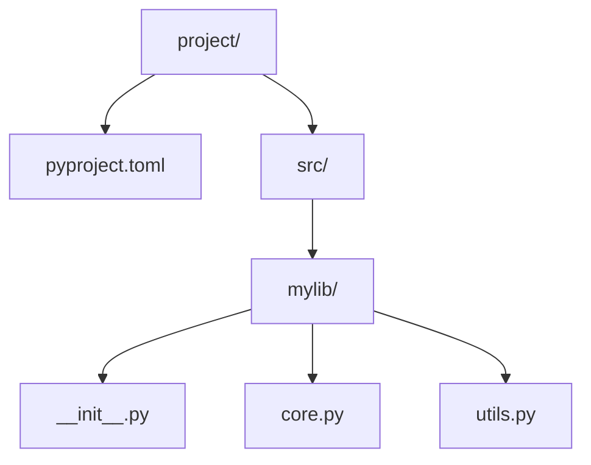

# pyproject.toml 与打包分发 (Packaging & Distribution)
---

## 章节概述

C 语言项目有 `Makefile` 和 `CMakeLists.txt` 定义如何编译代码，Python 项目有 `pyproject.toml` 定义项目的元数据、依赖关系和构建方式。`pyproject.toml`（PEP 518/621）是现代 Python 打包的标准入口——它统一了项目配置，结束了过去 `setup.py`、`setup.cfg`、`MANIFEST.in`、`requirements.txt` 各自为政的混乱局面。

本章从 C 程序员视角出发，将 `pyproject.toml` 与 `CMakeLists.txt` 逐项对比，讲解 Python 项目的构建、打包和分发全流程。

> **核心理念**：C 项目的"产出"是可执行文件或 .so/.a 库文件，Python 项目的"产出"是 wheel（`.whl`）或源码分发包（`.tar.gz`）。`pyproject.toml` 之于 Python 项目，就如 `CMakeLists.txt` 之于 C 项目——它描述"如何构建"和"产物是什么"。

---

### 第一节：pyproject.toml 结构详解

#### 1.1 最小化 pyproject.toml

```toml
[build-system]
requires = ["hatchling"]
build-backend = "hatchling.build"

[project]
name = "my-project"
version = "0.1.0"
description = "A sample Python project"
requires-python = ">=3.9"
```

> 仅此 8 行就定义了一个可安装的 Python 包。对比 C 项目的最小 CMakeLists.txt 至少也需要 `cmake_minimum_required` + `project` + `add_executable` 三行。

#### 1.2 完整项目元数据

```toml
[project]
name = "my-c-hybrid-tools"
version = "1.2.0"
description = "Build helpers and test tools for C projects"
readme = "README.md"
license = {text = "MIT"}
authors = [
 {name = "Your Name", email = "you@example.com"}
]
keywords = ["c", "build-tools", "testing"]
classifiers = [
 "Development Status :: 4 - Beta",
 "Programming Language :: Python :: 3",
 "Programming Language :: Python :: 3.9",
 "Programming Language :: Python :: 3.10",
 "Programming Language :: Python :: 3.11",
 "Programming Language :: Python :: 3.12",
 "Operating System :: OS Independent",
]
requires-python = ">=3.9"

# 依赖声明
dependencies = [
 "click>=8.0",
 "pyyaml>=6.0",
 "rich>=13.0",
]

# 可选依赖（按功能分组）
[project.optional-dependencies]
dev = [
 "pytest>=8.0",
 "ruff>=0.4",
 "mypy>=1.0",
]
docs = [
 "sphinx>=7.0",
 "myst-parser>=2.0",
]
```

> 与 C 对比：`CMakeLists.txt` 的 `find_package(foo REQUIRED)` 对应 `dependencies`，`project.optional-dependencies` 对应 CMake 的 `option()` + 条件 `find_package`。

#### 1.3 命令行入口点

```toml
[project.scripts]
# 安装后，直接在终端调用 mytool 命令
mytool = "my_project.cli:main"
build-helper = "my_project.build_helper:run"
```

安装后效果：

```bash
pip install .
# 现在可以直接运行：
mytool --help
build-helper --input config.json
```

> 与 C 对比：`[project.scripts]` 等价于 CMake 中的 `install(TARGETS mytool RUNTIME DESTINATION bin)`。两者都将可执行入口安装到 `$PATH` 中。

#### 1.4 完整的 pyproject.toml 示例

```toml
[build-system]
requires = ["hatchling>=1.18"]
build-backend = "hatchling.build"

[project]
name = "c-project-tools"
version = "0.1.0"
description = "Tools for managing C projects with Python"
requires-python = ">=3.9"
dependencies = ["click>=8.0", "jinja2>=3.0"]
readme = "README.md"

[project.scripts]
cgen = "c_project_tools.cli:main"

[project.optional-dependencies]
test = ["pytest>=8.0", "pytest-cov>=5.0"]
lint = ["ruff>=0.4", "mypy>=1.0"]

[tool.ruff]
line-length = 100
target-version = "py39"

[tool.ruff.lint]
select = ["E", "F", "I", "N", "W"]

[tool.mypy]
python_version = "3.9"
strict = true
ignore_missing_imports = true

[tool.pytest.ini_options]
minversion = "8.0"
testpaths = ["tests"]
addopts = "-ra -q --strict-markers"
```

> `[tool.*]` 配置段是 pyproject.toml 的另一大优势——把 ruff、mypy、pytest、coverage 等工具的配置全部集中在同一个文件中，类似于 CMakeLists.txt 集中管理 C 项目的编译选项、测试设置、安装规则。

### 小节练习


---

### 第二节：构建后端对比

#### 2.1 三大主流构建后端

| 后端 | 速度 | 复杂度 | 配置方式 | 适用场景 |
|------|------|--------|---------|---------|
| **hatchling** | 快 | 低 | 纯 pyproject.toml | 纯 Python 包，推荐首选 |
| **setuptools** | 中 | 高 | pyproject.toml + setup.cfg | 含 C 扩展的传统项目 |
| **flit** | 极快 | 极低 | 纯 pyproject.toml | 纯 Python 小包 |

```toml
# hatchling —— 新一代默认选择
[build-system]
requires = ["hatchling"]
build-backend = "hatchling.build"

# setuptools —— 传统选择（需 C 扩展时）
[build-system]
requires = ["setuptools>=68", "wheel"]
build-backend = "setuptools.build_meta"

# flit —— 极简选择
[build-system]
requires = ["flit_core>=3.9"]
build-backend = "flit_core.buildapi"
```

#### 2.2 hatchling：推荐的新项目选择

```toml
[build-system]
requires = ["hatchling"]
build-backend = "hatchling.build"

[project]
name = "mylib"
version = "0.1.0"

[tool.hatch.build.targets.wheel]
packages = ["src/mylib"] # 仅打包 src/mylib 目录
```

hatchling 默认使用 Python 包发现机制，自动识别 `src/` 布局：



#### 2.3 setuptools：兼容包含 C 扩展的包

```toml
[tool.setuptools.packages.find]
where = ["src"]

[tool.setuptools.package-data]
mylib = ["*.so", "*.dll", "*.dylib"]
```

> 如果你的 Python 包通过 ctypes 或 cffi 调用 C 预编译库，setuptools 能将 `.so` 文件一同打包进 wheel。

### 小节练习


---

### 第三节：构建产物 —— wheel 与 sdist

#### 3.1 构建命令

```bash
# 安装构建工具
pip install build

# 构建 wheel 和源码分发包
python -m build

# 产物在 dist/ 目录下
ls dist/
# my_project-0.1.0-py3-none-any.whl ← wheel（预编译包）
# my_project-0.1.0.tar.gz ← sdist（源码分发包）
```

#### 3.2 wheel 文件名解析

```
my_project-0.1.0-py3-none-any.whl
 ^^^^^^^^ ^^^ ^^^ ^^^^ ^^^
 包名 版本 Python ABI 平台
 版本
```

| 字段 | 含义 | 示例 |
|------|------|------|
| py3 | Python 3 所有子版本兼容 | `py3` = Python 3.x |
| none | 无 C ABI 依赖（纯 Python）| `none` / `cp312` |
| any | 任意平台 | `any` / `linux_x86_64` / `macosx_14_0_arm64` |

包含 C 扩展的 wheel：

```
numpy-1.26.4-cp312-cp312-manylinux_2_28_x86_64.whl
# cp312 = CPython 3.12 的 ABI
# manylinux = 兼容多发行版的 Linux x86_64
```

#### 3.3 安装方式对比

```bash
# 从 PyPI 安装
pip install my-project

# 从本地 wheel 安装
pip install dist/my_project-0.1.0-py3-none-any.whl

# 开发模式安装（源码修改立即生效）
pip install -e .

# 从 Git 仓库安装
pip install git+https://github.com/user/repo.git
```

> 与 C 对比：`pip install -e .` 相当于 C 项目的 `make && make install`（源码方式），而 wheel 安装相当于 `apt install xxx.deb`（预编译包）。`-e`（editable）模式创建指向源码目录的链接，修改 `.py` 文件无需重新安装——这比 C 的增量编译更直接，因为 Python 没有编译步骤。

### 小节练习


> [!question] 判断题 1
> `pip install -e .` 安装后修改源码需要重新执行该命令才能生效。 （ ）
> - [ ] 正确
> - [ ] 错误
>
> > [!success]- 点击查看答案
> > 答案: 错误
> > **解析**: `-e`（editable）模式通过 `.pth` 文件将源码目录注入 `sys.path`，修改 `.py` 文件后即刻生效，无需重新安装。

---

### 第四节：pyproject.toml vs CMakeLists.txt 全面对比

| 概念 | Python (pyproject.toml) | C (CMakeLists.txt) |
|------|------------------------|---------------------|
| 项目名 | `[project] name = "foo"` | `project(Foo C)` |
| 版本 | `version = "1.0.0"` | `project(Foo VERSION 1.0.0)` |
| 依赖 | `dependencies = ["lib>=1.0"]` | `find_package(lib 1.0 REQUIRED)` |
| 构建目标 | `[project.scripts]` | `add_executable(foo main.c)` |
| 头文件/包路径 | `[tool.setuptools.packages.find]` | `target_include_directories` |
| 可选功能 | `[project.optional-dependencies]` | `option(BUILD_TESTS "..." ON)` |
| 测试 | `[tool.pytest.ini_options]` | `enable_testing()` + `add_test()` |
| 安装规则 | 自动（pip 处理） | `install(TARGETS ...)` |
| 构建配置 | `[tool.*]` 段 | `set(CMAKE_C_FLAGS ...)` |
| C 扩展 | `[tool.setuptools]` ext_modules | `add_library(foo SHARED ...)` |

#### 4.1 混合项目的 pyproject.toml

```toml
[build-system]
requires = ["setuptools>=68", "wheel"]
build-backend = "setuptools.build_meta"

[project]
name = "cfib-wrapper"
version = "0.1.0"
description = "Python wrapper for C fibonacci library"
requires-python = ">=3.9"
dependencies = []

[project.scripts]
cfib = "cfib_wrapper.cli:main"

[tool.setuptools.packages.find]
where = ["src"]
```

对应的 CMakeLists.txt 可以这样配合：

```cmake
cmake_minimum_required(VERSION 3.18)
project(CFib C)

add_library(fib SHARED src/fib.c)
set_target_properties(fib PROPERTIES
 LIBRARY_OUTPUT_DIRECTORY "${CMAKE_SOURCE_DIR}/src/cfib_wrapper"
)
```

> 这种混合项目中，CMake 负责编译 C 共享库，pyproject.toml 负责打包 Python 代码和编译好的 `.so`。

### 小节练习


---

## 章节测试

### 一、判断题

> [!question] 判断题 1
> pyproject.toml 是 Python 项目的唯一合法配置文件格式，所有 Python 项目必须使用它。 （ ）
> - [ ] 正确
> - [ ] 错误
>
> > [!success]- 点击查看答案
> > 答案: 错误
> > **解析**: pyproject.toml 是 PEP 推荐的现代标准，但许多现有项目仍使用 `setup.py` + `setup.cfg` 格式。新项目建议使用 pyproject.toml。

> [!question] 判断题 2
> hatchling 和 setuptools 都是构建后端，可以互相替代。 （ ）
> - [ ] 正确
> - [ ] 错误
>
> > [!success]- 点击查看答案
> > 答案: 正确
> > **解析**: 两者都是符合 PEP 517 标准的构建后端，可以互相替代。hatchling 更现代、更快，setuptools 更传统、支持 C 扩展。

> [!question] 判断题 3
> wheel 文件是二进制的平台无关包，可在任何操作系统上直接安装。 （ ）
> - [ ] 正确
> - [ ] 错误
>
> > [!success]- 点击查看答案
> > 答案: 错误
> > **解析**: 纯 Python wheel（`py3-none-any`）是平台无关的，但包含 C 扩展的 wheel（如 `cp312-linux_x86_64`）是平台相关的，只能在特定平台和 Python 版本上安装。

> [!question] 判断题 4
> `pip install -e .` 会将项目编译为 wheel 后再安装。 （ ）
> - [ ] 正确
> - [ ] 错误
>
> > [!success]- 点击查看答案
> > 答案: 错误
> > **解析**: `-e`（editable）模式不产生 wheel 文件，而是通过 `.pth` 文件将源码路径注册到 site-packages，实现"修改即生效"。

> [!question] 判断题 5
> `[project.optional-dependencies]` 中定义的依赖在 `pip install .` 时会被自动安装。 （ ）
> - [ ] 正确
> - [ ] 错误
>
> > [!success]- 点击查看答案
> > 答案: 错误
> > **解析**: 可选依赖需要显式指定才会安装，如 `pip install ".[dev]"` 安装 dev 组依赖。`pip install .` 只安装 `dependencies` 中的必需依赖。

> [!question] 判断题 6
> sdist（源码分发包）中包含编译好的 `.so` 文件。 （ ）
> - [ ] 正确
> - [ ] 错误
>
> > [!success]- 点击查看答案
> > 答案: 错误
> > **解析**: sdist（`.tar.gz`）只包含源代码，wheel（`.whl`）才包含预编译内容。用户从 sdist 安装时需要本地编译（包括 C 扩展）。


---

## 力扣练习

以下题目用于验证本章所学内容：

| 题号 | 题目 | 链接 | 涉及知识点 |
|------|------|------|-----------|
| — | 本章无对应力扣题 | — | 请用动手练习题自检 |


### 动手练习题

> [!example] 练习题 1：创建一个可安装的 Python 包
> **难度**: 简单
>
> 1. 创建以下目录结构：
> ```mermaid
> graph TB
>  MYTOOL["mytool/"]
>  MYTOOL --> PPROJ2["pyproject.toml"]
>  MYTOOL --> SRC2["src/"]
>  SRC2 --> MYTOOL2["mytool/"]
>  MYTOOL2 --> INIT2["__init__.py"]
>  MYTOOL2 --> CLI["cli.py<br/>def main(): print(...)"]
>  MYTOOL2 --> UTILS2["utils.py<br/>def add(a, b): return a + b"]
> ```
> 2. 在 pyproject.toml 中配置 `[project.scripts]`，使 `mytool` 命令可以调用 `cli.main`
> 3. 用 `pip install -e .` 安装，验证 `mytool` 命令可用
> 4. 用 `python -m build` 构建 wheel，查看 `dist/` 目录中的产物

> [!example] 练习题 2：对比三种构建后端
> **难度**: 简单
>
> 为同一个简单项目分别编写 hatchling、setuptools、flit 三种构建方式的 pyproject.toml。用 `python -m build` 构建，对比：
> - 构建速度（用 `time` 测量）
> - 生成的 wheel 大小
> - wheel 的文件名差异
> - sdist 的内容差异（`tar -tzf dist/*.tar.gz`）

> [!example] 练习题 3：混合项目的打包
> **难度**: 简单
>
> 创建一个包含 C `.so` 文件的 Python 包：
> 1. 编写 `libhello.c`（导出 `const char* hello()` 函数），编译为 `libhello.so`
> 2. 编写 Python 包 `hello_wrapper/，用 ctypes 调用 libhello.so`
> 3. 配置 pyproject.toml（使用 setuptools），使 `libhello.so` 被打包进 wheel
> 4. 构建 wheel，在另一个虚拟环境中安装并测试

> [!example] 练习题 4：入口点与命令行工具
> **难度**: 简单
>
> 编写一个名为 `c-build` 的命令行工具：
> - 接受参数 `--project-dir` 和 `--build-type`（Debug/Release）
> - 在当前目录查找 `CMakeLists.txt`，执行 `cmake -B build -DCMAKE_BUILD_TYPE=...`
> - 配置 pyproject.toml 使其可通过 `pip install` 后直接调用 `c-build`
> - （提示：使用 `subprocess.run` 封装 cmake 命令）
