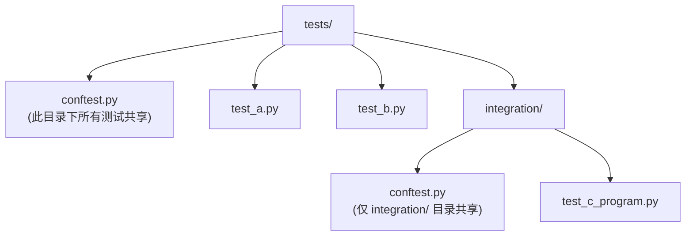

# pytest：单元测试与 C 项目联测 (Testing with pytest)
---

## 章节概述

C 程序员测试 C 代码时，通常使用 Unity、CMock、Check 等框架——测试本身也是 C 代码，编译后运行。Python 的测试方式则不同：pytest 通过自动发现、内置断言、fixture 机制和参数化测试，让写测试变得几乎零开销。更强大的是，pytest 可以测试任何东西——包括你的 C 程序。本章从 pytest 基础语法开始，逐步深入到通过 subprocess 测试 C 可执行文件、通过 ctypes 直接调用 C 库函数，最后展示一个编译 + 测试 C 程序的完整 pytest fixture。

> **核心理念**：C 测试框架要求测试本身通过编译——"如果测试代码有 bug，谁来测试测试？"pytest 绕过了这个哲学问题：Python 是解释执行的，写错测试不会导致编译失败，而且 pytest 的断言失败信息远比 Unity 的 `TEST_ASSERT_EQUAL(3, result)` 直观。用 Python 测试 C 代码，是用一种更高效的语言去验证另一种更底层语言的行为。

---

### 第一节：pytest 基础入门

#### 1.1 安装与第一个测试

```bash
# 安装 pytest
pip install pytest

# 或使用 uv
uv pip install pytest
```

创建第一个测试文件：

```python
# test_math.py
def add(a, b):
 return a + b

def test_add():
 assert add(2, 3) == 5
 assert add(-1, 1) == 0
 assert add(0, 0) == 0

def test_add_floats():
 assert add(1.5, 2.5) == 4.0
```

运行：

```bash
pytest test_math.py -v
```

输出：

```
test_math.py::test_add PASSED
test_math.py::test_add_floats PASSED

========================= 2 passed in 0.01s =========================
```

> 与 C 对比：Unity 测试需要 `TEST_ASSERT_EQUAL(5, add(2, 3))` 并编译运行，pytest 仅需 `assert add(2, 3) == 5` 加 `pytest` 命令。少了编译步骤，多了断言失败时的详细上下文（pytest 会显示表达式两边的值）。

#### 1.2 测试发现规则

pytest 自动发现以下模式的测试：

| 规则 | 示例 |
|------|------|
| 文件名以 `test_` 开头 | `test_math.py` |
| 文件名以 `_test` 结尾 | `math_test.py` |
| 类名以 `Test` 开头 | `class TestMath:` |
| 函数名以 `test_` 开头 | `def test_add():` |

```bash
# 运行所有测试
pytest

# 运行指定文件
pytest tests/test_math.py

# 运行匹配名称的测试
pytest -k "test_add"

# 显示详细输出（包括 print）
pytest -v -s
```

---

### 第二节：fixture 机制

fixture 是 pytest 最强大的特性——类似于 C 测试框架中的 `setUp()`/`tearDown()`，但更灵活。

#### 2.1 基础 fixture

```python
import pytest

@pytest.fixture
def sample_data():
 """准备测试数据，测试结束后清理"""
 data = {"name": "test", "values": [1, 2, 3]}
 yield data # yield 前 = setUp, yield 后 = tearDown
 print("Cleaning up...") # 只有使用 -s 时可见

def test_data_access(sample_data):
 assert sample_data["name"] == "test"
 assert len(sample_data["values"]) == 3
```

> 与 C 对比：Unity 的 `setUp()`/`tearDown()` 在每个测试前后执行，必须写在单独的 runner 文件中。pytest 的 fixture 在测试函数参数中声明即可，语法更自然。

#### 2.2 fixture 作用域

```python
@pytest.fixture(scope="function") # 默认：每个测试函数都创建（类似 Unity setUp）
def per_test():
 return []

@pytest.fixture(scope="module") # 每个模块创建一次
def module_data():
 return {"shared": True}

@pytest.fixture(scope="session") # 整个测试会话创建一次（缓存编译产物）
def compiled_c_program():
 import subprocess
 subprocess.run(["gcc", "-o", "prog", "main.c"], check=True)
 yield "prog"
 import os
 os.remove("prog")
```

#### 2.3 conftest.py：共享 fixture



```python
# tests/conftest.py
import pytest
import os

@pytest.fixture(scope="session")
def project_root():
 """返回项目根目录"""
 return os.path.dirname(os.path.dirname(__file__))

@pytest.fixture(scope="session")
def build_dir(project_root):
 build = os.path.join(project_root, "build")
 os.makedirs(build, exist_ok=True)
 return build
```

---

### 第三节：参数化测试与标记

#### 3.1 @pytest.mark.parametrize

```python
import pytest

def fibonacci(n):
 if n <= 1:
 return n
 return fibonacci(n - 1) + fibonacci(n - 2)

@pytest.mark.parametrize("n,expected", [
 (0, 0),
 (1, 1),
 (2, 1),
 (3, 2),
 (5, 5),
 (10, 55),
])
def test_fibonacci(n, expected):
 assert fibonacci(n) == expected
```

运行时每个参数组合变成独立的测试用例：

```
test_fib.py::test_fibonacci[0-0] PASSED
test_fib.py::test_fibonacci[1-1] PASSED
test_fib.py::test_fibonacci[2-1] PASSED
test_fib.py::test_fibonacci[3-2] PASSED
test_fib.py::test_fibonacci[5-5] PASSED
test_fib.py::test_fibonacci[10-55] PASSED
```

> 与 C 对比：Unity 的参数化需要手动写循环或使用宏展开（`TEST_RANGE`），pytest 的参数化是声明式的，且每个参数组合有独立的测试名称和通过/失败状态。

#### 3.2 标记与跳过

```python
@pytest.mark.slow
def test_heavy_computation():
 import time
 time.sleep(2)
 assert True

@pytest.mark.skip(reason="C library not yet compiled")
def test_cffi_call():
 pass

@pytest.mark.skipif(sys.platform == "win32", reason="Unix-only")
def test_unix_socket():
 pass

@pytest.mark.parametrize("compiler", ["gcc", "clang"])
def test_compiles(compiler):
 result = subprocess.run([compiler, "--version"], capture_output=True)
 assert result.returncode == 0
```

```bash
# 只运行标记为 slow 的测试
pytest -m slow

# 跳过标记为 slow 的测试
pytest -m "not slow"

# 列出所有标记
pytest --markers
```

---

### 第四节：用 pytest 测试 C 程序

#### 4.1 黑盒测试：subprocess 运行 C 可执行文件

这是最直接的方式——将 C 程序当作可执行文件，通过 subprocess 捕获 stdout/stderr 验证行为。

```python
# tests/test_sort.py
import subprocess
import pytest
import os

@pytest.fixture(scope="module")
def sort_program():
 """编译 C 排序程序，返回可执行文件路径"""
 src = "sort.c"
 out = "sort_prog"
 result = subprocess.run(
 ["gcc", "-Wall", "-Wextra", "-O0", "-o", out, src],
 capture_output=True, text=True
 )
 if result.returncode != 0:
 pytest.fail(f"Compilation failed:\n{result.stderr}")
 yield out
 os.remove(out)

def run_sort(program, input_str):
 """运行排序程序并返回输出"""
 result = subprocess.run(
 [f"./{program}"],
 input=input_str,
 capture_output=True,
 text=True,
 timeout=5
 )
 return result.stdout.strip()

def test_sort_empty(sort_program):
 output = run_sort(sort_program, "")
 assert output == ""

def test_sort_single(sort_program):
 output = run_sort(sort_program, "5")
 assert output == "5"

def test_sort_normal(sort_program):
 output = run_sort(sort_program, "3 1 4 1 5 9 2 6")
 assert output == "1 1 2 3 4 5 6 9"

def test_sort_negative_numbers(sort_program):
 output = run_sort(sort_program, "-3 5 -1 0 2 -8")
 assert output == "-8 -3 -1 0 2 5"
```

> 这种模式类似于在 Shell 脚本中测试 C 程序，但 pytest 提供了更好的断言、参数化和报告。对于不暴露 C API 的独立 CLI 工具，这是最实用的测试方案。

#### 4.2 白盒测试：ctypes 调用 C 库函数

如果 C 代码编译为共享库（`.so`），pytest 可以通过 ctypes 直接调用 C 函数：

```c
// mathlib.h
#ifndef MATHLIB_H
#define MATHLIB_H
int add(int a, int b);
int factorial(int n);
int is_prime(int n);
#endif

// mathlib.c
#include "mathlib.h"
int add(int a, int b) { return a + b; }
int factorial(int n) {
 if (n <= 1) return 1;
 return n * factorial(n - 1);
}
int is_prime(int n) {
 if (n < 2) return 0;
 for (int i = 2; i * i <= n; i++)
 if (n % i == 0) return 0;
 return 1;
}
```

```bash
# 编译为共享库
gcc -shared -fPIC -o libmathlib.so mathlib.c
```

> **跨平台提示**：
> - **Windows**：编译为 `.dll`（`gcc -shared -o libmathlib.dll mathlib.c`），加载用 `ctypes.CDLL("./libmathlib.dll")`
> - **macOS**：编译为 `.dylib`（`gcc -shared -o libmathlib.dylib mathlib.c`），加载后缀自动适配

```python
# tests/test_mathlib.py
import ctypes
import pytest
import os

@pytest.fixture(scope="module")
def mathlib():
 lib = ctypes.CDLL("./libmathlib.so")
 lib.add.argtypes = [ctypes.c_int, ctypes.c_int]
 lib.add.restype = ctypes.c_int
 lib.factorial.argtypes = [ctypes.c_int]
 lib.factorial.restype = ctypes.c_int
 lib.is_prime.argtypes = [ctypes.c_int]
 lib.is_prime.restype = ctypes.c_int
 return lib

def test_add(mathlib):
 assert mathlib.add(2, 3) == 5
 assert mathlib.add(-1, 1) == 0

@pytest.mark.parametrize("n,expected", [(0, 1), (1, 1), (3, 6), (5, 120)])
def test_factorial(mathlib, n, expected):
 assert mathlib.factorial(n) == expected

@pytest.mark.parametrize("n,expected", [
 (2, 1), (3, 1), (4, 0), (17, 1), (97, 1), (100, 0)
])
def test_is_prime(mathlib, n, expected):
 assert mathlib.is_prime(n) == expected
```

> 与 C 对比：Unity 测试 C 代码时，测试本身也是 C 代码——`TEST_ASSERT_EQUAL(5, add(2, 3))`。pytest + ctypes 的优势是：测试逻辑用 Python 写，调用更灵活，断言输出更详细。

#### 4.3 完整的编译 + 测试 fixture

```python
# tests/conftest.py
import subprocess
import pytest
import os
import shutil

BUILD_DIR = "_build_test"

@pytest.fixture(scope="session")
def build_c_library():
 """编译 C 共享库，整个测试会话只编译一次"""
 os.makedirs(BUILD_DIR, exist_ok=True)

 sources = ["src/mathlib.c", "src/utils.c"]
 output = os.path.join(BUILD_DIR, "libtest.so")

 cmd = [
 "gcc", "-shared", "-fPIC",
 "-Wall", "-Wextra", "-g", "-O0",
 "-o", output, *sources,
 "-I", "include"
 ]
 result = subprocess.run(cmd, capture_output=True, text=True)

 if result.returncode != 0:
 shutil.rmtree(BUILD_DIR, ignore_errors=True)
 pytest.fail(f"Build failed:\n{result.stderr}")

 if result.stderr:
 print(f"[compiler warnings]\n{result.stderr}")

 yield output

 # 清理（也可保留用于调试）
 shutil.rmtree(BUILD_DIR, ignore_errors=True)

@pytest.fixture
def clib(build_c_library):
 """每个测试获取一个新的库加载句柄"""
 import ctypes
 lib = ctypes.CDLL(build_c_library)
 yield lib
 # ctypes 自动管理句柄
```

---

### 第五节：pytest vs C 测试框架全面对比

| 特性 | pytest | Unity (C) | CMock (C) | Google Test (C++) |
|------|--------|-----------|-----------|-------------------|
| 测试语言 | Python | C | C | C++ |
| 断言语法 | `assert x == y` | `TEST_ASSERT_EQUAL(expected, actual)` | `TEST_ASSERT_EQUAL` | `EXPECT_EQ(x, y)` |
| 编译 | 无需编译 | 编译测试 + 被测代码 | 编译测试 + mock | 编译测试 + 被测代码 |
| Mock | `unittest.mock` | 无（需 CMock） | 自动生成 mock | `EXPECT_CALL` |
| 参数化 | `@parametrize` | 手动循环 | 手动循环 | `TEST_P` |
| fixture | `@pytest.fixture` | `setUp()`/`tearDown()` | `setUp()`/`tearDown()` | `SetUp()`/`TearDown()` |
| 并行执行 | `pytest-xdist` | 无内置 | 无内置 | 无内置 |
| 覆盖率报告 | `pytest-cov` | `gcov` + `lcov` | `gcov` + `lcov` | `gcov` + `lcov` |
| 发现测试 | 自动发现 | 手动注册 | 手动注册 | 自动发现（部分） |

> **关键洞察**：pytest 最大的优势不是语法糖，而是"用 Python 编写测试逻辑"。当你需要生成海量测试数据、读取 JSON 配置文件、调用外部 API 验证结果时，Python 的生态远胜于 C。

---

## 力扣练习

以下题目用于验证本章所学内容：

| 题号 | 题目 | 链接 | 涉及知识点 |
|------|------|------|-----------|
| — | 本章无对应力扣题 | — | 请用动手练习题自检 |
