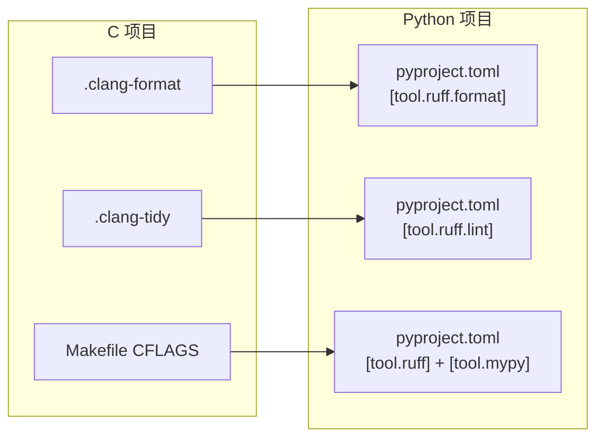

# ruff 与 mypy：代码质量 (Code Quality)
---

## 章节概述

C 语言项目中，代码质量由 clang-format（格式化）、clang-tidy（静态分析）、cppcheck（深度检查）、`-Wall -Wextra`（编译警告）共同保证。Python 的"编译器"（解释器）没有 `-Wall` 这类编译时检查——类型错误在运行时才会暴露。因此 Python 需要专门的工具来填补这个空白：**ruff**（闪电般的 linter + formatter，替代 flake8/isort/black）和 **mypy**（静态类型检查器，让 Python 也拥有类似 C 的类型安全）。本章从 C 程序员视角讲解 Python 代码质量工具的配置与使用。

> **核心理念**：C 的编译警告在编译时告诉你"可能有问题"，Python 没有编译步骤，但 ruff 和 mypy 填补了这道防线。ruff 相当于 `clang-format` + `clang-tidy` + `-Wall` 的结合体，mypy 相当于给动态类型的 Python 加上了"静态类型 lint"——在你运行代码之前就发现类型错误。

---

### 第一节：ruff —— Python 的瑞士军刀

#### 1.1 安装与首次使用

```bash
# 安装
pip install ruff

# 或使用 uv
uv pip install ruff

# 检查代码
ruff check myfile.py

# 自动修复
ruff check --fix myfile.py

# 格式化代码（替代 black）
ruff format myfile.py
```

#### 1.2 ruff 替代了什么？

在 ruff 出现之前，Python 项目的质量工具链通常包含 4-5 个独立工具：

| 旧工具 | 功能 | ruff 替代 |
|--------|------|-----------|
| flake8 | lint 检查 | `ruff check` |
| isort | import 排序 | `ruff check --fix`（I 规则） |
| pyflakes | 错误检测 | `ruff check`（F 规则） |
| pycodestyle | PEP 8 风格 | `ruff check` |
| black | 代码格式化 | `ruff format` |

> 与 C 对比：C 语言中 clang-tidy 和 clang-format 是两个独立工具，ruff 将其统一为一个命令。从工程角度看，一个工具维护比 5 个工具组合更可靠。

#### 1.3 内置规则集

```bash
# 查看所有可用规则
ruff linter

# 查看当前启用的规则
ruff check --show-settings
```

常用规则前缀：

| 前缀 | 含义 | 示例 |
|------|------|------|
| `E` / `W` | pycodestyle 错误/警告 | 行太长、多余空格 |
| `F` | Pyflakes 错误检测 | 未定义变量、未使用导入 |
| `I` | isort 导入排序 | import 顺序混乱 |
| `N` | pep8-naming 命名约定 | 类名应用 CamelCase |
| `B` | flake8-bugbear 常见 bug | 可变默认参数 |
| `SIM` | flake8-simplify 简化建议 | 可简化的条件表达式 |
| `UP` | pyupgrade 语法升级 | 使用现代 Python 语法 |
| `C4` | flake8-comprehensions | 推导式建议 |

#### 1.4 pyproject.toml 配置

```toml
[tool.ruff]
line-length = 100
target-version = "py39"

[tool.ruff.lint]
# 选择要启用的规则集
select = [
 "E", # pycodestyle 错误
 "F", # Pyflakes
 "I", # isort
 "N", # pep8-naming
 "W", # pycodestyle 警告
 "B", # flake8-bugbear
 "SIM", # 简化建议
 "UP", # 语法升级
]

# 忽略特定规则
ignore = [
 "E501", # 行太长（由 formatter 处理）
]

[tool.ruff.lint.isort]
# import 排序规则
known-first-party = ["myproject"]

[tool.ruff.format]
# 格式化选项
quote-style = "double"
indent-style = "space"
skip-magic-trailing-comma = false
line-ending = "auto"
```

#### 1.5 实战演示

```python
# before.py — 充满问题的代码
import os, sys, json
import datetime

def my_function( x,y ):
 unused_var = 42
 result=x+y
 return result

class myclass:
 pass

MyVariable = "should be lowercase"
```

```bash
ruff check before.py
```

输出：

```
before.py:1:1: I001 Import block is un-sorted or un-formatted
before.py:1:8: F401 [*] `os` imported but unused
before.py:1:12: F401 [*] `json` imported but unused
before.py:2:1: F401 [*] `datetime` imported but unused
before.py:4:5: E271 multiple spaces after keyword
before.py:4:22: E231 missing whitespace after ','
before.py:5:4: F841 [*] Local variable `unused_var` is assigned to but never used
before.py:9:6: N801 Class name `myclass` should use CapWords convention
before.py:13:0: N816 Variable `MyVariable` should be lowercase
```

自动修复：

```bash
ruff check --fix before.py
```

修复后 (`before.py`)：

```python
import sys


def my_function(x, y):
 result = x + y
 return result


class Myclass:
 pass


my_variable = "should be lowercase"
```

```bash
ruff format before.py # 进一步格式化缩进和换行
```

### 小节练习


---

### 第二节：mypy —— 静态类型检查

#### 2.1 为什么 Python 需要类型检查？

```python
# C 语言 —— 编译时就能发现类型错误
# int add(int a, int b) { return a + b; }
# add("hello", 42); // 编译错误！

# Python —— 运行时才报错
def add(a, b):
 return a + b

result = add("hello", 42)
# TypeError: can only concatenate str (not "int") to str
# 这行报错可能在生产环境中才触发！
```

mypy 让你在**不运行代码**的情况下发现类型错误：

```python
def add(a: int, b: int) -> int:
 return a + b

add("hello", 42) # mypy 会在 "编译" 时报告错误：
# error: Argument 1 to "add" has incompatible type "str"; expected "int"
```

#### 2.2 类型注解语法

```python
# 基本类型
name: str = "Alice"
age: int = 30
price: float = 99.99
is_valid: bool = True

# 容器类型（Python 3.9+）
names: list[str] = ["Alice", "Bob"]
scores: dict[str, int] = {"Alice": 95}
point: tuple[float, float] = (3.0, 4.0)
unique_ids: set[int] = {1, 2, 3}

# 可选类型
from typing import Optional
def find_user(id: int) -> Optional[str]:
 users = {1: "Alice"}
 return users.get(id) # 可能返回 None

# Union 类型
from typing import Union
def process(value: Union[int, str]) -> str:
 return str(value)

# Callable（函数签名）
from typing import Callable
def apply(func: Callable[[int, int], int], a: int, b: int) -> int:
 return func(a, b)

# Any —— 跳过类型检查（谨慎使用）
from typing import Any
def flexible(data: Any) -> Any:
 return data
```

> 与 C 对比：Python 的类型注解类似于 C 的函数原型声明（`int add(int a, int b)`），但有以下关键区别：
> - C 的类型是强制性的（不写类型无法编译），Python 的类型注解是可选的
> - C 的类型在运行时不存在（编译后丢弃），Python 的类型注解可通过 `__annotations__` 在运行时访问
> - C 是名义类型系统（`struct A` 和 `struct B` 即使结构相同也不同），Python/mypy 支持结构化子类型（Protocol）

#### 2.3 运行 mypy

```bash
# 安装
pip install mypy

# 检查单个文件
mypy script.py

# 检查整个项目
mypy src/

# 严格模式（推荐）
mypy --strict src/

# 忽略缺少类型注解的第三方库
mypy --ignore-missing-imports src/
```

#### 2.4 pyproject.toml 配置

```toml
[tool.mypy]
python_version = "3.9"
strict = true
warn_return_any = true
warn_unused_configs = true
disallow_untyped_defs = true
disallow_incomplete_defs = true
check_untyped_defs = true

# 忽略缺少 stub 包的第三方库
[[tool.mypy.overrides]]
module = [
 "click.*",
 "yaml.*",
]
ignore_missing_imports = true
```

#### 2.5 渐进式类型标注

对于已有大型项目，可以渐进式添加类型：

```bash
# 仅检查有类型注解的函数
mypy --check-untyped-defs src/

# 仅检查特定模块
mypy -m myproject.core

# 生成 HTML 报告查看覆盖情况
mypy --html-report ./mypy-report src/
```

### 小节练习


> [!question] 判断题 1
> Python 的类型注解在运行时会被解释器强制执行类型检查。 （ ）
> - [ ] 正确
> - [ ] 错误
>
> > [!success]- 点击查看答案
> > 答案: 错误
> > **解析**: Python 的类型注解在运行时**完全不做检查**——解释器仅将注解保存到 `__annotations__` 字典中，不会因类型不匹配而抛出错误。类型检查由 mypy 这类静态工具在运行前单独执行。

---

### 第三节：ruff + mypy 在 CI 中的配置

#### 3.1 Makefile 集成

```makefile
.PHONY: lint fmt typecheck check

lint:
	ruff check src/ tests/

fmt:
	ruff format --check src/ tests/

typecheck:
	mypy src/

# 全面检查
check: lint fmt typecheck
```

#### 3.2 pre-commit 钩子

```yaml
# .pre-commit-config.yaml
repos:
 - repo: https://github.com/astral-sh/ruff-pre-commit
 rev: v0.4.0
 hooks:
 - id: ruff
 args: [--fix]
 - id: ruff-format

 - repo: https://github.com/pre-commit/mirrors-mypy
 rev: v1.9.0
 hooks:
 - id: mypy
 args: [--strict, --ignore-missing-imports]
 additional_dependencies: [types-PyYAML]
```

```bash
pip install pre-commit
pre-commit install
# 之后每次 git commit 自动运行检查
```

> 与 C 对比：pre-commit 钩子类似于 C 项目中的 `make lint` 在 CI 中自动运行。区别是 pre-commit 在**本地提交前**就拦截问题，而非等到 CI 流水线。

#### 3.3 VSCode 集成

```json
{
 "python.analysis.typeCheckingMode": "strict",
 "[python]": {
 "editor.defaultFormatter": "charliermarsh.ruff",
 "editor.formatOnSave": true,
 "editor.codeActionsOnSave": {
 "source.fixAll.ruff": "explicit",
 "source.organizeImports.ruff": "explicit"
 }
 }
}
```

### 小节练习


---

### 第四节：Python 代码质量工具 vs C 代码质量工具

| 功能 | C 语言工具 | Python 工具 |
|------|-----------|-------------|
| 格式化 | clang-format | ruff format |
| 静态分析 | clang-tidy | ruff check |
| 编译警告 | `-Wall -Wextra` | ruff check（F/E/W 规则） |
| 类型检查 | 编译器内置 | mypy |
| 深度检查 | cppcheck | ruff（B/SIM 规则） |
| 死代码检测 | `-Wunused` | ruff（F401/F841） |
| import 管理 | `#include` 顺序检查 | ruff（I 规则） |
| 现代语法 | `-std=c17` | ruff（UP 规则） |

#### 4.1 配置文件的对应关系



> **核心差异**：C 语言的类型检查是编译器内置的、强制性的——`int x = "hello"` 无法编译。Python 的类型检查是可选的、工具辅助的——只有运行 mypy 才会发现 `x: int = "hello"`。这意味着 Python 项目的代码质量更多依赖于工程纪律和 CI 集成。

#### 4.2 质量工具对比示例

```c
// C 语言：编译器发现问题
#include <stdio.h>

int add(int a, int b) { return a + b; }

int main() {
 int unused = 42;
 int result = add("hello", 5); // 编译错误！
 // warning: passing argument 1 of 'add' makes integer from pointer
}
```

```python
# Python：如果不运行 ruff + mypy，这些错误会静默通过
def add(a: int, b: int) -> int:
 return a + b

unused = 42 # ruff: F841 -- 没问题，不报错

result = add("hello", 5) # mypy: error: Argument 1 has incompatible type "str"
 # ruff: 不检查类型
```

```bash
# C 语言的完整质量检查流程
clang-format --dry-run src/main.c # 格式检查
clang-tidy src/main.c -- -Iinclude # 静态分析
gcc -Wall -Wextra -Werror -c src/main.c # 编译 + 警告即错误
cppcheck --enable=all src/ # 深度检查

# Python 的完整质量检查流程
ruff format --check src/ # 格式检查
ruff check src/ # lint 检查
mypy --strict src/ # 类型检查
```

### 小节练习


> [!question] 判断题 1
> ruff check 可以检测出 Python 代码中的类型错误（如 `int` 传递给需要 `str` 的函数）。 （ ）
> - [ ] 正确
> - [ ] 错误
>
> > [!success]- 点击查看答案
> > 答案: 错误
> > **解析**: ruff 不做类型推断，不检查类型兼容性。类型错误需要 mypy 来检测。ruff 检查的是风格（E/W）、逻辑错误（F）、命名（N）、常见 bug（B）等。

---

## 章节测试

### 一、判断题

> [!question] 判断题 1
> ruff 是 Python 标准库的一部分，安装 Python 后自动可用。 （ ）
> - [ ] 正确
> - [ ] 错误
>
> > [!success]- 点击查看答案
> > 答案: 错误
> > **解析**: ruff 是第三方工具，需通过 `pip install ruff` 安装。Python 标准库不包含 lint 或格式化工具。

> [!question] 判断题 2
> mypy 可以在不运行 Python 代码的情况下发现类型错误。 （ ）
> - [ ] 正确
> - [ ] 错误
>
> > [!success]- 点击查看答案
> > 答案: 正确
> > **解析**: mypy 是静态类型检查器，通过分析源码（而非运行代码）来检查类型兼容性。这与 C 编译器在编译时检查类型类似。

> [!question] 判断题 3
> Python 的类型注解（如 `x: int = 5`）在运行时会被解释器强制执行。 （ ）
> - [ ] 正确
> - [ ] 错误
>
> > [!success]- 点击查看答案
> > 答案: 错误
> > **解析**: Python 运行时不会对类型注解做任何检查。注解仅作为元数据保存，类型检查由 mypy 等外部工具负责。

> [!question] 判断题 4
> `ruff check --fix` 可以自动修复所有检测到的问题。 （ ）
> - [ ] 正确
> - [ ] 错误
>
> > [!success]- 点击查看答案
> > 答案: 错误
> > **解析**: `--fix` 只能修复标记为 `[*]`（可自动修复）的规则。部分规则需要人工判断和修改，ruff 会在输出中标注。

> [!question] 判断题 5
> `ruff format` 的格式化风格与 black 完全兼容。 （ ）
> - [ ] 正确
> - [ ] 错误
>
> > [!success]- 点击查看答案
> > 答案: 正确
> > **解析**: `ruff format` 设计为 black 的兼容替代品，格式输出与 black 一致。项目可以从 black 无缝迁移到 ruff format。

> [!question] 判断题 6
> clang-format 和 ruff format 都是纯格式化工具，不做任何逻辑检查。 （ ）
> - [ ] 正确
> - [ ] 错误
>
> > [!success]- 点击查看答案
> > 答案: 正确
> > **解析**: clang-format 和 ruff format 都只关注代码格式（缩进、换行、空格），不涉及逻辑正确性。逻辑检查由 clang-tidy（C）和 ruff check（Python）负责。


---

## 力扣练习

以下题目用于验证本章所学内容：

| 题号 | 题目 | 链接 | 涉及知识点 |
|------|------|------|-----------|
| — | 本章无对应力扣题 | — | 请用动手练习题自检 |


### 动手练习题

> [!example] 练习题 1：修复一个"问题百出"的 Python 文件
> **难度**: 简单
>
> 创建 `messy.py`，故意引入以下问题：
> - 未使用的导入（`import os, json, math`）
> - 混乱的 import 顺序
> - 不一致的缩进（空格和制表符混用）
> - 未使用的变量
> - 类名使用小写（`class myclass`）
> - 多余的空格和空行
>
> 用 `ruff check messy.py` 列出所有问题，然后用 `ruff check --fix` + `ruff format` 自动修复。对比修复前后的文件。

> [!example] 练习题 2：为现有项目添加类型注解
> **难度**: 简单
>
> 取一个已存在的 Python 脚本（200 行以上），渐进式添加类型注解：
> 1. 先用 `mypy --check-untyped-defs` 查看当前状态
> 2. 为所有公共函数添加参数和返回值类型
> 3. 运行 `mypy --strict`，记录错误数量
> 4. 逐步修复类型错误，直到 `mypy --strict` 零错误
> 5. 在 pyproject.toml 中配置 mypy 和 ruff

> [!example] 练习题 3：为 C/Python 混合项目配置质量检查
> **难度**: 简单
>
> 为一个混合项目（C 代码在 `src/`，Python 脚本在 `scripts/`）配置质量检查：
> 1. 编写 `Makefile` 的 `lint` 目标：
> - C 代码：`clang-format --dry-run` + `clang-tidy`
> - Python 代码：`ruff check` + `ruff format --check` + `mypy`
> 2. 配置 `.pre-commit-config.yaml`：
> - C 代码：clang-format 钩子
> - Python 代码：ruff + mypy 钩子
> 3. 运行 `make lint` 确保通过

> [!example] 练习题 4：对比 ruff 与 flake8 的输出
> **难度**: 简单
>
> 安装 flake8 和 ruff，在同一个项目中运行两者：
> 1. `flake8 src/ --max-line-length=100`
> 2. `ruff check src/`
> 3. 对比输出差异——哪些规则 ruff 检测到但 flake8 没有？
> 4. 用 `time` 比较两者运行速度
