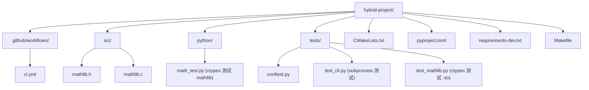

# GitHub Actions：Python 与 C 混合 CI (CI with GitHub Actions)
---

## 章节概述

C 语言项目传统的 CI 流程是：`git push` → CI 服务器拉取代码 → `cmake -B build && cmake --build build` → `ctest` → 生成报告。Python 项目有自己的 CI 模式：安装依赖、运行 lint、运行测试。当你的项目同时包含 C 和 Python 代码时（这在工程实践中很常见——C 是核心引擎，Python 是测试/构建/胶水层），CI 工作流需要同时处理两种语言的编译和测试。

本章从一个最小化的混合项目 CI 开始，逐步展示矩阵构建（多 Python 版本 × 多操作系统）、缓存优化、编译器选择和 C/Python 联合测试的完整 GitHub Actions 工作流。

> **核心理念**：GitHub Actions 的 `.github/workflows/ci.yml` 之于项目，如同 Makefile 之于源代码——它定义了"如何验证这个项目是正确的"。区别在于 Makefile 运行在本地，Actions 运行在云端，每次 `git push` 自动触发，确保所有平台和配置下代码都能正确编译和运行。

---

### 第一节：GitHub Actions 基础

#### 1.1 最小化 Python CI

```yaml
# .github/workflows/ci.yml
name: CI

on:
 push:
 branches: [main]
 pull_request:
 branches: [main]

jobs:
 test:
 runs-on: ubuntu-latest
 steps:
 - uses: actions/checkout@v4

 - name: Set up Python
 uses: actions/setup-python@v5
 with:
 python-version: "3.12"

 - name: Install dependencies
 run: |
 python -m pip install --upgrade pip
 pip install -r requirements.txt

 - name: Run tests
 run: pytest -v
```

> 与 C 对比：C 项目的 CI 需要安装编译器（`sudo apt install gcc`）、运行 cmake、make，然后 ctest。Python 项目的 CI 更简单——没有编译步骤，直接安装依赖即可测试。但当项目中同时有 C 代码时，两者的 CI 需要融合。

#### 1.2 矩阵构建

```yaml
jobs:
 test:
 runs-on: ${{ matrix.os }}
 strategy:
 matrix:
 os: [ubuntu-latest, macos-latest]
 python-version: ["3.9", "3.10", "3.11", "3.12"]

 steps:
 - uses: actions/checkout@v4

 - name: Set up Python ${{ matrix.python-version }}
 uses: actions/setup-python@v5
 with:
 python-version: ${{ matrix.python-version }}

 - name: Install dependencies
 run: pip install -r requirements.txt

 - name: Run tests
 run: pytest -v
```

这个矩阵生成 2 × 4 = 8 个并行任务，每个任务使用不同的 OS 和 Python 版本组合。runner 上的 Python 环境是完全隔离的——类似 8 个独立的虚拟环境。

---

### 第二节：Python + C 混合项目 CI

#### 2.1 最小混合 CI

```yaml
name: CI

on: [push, pull_request]

jobs:
 build-and-test:
 runs-on: ubuntu-latest
 steps:
 - uses: actions/checkout@v4

 # --- C 工具链 ---
  - name: Install C build tools
  run: |
  sudo apt-get update
  sudo apt-get install -y gcc gdb cmake

> **跨平台提示**：
> - **Windows**：GitHub Actions 使用 `windows-latest` runner，安装编译器用 `choco install mingw cmake` 或使用 Visual Studio 自带 `cl.exe`
> - **macOS**：`macos-latest` runner 上使用 `brew install gcc cmake` 或已预装的 clang
> - 矩阵构建中可混合 `ubuntu-latest`、`windows-latest`、`macos-latest` 实现全平台 CI

 # --- Python 工具链 ---
 - name: Set up Python
 uses: actions/setup-python@v5
 with:
 python-version: "3.12"

 - name: Install Python dependencies
 run: pip install pytest

 # --- 构建 C 代码 ---
 - name: Build C program
 run: |
 gcc -Wall -Wextra -g -O0 -o build/program src/main.c

 # --- 测试 C 程序（通过 Python） ---
 - name: Test C program via pytest
 run: pytest tests/ -v
```

#### 2.2 完整的混合项目 CI 工作流

```yaml
# .github/workflows/ci.yml
name: CI

on:
 push:
 branches: [main, develop]
 pull_request:
 branches: [main]

env:
 PYTHONUNBUFFERED: "1"

jobs:
 # ==================== Python 质量检查 ====================
 python-lint:
 runs-on: ubuntu-latest
 steps:
 - uses: actions/checkout@v4

 - uses: actions/setup-python@v5
 with:
 python-version: "3.12"

 - name: Install lint tools
 run: pip install ruff mypy

 - name: Lint (ruff)
 run: ruff check src/ tests/

 - name: Format check (ruff)
 run: ruff format --check src/ tests/

 - name: Type check (mypy)
 run: mypy --strict src/

 # ==================== C + Python 联合测试 ====================
 hybrid-test:
 needs: python-lint # lint 通过后才运行
 runs-on: ${{ matrix.os }}
 strategy:
 matrix:
 os: [ubuntu-latest, macos-latest]
 python-version: ["3.9", "3.12"]
 build-type: [Debug, Release]

 steps:
 - uses: actions/checkout@v4

 # --- 安装 C 编译器 ---
 - name: Install C toolchain (Ubuntu)
 if: runner.os == 'Linux'
 run: |
 sudo apt-get update
 sudo apt-get install -y gcc g++ gdb cmake valgrind

 - name: Install C toolchain (macOS)
 if: runner.os == 'macOS'
 run: |
 brew install gcc cmake

 # --- 安装 Python ---
 - name: Set up Python ${{ matrix.python-version }}
 uses: actions/setup-python@v5
 with:
 python-version: ${{ matrix.python-version }}
 cache: 'pip'

 - name: Install Python deps
 run: |
 python -m pip install --upgrade pip
 pip install -r requirements-dev.txt

 # --- 构建 C 代码 ---
 - name: Build C code
 run: |
 mkdir -p build
 cd build
 cmake .. \
 -DCMAKE_BUILD_TYPE=${{ matrix.build-type }} \
 -DCMAKE_C_FLAGS="-Wall -Wextra"
 cmake --build . --parallel $(nproc 2>/dev/null || sysctl -n hw.ncpu)

 # --- 运行测试 ---
 - name: Run Python tests
 run: pytest tests/ -v --tb=short

 - name: Run C tests (CTest)
 run: |
 cd build
 ctest --output-on-failure

 # --- 内存检查（仅 Debug + Ubuntu） ---
 - name: Memory check with Valgrind
 if: matrix.build-type == 'Debug' && runner.os == 'Linux'
 run: |
 valgrind --leak-check=full --error-exitcode=1 ./build/myprogram
```

---

### 第三节：缓存与速度优化

#### 3.1 pip 缓存

```yaml
- name: Set up Python
 uses: actions/setup-python@v5
 with:
 python-version: "3.12"
 cache: 'pip' # 自动缓存 pip
 cache-dependency-path: |
 requirements.txt
 requirements-dev.txt
```

`setup-python` 内置的 `cache: 'pip'` 自动缓存 `~/.cache/pip` 目录，后续运行无需重复下载包。

#### 3.2 uv 缓存（更快）

```yaml
- name: Install uv
 uses: astral-sh/setup-uv@v3

- name: Install Python deps (uv)
 run: uv pip sync requirements-dev.txt --system
```

uv 自带全局缓存，比 pip 的缓存更高效。

#### 3.3 C 编译缓存（ccache）

```yaml
- name: Setup ccache
 uses: hendrikmuhs/ccache-action@v1
 with:
 key: ${{ matrix.os }}-${{ matrix.build-type }}
 max-size: 200M

- name: Build C code
 run: |
 cd build
 cmake .. -DCMAKE_C_COMPILER_LAUNCHER=ccache
 cmake --build .
```

> ccache 对 C 项目的加速效果类似于 uv 缓存对 Python 的加速——避免重复编译未修改的 `.c` 文件。

#### 3.4 完整缓存策略对比

| 缓存目标 | Python 方法 | C 方法 |
|---------|-------------|--------|
| 依赖包 | `cache: 'pip'` 或 uv 全局缓存 | ccache |
| 构建产物 | `actions/cache` 缓存 `.venv/` | `actions/cache` 缓存 `build/` |
| 系统包 | apt 缓存 | apt 缓存 |

---

### 第四节：矩阵构建策略

#### 4.1 多维度矩阵

```yaml
strategy:
 matrix:
 os: [ubuntu-latest, macos-latest, windows-latest]
 python-version: ["3.9", "3.10", "3.11", "3.12"]
 compiler: [gcc, clang]
 exclude:
 # macOS 上不测试 gcc（macOS gcc 实际是 clang）
 - os: macos-latest
 compiler: gcc
 # Windows 上只测最新 Python
 - os: windows-latest
 python-version: "3.9"
 - os: windows-latest
 python-version: "3.10"
 - os: windows-latest
 python-version: "3.11"
```

> **重要**：3 × 4 × 2 = 24 个组合，减去 4 个 exclusion = 20 个并行 job。GitHub 免费计划限制 20 个并发 job，合理设计矩阵避免浪费资源。

#### 4.2 fail-fast 策略

```yaml
strategy:
 fail-fast: false # 一个 job 失败不取消其他 job
 matrix:
 ...
```

默认 `fail-fast: true` 会在任意 job 失败时取消其他正在运行的 job。对于混合项目，建议设为 `false`——C 构建在 macOS 上失败不应阻止 Linux 上的测试完成。

---

### 第五节：C/Python 联合测试的 CI 实现

#### 5.1 项目结构



#### 5.2 conftest.py — 在 CI 中编译 C 库

```python
# tests/conftest.py
import subprocess
import pytest
import sys
import os

@pytest.fixture(scope="session")
def compiled_shared_lib():
 """在 CI 中使用 CMake 编译 C 共享库"""
 build_dir = "build"
 os.makedirs(build_dir, exist_ok=True)

 # CMake 配置
 result = subprocess.run(
 ["cmake", "..", "-DCMAKE_BUILD_TYPE=Release"],
 cwd=build_dir, capture_output=True, text=True
 )
 if result.returncode != 0:
 pytest.fail(f"CMake configure failed:\n{result.stderr}")

 # 构建
 result = subprocess.run(
 ["cmake", "--build", ".", "--parallel"],
 cwd=build_dir, capture_output=True, text=True
 )
 if result.returncode != 0:
 pytest.fail(f"Build failed:\n{result.stderr}")

 # 返回 .so 路径
 ext = ".dylib" if sys.platform == "darwin" else ".so"
 return os.path.join(build_dir, f"libmathlib{ext}")

@pytest.fixture
def mathlib(compiled_shared_lib):
 import ctypes
 lib = ctypes.CDLL(compiled_shared_lib)
 lib.add.argtypes = [ctypes.c_int, ctypes.c_int]
 lib.add.restype = ctypes.c_int
 return lib
```

#### 5.3 最终的 CI 工作流

```yaml
# .github/workflows/ci.yml
name: C + Python Hybrid CI

on:
 push:
 branches: [main]
 pull_request:

env:
 PYTHONUNBUFFERED: "1"
 CTEST_OUTPUT_ON_FAILURE: "1"

jobs:
 lint:
 runs-on: ubuntu-latest
 steps:
 - uses: actions/checkout@v4
 - uses: actions/setup-python@v5
 with: {python-version: "3.12"}
 - run: pip install ruff mypy
 - run: ruff check python/ tests/
 - run: ruff format --check python/ tests/
 - run: mypy python/ --ignore-missing-imports

 test:
 needs: lint
 runs-on: ${{ matrix.os }}
 strategy:
 fail-fast: false
 matrix:
 os: [ubuntu-latest, macos-latest]
 python-version: ["3.9", "3.12"]
 build-type: [Debug, Release]

 steps:
 - uses: actions/checkout@v4

 - name: Install C tools (Linux)
 if: runner.os == 'Linux'
 run: sudo apt-get update && sudo apt-get install -y gcc cmake valgrind

 - name: Install C tools (macOS)
 if: runner.os == 'macOS'
 run: brew install cmake

 - uses: actions/setup-python@v5
 with:
 python-version: ${{ matrix.python-version }}

 - name: Install Python deps
 run: |
 pip install --upgrade pip
 pip install pytest

 - name: Build and test
 run: |
 mkdir -p build && cd build
 cmake .. -DCMAKE_BUILD_TYPE=${{ matrix.build-type }}
 cmake --build . --parallel
 ctest --output-on-failure

 - name: Python integration tests
 run: pytest tests/ -v

 - name: Valgrind memory check (Linux Debug only)
 if: matrix.build-type == 'Debug' && runner.os == 'Linux'
 run: valgrind --leak-check=full ./build/myprogram
```

> 这个工作流在每次 push 和 PR 时检查：C 代码能否编译、Python 测试能否通过、是否存在内存泄漏——覆盖了混合项目的完整质量维度。

---

## 力扣练习

以下题目用于验证本章所学内容：

| 题号 | 题目 | 链接 | 涉及知识点 |
|------|------|------|-----------|
| — | 本章无对应力扣题 | — | 请用动手练习题自检 |
