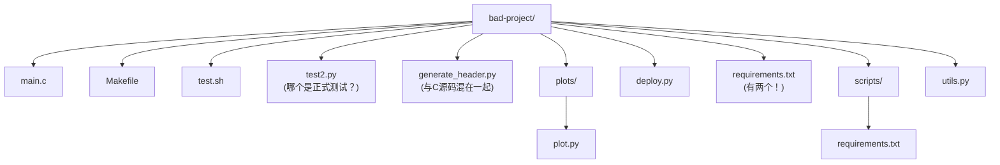
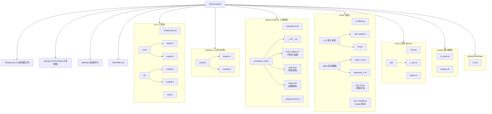

# C/C++ 混合项目中的 Python 工程实践 (Hybrid Project Engineering)
---

## 章节概述

现实世界中的 C/C++ 项目很少是纯 C 的——构建辅助脚本、代码生成器、文档生成、测试编排、性能基准测试，这些任务 Python 比 C 合适得多。本章讨论"以 C/C++ 为主体，Python 为辅助"的混合项目工程实践：项目布局设计、CMake 与 Python 脚本的集成、Python 作为胶水语言连接 C 模块，以及运行时的进程间数据交换。我们将看到一个完整的混合项目从目录结构到构建流水线的设计模式。

> **核心理念**：C 语言是引擎，Python 是方向盘和仪表盘。引擎负责高效运转（核心计算），Python 负责灵活控制（测试、配置、文档、部署）。一个好的混合项目不是"Python 项目里夹带 C 文件"，也不是"C 项目里乱放 Python 脚本"，而是有清晰的职责边界和可维护的工程结构。

---

### 第一节：混合项目的目录布局

#### 1.1 反模式：混乱的布局



#### 1.2 推荐布局



#### 1.3 布局原则

| 原则 | 说明 | 对比 C 项目 |
|------|------|-------------|
| `src/` 纯 C | Python 脚本不应混入 `src/` | C 项目也遵循这个原则 |
| `python/` 是工具包 | 可被 `pip install -e python/` 安装 | C 的 `tools/` 目录通常没有包结构 |
| `tests/` 混合测试 | C 测试 (`c/`)、Python 测试共存 | 纯 C 项目只有 `test/` |
| 根配置聚合 | CMakeLists.txt + pyproject.toml | 纯 C 只有 CMakeLists.txt |

---

### 第二节：CMake 集成 Python 脚本

#### 2.1 查找 Python 解释器

```cmake
# 根 CMakeLists.txt
cmake_minimum_required(VERSION 3.18)
project(HybridProject C)

# 查找 Python3（仅需要解释器，不需要开发库）
find_package(Python3 COMPONENTS Interpreter)

# 输出 Python 路径供后续使用
message(STATUS "Python: ${Python3_EXECUTABLE}")
message(STATUS "Python version: ${Python3_VERSION}")
```

#### 2.2 用 Python 生成 C 代码

这是一个常见场景——用 Python 脚本生成 C 头文件或源码。

```python
# python/src/project_tools/build_helper.py
"""代码生成器：从 JSON 配置生成 C 头文件"""
import json
import sys
from pathlib import Path

TEMPLATE = """/* Auto-generated by build_helper.py — DO NOT EDIT */
#ifndef {guard}
#define {guard}

{defines}

#endif /* {guard} */
"""

def generate_config_header(input_json: str, output_header: str) -> None:
 with open(input_json) as f:
 config = json.load(f)

 defines = []
 for key, value in config.items():
 if isinstance(value, bool):
 defines.append(f"#define {key} {'1' if value else '0'}")
 elif isinstance(value, int):
 defines.append(f"#define {key} {value}")
 elif isinstance(value, str):
 defines.append(f'#define {key} "{value}"')

 base_name = Path(output_header).stem.upper()
 content = TEMPLATE.format(
 guard=f"{base_name}_H",
 defines="\n".join(defines)
 )

 with open(output_header, "w") as f:
 f.write(content)

if __name__ == "__main__":
 generate_config_header(sys.argv[1], sys.argv[2])
```

```cmake
# CMakeLists.txt 中集成代码生成
set(CONFIG_JSON ${CMAKE_SOURCE_DIR}/config/build_config.json)
set(GENERATED_HEADER ${CMAKE_BINARY_DIR}/generated/config.h)

add_custom_command(
 OUTPUT ${GENERATED_HEADER}
 COMMAND ${Python3_EXECUTABLE}
 ${CMAKE_SOURCE_DIR}/python/src/project_tools/build_helper.py
 ${CONFIG_JSON}
 ${GENERATED_HEADER}
 DEPENDS
 ${CMAKE_SOURCE_DIR}/python/src/project_tools/build_helper.py
 ${CONFIG_JSON}
 COMMENT "Generating config.h from build_config.json"
)

# 创建目标以触发代码生成
add_custom_target(generate_config
 DEPENDS ${GENERATED_HEADER}
)

# 主目标依赖生成的头文件
add_executable(myprogram src/main.c ${GENERATED_HEADER})
add_dependencies(myprogram generate_config)
target_include_directories(myprogram PRIVATE ${CMAKE_BINARY_DIR}/generated)
```

> 这个模式类似 C 项目中的 `./configure` 脚本生成 `config.h`，但 Python 使其更易编写和维护。CMake 的 `add_custom_command` 确保 JSON 或生成脚本变化时自动重新生成。

#### 2.3 用 Python 运行构建后测试

```cmake
# 编译后自动运行 pytest
if(Python3_FOUND)
 add_custom_target(pytest
 COMMAND ${Python3_EXECUTABLE} -m pytest
 ${CMAKE_SOURCE_DIR}/tests/ -v
 WORKING_DIRECTORY ${CMAKE_BINARY_DIR}
 COMMENT "Running pytest integration tests"
 DEPENDS myprogram
 )
endif()
```

```bash
# 构建流程
cmake -B build
cmake --build build # 编译 C 代码
cmake --build build --target pytest # 运行 Python 集成测试
```

---

### 第三节：Python 作为 C 项目的胶水层

#### 3.1 构建辅助脚本

```python
# python/src/project_tools/build_helper.py
"""一键设置构建环境"""
import subprocess
import sys
from pathlib import Path

def setup_build(build_type: str = "Debug", generator: str = "Ninja") -> None:
 """配置 CMake 构建目录"""
 build_dir = Path("build") / build_type.lower()

 cmake_args = [
 "cmake", "-B", str(build_dir),
 "-G", generator,
 f"-DCMAKE_BUILD_TYPE={build_type}",
 "-DCMAKE_EXPORT_COMPILE_COMMANDS=ON",
 ]

 # 如果在虚拟环境中，使用虚拟环境的 Python
 venv_python = Path(sys.prefix) / "bin" / "python3"
 if venv_python.exists():
 cmake_args.append(f"-DPython3_EXECUTABLE={venv_python}")

 subprocess.run(cmake_args, check=True)
 print(f"Build configured: {build_dir}")

def build(build_type: str = "Debug", parallel: bool = True) -> None:
 """执行构建"""
 build_dir = Path("build") / build_type.lower()
 args = ["cmake", "--build", str(build_dir)]
 if parallel:
 args.append("--parallel")
 subprocess.run(args, check=True)
 print("Build complete")
```

#### 3.2 C 程序的 Python 测试运行器

```python
# python/src/project_tools/test_runner.py
"""编排 C 程序的测试流程"""
import subprocess
import json
from pathlib import Path
from typing import Any

class CProgramTester:
 def __init__(self, program_path: str):
 self.program = program_path

 def run(self, *args: str, stdin: str = "") -> subprocess.CompletedProcess:
 result = subprocess.run(
 [self.program, *args],
 input=stdin,
 capture_output=True,
 text=True,
 timeout=30,
 )
 return result

 def test_case(self, args: list[str], stdin: str,
 expected_stdout: str = "",
 expected_returncode: int = 0) -> dict[str, Any]:
 result = self.run(*args, stdin=stdin)
 passed = (
 result.returncode == expected_returncode
 and result.stdout.strip() == expected_stdout.strip()
 )
 return {
 "passed": passed,
 "args": args,
 "stdin": stdin,
 "expected": expected_stdout,
 "got": result.stdout.strip(),
 "returncode": result.returncode,
 "stderr": result.stderr,
 }

 def run_test_suite(self, test_cases: list[dict]) -> bool:
 all_passed = True
 for i, case in enumerate(test_cases):
 result = self.test_case(**case)
 status = "PASS" if result["passed"] else "FAIL"
 print(f" Test {i+1}: {status}")
 if not result["passed"]:
 all_passed = False
 print(f" Expected: {result['expected']!r}")
 print(f" Got: {result['got']!r}")
 return all_passed
```

---

### 第四节：运行时数据交换 —— subprocess + JSON

C 和 Python 之间最实用的数据交换方式不是 ctypes（耦合太紧），不是 pybind11（需要 C++），而是**管道 + JSON**。

#### 4.1 C 端：输出 JSON

```c
// src/core/analyzer.c
#include <stdio.h>
#include <stdlib.h>
#include <math.h>

typedef struct {
 double min;
 double max;
 double mean;
 double stddev;
} Stats;

Stats compute_stats(double *data, int n) {
 Stats s = {data[0], data[0], 0.0, 0.0};
 for (int i = 0; i < n; i++) {
 if (data[i] < s.min) s.min = data[i];
 if (data[i] > s.max) s.max = data[i];
 s.mean += data[i];
 }
 s.mean /= n;
 for (int i = 0; i < n; i++) {
 double diff = data[i] - s.mean;
 s.stddev += diff * diff;
 }
 s.stddev = sqrt(s.stddev / n);
 return s;
}

int main(int argc, char **argv) {
 if (argc < 2) {
 fprintf(stderr, "Usage: %s <num1> <num2> ...\n", argv[0]);
 return 1;
 }

 int n = argc - 1;
 double *data = malloc(n * sizeof(double));
 for (int i = 0; i < n; i++)
 data[i] = atof(argv[i + 1]);

 Stats s = compute_stats(data, n);
 free(data);

 // 输出 JSON
 printf("{\"min\": %f, \"max\": %f, \"mean\": %f, \"stddev\": %f}\n",
 s.min, s.max, s.mean, s.stddev);
 return 0;
}
```

#### 4.2 Python 端：调用并解析

```python
# python/src/project_tools/analyze.py
import subprocess
import json
from pathlib import Path
from typing import Any


def run_analyzer(data: list[float]) -> dict[str, Any]:
 """调用 C analyzer 程序，通过 JSON 交换数据"""
 args = [str(x) for x in data]
 result = subprocess.run(
 ["./build/analyzer", *args],
 capture_output=True,
 text=True,
 timeout=10,
 )

 if result.returncode != 0:
 raise RuntimeError(f"Analyzer failed: {result.stderr}")

 return json.loads(result.stdout)


def analyze_file(filepath: Path) -> dict[str, Any]:
 """读取文件中的数据，调用 C 分析，返回结果"""
 with open(filepath) as f:
 data = [float(line.strip()) for line in f if line.strip()]
 return run_analyzer(data)
```

```python
# 使用示例
stats = run_analyzer([1.0, 2.0, 3.0, 4.0, 5.0])
print(f"Mean: {stats['mean']}, StdDev: {stats['stddev']}")
```

#### 4.3 双向管道通信

```python
import subprocess
import json

def bidirectional_c_program():
 """与 C 程序持续通信"""
 proc = subprocess.Popen(
 ["./build/interactive_prog"],
 stdin=subprocess.PIPE,
 stdout=subprocess.PIPE,
 text=True,
 )

 # 发送请求
 request = json.dumps({"command": "compute", "data": [1, 2, 3]})
 proc.stdin.write(request + "\n")
 proc.stdin.flush()

 # 读取响应
 response = proc.stdout.readline()
 result = json.loads(response)

 proc.terminate()
 return result
```

> 这个模式在 Node.js 和 Python 后端中也很常见——将高性能计算委托给 C 进程，通过 stdin/stdout 管道和 JSON 通信。优点是解耦：C 程序不需要知道 Python 的存在，只需实现一个简单的 JSON-in/JSON-out 接口。

---

### 第五节：Sphinx 文档生成

混合项目需要用文档桥接 C API 和 Python 工具——Sphinx（Python 文档工具）配合 Breathe 插件可以同时文档化 C 和 Python 代码。

#### 5.1 安装与初始化

```bash
pip install sphinx myst-parser sphinx-rtd-theme breathe
cd docs
sphinx-quickstart
```

#### 5.2 Sphinx 配置文件

```python
# docs/conf.py
extensions = [
 "myst_parser", # Markdown 支持
 "sphinx.ext.autodoc", # Python 自动文档
 "sphinx.ext.napoleon", # Google/NumPy 风格 docstring
 "breathe", # C/C++ 代码文档化
]

# Breathe 配置（从 Doxygen XML 生成 C API 文档）
breathe_projects = {
 "HybridProject": "../build/docs/doxygen/xml"
}
breathe_default_project = "HybridProject"

# 主题
html_theme = "sphinx_rtd_theme"
```

#### 5.3 编写 C API 文档

```rst
.. docs/api/c_api.rst

C API 参考
==========

数据结构
--------

.. doxygenstruct:: Stats
 :members:

函数
----

.. doxygenfunction:: compute_stats
```

#### 5.4 cmake 集成

```cmake
# 查找 Doxygen
find_package(Doxygen)
if(Doxygen_FOUND)
 doxygen_add_docs(docs
 ${CMAKE_SOURCE_DIR}/src
 COMMENT "Generate C API documentation"
 )
endif()

# 生成 Sphinx 文档
if(Python3_FOUND)
 add_custom_target(sphinx
 COMMAND ${Python3_EXECUTABLE} -m sphinx
 -b html
 ${CMAKE_SOURCE_DIR}/docs
 ${CMAKE_BINARY_DIR}/docs/html
 COMMENT "Building Sphinx documentation"
 )
endif()
```

---

### 第六节：完整混合项目示例

#### 6.1 根 CMakeLists.txt

```cmake
cmake_minimum_required(VERSION 3.18)
project(HybridProject VERSION 1.0.0 LANGUAGES C)

set(CMAKE_C_STANDARD 11)
set(CMAKE_C_STANDARD_REQUIRED ON)
set(CMAKE_EXPORT_COMPILE_COMMANDS ON)

# 选项
option(BUILD_TESTS "Build C tests" ON)
option(BUILD_DOCS "Build documentation" OFF)
option(ENABLE_PYTEST "Enable pytest integration tests" ON)

# 查找 Python3（用于辅助脚本）
find_package(Python3 COMPONENTS Interpreter)

# C 源码
add_subdirectory(src)

# 测试
if(BUILD_TESTS)
 enable_testing()
 add_subdirectory(tests/c)
endif()

# Python 集成测试
if(ENABLE_PYTEST AND Python3_FOUND)
 add_custom_target(pytest
 COMMAND ${Python3_EXECUTABLE} -m pytest
 ${CMAKE_SOURCE_DIR}/tests/
 -v --tb=short
 WORKING_DIRECTORY ${CMAKE_BINARY_DIR}
 DEPENDS myprogram
 COMMENT "Running pytest integration tests"
 )
endif()
```

#### 6.2 根 Makefile（便捷命令）

```makefile
# Makefile
PYTHON = python3
BUILD_DIR = build

.PHONY: all build test lint clean docs

all: build

build:
	cmake -B $(BUILD_DIR) -DCMAKE_BUILD_TYPE=Debug
	cmake --build $(BUILD_DIR) --parallel

release:
	cmake -B $(BUILD_DIR) -DCMAKE_BUILD_TYPE=Release
	cmake --build $(BUILD_DIR) --parallel

test: build
	cd $(BUILD_DIR) && ctest --output-on-failure
	cmake --build $(BUILD_DIR) --target pytest

lint:
	# C code
	clang-format --dry-run src/*.c src/*.h
	clang-tidy src/*.c -- -Iinclude
	# Python code
	ruff check python/ tests/
	ruff format --check python/ tests/
	mypy python/src/

docs:
	cd $(BUILD_DIR) && cmake --build . --target sphinx

clean:
	rm -rf $(BUILD_DIR)
```

#### 6.3 根 pyproject.toml

```toml
[build-system]
requires = ["setuptools>=68"]
build-backend = "setuptools.build_meta"

[project]
name = "hybrid-project-tools"
version = "1.0.0"
description = "Build and test tools for HybridProject"
requires-python = ">=3.9"
dependencies = ["rich>=13.0", "click>=8.0"]

[project.scripts]
hybrid-build = "project_tools.build_helper:main"
hybrid-test = "project_tools.test_runner:main"

[project.optional-dependencies]
dev = ["pytest>=8.0", "ruff>=0.4", "mypy>=1.0"]
docs = ["sphinx>=7.0", "breathe>=4.35"]

[tool.ruff]
line-length = 100
target-version = "py39"

[tool.ruff.lint]
select = ["E", "F", "I", "N", "W", "B", "SIM"]

[tool.mypy]
python_version = "3.9"
strict = true

[tool.pytest.ini_options]
minversion = "8.0"
testpaths = ["tests"]
addopts = "-ra -q"
```

#### 6.4 开发工作流

```bash
# 1. 克隆后首次设置
git clone <repo> && cd <repo>
python3 -m venv .venv && source .venv/bin/activate

> **跨平台提示**：
> - **Windows**（CMD）：`python -m venv .venv && .venv\Scripts\activate`
> - **Windows**（PowerShell）：`python -m venv .venv && .venv\Scripts\Activate.ps1`
> - **macOS**：与 Linux 一致
uv pip install -e python/

# 2. 日常开发
make build # 编译 C 代码
make test # 运行 C 测试 + pytest

# 3. 质量检查
make lint # C + Python lint

# 4. 构建文档
make docs # 生成 Sphinx HTML

# 5. CI 会自动运行所有这些步骤
```

---

## 力扣练习

以下题目用于验证本章所学内容：

| 题号 | 题目 | 链接 | 涉及知识点 |
|------|------|------|-----------|
| — | 本章无对应力扣题 | — | 请用动手练习题自检 |
