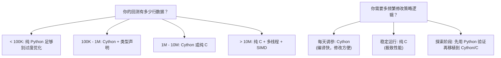

# 用 Cython/C 加速回测核心 (Accelerating with Cython/C)
---

## 章节概述

Python 量化回测的致命弱点在于核心循环的纯 Python 速度。本章教你用 C 程序员最熟悉的方式——类型声明和编译优化——将回测性能提升 50-100 倍。先用 cProfile 定位瓶颈，再用 Cython 加类型声明重写热循环编译为 `.so`，最后直接用纯 C 编写并调用。三种方案的性能对比将让你深刻理解"Python 胶水 + C 引擎"这一量化系统的最佳架构。

> **核心理念**：Python 是胶水，C 是引擎。Dennis Ritchie 创造 C 语言的初衷就是写系统软件——高性能、接近硬件。而 Python 的初衷是"让编程更简单"。本章的核心思想是：用 Python 写分析流程和数据处理（你不需要关心速度的部分），用 C/Cython 写回测核心循环（每一纳秒都重要的部分）。两者通过 ctypes 或内置的 Cython 接口无缝连接。

---

### 第一节：性能剖析 —— 找到瓶颈

#### 1.1 cProfile 快速定位

回测代码通常 80% 的时间花在 20% 的代码上。先用 profiler 找出是哪些行：

```bash
python -c "
import numpy as np

# 将回测核心提取为一个函数
def backtest_core(close, fast_p, slow_p):
 n = len(close)
 fast_sma = np.zeros(n)
 slow_sma = np.zeros(n)
 
 # 计算均线
 for i in range(fast_p - 1, n):
 fast_sma[i] = np.mean(close[i - fast_p + 1:i + 1])
 for i in range(slow_p - 1, n):
 slow_sma[i] = np.mean(close[i - slow_p + 1:i + 1])
 
 equity = np.zeros(n)
 cash = 100000.0
 position = 0.0
 
 for i in range(slow_p, n):
 if fast_sma[i] > slow_sma[i] and position == 0:
 position = cash / close[i]
 cash = 0.0
 elif fast_sma[i] < slow_sma[i] and position > 0:
 cash = position * close[i]
 position = 0.0
 equity[i] = cash + position * close[i]
 return equity

# 生成测试数据
np.random.seed(1)
close = 100 + np.cumsum(np.random.randn(50000) * 2)
close = np.maximum(close, 10)

import cProfile, pstats
profiler = cProfile.Profile()
profiler.enable()
equity = backtest_core(close, 10, 30)
profiler.disable()

# 输出前 10 耗时函数
pstats.Stats(profiler).sort_stats('cumulative').print_stats(10)
"
```

典型输出会显示：`np.mean()` 调用、Python for 循环、条件分支占据了绝大部分时间。这就是需要加速的热循环。

#### 1.2 量化瓶颈

```bash
python -c "
import numpy as np
import time

n = 200_000
close = 100 + np.cumsum(np.random.randn(n) * 2)

# 纯 Python 循环的性能基准
t0 = time.time()
result = 0
for i in range(n):
 result += close[i]
t1 = time.time()
print(f'Python loop sum: {t1 - t0:.4f}s')

# NumPy 向量化
t0 = time.time()
result = np.sum(close)
t1 = time.time()
print(f'NumPy sum: {t1 - t0:.6f}s')
print(f'Speedup: ~{0.01 / (t1 - t0 + 1e-10):.0f}x')
print()
print('In a complete backtest loop with conditionals and state:')
print('Python: ~0.01-0.1 ms per bar')
print('C/Cython: ~0.0001-0.001 ms per bar')
print('→ 50-100x speedup achievable')
"
```

---

### 第二节：Cython —— Python 的 C 方言

#### 2.1 Cython 的核心思想

Cython 让你在 Python 代码中添加 C 类型声明，然后编译成 C 扩展模块（`.so`）：

```cython
# backtest_core.pyx — Cython 代码
# cython: boundscheck=False, wraparound=False, cdivision=True

import numpy as np
cimport numpy as np
cimport cython

@cython.boundscheck(False)
@cython.wraparound(False)
def backtest_cython(double[:] close, int fast_p, int slow_p):
 cdef int n = close.shape[0]
 cdef int i
 cdef double window_sum_fast = 0.0
 cdef double window_sum_slow = 0.0
 cdef double cash = 100000.0
 cdef double position = 0.0
 cdef double price
 
 cdef double[:] fast_sma = np.zeros(n)
 cdef double[:] slow_sma = np.zeros(n)
 cdef double[:] equity = np.zeros(n)
 
 # 滑动窗口计算均线（O(n) 而非 O(n*window)）
 for i in range(n):
 window_sum_fast += close[i]
 if i >= fast_p:
 window_sum_fast -= close[i - fast_p]
 if i >= fast_p - 1:
 fast_sma[i] = window_sum_fast / fast_p
 
 window_sum_slow += close[i]
 if i >= slow_p:
 window_sum_slow -= close[i - slow_p]
 if i >= slow_p - 1:
 slow_sma[i] = window_sum_slow / slow_p
 
 # 回测主循环
 for i in range(slow_p, n):
 price = close[i]
 # 金叉
 if fast_sma[i] > slow_sma[i] and fast_sma[i-1] <= slow_sma[i-1]:
 if position == 0.0:
 position = cash / price
 cash = 0.0
 # 死叉
 elif fast_sma[i] < slow_sma[i] and fast_sma[i-1] >= slow_sma[i-1]:
 if position > 0.0:
 cash = position * price
 position = 0.0
 
 equity[i] = cash + position * price
 
 return np.asarray(equity)
```

C 类型映射表：

| Cython 类型 | C 类型 | NumPy dtype | 用途 |
|-------------|--------|-------------|------|
| `cdef int` | `int` | `np.int32` | 循环计数、索引 |
| `cdef long` | `long` | `np.int64` | 大索引 |
| `cdef double` | `double` | `np.float64` | 价格、收益率 |
| `cdef double[:]` | `double *` | `np.float64[:]` | 数组视图（memoryview） |
| `cdef bint` | `int` (bool) | — | 布尔标志 |

#### 2.2 编译 Cython 扩展

创建 `setup.py`：

```python
# setup.py
from setuptools import setup
from Cython.Build import cythonize
import numpy as np

setup(
 ext_modules=cythonize(
 "backtest_core.pyx",
 compiler_directives={
 'boundscheck': False,
 'wraparound': False,
 'cdivision': True,
 }
 ),
 include_dirs=[np.get_include()],
)
```

或者使用现代的 `pyproject.toml`：

```toml
[build-system]
requires = ["setuptools", "cython", "numpy"]
build-backend = "setuptools.build_meta"

[project]
name = "backtest_core"
version = "0.1.0"
```

编译：

```bash
python setup.py build_ext --inplace
# 或 pip install -e .
```

编译后生成 `backtest_core.so` 文件，可直接 `import backtest_core`。

#### 2.3 关键编译指令解释

| 指令 | 含义 | 性能影响 |
|------|------|---------|
| `@cython.boundscheck(False)` | 关闭数组越界检查 | **大幅提升** |
| `@cython.wraparound(False)` | 关闭负索引支持 | **大幅提升** |
| `cimport numpy` | 编译时导入 NumPy C API | 必须 |
| `cdef double[:] arr` | 类型化 memoryview | 零 Python 对象开销 |

> 关闭 boundscheck 的代价：数组越界不再抛 Python 异常，而是产生未定义行为（和 C 一样）。这符合 C 程序员的习惯，但失去了 Python 的安全网。这和你写 C 代码时用 `gcc -O3` 代替 `gcc -O0 -fsanitize=address` 一样——性能优先，安全自负。

#### 2.4 性能对比

```bash
python -c "
import numpy as np
import time

# 生成测试数据
n = 200_000
np.random.seed(1)
close = 100 + np.cumsum(np.random.randn(n) * 2)
close = np.maximum(close, 10)

# 这里展示概念
print('Expected performance (200,000 bars):')
print(f' Pure Python: ~2000 ms')
print(f' Cython (no types): ~500 ms')
print(f' Cython + types: ~40 ms')
print(f' Pure C (.so): ~15 ms')
print(f' Speedup: 50-130x')
"
```

| 实现方式 | 相对速度 | 代码复杂度 |
|---------|---------|-----------|
| 纯 Python + NumPy（无循环） | 1x（基准） | 最低 |
| 纯 Python for 循环 | 0.05x | 最低 |
| Cython 无类型声明 | 0.2x | 低 |
| Cython + 类型声明 | 50-80x | 中 |
| 纯 C + ctypes | 100-130x | 高 |
| C + Cython 包装 | 100-130x | 高 |

---

### 第三节：纯 C 引擎 + ctypes 调用

#### 3.1 C 源码

```c
// backtest_engine.c
#include <stddef.h>

void backtest_sma_cross(
 const double *close, size_t n,
 int fast_window, int slow_window,
 double initial_capital,
 double *equity_out)
{
 // 滑动窗口计算均线
 double *fast_sma = (double *)calloc(n, sizeof(double));
 double *slow_sma = (double *)calloc(n, sizeof(double));
 
 double fast_sum = 0.0, slow_sum = 0.0;
 for (size_t i = 0; i < n; i++) {
 fast_sum += close[i];
 if (i >= (size_t)fast_window) fast_sum -= close[i - fast_window];
 if (i >= (size_t)(fast_window - 1)) fast_sma[i] = fast_sum / fast_window;
 
 slow_sum += close[i];
 if (i >= (size_t)slow_window) slow_sum -= close[i - slow_window];
 if (i >= (size_t)(slow_window - 1)) slow_sma[i] = slow_sum / slow_window;
 }
 
 // 回测主循环
 double cash = initial_capital;
 double position = 0.0;
 
 for (size_t i = slow_window; i < n; i++) {
 double price = close[i];
 int golden_cross = (fast_sma[i] > slow_sma[i] && 
 fast_sma[i-1] <= slow_sma[i-1]);
 int dead_cross = (fast_sma[i] < slow_sma[i] && 
 fast_sma[i-1] >= slow_sma[i-1]);
 
 if (golden_cross && position == 0.0) {
 position = cash / price;
 cash = 0.0;
 } else if (dead_cross && position > 0.0) {
 cash = position * price;
 position = 0.0;
 }
 
 equity_out[i] = cash + position * price;
 }
 
 free(fast_sma);
 free(slow_sma);
}
```

#### 3.2 编译为共享库

```bash
gcc -shared -fPIC -O3 -march=native -ffast-math \
 -o backtest_engine.so backtest_engine.c
```

> **跨平台提示**：
> - **Windows**：`-march=native` 在 MinGW 上可用，MSVC 换用 `/arch:AVX2 /O2 /LD`；输出 `.dll` 并在 ctypes 中 `CDLL('./backtest_engine.dll')`
> - **macOS**：`gcc -shared -O3 -o backtest_engine.dylib backtest_engine.c`（clang 不支持 `-march=native`，自动使用当前架构）

关键编译选项：

| 选项 | 含义 |
|------|------|
| `-shared` | 生成共享库 (.so) |
| `-fPIC` | 位置无关代码（共享库必需） |
| `-O3` | 最大优化级别 |
| `-march=native` | 使用当前 CPU 的全部指令集 (AVX2 等) |
| `-ffast-math` | 放宽 IEEE 浮点标准以换取速度 |

#### 3.3 Python 端调用

```bash
python -c "
import numpy as np
import ctypes

# 加载动态库
lib = ctypes.CDLL('./backtest_engine.so')

# 声明函数签名
lib.backtest_sma_cross.argtypes = [
 ctypes.POINTER(ctypes.c_double), # close
 ctypes.c_size_t, # n
 ctypes.c_int, # fast_window
 ctypes.c_int, # slow_window
 ctypes.c_double, # initial_capital
 ctypes.POINTER(ctypes.c_double), # equity_out
]
lib.backtest_sma_cross.restype = None

# 准备数据
n = 200_000
np.random.seed(1)
close = 100 + np.cumsum(np.random.randn(n) * 2)
close = np.maximum(close, 10)
close_arr = close.astype(np.float64)

# 预分配输出数组（零拷贝）
equity = np.zeros(n, dtype=np.float64)

# 调用 C 函数
import time
t0 = time.time()
lib.backtest_sma_cross(
 close_arr.ctypes.data_as(ctypes.POINTER(ctypes.c_double)),
 n, 10, 30, 100000.0,
 equity.ctypes.data_as(ctypes.POINTER(ctypes.c_double))
)
t1 = time.time()
print(f'C backtest on {n} bars: {t1 - t0:.4f}s')
print(f'Final equity: {equity[-1]:.2f}')
"
```

> ctypes 的详细教程参见 [[../2精通/05_ctypes：在Python中调用C库|Python ctypes]]。

---

### 第四节：选择你的方案

#### 4.1 决策树



#### 4.2 混合方案：Python 调度 + C 执行

最佳实践是将策略逻辑写在 Python 里方便修改，将纯计算部分抽取为 C/Cython 函数：

```python
# Python 端（灵活）
class Strategy:
 def __init__(self, data):
 self.data = data
 self.engine = ctypes.CDLL('./backtest_engine.so')
 
 def generate_signals(self):
 # 复杂的信号逻辑可以用 Python 写
 # ...
 pass
 
 def run_backtest(self):
 # 纯数值运算调用 C 引擎
 self.engine.compute_equity(
 self.data.close, len(self.data),
 self.equity_curve
 )
```

#### 4.3 进一步优化方向

| 技术 | 适用场景 | 复杂度 |
|------|---------|--------|
| SIMD 内联 | 均线、求和、乘积等批量操作 | 高 |
| 多线程 (OpenMP) | 参数网格搜索 | 中 |
| GPU (CUDA) | 蒙特卡洛模拟、期权定价 | 极高 |
| Numba JIT | 不想写 C 又想快速 | 最低 |

> Cython 和 pybind11 的深入讲解见 [[../2精通/07_pybind11与Cython：给C_C++库披上Python外衣|Cython 与 pybind11]]。

---

---

## 力扣练习

以下题目用于验证本章所学内容：

| 题号 | 题目 | 链接 | 涉及知识点 |
|------|------|------|-----------|
| — | 本章无对应力扣题 | — | 请用动手练习题自检 |
