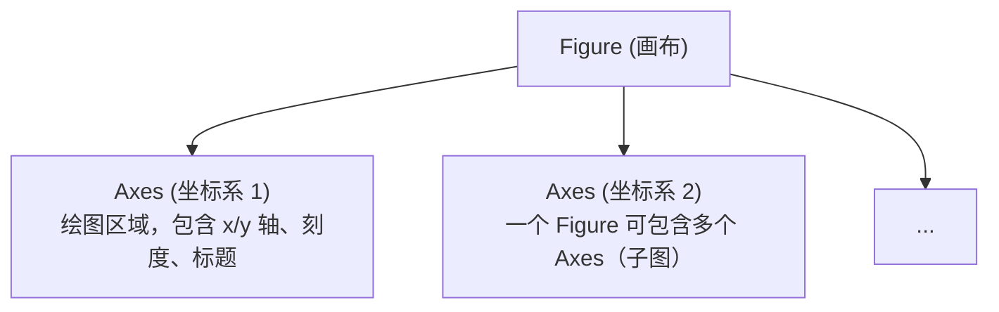

# Matplotlib 基础：画出 C 程序的输出 (Matplotlib Basics)
---

## 章节概述

从 C 程序的 `printf` 输出到 Python 的可视化图表——这是数据可视化的第一步。Matplotlib 是 Python 最基础的绑图库，也是 Seaborn、Pandas 绑图的底层引擎。对于 C 程序员而言，`matplotlib.pyplot` 的 API 设计相当于 C 标准库中的 `printf`——简单直接，所见即所得。本章将从最简单的折线图开始，教会你如何将 C 程序的输出（从文件或标准输入）转化为有意义的图表。

> **核心理念**：C 程序产生数据，Python 绑图展示数据——两者各司其职。Matplotlib 的 `pyplot` 接口模仿了 MATLAB 的命令式绑图风格，但更推荐你用 `fig, ax = plt.subplots()` 的对象式风格，因为它让你精确控制图表的每一个像素，就像 C 语言中你控制内存的每一个字节。

---

### 第一节：pyplot 基础 API —— 十分钟入门四种图表
---

1.1 折线图：`plot()`
-------------------

折线图是数据可视化中最基础的图表，等价于把一组数据点用线段连起来：

```python
import matplotlib.pyplot as plt

x = [0, 1, 2, 3, 4, 5]
y = [0, 1, 4, 9, 16, 25]

plt.plot(x, y)
plt.savefig('line.png')
```

> `plt.plot(x, y)` 不需要像 C 语言那样声明数组长度或类型。Python 的 list 是动态的，`matplotlib` 自动推断范围。与 C 中手写 `for` 循环遍历数组相比，这省去了大量样板代码。

常见参数：

```python
plt.plot(x, y, 'ro--', linewidth=2, markersize=8, label='y=x²')
# 'ro--' 是格式字符串：r=红色, o=圆形标记, --=虚线
```

1.2 散点图：`scatter()`
-----------------------

散点图适合展示离散数据点的分布，比如 C 程序输出的基准测试结果：

```python
import matplotlib.pyplot as plt
import random

n = 100
x = [random.uniform(0, 10) for _ in range(n)]
y = [xi + random.gauss(0, 1) for xi in x]

plt.scatter(x, y, alpha=0.5, c='blue', edgecolors='none')
plt.savefig('scatter.png')
```

> `alpha` 控制透明度，当数据点重叠时效果显著——这相当于 C 中你用 OpenGL 或 SDL2 绑图时需要手动实现的混合算法。

1.3 柱状图：`bar()`
-------------------

柱状图用于对比分类数据，比如对比不同 C 编译优化级别的运行时间：

```python
import matplotlib.pyplot as plt

levels = ['-O0', '-O1', '-O2', '-O3', '-Os']
times = [12.3, 8.7, 5.2, 4.9, 6.1]

plt.bar(levels, times, color=['red', 'orange', 'green', 'blue', 'purple'])
plt.ylabel('Execution Time (ms)')
plt.savefig('bar.png')
```

1.4 直方图：`hist()`
--------------------

直方图展示数据的分布密度，适合分析 C 程序生成的随机数质量：

```python
import matplotlib.pyplot as plt
import random

data = [random.gauss(0, 1) for _ in range(10000)]

plt.hist(data, bins=50, alpha=0.7, edgecolor='black')
plt.axvline(x=0, color='red', linestyle='--', label='mean')
plt.legend()
plt.savefig('hist.png')
```

> `hist()` 自动完成分桶和计数——相当于 C 中你手动写的一个 `int bins[N]` 数组和遍历统计代码。

### 小节练习


> [!question] 判断题 1
> Matplotlib 的 `plt.hist()` 需要用户手动指定每个 bin 的数据分布。（ ）
> - [ ] 正确
> - [ ] 错误
>
> > [!success]- 点击查看答案
> > > 答案: 错误
> > > **解析**: `plt.hist()` 自动完成分桶（binning）和计数工作。你只需要传入原始数据，指定 `bins` 数量即可。

---

### 第二节：读取 C 程序输出 —— 文件与标准输入
---

2.1 从文件读取数据
------------------

典型的 C 程序工作流：C 程序将计算结果写入文件，Python 读取并绑图。

C 程序（`benchmark.c`）：
```c
#include <stdio.h>

int main() {
 for (int n = 1000; n <= 1000000; n *= 2) {
 // 模拟排序耗时
 printf("%d %f\n", n, n * log(n) / 1e6);
 }
 return 0;
}
```
编译运行：`gcc -o benchmark benchmark.c -lm && ./benchmark > results.txt`

Python 读取并绑图：
```python
import matplotlib.pyplot as plt

with open('results.txt') as f:
 lines = f.readlines()

n = []
t = []
for line in lines:
 if line.strip():
 parts = line.split()
 n.append(int(parts[0]))
 t.append(float(parts[1]))

plt.plot(n, t, 'o-')
plt.xlabel('Input Size (n)')
plt.ylabel('Time (ms)')
plt.savefig('benchmark.png')
```

2.2 从标准输入（stdin）读取
---------------------------

最经典的模式——管道（pipe）：

```bash
./benchmark | python3 plot_stdin.py
```

`plot_stdin.py`：
```python
import sys
import matplotlib.pyplot as plt

x, y = [], []
for line in sys.stdin:
 if line.strip():
 a, b = line.split()
 x.append(float(a))
 y.append(float(b))

plt.plot(x, y, 'o-')
plt.savefig('piped_result.png')
```

> 这等价于 C 语言的 `fgets(buf, size, stdin)` + `sscanf` 组合，但 Python 的 `sys.stdin` 迭代器自动处理 EOF，不需要检查 NULL 返回值。

2.3 使用 numpy 加速数据读取
--------------------------

当 C 程序输出大量数据时，numpy 的 `loadtxt` 比手写循环快数十倍：

```python
import numpy as np
import matplotlib.pyplot as plt

data = np.loadtxt('results.txt')
plt.plot(data[:, 0], data[:, 1], 'o-')
plt.savefig('fast_plot.png')
```

```bash
# 从管道读取
./benchmark | python3 -c "
import sys, numpy as np, matplotlib.pyplot as plt
data = np.loadtxt(sys.stdin)
plt.plot(data[:, 0], data[:, 1])
plt.savefig('out.png')
"
```

> `np.loadtxt` 内部用 C 语言实现数据解析，性能接近纯 C，远快于 Python 的逐行循环。

### 小节练习


> [!question] 判断题 1
> Python 的 `sys.stdin` 在读取完所有数据后需要手动调用 `close()` 来释放资源。（ ）
> - [ ] 正确
> - [ ] 错误
>
> > [!success]- 点击查看答案
> > > 答案: 错误
> > > **解析**: 当脚本退出或 `sys.stdin` 被垃圾回收时，Python 会自动关闭标准输入。手动 `close()` 甚至可能导致后续代码无法读取任何输入（包括 `input()`）。

---

### 第三节：非交互式绑图 —— savefig vs show
---

3.1 两种绑图输出模式
--------------------

| 模式 | 函数 | 适用场景 |
|------|------|----------|
| 交互式 | `plt.show()` | 本地开发，GUI 环境中实时查看 |
| 非交互式 | `plt.savefig('file.png')` | 无 GUI 的服务器，自动化脚本，管道作业 |

C 程序员通常工作在终端或远程服务器上，**非交互式 `savefig` 是最常见的选择**。

3.2 savefig 的完整参数
---------------------

```python
plt.savefig(
 'output.png',
 dpi=150, # 分辨率（默认 100）
 bbox_inches='tight', # 自动裁剪空白边距
 transparent=False, # 是否透明背景
 format='png' # png/jpg/svg/pdf
)
```

> 输出矢量格式（SVG/PDF）时，图表可以无限放大而不失真——适合用于文档和论文。这类似于 C 语言用 Cairo 或 libplot 绑矢量图。

3.3 在无 GUI 的服务器上使用 Matplotlib
--------------------------------------

```python
import matplotlib
matplotlib.use('Agg') # 使用非交互式后端（Anti-Grain Geometry）

import matplotlib.pyplot as plt
# ... 正常绑图 ...
plt.savefig('output.png')
```

> `matplotlib.use('Agg')` 必须在 `import matplotlib.pyplot` **之前**调用。Agg 后端完全基于内存绑制，不需要 X11/Display 连接，是服务器环境的标准选择。

3.4 `python -c` 一行流绑图
--------------------------

```bash
# 从命令行直接生成图表
python -c "
import matplotlib
matplotlib.use('Agg')
import matplotlib.pyplot as plt
x = list(range(10))
y = [i**2 for i in x]
plt.plot(x, y, 'ro-')
plt.title('Quick Plot')
plt.savefig('quick.png')
"
```

```bash
# 从 C 程序的管道输出直接绑图
./my_c_program | python -c "
import sys, matplotlib
matplotlib.use('Agg')
import matplotlib.pyplot as plt
data = [line.split() for line in sys.stdin if line.strip()]
x, y = zip(*[(float(a), float(b)) for a, b in data])
plt.plot(x, y)
plt.savefig('pipe_plot.png')
"
```

### 小节练习


> [!question] 判断题 1
> `plt.savefig('out.pdf')` 生成的 PDF 图表放大后会出现锯齿。（ ）
> - [ ] 正确
> - [ ] 错误
>
> > [!success]- 点击查看答案
> > > 答案: 错误
> > > **解析**: PDF（和 SVG）是**矢量格式**，不包含像素信息。无论放大多少倍，线条和文字始终保持清晰。只有 PNG/JPG 等位图格式才会有锯齿问题。

---

### 第四节：面向对象式绑图 —— fig, ax = plt.subplots()
---

4.1 pyplot 命令式 vs subplots 对象式
------------------------------------

命令式（MATLAB 风格）：
```python
plt.plot(x, y)
plt.title('My Plot')
plt.xlabel('X axis')
plt.savefig('plot.png')
```

对象式（推荐）：
```python
fig, ax = plt.subplots()
ax.plot(x, y)
ax.set_title('My Plot')
ax.set_xlabel('X axis')
fig.savefig('plot.png')
```

> 命令式 API 操作的是一个隐式的"当前 figure"，就像 C 的 `printf` 写入隐式的 `stdout`。对象式 API 显式操作 `fig` 和 `ax` 对象，就像 C 中你用 `fprintf(fp, ...)` 指定 `FILE*`。当你有多个子图时，对象式是唯一清晰的选择。

4.2 Figure 和 Axes 的概念
-------------------------



```python
fig, ax = plt.subplots(figsize=(8, 5)) # 指定尺寸（英寸）

ax.plot([1, 2, 3], [1, 4, 9], 'go-', label='data')
ax.set_title('Figure with a single Axes', fontsize=14)
ax.set_xlabel('x', fontsize=12)
ax.set_ylabel('y', fontsize=12)
ax.legend()
ax.grid(True, linestyle='--', alpha=0.5)

fig.tight_layout()
fig.savefig('oo_plot.png')
```

4.3 从 C 程序的矩阵输出绑热力图
------------------------------

C 程序输出矩阵：
```c
// matrix_gen.c
#include <stdio.h>
#include <stdlib.h>
#include <math.h>

int main() {
 for (int i = 0; i < 10; i++) {
 for (int j = 0; j < 10; j++) {
 printf("%.3f ", sin(i * 0.5) * cos(j * 0.5));
 }
 printf("\n");
 }
 return 0;
}
```

Python 读取并绑热力图：
```python
import sys
import numpy as np
import matplotlib.pyplot as plt

data = np.loadtxt(sys.stdin)
fig, ax = plt.subplots(figsize=(6, 5))
im = ax.imshow(data, cmap='viridis', aspect='auto')
fig.colorbar(im, ax=ax, label='Value')
ax.set_title('Matrix from C Program')
fig.savefig('matrix_heatmap.png')
```

```bash
gcc -o matrix_gen matrix_gen.c -lm && ./matrix_gen | python3 matrix_plot.py
```

### 小节练习


> [!question] 判断题 1
> `plt.plot(x, y)` 和 `ax.plot(x, y)` 在只有一个子图时效果完全相同。（ ）
> - [ ] 正确
> - [ ] 错误
>
> > [!success]- 点击查看答案
> > > 答案: 正确
> > > **解析**: 在有唯一 `Axes` 时，`plt.plot()` 内部默认操作当前的 `Axes` 对象。但当你有多个子图时，命令式 API 只能操作最后一个创建的 `Axes`，必须切换到对象式才能精确控制每个子图。

---

## 章节测试

### 一、判断题（正确选，错误选）

> [!question] 判断题 1
> `plt.plot([1, 2], [3, 4])` 绑制的是散点图。（ ）
> - [ ] 正确
> - [ ] 错误
>
> > [!success]- 点击查看答案
> > > 答案: 错误
> > > **解析**: `plt.plot()` 默认绑制折线图（line plot），将相邻数据点用线段连接。散点图应使用 `plt.scatter()`。

> [!question] 判断题 2
> Matplotlib 的 `savefig('output.jpg')` 和 `savefig('output.pdf')` 生成的图片质量完全相同。（ ）
> - [ ] 正确
> - [ ] 错误
>
> > [!success]- 点击查看答案
> > > 答案: 错误
> > > **解析**: JPG 是有损压缩的位图格式，PDF 是矢量格式。PDF 可以无限缩放不失真，JPG 放大后会出现明显的压缩伪影和锯齿。

> [!question] 判断题 3
> 使用 `python -c` 一行流绑图时，必须显式调用 `matplotlib.use('Agg')`。（ ）
> - [ ] 正确
> - [ ] 错误
>
> > [!success]- 点击查看答案
> > > 答案: 错误
> > > **解析**: 仅在**无 GUI 环境**（如远程 SSH 服务器）中才需要设置 `Agg` 后端。在有桌面环境的本地机器上，默认后端（如 `TkAgg`）同样支持 `savefig()`。

> [!question] 判断题 4
> `np.loadtxt('data.txt')` 可以自动处理文件中包含注释行的情况。（ ）
> - [ ] 正确
> - [ ] 错误
>
> > [!success]- 点击查看答案
> > > 答案: 正确
> > > **解析**: `np.loadtxt()` 默认跳过以 `#` 开头的注释行。你可以通过 `comments` 参数指定其他注释字符。

> [!question] 判断题 5
> Matplotlib 只能在 Python 脚本中使用，不能在 `python -c` 一行流中使用。（ ）
> - [ ] 正确
> - [ ] 错误
>
> > [!success]- 点击查看答案
> > > 答案: 错误
> > > **解析**: Matplotlib 完全支持 `python -c` 一行流。多行代码用换行符分隔，只需确保 `import matplotlib.pyplot as plt` 在绑图操作之前即可。

> [!question] 判断题 6
> `ax.grid(True)` 设置的网格线默认是实线且完全不透明。（ ）
> - [ ] 正确
> - [ ] 错误
>
> > [!success]- 点击查看答案
> > > 答案: 错误
> > > **解析**: 默认网格线是较浅的灰色虚线（`linestyle='-'`? 不，实际上默认是实线但透明度较低）。建议显式指定 `linestyle='--'` 和 `alpha=0.3` 以获得专业外观。

---


---

## 力扣练习

以下题目用于验证本章所学内容：

| 题号 | 题目 | 链接 | 涉及知识点 |
|------|------|------|-----------|
| — | 本章无对应力扣题 | — | 请用动手练习题自检 |


### 动手练习题

> [!example] 练习题 1：从 C 程序管道绑图
> **难度**: 简单
>
> 编写一个 C 程序 `sine_gen.c`，输出 `x` 从 0 到 2π 共 100 个点的 `sin(x)` 和 `cos(x)` 值（两列，空格分隔）。然后：
> 1. 编译并运行 C 程序，用管道将输出传给 Python 脚本
> 2. Python 脚本读取 stdin 数据，绑制在同一张图上：`sin(x)`（蓝色实线）和 `cos(x)`（红色虚线）
> 3. 添加图例、网格和标题
> 4. 保存为 `sine_cos.png`
>
> 要求使用 `fig, ax = plt.subplots()` 对象式 API。

> [!example] 练习题 2：基准测试数据可视化
> **难度**: 简单
>
> 编写 C 程序测量不同数量级下的冒泡排序耗时（n=100, 500, 1000, 5000），输出格式 `n time_ms`。然后：
> 1. 用 Python 读取数据，绑制散点图 + 拟合曲线
> 2. 添加对数坐标轴（`ax.set_xscale('log')` / `ax.set_yscale('log')`）
> 3. 在图上标注每个点的具体耗时数值（`ax.annotate`）
> 4. 保存为 `bubble_bench.png`

> [!example] 练习题 3：矩阵热力图
> **难度**: 简单
>
> 编写 C 程序生成一个 20×20 的矩阵，每个元素为 `exp(-((i-10)²+(j-10)²)/50)`。用管道连接 Python：
> 1. Python 用 `np.loadtxt(sys.stdin)` 读取矩阵
> 2. 用 `ax.imshow()` 绑制热力图，附带 colorbar
> 3. 分别保存为 PNG（`heatmap.png`）和 PDF（`heatmap.pdf`）
> 4. 比较两个文件的大小，记录你的观察

> [!example] 练习题 4：python -c 一行流绑图挑战
> **难度**: 简单
>
> 用 `python -c` 一行流完成以下任务（不允许创建 .py 文件）：
> 1. 生成 x = [1, 2, ..., 100]，y = [x² mod 97 for x in xs]
> 2. 绑制 scatter(x, y)，颜色按 y 值映射（`c=y, cmap='plasma'`）
> 3. 添加 colorbar
> 4. 保存为 `oneliner.png`
>
> 提示：使用双引号包裹代码，分号分隔多条语句。
