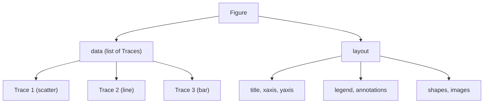

# Plotly：交互式图表 (Plotly: Interactive Charts)
---

## 章节概述

Matplotlib 和 Seaborn 生成的是静态图片——适合论文和报告，但当你需要放大查看异常数据点、悬停显示具体数值、或者用 C 程序持续输出数据并实时观察，交互式图表是更好的选择。Plotly 的 `plotly.express` 一行代码就能生成可缩放、可平移、可悬停的 HTML 图表，`plotly.graph_objects` 则提供精细控制的底层 API。对 C 程序员来说，Plotly 相当于给你的 C 程序输出装了一个"仪表盘"——不需要写任何前端代码。

> **核心理念**：Matplotlib 是"打印到纸上"，Plotly 是"显示在屏幕上"。当你需要交互式数据探索（特别是在 Jupyter 或浏览器中）时，Plotly 是首选。当你的目标是嵌入论文或生成高质量 PDF 时，Matplotlib 更合适。两者不是竞争关系，而是互补工具。

---

### 第一节：Plotly Express —— 交互式图表的"python -c"模式
---

1.1 安装与基础用法
------------------

```bash
pip install plotly
```

最简单的交互式图表示例：

```python
import plotly.express as px

x = [1, 2, 3, 4, 5]
y = [1, 4, 9, 16, 25]

fig = px.line(x=x, y=y, title='Simple Line Chart')
fig.write_html('line.html')
```

打开 `line.html` 用浏览器查看——你可以：
- 鼠标悬停：查看每个数据点的坐标值
- 鼠标滚轮：缩放图表
- 拖拽：平移图表
- 双击：重置视图
- 工具栏：下载为 PNG、选区放大、套索选择等

> Plotly Express 的作用类似于 `python -c` 一行流——用最少的代码得到结果。你不需要了解 Figure、Layout、Trace 等底层概念就可以绑出专业级的交互式图表。

1.2 四种基础图表
----------------

```python
import plotly.express as px
import numpy as np

# 折线图
df = px.data.gapminder().query("country == 'China'")
fig1 = px.line(df, x='year', y='pop',
 title='China Population Over Time')
fig1.write_html('population.html')

# 散点图
df = px.data.iris()
fig2 = px.scatter(df, x='sepal_length', y='sepal_width',
 color='species', size='petal_length',
 hover_data=['petal_width'],
 title='Iris Dataset')
fig2.write_html('iris.html')

# 柱状图
df = px.data.tips()
fig3 = px.bar(df, x='day', y='total_bill', color='sex',
 barmode='group', title='Tips by Day')
fig3.write_html('tips_bar.html')

# 直方图
fig4 = px.histogram(df, x='total_bill', nbins=30,
 color='time', marginal='box',
 title='Bill Amount Distribution')
fig4.write_html('tips_hist.html')
```

> `marginal='box'` 在直方图顶部同时显示箱线图——两个图表共享同一个 X 轴。这在 Matplotlib 中需要 `GridSpec` + `twinx` 的组合才能实现。

1.3 从 C 程序管道到交互式图表
----------------------------

```python
import sys
import plotly.express as px
import pandas as pd

# ./benchmark | python3 interactive_plot.py
df = pd.read_csv(sys.stdin,
 sep='\s+',
 names=['n', 'time_ms', 'memory_kb'])

fig = px.scatter(df, x='n', y='time_ms',
 color='memory_kb',
 size='memory_kb',
 hover_data=['n', 'time_ms', 'memory_kb'],
 title='C Program Benchmark (Interactive)',
 log_x=True, log_y=True,
 color_continuous_scale='Viridis')
fig.write_html('benchmark_interactive.html')
```

> 交互式图表让你可以直接在浏览器中悬停查看每个数据点的精确值——不再需要像 Matplotlib 那样在图上手动 `annotate` 标注关键点。

---

### 第二节：graph_objects —— 深入到每一层
---

2.1 Plotly 的数据模型：Figure → Trace → Data
--------------------------------------------

Plotly 的架构与 Matplotlib 完全不同。核心概念：



每个 `Trace` 是一个独立的"图层"，拥有自己的数据、类型和样式。`Layout` 控制图表的全局外观。

```python
import plotly.graph_objects as go
import numpy as np

x = np.linspace(0, 10, 100)

fig = go.Figure()

# 添加 Trace（数据图层）
fig.add_trace(go.Scatter(
 x=x, y=np.sin(x),
 mode='lines+markers',
 name='sin(x)',
 line=dict(color='royalblue', width=3),
 marker=dict(size=6, symbol='circle')
))

fig.add_trace(go.Scatter(
 x=x, y=np.cos(x),
 mode='lines+markers',
 name='cos(x)',
 line=dict(color='firebrick', width=3, dash='dash'),
 marker=dict(size=6, symbol='square')
))

# 设置 Layout（全局外观）
fig.update_layout(
 title='Trigonometric Functions (graph_objects)',
 xaxis_title='x',
 yaxis_title='f(x)',
 hovermode='x unified', # 统一悬停模式
 template='plotly_white', # 内置模板
 font=dict(size=14),
)

fig.write_html('trig_go.html')
```

> `go.Figure().add_trace()` 的思维模型类似于 C 语言中逐个往数组里添加元素——每个 `trace` 是一组有意义的独立数据，`fig.data` 就是这些 trace 组成的列表。这与 Matplotlib 的"坐标系内绑制"思路完全不同。

2.2 子图布局：make_subplots()
---------------------------

```python
from plotly.subplots import make_subplots
import plotly.graph_objects as go
import numpy as np

fig = make_subplots(
 rows=2, cols=2,
 subplot_titles=('sin(x)', 'cos(x)', 'tan(x)', 'sin·cos'),
 shared_xaxes=True,
 vertical_spacing=0.1,
)

x = np.linspace(0, 2*np.pi, 200)

fig.add_trace(go.Scatter(x=x, y=np.sin(x), name='sin'), row=1, col=1)
fig.add_trace(go.Scatter(x=x, y=np.cos(x), name='cos'), row=1, col=2)
fig.add_trace(go.Scatter(x=x, y=np.tan(x), name='tan'), row=2, col=1)
fig.add_trace(go.Scatter(x=x, y=np.sin(x)*np.cos(x), name='sin·cos'), row=2, col=2)

fig.update_yaxes(range=[-5, 5], row=2, col=1) # 限制 tan 范围
fig.update_layout(height=700, title_text='Subplots with Plotly')
fig.write_html('subplots_plotly.html')
```

2.3 双 Y 轴
-----------

```python
from plotly.subplots import make_subplots
import plotly.graph_objects as go
import numpy as np

fig = make_subplots(specs=[[{"secondary_y": True}]])

x = np.linspace(0, 10, 100)

fig.add_trace(
 go.Scatter(x=x, y=np.sin(x), name='sin(x)', line_color='blue'),
 secondary_y=False,
)

fig.add_trace(
 go.Scatter(x=x, y=np.exp(x)*0.01, name='exp(x)', line_color='red'),
 secondary_y=True,
)

fig.update_xaxes(title_text='x')
fig.update_yaxes(title_text='sin(x)', secondary_y=False, color='blue')
fig.update_yaxes(title_text='exp(x)', secondary_y=True, color='red')

fig.write_html('dual_axis.html')
```

---

### 第三节：高级交互 —— 3D 图与联动
---

3.1 3D 散点图
-------------

```python
import plotly.express as px
import numpy as np

# 模拟 C 程序的三维性能数据
n = 200
data = {
 'input_size': 10 ** np.random.uniform(2, 5, n),
 'time_ms': np.random.lognormal(2, 1, n),
 'memory_kb': np.random.lognormal(6, 1.5, n),
 'algorithm': np.random.choice(['qsort', 'msort', 'heap', 'bsort'], n),
}

fig = px.scatter_3d(
 data, x='input_size', y='time_ms', z='memory_kb',
 color='algorithm',
 size='time_ms', # 气泡大小
 opacity=0.7,
 title='3D Performance Visualization',
 log_x=True,
)
fig.write_html('3d_scatter.html')
```

> 在浏览器中，你可以拖拽旋转、缩放 3D 视角。这比任何二维投影更能直观展示三维数据之间的关系。当一个 C 程序输出三维数据时（比如 `(n, time, memory)`），3D 散点图是呈现数据的最佳方式。

3.2 3D 曲面图
-------------

适合展示 C 程序输出的二维参数空间的性能曲面：

```python
import plotly.graph_objects as go
import numpy as np

x = np.linspace(-5, 5, 50)
y = np.linspace(-5, 5, 50)
X, Y = np.meshgrid(x, y)
Z = np.sin(np.sqrt(X**2 + Y**2)) # 涟漪曲面

fig = go.Figure(data=[go.Surface(z=Z, x=X, y=Y, colorscale='Viridis')])
fig.update_layout(
 title='3D Surface Plot',
 scene=dict(
 xaxis_title='X',
 yaxis_title='Y',
 zaxis_title='Z'
 )
)
fig.write_html('3d_surface.html')
```

3.3 联动选择（Linked Selection）
--------------------------------

Plotly 支持多个图表之间联动——选择一个图表的数据点，其他图表同步高亮：

```python
import plotly.express as px
from plotly.subplots import make_subplots
import plotly.graph_objects as go

df = px.data.iris()

fig = make_subplots(rows=1, cols=2,
 subplot_titles=('Scatter', 'Box Plot'))

for species, color in zip(df['species'].unique(), ['blue', 'red', 'green']):
 mask = df['species'] == species
 subset = df[mask]

 fig.add_trace(
 go.Scatter(x=subset['sepal_length'], y=subset['sepal_width'],
 mode='markers', name=species, marker_color=color,
 legendgroup=species),
 row=1, col=1
 )

 fig.add_trace(
 go.Box(y=subset['petal_length'], name=species,
 marker_color=color, legendgroup=species,
 showlegend=False),
 row=1, col=2
 )

fig.update_layout(title='Linked Views (click legend to toggle)')
fig.write_html('linked_views.html')
```

> `legendgroup` 让同一组的 trace 共享图例项。点击图例中的某一项，所有图表中该组数据同时显示/隐藏——这对 C 程序的多维基准测试数据非常有用。

---

### 第四节：Plotly vs Matplotlib —— 选择指南与静态导出
---

4.1 选型决策表
--------------

| 场景 | 推荐工具 | 原因 |
|------|---------|------|
| 论文/报告用静态图 | Matplotlib | 精确的排版控制，PDF/EPS 矢量输出 |
| 数据分析探索 | Plotly | 交互式缩放、悬停、过滤，一次写多个 HTML |
| Jupyter Notebook | 两者皆可 | Plotly 内嵌更交互，Matplotlib 更快 |
| 自动化报告生成 | Matplotlib | 批量生成 PNG/PDF，不依赖浏览器 |
| C 程序性能仪表盘 | Plotly + Dash | Web 仪表盘，实时更新 |
| 统计数据可视化 | Seaborn | 一行代码绑箱线图、回归线、热力图 |
| 出版物级图表 | Matplotlib | `rcParams` 精确控制每一个像素 |
| GPU 密集型绑图 | 都不要 | 用 C 程序的 OpenGL 或 Vulkan 渲染 |

4.2 从 Plotly 导出静态图片
-------------------------

```python
import plotly.express as px

fig = px.line(x=[1, 2, 3], y=[1, 4, 9])

# 导出为各种格式（需要安装 kaleido）
fig.write_image('chart.png', width=800, height=600, scale=2) # 高 DPI
fig.write_image('chart.pdf')
fig.write_image('chart.svg')

# 如果没有 kaleido，可以：
fig.show(renderer='png') # 在 Jupyter 中渲染为 PNG
```

```bash
pip install kaleido # 静态图片导出引擎
```

4.3 命令行一行流生成交互式 HTML
-----------------------------

```bash
# 从管道数据生成交互式图表
./my_c_program | python -c "
import sys, pandas as pd, plotly.express as px
df = pd.read_csv(sys.stdin, sep='\s+', names=['n', 'time'])
fig = px.line(df, x='n', y='time', title='C Program Output')
fig.write_html('output.html')
"
```

> 将交互式 HTML 分享给同事：他们不需要安装 Python、不需要编译 C 程序，甚至不需要任何开发环境——用浏览器就能看到完整的互动数据。

---

## 力扣练习

以下题目用于验证本章所学内容：

| 题号 | 题目 | 链接 | 涉及知识点 |
|------|------|------|-----------|
| — | 本章无对应力扣题 | — | 请用动手练习题自检 |
