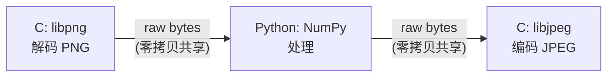

# 与 C 图像库互操作：raw 数据交换 (C Image Library Interop)
---

## 章节概述

这是本图处理章节的核心——连接 Python 和 C 两个世界。前面三章你学会了用 Python 调用 Pillow 和 OpenCV 处理图像，但实际工程中你经常需要把 Python 的高层逻辑和 C 库（如 libpng、libjpeg、stb_image）的底层高性能模块连接起来。本章详细展示如何在不做任何数据拷贝（或仅做一次拷贝）的情况下，让 Python 的 `numpy.ndarray` 和 C 的 `uint8_t*` 指向同一块物理内存。

> **核心理念**：Python 和 C 之间的图像数据交换，本质上就是三个数字（宽、高、通道数）加上一个字节缓冲区。掌握 `ctypes` 共享内存和 `numpy.frombuffer` 零拷贝解析，你就打通了 Python 和 C 之间的"任督二脉"。此后，任何 C 图像库都可以被你当作 Python 的底层引擎随意调用。

---

### 第一节：numpy.frombuffer —— 从 C 缓冲区创建数组
---

1.1 场景设定
------------

假设你有一个 C 函数，用 libpng 解码了 PNG 文件，返回了：

```c
// C 侧的数据结构
typedef struct {
 uint8_t *data; // 原始像素数据（RGB 交错排列）
 int width;
 int height;
 int channels; // 3 = RGB, 4 = RGBA
} ImageBuffer;
```

你在 Python 中调用这个 C 函数后，得到的是一个原始字节序列（通过 `ctypes` 或 `subprocess` 管道传入，见 [[../2精通/05_ctypes：在Python中调用C库|ctypes]] 和 [[../2精通/08_subprocess与进程管道：C与Python数据交换|进程管道]]）。如何从 bytes 生成可用的图像？

1.2 `numpy.frombuffer` 零拷贝
------------------------------

```python
import numpy as np
from PIL import Image

raw_bytes = b'\xff\x00\x00\x00\xff\x00\x00\x00\xff...'

width, height, channels = 256, 256, 3
arr = np.frombuffer(raw_bytes, dtype=np.uint8).reshape(height, width, channels)
img = Image.fromarray(arr, 'RGB')
```

核心里程碑：`frombuffer` 创建的 `ndarray` **与原始 bytes 共享内存**，没有做任何拷贝。`reshape` 同样只是改变了形状描述符（stride），不涉及数据移动。整条链路中唯一的数据移动是 C→Python 的 bytes 传输。

验证零拷贝——修改 bytes 会反映到数组：
```python
byte_array = bytearray(raw_bytes)
arr = np.frombuffer(byte_array, dtype=np.uint8).reshape(256, 256, 3)
byte_array[0] = 128
print(arr[0, 0, 0]) # 128 —— 验证共享内存
```

1.3 反向操作：从 NumPy 到 C
----------------------------

```python
arr = np.array(img) # (H, W, C) uint8
raw_bytes = arr.tobytes() # 扁平化字节序列
# 或者获取底层指针（用于 ctypes 零拷贝传递）
ptr = arr.ctypes.data_as(ctypes.POINTER(ctypes.c_uint8))
```

---

### 第二节：ctypes 共享内存 —— 完全零拷贝
---

2.1 用 ctypes 调用 C 图像库
---------------------------

```c
// image_lib.c —— 一个 C 动态库
#include <stdint.h>
#include <stdlib.h>
#include <string.h>

// 创建一个纯色图像
int create_solid_image(uint8_t **out_data, int width, int height,
 int channels, uint8_t r, uint8_t g, uint8_t b) {
 int total = width * height * channels;
 *out_data = (uint8_t *)malloc(total);
 if (!*out_data) return -1;

 for (int i = 0; i < total; i += channels) {
 (*out_data)[i + 0] = r;
 (*out_data)[i + 1] = g;
 (*out_data)[i + 2] = b;
 }
 return 0;
}

void free_image(uint8_t *data) {
 free(data);
}

// 对图像应用一个简单的亮度调整（原地修改）
void adjust_brightness(uint8_t *data, int width, int height,
 int channels, int delta) {
 int total = width * height * channels;
 for (int i = 0; i < total; i++) {
 int val = (int)data[i] + delta;
 if (val > 255) val = 255;
 if (val < 0) val = 0;
 data[i] = (uint8_t)val;
 }
}
```

编译：
```bash
gcc -shared -fPIC -O2 -o libimage.so image_lib.c
```

> **跨平台提示**：
> - **Windows**：编译为 `.dll`，`gcc -shared -O2 -o libimage.dll image_lib.c`（MinGW），加载用 `ctypes.CDLL('./libimage.dll')`
> - **macOS**：`gcc -shared -O2 -o libimage.dylib image_lib.c`，加载用 `ctypes.CDLL('./libimage.dylib')`

2.2 Python 侧：ctypes 调用与零拷贝 NumPy
---------------------------------------

```python
import ctypes
import numpy as np
from PIL import Image

lib = ctypes.CDLL('./libimage.so')

lib.create_solid_image.restype = ctypes.c_int
lib.create_solid_image.argtypes = [
 ctypes.POINTER(ctypes.POINTER(ctypes.c_uint8)),
 ctypes.c_int, ctypes.c_int, ctypes.c_int,
 ctypes.c_uint8, ctypes.c_uint8, ctypes.c_uint8
]

lib.free_image.argtypes = [ctypes.POINTER(ctypes.c_uint8)]
lib.free_image.restype = None

lib.adjust_brightness.argtypes = [
 ctypes.POINTER(ctypes.c_uint8),
 ctypes.c_int, ctypes.c_int, ctypes.c_int,
 ctypes.c_int
]
lib.adjust_brightness.restype = None

width, height, channels = 256, 256, 3
p_ptr = ctypes.POINTER(ctypes.c_uint8)()
ret = lib.create_solid_image(
 ctypes.byref(p_ptr), width, height, channels, 128, 64, 32
)

# 关键：从 C 指针创建 NumPy 数组（零拷贝！）
arr = np.ctypeslib.as_array(p_ptr, shape=(height, width, channels))
# 或者手动创建：
# arr = np.frombuffer(
# (ctypes.c_uint8 * (width * height * channels)).from_address(
# ctypes.addressof(p_ptr.contents)), dtype=np.uint8
# ).reshape(height, width, channels)

img = Image.fromarray(arr, 'RGB')

# C 修改 → Python 立刻可见
lib.adjust_brightness(p_ptr, width, height, channels, 50)
print(arr[10, 10]) # 值已改变！
img_modified = Image.fromarray(arr, 'RGB')
img_modified.save('brightened.png')

# 释放 C 侧内存
lib.free_image(p_ptr)
```

> 这里的关键模式：`np.ctypeslib.as_array(ptr, shape)` 让 NumPy **接管 C 分配的内存**的"查看"权，但不接管所有权。你仍然要在 C 侧 `free`，否则内存泄漏。

2.3 内存所有权管理
------------------

三种所有权的处理方式：

```python
# 方式 1：C 分配，C 释放（需要手动 free）
arr = np.ctypeslib.as_array(p_ptr, shape=(h, w, c))
# ... 使用 arr ...
lib.free_image(p_ptr) # 释放后数组变悬空指针！

# 方式 2：Python 分配，传给 C
arr = np.zeros((h, w, c), dtype=np.uint8)
arr_ptr = arr.ctypes.data_as(ctypes.POINTER(ctypes.c_uint8))
lib.adjust_brightness(arr_ptr, w, h, c, 30)
# Python 自动管理内存，无需手动 free

# 方式 3：共享内存对象（multiprocessing.shared_memory）
# 多个进程/线程共享同一块物理内存
```

---

### 第三节：完整示例 —— C 读取图像 → Python 处理 → C 写回
---

3.1 完整流水线架构
------------------



3.2 C 侧：解码 PNG 并传递数据
----------------------------

```c
// png_bridge.c —— 编译为 libpngbridge.so
#include <stdio.h>
#include <stdlib.h>
#include <stdint.h>
#include <png.h>

typedef struct {
 uint8_t *data;
 int width, height;
 int channels;
 char error[256];
} DecodedImage;

DecodedImage decode_png(const char *filename) {
 DecodedImage result = {0};

 FILE *fp = fopen(filename, "rb");
 if (!fp) { snprintf(result.error, 256, "Cannot open %s", filename); return result; }

 png_structp png = png_create_read_struct(PNG_LIBPNG_VER_STRING, NULL, NULL, NULL);
 if (!png) { fclose(fp); return result; }

 png_infop info = png_create_info_struct(png);
 if (!info) { png_destroy_read_struct(&png, NULL, NULL); fclose(fp); return result; }

 if (setjmp(png_jmpbuf(png))) {
 png_destroy_read_struct(&png, &info, NULL);
 fclose(fp);
 free(result.data);
 snprintf(result.error, 256, "PNG decode error");
 return result;
 }

 png_init_io(png, fp);
 png_read_info(png, info);

 result.width = png_get_image_width(png, info);
 result.height = png_get_image_height(png, info);
 int color_type = png_get_color_type(png, info);

 if (color_type == PNG_COLOR_TYPE_RGB) result.channels = 3;
 else if (color_type == PNG_COLOR_TYPE_RGBA) result.channels = 4;
 else if (color_type == PNG_COLOR_TYPE_GRAY) result.channels = 1;
 else result.channels = 3;

 if (color_type == PNG_COLOR_TYPE_PALETTE) png_set_palette_to_rgb(png);
 if (color_type == PNG_COLOR_TYPE_GRAY && result.channels == 1)
 png_set_gray_to_rgb(png);
 if (png_get_valid(png, info, PNG_INFO_tRNS))
 png_set_tRNS_to_alpha(png);

 png_read_update_info(png, info);

 result.data = malloc(result.width * result.height * result.channels);
 png_bytep *row_pointers = malloc(result.height * sizeof(png_bytep));
 for (int y = 0; y < result.height; y++)
 row_pointers[y] = result.data + y * result.width * result.channels;

 png_read_image(png, row_pointers);
 png_read_end(png, NULL);

 free(row_pointers);
 png_destroy_read_struct(&png, &info, NULL);
 fclose(fp);
 return result;
}

void free_decoded(DecodedImage *img) {
 free(img->data);
 img->data = NULL;
}
```

编译：
```bash
gcc -shared -fPIC -O2 $(pkg-config --cflags libpng) \
 -o libpngbridge.so png_bridge.c $(pkg-config --libs libpng)
```

3.3 Python 侧：接收数据、处理、写回
----------------------------------

```python
import ctypes
import numpy as np
from PIL import Image, ImageFilter

class DecodedImage(ctypes.Structure):
 _fields_ = [
 ("data", ctypes.POINTER(ctypes.c_uint8)),
 ("width", ctypes.c_int),
 ("height", ctypes.c_int),
 ("channels", ctypes.c_int),
 ("error", ctypes.c_char * 256),
 ]

lib = ctypes.CDLL('./libpngbridge.so')
lib.decode_png.restype = DecodedImage
lib.decode_png.argtypes = [ctypes.c_char_p]
lib.free_decoded.argtypes = [ctypes.POINTER(DecodedImage)]

def load_png_c(filename):
 """通过 C 的 libpng 加载 PNG 文件，返回 NumPy 数组"""
 result = lib.decode_png(filename.encode())
 if result.error[0] != 0:
 raise RuntimeError(result.error.decode())

 size = result.height * result.width * result.channels
 arr = np.ctypeslib.as_array(result.data, shape=(size,))
 arr = arr.reshape(result.height, result.width, result.channels)

 return arr, result # 返回 result 用于后续释放

def save_jpeg_python(arr, filename, quality=90):
 """用 Python/Pillow 保存为 JPEG"""
 mode = {1: 'L', 3: 'RGB', 4: 'RGBA'}[arr.shape[2]]
 img = Image.fromarray(arr, mode)
 if mode == 'RGBA':
 img = img.convert('RGB')
 img.save(filename, quality=quality)

# 完整流水线
arr, decoded = load_png_c('input.png')
print(f"Decoded: {decoded.width}x{decoded.height} x{decoded.channels}")

# Python 处理
img = Image.fromarray(arr, 'RGB')
processed = img.filter(ImageFilter.SHARPEN).resize((512, 512))

# 转回 NumPy 传给 C
arr_out = np.array(processed)
save_jpeg_python(arr_out, 'output.jpg', quality=95)

# 释放 C 侧原始 PNG 数据
lib.free_decoded(ctypes.byref(decoded))
```

> 在这个流水线中，图像数据只在 C 解码 PNG 时分配了一次内存。Python 侧的 `as_array`、`fromarray`、`np.array` 中的 `fromarray` 复制了数据（因为 `.resize` 创建了新 Image），但核心的 C→Python 传递是零拷贝的。

---

### 第四节：struct 模块传递图像元数据
---

4.1 打包元数据
--------------

当通过管道（pipe/socket）传递图像数据时，你需要同时传递元数据（宽、高、通道数、dtype）。`struct` 模块用于序列化这些元数据：

```python
import struct

width, height, channels = 1920, 1080, 3
dtype_code = 0 # 0=uint8, 1=float32, 2=uint16
data = arr.tobytes()

header = struct.pack('!IIIB', width, height, channels, dtype_code)
# '!' = 网络字节序（大端）, I = uint32, B = uint8
# header 长度固定 = 4+4+4+1 = 13 字节

packet = header + data
```

C 侧解析：
```c
// 读 13 字节 header
uint32_t width, height, channels;
uint8_t dtype_code;
memcpy(&width, buf + 0, 4); width = ntohl(width);
memcpy(&height, buf + 4, 4); height = ntohl(height);
memcpy(&channels, buf + 8, 4); channels = ntohl(channels);
dtype_code = buf[12];
```

4.2 多种数据类型支持
--------------------

```python
TYPE_MAP = {
 0: ('uint8', 1, np.uint8),
 1: ('float32', 4, np.float32),
 2: ('uint16', 2, np.uint16),
 3: ('int32', 4, np.int32),
}

def serialize_image(arr):
 for code, (name, size, dt) in TYPE_MAP.items():
 if arr.dtype == dt:
 dtype_code = code
 break
 h, w, c = arr.shape if len(arr.shape) == 3 else (*arr.shape, 1)
 header = struct.pack('!IIIB', w, h, c, dtype_code)
 return header + arr.tobytes()

def deserialize_image(packet):
 w, h, c, code = struct.unpack('!IIIB', packet[:13])
 name, elem_size, dtype = TYPE_MAP[code]
 payload_size = h * w * c * elem_size
 return np.frombuffer(packet[13:13+payload_size], dtype=dtype).reshape(h, w, c)
```

---

### 第五节：两种传输通道对比
---

5.1 方案对比
------------

| 通道 | 零拷贝 | 适用场景 | 数据量 | 复杂度 |
|------|-------|---------|-------|--------|
| `ctypes` 直接调用 | 是 | 同进程，C 动态库 | 无限 | 中 |
| `subprocess` 管道 | 一次拷贝 | 跨进程 | 适合 MB 级 | 低 |
| `multiprocessing.shared_memory` | 是 | 跨进程，超大图像 | 无限 | 高 |
| `mmap` 共享文件 | 是 | 持久化共享 | GB 级 | 中 |
| Socket / ZeroMQ | N次拷贝 | 网络传输 | 压缩后 | 中 |

5.2 subprocess 管道示例
-----------------------

```python
import subprocess
import numpy as np
from PIL import Image

# C 程序解码 PNG，输出原始像素到 stdout
proc = subprocess.run(
 ['./png_decoder', 'input.png'],
 capture_output=True
)

header = proc.stdout[:12]
width, height, channels = struct.unpack('!III', header)
raw = proc.stdout[12:]
arr = np.frombuffer(raw, dtype=np.uint8).reshape(height, width, channels)

img = Image.fromarray(arr, 'RGB')
img.save('processed.jpg')
```

对应的 C 程序 `png_decoder.c` 就把解码后的数据 `fwrite` 到 `stdout`：
```c
int main(int argc, char **argv) {
 DecodedImage img = decode_png(argv[1]);
 // 写入 header: width(4B) + height(4B) + channels(4B)
 uint32_t w_be = htonl(img.width);
 uint32_t h_be = htonl(img.height);
 uint32_t c_be = htonl(img.channels);
 fwrite(&w_be, 4, 1, stdout);
 fwrite(&h_be, 4, 1, stdout);
 fwrite(&c_be, 4, 1, stdout);
 fwrite(img.data, 1, img.width * img.height * img.channels, stdout);
 free_decoded(&img);
 return 0;
}
```

> 管道的优点是 C 和 Python 进程完全独立——C 崩溃不会拖垮 Python，Python 可以随时重启 C 进程。缺点是数据需要通过内核管道缓冲区拷贝一次。

5.3 零拷贝终极方案：shared_memory
--------------------------------

```python
from multiprocessing import shared_memory

arr = np.random.randint(0, 256, (1080, 1920, 3), dtype=np.uint8)
shm = shared_memory.SharedMemory(create=True, size=arr.nbytes)
shared_arr = np.ndarray(arr.shape, dtype=arr.dtype, buffer=shm.buf)
np.copyto(shared_arr, arr)

# 传递给 C 进程（通过共享内存名）
name = shm.name
# C 侧: fd = shm_open(name, O_RDWR, 0666);
# data = mmap(NULL, size, PROT_READ|PROT_WRITE, MAP_SHARED, fd, 0);

# ... C 处理完毕后 ...

shm.close()
shm.unlink()
```

对于 GB 级卫星图像或视频帧流，`shared_memory` 是唯一合理的跨进程方案——没有拷贝，没有管道限制。

---

## 力扣练习

以下题目用于验证本章所学内容：

| 题号 | 题目 | 链接 | 涉及知识点 |
|------|------|------|-----------|
| — | 本章无对应力扣题 | — | 请用动手练习题自检 |
