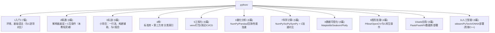

# Python 教程

Python 在 RootStack 体系中的定位是**工具，而非核心**。本教程面向已有 C/C++ 基础的读者，侧重两个方向：

1. **快速解决事情** —— `python -c ""` 一行流、小脚本、辅助工具，不追求 Python 语法体系完整
2. **C ↔ Python 互操作** —— 在 C 项目中嵌入 Python 完成特定功能（CPython 内嵌、ctypes 调 C 库、pybind11/Cython 封装），将 Python 作为 C 生态的一个延伸工具

> 本教程假设读者已有 C 或 C++ 基础。若为纯初学者，建议先完成 [[../c语言教程/c目录|C 语言教程]] 前 5 章再回到这里。

---

## 写在教程之前

### 本教程的定位

Python 不是替代 C，而是 C 程序员的工具。你不需要用 Python 重写整个项目，而是把它当作：

- **快速验证**：`python -c ""` 替代临时写 C 编译运行，验证想法、测试小逻辑、做数据计算
- **C-Python 互操作**：用 ctypes 调已有的 C 库，用 CPython API 在 C 程序中嵌入 Python，用 pybind11/Cython 给 C/C++ 库披上 Python 外衣
- **脚本化辅助**：代码生成（生成 C 头文件骨架）、日志分析、自动化测试、数据可视化 —— 用 Python 的快速开发能力服务 C 项目

### 不同系统下载 Python

**Windows**：
- 去 [python.org](https://www.python.org/downloads/) 下载安装包，安装时**务必勾选 "Add Python to PATH"**
- 或使用 winget：`winget install python`
- Winget 安装后可能需要重启终端才能识别 `python` 命令

**macOS**：
- `brew install python3`
- 或去 [python.org](https://www.python.org/downloads/) 下载 .pkg 安装包

**Linux**：
- Debian/Ubuntu：`sudo apt install python3 python3-pip`
- Arch：`sudo pacman -S python python-pip`
- Fedora：`sudo dnf install python3 python3-pip`

**验证安装**：
```bash
python3 --version
pip3 --version
```

> 各系统可能同时存在 `python` / `python3`。建议统一使用 `python3` 和 `pip3`，或者用 `uv` 管理 Python 版本。

### 编辑器选择

| 编辑器 | 平台 | 说明 |
|--------|------|------|
| **VSCode + Python 插件** | 全平台 | 推荐。智能补全、调试、Jupyter 支持，C/C++ 插件可共存 |
| **PyCharm Community** | 全平台 | 完整 IDE，适合纯 Python 项目，对新手友好 |
| **Vim/Neovim + coc-pyright** | 全平台 | 终端轻量方案，C 程序员习惯的编辑方式 |

### Python 版本说明

**推荐 Python 3.10+**。Python 3.10 引入了 `match/case`（模式匹配），3.11/3.12 有显著性能提升。

**不要用 Python 2**。Python 2 已于 2020 年停止维护。如遇旧系统上的 `python` 命令指向 Python 2，请检查 `python3` 或升级系统。

当前最新稳定版为 Python 3.12/3.13，但生产环境建议使用 3.10 或 3.11（库兼容性最广）。

---

## 教程结构



---

## 推荐学习路径

### 阶段一：快速上手（1-2 天）

| 顺序 | 文件 | 重点 | 技巧 |
|------|------|------|------|
| 1 | [[1入门/01_认识Python与python_-c_一行流\|01 认识 Python]] | 安装、REPL、`python -c` | 用 `python -c` 替代临时 C 编译 |
| 2 | [[1入门/02_变量与类型：从C迁移\|02 变量与类型]] | 与 C 的类型逐项对比 | 关注动态类型与 C 强类型的差异 |
| 3 | [[1入门/03_列表与字典：C数组与结构体的平替\|03 列表与字典]] | list/tuple/dict/set | 切片、推导式是 C 没有的武器 |

> 至此已能用 `python -c` 处理多数文本/数据处理任务。后面的 04-07 按需阅读。

### 阶段二：工具化思维（1 周）

| 顺序 | 文件 | 重点 |
|------|------|------|
| 4 | [[1入门/04_字符串与文件读写\|04 字符串与文件]] | str 方法、open/with、编码 |
| 5 | [[1入门/05_异常处理与pdb调试\|05 异常与调试]] | try/except/traceback/pdb |
| 6 | [[1入门/06_类与继承：从struct到class\|06 类与继承]] | C struct → C++ class → Python class |
| 7 | [[1入门/07_模块与包：import机制与pip\|07 模块与包]] | import 机制、pip、venv 初识 |
| 8 | [[3实战/01_python_-c_一行流：系统管理速查\|实战 01 一行流]] | `python -c` 合集 |
| 9 | [[3实战/02_日志分析：从C程序日志提取统计\|实战 02 日志分析]] | 实战脚本 |
| 10 | [[3实战/03_代码生成器：用Python生成C头文件与骨架\|实战 03 代码生成]] | Python 为 C 项目服务 |

### 阶段三：精通 —— C 互操作（1-2 周，本教程灵魂）

| 顺序 | 文件 | 重点 |
|------|------|------|
| 11 | [[2精通/01_PyObject与引用计数：Python的内存真相\|精通 01 对象模型]] | PyObject、引用计数、与 C 内存模型对比 |
| 12 | [[2精通/02_GIL与多线程：对比C_pthread\|精通 02 GIL]] | GIL 原理、multiprocessing |
| 13 | [[2精通/03_字节码与dis：Python也是\"编译\"的\|精通 03 字节码]] | dis 模块、与 C 编译四步骤对比 |
| 14 | [[2精通/04_生成器与协程：yield与async底层\|精通 04 生成器协程]] | yield/yield from/async await 底层 |
| 15 | [[2精通/05_ctypes：在Python中调用C库\|精通 05 ctypes]] | 加载 .so、结构体映射、回调 |
| 16 | [[2精通/06_内嵌CPython：在C程序里运行Python\|精通 06 内嵌 CPython]] | 在 C 程序初始化解释器→调 Python |
| 17 | [[2精通/07_pybind11与Cython：给C_C++库披上Python外衣\|精通 07 pybind11/Cython]] | 三种方案对比选型 |
| 18 | [[2精通/08_subprocess与进程管道：C与Python数据交换\|精通 08 进程管道]] | 双向通信、JSON/二进制交换 |

### 阶段四：专题工具 —— 按需查阅

| 领域 | 入口目录 | 核心库 |
|------|---------|--------|
| 工程化 | [[../ISSUES\|5工程化/]] | venv/uv/pytest/ruff/pyproject.toml |
| 量化分析 | [[../ISSUES\|6量化分析/]] | NumPy/Pandas/backtrader/akshare |
| 科学计算 | [[../ISSUES\|7科学计算/]] | NumPy/SciPy/SymPy |
| 数据可视化 | [[../ISSUES\|8数据可视化/]] | Matplotlib/Seaborn/Plotly |
| 图形处理 | [[../ISSUES\|9图形处理/]] | Pillow/OpenCV |
| Web 应用 | [[../ISSUES\|10web应用/]] | Flask/FastAPI/Django |
| 人工智能 | [[../ISSUES\|11人工智能/]] | sklearn/PyTorch/ONNX |

---

## C ↔ Python 对比学习

### 语法对比

| 概念 | C | Python |
|------|---|--------|
| 变量 | `int x = 5;` 静态类型 | `x = 5` 动态类型，名称绑定 |
| 数组 | `int arr[10];` 连续内存 | `arr = [0] * 10` 引用列表 |
| 字符串 | `char s[] = "hello";` 以 `\0` 结尾 | `s = "hello"` 不可变 str 对象 |
| 结构体 | `struct Point { int x; int y; };` | `class Point: x, y` 或 namedtuple |
| 函数指针 | `int (*fp)(int, int);` | `lambda x, y: x + y` 一等函数 |
| 条件 | `if (x > 0) { ... }` | `if x > 0:` 缩进块 |
| 循环 | `for (int i = 0; i < n; i++)` | `for i in range(n):` |
| 内存 | `malloc/free` 手动管理 | GC 自动回收，`del` 仅删引用 |

### 互操作方案速选

| 场景 | 推荐方案 | 说明 |
|------|---------|------|
| Python 调已有的 C .so/.dll | ctypes | 零额外依赖，标准库自带 |
| Python 调 C .so（需复杂类型） | CFFI | 比 ctypes 更灵活，支持 ABI/API 模式 |
| 为 C/C++ 库写 Python 绑定（性能优先） | pybind11 | C++11 模板，PyTorch 官方采用 |
| 为 C 库写 Python 绑定（简单场景） | Cython | 写 .pyx 文件编译为 .so |
| C 程序需要执行 Python 代码 | CPython C API 内嵌 | `Py_Initialize()` / `PyRun_SimpleString()` |
| C 程序与 Python 脚本交换数据 | subprocess + JSON | 最简单，无需编译依赖 |

---

## 与其他模块的关联

- [[../c语言教程/c目录|C 教程]] — 系统编程基础、内存模型、互操作对照
- [[../cpp教程/cpp目录|C++ 教程]] — pybind11 需要 C++11、SWIG 支持 C/C++
- [[../rust/rust目录|Rust 教程]] — PyO3（Rust 侧 Python 绑定）对应 pybind11
- [[../内核/系统内核/|内核教程]] — CPython 作为一种"语言运行时内核"
- [[../数据结构/DSA学习路线|DSA 学习路线]] — Python 刷题 vs C 刷题的效率差异
- [[../red_team/总目录与快速查询|红队知识库]] — Python 在安全自动化中的应用

---

## 外部资源

- [Python 官方文档](https://docs.python.org/zh-cn/3/)
- [Python/C API 参考手册](https://docs.python.org/zh-cn/3/c-api/)
- [ctypes 官方文档](https://docs.python.org/zh-cn/3/library/ctypes.html)
- [pybind11 文档](https://pybind11.readthedocs.io/)
- [Cython 文档](https://cython.readthedocs.io/)
- [NumPy 中文文档](https://numpy.org.cn/)
- [Pandas 中文文档](https://pandas.pydata.org.cn/)
- [Matplotlib 中文文档](https://matplotlib.org.cn/)
- [FastAPI 文档](https://fastapi.tiangolo.com/zh/)
- [PyTorch 中文文档](https://pytorch.org.cn/)
