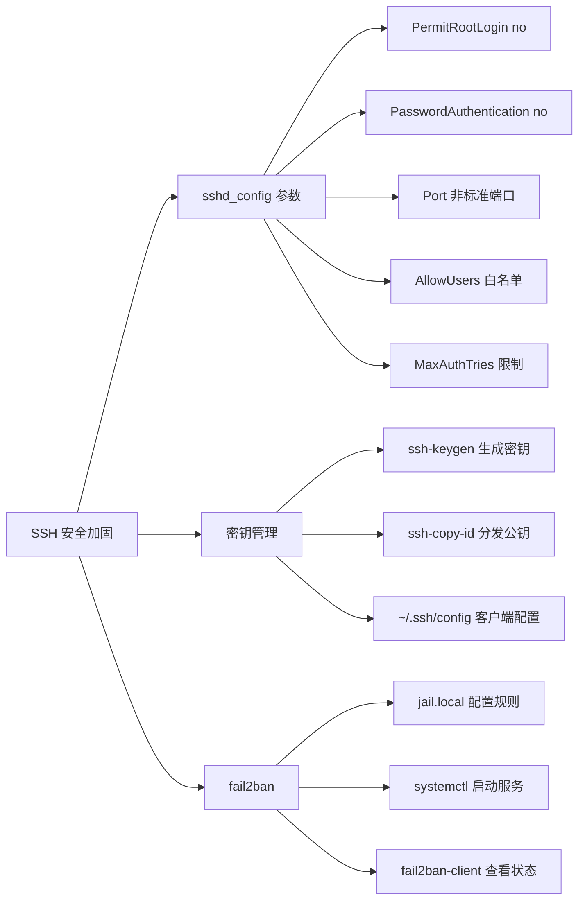
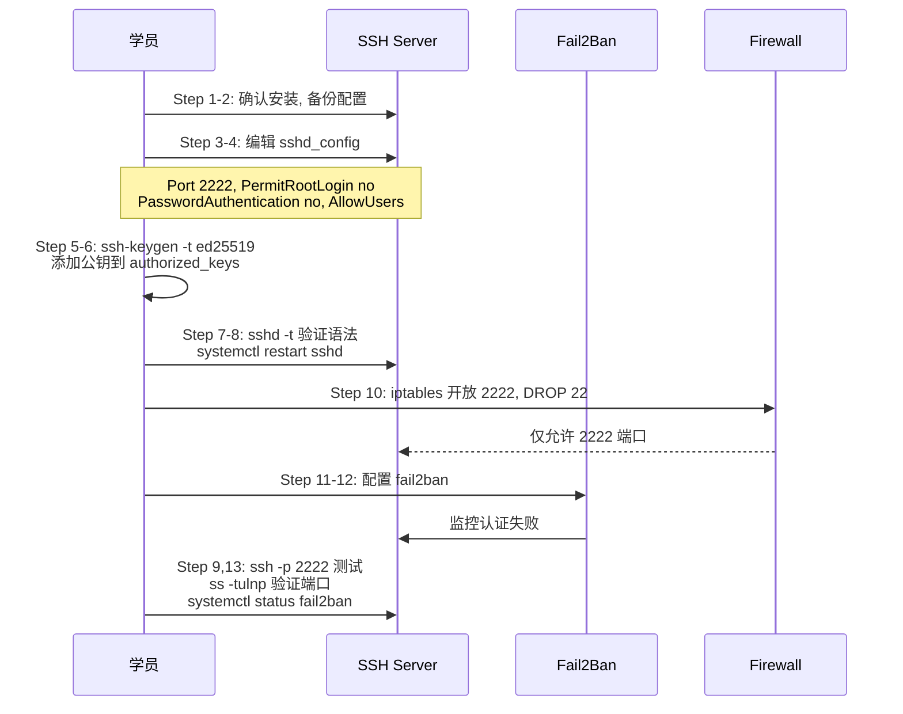

## 目录

- [[#一、Linux命令行基础|一、Linux命令行基础]]
  - [[#1.1 文件和目录操作|1.1 文件和目录操作]]
  - [[#1.2 文本搜索与查找|1.2 文本搜索与查找]]
  - [[#1.3 进程查看与网络连接|1.3 进程查看与网络连接]]
- [[#二、文件权限管理|二、文件权限管理]]
  - [[#2.1 基本权限 rwx|2.1 基本权限 rwx]]
  - [[#2.2 特殊权限位 SUID-SGID-Sticky Bit|2.2 特殊权限位 SUID-SGID-Sticky Bit]]
- [[#三、用户和组管理|三、用户和组管理]]
  - [[#3.1 用户管理|3.1 用户管理]]
  - [[#3.2 组管理|3.2 组管理]]
  - [[#3.3 sudo 配置|3.3 sudo 配置]]
- [[#四、进程管理|四、进程管理]]
  - [[#4.1 进程查看与监控|4.1 进程查看与监控]]
  - [[#4.2 进程控制|4.2 进程控制]]
  - [[#4.3 后台进程与任务管理|4.3 后台进程与任务管理]]
- [[#五、日志查看|五、日志查看]]
  - [[#5.1 传统日志文件|5.1 传统日志文件]]
  - [[#5.2 journalctl systemd 日志|5.2 journalctl systemd 日志]]
- [[#六、防火墙基础|六、防火墙基础]]
  - [[#6.1 iptables 传统防火墙|6.1 iptables 传统防火墙]]
  - [[#6.2 nftables 现代防火墙|6.2 nftables 现代防火墙]]
- [[#七、SSH 安全配置|七、SSH 安全配置]]
  - [[#7.1 SSH 服务器安装与基础配置|7.1 SSH 服务器安装与基础配置]]
  - [[#7.2 SSH 密钥管理|7.2 SSH 密钥管理]]
  - [[#7.3 fail2ban 防暴力破解|7.3 fail2ban 防暴力破解]]
- [[#八、实践练习|八、实践练习]]

```mermaid
flowchart TD
    A[Linux 安全操作基础] --> B[命令行基础]
    A --> C[权限管理]
    A --> D[用户与组]
    A --> E[进程管理]
    A --> F[日志查看]
    A --> G[防火墙]
    A --> H[SSH 加固]

    B --> B1[文件操作: ls cd cp mv rm mkdir]
    B --> B2[查找: find grep]
    B --> B3[进程/网络: ps top netstat ss]

    C --> C1[chmod chown 基本权限]
    C --> C2[SUID/SGID/Sticky Bit 特殊权限]

    D --> D1[useradd usermod userdel]
    D --> D2[groupadd groupmod]
    D --> D3[visudo sudoers]

    E --> E1[ps top htop 查看]
    E --> E2[kill pkill nice 控制]
    E --> E3[jobs fg bg nohup 后台]

    F --> F1[/var/log 传统日志]
    F --> F2[journalctl systemd 日志]

    G --> G1[iptables 传统]
    G --> G2[nftables 现代替代]

    H --> H1[sshd_config 安全参数]
    H --> H2[SSH 密钥管理]
    H --> H3[fail2ban 防爆破]
```

## 一、Linux命令行基础

> 相关模块: [[02-信息收集与侦察技术|信息收集]] | [[03-网络扫描与枚举技术|网络扫描]]

### 1.1 文件和目录操作

```bash
# ls - 列出目录内容
ls -la          # 显示所有文件(含隐藏)及详细信息
ls -lh          # 人类可读的文件大小格式
ls -lt          # 按修改时间排序
ls -R           # 递归列出子目录

# cd - 切换目录
cd /var/log     # 切换到/var/log
cd ..           # 返回上级目录
cd ~            # 返回用户家目录
cd -            # 返回上一次所在目录

# cp - 复制文件/目录
cp file1 file2              # 复制文件
cp -r /src/dir /dst/dir     # 递归复制目录
cp -p file1 file2           # 保留权限/时间戳

# mv - 移动/重命名文件
mv oldname newname          # 重命名
mv file /target/dir/        # 移动到目标目录

# rm - 删除文件/目录
rm file                     # 删除文件
rm -rf /target/dir          # 递归强制删除 (谨慎使用!)

# mkdir / rmdir - 创建/删除目录
mkdir -p /a/b/c             # 递归创建目录结构
rmdir emptydir              # 只能删除空目录
```

### 1.2 文本搜索与查找

```bash
# find - 查找文件
find / -name "*.conf"                    # 按名称查找
find /var/log -mtime -7                  # 最近7天修改的文件
find / -type f -size +100M               # 大于100MB的文件
find / -user root -perm -4000            # 查找root的SUID文件
find / -type f -exec grep -l "search" {} \;  # 查找含特定内容的文件

# grep - 文本搜索
grep "error" /var/log/syslog             # 搜索日志中的error
grep -r "password" /etc/                 # 递归搜索目录
grep -i "warning" /var/log/*.log         # 忽略大小写
grep -v "debug" /var/log/app.log         # 排除匹配行
grep -E "error|fail" /var/log/syslog     # 正则匹配(error或fail)
```

### 1.3 进程查看与网络连接

```bash
# ps - 查看进程
ps aux                  # 显示所有进程
ps aux | grep nginx     # 查找特定进程
ps -ef --forest         # 显示进程树

# top - 实时进程监控
top                     # 启动top
# (在top界面中) k 键   # 输入PID终止进程
# (在top界面中) u 键   # 按用户过滤
# (在top界面中) M 键   # 按内存使用排序

# netstat - 网络连接查看 (net-tools, 已逐步被ss取代)
netstat -tulnp          # 查看监听端口
netstat -anp            # 查看所有连接
netstat -rn             # 查看路由表

# ss - 网络连接查看 (iproute2, netstat的现代替代)
ss -tulnp               # 查看监听端口
ss -antp                # 查看所有TCP连接
ss -s                   # 连接统计摘要
```

## 二、文件权限管理

> 相关模块: [[03-网络扫描与枚举技术|枚举技术]] (SUID 提权检测用到 find -perm -4000)

### 2.1 基本权限 rwx

权限表示: `r` (读=4) `w` (写=2) `x` (执行=1)
三类对象: Owner(所有者) Group(组) Other(其他人)

```bash
# chmod - 修改文件权限
chmod 755 script.sh     # rwxr-xr-x (所有者全权限, 组和其他人读+执行)
chmod 644 file.txt      # rw-r--r-- (典型的文件权限)
chmod u+x script.sh     # 给所有者添加执行权限
chmod g-w file.txt      # 移除组的写权限
chmod o= file.txt       # 清空其他人的所有权限

# chown - 修改文件所有者
chown user:group file   # 同时修改所有者和组
chown -R user:group /dir/  # 递归修改目录下所有文件
```

### 2.2 特殊权限位 SUID-SGID-Sticky Bit

**SUID (Set User ID) - 4000**
文件以文件所有者的身份执行（而非当前用户）

```bash
chmod 4755 /usr/bin/passwd   # passwd命令使用SUID修改/etc/shadow
# 查找SUID文件:
find / -perm -4000 -type f 2>/dev/null
```

安全注意: SUID文件是常见提权目标, 需定期审计。

**SGID (Set Group ID) - 2000**
文件: 以文件所属组的身份执行
目录: 目录中新建文件继承目录的组

```bash
chmod 2755 /shared/dir       # 设置SGID目录
```

**Sticky Bit - 1000**
目录中文件只能被所有者删除 (如/tmp)

```bash
chmod 1777 /tmp              # 设置Sticky Bit
ls -ld /tmp                  # 显示: drwxrwxrwt
```

## 三、用户和组管理

> 相关模块: [[#七、SSH 安全配置|SSH 安全]] (AllowUsers/AllowGroups 依赖用户组管理)

### 3.1 用户管理

```bash
# useradd - 创建用户
useradd -m -s /bin/bash username          # 创建用户并建家目录
useradd -m -G wheel,sudo username         # 创建用户并加入附加组
useradd -r -s /usr/sbin/nologin svcacc    # 创建系统账户(无登录)

# passwd - 修改密码
passwd username            # 设置/修改用户密码
passwd -l username         # 锁定用户
passwd -u username         # 解锁用户
passwd -e username         # 强制用户下次登录修改密码

# usermod - 修改用户属性
usermod -aG docker username     # 添加用户到附加组(-a追加, 不加会覆盖)
usermod -s /bin/zsh username    # 修改用户默认Shell
usermod -L username             # 锁定用户
usermod -U username             # 解锁用户

# userdel - 删除用户
userdel -r username         # 删除用户及家目录
```

查看用户/组信息:

```bash
id username           # 查看用户UID, GID, 所属组
groups username       # 查看用户所属组
cat /etc/passwd       # 用户信息
cat /etc/shadow       # 密码hash (仅root可读)
cat /etc/group        # 组信息
```

### 3.2 组管理

```bash
# groupadd - 创建组
groupadd developers

# groupmod - 修改组
groupmod -n newname oldname    # 重命名组

# groupdel - 删除组
groupdel groupname
```

### 3.3 sudo 配置

`visudo` 安全编辑 `/etc/sudoers` (防止语法错误导致sudo失效)

基本配置 (`/etc/sudoers`):

```
username ALL=(ALL:ALL) ALL           # 授予用户全部sudo权限
%groupname ALL=(ALL:ALL) ALL         # 授予组全部sudo权限
username ALL=(ALL) NOPASSWD: ALL     # sudo无需密码
```

限制特定命令:

```
username ALL=(ALL) /usr/bin/systemctl restart nginx, /usr/bin/journalctl
```

`/etc/sudoers.d/` 目录: 更推荐在此目录创建单独文件配置sudo

```bash
echo "username ALL=(ALL:ALL) ALL" | sudo tee /etc/sudoers.d/username
```

## 四、进程管理

### 4.1 进程查看与监控

```bash
ps aux                              # BSD风格, 所有进程详细
ps -ef                              # System V风格
ps auxf                             # 显示进程树
ps -eo pid,ppid,user,cmd,%mem,%cpu  # 自定义输出格式

top                                 # 实时进程监控
# c键: 显示完整命令行
# P键: 按CPU排序
# M键: 按内存排序
# k键: 输入PID发送信号
# q键: 退出

# htop (如果安装了archstrike-common)
htop                    # 更友好的top替代, 彩色显示, 鼠标支持
```

### 4.2 进程控制

```bash
# kill - 发送信号给进程
kill PID                # 发送SIGTERM(15), 优雅终止
kill -9 PID             # 发送SIGKILL(9), 强制终止
kill -HUP PID           # 发送SIGHUP(1), 重新加载配置
kill -STOP PID          # 暂停进程
kill -CONT PID          # 恢复暂停的进程

# pkill - 按名称终止进程
pkill -f "python script.py"    # 按完整命令行匹配
pkill -9 nginx                 # 强制终止所有nginx进程
pkill -u username              # 终止某用户的所有进程

# nice / renice - 调整进程优先级
nice -n 10 command             # 以低优先级启动进程(-20最高, 19最低)
renice -n -5 -p PID            # 调整运行中进程的优先级
```

### 4.3 后台进程与任务管理

```bash
command &               # 后台运行
Ctrl+Z                  # 暂停当前前台进程
jobs                    # 查看后台任务
fg %1                   # 将任务1带回前台
bg %1                   # 让任务1在后台继续运行
nohup command &         # 忽略SIGHUP, 登出后继续运行
disown -h %1            # 从作业列表中移除, 关闭终端后继续运行
```

## 五、日志查看

> 相关模块: [[#六、防火墙基础|防火墙]] (日志中核查被拦截的连接) | [[#七、SSH 安全配置|SSH]] (auth.log 中查看登录记录)

### 5.1 传统日志文件

| 日志文件 | 内容 |
|---|---|
| `/var/log/syslog` 或 `/var/log/messages` | 系统主日志 |
| `/var/log/auth.log` 或 `/var/log/secure` | 认证相关日志(登录, sudo等) |
| `/var/log/kern.log` | 内核日志 |
| `/var/log/dpkg.log` 或 `/var/log/pacman.log` | 包管理器日志 |
| `/var/log/faillog` | 登录失败记录 |
| `/var/log/lastlog` | 最后登录记录 |
| `/var/log/wtmp` `/var/log/btmp` | 登录/失败登录二进制日志 |

```bash
tail -f /var/log/auth.log                   # 实时跟踪认证日志
tail -n 100 /var/log/syslog                 # 查看最后100行
grep "Failed password" /var/log/auth.log    # 查看SSH暴力破解尝试
grep "Accepted" /var/log/auth.log           # 查看成功登录
```

### 5.2 journalctl systemd 日志

```bash
journalctl                          # 查看所有日志(分页)
journalctl -n 50                    # 最后50条
journalctl -f                       # 实时跟踪(类似tail -f)
journalctl -u sshd                  # 查看特定服务日志
journalctl -u nginx --since today   # 今日日志
journalctl -u sshd --since "2024-01-01" --until "2024-01-02"
journalctl -p err                   # 只看错误级别
journalctl -p emerg..err            # 紧急到错误级别
journalctl --since "10 minutes ago"
journalctl -k                       # 仅内核消息
```

## 六、防火墙基础

### 6.1 iptables 传统防火墙

基本概念:
- 表(table): filter(默认), nat, mangle, raw
- 链(chain): INPUT, OUTPUT, FORWARD
- 规则(rule): 匹配条件和动作(target)

```bash
# 查看规则
iptables -L -n -v                  # 列出所有规则(数字格式, 详细)
iptables -L -n -v --line-numbers   # 带行号

# 常用规则
iptables -A INPUT -p tcp --dport 22 -j ACCEPT                    # 允许SSH
iptables -A INPUT -p tcp -m multiport --dports 80,443 -j ACCEPT   # 允许HTTP/HTTPS
iptables -A INPUT -m state --state ESTABLISHED,RELATED -j ACCEPT  # 允许已建立连接
iptables -A INPUT -i lo -j ACCEPT                                 # 允许loopback
iptables -P INPUT DROP                                             # 默认策略: DROP
iptables -P FORWARD DROP
iptables -P OUTPUT ACCEPT

# 保存规则 (Arch Linux)
iptables-save > /etc/iptables/iptables.rules
```

```bash
# 删除规则
iptables -D INPUT 3               # 删除INPUT链第3条规则
iptables -F                       # 清空所有规则(刷新)
```

### 6.2 nftables 现代防火墙

基本概念:
- 表(table): 包含链的容器 (内置: ip, ip6, inet, arp, bridge)
- 链(chain): 规则集合 (内置: input, output, forward)
- 规则(rule): 匹配条件和动作

基本配置示例 (`/etc/nftables.conf`):

```
table inet filter {
  chain input {
    type filter hook input priority 0; policy drop;
    iif lo accept
    ct state established,related accept
    tcp dport 22 accept
    tcp dport {80, 443} accept
  }
}
```

```bash
nft list ruleset              # 查看所有规则
nft add rule inet filter input tcp dport 22 accept
nft delete rule inet filter input handle 5
nft flush ruleset             # 清空所有规则
systemctl enable nftables     # 开机启动
```

## 七、SSH 安全配置



### 7.1 SSH 服务器安装与基础配置

安装: `pacman -S openssh` (ArchStrike默认已安装)

配置文件: `/etc/ssh/sshd_config`

关键安全配置参数:

```
Port 2222                        # 更改默认端口(减少自动扫描)
PermitRootLogin no               # 禁止root直接SSH登录
PasswordAuthentication no        # 禁用密码登录, 仅用密钥
PubkeyAuthentication yes         # 启用公钥认证
AuthorizedKeysFile .ssh/authorized_keys
PermitEmptyPasswords no          # 禁止空密码
MaxAuthTries 3                   # 最大认证尝试次数
ClientAliveInterval 300          # 客户端保活间隔(秒)
ClientAliveCountMax 2            # 保活最大次数
AllowUsers user1 user2           # 白名单用户
AllowGroups sshusers             # 白名单组
Protocol 2                       # 仅使用SSH协议版本2
X11Forwarding no                 # 关闭X11转发(不需要时)
MaxStartups 10:30:60             # 限制并发未认证连接
```

更改配置后重启: `systemctl restart sshd`

### 7.2 SSH 密钥管理

```bash
# 生成SSH密钥对
ssh-keygen -t ed25519 -C "your_email@example.com"    # 推荐Ed25519
ssh-keygen -t rsa -b 4096 -C "your_email@example.com" # 或RSA 4096

# 配置免密登录
ssh-copy-id user@remote_host        # 将公钥复制到远程服务器
# 或手动复制:
cat ~/.ssh/id_ed25519.pub | ssh user@remote_host "mkdir -p ~/.ssh && cat >> ~/.ssh/authorized_keys"
```

客户端配置 (`~/.ssh/config`):

```
Host myserver
  HostName 192.168.1.100
  Port 2222
  User myuser
  IdentityFile ~/.ssh/id_ed25519
  ServerAliveInterval 60
```

### 7.3 fail2ban 防暴力破解

安装: `pacman -S fail2ban`

配置 `/etc/fail2ban/jail.local`:

```
[sshd]
enabled = true
port = ssh
logpath = %(sshd_log)s
maxretry = 3
bantime = 3600
findtime = 600
```

```bash
systemctl enable --now fail2ban
fail2ban-client status sshd           # 查看封禁状态
```

## 八、实践练习

**目标**: 搭建安全的SSH服务器



**Step 1**: 确认SSH服务已安装
```bash
systemctl status sshd
# 如果未安装: sudo pacman -S openssh
```

**Step 2**: 备份原始配置文件
```bash
sudo cp /etc/ssh/sshd_config /etc/ssh/sshd_config.bak
```

**Step 3**: 编辑SSH配置
```bash
sudo nano /etc/ssh/sshd_config
```

**Step 4**: 修改以下参数:
```
Port 2222
PermitRootLogin no
PasswordAuthentication no
AllowUsers your_username
MaxAuthTries 3
Protocol 2
```

**Step 5**: 生成自己的SSH密钥对
```bash
ssh-keygen -t ed25519 -C "training@redteam"
```

**Step 6**: 将公钥添加到授权密钥
```bash
cat ~/.ssh/id_ed25519.pub >> ~/.ssh/authorized_keys
chmod 700 ~/.ssh
chmod 600 ~/.ssh/authorized_keys
```

**Step 7**: 验证配置文件语法
```bash
sudo sshd -t
# (如无输出, 表示配置正确)
```

**Step 8**: 重启SSH服务
```bash
sudo systemctl restart sshd
```

**Step 9**: 在新的终端窗口测试新端口连接
```bash
ssh -p 2222 your_username@localhost
# 确认能使用密钥登录
```

**Step 10**: 配置防火墙只允许新端口
```bash
sudo iptables -A INPUT -p tcp --dport 2222 -j ACCEPT
sudo iptables -A INPUT -p tcp --dport 22 -j DROP
```

**Step 11**: 安装和配置fail2ban
```bash
sudo pacman -S fail2ban
sudo cp /etc/fail2ban/jail.conf /etc/fail2ban/jail.local
sudo nano /etc/fail2ban/jail.local
# 在[sshd]段中设置: enabled = true, port = 2222, maxretry = 3
sudo systemctl enable --now fail2ban
```

**Step 12**: 测试fail2ban
```bash
# 从另一台机器或终端故意多次错误登录:
ssh -p 2222 fakeuser@localhost    # 重复3次
sudo fail2ban-client status sshd  # 查看封禁
```

**Step 13**: 验证整体安全性
```bash
ss -tulnp | grep 22             # 确认22端口已关闭
ss -tulnp | grep 2222           # 确认2222端口在监听
systemctl status fail2ban       # 确认fail2ban在运行
```

**注意事项与提示**:
- 在修改SSH配置前务必备份, 并保持一个已登录的会话以防配置错误锁定自己
- 使用 `sshd -t` 测试配置语法后再重启服务
- 非标准端口(2222)可以有效减少自动化扫描攻击
- Ed25519密钥比RSA更快更安全, 优先使用
- 在修改防火墙规则前, 先确保已配置规则允许当前SSH会话继续
- 定期检查 `/var/log/auth.log` 中的认证失败记录

---

[[../总目录与快速查询|总目录]] | [[02-信息收集与侦察技术|下一章: 信息收集与侦察]]
