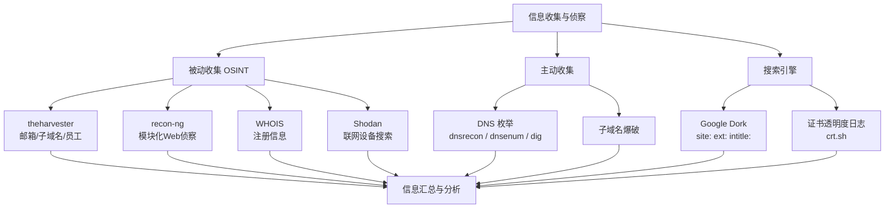
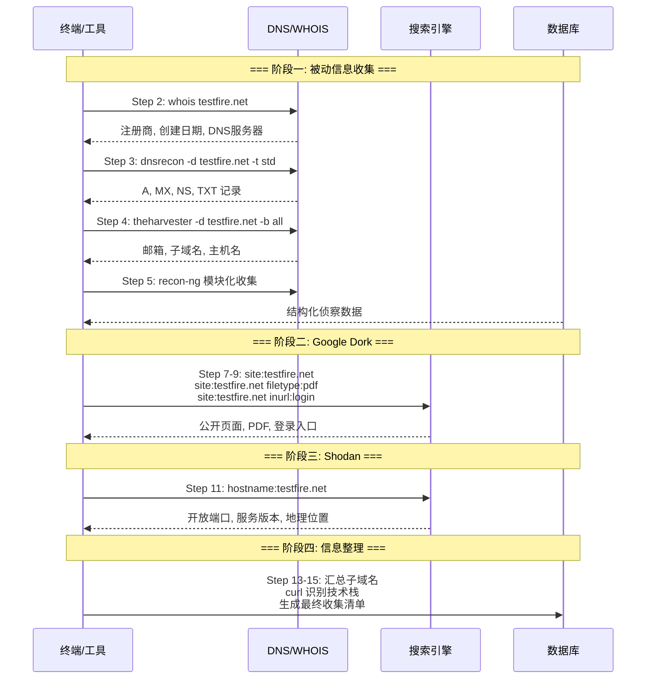

## 目录

- [[#一、OSINT 概念与方法论|一、OSINT 概念与方法论]]
  - [[#1.1 什么是 OSINT|1.1 什么是 OSINT]]
  - [[#1.2 信息收集金字塔|1.2 信息收集金字塔]]
  - [[#1.3 收集的信息类型|1.3 收集的信息类型]]
- [[#二、theharvester 使用教程|二、theharvester 使用教程]]
  - [[#2.1 工具介绍|2.1 工具介绍]]
  - [[#2.2 基本用法|2.2 基本用法]]
  - [[#2.3 可用数据源列表|2.3 可用数据源列表]]
  - [[#2.4 输出解读|2.4 输出解读]]
- [[#三、recon-ng 使用教程|三、recon-ng 使用教程]]
  - [[#3.1 工具介绍|3.1 工具介绍]]
  - [[#3.2 环境准备|3.2 环境准备]]
  - [[#3.3 基础操作流程|3.3 基础操作流程]]
  - [[#3.4 常用模块列表|3.4 常用模块列表]]
  - [[#3.5 工作流程最佳实践|3.5 工作流程最佳实践]]
- [[#四、DNS 枚举|四、DNS 枚举]]
  - [[#4.1 dnsrecon 使用|4.1 dnsrecon 使用]]
  - [[#4.2 dnsenum 使用|4.2 dnsenum 使用]]
  - [[#4.3 dig 和 nslookup 基础查询|4.3 dig 和 nslookup 基础查询]]
- [[#五、WHOIS 查询|五、WHOIS 查询]]
  - [[#5.1 基础用法|5.1 基础用法]]
  - [[#5.2 关键信息提取|5.2 关键信息提取]]
  - [[#5.3 注意事项|5.3 注意事项]]
- [[#六、Google Dork 技巧|六、Google Dork 技巧]]
  - [[#6.1 基础搜索操作符|6.1 基础搜索操作符]]
  - [[#6.2 常用渗透测试 Dork|6.2 常用渗透测试 Dork]]
  - [[#6.3 安全搜索注意事项|6.3 安全搜索注意事项]]
- [[#七、Shodan 搜索基础|七、Shodan 搜索基础]]
  - [[#7.1 Shodan 简介|7.1 Shodan 简介]]
  - [[#7.2 基础搜索语法|7.2 基础搜索语法]]
  - [[#7.3 Shodan CLI 使用|7.3 Shodan CLI 使用]]
- [[#八、实践练习|八、实践练习]]



## 一、OSINT 概念与方法论

> 相关模块: [[01-基础命令与Linux安全操作|Linux 基础]] (查找与 grep 命令) | [[03-网络扫描与枚举技术|网络扫描]]

### 1.1 什么是 OSINT

OSINT (Open Source Intelligence) 是指从公开可用资源收集和分析信息的过程。在渗透测试中, OSINT是信息收集的第一步, 主要特征:

- 被动收集: 不直接与目标系统交互, 不易被察觉
- 信息来源: 搜索引擎, DNS, 社交媒体, 代码仓库, 证书透明度日志等
- 目标: 域名, IP段, 员工邮箱, 技术栈, 文档元数据等

### 1.2 信息收集金字塔

自上而下的信息收集层次:

1. 组织信息 (行业, 地点, 规模)
2. 域名与IP段 (whois, DNS, 证书)
3. 子域名与服务 (DNS枚举, 搜索引擎)
4. 技术栈 (HTTP头, 错误页面, 源码)
5. 人员信息 (邮箱, 社交媒体)
6. 漏洞与披露 (CVE, 公开漏洞)

### 1.3 收集的信息类型

- 技术信息: 域名, 子域名, IP地址, 开放端口, 服务版本
- 组织信息: 员工名单, 邮箱格式, 组织结构
- 基础设施: DNS服务器, 邮件服务器, CDN, 云服务
- 凭证泄露: GitHub泄露, 公开数据库, Pastebin

## 二、theharvester 使用教程

### 2.1 工具介绍

theharvester 是一款强大的OSINT工具, 用于从多个公开来源收集:

- 邮箱地址 (email addresses)
- 子域名 (subdomains)
- 主机名 (hostnames)
- 员工姓名 (employee names)
- 开放端口 (open ports)
- Banner信息

### 2.2 基本用法

```bash
# 基础命令格式:
theharvester -d <domain> -b <source> [options]
```

参数说明:

| 参数 | 说明 |
|---|---|
| `-d` | 目标域名 |
| `-b` | 数据来源 (google, bing, linkedin, all等) |
| `-l` | 限制结果数量 |
| `-f` | 输出文件名 |
| `-s` | 从Shodan获取结果 (需API key) |

```bash
# 使用所有来源收集
theharvester -d example.com -b all

# 限制结果数量
theharvester -d example.com -b google -l 200

# 输出到HTML文件
theharvester -d example.com -b all -f report.html

# 使用特定来源组合
theharvester -d example.com -b google,bing,linkedin

# DNS暴力破解子域名
theharvester -d example.com -c

# 使用Shodan (需要API key)
theharvester -d example.com -b shodan -s
```

### 2.3 可用数据源列表

`google`, `googleCSE`, `bing`, `bingapi`, `linkedin`, `twitter`, `yahoo`, `baidu`, `shodan`, `dnsdumpster`, `crtsh` (证书透明度), `virustotal`, `threatcrowd`, `securityTrails` 等。

### 2.4 输出解读

运行 `theharvester -d example.com -b all` 后, 输出结构:

```
[+] Emails found:               # 发现的邮箱
[+] Hosts found:                # 发现的主机/子域名
[+] IPs found:                  # 发现的相关IP
[+] LinkedIn users:             # LinkedIn上相关用户
[+] Twitter accounts:           # Twitter相关账号
```

## 三、recon-ng 使用教程

### 3.1 工具介绍

recon-ng 是一个全功能的Web侦察框架, 采用模块化设计, 类似Metasploit的操作风格, 使用独立模块进行信息收集。

### 3.2 环境准备

```bash
recon-ng                    # 启动recon-ng
marketplace refresh         # 刷新模块市场
marketplace search          # 搜索可用模块
marketplace install all     # 安装所有模块 (或安装特定模块)
```

### 3.3 基础操作流程

**Step 1**: 创建工作区
```bash
recon-ng
workspaces create mytarget        # 创建名为mytarget的工作区
```

**Step 2**: 添加种子信息 (域名/公司/联系人)
```bash
add domains example.com           # 添加域名
add domains example.org
show domains                      # 查看已添加的域名
```

**Step 3**: 加载并运行模块
```bash
# DNS枚举 - 使用Bing搜索引擎收集子域名
modules load recon/domains-hosts/bing_domain_web
show options                      # 查看模块选项
run                               # 运行模块
back                              # 返回主菜单

# 证书透明度日志
modules load recon/domains-hosts/certspotter
run

# Google搜索收集主机
modules load recon/domains-hosts/google_site_web
set SOURCE example.com
run

# LinkedIn信息收集 (需API key配置)
modules load recon/contacts-contacts/linkedin_contacts
show options
run
```

**Step 4**: 查看收集结果
```bash
show hosts                        # 查看发现的主机
show contacts                     # 查看发现的联系方式
show domains                      # 查看域名
show companies                    # 查看公司信息
```

**Step 5**: 导出数据
```bash
# 导出为CSV
modules load reporting/csv
set FILENAME /root/report.csv
run

# 导出为HTML报告
modules load reporting/html
set FILENAME /root/report.html
set CREATOR "RedTeam Training"
set CUSTOMER "Target Corp"
run
```

### 3.4 常用模块列表

**域名/主机发现:**
```
recon/domains-hosts/bing_domain_web
recon/domains-hosts/google_site_web
recon/domains-hosts/certspotter
recon/domains-hosts/builtwith         # 技术栈识别
recon/domains-hosts/threatcrowd
recon/domains-hosts/virustotal
```

**联系人发现:**
```
recon/contacts-contacts/whois_pocs
recon/contacts-contacts/linkedin_contacts
recon/contacts-contacts/mailtester
```

**凭证/泄露:**
```
recon/contacts-credentials/hibp_paste
recon/companies-contacts/bing_linkedin_cache
```

**地理位置:**
```
recon/locations-locations/geocode
```

### 3.5 工作流程最佳实践

1. 为每个目标创建独立工作区
2. 先添加域名或公司名称作为种子
3. 使用被动模块(不需要直接访问目标)
4. 交叉验证从不同来源收集的信息
5. 定期导出数据库备份
6. 使用 `show schema` 查看数据库结构

## 四、DNS 枚举

> 相关模块: [[03-网络扫描与枚举技术|网络扫描]] (nmap DNS 脚本) | [[#五、WHOIS 查询|WHOIS]]

### 4.1 dnsrecon 使用

功能: DNS记录枚举, 子域名暴力破解, DNSSEC测试, 区域传输测试

```bash
# 标准DNS记录枚举
dnsrecon -d example.com

# 枚举所有记录类型
dnsrecon -d example.com -t std

# 测试DNS区域传输
dnsrecon -d example.com -t axfr

# 子域名暴力破解 (使用字典)
dnsrecon -d example.com -D /usr/share/wordlists/subdomains -t brt

# 反向DNS查找
dnsrecon -r 192.168.1.0/24

# 输出为XML
dnsrecon -d example.com --xml output.xml
```

### 4.2 dnsenum 使用

功能: 全面的DNS枚举, 包含区域传输, whois, Google Dork

```bash
# 完整枚举 (子域名爆破 + 反向查找 + whois + Google)
dnsenum example.com

# 使用自定义子域名字典
dnsenum -f /usr/share/wordlists/subdomains example.com

# 使用自定义DNS服务器
dnsenum --dnsserver 8.8.8.8 example.com

# 启用线程
dnsenum --threads 50 example.com

# 输出XML
dnsenum -o output.xml example.com
```

### 4.3 dig 和 nslookup 基础查询

```bash
# A记录
dig example.com A

# MX记录 (邮件服务器)
dig example.com MX

# NS记录 (名称服务器)
dig example.com NS

# TXT记录 (含SPF, DKIM等)
dig example.com TXT

# 全部记录
dig example.com ANY

# 指定DNS服务器
dig @8.8.8.8 example.com A

# 反向查询
dig -x 192.168.1.1
```

## 五、WHOIS 查询

### 5.1 基础用法

```bash
whois example.com                    # 查询域名whois信息
whois 192.168.1.1                   # 查询IP whois信息
whois -h whois.arin.net 192.168.1.1  # 指定whois服务器
```

### 5.2 关键信息提取

WHOIS记录中重点查看:

| 字段 | 说明 |
|---|---|
| Registry Domain ID | 域名注册ID |
| Registrar | 注册商 |
| Creation Date | 创建日期 |
| Registry Expiry Date | 过期日期 |
| Name Server | DNS服务器 |
| Registrant Organization | 注册组织 |
| Registrant Email | 注册者邮箱 |
| Tech Email | 技术联系人邮箱 |
| IP Range (IP whois) | IP地址段 |

### 5.3 注意事项

- 许多域名启用了WHOIS隐私保护, 信息可能被隐藏
- 历史WHOIS记录可能比当前更有价值 (使用whoisxmlapi等服务)
- 组合使用多个WHOIS服务器获取更完整信息

## 六、Google Dork 技巧

### 6.1 基础搜索操作符

| 操作符 | 用途 |
|---|---|
| `site:example.com` | 限制搜索特定网站 |
| `intitle:"index of"` | 页面标题包含指定文字 |
| `inurl:admin` | URL包含指定文字 |
| `filetype:pdf` | 搜索特定文件类型 |
| `intitle:"index of" "parent directory"` | 目录列表 |
| `intext:password` | 页面文本包含指定文字 |
| `cache:example.com` | 查看Google缓存的页面 |
| `link:example.com` | 链接到指定页面的页面 |
| `related:example.com` | 相似网站 |

### 6.2 常用渗透测试 Dork

```
site:target.com filetype:pdf                    # PDF文件
site:target.com inurl:login                     # 登录页面
site:target.com intitle:"index of"              # 目录列表
site:target.com ext:sql | ext:bak | ext:zip     # 敏感文件
site:target.com intext:"password" filetype:xls  # 含密码的Excel
site:github.com "target.com" password           # GitHub泄露
intitle:"phpinfo.php"                           # PHP信息页面
inurl:/wp-content/uploads/                      # WordPress上传目录
intitle:"Dashboard" inurl:admin                 # 管理面板
```

### 6.3 安全搜索注意事项

- Google会记录搜索行为, 使用VPN或代理保护隐私
- 高频自动化搜索可能触发Google验证码和封禁
- 建议使用Bing, DuckDuckGo等替代搜索引擎分散请求
- 遵守目标站点的服务条款和robots.txt

## 七、Shodan 搜索基础

### 7.1 Shodan 简介

Shodan是互联网设备搜索引擎, 可搜索:

- 开放端口和服务
- IoT设备 (摄像头, 路由器)
- 工业控制系统 (ICS/SCADA)
- 数据库 (MySQL, MongoDB, ElasticSearch等)

### 7.2 基础搜索语法

```bash
hostname:example.com            # 搜索域名相关
org:"Company Name"              # 搜索组织拥有的IP
port:22                         # 搜索开放22端口的设备
product:nginx                   # 搜索运行nginx的设备
country:CN                      # 搜索特定国家
city:"Beijing"                  # 搜索特定城市
os:"Windows 10"                 # 搜索Windows 10设备
vuln:CVE-2021-44228             # 搜索有特定漏洞的设备
```

组合查询:

```
org:"Target Corp" port:3389     # 某组织的RDP服务
country:US product:Apache       # 美国的Apache服务器
```

### 7.3 Shodan CLI 使用

```bash
shodan init YOUR_API_KEY           # 初始化API密钥
shodan search "nginx"              # 搜索
shodan host 192.168.1.1           # 查询特定IP
shodan stats --facets port nginx  # 统计信息
```

## 八、实践练习

**目标**: 对一个公开测试域名进行完整的信息收集



**阶段一: 被动信息收集**

```bash
# Step 1: 创建工作目录
mkdir -p ~/recon/target && cd ~/recon/target

# Step 2: WHOIS查询
whois testfire.net > whois.txt
cat whois.txt
# 记录: 注册商, 创建日期, DNS服务器, 注册者信息

# Step 3: DNS记录枚举
dnsrecon -d testfire.net -t std > dns.txt
cat dns.txt
# 记录: A记录, MX记录, NS记录, TXT记录

# Step 4: theharvester 收集
theharvester -d testfire.net -b all -f harvester.html
# 查看: Firefox打开harvester.html查看结果

# Step 5: recon-ng 模块化收集
recon-ng
# workspaces create testfire
# add domains testfire.net
# modules load recon/domains-hosts/bing_domain_web
# run
# modules load recon/domains-hosts/certspotter
# run
# back
# show hosts
# modules load reporting/html
# set FILENAME /root/recon/target/recon-ng-report.html
# run
# exit
```

**阶段二: Google Dork**

```bash
# Step 6-7: 在Firefox中搜索
# site:testfire.net
# 查看搜索结果, 了解网站公开页面结构

# Step 8: 搜索特定文件类型
# site:testfire.net filetype:pdf

# Step 9: 搜索后台登录页面
# site:testfire.net inurl:login OR inurl:admin
# 记录发现的登录入口
```

**阶段三: Shodan搜索**

```bash
# Step 10-11: 浏览器访问 https://www.shodan.io
# 搜索: hostname:testfire.net
# 查看搜索结果: 开放端口, 服务版本, 地理位置
```

**阶段四: 信息整理与分析**

```bash
# Step 12: 汇总所有发现
echo "=== 信息收集报告 ===" > final_report.txt
echo "域名: testfire.net" >> final_report.txt
echo "" >> final_report.txt
echo "--- WHOIS信息 ---" >> final_report.txt
cat whois.txt | grep -E "Creation|Registry|Registrar|Name Server" >> final_report.txt
echo "" >> final_report.txt
echo "--- DNS记录 ---" >> final_report.txt
cat dns.txt >> final_report.txt
echo "--- 报告完成 ---" >> final_report.txt

# Step 13: 整理所有子域名 (每行一个)
# 从theharvester, dnsrecon, recon-ng的结果中提取

# Step 14: 技术栈识别
for sub in $(cat subdomains.txt); do
  curl -sI "http://$sub" 2>/dev/null | grep -i "server:\|x-powered-by"
done

# Step 15: 生成最终收集清单
# - 所有子域名和IP地址
# - 开放端口和服务
# - 技术栈和框架
# - 员工邮箱格式
# - 潜在弱点(过期软件, 默认配置等)
```

**注意事项与提示**:
- 始终确认你有权利对目标进行信息收集 (授权测试范围内)
- 被动信息收集优于主动扫描, 更不易被检测
- 交叉验证多个来源的信息, 单一来源可能不准确
- 记录所有操作的时间戳和来源, 便于报告撰写
- 敏感信息(如发现泄露的凭证)立即通过安全渠道报告
- Firefox隐私模式可减少搜索记录: `Ctrl+Shift+P`
- recon-ng的工作区数据库位于 `~/.recon-ng/workspaces/`

---

[[../总目录与快速查询|总目录]] | [[01-基础命令与Linux安全操作|上一章: Linux 基础]] | [[03-网络扫描与枚举技术|下一章: 网络扫描]]
