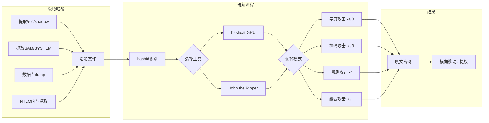
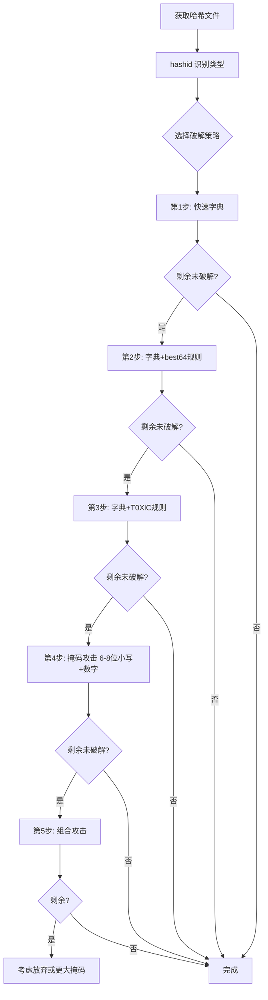

# 02-离线密码破解大师课

ArchStrike工具组：hashcat, john (John the Ripper)
预计学习时间：5-8小时 | 难度：中级到高级

## 目录

- [[#一、离线密码破解概述|一、离线密码破解概述]]
- [[#二、Hashcat 全模式攻击|二、Hashcat 全模式攻击]]
 - [[#2.1 字典攻击 -a 0|2.1 字典攻击 (-a 0)]]
 - [[#2.2 组合攻击 -a 1|2.2 组合攻击 (-a 1)]]
 - [[#2.3 掩码攻击 -a 3|2.3 掩码攻击 (-a 3)]]
 - [[#2.4 混合攻击 -a 6 -a 7|2.4 混合攻击 (-a 6 / -a 7)]]
 - [[#2.5 规则引擎|2.5 规则引擎]]
- [[#三、John the Ripper 高级技巧|三、John the Ripper 高级技巧]]
- [[#四、哈希识别与提取|四、哈希识别与提取]]
- [[#五、GPU加速与性能调优|五、GPU加速与性能调优]]
- [[#六、完整破解实践|六、完整破解实践]]
- [[#附录：命令速查表|附录：命令速查表]]

## 一、离线密码破解概述

离线密码破解是指攻击者已获取密码哈希文件，在本地使用工具尝试恢复明文密码。与在线攻击不同，离线破解不受速率限制和账户锁定策略影响。



## 二、Hashcat 全模式攻击

hashcat 是最快的 GPU 密码破解工具，支持 300+ 哈希类型。安装：

```bash
sudo pacman -S hashcat
# 或
sudo pacman -S hashcat-utils
```

### 2.1 字典攻击 (-a 0)

最基础的攻击模式，逐行尝试字典文件中的密码。

```bash
# NTLM哈希字典攻击
hashcat -m 1000 -a 0 /tmp/ntlm_hashes /usr/share/wordlists/rockyou

# 显示已破解的密码
hashcat -m 1000 /tmp/ntlm_hashes --show

# 不显示已破解的(--left仅输出未破解的)
hashcat -m 1000 /tmp/ntlm_hashes --left

# 指定输出文件
hashcat -m 1000 -a 0 -o /tmp/cracked.txt /tmp/ntlm_hashes rockyou.txt
```

常用哈希类型 `-m` 值：

| 模式 | 哈希类型 |
|------|---------|
| 0 | MD5 |
| 100 | SHA1 |
| 1000 | NTLM |
| 1400 | SHA-256 |
| 1700 | SHA-512 |
| 1800 | sha512crypt $6$ |
| 3200 | bcrypt $2a$ |
| 500 | md5crypt $1$ |
| 7400 | sha256crypt $5$ |
| 5500 | NetNTLMv1 |
| 5600 | NetNTLMv2 |
| 11600 | 7-Zip |
| 13721 | VeraCrypt |
| 22000 | WPA-PBKDF2-PMKID+EAPOL |

```bash
# Linux shadow 破解
hashcat -m 1800 -a 0 /tmp/shadow_hashes rockyou.txt

# WordPress 哈希
hashcat -m 400 -a 0 /tmp/wp_hashes rockyou.txt

# WPA2 握手破解
hashcat -m 22000 -a 0 /tmp/wpa_handshake rockyou.txt
```

### 2.2 组合攻击 (-a 1)

将两个字典的单词进行笛卡尔积组合。

```bash
# 组合攻击: 字典1 × 字典2
hashcat -m 1000 -a 1 /tmp/ntlm_hashes /tmp/words1.txt /tmp/words2.txt

# 创建测试示例
cat > /tmp/prefix.txt << 'EOF'
admin
root
super
EOF

cat > /tmp/suffix.txt << 'EOF'
123
2024
!
@
EOF

hashcat -m 0 -a 1 /tmp/test_hashes /tmp/prefix.txt /tmp/suffix.txt
# 生成: admin123, admin2024, admin!, admin@, root123, ...
```

### 2.3 掩码攻击 (-a 3)

根据掩码模式暴力生成密码，避免先生成完整字典。

```bash
# 掩码字符集说明:
# ?l = 小写字母 (a-z)
# ?u = 大写字母 (A-Z)
# ?d = 数字 (0-9)
# ?s = 特殊字符
# ?a = 所有可打印字符
# ?b = 0x00 - 0xff

# 8位纯数字密码
hashcat -m 1000 -a 3 /tmp/ntlm_hashes ?d?d?d?d?d?d?d?d

# 6-8位小写字母（递增模式）
hashcat -m 1000 -a 3 --increment --increment-min 6 --increment-max 8 \
 /tmp/ntlm_hashes ?l?l?l?l?l?l?l?l

# 自定义掩码: 大写+小写+数字 8位
hashcat -m 1000 -a 3 -1 ?l?u?d /tmp/ntlm_hashes ?1?1?1?1?1?1?1?1

# 常用模式: 1个大写+6个小写+2个数字
hashcat -m 1000 -a 3 /tmp/ntlm_hashes ?u?l?l?l?l?l?l?d?d

# 估算掩码空间
hashcat -m 1000 -a 3 --stdout ?l?l?l?l?d?d | wc -l
```

### 2.4 混合攻击 (-a 6 / -a 7)

字典+掩码组合，左侧或右侧追加掩码字符。

```bash
# -a 6: 字典单词 + 掩码后缀
hashcat -m 1000 -a 6 /tmp/ntlm_hashes /tmp/words.txt ?d?d?d
# 生成: password000, password001, ..., qwerty999

# -a 7: 掩码前缀 + 字典单词
hashcat -m 1000 -a 7 /tmp/ntlm_hashes ?d?d?d /tmp/words.txt
# 生成: 000password, 001password, ..., 999qwerty

# 实战: 常用词 + 1-4位数字
hashcat -m 1000 -a 6 /tmp/ntlm_hashes rockyou.txt ?d?d?d?d

# 常用词 + 特殊字符+年份
hashcat -m 1000 -a 6 /tmp/ntlm_hashes rockyou.txt ?s?d?d?d?d
```

### 2.5 规则引擎

规则文件定义密码变形操作，是非常强大的扩展机制。

```bash
# 使用内置规则
hashcat -m 1000 -a 0 /tmp/ntlm_hashes rockyou.txt -r /usr/share/hashcat/rules/best64.rule
hashcat -m 1000 -a 0 /tmp/ntlm_hashes rockyou.txt -r /usr/share/hashcat/rules/dive.rule
hashcat -m 1000 -a 0 /tmp/ntlm_hashes rockyou.txt -r /usr/share/hashcat/rules/T0XlC.rule

# 使用多条规则（串联）
hashcat -m 1000 -a 0 /tmp/ntlm_hashes rockyou.txt \
 -r /usr/share/hashcat/rules/best64.rule \
 -r /usr/share/hashcat/rules/onesix.rule
```

常用规则操作符速查：

| 操作符 | 功能 | 示例 |
|--------|------|------|
| `:` | 无操作（保留原词） | `:` |
| `l` | 全小写 | `l` |
| `u` | 全大写 | `u` |
| `c` | 首字母大写 | `c` |
| `$1 $2 $3` | 追加 "123" | `$1 $2 $3` |
| `^1 ^2 ^3` | 前缀 "123" | `^1 ^2 ^3` |
| `sxy` | 替换 x→y | `sa@` (a→@) |
| `d` | 复制单词 | `d` |
| `T0` | 反转单词 | `T0` |
| `]` | 删除首字符 | `]` |
| `[` | 删除尾字符 | `[` |

自定义规则示例 (`/tmp/my.rule`)：

```
:
$1 $2 $3
$!
$@
$2 $0 $2 $4
l $1 $2 $3
c $!
u
sa@ $1 $2 $3
```

## 三、John the Ripper 高级技巧

John 除了基础模式外，还支持独特的攻击方式。

```bash
# 安装
sudo pacman -S john

# 自动检测哈希类型并破解
john /tmp/hashes --wordlist=/usr/share/wordlists/rockyou

# 查看已破解密码
john --show /tmp/hashes

# 恢复中断的会话
john --restore
```

### 3.1 John 单破解模式 (Single Crack)

John 独特的功能：利用用户名字段（GECOS）变体。

```bash
# 先将passwd/shadow合并
unshadow /etc/passwd /etc/shadow > /tmp/combined

# 单破解模式（默认启用）
john --single /tmp/combined
```

### 3.2 增量模式 (Incremental)

John 的暴力破解实现：

```bash
# 全字符集增量
john --incremental /tmp/hashes

# 仅小写字母
john --incremental=Lower /tmp/hashes

# 仅数字
john --incremental=Digits /tmp/hashes
```

### 3.3 自定义规则

编辑 `/etc/john/john.conf` 或在命令行中定义：

```bash
# 列出可用规则
john --list=rules

# 使用规则
john --wordlist=rockyou.txt --rules=Single /tmp/hashes
john --wordlist=rockyou.txt --rules=Wordlist /tmp/hashes
```

### 3.4 John 支持的格式

```bash
# 列出支持的所有哈希格式
john --list=formats

# 指定格式破解
john --format=raw-sha256 /tmp/sha256_hashes --wordlist=rockyou.txt
john --format=NT /tmp/nt_hashes --wordlist=rockyou.txt
john --format=wpapsk /tmp/wpa_handshake --wordlist=rockyou.txt
```

## 四、哈希识别与提取

### 4.1 哈希识别工具

```bash
# 使用 hashid
sudo pacman -S hashid
hashid '$1$salt$hashvalue'
hashid -m '$6$salt$hashvalue' # 输出hashcat模式
hashid -j '$2a$10$...' # 输出john格式

# 使用 hash-identifier
wget https://raw.githubusercontent.com/blackploit/hash-identifier/master/hash-id.py
python3 hash-id.py
```

### 4.2 提取 Linux 哈希

```bash
# 合并 passwd 和 shadow
unshadow /etc/passwd /etc/shadow > /tmp/hashes

# 仅提取可破解的哈希条目
grep -v '!\|*' /tmp/hashes > /tmp/crackable_hashes
```

### 4.3 提取 Windows 哈希

```bash
# 从SAM/SYSTEM注册表文件提取
samdump2 SYSTEM SAM > /tmp/windows_hashes

# 使用Mimikatz
# mimikatz.exe
# privilege::debug
# sekurlsa::logonpasswords

# 使用 impacket-secretsdump
impacket-secretsdump -sam SAM -system SYSTEM LOCAL > /tmp/hashes
```

## 五、GPU加速与性能调优

### 5.1 GPU状态检查

```bash
# 查看GPU信息
hashcat -I

# 基准测试
hashcat -b -m 1000 # NTLM 测试
hashcat -b # 全部算法测试
```

### 5.2 性能优化参数

```bash
# 调整工作负载 profile (-w 1-4)
hashcat -m 1000 -a 0 -w 4 /tmp/hashes rockyou.txt # 最高性能

# 强制使用特定设备
hashcat -m 1000 -a 0 -d 1 /tmp/hashes rockyou.txt # GPU #1
hashcat -m 1000 -a 0 -D 2 /tmp/hashes rockyou.txt # 仅 GPU

# 优化内核循环 (-O)
hashcat -m 1000 -a 3 -O /tmp/hashes ?l?l?l?l?l?l?l?l

# 分段字典减少内存压力
split -l 500000 rockyou.txt rockyou_part_
for f in rockyou_part_*; do
 hashcat -m 1000 -a 0 /tmp/hashes "$f"
done
```

### 5.3 会话管理

```bash
# 命名会话
hashcat -m 1000 -a 3 --session ntlmmask /tmp/hashes ?l?l?l?l?l?l

# 恢复指定会话
hashcat --session ntlmmask --restore

# 查看所有已破解
hashcat -m 1000 /tmp/hashes --show

# 查看会话状态
hashcat --status
```

## 六、完整破解实践

从哈希获取到明文恢复的完整流程：



```bash
# Phase 1: 快速字典
hashcat -m 1000 -a 0 /tmp/ntlm_hashes rockyou.txt -O

# Phase 2: 字典 + best64规则
hashcat -m 1000 -a 0 /tmp/ntlm_hashes rockyou.txt \
 -r /usr/share/hashcat/rules/best64.rule -O

# Phase 3: 字典 + T0XlC规则 (更激进)
hashcat -m 1000 -a 0 /tmp/ntlm_hashes rockyou.txt \
 -r /usr/share/hashcat/rules/T0XlC.rule -O

# Phase 4: 掩码攻击 6-9位
hashcat -m 1000 -a 3 -O /tmp/ntlm_hashes \
 --increment --increment-min 6 --increment-max 9 \
 -1 ?l?d ?1?1?1?1?1?1?1?1?1

# Phase 5: 统计破解率
hashcat -m 1000 /tmp/ntlm_hashes --show | wc -l
hashcat -m 1000 /tmp/ntlm_hashes --left | wc -l
```

## 附录：命令速查表

**Hashcat**

```bash
# 字典攻击
hashcat -m [mode] -a 0 [hashes] [wordlist]
# 组合攻击
hashcat -m [mode] -a 1 [hashes] [dict1] [dict2]
# 掩码攻击
hashcat -m [mode] -a 3 [hashes] [mask]
# 混合(左字典右掩码)
hashcat -m [mode] -a 6 [hashes] [dict] [mask]
# 混合(左掩码右字典)
hashcat -m [mode] -a 7 [hashes] [mask] [dict]
# 使用规则
hashcat ... -r [rule_file]
# 显示已破解
hashcat -m [mode] [hashes] --show
# 显示未破解
hashcat -m [mode] [hashes] --left
# 恢复会话
hashcat --session [name] --restore
# 基准测试
hashcat -b -m [mode]
# GPU信息
hashcat -I
# 输出到文件
hashcat ... -o [output_file]
# 优化内核
hashcat ... -O
# 工作负载
hashcat ... -w [1-4]
```

**John the Ripper**

```bash
# 自动识别并破解
john [hashes] --wordlist=[dict]
# 单破解模式
john --single [hashes]
# 增量模式
john --incremental [hashes]
# 指定格式
john --format=[fmt] [hashes] --wordlist=[dict]
# 显示已破解
john --show [hashes]
# 恢复
john --restore
# 列出格式
john --list=formats
# 列出规则
john --list=rules
```

**哈希识别**

```bash
# hashid
hashid [hash_string]
hashid -m [hash_string] # hashcat模式
# hash-identifier
python3 hash-id.py
# unshadow
unshadow /etc/passwd /etc/shadow > combined.hash
```

---

上一教程：[[01-在线密码攻击大师课|01-在线密码攻击大师课]]
下一教程：[[03-字典生成与密码分析|03-字典生成与密码分析]]

[[../总目录与快速查询|← 返回总目录]]
