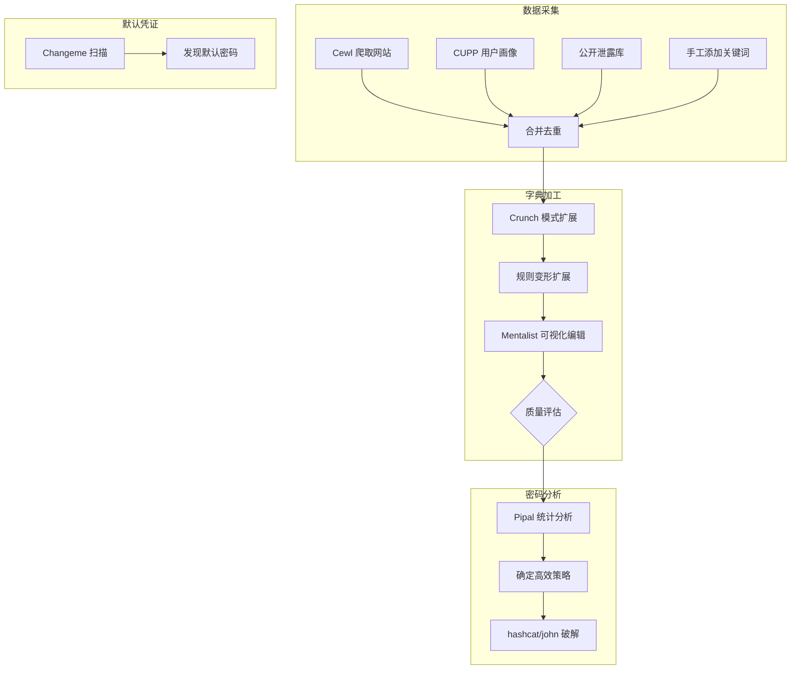

# 03-字典生成与密码分析

ArchStrike工具组：crunch, cupp, cewl, mentalist, changeme, pipal
预计学习时间：3-5小时  |  难度：初级到中级

## 目录

- [[#一、字典生成与密码分析概述|一、字典生成与密码分析概述]]
- [[#二、Cewl - 网站爬取生成字典|二、Cewl - 网站爬取生成字典]]
- [[#三、CUPP - 用户画像密码生成|三、CUPP - 用户画像密码生成]]
- [[#四、Crunch - 模式化字典生成|四、Crunch - 模式化字典生成]]
- [[#五、字典构建完整流水线|五、字典构建完整流水线]]
- [[#六、密码分析与策略优化|六、密码分析与策略优化]]
- [[#七、Changeme - 默认凭证检测|七、Changeme - 默认凭证检测]]
- [[#附录A：常见密码字典资源|附录A：常见密码字典资源]]
- [[#附录B：字典大小估算参考|附录B：字典大小估算参考]]
- [[#附录C：命令速查表|附录C：命令速查表]]

## 一、字典生成与密码分析概述

字典是密码攻击的弹药。高质量的字典结合概率排序和规则变形，能将破解率从 30% 提升到 80% 以上。



## 二、Cewl - 网站爬取生成字典

Cewl 从目标网站抓取内容，提取关键词生成针对性字典。

```bash
# 安装
sudo pacman -S cewl

# 基本爬取
cewl https://www.examplecorp.com \
  -w /tmp/examplecorp_words \
  -d 3 -m 4 --lowercase --meta -e

# 参数说明:
# -d 3: 爬取深度3层
# -m 4: 最小单词长度4
# --lowercase: 统一小写
# --meta: 包含meta标签内容
# -e: 包含email地址
```

查看收集到的词汇：

```bash
wc -l /tmp/examplecorp_words
head -30 /tmp/examplecorp_words
```

高级 Cewl 用法：

```bash
# 深度爬取+计数
cewl https://target.com -d 5 -m 3 -c -w /tmp/target_words

# 仅爬取指定路径
cewl https://target.com/blog -d 2 -w /tmp/blog_words

# 输出同时显示到stdout
cewl https://target.com -d 3 | tee /tmp/target_words

# 跟随外部链接（谨慎使用）
cewl https://target.com -d 2 --offsite -w /tmp/extended_words

# 自定义User-Agent
cewl https://target.com -d 3 --user-agent "Mozilla/5.0" -w /tmp/words.txt
```

## 三、CUPP - 用户画像密码生成

CUPP (Common User Passwords Profiler) 根据用户个人信息生成针对性密码字典。

```bash
# 安装
sudo pacman -S cupp

# 交互式模式
cupp -i
# 输入: 姓名、昵称、生日、宠物名、公司名、产品名、爱好等

# 从配置文件生成
cupp -c config.cfg
```

配置文件示例 (`/tmp/john.cfg`)：

```
firstname: john
lastname: smith
nickname: johnny
birthdate: 19900315
wife: jane
pet: max
company: examplecorp
keywords: productx, producty, cloud, devops
```

CUPP 自动生成的变形包括：
- 单词大小写变化
- 常见数字后缀 (123, 1, 2024)
- 日期变化 (生日年份、当前年份)
- 特殊字符追加 (!, @, #)
- 常用替换 (a→@, e→3, o→0)

## 四、Crunch - 模式化字典生成

Crunch 按字符集和模式生成密码字典。

```bash
# 安装
sudo pacman -S crunch

# 基本语法: crunch [min] [max] [charset] -o [output]
crunch 6 8 abcdefghijklmnopqrstuvwxyz -o /tmp/lower_6to8

# 估算大小（不实际生成）
crunch 6 8 abcdefghijklmnopqrstuvwxyz -s

# 模式生成: @ = 小写, , = 大写, % = 数字, ^ = 特殊
crunch 8 8 -t Pass%%% -o /tmp/pass_nums
# 生成: Pass000, Pass001, ..., Pass999

# 管道输出（不写磁盘）
crunch 6 6 0123456789 | hashcat -m 1000 /tmp/ntlm_hashes

# 读取单词列表生成组合
crunch 0 0 -q /tmp/base_words -o /tmp/combined

# 排列模式
crunch 0 0 -p word1 word2 word3
# 生成: word1word2word3, word1word3word2, word2word1word3, ...
```

### 4.1 为每个基础词生成数字后缀

```bash
# 方法1: 管道+shell扩展
crunch 0 0 -q /tmp/base_words | \
  while read word; do
    echo "$word"
    echo "${word}123"
    echo "${word}2026"
    echo "${word}!"
    echo "${word}@"
  done > /tmp/expanded_words

# 方法2: 用Hashcat的规则更高效
cat > /tmp/expand.rule << 'EOF'
:
$1 $2 $3
$!
$@ $2 $3
$2 $0 $2 $6
EOF
```

查看最终字典：

```bash
wc -l /tmp/expanded_words
head -20 /tmp/expanded_words
```

使用最终字典进行破解：

```bash
hashcat -m 1000 -a 0 /tmp/ntlm_hashes /tmp/expanded_words \
  -r /usr/share/hashcat/rules/best64.rule
```

## 五、字典构建完整流水线

### 5.1 场景：对 ExampleCorp 公司执行渗透测试

Step 1: 用 Cewl 从公司网站收集词汇：

```bash
cewl https://www.examplecorp.com \
  -w /tmp/examplecorp_words \
  -d 3 -m 4 --lowercase --meta -e
```

Step 2: 用 CUPP 生成员工针对性密码：

```bash
cupp -i
# 输入: CEO姓名, 公司名, 产品名, 成立年份等
```

Step 3: 合并两个来源的词汇：

```bash
cat /tmp/examplecorp_words john.txt | sort -u > /tmp/base_words
```

Step 4: 手工添加遗漏的关键词（产品名、缩写、内部行话）：

```bash
cat >> /tmp/base_words << 'EOF'
examplecorp
ecorp
ecorp2026
productx
producty
EOF
sort -u /tmp/base_words -o /tmp/base_words
```

### 5.2 Mentalist 可视化字典编辑

Mentalist 是图形化的字典生成工具，支持链式规则：

```bash
# 安装
sudo pacman -S mentalist

# 启动GUI
mentalist
```

Mentalist 优势：
- 可视化规则链（如：首字母大写 → 追加"123" → 追加"!"）
- 实时预览生成的密码数量
- 可导入/导出 hashcat 规则格式
- 支持从多个来源合并字典

### 5.3 自动化脚本 `dict_pipeline.sh`

```bash
#!/bin/bash
# dict_pipeline.sh - 自动化字典生成流水线
# 用法: ./dict_pipeline.sh <URL> <输出目录>

if [ $# -lt 2 ]; then
    echo "用法: $0 <URL> <输出目录>"
    exit 1
fi

URL="$1"
OUTDIR="$2"
mkdir -p "$OUTDIR"

echo "[*] Phase 1: Cewl 爬取..."
cewl "$URL" -d 3 -m 4 --lowercase -w "$OUTDIR/cewl_raw.txt"

echo "[*] Phase 2: CUPP 交互..."
cupp -i
# 手动移动 CUPP 输出
mv *.txt "$OUTDIR/cupp_output.txt" 2>/dev/null

echo "[*] Phase 3: 合并去重..."
cat "$OUTDIR"/cewl_raw.txt "$OUTDIR"/cupp_output.txt 2>/dev/null | \
  sort -u > "$OUTDIR/base.txt"

echo "[*] Phase 4: Crunch 模式扩展..."
crunch 0 0 -q "$OUTDIR/base.txt" | \
  while read word; do
    echo "$word"
    echo "${word}123"
    echo "${word}2026"
    echo "${word}!"
  done > "$OUTDIR/expanded.txt"

echo "[*] Phase 5: 最终字典..."
sort -u "$OUTDIR/expanded.txt" -o "$OUTDIR/final_dict.txt"
wc -l "$OUTDIR/final_dict.txt"
echo "[*] 完成! 字典: $OUTDIR/final_dict.txt"
```

```bash
chmod +x dict_pipeline.sh
./dict_pipeline.sh https://example.com /tmp/my_dict
```

## 六、密码分析与策略优化

### 6.1 Pipal 密码特征分析

Pipal 分析密码泄露库，揭示用户的密码行为模式。

```bash
# 安装
sudo pacman -S pipal

# 分析rockyou泄露库
pipal /usr/share/wordlists/rockyou -o /tmp/rockyou_analysis

# 查看分析报告
cat /tmp/rockyou_analysis
```

典型发现：
- 最常见的长度: 6-8位
- 最常见的结尾: "123", "1", "12", "1234"
- 超过30%为纯小写字母
- 最常见数字组合: "123", "123456", "111111"

### 6.2 基于发现创建高效破解策略

```bash
# 第1步: 纯小写6-8位字母字典
crunch 6 8 abcdefghijklmnopqrstuvwxyz -o /tmp/lower_6to8 2>/dev/null &

# 第2步: 使用Hashcat掩码快速尝试（比先生成字典更高效）
hashcat -m 1000 -a 3 /tmp/ntlm --increment --increment-min 6 --increment-max 8 ?l?l?l?l?l?l?l?l

# 第3步: rockyou字典 + best64规则（最常见的规则组合）
hashcat -m 1000 -a 0 /tmp/ntlm /usr/share/wordlists/rockyou \
  -r /usr/share/hashcat/rules/best64.rule

# 第4步: 对比不同策略的破解率
hashcat -m 1000 -a 0 /tmp/ntlm rockyou.txt --show | wc -l
hashcat -m 1000 -a 0 /tmp/ntlm rockyou.txt -r best64.rule --show | wc -l
```

## 七、Changeme - 默认凭证检测

Changeme 自动检测目标系统上的默认凭证。

```bash
# 安装
sudo pacman -S changeme

# 扫描默认凭证
changeme -a http://192.168.56.101 -v
changeme -a ssh://192.168.56.101 -v
changeme -a mysql://192.168.56.101 -v

# 批量扫描目标列表
changeme targets.txt -v

# 使用自定义凭证文件
changeme -a http://target -c /tmp/custom_creds.txt -v

# 如果发现了默认凭证，记录并用于后续渗透:
echo "发现默认凭证: admin:admin @ http://192.168.56.101" >> /tmp/findings
```

## 附录A：常见密码字典资源

| 字典文件 | 条数 | 描述 |
|---------|------|------|
| rockyou.txt | ~14,000,000 | 最常用的密码字典 |
| SecLists (通用) | ~10,000,000 | GitHub上大型字典集 |
| darkweb2017-top10000.txt | 10,000 | 泄露密码Top10000 |
| probable-v2-top12000.txt | 12,000 | 高可能密码 |
| fasttrack.txt | ~200 | 快速测试小字典 |
| phpbb.txt | ~180,000 | phpBB泄露密码 |
| myspace.txt | ~40,000 | MySpace泄露密码 |
| 500-worst-passwords.txt | 500 | 500个最差密码 |
| common-credentials/ | 各10-100 | 不同服务的默认凭证 |

SecLists仓库：https://github.com/danielmiessler/SecLists

## 附录B：字典大小估算参考

| 字符集 | 长度 | 组合数 | 近似文件大小 |
|--------|------|--------|-------------|
| 数字 (10) | 6 | 1,000,000 | 7 MB |
| 数字 (10) | 8 | 100,000,000 | 800 MB |
| 数字 (10) | 10 | 10,000,000,000 | 100 GB |
| 小写字母 (26) | 4 | 456,976 | 2.5 MB |
| 小写字母 (26) | 5 | 11,881,376 | 71 MB |
| 小写字母 (26) | 6 | 308,915,776 | 2.2 GB |
| 字母+数字 (36) | 4 | 1,679,616 | 11 MB |
| 字母+数字 (36) | 5 | 60,466,176 | 420 MB |
| 字母+数字 (36) | 6 | 2,176,782,336 | 15 GB |
| 大小写+数字 (62) | 4 | 14,776,336 | 120 MB |
| 大小写+数字 (62) | 5 | 916,132,832 | 7.5 GB |
| 大小写+数字 (62) | 6 | 56,800,235,584 | 450 GB |

> **警告**：超过1GB的字典通常不建议生成到磁盘，应使用Hashcat掩码(-a 3)替代。

## 附录C：命令速查表

**Crunch**

```bash
# 基本生成
crunch [min] [max] [charset] -o [file]
# 模式生成
crunch [min] [max] -t [pattern] -o [file]
# 估算大小
crunch [min] [max] [charset] -s
# 限制输出行数
crunch ... -c [lines] -o [file]
# 管道模式
crunch ... | hashcat/john/hydra ...
# 排列模式
crunch 0 0 -p [word1] [word2] ...
# 批量词组合
crunch 0 0 -q [wordlist] -o [file]
```

**CUPP**

```bash
# 交互式
cupp -i
# 从配置文件
cupp -c [config.cfg]
# 输出路径
# 默认输出到当前目录的 [firstname].txt
```

**Cewl**

```bash
# 基本爬取
cewl [url] -w [outfile]
# 设置深度
cewl [url] -w [outfile] -d [depth]
# 最小词长
cewl [url] -w [outfile] -m [min_len]
# 包含meta
cewl [url] --meta
# 小写化
cewl [url] --lowercase
# 单词计数
cewl [url] -c
# 包含email
cewl [url] -e
# 跟踪外部链接
cewl [url] --offsite
```

**Mentalist**

```bash
# 启动GUI
mentalist
```

**Changeme**

```bash
# 扫描默认凭证
changeme -a [protocol]://[IP]
# 批量扫描
changeme [targets.txt]
# 自定义凭证
changeme -a [url] -c [creds.txt]
# 详细输出
changeme ... -v
```

**Pipal**

```bash
# 分析密码文件
pipal [password_list.txt] -o [report.txt]
```

---

上一教程：[[02-离线密码破解大师课|02-离线密码破解大师课]]

完成 ArchStrike Cracking 工具组教程！
[[../总目录与快速查询|← 返回总目录]]
