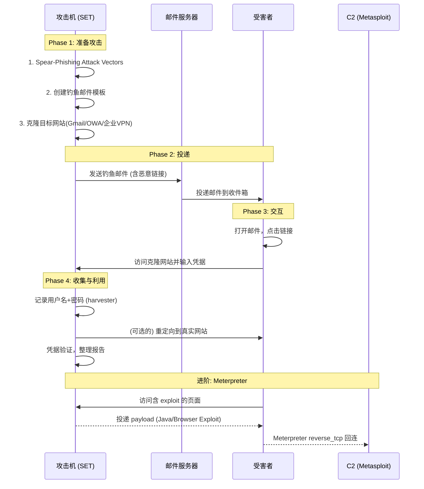

## 目录

- [[#一、社会工程学攻击概述|一、社会工程学攻击概述]]
- [[#二、SEToolkit 安装与配置|二、SEToolkit 安装与配置]]
- [[#三、鱼叉式钓鱼攻击|三、鱼叉式钓鱼攻击]]
  - [[#3.1 批量钓鱼邮件|3.1 批量钓鱼邮件]]
  - [[#3.2 凭据收集页面克隆|3.2 凭据收集页面克隆]]
- [[#四、Web 攻击向量|四、Web 攻击向量]]
  - [[#4.1 恶意网站克隆|4.1 恶意网站克隆]]
  - [[#4.2 Java Applet 攻击|4.2 Java Applet 攻击]]
  - [[#4.3 浏览器 Exploit|4.3 浏览器 Exploit]]
- [[#五、Payload 生成与投递|五、Payload 生成与投递]]
- [[#六、感染媒介 — USB/CD|六、感染媒介 — USB/CD]]
- [[#七、SET 高级技巧与联动|七、SET 高级技巧与联动]]
- [[#八、防御与检测|八、防御与检测]]



## 一、社会工程学攻击概述

社会工程学 (Social Engineering) 攻击针对的是安全链条中最薄弱的环节——人。SEToolkit (Social-Engineer Toolkit) 由 Dave Kennedy (ReL1K) 开发，是社会工程学攻击的行业标准工具。

> 相关模块: [[01-漏洞利用框架精通|Metasploit 框架]] | [[03-路由器与IoT漏洞利用|路由器/IoT 利用]] | [[../archstrike-base教学/04-漏洞评估与利用基础|漏洞利用基础]]

SET 核心攻击向量:

| 攻击向量 | 说明 | 典型场景 |
|---|---|---|
| Spear-Phishing | 鱼叉式钓鱼邮件，含恶意链接或附件 | 获取公司邮箱凭据 |
| Website Attack Vectors | 克隆网站、Java Applet、浏览器 exploit | 捕获 VPN/OWA 登录凭据 |
| Infectious Media Generator | 生成感染 U 盘 | 物理访问投递 payload |
| Create Payload and Listener | msfvenom 集成生成 payload | 自定义免杀 payload |
| Mass Mailer Attack | 批量发送钓鱼邮件 | 大规模凭据收集 |
| Arduino-Based Attack | USB 攻击设备 | 物理渗透 |
| SMS Spoofing | 短信欺骗 | 社工特定目标 |
| Wireless Access Point | 创建恶意 WiFi 热点 | 中间人攻击 |
| QRCode Generator | 生成恶意二维码 | 定向攻击 |
| Powershell Attack Vectors | Powershell payload 投递 | Windows 内网渗透 |
| Third Party Modules | 第三方模块扩展 | 社媒信息收集 |

## 二、SEToolkit 安装与配置

```bash
sudo pacman -S setoolkit

# 或以 root 账号启动
sudo setoolkit

# 验证版本
setoolkit --version
```

首次启动会进入主菜单:
```
Select from the menu:

  1) Spear-Phishing Attack Vectors
  2) Website Attack Vectors
  3) Infectious Media Generator
  4) Create a Payload and Listener
  5) Mass Mailer Attack
  6) Arduino-Based Attack Vector
  7) SMS Spoofing Attack Vector
  8) Wireless Access Point Attack Vector
  9) QRCode Generator Attack Vector
  10) Powershell Attack Vectors
  11) Third Party Modules
  12) Update the Social-Engineer Toolkit
  13) Update SET configuration
  14) Help, Credits, and About
  99) Return to Main Menu
```

SET 集成依赖于 Metasploit Framework，确保 Metasploit 已正确安装:

```bash
which msfconsole
sudo msfdb status
```

配置文件位于:

```bash
/etc/setoolkit/set.config
~/.setoolkit/
```

## 三、鱼叉式钓鱼攻击

鱼叉式钓鱼 (Spear-Phishing) 是 SET 最常用的攻击向量。

### 3.1 批量钓鱼邮件

```bash
sudo setoolkit

# 导航路径:
# 1) Spear-Phishing Attack Vectors
#   1) Perform a Mass Email Attack
#     - 选择 payload 类型（如使用 Adobe PDF 漏洞）
#     - 设置邮件内容、主题、发件人
#     - 设置目标列表 (单地址或文件)
#     - 选择邮件服务器（Gmail/自建/开放中继）

# 或者选择:
#   2) Create a FileFormat Payload
#     - 生成恶意 Office/PDF 文件
#     - 通过邮件附件发送
#   3) Create a Social-Engineering Template
#     - 自定义钓鱼邮件模板
```

邮件模板配置示例:
```
Subject: IT部门 - 重要安全更新通知
From: it-support@company.com

Dear Employee,

Our security team has detected unusual activity on your account.
Please verify your credentials immediately by visiting:
http://192.168.56.1/owa/login.html

Failure to verify within 24 hours will result in account suspension.

Regards,
IT Security Team
```

目标列表文件格式（每行一个邮箱）:
```
john.doe@target.com
jane.smith@target.com
admin@target.com
```

### 3.2 凭据收集页面克隆

最经典的 SET 攻击场景 — 克隆目标网站的登录页面并收集凭据:

```bash
sudo setoolkit

# 导航路径:
# 1) Spear-Phishing Attack Vectors
#   1) Perform a Mass Email Attack
#
# 或使用 Web 攻击向量:
# 2) Website Attack Vectors
#   3) Credential Harvester Attack Method
#     - 2) Site Cloner
#     - 设置攻击机 IP (LHOST)
#     - 输入要克隆的目标 URL
#       (例如: https://login.microsoftonline.com)
#     - SET 会克隆目标登录页面
```

使用 Harvester (凭证收集器):

```bash
# 导航路径:
# 2) Website Attack Vectors
#   3) Credential Harvester Attack Method
#     1) Web Templates
#       - 选择一个预置模板 (Gmail, Facebook, Twitter, etc.)
#     2) Site Cloner
#       - 输入要克隆的 URL
#       - 输入 POST 返回 URL
#     3) Custom Import
#       - 导入自定义 HTML 页面
```

当受害者访问克隆页面并输入凭据时，SET 会在终端实时显示:
```
[*] WE GOT A HIT! Printing the output:
POSSIBLE USERNAME FIELD FOUND: email=john.doe@target.com
POSSIBLE PASSWORD FIELD FOUND: passwd=Summer2024!
[*] WHEN YOU'RE FINISHED, HIT CONTROL-C TO GENERATE A REPORT.
```

## 四、Web 攻击向量

### 4.1 恶意网站克隆

```bash
# 导航路径:
# 2) Website Attack Vectors
#   3) Credential Harvester Attack Method
#     2) Site Cloner
#       - LHOST: 攻击机 IP
#       - Clone URL: https://owa.target.com
#       - 可选择重定向到真实网站（增加隐蔽性）
```

全页面克隆 + 重定向（隐蔽模式）:
- 受害者在克隆页面输入凭据
- SET 记录凭据
- 受害者被 302 重定向到真实网站
- 受害者以为只是密码输错了

### 4.2 Java Applet 攻击

通过 Java Applet 签名欺骗实现代码执行:

```bash
# 导航路径:
# 2) Website Attack Vectors
#   1) Java Applet Attack Method
#     - 1) Web Templates (克隆预置模板)
#     - 2) Site Cloner (克隆目标网站)
#     - 3) Custom Import (导入自定页面)
#     - 选择 payload:
#       1) Windows Shell Reverse_TCP
#       2) Windows Meterpreter Reverse_TCP
#       ...
#       - 设置 LHOST/LPORT
#       - 选择编码器 (shikata_ga_nai / x64/xor)
#       - 设置监听端口 (443 推荐)
```

工作流程:
1. 受害者访问被注入 Java Applet 的页面
2. 浏览器弹出安全警告 "此网站需要使用 Java"
3. 如果受害者点击"运行"，Applet 签名认证通过后执行
4. Meterpreter/Shell 回连攻击机

### 4.3 浏览器 Exploit

使用 Metasploit 浏览器 exploit 模块:

```bash
# 导航路径:
# 2) Website Attack Vectors
#   2) Metasploit Browser Exploit Method
#     - 2) Site Cloner
#     - 选择 exploit:
#       选择与目标浏览器版本匹配的 exploit
#       (MS12-037, MS14-064, MS15-034, etc.)
#     - 设置 payload 和选项
```

## 五、Payload 生成与投递

SET 可以直接调用 msfvenom 生成 payload:

```bash
# 导航路径:
# 4) Create a Payload and Listener
#   - 选择 payload 类型:
#     1) Windows Shell Reverse_TCP
#     2) Windows Meterpreter Reverse_TCP
#     3) Windows Meterpreter Reverse_HTTPS
#     4) Windows Meterpreter Reverse_TCP DNS
#     5) Windows PowerShell Reverse_TCP
#     ...
#   - 设置 LHOST, LPORT
#   - 选择编码器
#   - 选择输出格式 (exe, dll, ps1, vbs, etc.)
#   - 生成了 payload 后自动启动 listener
```

SET 生成的 payload 路径:
```
/root/.set/template.pdf    # 伪装 PDF 的 EXE
/root/.set/payload.exe     # 标准 EXE
/root/.set/payload.ps1     # PowerShell
```

## 六、感染媒介 — USB/CD

生成感染 U 盘（Autorun 自动执行）:

```bash
# 导航路径:
# 3) Infectious Media Generator
#   1) Standard File-Format Exploit
#     - 选择 File-Format exploit (如 MS14-060)
#     - 选择 payload
#     - 设置 LHOST/LPORT
#     - 生成 ISO/U盘文件

#   2) Standard Executable (EXE)
#     - 生成 autorun.inf + payload.exe
```

生成的 USB 目录结构:
```
USB_ROOT/
  autorun.inf          # [autorun] open=update.exe
  update.exe           # 恶意 payload
  README.txt           # 伪装文件
  Documents/           # 伪装文件夹
```

注意: 现代 Windows 默认禁用 Autorun，但在一些老旧系统或嵌入式设备上仍然有效。

## 七、SET 高级技巧与联动

**与 Metasploit 联动:**

SET 的很多功能依赖 Metasploit，生成的 listener 会自动调用 msfconsole:

```bash
# SET 生成的 Metasploit resource 脚本位置:
cat ~/.set/meta_config

# 手动启动 listener:
msfconsole -r ~/.set/meta_config
```

**PowerShell 攻击向量（无文件攻击）:**

```bash
# 导航路径:
# 10) Powershell Attack Vectors
#   1) Powershell Alphanumeric Shellcode Injector
#      - 生成 Powershell 一键反弹 shell 命令
#      - 可直接在目标 cmd 中执行
```

**第三方模块扩展 — 社交媒体侦察:**

```bash
# 导航路径:
# 11) Third Party Modules
```

第三方模块可用于从 LinkedIn、Facebook 等平台收集目标人员信息，辅助鱼叉式钓鱼。

**SMS 欺骗:**

```bash
# 导航路径:
# 7) SMS Spoofing Attack Vector
#   - 设置目标手机号
#   - 自定义短信内容
#   - 选择 SMS 服务提供商
```

## 八、防御与检测

针对 SET 攻击的防御措施:

| 层面 | 措施 |
|---|---|
| 技术层 | 双因素认证 (2FA) — 即使凭据被收集也无法登录 |
| 技术层 | 电子邮件安全网关 — SEG 过滤已知的恶意链接和附件 |
| 技术层 | 浏览器策略 — 禁用 Java、限制 ActiveX、启用 SmartScreen |
| 技术层 | EDR/XDR — 检测 Powershell 进程链、异常出站连接 |
| 技术层 | 邮件认证 — SPF, DKIM, DMARC 阻止邮件欺骗 |
| 人员层 | 安全意识培训 — 识别钓鱼邮件的常见特征 |
| 人员层 | 钓鱼演练 — 定期内部模拟测试并培训 |
| 流程层 | 报告机制 — 员工快速报告可疑邮件 |
| 流程层 | 最小权限原则 — 限制普通用户的管理权限 |

钓鱼邮件识别标志:
- 邮件地址看似官方但实际是伪造域名（如 `support@micr0soft.com`）
- 紧急语气催促立即行动
- 要求点击链接输入凭据
- 拼写/语法错误
- 意外的附件下载提示

社会工程学攻击的成功率取决于攻击者对目标的研究深度和精心设计的诱饵。SEToolkit 简化了攻击的技术环节，但真正有效的社工攻击需要前期充分的 OSINT 收集、量身定制的邮件内容和对目标心理学弱点（紧迫感、权威服从、好奇心）的精准利用。

[[../总目录与快速查询|← 返回总目录]]
