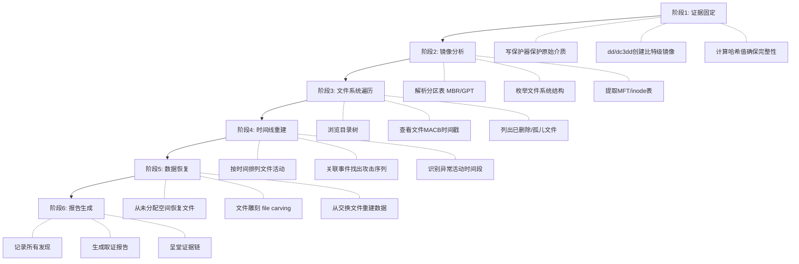
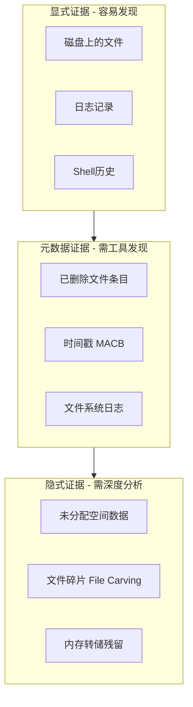

# 模块08：磁盘取证与反取证技术

> **学习目标**：理解取证调查流程、掌握TSK套件和Autopsy使用、学习反取证技巧
> **所需工具**：sleuthkit, autopsy, dc3dd, guymager, ddrescue, foremost

## 目录

- [[#一、取证流程理解 红队视角|取证流程]]
- [[#二、Sleuth Kit命令行工具|Sleuth Kit]]
- [[#三、Autopsy图形化取证平台|Autopsy]]
- [[#四、反取证技巧|反取证技巧]]
- [[#五、实践演练|实践演练]]

---

## 一、取证流程理解(红队视角)

作为红队成员，理解取证调查的完整流程至关重要。知道防御方如何调查，才能知道自己的痕迹会以什么方式被发现。

### 1.1 标准数字取证调查流程



### 1.2 红队关键认知

- MFT/inode 中的删除标记只是一个位，文件数据通常仍在磁盘上
- 时间戳 (MACB) 会精确记录你的每一个文件操作
- USN Journal (Windows) 和 ext4 journal (Linux) 记录文件系统变更
- 即使 rm 删除的文件，数据仍然存在，直到被覆盖
- `/tmp` 和 `/var/tmp` 是调查员重点关注的目录
- Shell 历史文件 (`.bash_history`, `.zsh_history`) 是主要证据来源
- 浏览器的缓存、历史记录、下载记录都会被详细检查

### 1.3 证据残留的层次模型



---

## 二、Sleuth Kit命令行工具

### 2.1 工具总览

Sleuth Kit是一套命令行取证工具，也是Autopsy的底层引擎。

```bash
sudo pacman -S sleuthkit # ArchStrike安装
```

主要工具及用途：

| 工具 | 功能 |
|------|------|
| mmls | 显示分区布局(分区表解析) |
| fsstat | 显示文件系统统计信息和结构 |
| fls | 列出文件和目录条目(包括已删除) |
| icat | 提取文件内容(通过inode号) |
| istat | 显示inode详细信息(含时间戳) |
| blkcat | 提取指定扇区/块内容 |
| blkls | 列出所有数据块(含未分配空间) |
| mactime | 从fls输出生成时间线 |

### 2.2 mmls — 查看分区布局

```bash
mmls evidence.dd
```

输出示例：
```
Slot Start End Length Description
002: 0000002048 0020971519 0020969472 NTFS / exFAT (0x07)
003: 0020971520 0041943039 0020971520 Linux (0x83)
```

> 关键：`-o 2048` 指定分区偏移(2048扇区 × 512字节 = 1MB)

### 2.3 fls — 列出文件和目录

```bash
# 递归列出所有文件(含已删除)
fls -r -o 2048 -a evidence.dd

# 仅列出已删除文件(关键命令!)
fls -r -o 2048 -d evidence.dd

# 列出指定目录
fls -o 2048 evidence.dd 5 # 根目录
fls -o 2048 evidence.dd 5/Users # Users目录

# 生成时间线
fls -r -o 2048 -m / evidence.dd > bodyfile.txt
mactime -b bodyfile.txt -d -z UTC > timeline.csv
```

输出格式解读：
```
r/r 4-128-1: secret_plan.txt
r/r *5-129-3: deleted_passwords.txt (deleted)
d/d 10-130-1: hidden_folder
```
- `r/r` = 常规文件；`d/d` = 目录；`r/r *` = 已删除文件
- `4-128-1` = inode号-MFT条目号-属性ID

### 2.4 icat — 提取文件内容

```bash
# 提取已知inode的文件
icat -o 2048 evidence.dd 128-3 > extracted_file.txt

# 提取已删除文件的内容
icat -o 2048 evidence.dd 129-3 > recovered_deleted.txt

# 批量提取所有可读文件
mkdir recovered_files
fls -r -o 2048 -d evidence.dd | while read line; do
 inode=$(echo "$line" | awk '{print $2}' | cut -d: -f1)
 name=$(echo "$line" | awk '{print $3}')
 icat -o 2048 evidence.dd "$inode" > "recovered_files/$name" 2>/dev/null
done
```

### 2.5 istat — inode详细信息

```bash
istat -o 2048 evidence.dd 128
```

输出包含：
- MACB时间戳(修改/访问/创建/MFT变更时间)
- 文件大小与实际占用空间
- 数据存储方式(常驻/非常驻)
- 权限和所有者信息

**时间戳对比技巧**：NTFS文件有多个时间戳集：
- `$STANDARD_INFORMATION`：可被用户空间修改(容易被伪造)
- `$FILE_NAME`：只有内核可以修改(难以伪造)

> 红队启示：只修改 `$STANDARD_INFORMATION` 是不够的，`$FILE_NAME` 时间戳也会暴露你的活动。

### 2.6 blkls/blkcat — 低级数据块操作

```bash
# 列出未分配空间(查找被覆盖前的残留数据)
blkls -o 2048 evidence.dd > unallocated.bin

# 提取指定簇范围
blkcat -o 2048 evidence.dd 1000 50

# 在未分配空间中搜索字符串
blkls -o 2048 evidence.dd | strings | grep -i "password"
```

---

## 三、Autopsy图形化取证平台

### 3.1 安装与启动

```bash
sudo pacman -S autopsy # ArchStrike安装
sudo autopsy
# 浏览器访问 http://localhost:9999/autopsy
```

### 3.2 创建案例步骤

1. 打开终端，输入 `sudo autopsy`
2. 浏览器访问 `http://localhost:9999/autopsy`
3. 点击 "New Case" → 填写案例信息
4. 点击 "Add Host" 添加主机
5. 点击 "Add Image File" 选择镜像文件
6. 等待Autopsy初始化(文件系统解析和哈希计算)

### 3.3 浏览与分析功能

**文件浏览 (File Analysis)**：
- 左侧目录树，右侧文件列表
- 已删除文件以红色标记显示
- 点击文件查看元数据和内容
- 支持十六进制查看模式

**查看已删除文件**：
- 勾选 "Show Deleted Files"
- 所有已删除但可恢复的文件将以红色字体显示
- MFT resident的小文件通常可以完整恢复

**时间线分析 (Timeline)**：
- 点击 "View Timeline" 按钮
- 按日/周/月查看
- 异常活动时间段会被突出显示

**关键词搜索**：
- 输入搜索词(如 "password", "C2")
- 在全镜像中搜索(包括未分配空间)

**报告生成**：
- 点击 "Generate Report"
- 选择报告类型(HTML/PDF/Excel)

### 3.4 红队自我审查实战

在渗透测试结束后，用Autopsy分析自己的"犯罪现场"：

```bash
# 攻击前创建磁盘快照
sudo dc3dd if=/dev/sda of=/evidence/before_attack.dd hash=sha256 log=before.log

# 执行完整的红队行动...

# 攻击后创建磁盘快照
sudo dc3dd if=/dev/sda of=/evidence/after_attack.dd hash=sha256 log=after.log

# 使用Autopsy加载 after_attack.dd
# 检查已删除文件列表 → 是否能恢复你的工具和脚本？
# 检查时间线 → 哪些文件操作在攻击时间段内发生？
# 搜索你的工具名称、C2域名、IP地址
```

---

## 四、反取证技巧

### 4.1 文件系统级痕迹理解

**Windows (NTFS)**：
- 删除文件 = MFT条目标记为未使用
- USN Journal (`$UsnJrnl:$J`) 记录所有文件变更
- `$LogFile` 记录NTFS元数据事务
- 影子卷 (Volume Shadow Copy) 保存文件历史版本

**Linux (ext4)**：
- 删除文件 = inode链接计数归零，块位图标记为空闲
- ext4 journal 记录元数据变更
- ctime 无法由用户修改(内核更新)，因此无法伪造

### 4.2 安全删除 — shred命令

```bash
# 覆盖7次 + 零填充
shred -z -n 7 /path/to/sensitive_file

# 删除整个目录
find /tmp/redteam_work/ -type f -exec shred -z -n 3 -u {} \;
rm -rf /tmp/redteam_work/
```

参数解读：
- `-n 7`：覆盖写入7次
- `-z`：最后一次用0填充(隐藏覆盖痕迹)
- `-u`：覆盖后删除文件

**注意事项**：
- SSD 上安全删除不可靠！磨损均衡算法可能导致数据被写入新位置
- 对SSD建议：使用全盘加密 + ATA Secure Erase

### 4.3 时间戳修改 — touch命令

```bash
# 修改单个文件的访问和修改时间
touch -a -m -t 202401010000.00 /path/to/file

# 批量伪造时间戳
find /var/log/ -type f -exec touch -a -m -t 202401010000.00 {} \;

# 复制参考文件的时间戳
touch -r /bin/ls /path/to/malicious_file
```

**高级反取证技巧**：
- 调查员会对比 `$STANDARD_INFORMATION` 和 `$FILE_NAME` 的时间戳
- 如果两者不一致，则文件时间戳被伪造 ← 这是检测指标
- 专业做法是同时修改两种时间戳(需要直接操作MFT)

### 4.4 日志清理

**Linux日志清理**：
```bash
# 清除shell历史
export HISTFILE=/dev/null
unset HISTFILE
history -c
shred -z -n 3 -u ~/.bash_history

# 清除系统日志
shred -z -n 3 -u /var/log/auth.log
shred -z -n 3 -u /var/log/syslog
shred -z -n 3 -u /var/log/wtmp
```

**Windows日志清理**：
```cmd
wevtutil cl Security
wevtutil cl System
wevtutil cl Application
```

### 4.5 文件残留位置清单

**Windows常见残留**：
- `%TEMP%\*` — 临时文件目录
- `C:\Windows\Prefetch\*.pf` — 应用程序预加载文件
- `C:\Windows\AppCompat\Programs\Amcache.hve` — 程序执行历史
- `$MFT` — 文件名记录
- USN Journal — 文件变更记录

**Linux常见残留**：
- `~/.bash_history` — Shell命令历史
- `~/.viminfo` — Vim编辑历史
- `/var/log/auth.log` — 认证日志
- `/var/log/wtmp` — 登录记录
- `~/.ssh/known_hosts` — SSH主机记录

**红队应对策略**：
1. 使用内存驻留工具(文件不落盘)
2. 使用RAM-only tmpfs (`/dev/shm`, `/run/shm`)
3. 及时清理临时文件和日志
4. 使用时间戳伪造掩盖操作时间
5. 优先使用系统自带工具(LOLBAS/LOLBins)

---

## 五、实践演练

### 5.1 创建测试磁盘镜像

```bash
# 创建100MB空文件
dd if=/dev/zero of=test_disk.dd bs=1M count=100

# 创建MBR分区表并格式化
printf "o\nn\np\n1\n\n\nw\n" | fdisk test_disk.dd
sudo losetup -f test_disk.dd
sudo mkfs.ext4 /dev/loop0
sudo mkdir -p /mnt/forensic_test
sudo mount /dev/loop0 /mnt/forensic_test
```

### 5.2 模拟红队活动

```bash
# 创建"敏感"文件
sudo bash -c 'echo "C2 Server: 192.168.1.100:4444" > /mnt/forensic_test/redteam_notes'
sudo bash -c 'echo "Password: SuperSecret123" > /mnt/forensic_test/credentials'
sudo bash -c 'cp /bin/ls /mnt/forensic_test/trojan_ls'

# "清除痕迹" — 删除文件
sudo rm /mnt/forensic_test/redteam_notes
sudo shred -z -n 3 -u /mnt/forensic_test/credentials

# 卸载镜像
sudo umount /mnt/forensic_test
sudo losetup -d /dev/loop0
```

### 5.3 用TSK分析镜像

```bash
# 查看分区表
mmls test_disk.dd

# 查看文件系统信息
fsstat -o 2048 test_disk.dd

# 列出所有文件(包括已删除)
fls -r -o 2048 -a test_disk.dd

# 尝试恢复已删除内容
fls -r -o 2048 -d test_disk.dd
icat -o 2048 test_disk.dd 12 > recovered_notes.txt

# 时间线分析
fls -r -o 2048 -m / test_disk.dd > bodyfile.txt
mactime -b bodyfile.txt -d > timeline.csv
```

### 5.4 用Autopsy分析镜像

```bash
sudo autopsy
# 浏览器 → New Case → Add Image → 分析
# 观察：rm删除的文件可完整恢复，shred覆盖的文件不可恢复
```

---

## 关键总结

1. 文件删除 ≠ 数据销毁 — 只是一个标记位的翻转
2. 取证工具可以轻松恢复已删除文件，除非被覆盖
3. 时间戳取证是检测红队活动的重要手段
4. SSD上的安全删除不可靠，推荐全盘加密
5. 日志文件中有大量直接和间接的活动记录
6. 反取证的核心不是"删除所有痕迹"，而是"不留下异常的痕迹"
7. 理想的清除策略 = 内存驻留 + LOLBAS + 最小文件依赖 + 时间戳一致性

---

> **相关模块**：[[02-内存取证与攻击痕迹|内存取证]] | [[03-数据恢复与反删除技术|数据恢复]]

[[../总目录与快速查询|← 返回总目录]]
