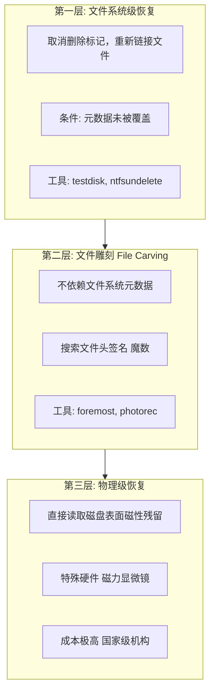
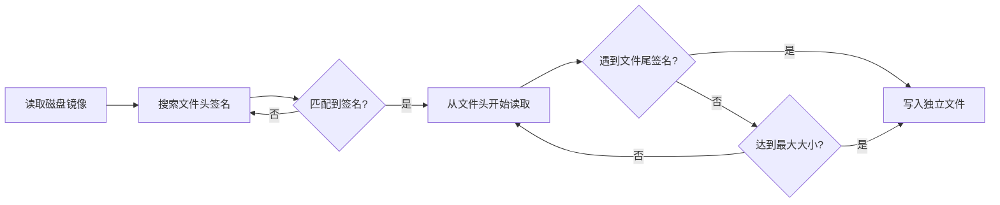
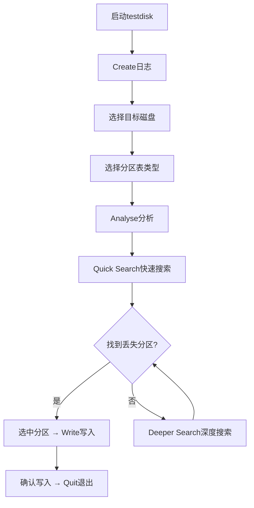

# 模块10：数据恢复与反删除技术

> **学习目标**：掌握文件雕刻恢复技术、理解安全删除原理、验证数据销毁效果
> **所需工具**：foremost, testdisk, photorec, dd, dc3dd, ddrescue, bulk_extractor

## 目录

- [[#一、文件删除原理与恢复基础|恢复原理]]
- [[#二、Foremost文件雕刻|Foremost]]
- [[#三、Testdisk分区恢复|Testdisk]]
- [[#四、dd与dc3dd磁盘镜像|dd/dc3dd]]
- [[#五、Bulk Extractor批量提取|Bulk Extractor]]
- [[#六、实践演练|实践演练]]

---

## 一、文件删除原理与恢复基础

### 1.1 文件系统如何"删除"文件

**Windows (NTFS/FAT)**：
1. 在MFT或目录项中标记条目标志为"已删除"
2. 在$Bitmap或FAT表中将对应簇标记为"未分配"
3. 文件数据本身 — **丝毫不受影响**
4. 只有在该簇被新文件覆盖时，原数据才会被销毁

**Linux (ext4)**：
1. inode链接计数(i_links_count)减为0
2. 块位图(Block Bitmap)中将对应数据块标记为空闲
3. inode位图中将inode标记为空闲
4. 目录项中移除文件名
5. 数据块内容 — **保持不变**

> 关键认知：删除操作只是修改了元数据，实际数据像"幽灵"一样在磁盘上滞留。SSD由于TRIM命令和垃圾回收，数据恢复成功率低于HDD。

### 1.2 数据恢复的三个层次



### 1.3 何时数据无法恢复

1. 数据块被其他文件覆盖
2. SSD执行了TRIM(数据块被物理擦除)
3. 多次shred覆盖(3次以上对HDD，对SSD无效)
4. 全盘加密密钥被销毁
5. 物理介质损坏(盘片划伤、闪存芯片烧毁)

---

## 二、Foremost文件雕刻

### 2.1 工作原理

foremost通过搜索文件头(文件签名/魔数)和文件尾来从原始数据流中恢复文件，完全不依赖文件系统元数据。

```bash
sudo pacman -S foremost  # ArchStrike安装
```



支持的文件类型(部分)：
jpg, gif, png, bmp, pdf, doc, xls, ppt, zip, rar, exe, avi, mp4, ole, all

### 2.2 基本使用

```bash
# 恢复所有类型
foremost -t all -i disk.dd -o recovered/

# 恢复指定类型
foremost -t jpg,png,pdf,zip -i disk.dd -o recovered/

# 从块设备直接恢复
foremost -t all -i /dev/sdb1 -o /mnt/recovery_output/
```

参数说明：
- `-t all`：恢复所有支持的文件类型
- `-i`：输入文件(磁盘镜像/原始设备)
- `-o`：输出目录(必须不存在或为空)

### 2.3 高级选项

```bash
# 指定块大小(影响精度和性能)
foremost -t all -b 4096 -i disk.dd -o recovered/

# 跳过指定偏移
foremost -t jpg -s 1000000 -i disk.dd -o recovered/

# 设置最大文件大小
foremost -t avi -M 500M -i disk.dd -o recovered/

# 快速模式
foremost -t all -q -i disk.dd -o recovered/

# 生成审计文件
foremost -t all -a -i disk.dd -o recovered/
```

### 2.4 自定义文件类型

编辑 `/etc/foremost.conf` 添加新签名：
```conf
# 格式: <扩展名> <大小写敏感> <最大大小> <文件头> <文件尾>
sqlite  y  100000000  \x53\x51\x4c\x69\x74\x65\x20\x66\x6f\x72\x6d\x61\x74\x20\x33\x00
```

使用自定义配置：
```bash
foremost -c /etc/foremost.conf -t sqlite -i disk.dd -o recovered/
```

### 2.5 输出目录结构

```
recovered/
├── audit.txt         # 恢复日志
├── jpg/
│   ├── 00000000.jpg
│   └── 00000001.jpg
├── pdf/
├── zip/
└── exe/
```

---

## 三、Testdisk分区恢复

### 3.1 安装与启动

```bash
sudo pacman -S testdisk  # 包含testdisk + photorec
sudo testdisk
```

### 3.2 分区恢复步骤



### 3.3 photorec文件恢复

photorec忽略文件系统，直接从磁盘扇区中恢复文件：

```bash
sudo photorec
```

TUI操作：
1. 选择目标磁盘
2. 选择分区
3. 选择文件系统类型 → [Other] 用于FAT/NTFS
4. 选择分析空间 → [Whole] 整个分区
5. 选择输出目录
6. 按Y开始恢复

恢复的文件命名格式：`f0012345.jpg`, `f0012367.txt`, `f0012401.pdf`

---

## 四、dd与dc3dd磁盘镜像

### 4.1 dd基础

```bash
# 创建磁盘镜像
dd if=/dev/sda of=/path/to/disk.dd bs=4M status=progress

# 创建分区镜像
dd if=/dev/sda1 of=partition1.dd bs=4M status=progress

# 只复制指定扇区
dd if=/dev/sda of=boot_sector.dd bs=512 count=1

# 管道压缩
dd if=/dev/sda bs=4M status=progress | gzip -c > disk.dd.gz

# 恢复镜像到磁盘(危险操作!)
dd if=disk.dd of=/dev/sdb bs=4M status=progress
```

### 4.2 dc3dd — 增强版dd

dc3dd由美国国防部网络犯罪中心开发(DC3 = Defense Cyber Crime Center)：

```bash
sudo pacman -S dc3dd

# 创建带哈希验证的镜像
sudo dc3dd if=/dev/sda of=/evidence/disk.dd hash=sha256 log=dc3dd.log
```

参数详解：
- `hash=sha256`：计算并显示SHA256哈希
- `hash=md5`：额外计算MD5
- `log=file.log`：写入详细操作日志
- `hashlog=file`：单独写入哈希日志
- `wipe=pattern`：用指定模式擦除后创建镜像

### 4.3 ddrescue — 损坏介质救援

```bash
sudo pacman -S ddrescue

# 第一轮: 快速复制好区域，跳过坏区
sudo ddrescue -f -n /dev/sdb rescued.img rescue.log

# 第二轮: 对坏区重试3次
sudo ddrescue -f -d -r3 /dev/sdb rescued.img rescue.log

# 第三轮: 从后往前读
sudo ddrescue -f -R /dev/sdb rescued.img rescue.log
```

---

## 五、Bulk Extractor批量提取

### 5.1 安装与基本使用

```bash
sudo pacman -S bulk_extractor

# 从磁盘镜像中提取所有类型信息
bulk_extractor -o output_dir/ disk.dd
```

### 5.2 输出目录结构

| 输出文件 | 内容 |
|----------|------|
| email.txt | 提取的电子邮件地址 |
| url.txt | 提取的URL |
| domain.txt | 提取的域名 |
| ip.txt | IPv4地址 |
| ccn.txt | 信用卡号码(带Luhn验证) |
| telephone.txt | 电话号码 |
| json.txt | JSON对象 |
| exif.txt | EXIF元数据 |
| wordlist.txt | 单词列表(可用于密码破解) |
| aes_keys.txt | AES密钥(通过熵分析) |

### 5.3 高级选项

```bash
# 指定扫描器子集
bulk_extractor -o output/ -e email -e url -e ccn disk.dd

# 排除特定扫描器
bulk_extractor -o output/ -x aes -x json disk.dd

# 多线程加速
bulk_extractor -o output/ -j 8 disk.dd

# 限制提取范围
bulk_extractor -o output/ -S 0 -E 1000000000 disk.dd
```

### 5.4 红队实战场景

**场景1: 快速探查目标网络基础设施**
提取email.txt、url.txt、domain.txt、ip.txt → 了解组织结构、网络拓扑

**场景2: 提取凭据和密钥**
wordlist.txt包含磁盘上所有有意义字符串，可用于密码喷洒攻击、生成自定义字典

**场景3: 反取证验证**
在自己工具磁盘上运行bulk_extractor，验证是否有硬编码的C2 IP/域名、测试凭据残留：
```bash
bulk_extractor -o self_audit/ -e email -e url -e ccn /path/to/tool/disk/
```

---

## 六、实践演练

### 6.1 U盘格式化后数据恢复

```bash
# Step 1: 写入测试文件
sudo mount /dev/sdb1 /mnt/usb
echo "C2 is at 10.10.10.100:8080" > /mnt/usb/secret
echo "admin:SuperSecret2024!" > /mnt/usb/credentials
wget -O /mnt/usb/test.jpg https://picsum.photos/200/300
sudo umount /mnt/usb

# Step 2: 快速格式化U盘
sudo mkfs.vfat -F 32 /dev/sdb1

# Step 3: 使用foremost恢复
sudo foremost -t all -i /dev/sdb1 -o ~/usb_recovery_foremost/

# Step 4: 查看恢复结果
ls ~/usb_recovery_foremost/txt/
cat ~/usb_recovery_foremost/txt/00000000
# 应该能看到secret或credentials的内容

# Step 5: 使用photorec恢复
sudo photorec
# TUI: 选择磁盘 → 分区 → Other → Whole → 输出目录 → Y

# Step 6: 使用bulk_extractor提取结构化数据
bulk_extractor -o ~/usb_bulk/ -e email -e url -e telephone /dev/sdb1
cat ~/usb_bulk/url
```

### 6.2 安全删除效果测试

```bash
# 准备测试文件
echo "TEST1: rm only" > /mnt/usb/rm_test
echo "TEST2: shred -n1" > /mnt/usb/shred1_test
echo "TEST3: shred -n3" > /mnt/usb/shred3_test
echo "TEST4: shred -n7" > /mnt/usb/shred7_test

rm /mnt/usb/rm_test
shred -z -n 1 -u /mnt/usb/shred1_test
shred -z -n 3 -u /mnt/usb/shred3_test
shred -z -n 7 -u /mnt/usb/shred7_test

# 尝试恢复
foremost -t txt -i /dev/sdb1 -o ~/usb_shred_test/

# 检查结果
for f in ~/usb_shred_test/txt/*; do
  echo "=== $(basename $f) ==="
  cat "$f"
done
```

预期结果：
- rm_only: 完整恢复
- shred -n 1: 可能恢复(HDD)或不可恢复(SSD)
- shred -n 3: 大概率不可恢复
- shred -n 7: 几乎不可能恢复
- 但SSD上：以上都不可靠，TRIM可能已物理擦除

### 6.3 分区表恢复

```bash
# 模拟：使用fdisk删除U盘分区
sudo fdisk /dev/sdb   # 按d删除分区 → w写入

# 使用testdisk恢复分区
sudo testdisk
# Create → 选择/dev/sdb → Intel → Analyse → Quick Search
# → 选中分区 → Write → Quit

sudo partprobe /dev/sdb
```

---

## 关键总结

1. 文件删除只是元数据标记，数据本身在磁盘上持续存在
2. foremost/photorec可以从格式化后磁盘中恢复大量文件
3. bulk_extractor是提取敏感结构化信息的利器
4. testdisk可以恢复损坏的分区表和引导扇区
5. dc3dd是dd的生产级替代品，带哈希完整性验证
6. SSD的TRIM使数据恢复更困难，但仍不能100%保证数据已销毁
7. 红队应定期对自有设备进行恢复演练，确保安全删除策略有效
8. 最可靠的反取证策略是：全盘加密 + 严格的文件生命周期管理

---

> **相关模块**：[[01-磁盘取证与反取证|磁盘取证]] | [[02-内存取证与攻击痕迹|内存取证]]

[[../总目录与快速查询|← 返回总目录]]
