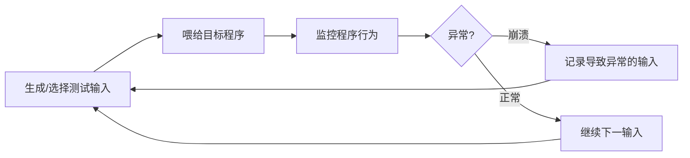
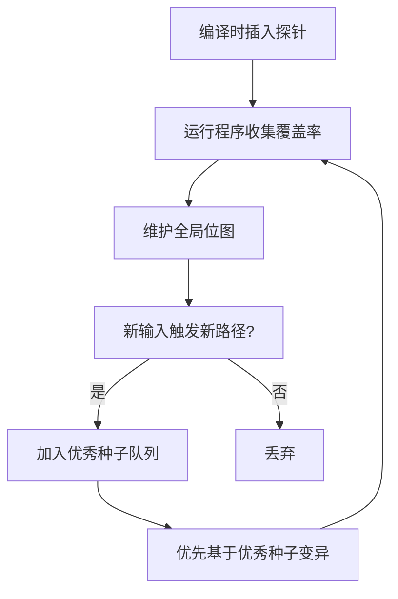

# 模块11：模糊测试入门与AFL实战

> **学习目标**：掌握模糊测试理论、AFL编译插桩、完整的Fuzzing工作流
> **所需工具**：afl-gcc, afl-clang, afl-fuzz, afl-tmin, afl-analyze, afl-plot, gdb, valgrind

## 目录

- [[#一、模糊测试理论基础|理论基础]]
- [[#二、AFL安装与环境配置|环境配置]]
- [[#三、AFL完整模糊测试流程|完整流程]]
- [[#四、AFL运行界面解读|界面解读]]
- [[#五、Crash分析|Crash分析]]
- [[#六、AFL高级进阶|高级进阶]]
- [[#七、综合实践|综合实践]]

---

## 一、模糊测试理论基础

### 1.1 什么是模糊测试(Fuzzing)

模糊测试是一种自动化软件测试技术，通过向程序输入大量随机、无效或非预期的数据，并监控异常行为来发现漏洞。



### 1.2 模糊测试的分类

**(1) 按输入生成方式分类**

| 类型 | 原理 | 优点 | 代表工具 |
|------|------|------|----------|
| 突变式Fuzzing | 基于合法输入随机变异 | 简单，无需了解格式 | AFL, zzuf, radamsa |
| 生成式Fuzzing | 按格式规范生成输入 | 可生成复杂结构化输入 | peach, boofuzz |

**(2) 按测试目标感知程度分类**

| 类型 | 特点 | 适用场景 |
|------|------|----------|
| 黑盒Fuzzing | 不了解内部结构 | 快速测试，第三方程序 |
| 白盒Fuzzing | 源码编译时插桩 | 效率最高，需访问源码 |
| 灰盒Fuzzing | 静态+动态分析结合 | AFL典型模式，平衡效率和通用性 |

### 1.3 覆盖率引导的Fuzzing

覆盖率引导是现代Fuzzing的核心技术：

1. 在程序编译时插入探针(Instrumentation)
2. 运行程序时记录哪些代码块被执行
3. AFL维护一个"全局位图"记录已覆盖的代码路径
4. 如果某个输入触发了新的代码路径 → 加入"优秀种子"队列
5. 后续变异操作优先基于"优秀种子"进行



AFL的独特性：不仅记录是否触发了新边，还记录每条边的命中次数(hit count)，将命中次数近似分为8个桶(1, 2, 3, 4-7, 8-15, 16-31, 32-127, 128+)。

### 1.4 突变策略详解

**(1) 确定性变异(Deterministic)**：
- bitflip：逐位翻转
- arithmetic：整数加减法
- interest：替换为特殊值(0, -1, INT_MAX等)
- dictionary：用户提供的字典

**(2) 随机变异(Random/Havoc)**：
- 随机位翻转和字节翻转
- 随机块复制、删除、插入
- 组合多个变异操作

**(3) 拼接变异(Splicing)**：
- 从两个不同种子中各取一部分拼接(类似遗传算法交叉)

---

## 二、AFL安装与环境配置

### 2.1 安装AFL

```bash
sudo pacman -S afl # ArchStrike安装

# 验证安装
afl-fuzz --help
afl-gcc --version
which afl-fuzz
```

### 2.2 AFL核心组件

| 组件 | 功能 |
|------|------|
| afl-gcc / afl-g++ | GCC包装器，自动添加插桩 |
| afl-clang / afl-clang++ | Clang包装器(更快) |
| afl-clang-fast | LLVM Pass编译时插桩(性能最佳) |
| afl-fuzz | 模糊测试主引擎 |
| afl-tmin | 测试用例最小化工具 |
| afl-analyze | 测试用例分析工具 |
| afl-plot | 生成可视化HTML报告 |
| afl-cmin | 语料库最小化工具 |
| afl-showmap | 显示单一输入的覆盖信息 |

### 2.3 系统环境优化

```bash
# 设置核心转储(AFL通过监控signal判断崩溃)
sudo sh -c 'echo core > /proc/sys/kernel/core_pattern'

# 调整CPU频率调度(提升Fuzzing速度)
sudo sh -c 'cd /sys/devices/system/cpu && echo performance | tee cpu*/cpufreq/scaling_governor'

# 禁用ASLR(可选，便于复现crash)
sudo sh -c 'echo 0 > /proc/sys/kernel/randomize_va_space'
```

---

## 三、AFL完整模糊测试流程

### 3.1 编译目标程序(AFL插桩)

```bash
# 方法一：afl-gcc(传统)
CC=afl-gcc CXX=afl-g++ ./configure --prefix=/tmp/test
make -j4
sudo make install

# 方法二：CMake项目
CC=afl-gcc CXX=afl-g++ cmake ..
make -j4

# 方法三：afl-clang-fast(推荐，LLVM模式最快)
CC=afl-clang-fast CXX=afl-clang-fast++ ./configure
make -j4

# 方法四：直接编译单个文件
afl-gcc -g -o vulnerable_program vulnerable_program.c
```

### 3.2 准备测试输入(种子语料)

```bash
mkdir testcases

# 图片解析器
cp sample.jpg testcases/

# 文档解析器
cp sample.pdf testcases/

# 文本解析器
echo "AAAA" > testcases/input

# 语料库最佳实践
# 种子数量：5-50个小型种子文件
# 种子大小：建议<1KB
# 避免重复：使用afl-cmin去重
afl-cmin -i original_corpus -o minimized_corpus -- ./program @@
```

### 3.3 运行AFL模糊测试

```bash
# 基本使用(文件输入型程序)
afl-fuzz -i testcases/ -o findings/ -- ./target_program @@

# 参数说明
# -i testcases/ : 输入种子目录
# -o findings/ : 输出目录(存放结果)
# -- : 分隔符
# @@ : 占位符，AFL替换为测试用例文件路径
# 如果程序从stdin读取，可省略@@

# 完整命令示例
afl-fuzz \
 -i testcases/ \
 -o findings/ \
 -t 1000 \ # 超时时间(毫秒)
 -m 200 \ # 内存限制(MB)
 -x dictionary/ \ # 字典文件
 -- ./target_program @@
```

### 3.4 持久模式(Persistent Mode)

在源码中添加AFL循环(速度提升10-100倍)：

```c
#include <unistd.h>
__AFL_FUZZ_INIT();

int main() {
#ifdef __AFL_HAVE_MANUAL_CONTROL
 __AFL_INIT();
#endif

 unsigned char *buf = __AFL_FUZZ_TESTCASE_BUF;
 while (__AFL_LOOP(10000)) {
 int len = __AFL_FUZZ_TESTCASE_LEN;
 process_input(buf, len);
 }
 return 0;
}
```

---

## 四、AFL运行界面解读

启动afl-fuzz后会看到字符界面(TUI)，各项指标：

| 区域 | 关键指标 | 含义 |
|------|----------|------|
| Process timing | run time | 总运行时间 |
| | last new path | 距上次发现新路径的时间 |
| | last uniq crash | 距上次唯一crash的时间 |
| Overall results | cycles done | 完成的变异周期数 |
| | total paths | 发现的总路径数 |
| | uniq crashes | **最重要！唯一crash数量** |
| | uniq hangs | 唯一超时数量 |
| Map coverage | map density | 位图密度(太高=用例过大，太低=探索不充分) |
| Stage progress | now trying | 当前变异阶段(如havoc) |
| | total execs | 总执行次数 |
| | exec speed | **执行速度，越快发现概率越大** |

---

## 五、Crash分析

### 5.1 查看Crash文件

所有导致crash的测试用例保存在：`findings/<实例名>/crashes/`

```
findings/
└── default/
 ├── fuzzer_stats # Fuzzing统计
 ├── plot_data # 绘图数据
 ├── crashes/ # 崩溃输入
 │ ├── id:000000,sig:11,src:000042,op:havoc,rep:2
 │ ├── id:000001,sig:06,src:000128,op:flip1,rep:4
 │ └── README.txt
 ├── hangs/ # 挂起输入
 └── queue/ # 优质种子
```

文件名含义：
- `id:000000`：崩溃编号
- `sig:11`：信号编号(11=SIGSEGV, 6=SIGABRT)
- `src:000042`：来源种子编号
- `op:havoc`：触发崩溃的变异操作

### 5.2 使用GDB分析Crash

```bash
# 直接运行crash
gdb --args ./target_program findings/default/crashes/id:000000,...
(gdb) run
(gdb) bt # 查看调用栈
(gdb) info registers # 查看寄存器状态
(gdb) x/20x $rsp # 查看栈内容
(gdb) bt full # 完整调用栈及局部变量
(gdb) x/s $rax # 以字符串形式显示rax指向的内容
(gdb) x/10gx $rsp # 显示栈顶的10个8字节值

# 使用core dump
ulimit -c unlimited
./target_program crash_file
gdb ./target_program core
(gdb) bt full
```

### 5.3 确定漏洞类型

| 信号 | 名称 | 对应漏洞 |
|------|------|----------|
| SIGSEGV(11) | 段错误 | 缓冲区溢出/UAF/空指针 |
| SIGABRT(6) | 断言失败 | 逻辑错误 |
| SIGFPE(8) | 算术异常 | 除零/整数溢出 |
| SIGILL(4) | 非法指令 | 代码损坏/ROP跳转到无效地址 |
| SIGBUS(7) | 总线错误 | 未对齐访问/内存映射问题 |

### 5.4 使用AddressSanitizer(ASan)

```bash
# 重新编译时加入ASan
AFL_USE_ASAN=1 CC=afl-clang-fast ./configure
AFL_USE_ASAN=1 make
```

ASan会增加约2倍内存开销和减慢执行速度，但能检测更多内存错误。

### 5.5 测试用例处理工具

```bash
# afl-tmin：最小化测试用例
afl-tmin -i crash_file -o minimized_crash -- ./target_program @@

# afl-analyze：分析输入结构
afl-analyze -i input_file -- ./target_program @@

# afl-cmin：语料库最小化
afl-cmin -i large_corpus -o small_corpus -- ./target_program @@

# afl-showmap：显示覆盖边
afl-showmap -o /dev/null -- ./target_program < input_file
```

---

## 六、AFL高级进阶

### 6.1 并行模糊测试

同时运行多个AFL实例加速测试：

```bash
# 主实例(执行确定性变异)
afl-fuzz -i testcases/ -o sync_dir/ -M master -- ./target_program @@

# 从实例1(执行随机变异)
afl-fuzz -i testcases/ -o sync_dir/ -S slave1 -- ./target_program @@

# 从实例2(QEMU模式测试无源码程序)
afl-fuzz -Q -i testcases/ -o sync_dir/ -S qemu_slave -- ./binary_binary
```

说明：
- `-M master`：主实例，执行确定性变异
- `-S slave`：从实例，执行随机变异
- 所有实例共享同一个 `-o` 目录
- 建议实例数 = CPU核心数 - 1

### 6.2 QEMU模式(无源码)

```bash
afl-fuzz -Q -i testcases/ -o findings/ -- ./closed_source_binary @@
```

QEMU模式比源码插桩慢2-5倍，但不需要任何编译步骤。

### 6.3 字典(Dictionary)使用

创建字典文件 `tokens.dict`：
```
header_elf="\x7f\x45\x4c\x46"
header_png="\x89PNG"
header_jpg="\xff\xd8\xff"
int_0="0"
int_neg_1="-1"
int_max="2147483647"
true="true"
false="false"
null="null"
```

使用字典：
```bash
afl-fuzz -x tokens.dict -i testcases/ -o findings/ -- ./target @@
```

---

## 七、综合实践

### 7.1 对开源程序进行Fuzzing(以libjpeg为例)

```bash
# Step 1: 创建测试环境
mkdir ~/fuzzing-lab && cd ~/fuzzing-lab
mkdir testcases findings

# Step 2: 准备种子文件
convert -size 32x32 xc:white testcases/test.jpg

# Step 3: 下载并编译目标
wget http://www.ijg.org/files/jpegsrc.v9e.tar.gz
tar xzf jpegsrc.v9e.tar.gz && cd jpeg-9e
CC=afl-gcc CXX=afl-g++ ./configure --prefix=/tmp/jpeg-test
make -j4 && sudo make install

# Step 4: 启动AFL
cd ~/fuzzing-lab
afl-fuzz -i testcases/ -o findings/ \
 -t 2000 -m 100 \
 -- /tmp/jpeg-test/bin/djpeg @@

# Step 5: 后台运行(长时间Fuzzing)
nohup afl-fuzz -i testcases/ -o findings/ \
 -t 2000 -m 100 -- /tmp/jpeg-test/bin/djpeg @@ \
 > afl.log 2>&1 &

# Step 6: 分析Crash
ls findings/default/crashes/
cp findings/default/crashes/id:000000,* crash_sample
gdb --args /tmp/jpeg-test/bin/djpeg crash_sample
(gdb) run
(gdb) bt full

# Step 7: 最小化测试用例
afl-tmin -i crash_sample -o minimal_crash -- /tmp/jpeg-test/bin/djpeg @@

# Step 8: 使用ASan重新编译获取详细错误
cd ~/fuzzing-lab/jpeg-9e
make clean
AFL_USE_ASAN=1 CC=afl-clang-fast ./configure
AFL_USE_ASAN=1 make -j4
./djpeg ~/fuzzing-lab/minimal_crash
```

### 7.2 常见问题解决

| 问题 | 解决方案 |
|------|----------|
| "Program is not instrumented" | 确保使用了afl-gcc编译 |
| 执行速度很慢(<10 execs/sec) | 使用持久模式或Deferred Initialization |
| 长时间没有新路径 | 更换/增加多样化种子、使用字典 |
| 红色警告 | 检查内存限制(-m)和超时(-t) |

---

## 总结

1. 合理准备种子语料库是成功的一半
2. 并行Fuzzing可大幅加速测试
3. ASan+UBSan配合AFL如虎添翼
4. 分析crash时需要扎实的逆向调试能力
5. 持久模式和对目标程序的定制化改造能极大提升效率

---

> **相关模块**：[[02-协议与Web模糊测试|协议与Web Fuzz]]

[[../总目录与快速查询|← 返回总目录]]
