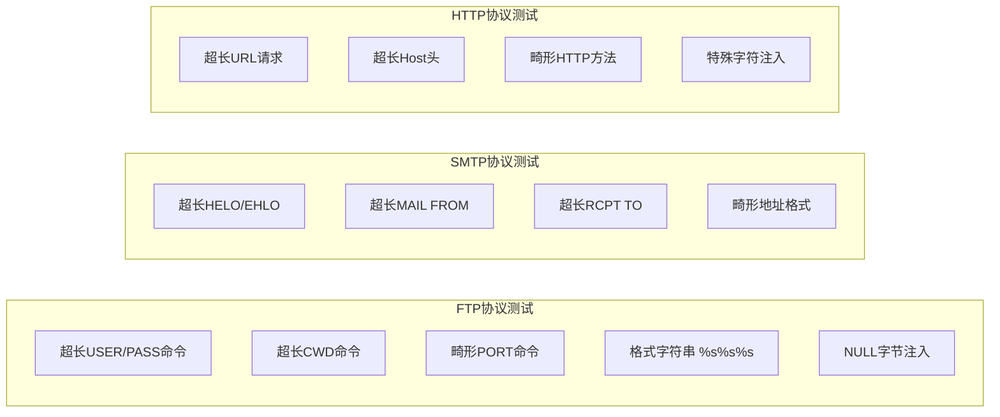
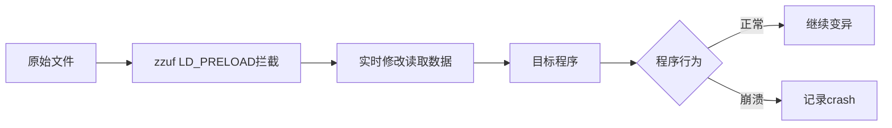

# 模块12：协议与Web模糊测试

> **学习目标**：掌握网络协议模糊测试、Web应用Fuzzing、多工具协同测试
> **所需工具**：bed, bfbtester, zzuf, ffuf, wfuzz, burpsuite

## 目录

- [[#一、BED缓冲区溢出检测|BED]]
- [[#二、Bfbtester二进制功能测试|Bfbtester]]
- [[#三、Zzuf通用文件模糊器|Zzuf]]
- [[#四、Web应用模糊测试|Web Fuzzing]]
- [[#五、综合实践|综合实践]]
- [[#六、工具选择指南|工具选择]]

---

## 一、BED缓冲区溢出检测

### 1.1 BED概述

BED(Bruteforce Exploit Detector)是一个专门针对网络协议的模糊测试工具。它通过向常见网络服务发送各种畸形数据包，检测是否存在缓冲区溢出等安全漏洞。

BED支持的协议多达20+种：FTP, SMTP, POP3, IMAP, HTTP, IRC, DNS, TFTP, NTP等。

### 1.2 安装与基本使用

```bash
sudo pacman -S bed    # ArchStrike安装

# 列出所有支持的协议模块
bed -l
```

**基本语法**：`bed -s <协议> -t <目标IP> [-p <端口>]`

```bash
# 测试FTP服务
bed -s FTP -t 192.168.1.100

# 测试SMTP服务
bed -s SMTP -t 192.168.1.100 -p 25

# 测试HTTP服务
bed -s HTTP -t 192.168.1.100 -p 80

# 测试自定义端口FTP
bed -s FTP -t 10.0.0.50 -p 2121
```

### 1.3 测试结果判断

- 服务崩溃/无响应 → 可能存在缓冲区溢出漏洞
- 服务断开连接 → 可能触发了异常处理
- 返回错误信息 → 正常行为
- 服务正常应答 → 该测试未发现漏洞

### 1.4 各协议测试内容



### 1.5 实战操作

```bash
# 场景：内网渗透中发现FTP服务器

# Step 1: 确认目标服务可访问
nc -v 10.0.0.100 21

# Step 2: 获取服务banner
nmap -sV -p 21 10.0.0.100

# Step 3: 使用BED进行模糊测试
bed -s FTP -t 10.0.0.100

# Step 4: 监控服务状态(另一终端)
watch -n 1 'echo "" | nc -w 2 10.0.0.100 21 2>&1'

# Step 5: 抓包供后续分析
sudo tcpdump -i eth0 -w bed_test.pcap host 10.0.0.100
```

### 1.6 BED局限性

- 测试用例是预定义的，不如AFL灵活
- 仅针对已知的常见漏洞模式
- 不包含覆盖率引导机制
- 需要手动观察和判断测试结果

---

## 二、Bfbtester二进制功能测试

### 2.1 bfbtester概述

bfbtester(Brute Force Binary Tester)针对可执行程序的安全测试工具。通过传递各种畸形参数和环境变量，检测缓冲区溢出、格式化字符串等安全漏洞。

### 2.2 基本使用

```bash
sudo pacman -S bfbtester    # ArchStrike安装

# 基本语法
bfbtester /usr/bin/program
bfbtester -v /usr/local/bin/target_binary

# 常用参数
# -v        详细输出模式
# -s <size> 指定最大字符串长度(默认10000)
# -f <file> 从文件读取输入数据
# -t <time> 超时时间设置
```

### 2.3 测试类型

**ARGV测试(命令行参数溢出)**：
```bash
bfbtester /usr/bin/program
# 测试程序对超长命令行参数的处理，如: ./program AAAAA...AAAA
```

**ENVP测试(环境变量溢出)**：
bfbtester创建大量超长环境变量测试程序。

**文件输入测试**：
bfbtester创建包含超长内容的临时文件作为输入。

### 2.4 实战：扫描setuid程序

```bash
# 搜索所有setuid程序并逐一测试
find / -type f -perm -4000 2>/dev/null | while read bin; do
  echo "Testing $bin ..."
  bfbtester "$bin" 2>&1 | grep -E "CRASH|SIGSEGV|SIGABRT"
done
```

setuid程序崩溃可能意味着权限提升漏洞！

### 2.5 结果分析

| 信号 | 含义 |
|------|------|
| SIGSEGV (11) | 段错误(内存访问违例) |
| SIGABRT (6) | 断言失败(程序主动终止) |
| SIGFPE (8) | 算术异常(除零等) |

---

## 三、Zzuf通用文件模糊器

### 3.1 zzuf概述

zzuf通过LD_PRELOAD机制拦截程序的open/fopen/read等系统调用，实时修改程序读取到的数据，测试程序健壮性。

核心优势：
- 无需修改目标程序
- 不需要源码
- 透明运行，程序感知不到
- 可以精确控制变异的位置和比率



### 3.2 安装与基本使用

```bash
sudo pacman -S zzuf    # ArchStrike安装

# 基本语法
zzuf [选项] <程序> [程序参数]

# 变异并输出到文件
zzuf -s 100 -r 0.001 < input.jpg > fuzzed.jpg

# 透明模式测试程序
zzuf -r 0.0001 feh fuzzed.jpg
```

核心参数：

| 参数 | 说明 |
|------|------|
| -s \<seed\> | 随机种子(固定种子可重现) |
| -r \<ratio\> | 变异比率(0.0-1.0，默认0.004) |
| -b \<begin\> | 开始变异的字节偏移 |
| -e \<end\> | 停止变异的字节偏移 |
| -R \<ratio\> | 反转比特比率 |

### 3.3 使用场景

```bash
# 测试图片解析器
zzuf -r 0.001 -s $RANDOM eog test.jpg

# 测试压缩工具
zzuf -s 42 -r 0.01 < archive.zip > fuzzed.zip
zzuf -s 42 -r 0.01 unzip fuzzed.zip

# 测试音视频解码器
zzuf -r 0.0005 ffmpeg -i input.mp4 -f null /dev/null

# 测试网络协议解析器
zzuf -r 0.001 wireshark capture.pcap

# 限制变异位置(仅文件头)
zzuf -r 0.01 -b 0 -e 100 program input.bin
```

### 3.4 批量测试脚本

```bash
#!/bin/bash
for seed in $(seq 1 500); do
  echo -n "Testing seed $seed ... "
  zzuf -s $seed -r 0.001 program input.bin > /dev/null 2>&1
  exit_code=$?
  if [ $exit_code -gt 128 ] || [ $exit_code -eq 139 ]; then
    echo "CRASH! (seed=$seed, exit=$exit_code)"
  else
    echo "OK"
  fi
done
```

### 3.5 zzuf与AFL对比

| 特性 | zzuf | AFL |
|------|------|-----|
| 方式 | 透明LD_PRELOAD拦截 | 编译时插桩 |
| 覆盖率引导 | 无 | 有 |
| 需要源码 | 不需要 | 推荐有源码 |
| 使用难度 | 低 | 中 |
| 效率 | 较低 | 高 |
| 适用场景 | 快速验证/黑盒测试 | 深度Fuzzing |

---

## 四、Web应用模糊测试

### 4.1 Web模糊测试概述

常见的Web Fuzzing场景：
- 目录和文件扫描(发现隐藏资源)
- 参数发现(GET/POST参数爆破)
- SQL注入点检测
- XSS注入点检测
- 文件包含漏洞检测

### 4.2 ffuf — 快速Web模糊测试

```bash
sudo pacman -S ffuf    # ArchStrike安装
```

**(1) 目录扫描**：
```bash
ffuf -w /usr/share/wordlists/dirb/common -u http://target.com/FUZZ
```

**(2) 子域名枚举**：
```bash
ffuf -w subdomains.txt -u http://FUZZ.target.com -H "Host: FUZZ.target.com"
```

**(3) POST参数模糊测试**：
```bash
ffuf -w params.txt -u http://target.com/login \
  -X POST -d "FUZZ=test" \
  -H "Content-Type: application/x-www-form-urlencoded"
```

**(4) 过滤响应结果**：
```bash
ffuf -w wordlist.txt -u http://target.com/FUZZ \
  -fc 404 \    # 过滤404
  -fs 0 \      # 过滤空响应体
  -fw 10       # 过滤响应体包含10个单词的
```

**(5) 递归扫描**：
```bash
ffuf -w wordlist.txt -u http://target.com/FUZZ \
  -recursion -recursion-depth 3 -e .php,.html,.txt
```

**(6) 多占位符(用户+密码爆破)**：
```bash
ffuf -w users.txt:USER -w passwords.txt:PASS \
  -u http://target.com/login.php \
  -d "username=USER&password=PASS" -X POST -fc 401
```

**(7) 频率控制(避免触发WAF)**：
```bash
ffuf -w wordlist.txt -u http://target.com/FUZZ -p 2 -t 3
```

### 4.3 wfuzz — Web应用Fuzzing框架

```bash
sudo pacman -S wfuzz    # ArchStrike安装

# 基本语法
wfuzz -c -z file,wordlist.txt --hc 404 http://target.com/FUZZ
```

参数说明：
- `-c`：彩色输出
- `-z`：指定Payload类型 `-z file,wordlist.txt` / `-z range,0-10` / `-z list,admin-test-root`
- `--hc/--hl/--hw/--hh`：按状态码/行/词/字符数隐藏

高级用法：
```bash
# 组合参数Fuzz
wfuzz -c -z file,users.txt -z file,passwords.txt \
  -d "user=FUZZ&pass=FUZ2Z" http://target.com/login.php

# Cookie模糊测试
wfuzz -c -z file,wordlist.txt -b "session=FUZZ" http://target.com/admin/

# User-Agent模糊测试
wfuzz -c -z file,user_agents.txt -H "User-Agent: FUZZ" http://target.com/
```

### 4.4 Burp Intruder参数Fuzz

操作步骤：
1. 配置浏览器代理指向Burp(127.0.0.1:8080)
2. 访问目标网站并正常提交一个请求
3. Burp的Proxy → HTTP history → 找到请求
4. 右键 → Send to Intruder
5. Positions中标记FUZZ位置
6. Payloads中设置Payload类型
7. Start Attack开始测试

Payload类型：
- Simple List：使用预定义列表
- Numbers：生成连续数字序列
- Brute Forcer：生成所有字符组合

### 4.5 字典资源

ArchStrike已预装的字典位置：
- `/usr/share/wordlists/dirb/common` — 目录扫描
- `/usr/share/wordlists/dirb/big` — 大规模目录扫描
- `/usr/share/seclists/Discovery/Web-Content/` — SecLists集合
- `/usr/share/wordlists/rockyou` — 密码字典

---

## 五、综合实践

### 5.1 实践一：BED测试网络服务

```bash
# Step 1: 确认目标
nmap -sV -p 21 192.168.1.100

# Step 2: 抓包
sudo tcpdump -i eth0 -w ftp_bed.pcap host 192.168.1.100

# Step 3: 运行BED
bed -s FTP -t 192.168.1.100

# Step 4: 监控服务(另一终端)
while true; do
  echo "QUIT" | timeout 2 nc 192.168.1.100 21 > /dev/null 2>&1
  if [ $? -ne 0 ]; then echo "[!] Service is DOWN at $(date)"; fi
  sleep 5
done

# Step 5: 分析抓包
wireshark ftp_bed.pcap
```

### 5.2 实践二：zzuf + AFL 组合文件格式Fuzzing

```bash
# Step 1: 收集合法样本
mkdir samples && cp /path/to/normal/files/* samples/

# Step 2: zzuf快速验证
for f in samples/*; do
  for s in $(seq 1 100); do
    zzuf -s $s -r 0.001 program "$f" > /dev/null 2>&1
    [ $? -gt 128 ] && echo "Crash: $f seed=$s"
  done
done

# Step 3: AFL语料库最小化
afl-cmin -i samples -o corpus -- ./program @@

# Step 4: AFL深度Fuzzing
afl-fuzz -i corpus -o afl_out -- ./program @@

# Step 5: 分析crash
ls afl_out/default/crashes/
gdb --args ./program afl_out/default/crashes/id:000000,*
```

### 5.3 实践三：Web应用综合Fuzzing

```bash
# Step 1: 目录枚举
ffuf -w /usr/share/wordlists/dirb/common -u http://target.com/FUZZ -fc 403,404

# Step 2: 参数发现
ffuf -w /usr/share/seclists/Discovery/Web-Content/burp-parameter-names.txt \
  -u http://target.com/page.php?FUZZ=1 -fs 0

# Step 3: 文件扩展名枚举
ffuf -w extensions.txt -u http://target.com/index.FUZZ -fc 404

# Step 4: POST参数爆破
ffuf -w common_params.txt -u http://target.com/search \
  -X POST -d "FUZZ=test" -fc 400
```

---

## 六、工具选择指南

| 场景 | 推荐工具 | 备选工具 |
|------|----------|----------|
| 有源码的二进制程序 | AFL | libFuzzer |
| 无源码的二进制程序 | AFL(QEMU) | zzuf |
| 网络协议服务 | BED | boofuzz |
| 文件格式解析 | AFL + zzuf | honggfuzz |
| Web应用 | Burp+ffuf | wfuzz |
| 命令行程序 | bfbtester | AFL |
| 快速黑盒验证 | zzuf | radamsa |

### 最佳实践

1. 测试环境隔离：在虚拟机或Docker容器中Fuzz
2. 先浅后深：先用zzuf快速验证，再用AFL深度挖掘
3. 结果验证：手动复现所有Crash，排除误报
4. 持续集成：将Fuzzing集成到开发流程中
5. 版本控制：保留所有导致Crash的测试用例

---

> **相关模块**：[[01-模糊测试入门与AFL实战|AFL Fuzz]]

[[../总目录与快速查询|← 返回总目录]]
