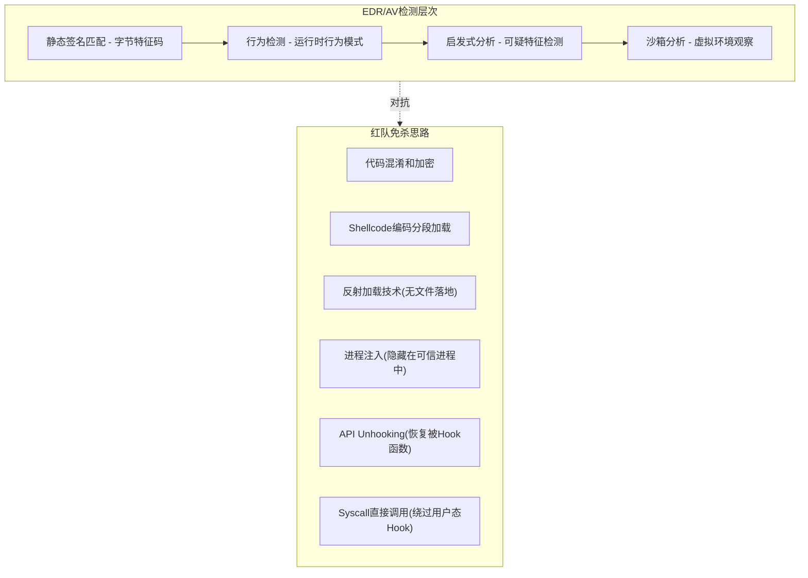
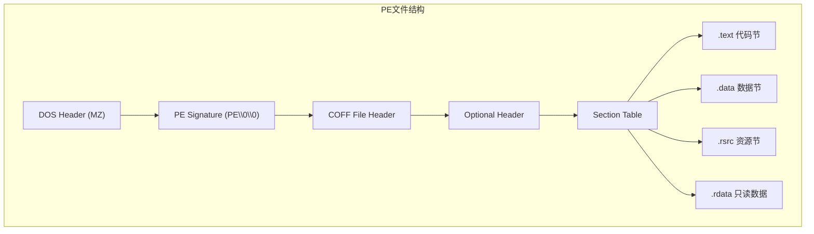

# 模块13：恶意软件分析入门

> **学习目标**：掌握静态/动态分析技术、理解检测机制、学习逆向工程基础
> **所需工具**：file, strings, xxd, objdump, readelf, strace, ltrace, androguard, radare2, apktool

## 目录

- [[#一、红队为什么需要恶意软件分析|分析动机]]
- [[#二、静态分析基础|静态分析]]
- [[#三、动态分析基础|动态分析]]
- [[#四、Androguard APK分析|Android分析]]
- [[#五、综合实践|综合实践]]
- [[#六、安全注意事项|安全注意事项]]

---

## 一、红队为什么需要恶意软件分析

### 1.1 理解检测机制，改进免杀技术

杀毒软件和EDR使用多种技术检测恶意软件：



### 1.2 分析对手工具，学习攻击技术

通过分析APT组织使用的恶意软件样本，可以学习到：
- 高级持久化技术(WMI事件订阅、计划任务隐藏等)
- 命令与控制(C2)通信协议设计
- 内网横向移动手段
- 权限维持方法
- 数据窃取和渗出技术

常用恶意软件分析平台：
- VX Underground：大量恶意样本集合
- MalwareBazaar：恶意样本分享平台
- abuse.ch：威胁情报和样本库
- VirusTotal：文件分析(注意：上传样本会被分享)

### 1.3 逆向工程能力

恶意软件分析本质上是逆向工程的子集。通过分析恶意样本，红队成员可以培养：
- 理解二进制程序的执行流程
- 识别代码中的恶意逻辑
- 提取配置信息(C2地址、加密密钥等)
- 编写检测规则(YARA规则)
- 开发防御和检测方案

---

## 二、静态分析基础

### 2.1 file — 文件类型识别

file是静态分析的第一步，用来确定样本的基本属性。

```bash
file malware.exe
file suspicious.dll
file unknown_sample.bin
```

输出示例解析：
- `PE32 executable (GUI) Intel 80386, for MS Windows` — 32位PE文件
- `ELF 64-bit LSB executable, x86-64` — 64位Linux可执行文件
- `PE32+ executable (DLL) x86-64, for MS Windows` — 64位DLL

高级用法：
```bash
file -b sample.bin # 简短输出(不显示文件名)
file -i sample.bin # MIME类型输出
file --mime-type sample.bin # 仅输出MIME类型
```

文件类型判断的价值：
- PE文件 → 需要Windows分析环境
- ELF文件 → 可能是Linux恶意软件
- 伪装的扩展名(.jpg.exe) → 明显可疑行为

### 2.2 strings — 字符串提取

Strings提取二进制文件中的可打印字符串，是最简单但最有效的静态分析方法之一。

```bash
strings malware.exe
strings -n 6 malware.exe # 最小字符串长度6
strings -n 8 malware.exe # 最小字符串长度8(减少噪音)
strings -e l malware.exe # 16位编码
```

**实用搜索模式**：
```bash
# 查找硬编码的IP地址
strings malware.exe | grep -E "[0-9]{1,3}\.[0-9]{1,3}\.[0-9]{1,3}\.[0-9]{1,3}"

# 查找HTTP/HTTPS URL
strings malware.exe | grep -i "http"

# 查找域名
strings malware.exe | grep -iE "\.(com|net|org|cn|ru|top|xyz)"

# 查找文件路径
strings malware.exe | grep -iE "/|\\\\"

# 查找注册表路径
strings malware.exe | grep -iE "HKEY_|SOFTWARE\\\\"

# 查找API函数名(Windows)
strings malware.exe | grep -iE "(CreateFile|WriteFile|RegSet|WinExec|VirtualAlloc|CreateRemoteThread)"

# 查找Linux可疑字符串
strings malware.elf | grep -iE "(/bin/sh|/bin/bash|exec|socket|bind|connect)"

# 查找编码/加密相关字符串
strings malware.exe | grep -iE "(base64|xor|aes|rc4|decrypt|encrypt|key)"
```

**高级流程**：
1. 先用较小最小长度(-n 4)获取所有字符串
2. 保存到文件便于搜索：`strings -a malware.exe > strings.txt`
3. 按类别分类搜索(IP、URL、路径、命令等)
4. 注意伪装的合法字符串
5. 关注字符串在文件中的位置

### 2.3 hexdump/xxd — 十六进制查看

```bash
xxd malware.exe | less # 分页查看
xxd -l 256 malware.exe # 只显示前256字节
xxd -s 1024 -l 256 malware.exe # 跳过前1024字节
xxd -g 1 malware.exe # 每列1字节

hexdump -C malware.exe | less # 规范格式(带ASCII)
hexdump -C -n 512 malware.exe # 只显示前512字节
```

在十六进制查看时关注：

| 特征 | 含义 |
|------|------|
| 4D 5A (MZ) | PE文件 |
| 7F 45 4C 46 (.ELF) | ELF文件 |
| 89 50 4E 47 | PNG文件 |
| 50 4B | ZIP文件 |
| 文件扩展名与Magic Bytes不符 | 伪装文件 |
| 大段连续的明文 | 配置信息未加密 |
| 内嵌的MZ/PE签名 | 嵌入的可执行文件 |

### 2.4 PE/ELF文件结构分析



**使用objdump分析PE文件**：
```bash
objdump -f malware.exe # 文件头
objdump -p malware.exe # PE头
objdump -h malware.exe # 所有节信息
objdump -d malware.exe | head -100 # 反汇编入口点
objdump -p malware.exe | grep -i "dll" # DLL依赖
```

**使用readelf分析ELF文件**：
```bash
readelf -h malware.elf # ELF头
readelf -S malware.elf # 节头表
readelf -l malware.elf # 程序头表(段)
readelf -d malware.elf # 动态段
readelf -s malware.elf # 符号表
readelf -r malware.elf # 重定位表
readelf -a malware.elf # 所有头信息
```

### 2.5 PE分析重点关注

- **编译时间戳(TimeDateStamp)**：判断样本的新旧
- **节名称异常**：如名为.textbss的可执行节
- **节权限异常**：如.data节有可执行权限
- **导入函数**：网络通信(WinSock)、进程操作(CreateProcess)、文件操作(WriteFile)、注册表操作(RegSetValue)
- **资源段(.rsrc)**：可能包含嵌入的PE文件或配置

---

## 三、动态分析基础

### 3.1 strace — 系统调用追踪

```bash
strace ./malware.elf
strace -f ./malware.elf # 追踪子进程
strace -p <PID> # 附加到运行中进程
strace -o output.txt ./program # 输出到文件
strace -e trace=open,read,write ./program # 只追踪特定调用
```

常用过滤选项：
```bash
strace -e trace=file ./program # 文件操作
strace -e trace=network ./program # 网络操作
strace -e trace=process ./program # 进程管理
strace -e trace=memory ./program # 内存映射
```

分析strace输出时关注：
- `open()` — 程序打开的文件
- `socket()`/`connect()` — 网络连接(C2通信)
- `execve()` — 执行的命令
- `mmap()` — 内存映射(可能用于代码注入)
- `ptrace()` — 调试器检测
- `unlink()` — 文件删除(痕迹清理)

### 3.2 ltrace — 库函数调用追踪

```bash
ltrace ./program
ltrace -f ./program # 追踪子进程
ltrace -p <PID> # 附加到进程
ltrace -o output.txt ./program # 输出到文件
ltrace -e printf+strcpy ./program # 只追踪特定函数
```

重点关注：
- `system()`/`popen()` — 执行系统命令
- `dlopen()`/`dlsym()` — 动态加载库
- `strcpy()`/`strcat()` — 可能存在溢出风险
- `memcpy()` — 内存复制(可能复制shellcode)

### 3.3 沙箱分析

常用在线沙箱：

| 平台 | 特点 |
|------|------|
| ANY.RUN | 交互式Windows沙箱、实时进程行为、MITRE ATT&CK映射 |
| Joe Sandbox | 企业级、多平台支持、YARA规则生成 |
| Hybrid Analysis | 免费多引擎、与VirusTotal集成 |
| Triage | 社区友好、直观行为时间线 |

沙箱检测绕过技术(红队视角)：
- 检测虚拟机环境(VMware/VirtualBox痕迹)
- 检测沙箱进程(sandboxie、vmtoolsd)
- 延迟执行(Sleep/Ping时间超过沙箱超时)
- 用户交互检测(鼠标移动、按键)
- 特定时间/日期触发

---

## 四、Androguard APK分析

### 4.1 安装与基本使用

```bash
sudo pacman -S androguard # ArchStrike安装

# 分析APK文件
androguard analyze target_app.apk

# 查看签名信息
androguard sign target_app.apk
```

### 4.2 Python接口分析

```python
from androguard.core.bytecodes.apk import APK

apk = APK("target_app.apk")

print("Package:", apk.get_package())
print("App Name:", apk.get_app_name())
print("Permissions:", apk.get_permissions())
print("Activities:", apk.get_activities())
print("Services:", apk.get_services())
print("Receivers:", apk.get_receivers())
print("Debug:", apk.is_debuggable())
```

### 4.3 检查可疑权限

危险权限列表：
- `RECORD_AUDIO` — 录音
- `CAMERA` — 拍照
- `READ_SMS`/`SEND_SMS` — 短信
- `READ_CONTACTS` — 读取联系人
- `ACCESS_FINE_LOCATION` — GPS定位
- `SYSTEM_ALERT_WINDOW` — 悬浮窗(可用于钓鱼)
- `REQUEST_INSTALL_PACKAGES` — 安装应用

### 4.4 使用apktool配合分析

```bash
sudo pacman -S apktool # ArchStrike安装

# 解包APK
apktool d target_app.apk -o output_dir/

# 分析清单文件
cat output_dir/AndroidManifest.xml | grep -iE "permission|activity|service|receiver"
```

解包后的目录结构：
```
output_dir/
├── AndroidManifest.xml # 反编译后的清单
├── apktool.yml # 元数据
├── res/ # 资源文件
├── smali/ # Smali反汇编代码
└── lib/ # 原生库(.so)
```

---

## 五、综合实践

### 5.1 分析一个ELF后门程序

**Step 1: 初始信息收集**
```bash
file unknown_sample.bin
stat unknown_sample.bin
ls -la unknown_sample.bin
```

**Step 2: 计算哈希值**
```bash
md5sum unknown_sample.bin
sha1sum unknown_sample.bin
sha256sum unknown_sample.bin
```

**Step 3: 提取和分析字符串**
```bash
strings -n 6 unknown_sample.bin > strings_output.txt
grep -iE "http|https" strings_output.txt
grep -iE "[0-9]+\.[0-9]+\.[0-9]+\.[0-9]+" strings_output.txt
grep -iE "/bin/sh|/bin/bash|system|exec" strings_output.txt
grep -iE "socket|bind|listen|accept|connect" strings_output.txt
```

**Step 4: ELF结构分析**
```bash
readelf -h unknown_sample.bin # 头信息
readelf -l unknown_sample.bin # 段信息
readelf -d unknown_sample.bin # 动态段
readelf -s unknown_sample.bin # 符号表
```

**Step 5: 静态代码分析**
```bash
objdump -d unknown_sample.bin | head -200
objdump -d unknown_sample.bin | grep -E "call.*@plt"
# 重点关注PLT中的函数：
# socket/connect/send/recv → 网络通信
# dup2 → 重定向标准I/O(后门特征)
# execve/system → 执行命令
```

**Step 6: 动态分析(隔离环境!)**
```bash
strace -f -o strace.log timeout 5 ./unknown_sample.bin
ltrace -f -o ltrace.log timeout 5 ./unknown_sample.bin

# 监控网络连接(另一终端)
watch -n 1 "netstat -antp | grep unknown_sample"
```

**Step 7: Radare2深度分析**
```bash
sudo pacman -S radare2
r2 unknown_sample.bin
[0x00400000]> aaa # 自动分析
[0x00400000]> afl # 列出所有函数
[0x00400000]> s main # 跳转到main函数
[0x00400000]> pdf # 反汇编当前函数
[0x00400000]> iz # 列出字符串
[0x00400000]> ii # 列出导入
[0x00400000]> VV # 可视化模式
```

**Step 8: 编写分析报告**

报告结构：
1. 基本信息(文件名、哈希值、文件类型)
2. 静态分析发现(关键字符串、可疑导入函数、文件结构异常)
3. 动态分析发现(系统调用行为、网络连接、文件操作)
4. 功能判定(恶意功能描述、C2通信方式和地址)
5. 威胁指标(IOC)(文件哈希、网络地址、文件路径)
6. 建议的处置措施

---

## 六、安全注意事项

### 6.1 恶意软件分析安全准则

1. **永远在隔离环境中分析**：使用专用虚拟机或沙箱、禁用网络连接
2. **处理好样本文件**：使用加密压缩包存储(密码：infected)、样本文件名改为hash值
3. **虚拟机配置**：独立虚拟网卡(Host-Only)、安装必要分析工具、关闭自动更新

### 6.2 绝不要做的事

- 在生产环境中运行恶意软件
- 在没有隔离的环境下解压样本
- 将样本上传到公共沙箱(除非确定可以分享)
- 直接双击运行样本文件

### 6.3 法律和道德准则

- 仅在合法授权的情况下分析恶意软件
- 分析结果仅用于防御和改进安全防护
- 不利用分析结果开发恶意软件
- 负责任地披露发现的漏洞

---

> **相关模块**：[[02-YARA规则编写与检测|YARA规则]]

[[../总目录与快速查询|← 返回总目录]]
