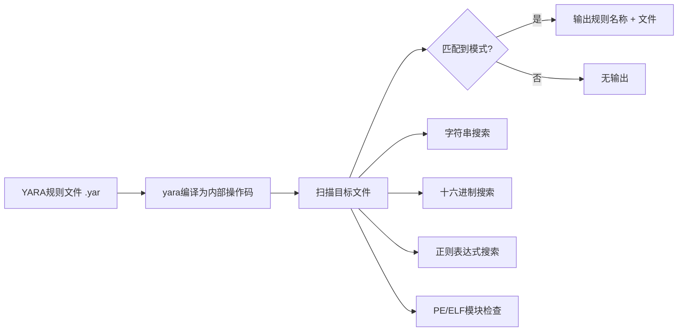

# 模块14：YARA规则编写与检测

> **学习目标**：掌握YARA规则语法、编写检测规则、理解杀软检测机制
> **所需工具**：yara, yarac, yara-python, strings

## 目录

- [[#一、YARA概述|YARA概述]]
- [[#二、YARA规则语法详解|规则语法]]
- [[#三、YARA命令行使用|命令行使用]]
- [[#四、红队YARA实战应用|红队实战]]
- [[#五、YARA规则最佳实践|最佳实践]]
- [[#六、综合实践|综合实践]]
- [[#七、高级YARA技术|高级技术]]

---

## 一、YARA概述

### 1.1 什么是YARA

YARA(Yet Another Recursive Acronym)是一个开源的恶意软件识别和分类工具。它允许安全研究人员创建基于文本和二进制模式的规则来描述恶意软件家族的特征。

核心价值：
- 识别和分类恶意软件样本
- 快速扫描大量文件检测威胁
- 作为杀毒引擎的核心检测组件(如ClamAV集成YARA)
- 创建自定义的威胁检测规则集

### 1.2 安装

```bash
sudo pacman -S yara # ArchStrike安装
sudo pacman -S python-yara # Python绑定

yara --version
which yara
```

### 1.3 YARA工作流程



### 1.4 YARA规则文件结构

```yara
rule Rule_Name {
 meta:
 description = "规则描述"
 author = "规则作者"
 date = "2025-01-01"
 severity = "high"

 strings:
 $string1 = "detectable_string" ascii wide
 $hex1 = { 6A 40 68 00 30 00 00 }
 $regex1 = /https?:\/\/evil\.com\/[a-z0-9]+/

 condition:
 $string1 or $hex1 or $regex1
}
```

三个核心部分：
- **meta**：规则的元数据(描述、作者、日期等)
- **strings**：定义要匹配的字符串或模式
- **condition**：定义匹配条件的逻辑表达式

---

## 二、YARA规则语法详解

### 2.1 字符串定义

**(1) 文本字符串匹配**：

```yara
strings:
 $s1 = "Hello" ascii # 仅匹配ASCII
 $s2 = "Hello" wide # 仅匹配UTF-16LE宽字节
 $s3 = "Hello" ascii wide # 匹配ASCII和宽字节
 $s4 = "Hello" nocase # 不区分大小写
 $s5 = "Hello" fullword # 完整词匹配
 $s6 = "Hello" xor # 匹配XOR编码后的字符串
 $s7 = "Hello" base64 # 匹配Base64编码

 # 组合修饰符
 $s8 = "cmd.exe" ascii fullword nocase
```

示例(检测键盘记录器)：
```yara
rule Malware_Keylogger {
 strings:
 $log1 = "keylog.txt" ascii wide nocase
 $log2 = "[KeyPressed]" ascii
 $hook = "SetWindowsHookExA" ascii fullword
 $proc = "GetAsyncKeyState" ascii fullword
 condition:
 2 of them
}
```

**(2) 十六进制模式匹配**：

```yara
strings:
 $h1 = { 6A ?? 68 } # ?? 匹配任意单字节
 $h2 = { 6A [2] 68 } # [2] 跳2个字节
 $h3 = { 6A [2-6] 68 } # [2-6] 跳2到6个字节
 $h4 = { 6A [2-] 68 } # [2-] 至少跳2个字节
 $h5 = { ( 6A | 6B ) 68 } # 匹配 6A 或 6B

 # 检测MZ头+PE签名
 $pe = { 4D 5A [30:] 50 45 00 00 }

 # 检测ELF头
 $elf = { 7F 45 4C 46 }

 # 检测常见Shellcode
 $sc = { FC E8 8? 00 00 00 }
 $nop = { 90 90 90 90 90 90 90 90 }
```

**(3) 正则表达式匹配**：

```yara
strings:
 # 匹配URL
 $url = /https?:\/\/[a-z0-9._-]+\.(com|net|org|cn|ru)/

 # 匹配IP地址
 $ip = /\d{1,3}\.\d{1,3}\.\d{1,3}\.\d{1,3}/

 # 匹配Base64编码数据
 $b64 = /[A-Za-z0-9+\/=]{40,}/

 # 正则修饰符
 $r1 = /pattern/ i # 不区分大小写
 $r2 = /pattern/ s # 点号匹配换行符
```

### 2.2 条件表达式

**(1) 基本布尔条件**：

```yara
condition:
 $str1 # $str1至少出现一次
 $str1 and $str2 # 两者都出现
 $str1 or $str2 # 任一出现
 not $str1 # $str1不出现
 ($str1 or $str2) and $str3 # 复杂组合
 any of them # 任意字符串出现
 all of them # 所有字符串出现
 none of them # 没有字符串出现
```

**(2) 计数条件**：

```yara
condition:
 #str1 == 3 # 恰好3次
 #str1 > 5 # 大于5次
 #str1 < 10 # 小于10次
 2 of them # 至少2个字符串出现
 3 of ($s1, $s2, $s3) # 指定字符串中至少3个出现
 all of ($s1, $s2, $s3) # 所有指定字符串都出现
```

**(3) 字符串位置条件**：

```yara
condition:
 $str1 at 0x100 # 在偏移0x100处
 $str1 in (0..100) # 在前100字节内
 $str1 in (100..filesize) # 在100字节之后
```

**(4) 文件属性条件**：

```yara
condition:
 filesize < 100KB # 小于100KB
 filesize > 1MB # 大于1MB
 filesize < 5MB and filesize > 500KB # 大小范围
```

**(5) PE模块条件**：

```yara
import "pe"

condition:
 pe.is_pe
 pe.sections[0].name == ".text"
 pe.number_of_sections > 8
 pe.timestamp == 0 # 时间戳为0(可疑)
 pe.is_32bit()
 pe.is_64bit()
 pe.is_dll()

 # for循环检查所有节
 for any i in (0..pe.number_of_sections-1) : (
 pe.sections[i].name == ".evil"
 )
```

**(6) Math模块熵值检测**：

```yara
import "math"

condition:
 math.entropy(0, filesize) > 7.0 # 高熵值(加密/压缩数据)
```

### 2.3 Meta元数据

```yara
meta:
 description = "检测Cobalt Strike Beacon"
 author = "Red Team Research"
 date = "2024-06-15"
 version = "1.0"
 severity = "critical"
 reference = "https://attack.mitre.org/"
 hash = "d41d8cd98f00b204e9800998ecf8427e"
 malware_type = "RAT"
```

---

## 三、YARA命令行使用

### 3.1 基本扫描命令

```bash
# 扫描单个文件
yara rule.yar malware.exe

# 递归扫描目录
yara -r rule.yar /path/to/scan/

# 显示匹配的字符串和偏移
yara -s rule.yar malware.exe
# 输出: 0x1a3b:$str1: malicious_string

# 显示匹配的标签
yara -g rule.yar malware.exe

# 扫描进程内存
yara -p <PID> rule.yar
```

### 3.2 常用参数速查

| 参数 | 说明 |
|------|------|
| -r | 递归扫描目录 |
| -s | 显示匹配的字符串和偏移 |
| -g | 显示匹配的标签(tags) |
| -l | 仅显示匹配的文件名 |
| -c | 只显示匹配数量 |
| -n | 不扫描大于指定大小的文件 |
| -t \<tag\> | 只使用带指定标签的规则 |
| -x \<module\> | 使用外部模块(-x pe -x elf) |
| -p \<PID\> | 扫描指定进程内存 |
| -v | 详细输出模式 |
| -f | 快速模式 |

### 3.3 规则编译(yarac)

```bash
# 编译单个规则文件
yarac rule.yar rule.yarc

# 扫描时使用编译后的规则
yara -C rule.yarc target_file

# 编译多个规则文件
yarac rules/rule1.yar rules/rule2.yar compiled_rules.yarc
```

### 3.4 实用扫描场景

```bash
# 批量扫描恶意样本
yara -r -s my_rules.yar ./malware_samples/

# 仅列出有匹配的文件
yara -r -l my_rules.yar ./malware_samples/

# 统计匹配文件数
yara -r -c my_rules.yar ./malware_samples/

# 排除大文件
yara -r -n 50MB my_rules.yar /home/user/

# PE模块高级扫描
yara pe_rules.yar malware.exe
```

---

## 四、红队YARA实战应用

### 4.1 用YARA检测自己的工具是否被杀软识别

操作流程：
1. 收集杀毒软件公开的YARA规则
2. 对自己的工具进行扫描
3. 分析匹配结果，修改工具代码

```bash
# 扫描自己的工具
yara -r -s antivirus_rules.yar ./my_tools/

# 如果匹配：
# - 查看匹配的字符串内容
# - 修改该字符串(更换默认配置)
# - 对敏感字符串进行加密/XOR编码
```

### 4.2 理解杀软检测规则，改进免杀

常见杀软检测的目标特征及应对：

| 检测目标 | 检测方式 | 红队应对 |
|----------|----------|----------|
| 硬编码字符串 | `$key = "CobaltStrike" nocase` | 运行时字符串解密 |
| API调用序列 | `{ FF 15 ?? ?? ?? ?? }` | 动态解析API，syscall直接调用 |
| Shellcode特征 | `{ FC 48 83 E4 F0 }` | 修改shellcode生成模板 |
| PE结构特征 | section数量异常 | 调整节数量和权限 |
| 网络特征 | C2域名正则匹配 | 域前置或CDN中转 |

### 4.3 对收集的恶意样本分类

```yara
rule Ransomware_WannaCry {
 meta:
 description = "检测WannaCry勒索软件"
 malware_family = "WannaCry"
 strings:
 $str1 = "WannaDecryptor" ascii wide
 $str2 = "WANNACRY" ascii wide
 $hex1 = { 6d 73 73 79 73 6f 6c 65 64 2e 63 6f 6d }
 condition:
 any of ($str*) or $hex1
}

rule RAT_Gh0stRAT {
 meta:
 malware_family = "Gh0st RAT"
 strings:
 $menu = "Gh0st RAT" ascii wide
 $class = "gh0st" nocase
 condition:
 1 of them
}
```

### 4.4 C2框架检测规则

```yara
rule C2_CobaltStrike_Beacon {
 meta:
 description = "检测Cobalt Strike Beacon"
 severity = "high"
 malware_type = "RAT"
 strings:
 $str1 = "%s as %s\\%s %d" fullword
 $str2 = "ReflectiveLoader" nocase
 $str3 = "beacon.dll" nocase
 $hex1 = { 4D 5A [30:] E8 [4] FF FF FF FF 5? [16] }
 condition:
 uint16(0) == 0x5A4D and (2 of ($str*) or any of ($hex*))
}

rule C2_Metasploit_Meterpreter {
 meta:
 description = "检测Meterpreter Payload"
 strings:
 $str2 = "metsrv.dll" nocase
 $str3 = "stdapi" nocase
 $hex1 = { FC E8 82 00 00 00 60 89 E5 }
 condition:
 filesize < 500KB and (1 of ($str*) or any of ($hex*))
}
```

---

## 五、YARA规则最佳实践

### 5.1 规则编写原则

**(1) 避免过于宽泛的规则**：

```yara
# 反面示例(太宽泛)
rule Bad_Rule {
 strings: $s1 = "http"
 condition: $s1
}

# 正面示例(精确)
rule Good_Rule {
 strings:
 $url = /https?:\/\/evil-[a-z]+\.ddns\.net\/[A-Za-z0-9]{32}/
 $ua = "MaliciousAgent/2.0" wide nocase
 condition: $url or $ua
}
```

**(2) 组合多种特征提高准确率**：单一特征易产生误报，组合字符串、十六进制和文件属性可以显著提高检测准确率。

**(3) 使用文件大小限制减少开销**：
```yara
condition: filesize < 5MB and ($str1 or $str2)
```

**(4) 利用PE/ELF模块进行上下文检测**：
```yara
import "pe"
condition: pe.is_pe and $str1 and pe.number_of_sections > 5
```

### 5.2 规则测试与优化

```bash
# 测试误报(在正常文件上测试)
yara -r rule.yar /usr/bin/
yara -r rule.yar /lib/

# 测试漏报(在已知恶意样本上测试)
yara -r -s rule.yar ./known_malware/
```

优化性能：
- 将高频偏移的条件放在前面
- 使用filesize快速过滤
- 避免过长的跳转范围([-])
- 优先使用字符串匹配而非正则表达式

### 5.3 版本控制和管理

```bash
git init yara-rules
git add *.yar
git commit -m "Initial YARA rules"
```

规则文件组织：
```
yara-rules/
├── c2_frameworks/
│ ├── cobaltstrike.yar
│ ├── meterpreter.yar
│ └── empire.yar
├── ransomware/
│ └── wannacry.yar
├── trojans/
│ └── darkcomet.yar
├── common/
│ └── suspicious_strings.yar
└── index.yar # include所有规则
```

---

## 六、综合实践

### 6.1 编写检测规则实战

```bash
mkdir ~/yara-lab && cd ~/yara-lab
mkdir rules samples clean_files
```

### 6.2 反弹Shell生成器检测规则

```yara
rule RT_ReverseShell_Generators {
 meta:
 description = "检测常见反弹Shell生成器特征"
 severity = "high"
 strings:
 $rs1 = "bash -i >& /dev/tcp/" ascii
 $rs2 = "python -c 'import socket" ascii
 $rs3 = "nc -e /bin/sh" ascii
 $rs4 = "perl -e 'use Socket;" ascii
 $rs5 = "php -r '$sock=fsockopen" ascii
 condition:
 any of them
}
```

### 6.3 Shellcode加载器检测规则

```yara
rule RT_Shellcode_Loader {
 meta:
 description = "检测Shellcode加载器特征"
 severity = "critical"
 strings:
 $sc1 = { FC E8 8? 00 00 00 }
 $sc2 = "VirtualAlloc" ascii fullword
 $sc3 = "VirtualProtect" ascii fullword
 $sc4 = "WriteProcessMemory" ascii fullword
 $sc5 = "CreateRemoteThread" ascii fullword
 condition:
 filesize < 1MB and
 2 of ($sc*) or
 3 of ($sc2, $sc3, $sc4, $sc5)
}
```

### 6.4 PHP WebShell检测规则

```yara
rule RT_WebShell_PHP {
 meta:
 description = "检测PHP WebShell特征"
 severity = "critical"
 strings:
 $s1 = "eval(" ascii
 $s2 = "$_POST[" ascii
 $s3 = "base64_decode" ascii
 $s4 = "system(" ascii
 $s5 = "exec(" ascii
 $s6 = "passthru(" ascii
 $s7 = "shell_exec" ascii
 condition:
 (filesize < 50KB) and 3 of ($s*)
}
```

### 6.5 测试规则

```bash
# 扫描测试
yara -s rules/red_team_tools.yar /path/to/test/

# 编译规则
yarac rules/red_team_tools.yar rules.red
yara -r rules.red /path/to/test/

# 验证无误报
yara -r rules/red_team_tools.yar /usr/bin/ | head -20
```

### 6.6 Python自动化批量扫描

```python
import yara
import os

def load_rules(rule_path):
 return yara.compile(filepath=rule_path)

def scan_directory(rules, directory):
 for root, dirs, files in os.walk(directory):
 for filename in files:
 filepath = os.path.join(root, filename)
 try:
 matches = rules.match(filepath)
 if matches:
 for match in matches:
 print(f"[+] {match.rule} -> {filepath}")
 for s in match.strings:
 print(f" {s}")
 except Exception as e:
 print(f"Error: {filepath}: {e}")

if __name__ == "__main__":
 rules = load_rules("rules/red_team_tools.yar")
 scan_directory(rules, "/path/to/scan/")
```

---

## 七、高级YARA技术

### 7.1 条件模块(Module)

```yara
import "pe" # PE文件分析
import "elf" # ELF文件分析
import "math" # 数学函数和熵值计算
import "hash" # 哈希计算
```

**PE模块深入使用**：
```yara
import "pe"

rule Advanced_PE_Detection {
 condition:
 pe.is_pe and
 pe.version_info["CompanyName"] contains "Malware Inc" and
 pe.imphash() == "f34d5f2d4577ed6d9ceec516c1f5a744"
}
```

**ELF模块**：
```yara
import "elf"

rule Linux_Malware {
 condition:
 elf.type == elf.ET_EXEC and
 for any i in (0..elf.number_of_sections-1): (
 elf.sections[i].flags & elf.SHF_WRITE and
 elf.sections[i].flags & elf.SHF_EXECINSTR
 )
}
```

### 7.2 匿名字符串和私有规则

```yara
# 匿名字符串
rule AnonStrings {
 strings:
 $ = "string1"
 $ = "string2"
 condition:
 any of them
}

# 私有规则(private rule)
private rule Base_Features {
 strings:
 $ = "common_feature" ascii
 condition: $
}

rule Specific_Malware : Base_Features {
 strings:
 $specific = "specific_string"
 condition: $specific
}

# 全局规则(global rule)
global rule File_Size_Limit {
 condition: filesize < 10MB
}
```

---

## 总结

1. YARA基础：架构、安装、规则文件结构
2. 规则语法：字符串定义(Gry/Hex/Regex)、条件表达式、元数据
3. 命令行使用：基本扫描、参数选项、规则编译
4. 红队实战：免杀验证、样本分类、C2检测
5. 最佳实践：编写原则、测试优化、版本管理

掌握YARA意味着：
- 能够创建精准的恶意软件检测规则
- 理解杀毒软件的检测机制
- 能够改进红队工具的免杀能力
- 具备威胁情报和样本分类的核心技能

---

> **相关模块**：[[01-恶意软件分析入门|恶意软件分析]]

[[../总目录与快速查询|← 返回总目录]]
