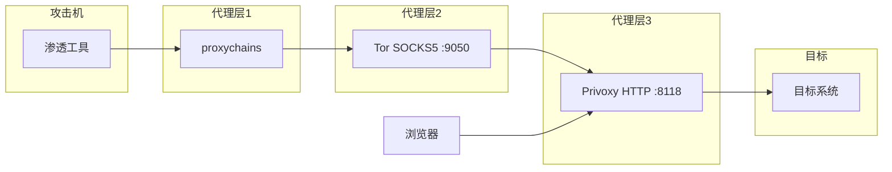

# 01-代理与隐蔽通信

ArchStrike工具组：proxychains, tor, privoxy, curl, nmap, firefox
预计学习时间：3-5小时  |  难度：中级

## 目录

- [[#一、代理链与隐蔽通信概述|一、代理链与隐蔽通信概述]]
- [[#二、Proxychains 核心武器|二、Proxychains - 代理链的核心武器]]
  - [[#2.1 配置文件详解|2.1 配置文件详解]]
  - [[#2.2 基础使用|2.2 基础使用]]
  - [[#2.3 高级技巧|2.3 高级技巧]]
- [[#三、Tor 网络|三、Tor 网络 - 洋葱路由匿名通信]]
  - [[#3.1 安装与启动|3.1 安装与启动]]
  - [[#3.2 隐藏服务|3.2 隐藏服务]]
  - [[#3.3 出口节点控制|3.3 出口节点控制]]
- [[#四、Privoxy 桥接|四、Privoxy - HTTP到SOCKS桥接]]
- [[#五、综合实践|五、综合实践 - 建立隐蔽通信链路]]
- [[#六、安全注意事项|六、安全注意事项与最佳实践]]

## 一、代理链与隐蔽通信概述

代理和隧道技术是红队行动中隐藏身份、穿透内网的基础设施。通过多层代理链，可以隐藏攻击源的真实IP，穿越防火墙和NAT边界。



工具清单：

| 工具 | 功能 | 默认端口 |
|------|------|---------|
| proxychains | 代理链工具，强制程序通过代理 | LD_PRELOAD劫持 |
| tor | 洋葱路由匿名网络 | SOCKS: 9050 |
| privoxy | HTTP到SOCKS桥接 | HTTP: 8118 |

基础网络知识参见 [[../archstrike-base教学/01-基础命令与Linux安全操作|基础命令与Linux安全操作]]。

## 二、Proxychains - 代理链的核心武器

proxychains 通过 `LD_PRELOAD` 机制劫持 `connect()` 等网络函数，将程序的网络流量重定向到代理链中。核心优势：不需要修改程序源码，支持SOCKS4/SOCKS5/HTTP代理，支持代理链多级串联，支持DNS代理防止DNS泄露。

```bash
sudo pacman -S proxychains
which proxychains
```

### 2.1 配置文件详解

配置文件 `/etc/proxychains.conf` 关键配置项：

**(1) 代理链模式选择：**

```bash
# 动态链模式——推荐使用
dynamic_chain
# 解释：按代理列表顺序依次尝试，不可用则跳过

# 严格链模式
# strict_chain
# 解释：必须严格按顺序使用所有代理

# 随机链模式
# random_chain
# 解释：从代理列表中随机选择代理组成链
```

**(2) 代理列表配置：**

```bash
[ProxyList]
# 格式：type  host  port  [user  password]

# SOCKS4代理（Tor默认端口）
socks4  127.0.0.1  9050

# SOCKS5代理
socks5  192.168.1.100  1080

# HTTP代理
http    10.0.0.1      8080  user  pass
```

代理类型对比：
- **socks4**：仅支持TCP，无认证
- **socks5**：支持TCP/UDP，支持认证，支持DNS
- **http**：HTTP代理，部分支持CONNECT隧道

**(3) DNS代理——proxy_dns（防止DNS泄露）：**

```bash
# 开启DNS代理
proxy_dns
# 解释：DNS查询也会通过代理发送，防止本地DNS泄露。
# 警告：proxy_dns在SOCKS4代理下可能工作不正常，建议使用SOCKS5。
```

**(4) 其他重要配置：**

```bash
quiet_mode              # 安静模式（不输出调试信息）
tcp_read_time_out 15000  # TCP读取超时（毫秒）
tcp_connect_time_out 8000 # TCP连接超时（毫秒）
```

### 2.2 基础使用

语法：`proxychains <程序> [参数]`

**(1) 通过代理执行Nmap扫描：**

```bash
proxychains nmap -sT -Pn 10.0.0.10
# -sT：TCP全连接扫描（proxychains不支持SYN扫描）
# -Pn：跳过主机发现（代理环境下ping可能不可靠）
```

**(2) 通过代理使用Firefox浏览器：**

```bash
proxychains firefox
# 确保所有Firefox流量（包括插件更新、DNS查询）都走代理，避免泄露真实IP
```

**(3) 通过代理进行SSH连接：**

```bash
proxychains ssh user@10.0.0.10
# 适用于连接内网SSH服务、通过跳板机连接深层网络、隐藏SSH客户端真实IP
```

**(4) 通过代理运行sqlmap进行SQL注入：**

```bash
proxychains sqlmap -u "http://internal.target.com/vuln.php?id=1" --dbs
# 目标URL必须可通过代理访问，代理会增加延迟，可配合--delay参数降低请求速率
```

**(5) 通过代理进行curl请求验证：**

```bash
proxychains curl -s https://check.torproject.org
# 验证代理是否正常工作，检查出口IP是否为Tor节点IP
```

### 2.3 高级技巧

**(1) 多层代理链示例配置：**

```bash
[ProxyList]
socks5  192.168.1.100  1080   # 第一跳：本地SOCKS代理
http    10.20.30.40    3128   # 第二跳：内网HTTP代理
socks4  172.16.0.1     9050   # 第三跳：目标网络Tor节点
# 流量路径：本机 -> SOCKS5(1080) -> HTTP(3128) -> SOCKS4(9050) -> 目标
```

**(2) 绕过反代理检测：** 某些程序会检测LD_PRELOAD并拒绝运行。可以使用proxychains的安静模式减少特征，或者使用iptables + redsocks的方式进行透明代理。

## 三、Tor 网络 - 洋葱路由匿名通信

Tor（The Onion Router）基于洋葱路由的匿名通信网络，流量经过三层中继节点加密传输：
- **Entry/Guard Node（入口节点）**：知道客户端IP，不知道目的地
- **Middle Node（中间节点）**：只知道前驱和后继
- **Exit Node（出口节点）**：知道目的地，不知道客户端IP

### 3.1 安装与启动

```bash
# 安装
sudo pacman -S tor

# 启动Tor服务
sudo systemctl start tor

# 设置开机自启
sudo systemctl enable tor

# 查看运行状态
sudo systemctl status tor

# 查看Tor日志
sudo journalctl -u tor -f

# 重启Tor服务（换出口节点）
sudo systemctl restart tor
```

验证Tor代理是否生效：

```bash
# 使用proxychains验证
proxychains curl -s https://check.torproject.org
# 配置正确会显示"Congratulations"

# 查看当前出口IP
proxychains curl -s https://api.ipify.org
curl -s https://api.ipify.org  # 对比直连IP
```

### 3.2 隐藏服务

Tor隐藏服务允许在Tor网络内部提供TCP服务，服务端的真实IP对外界不可见。对红队C2基础设施非常有用。

编辑 `/etc/tor/torrc`：

```bash
HiddenServiceDir /var/lib/tor/hidden_service/
HiddenServicePort 80 127.0.0.1:80
HiddenServicePort 22 127.0.0.1:22
```

查看 `.onion` 地址：

```bash
sudo cat /var/lib/tor/hidden_service/hostname
# 输出类似：abcdef1234567890.onion
```

### 3.3 出口节点控制

编辑 `/etc/tor/torrc`：

```bash
# 只使用特定国家的出口节点
ExitNodes {us},{gb},{de}

# 排除某些国家
ExcludeExitNodes {cn},{ru}

# 严格节点
StrictNodes 1
```

Tor + SSH隧道组合：

```bash
# 首先建立SSH动态端口转发
ssh -D 1080 user@vps

# proxychains中配置多级代理
[ProxyList]
socks5  127.0.0.1  1080    # SSH隧道
socks4  127.0.0.1  9050    # Tor
```

## 四、Privoxy - HTTP到SOCKS桥接

Tor提供的是SOCKS5代理（端口9050），但某些应用程序只支持HTTP代理。Privoxy将HTTP代理请求转换为SOCKS请求，起到桥接作用。

```bash
# 安装
sudo pacman -S privoxy
```

编辑 `/etc/privoxy/config`，在文件末尾添加：

```bash
forward-socks5t   /               127.0.0.1:9050 .
# forward-socks5t：使用SOCKS5t（t表示支持Tor DNS解析）
# /：匹配所有URL路径
# 最后的点(.)：表示这是转发的终点
```

```bash
# 启动Privoxy
sudo systemctl start privoxy
sudo systemctl enable privoxy
# 默认监听地址：127.0.0.1:8118
```

结合Firefox使用：
1. 进入设置 → 网络设置 → 代理设置
2. 选择"手动配置代理"
3. HTTP代理：127.0.0.1，端口：8118
4. 勾选"也将此代理用于HTTPS"
5. SOCKS代理：127.0.0.1，端口：9050（SOCKS5）
6. 勾选"使用SOCKS代理时通过代理发送DNS查询"

验证Privoxy工作正常：

```bash
export http_proxy=http://127.0.0.1:8118
export https_proxy=http://127.0.0.1:8118
curl -s https://check.torproject.org
# 如果返回"Congratulations"，说明Privoxy -> Tor链路正常工作
```

## 五、综合实践 - 建立隐蔽通信链路

Step 1: 启动Tor服务

```bash
sudo systemctl start tor
sudo systemctl status tor
sudo journalctl -u tor | tail -20
# 预期输出：包含"Tor has successfully opened a circuit"
```

Step 2: 配置proxychains使用Tor SOCKS代理

```bash
sudo vim /etc/proxychains.conf
# 确保以下行未被注释：
#   dynamic_chain
#   proxy_dns
#   tcp_read_time_out 15000
#   tcp_connect_time_out 8000
# 代理列表最后一行添加：socks4  127.0.0.1  9050
```

Step 3: 验证代理链

```bash
proxychains curl -s https://api.ipify.org
curl -s https://api.ipify.org
# 两个IP应该不同，说明代理生效
```

Step 4: 通过代理进行Nmap扫描

```bash
proxychains nmap -sT -Pn -F 10.0.0.10
# 必须使用-sT（全连接扫描），必须使用-Pn（跳过主机发现）
# -F 表示快速扫描（仅100个常用端口）
```

Step 5: 搭建Privoxy桥接

```bash
sudo pacman -S privoxy
sudo vim /etc/privoxy/config
# 添加：forward-socks5t / 127.0.0.1:9050 .
sudo systemctl start privoxy
```

Step 6: 配置Firefox使用代理

打开 Firefox → 首选项 → 网络设置 → 手动代理配置 → HTTP代理 127.0.0.1:8118 → 勾选"也将此代理用于HTTPS" → 访问 https://check.torproject.org 确认显示"Congratulations"。

Step 7: 通过proxychains进行深度扫描

```bash
proxychains sqlmap -u "http://target.com/page.php?id=1" --dbs --batch
proxychains nikto -h http://target.com
proxychains dirb http://target.com
```

## 六、安全注意事项与最佳实践

### 6.1 操作安全（OPSEC）

- 渗透测试前务必确认proxychains配置正确
- 使用 `proxy_dns` 防止DNS泄露
- 定期更换Tor出口节点：`sudo systemctl restart tor`
- 不要在同一服务器上同时进行代理操作和直连操作

### 6.2 已知绕过风险

- **UDP流量**：proxychains默认不代理UDP流量
- **ICMP流量**：ping/traceroute等可能泄露真实IP
- **WebRTC**：浏览器可能通过WebRTC泄露真实IP。解决方案：Firefox中 `about:config` → `media.peerconnection.enabled` → false
- **Flash/Java插件**：可能绕过代理设置

### 6.3 性能优化

- 选择网络延迟较低的Tor出口节点
- 使用 `dynamic_chain` 而非 `strict_chain`
- 使用SOCKS5替代SOCKS4（更好的DNS支持）
- 适当增加超时时间：`tcp_read_time_out 60000`

### 6.4 故障排查

问题：proxychains提示"denied"或无法连接

```bash
# 1. 确认代理服务器正在运行
netstat -tlnp | grep 9050
# 2. 确认proxychains配置正确
cat /etc/proxychains.conf | grep -v "^#"
# 3. 使用curl直接测试代理
curl --socks4 127.0.0.1:9050 https://check.torproject.org
# 4. 检查防火墙规则
# 5. 使用verbose模式
proxychains -v curl https://httpbin.org/ip
```

问题：DNS解析失败

```bash
# 1. 确认proxy_dns选项已启用
# 2. 检查是否为SOCKS4（SOCKS4不支持远程DNS），建议切换为SOCKS5
# 3. 尝试手动指定DNS服务器
```

---

总结：proxychains是红队代理操作的核心工具，Tor网络提供了匿名通信的基础设施，privoxy弥补了HTTP代理到SOCKS代理的转换缺口。通过组合这些工具可以构建多层代理链。实际操作中务必注意OPSEC，防止身份泄露。

下一教程：[[02-内网隧道与端口转发|02-内网隧道与端口转发]]

[[../总目录与快速查询|← 返回总目录]]
