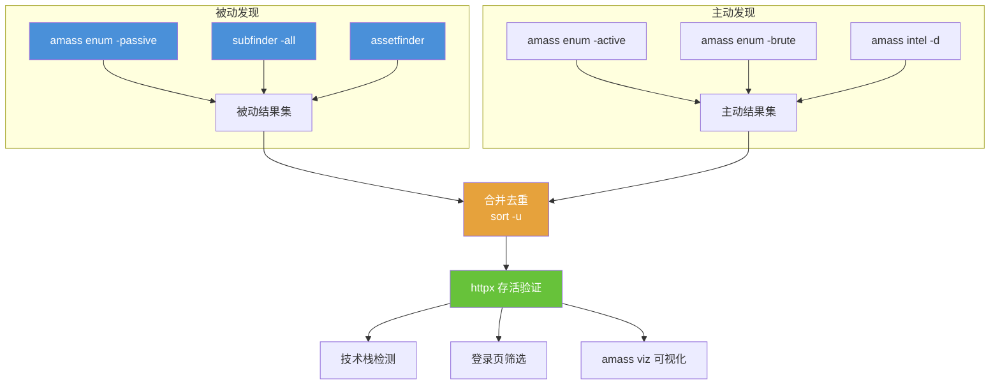

## 目录

- [[#一、工具概览与对比|一、工具概览与对比]]
- [[#二、amass — OWASP 资产发现工具|二、amass — OWASP 资产发现工具]]
  - [[#2.1 安装与子命令|2.1 安装与子命令]]
  - [[#2.2 被动枚举|2.2 被动枚举]]
  - [[#2.3 主动枚举|2.3 主动枚举]]
  - [[#2.4 综合扫描|2.4 综合扫描]]
  - [[#2.5 API 密钥配置|2.5 API 密钥配置]]
  - [[#2.6 情报收集 — intel 子命令|2.6 情报收集 — intel 子命令]]
  - [[#2.7 数据库管理|2.7 数据库管理]]
  - [[#2.8 可视化|2.8 可视化]]
  - [[#2.9 持续监控|2.9 持续监控]]
- [[#三、subfinder — 快速被动子域名发现|三、subfinder — 快速被动子域名发现]]
  - [[#3.1 安装与基本使用|3.1 安装与基本使用]]
  - [[#3.2 高级参数与 API 配置|3.2 高级参数与 API 配置]]
- [[#四、assetfinder — 轻量级资产发现|四、assetfinder — 轻量级资产发现]]
- [[#五、三工具结果整合与对比|五、三工具结果整合与对比]]
- [[#六、完整实践流程|六、完整实践流程]]
- [[#七、常见问题与排错|七、常见问题与排错]]
- [[#八、自动化脚本示例|八、自动化脚本示例]]



## 一、工具概览与对比

在红队侦察阶段，子域名发现是最关键的环节之一。一个组织可能在主域名下部署了数十甚至数百个子域名，其中往往包含测试环境、开发服务器、老旧系统等安全防护薄弱的入口点。

> 相关模块: [[../archstrike-base教学/02-信息收集与侦察技术|信息收集基础]] | [[02-高级DNS侦察技术|DNS 侦察]] | [[03-OSINT与人肉搜索技术|OSINT 技术]]

本教程涉及的三个工具各有侧重：

| 功能 | amass | subfinder | assetfinder |
|---|---|---|---|
| 被动枚举 | 支持 | 支持 | 支持 |
| 主动枚举 | 支持 | 不支持 | 不支持 |
| 暴力破解 | 支持 | 不支持 | 不支持 |
| API 密钥支持 | 支持 | 支持 | 不支持 |
| 可视化 | 支持 (D3.js) | 不支持 | 不支持 |
| 速度 | 中 | 快 | 快 |
| 结果数量 | 多 | 中 | 少 |
| 持续监控 | 支持 | 不支持 | 不支持 |

## 二、amass — OWASP 资产发现工具

### 2.1 安装与子命令

在 ArchStrike 上安装:

```bash
sudo pacman -S amass
amass -version
```

amass 的主要子命令:

| 子命令 | 功能 |
|---|---|
| `amass enum` | 枚举子域名（核心功能） |
| `amass intel` | 情报收集（发现相关域名、ASN、CIDR） |
| `amass db` | 数据库管理（查看、导入导出发现结果） |
| `amass viz` | 可视化资产关系图 |
| `amass track` | 持续监控域名变化（对比历史结果） |

### 2.2 被动枚举

被动枚举不直接与目标交互，仅通过公开数据源收集信息:

```bash
amass enum -passive -d example.com
amass enum -passive -d example.com -o passive_results.txt -dir ./amass_output
```

| 参数 | 说明 |
|---|---|
| `-passive` | 仅使用被动源（不直接查询目标 DNS） |
| `-d` | 目标域名 |
| `-o` | 输出文件路径 |
| `-dir` | 指定 amass 数据存储目录（保存到数据库供后续查询） |

### 2.3 主动枚举

主动枚举会直接查询目标 DNS 服务器，并结合被动源:

```bash
amass enum -active -d example.com -o active_results.txt
amass enum -active -d example.com -p 80,443,8080 -o active_results.txt
```

| 参数 | 说明 |
|---|---|
| `-p` | 指定扫描端口（默认 443 和 80，添加 8080 可以发现更多 Web 服务） |

### 2.4 综合扫描

结合所有技术进行深度扫描:

```bash
amass enum -d example.com \
  -src \
  -ip \
  -brute \
  -min-for-recursive 2 \
  -o comprehensive.txt \
  -dir ./amass_db
```

| 参数 | 说明 |
|---|---|
| `-src` | 标注每个子域名的发现来源 |
| `-ip` | 显示每个子域名对应的 IP 地址 |
| `-brute` | 启用字典暴力破解 |
| `-w /path/dict` | 使用自定义字典 |
| `-min-for-recursive` | 设置递归阈值 |
| `-max-dns-queries` | 限制 DNS 查询速率 |

### 2.5 API 密钥配置

许多数据源需要 API 密钥才能发挥全部能力:

```bash
mkdir -p ~/.config/amass
nano ~/.config/amass/config.ini
```

配置文件内容示例:

```ini
[data_sources]
[data_sources.Shodan]
apikey = YOUR_SHODAN_API_KEY
[data_sources.Censys]
apikey = YOUR_CENSYS_API_ID
secret = YOUR_CENSYS_API_SECRET
[data_sources.SecurityTrails]
apikey = YOUR_SECURITYTRAILS_API_KEY
[data_sources.VirusTotal]
apikey = YOUR_VIRUSTOTAL_API_KEY
[data_sources.GitHub]
apikey = YOUR_GITHUB_TOKEN
```

使用配置文件执行扫描:

```bash
amass enum -d example.com -config ~/.config/amass/config.ini
```

免费 API 密钥获取地址:

| 数据源 | 注册地址 |
|---|---|
| Shodan | https://account.shodan.io |
| SecurityTrails | https://securitytrails.com |
| VirusTotal | https://virustotal.com |

### 2.6 情报收集 — intel 子命令

在枚举之前，先用 intel 子命令扩大攻击面:

```bash
amass intel -d example.com
amass intel -d example.com -whois
amass intel -d example.com -o associated_domains.txt
```

输出信息:
1. 发现的相关域名（通过 SSL 证书、Whois、ASN 关联）
2. 目标拥有的 ASN 编号
3. 目标拥有的 IP 段 (CIDR)
4. 反向 Whois 查询结果

### 2.7 数据库管理

amass 将所有发现保存在本地 Graph 数据库中，可随时查询:

```bash
amass db -d example.com -show       # 显示该域名的所有发现
amass db -d example.com -show -ip   # 显示 IP 相关数据
amass db -list                       # 列出数据库中扫描过的所有域名
amass db -d example.com -names       # 仅列出子域名（不含 IP 等）
```

### 2.8 可视化

生成 D3.js 可视化关系图:

```bash
amass viz -d example.com -d3
firefox amass_d3.html &
```

图表展示:
- 域名之间的关联关系（圆点=子域名，颜色表示不同来源）
- SSL 证书共享关系
- 域名到 IP 的映射关系
- WhoIs 关联

### 2.9 持续监控

跟踪域名的变化:

```bash
amass track -d example.com -last 2    # 对比最近 2 次扫描的差异
amass track -d example.com -history   # 显示所有历史记录
```

## 三、subfinder — 快速被动子域名发现

### 3.1 安装与基本使用

```bash
sudo pacman -S subfinder

subfinder -d example.com
subfinder -d example.com -o subfinder_output.txt
subfinder -dL domains.txt -o all_subs.txt
```

### 3.2 高级参数与 API 配置

```bash
subfinder -d example.com \
  -all \
  -silent \
  -o subfinder_output.txt \
  -oI \
  -timeout 5 \
  -max-time 10
```

| 参数 | 说明 |
|---|---|
| `-all` | 使用所有数据源（包括需要 API 密钥的） |
| `-silent` | 静默模式（仅输出子域名） |
| `-oI` | 仅输出 IPv4 对应的子域名 |
| `-timeout` | 超时时间（秒） |
| `-max-time` | 该扫描最大执行时间（分钟） |

subfinder 的配置文件位于 `~/.config/subfinder/provider-config.yaml`，编辑此文件添加各数据源的 API 密钥:

```yaml
shodan: [YOUR_API_KEY]
virustotal: [YOUR_API_KEY]
securitytrails: [YOUR_API_KEY]
chaos: [YOUR_API_KEY]
github: [YOUR_GITHUB_TOKEN]
```

常用数据源: crtsh, dnsdumpster, alienvault, censys, github, shodan, virustotal, waybackarchive。

列出所有可用数据源:

```bash
subfinder -list
```

## 四、assetfinder — 轻量级资产发现

```bash
sudo pacman -S assetfinder

assetfinder example.com
assetfinder example.com | tee assetfinder_output.txt
```

assetfinder 特点:
- 极其轻量，适合快速扫描
- 主要利用 Certificate Transparency 日志、crt.sh
- 结合 httprobe 可以快速发现活跃 Web 服务:

```bash
assetfinder example.com | httprobe -c 50 > live_subs.txt
```

与其他工具链结合:

```bash
assetfinder example.com | sort -u | while read sub; do
  curl -s -o /dev/null -w "%{http_code}" "http://$sub"
  echo "  $sub"
done
```

## 五、三工具结果整合与对比

### 5.1 执行三工具扫描

```bash
amass enum -passive -d example.com -o amass_subs.txt
subfinder -d example.com -silent -o subfinder_subs.txt
assetfinder example.com | tee assetfinder_subs.txt
```

### 5.2 合并结果并去重

```bash
cat amass_subs.txt subfinder_subs.txt assetfinder_subs.txt | sort -u > all_subs.txt
wc -l all_subs.txt
```

### 5.3 分析各工具独有发现

```bash
# amass 独有的子域名
comm -23 <(sort amass_subs.txt) <(sort subfinder_subs.txt assetfinder_subs.txt | sort -u)

# subfinder 独有的子域名
comm -23 <(sort subfinder_subs.txt) <(sort amass_subs.txt assetfinder_subs.txt | sort -u)

# assetfinder 独有的子域名
comm -23 <(sort assetfinder_subs.txt) <(sort amass_subs.txt subfinder_subs.txt | sort -u)

# 三个工具都发现的子域名（交集）
comm -12 <(sort amass_subs.txt) <(sort subfinder_subs.txt | sort) | comm -12 - <(sort assetfinder_subs.txt)
```

### 5.4 验证子域名存活状态

```bash
cat all_subs.txt | httpx -silent -status-code -title -tech-detect -o live_assets.txt
```

### 5.5 筛选重要资产

```bash
# 筛选带有登录页面的子域名
cat all_subs.txt | httpx -silent -match-string "login" -o login_pages.txt

# 筛选使用特定技术的子域名
cat all_subs.txt | httpx -silent -tech-detect | grep -i "wordpress" > wordpress_sites.txt
```

## 六、完整实践流程

目标: tesla.com (仅供教学演示)

```bash
# Step 1: 创建项目目录，开始被动枚举
mkdir ~/recon-tesla && cd ~/recon-tesla
amass enum -passive -d tesla.com -o tesla_passive.txt -dir ./amass_db

# Step 2: 执行 amass 情报收集
amass intel -d tesla.com -o tesla_intel.txt

# Step 3: 对主域名执行深入主动枚举
amass enum -active -d tesla.com -o tesla_active.txt -dir ./amass_db -ip -src

# Step 4: 暴力破解子域名
amass enum -d tesla.com -brute -w /usr/share/amass/wordlists/subdomains.lst -o tesla_brute.txt

# Step 5: 使用 subfinder 补充被动发现
subfinder -d tesla.com -all -silent -o tesla_subfinder.txt

# Step 6: 使用 assetfinder 快速补充
assetfinder tesla.com | tee tesla_assetfinder.txt

# Step 7: 合并去重
cat tesla_passive.txt tesla_active.txt tesla_brute.txt tesla_subfinder.txt tesla_assetfinder.txt | sort -u > tesla_all_subs.txt
wc -l tesla_all_subs.txt

# Step 8: 查看 amass 数据库中的完整发现
amass db -d tesla.com -show
amass db -d tesla.com -names

# Step 9: 验证活跃 Web 服务
cat tesla_all_subs.txt | httpx -silent -status-code -title -o tesla_live.txt

# Step 10: 生成可视化资产图
amass viz -d tesla.com -d3
```

重点关注的目标特征:
- 状态码 200 且有登录页面的子域名
- 状态码 401/403（存在 Web 服务但需要认证）
- 带有 dev, staging, test, admin, portal, api 前缀
- 状态码 500+ 的子域名（可能存在配置问题）

## 七、常见问题与排错

| 问题 | 解决方案 |
|---|---|
| amass 报告 "too many DNS queries" | 使用 `--max-dns-queries 3` 限制速率 |
| subfinder 结果很少 | 检查 provider-config.yaml，添加 API 密钥 |
| assetfinder 只返回几个结果 | 主要依赖 crt.sh，冷门域名结果少是正常的 |
| 扫描时间太长 | 先用 amass passive + subfinder 快速获得结果，再针对性 active |
| 目标使用 Cloudflare/WAF | 1. SSL 证书透明度日志 (crt.sh) 绕过 CDN<br/>2. 历史 DNS 记录 (SecurityTrails)<br/>3. 暴力破解 + 反向 DNS 查询<br/>4. amass `-asn` 查询同 ASN 下其他 IP |

## 八、自动化脚本示例

```bash
#!/bin/bash
# recon.sh - 自动子域名发现脚本
TARGET=$1

if [ -z "$TARGET" ]; then
  echo "用法: ./recon.sh example.com"
  exit 1
fi

mkdir -p recon_$TARGET && cd recon_$TARGET

echo "[+] amass 被动枚举..."
amass enum -passive -d $TARGET -o amass_passive.txt 2>/dev/null &

echo "[+] subfinder 枚举..."
subfinder -d $TARGET -silent -o subfinder.txt 2>/dev/null &

echo "[+] assetfinder 枚举..."
assetfinder $TARGET | tee assetfinder.txt 2>/dev/null &

wait

echo "[+] 合并去重..."
cat amass_passive.txt subfinder.txt assetfinder.txt | sort -u > all_subs.txt
echo "[+] 共发现 $(wc -l < all_subs.txt) 个子域名"

echo "[+] 验证存活..."
cat all_subs.txt | httpx -silent -status-code -title -o live.txt 2>/dev/null
echo "[+] 活跃 Web 服务: $(wc -l < live.txt) 个"

echo "[+] 完成! 结果在 recon_$TARGET/ 目录中"
```

单一工具永远无法发现全部子域名。amass + subfinder + assetfinder 三管齐下，结合 Certificate Transparency、DNS 暴力破解和 API 数据源，才能构建最完整的资产图谱。红队侦察的一般原则是"能发现多少发现多少"——被遗忘的子域名或老旧服务器往往是最薄弱的入口点。

[[../总目录与快速查询|← 返回总目录]]
