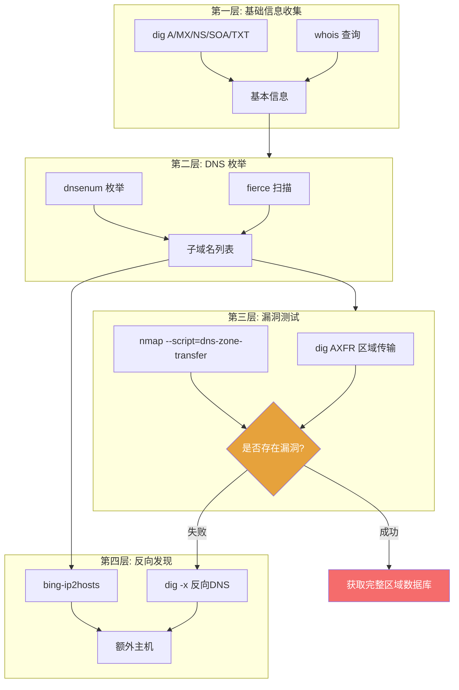

## 目录

- [[#一、DNS 侦察的核心价值|一、DNS 侦察的核心价值]]
- [[#二、fierce — DNS 枚举与子域名发现|二、fierce — DNS 枚举与子域名发现]]
 - [[#2.1 基本域名扫描|2.1 基本域名扫描]]
 - [[#2.2 指定 DNS 服务器与自定义字典|2.2 指定 DNS 服务器与自定义字典]]
 - [[#2.3 控制扫描范围与输出|2.3 控制扫描范围与输出]]
- [[#三、dnsenum — DNS 枚举全套工具|三、dnsenum — DNS 枚举全套工具]]
- [[#四、DNS 区域传输 (AXFR) 漏洞深入|四、DNS 区域传输 (AXFR) 漏洞深入]]
- [[#五、反向 DNS 与反向 IP 查找|五、反向 DNS 与反向 IP 查找]]
- [[#六、DNS 记录分析与信息挖掘|六、DNS 记录分析与信息挖掘]]
- [[#七、完整 DNS 侦察实践流程|七、完整 DNS 侦察实践流程]]
- [[#八、DNS 侦察防御建议（蓝队视角）|八、DNS 侦察防御建议（蓝队视角）]]
- [[#九、自动化 DNS 侦察脚本|九、自动化 DNS 侦察脚本]]



## 一、DNS 侦察的核心价值

DNS (Domain Name System) 是互联网的"电话簿"。从红队视角看，DNS 侦察可以揭示:

- 子域名和主机名（攻击面扩展）
- 内部网络架构（通过反向 DNS 猜测内网 IP 段命名规则）
- 邮件服务器（MX 记录 → 邮件安全测试入口）
- DNS 服务器本身（可能存在的区域传输漏洞）
- 同 IP 托管的其他站点（通过反向 IP 查找）
- 网络服务位置（SRV 记录，如 LDAP、SIP 等）

> 相关模块: [[01-高级子域名与资产发现|子域名发现]] | [[03-OSINT与人肉搜索技术|OSINT 技术]] | [[../archstrike-base教学/02-信息收集与侦察技术|信息收集基础]]

| DNS 记录类型 | 说明 |
|---|---|
| A | IPv4 地址 |
| AAAA | IPv6 地址 |
| MX | 邮件交换服务器 |
| NS | 名称服务器 |
| CNAME | 别名记录 |
| SOA | 授权起始（域名核心配置信息） |
| TXT | 文本记录（SPF, DKIM, DMARC 等邮件安全策略） |
| PTR | 反向 DNS 记录 |
| SRV | 服务定位记录 |
| AXFR | 区域传输请求（获取整个区域的所有记录） |

## 二、fierce — DNS 枚举与子域名发现

### 2.1 基本域名扫描

```bash
sudo pacman -S fierce

fierce --domain example.com
```

fierce 会自动:
1. 查询目标域名的 SOA 记录和 NS 记录
2. 尝试区域传输（AXFR）
3. 使用内置字典暴力破解常见子域名
4. 扫描目标域名所在 C 段的相邻 IP
5. 对发现的 IP 进行反向 DNS 查询

### 2.2 指定 DNS 服务器与自定义字典

```bash
# 使用指定 DNS 服务器
fierce --domain example.com --dns-server 8.8.8.8

# 先找出目标 DNS 服务器
dig NS example.com

# 使用目标的 NS 服务器进行扫描
fierce --domain example.com --dns-server ns1.example.com

# 使用多个 DNS 服务器
fierce --domain example.com --dns-server 8.8.8.8,1.1.1.1

# 指定要测试的子域名列表
fierce --domain example.com --subdomains www,mail,ftp,admin,portal,dev,staging,api,vpn

# 使用外部字典文件
fierce --domain example.com --subdomain-file /usr/share/seclists/Discovery/DNS/subdomains-top1million-5000
```

推荐字典:
- `/usr/share/seclists/Discovery/DNS/subdomains-top1million-5000`
- `/usr/share/seclists/Discovery/DNS/deepmagic.com-prefixes-top50000.txt`

### 2.3 控制扫描范围与输出

```bash
# 指定扫描的 IP 范围
fierce --domain example.com --range 192.168.1.0/24

# 限制扫描的连接数
fierce --domain example.com --threads 5
fierce --domain example.com --delay 1000 # 每次请求间隔 1000 毫秒

# 输出文件
fierce --domain example.com --file fierce_output.txt
fierce --domain example.com --xml fierce_output.xml
```

完整扫描命令示例:

```bash
fierce \
 --domain example.com \
 --dns-server 8.8.8.8 \
 --subdomains www,mail,ftp,admin,dev,staging,api,portal,vpn,test \
 --range 10.0.0.0/24 \
 --threads 10 \
 --file fierce_scan.txt
```

## 三、dnsenum — DNS 枚举全套工具

```bash
sudo pacman -S dnsenum
dnsenum example.com
```

默认情况下 dnsenum 会执行:
- 查询 NS 记录和 MX 记录
- 尝试区域传输（AXFR）
- 使用内置字典暴力破解子域名
- 对发现的 IP 进行反向 DNS 查询
- 执行 whois 查询
- 使用 Google 扫描子域名（通过 Google 搜索 `site:example.com`）

高级参数详解:

```bash
dnsenum \
 --enum \
 --noreverse \
 -o dns_output.xml \
 -f /usr/share/seclists/Discovery/DNS/subdomains-top1million-20000 \
 --threads 10 \
 -r \
 -w \
 example.com
```

| 参数 | 说明 |
|---|---|
| `--enum` | 执行完整 DNS 枚举（包括暴力破解和 Google 搜索） |
| `--noreverse` | 跳过反向 DNS 解析，大幅加速扫描 |
| `--nocolor` | 禁用颜色输出（适用于日志文件） |
| `-o <file>` | 输出 XML 文件 |
| `-f <file>` | 指定暴力破解字典 |
| `--threads <n>` | 并发线程数 |
| `-r` | 递归（对发现的子域名继续扫描） |
| `-w` | 执行 whois 查询 |
| `-p <n>` | 指定扫描的分页大小 |
| `-s <n>` | 指定 Google 搜索的子域名分页数 |
| `--timeout <n>` | 超时时间 |
| `--private` | 显示私有 IP 地址 |
| `--subfile <file>` | 将发现的子域名写入文件 |

dnsenum 生成的 XML 文件包含: dns_server、host、ip、whois、google_results 等信息。

## 四、DNS 区域传输 (AXFR) 漏洞深入

### 4.1 什么是区域传输漏洞

DNS 区域传输 (AXFR) 是一种 DNS 协议机制，允许从主 DNS 服务器（Master）将整个 DNS 区域数据库复制到从 DNS 服务器（Slave）。如果攻击者能够向 DNS 服务器请求 AXFR 并成功获得响应，就可以获取目标域名的所有 DNS 记录，包括:

- 所有子域名和对应的 IP
- 内部服务器的主机名和地址
- 网络拓扑信息（通过主机名命名规则推断）

### 4.2 使用 dig 检测区域传输漏洞

```bash
dig AXFR example.com @ns1.example.com
```

输出成功示例:
```
example.com. 3600 IN SOA ns1.example.com. admin.example.com.
example.com. 3600 IN NS ns1.example.com.
www.example.com. 3600 IN A 192.168.1.10
mail.example.com. 3600 IN A 192.168.1.20
dev.example.com. 3600 IN A 192.168.1.30
internal.example.com. 3600 IN A 10.0.0.50
```

如果看到 "Transfer failed" 或 "connection refused"，说明目标已做防护。

### 4.3 其他检测方式

```bash
# 使用 host 命令测试
host -l example.com ns1.example.com

# 使用 nmap 检测
nmap -sV --script=dns-zone-transfer -p 53 ns1.example.com
```

### 4.4 自动遍历所有 NS 服务器

```bash
#!/bin/bash
DOMAIN="example.com"
NS_SERVERS=$(dig +short NS $DOMAIN)

for ns in $NS_SERVERS; do
 echo "[*] 测试区域传输: $ns"
 dig AXFR $DOMAIN @$ns
done
```

### 4.5 区域传输漏洞的利用价值

一旦成功获取完整的区域传输数据，可以:

1. 构建完整的目标网络拓扑图
2. 发现内部服务器（10.x.x.x, 172.16.x.x, 192.168.x.x）
3. 识别关键基础设施（DC, Exchange, SQL Server 等）
4. 发现 VPN 入口、远程桌面网关
5. 理解命名规则（如 dc01.example.com, sql02.internal.example.com）
6. 发现测试/开发环境（dev, staging, test 命名的主机）

## 五、反向 DNS 与反向 IP 查找

### 5.1 反向 DNS 查询

正向 DNS: 域名 → IP / 反向 DNS: IP → 域名

```bash
dig -x 8.8.8.8
host 8.8.8.8
nslookup 8.8.8.8
```

### 5.2 反向 IP 段扫描

```bash
for ip in $(seq 1 254); do
 host 192.168.1.$ip 2>/dev/null | grep -v "not found"
done
```

使用 fierce 反向扫描:

```bash
fierce --domain example.com --range 10.0.0.0/24
```

### 5.3 bing-ip2hosts — 通过 Bing 查找同 IP 站点

```bash
sudo pacman -S bing-ip2hosts

bing-ip2hosts 1.2.3.4
bing-ip2hosts -p 1.2.3.4 # 保存到文件
bing-ip2hosts -n 1.2.3.4 # 输出主机名
bing-ip2hosts -d example.com # 搜索与目标域名相关的结果
```

注意:
- bing-ip2hosts 依赖 Bing 搜索 API，会被反爬虫机制限制
- 结果可能不完整，建议与其他工具交叉验证

### 5.4 在线替代方案（使用 Firefox 访问）

访问以下在线服务做反向 IP 查找:
- ViewDNS.info: https://viewdns.info/reverseip/
- SecurityTrails: https://securitytrails.com
- HackerTarget: https://hackertarget.com/reverse-ip-lookup/

## 六、DNS 记录分析与信息挖掘

### 6.1 分析 SPF 记录（发现邮件相关 IP）

```bash
dig TXT example.com | grep "v=spf1"
```

输出示例: `"v=spf1 ip4:192.168.1.100 ip4:192.168.1.101 include:_spf.google.com ~all"`

分析:
- 发现了两个允许发送邮件的内部 IP: 192.168.1.100 和 192.168.1.101
- 使用了 Google Workspace 邮件服务
- `~all` = 软拒绝未授权的邮件

### 6.2 分析 DMARC 记录

```bash
dig TXT _dmarc.example.com
```

- `p=none` 表示企业未强制执行 DMARC 策略（可被邮件欺骗利用）
- rua 地址暴露了管理员的邮箱

### 6.3 分析 MX 与 NS 记录

```bash
dig MX example.com
dig A mail.example.com # 获取邮件服务器 IP
dig NS example.com # 了解 DNS 架构
```

### 6.4 获取 SOA 记录（了解管理员信息）

```bash
dig SOA example.com
```

输出示例: `example.com. 3600 IN SOA ns1.example.com. admin.example.com. 2024010101 7200 3600 1209600 3600`

分析:
- 主 DNS 服务器: ns1.example.com
- 管理员邮箱: admin@example.com (SOA 记录中 `@` 替换为 `.`)
- 序列号: 2024010101 (日期格式 YYYYMMDDNN)

## 七、完整 DNS 侦察实践流程

目标: example.com

```bash
# Step 1: 基础信息收集
whois example.com > whois_info.txt

# Step 2: 查询所有 DNS 记录类型
for rtype in A AAAA MX NS TXT SOA CNAME; do
 echo "=== $rtype ===" >> dns_records.txt
 dig $rtype example.com +short >> dns_records.txt
done
dig ANY example.com

# Step 3: 测试 DNS 区域传输漏洞
NS_SERVERS=$(dig +short NS example.com)
for ns in $NS_SERVERS; do
 echo "[*] 测试 $ns 的区域传输..."
 dig AXFR example.com @$ns | tee -a axfr_test.txt
 host -l example.com $ns | tee -a axfr_test.txt
done

# Step 4: 使用 fierce 进行 DNS 扫描
fierce \
 --domain example.com \
 --dns-server $(dig +short NS example.com | head -1) \
 --subdomain-file /usr/share/seclists/Discovery/DNS/subdomains-top1million-5000 \
 --threads 10 \
 --file fierce_output.txt

# Step 5: 使用 dnsenum 进行全面枚举
dnsenum \
 --enum \
 -o dnsenum_output.xml \
 -f /usr/share/seclists/Discovery/DNS/subdomains-top1million-20000 \
 --threads 10 \
 example.com

# Step 6: 对发现的 IP 进行反向 DNS 查询
for ip in $(seq 1 254); do
 host 10.0.0.$ip 2>/dev/null | grep -v "not found" >> reverse_dns.txt &
done
wait

# Step 7: 使用 bing-ip2hosts 查找同 IP 站点
bing-ip2hosts $(dig +short example.com) > bing_results.txt
```

报告中应包含:
1. 域名注册信息
2. DNS 服务器列表及配置
3. 区域传输漏洞测试结果
4. 发现的子域名清单（含 IP）
5. 内部 IP 地址（如发现）
6. 邮件服务器配置
7. SPF/DMARC 安全策略分析
8. 反向 IP 查找发现的关联域名
9. 网络拓扑推测

## 八、DNS 侦察防御建议（蓝队视角）

| 措施 | 说明 |
|---|---|
| 禁用或限制 AXFR | BIND: `allow-transfer { trusted_slave_ips; };` |
| 避免暴露内部主机名 | 使用 Split-DNS（内外部 DNS 分离） |
| 注册私有 WHOIS | 使用域名注册商的隐私保护服务 |
| 最小化公共 DNS 记录 | 只发布必要的记录，不在 TXT 中写入敏感信息 |
| 监控 DNS 查询异常 | 大量子域名查询 = 暴力破解；非授权 AXFR 请求 = 攻击 |
| 实施 DNSSEC | 防止 DNS 欺骗和缓存投毒 |

## 九、自动化 DNS 侦察脚本

```bash
#!/bin/bash
# dns_recon.sh - 自动化 DNS 侦察
TARGET=$1
if [ -z "$TARGET" ]; then
 echo "用法: ./dns_recon.sh example.com"
 exit 1
fi
mkdir -p dns_recon_$TARGET && cd dns_recon_$TARGET

echo "[+] WHOIS 查询..."
whois $TARGET > whois.txt

echo "[+] 获取 DNS 记录..."
for rtype in A AAAA MX NS TXT SOA CNAME; do
 echo "--- $rtype ---" >> dns_records.txt
 dig $rtype $TARGET +short >> dns_records.txt
done

echo "[+] 测试区域传输..."
for ns in $(dig +short NS $TARGET); do
 echo "--- AXFR @ $ns ---" >> axfr_test.txt
 dig AXFR $TARGET @$ns >> axfr_test.txt 2>&1
done

echo "[+] fierce 扫描..."
fierce --domain $TARGET --file fierce.txt 2>/dev/null

echo "[+] bing-ip2hosts..."
for ip in $(dig +short $TARGET); do
 bing-ip2hosts $ip >> reverse_ip.txt 2>/dev/null
done

echo "[+] 完成! 结果在 dns_recon_$TARGET/ 目录"
```

DNS 侦察是红队进攻中最容易被低估的环节。一个配置错误的 DNS 服务器（区域传输漏洞）可以直接暴露目标的完整网络蓝图。而 SPF、TXT 记录等信息则揭示了邮件安全策略和内部网络信息。结合 fierce、dnsenum、AXFR 检测和反向 IP 查询，可以在不直接接触目标系统的情况下获得大量信息。

[[../总目录与快速查询|← 返回总目录]]
