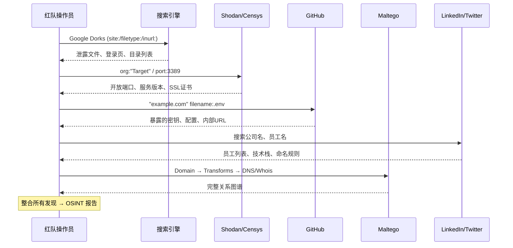

## 目录

- [[#一、什么是 OSINT|一、什么是 OSINT]]
- [[#二、搜索引擎 Dorking 进阶|二、搜索引擎 Dorking 进阶]]
 - [[#2.1 Google Dorks 基础|2.1 Google Dorks 基础]]
 - [[#2.2 高级 Google Dorking 技巧|2.2 高级 Google Dorking 技巧]]
 - [[#2.3 Shodan 搜索语法|2.3 Shodan 搜索语法]]
 - [[#2.4 Censys 搜索|2.4 Censys 搜索]]
- [[#三、Maltego 社区版 — 关系图谱分析|三、Maltego 社区版 — 关系图谱分析]]
- [[#四、社交媒体侦察|四、社交媒体侦察]]
 - [[#4.1 LinkedIn 人员信息收集|4.1 LinkedIn 人员信息收集]]
 - [[#4.2 Twitter 侦察|4.2 Twitter 侦察]]
 - [[#4.3 GitHub 代码泄露侦察|4.3 GitHub 代码泄露侦察]]
- [[#五、综合 OSINT 工具链|五、综合 OSINT 工具链]]
- [[#六、完整 OSINT 实践流程|六、完整 OSINT 实践流程]]
- [[#七、OSINT 的伦理与法律考量|七、OSINT 的伦理与法律考量]]
- [[#八、自动化 OSINT 脚本|八、自动化 OSINT 脚本]]



## 一、什么是 OSINT

OSINT (Open Source Intelligence) — 开源情报，指从公开可获取的信息来源收集情报的技术。在红队行动中，OSINT 通常是最初阶段的工作，目的是尽可能多地了解目标组织的信息，同时不直接接触目标系统。

> 相关模块: [[01-高级子域名与资产发现|子域名发现]] | [[02-高级DNS侦察技术|DNS 侦察]] | [[../archstrike-base教学/02-信息收集与侦察技术|信息收集基础]]

OSINT 信息分类:

| 类别 | 示例来源 | 典型发现 |
|---|---|---|
| 技术资产 | Shodan, Censys, crt.sh | IP、端口、SSL 证书、子域名 |
| 搜索引擎 | Google Dorks, Bing | 泄露文件、配置、目录列表 |
| 代码仓库 | GitHub, GitLab | 密钥、密码、配置文件 |
| 社交媒体 | LinkedIn, Twitter/X, Reddit | 员工信息、技术栈、内部抱怨 |
| 关系图谱 | Maltego | 域名-Whois-人员关联关系 |
| 域名注册 | WHOIS, SecurityTrails | 注册人、邮箱、关联域名 |

## 二、搜索引擎 Dorking 进阶

### 2.1 Google Dorks 基础

Google Hacking Database (GHDB) 在线资源: https://www.exploit-db.com/google-hacking-database

**查找子域名:**

```
site:example.com -www
```

**查找特定文件类型:**

```
site:example.com filetype:pdf
site:example.com filetype:doc OR filetype:docx
site:example.com filetype:xls OR filetype:xlsx
site:example.com filetype:sql # 数据库备份泄露
site:example.com filetype:bak
site:example.com filetype:log
site:example.com filetype:env # 可能包含凭证
```

**查找目录列表:**

```
site:example.com intitle:"Index of"
site:example.com intitle:"Index of /admin"
```

**查找登录页面:**

```
site:example.com inurl:login
site:example.com inurl:admin
site:example.com intitle:"Login"
```

**查找配置文件:**

```
site:example.com inurl:config.php
site:example.com inurl:wp-config.php.bak
site:example.com intitle:"phpinfo()"
site:example.com ext:conf OR ext:cfg OR ext:ini
```

**查找错误信息与敏感信息:**

```
site:example.com "SQL syntax" OR "mysql_fetch"
site:example.com "Warning: include("
site:example.com "Fatal error"
site:example.com intext:"password" filetype:txt
site:example.com intext:"confidential" OR intext:"internal only"
```

### 2.2 高级 Google Dorking 技巧

组合多个操作符:

```
site:example.com (inurl:dev OR inurl:staging OR inurl:test) -inurl:www
```

排除特定结果:

```
site:example.com -inurl:www -inurl:blog -inurl:support
```

其他搜索引擎 Dorking:

| 引擎 | 语法 | 示例 |
|---|---|---|
| Bing | `ip:` | `ip:1.2.3.4` — 查找同 IP 的其他域名 |
| DuckDuckGo | `site:` | `site:example.com "password"` — 较少爬取限制 |

### 2.3 Shodan 搜索语法

Shodan 专门索引联网设备的 banner 信息。安装 Shodan CLI:

```bash
sudo pacman -S python-shodan
shodan init YOUR_API_KEY
```

Shodan 核心搜索语法:

| 搜索 | 语法 |
|---|---|
| 查找特定组织 | `org:"Example Corp"` |
| 查找特定产品 | `product:Apache`, `product:nginx` |
| 查找特定端口 | `port:22`, `port:3389`, `port:445` |
| 查找国家/城市 | `country:CN`, `city:"San Francisco"` |
| HTTP 标题 | `http.title:"Login"` |
| 设备类型 | `category:ics`, `has_screenshot:true` |
| 开放数据库 | `port:27017` (MongoDB), `port:6379` (Redis), `port:3306` (MySQL) |
| 按漏洞搜索 | `vuln:CVE-2021-44228`, `vuln:CVE-2019-0708` |
| SSL 子域名 | `ssl:"*.example.com"` |

组合搜索示例:

```
org:"Example Corp" port:3389
country:CN product:Apache http.title:"Test Page"
city:"Shanghai" port:22
```

命令行搜索:

```bash
shodan search "org:'Example Corp'"
shodan search "product:nginx country:CN" --fields ip_str,port,org
shodan host 1.2.3.4
```

### 2.4 Censys 搜索

在 Firefox 中访问 https://search.censys.io

Censys 搜索语法:

```
# 查找目标域名的 SSL 证书
certificates.query: "example.com"

# 查找同组织的主机
hosts.query: "autonomous_system.organization: 'Example Corp'"

# 查找运行特定服务的主机
hosts.query: "services.service_name: HTTP"

# 查找特定端口的服务
hosts.query: "services.port: 3389"

# 组合搜索
hosts.query: "services.service_name: HTTP AND location.country: 'China'"
```

| 特性 | Shodan | Censys |
|---|---|---|
| 数据刷新 | 较频繁 | 较慢（但有历史） |
| SSL 证书搜索 | 基本支持 | 强大 |
| 免费额度 | 有限 | 较宽松 |
| 数据处理能力 | 强大 | 适合统计分析 |

## 三、Maltego 社区版 — 关系图谱分析

Maltego 是一个强大的情报分析和数据挖掘工具，通过图形化界面展示实体（Entity）之间的关系。

### 3.1 安装与配置

```bash
sudo pacman -S maltego
maltego
```

首次启动需要注册 Paterva 账户并选择社区版 (CE) 许可证。

### 3.2 基本概念

| 概念 | 说明 |
|---|---|
| Entity (实体) | Domain, DNS Name, IP Address, Person, Email, URL, Phone Number |
| Transform (变换) | 从一个实体获取关联的其他实体 |
| Graph (图谱) | 所有实体和关系的可视化展示 |

### 3.3 常用 Transforms

| Transform | 功能 |
|---|---|
| To DNS Name [DNS] | 发现子域名 |
| To IP Address [DNS] | 解析 IP 地址 |
| To Domain [From whois] | 通过 Whois 发现关联域名 |
| To Email [From whois] | 获取注册人邮箱 |
| To DNS Name [Search engine] | 用搜索引擎发现子域名 |
| To DNS Name [SPF Record] | 从 SPF 记录提取 IP |
| To Technical Information [Shodan] | Shodan 信息 |

### 3.4 实战操作流程

1. 新建 Graph → 拖入 Domain 实体 `example.com`
2. 右键 → All Transforms → "To DNS Name [DNS]"
3. 对发现的子域名运行 "To IP Address [DNS]"
4. 对 IP 运行 "To Location"
5. 对 IP 运行 "To DNS Name [Reverse DNS]"
6. 对域名运行 "To Domain [From whois]"
7. 运行 "To Email [From whois]"
8. 对邮箱运行 "To Person"

完成后你将看到完整的关系网，展示域名 → 子域名 → IP 的层次关系、不同域名之间的 Whois 关联以及管理员邮箱。

### 3.5 canari 集成

canari 是 Maltego Transforms 的 Python 开发框架:

```bash
sudo pacman -S canari python-canari
canari create-package mytransforms
```

## 四、社交媒体侦察

### 4.1 LinkedIn 人员信息收集

在 Firefox 无痕模式下访问 https://linkedin.com，搜索目标公司名 → "People" 标签。

LinkedIn 可获取的关键信息:
- 员工真实姓名 → 推测用户名格式
- 技术栈 → "我在使用 AWS/Docker/Kubernetes"
- 项目经验 → 了解使用的产品和架构
- 技能认证 → 推断的安全防护水平

### 4.2 Twitter 侦察

在 Firefox 中访问 https://x.com，搜索目标公司名和官方账号。

搜索语法:

| 语法 | 说明 |
|---|---|
| `from:@用户名` | 查看某人的推文 |
| `near:"城市"` | 指定地点 |
| `since:2023-01-01` | 指定时间 |
| `to:@用户名` | 发送给某人的推文 |
| `filter:links` | 仅含链接的推文 |

关键发现: 员工抱怨内部技术问题、发布截图意外暴露内部信息、技术讨论暴露工具链。

### 4.3 GitHub 代码泄露侦察

在 Firefox 中访问 https://github.com 使用搜索语法:

```
# 搜索目标组织的代码
org:ExampleCorp

# 搜索暴露的密码/密钥
"Example Corp" password OR secret OR key OR token
"Example Corp" api_key OR apikey
"Example Corp" BEGIN RSA PRIVATE KEY

# 搜索配置文件
"example.com" filename:.env
"example.com" filename:config.php
"example.com" filename:wp-config.php
"example.com" filename:settings.py

# 搜索数据库连接字符串
"example.com" "connection string" OR "jdbc:" OR "mongodb://"

# 搜索 AWS 凭证
"example.com" "AKIA" OR "ASIA"

# 搜索内部 URL
"example.com" "internal" OR "admin" OR "staging"
```

代码泄露搜索工具:

```bash
sudo pacman -S trufflehog
trufflehog git https://github.com/target/repo.git
```

其他平台: Reddit (`site:reddit.com "company name"`)、Pastebin（搜索域名/公司名）。

## 五、综合 OSINT 工具链

theHarvester（进阶用法）:

```bash
theHarvester -d example.com -b google,linkedin,twitter,yahoo,bing -l 500 -f harvester.html
```

recon-ng（模块化工作流）:

```bash
recon-ng
marketplace install discovery/info_disclosure/interesting_files
marketplace install recon/domains-hosts/bing_domain_web
workspaces create example
add domains example.com
run
```

SSL 证书分析:

```bash
curl -s "https://crt.sh/?q=%25.example.com&output=json" | jq -r '.[].name_value' | sort -u
```

## 六、完整 OSINT 实践流程

目标: "Example Corp" (example.com)

**Phase 1: 组织信息收集:**
```bash
whois example.com | tee whois_info.txt
# 记录: 注册人、邮箱、电话、注册商
```

在 Firefox 中:
- 访问目标官网，查看 /about, /careers, /contact, /team 页面
- 访问 https://crunchbase.com 搜索目标
- 访问 https://linkedin.com/company/ 搜索目标

**Phase 2: 技术资产发现:**
```bash
amass enum -passive -d example.com -o amass_output.txt
subfinder -d example.com -silent -o subfinder_output.txt
assetfinder example.com | tee assetfinder_output.txt
cat *_output.txt | sort -u > all_subs.txt
cat all_subs.txt | httpx -silent -status-code -title -tech-detect -o live.txt
```

在 Firefox 中:
- Shodan: `org:"Example Corp"`, `hostname:example.com`, `ssl:"*.example.com"`
- Censys: `hosts.query: "services.tls.certificates.leaf_data.subject.common_name: *.example.com"`
- crt.sh: `https://crt.sh/?q=%.example.com`

**Phase 3: 代码和信息泄露搜索:**

在 Firefox 无痕模式中依次搜索:
```
site:example.com filetype:pdf
site:example.com filetype:sql
site:example.com filetype:env
site:example.com intitle:"Index of"
site:example.com inurl:backup
site:example.com "password" OR "secret"
```

在 GitHub 搜索:
```
"example.com" NOT .md
"Example Corp" password
"example.com" filename:.env
```

**Phase 4: 社交媒体与人员收集:**

在 Firefox 中:
- LinkedIn: 搜索公司 → 浏览 IT/DevOps/Security 员工
- Twitter/X: 搜索公司名和官方账号
- 根据收集的姓名推断邮箱格式（firstname.lastname@ / firstname@ / f.lastname@）

**Phase 5: Maltego 整合:**

- 添加 Domain 实体 → 运行 DNS/Whois Transforms
- 添加邮箱实体 → 运行 To Person
- 运行 Shodan Transform 获取端口信息
- 导出图谱为 PDF (File → Export as → PDF)

**Phase 6: 报告整合:**

```
~/osint_ExampleCorp/
 01_organization/ (组织信息 — whois, linkedin, crunchbase)
 02_technical/ (技术资产 — 子域名, 活跃服务, shodan/censys)
 03_leaks/ (泄露信息 — github, google dorks)
 04_social_media/ (社交媒体 — linkedin员工, twitter发现)
 05_report/ (最终报告 + maltego_graph.pdf)
```

## 七、OSINT 的伦理与法律考量

| 原则 | 说明 |
|---|---|
| 合法性 | 仅收集公开可获取的信息，不绕过任何访问控制 |
| 隐私保护 | 尊重个人隐私，不滥用收集到的个人信息 |
| 数据存储 | 安全存储收集的数据，按期删除不再需要的数据 |
| 测试授权 | 仅对明确授权的目标进行 OSINT |

## 八、自动化 OSINT 脚本

```bash
#!/bin/bash
# osint_gather.sh - 自动化 OSINT 收集脚本
TARGET=$1
DOMAIN=$2

if [ -z "$TARGET" ] || [ -z "$DOMAIN" ]; then
 echo "用法: ./osint_gather.sh 'Company Name' example.com"
 exit 1
fi

DIR="osint_$(echo $DOMAIN | tr '.' '_')"
mkdir -p $DIR && cd $DIR

echo "[Phase 1] WHOIS 查询..."
whois $DOMAIN > whois.txt 2>/dev/null

echo "[Phase 2] 子域名枚举..."
subfinder -d $DOMAIN -silent -o subdomains.txt 2>/dev/null &
assetfinder $DOMAIN > assetfinder.txt 2>/dev/null &
amass enum -passive -d $DOMAIN -o amass_passive.txt 2>/dev/null &
wait

echo "[Phase 3] 合并子域名..."
cat subdomains.txt assetfinder.txt amass_passive.txt | sort -u > all_subs.txt

echo "[Phase 4] HTTPS 验证..."
httpx -l all_subs.txt -silent -status-code -title -tech-detect -o live.txt 2>/dev/null

echo "[Phase 5] SSL 证书子域名..."
curl -s "https://crt.sh/?q=%25.$DOMAIN&output=json" | jq -r '.[].name_value' 2>/dev/null | sort -u > crtsh.txt

echo "[Phase 6] Google Dorking URL 生成..."
echo "https://www.google.com/search?q=site:$DOMAIN+filetype:pdf" > google_dorks.txt
echo "https://www.google.com/search?q=site:$DOMAIN+inurl:admin" >> google_dorks.txt
echo "https://www.google.com/search?q=site:$DOMAIN+intitle:\"Index of\"" >> google_dorks.txt

echo "[Phase 7] theHarvester..."
theHarvester -d $DOMAIN -b google,linkedin -l 200 -f harvester.html 2>/dev/null

echo "[*] 自动化 OSINT 完成！"
echo "[*] 请在 Firefox 中手动执行以下搜索:"
echo " - Shodan: org:'$TARGET'"
echo " - GitHub: '$DOMAIN' filename:.env"
echo " - LinkedIn: 搜索公司 '$TARGET'"
```

OSINT 是红队行动的起点，也是信息最密集的阶段。一个优秀的红队队员应该在未接触目标系统之前，就能通过公开信息构建出目标的完整画像。关键在于耐心和系统化的方法：从组织信息到技术资产，从代码泄露到社交媒体，逐步拼接出一个完整的攻击面图谱。

[[../总目录与快速查询|← 返回总目录]]
