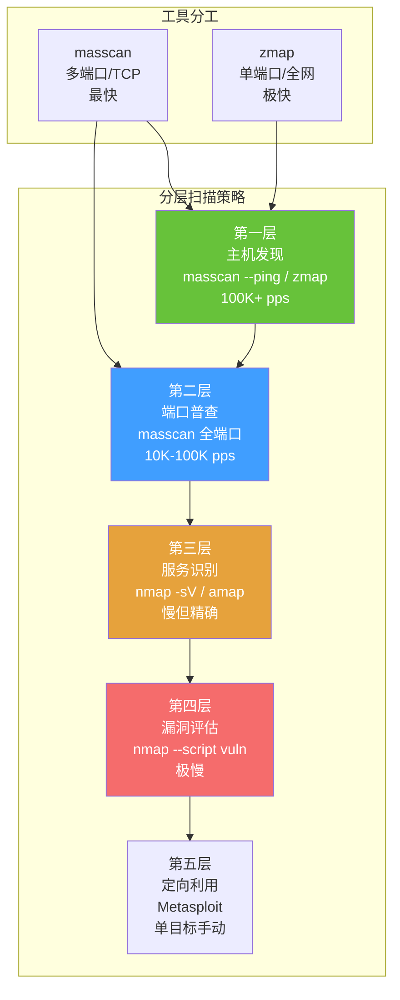

## 目录

- [[#一、高速扫描核心概念|一、高速扫描核心概念]]
- [[#二、masscan 深度解析|二、masscan 深度解析]]
 - [[#2.1 安装与基本扫描|2.1 安装与基本扫描]]
 - [[#2.2 核心参数详解|2.2 核心参数详解]]
 - [[#2.3 输出格式|2.3 输出格式]]
 - [[#2.4 高级功能|2.4 高级功能]]
- [[#三、zmap 深度解析|三、zmap 深度解析]]
 - [[#3.1 安装与基本使用|3.1 安装与基本使用]]
 - [[#3.2 核心参数与输出后处理|3.2 核心参数与输出后处理]]
- [[#四、扫描策略设计|四、扫描策略设计]]
 - [[#4.1 分层扫描策略|4.1 分层扫描策略]]
 - [[#4.2 OPSEC 考量|4.2 OPSEC 考量]]
- [[#五、实践演练 — masscan vs nmap 速度对比|五、实践演练 — masscan vs nmap 速度对比]]
- [[#六、最佳实践总结|六、最佳实践总结]]



## 一、高速扫描核心概念

传统扫描器（如 nmap）使用有状态扫描：对每个目标维护连接状态表，等待每个端口的响应，逐个完成。这种方式准确但慢。

> 相关模块: [[02-服务识别与Banner抓取|服务识别与 Banner 抓取]] | [[../archstrike-base教学/03-网络扫描与枚举技术|网络扫描基础]]

高速扫描器（masscan/zmap）使用无状态扫描:
- 不维护连接状态
- 异步发送 SYN 包（类似 Syn Flood 攻击方式）
- 不等待响应，通过自定义 TCP/IP 协议栈直接从网卡抓取 SYN-ACK
- 速度取决于带宽和网卡性能，而非延迟

速度对比（理论值）:

| 工具 | 发包速率 |
|---|---|
| nmap -T4 | ~1,000 pps |
| nmap -T5 | ~5,000 pps |
| masscan | ~10,000,000 pps (10Mpps) |
| zmap (1Gbps) | ~1,400,000 pps |
| zmap (10Gbps) | ~14,000,000 pps |

masscan 在千兆网络上可以达到 nmap 的 100-1000 倍速度。

## 二、masscan 深度解析

### 2.1 安装与基本扫描

```bash
sudo pacman -S masscan
masscan --version

# 最简单的扫描（必须使用 sudo 发送原始数据包）
sudo masscan -p80 192.168.1.0/24 --rate=1000
```

输出示例:
```
Starting masscan 1.3.2
Scanning 256 hosts, 1 ports at 1000.00 packets/sec
Discovered open port 80/tcp on 192.168.1.1
Discovered open port 80/tcp on 192.168.1.15
```

### 2.2 核心参数详解

**【-p / --ports】端口指定:**

```bash
masscan -p80 10.0.0.0/8 # 单端口
masscan -p22,80,443 10.0.0.0/8 # 多端口
masscan -p1-1000 192.168.1.0/24 # 端口范围
masscan -p80,443,8000-9000 10.0.0.0/8 # 混合
masscan -p1-65535 192.168.1.0/24 # 全端口
masscan -pU:161 192.168.1.0/24 # UDP 端口 (U:前缀)
masscan -pU:53,161,T:80,443 10.0.0.0/8 # TCP 和 UDP 混合
```

**【--rate】发包速率:**

| 速率 | 场景 | 说明 |
|---|---|---|
| `--rate=100` | 隐蔽扫描 | 不易触发 IDS/IPS |
| `--rate=1000` | 普通内网 | 安全可靠 |
| `--rate=10000` | 高速扫描 | 可能丢包 |
| `--rate=100000` | 极限 | 必定被检测 |
| `--rate=1000000` | 需要 PF_RING | 千兆网上限 ~2Mpps |

计算公式: 最大理论速率 (Mpps) = 带宽 (bps) / (包大小 (bytes) * 8)

**【--adapter / -e】指定网卡:**

```bash
masscan -p80 192.168.1.0/24 --rate=10000 --adapter eth0
masscan --adapter eth0 --echo # 查看配置
```

**【--source-ip / --source-port】指定源:**

```bash
masscan -p80 192.168.1.0/24 --rate=10000 --source-ip 192.168.100.1
masscan -p80 192.168.1.0/24 --rate=10000 --source-port 53 # 伪装源端口为 DNS
```

**【--range / -iL】从文件读取目标:**

```bash
masscan -p80 -iL targets.txt --rate=10000
```

targets.txt 支持格式:
```
192.168.1.1
192.168.1.0/24
10.0.0.1-10.0.255.254
exclude 172.16.4.200
exclude 192.168.1.100-192.168.1.200
```

**【--banners】获取服务 banner:**

```bash
masscan -p80,443,22 192.168.1.0/24 --rate=5000 --banners
```

注意: `--banners` 会显著降低扫描速度，建议先快速扫描，再对开放端口用 nmap 做 banner 抓取。

**【--wait / --retries】等待与重试:**

```bash
masscan -p80 192.168.1.0/24 --rate=10000 --wait=5 # 默认 10 秒
masscan -p80 192.168.1.0/24 --rate=10000 --retries=2 # 重试 2 次，有效速率减半
```

### 2.3 输出格式

| 格式 | 参数 | 适用场景 |
|---|---|---|
| List（最易读） | `-oL output.txt` | 人类阅读 |
| JSON（最佳可编程性） | `-oJ output.json` | 自动化处理 |
| Grepable | `-oG output.gnmap` | 兼容 nmap grepable |
| XML | `-oX output.xml` | 导入 Nessus/Faraday |
| Binary（极高速） | `-oB output.bin` | 吞吐优先 |

JSON 后处理示例（使用 jq）:

```bash
# 提取所有开放 80 端口的 IP
jq -r '.[] | select(.ports[0].port == 80) | .ip' output.json

# 统计开放端口数量
jq '[.[].ports[0].port] | group_by(.) | .[] | {port: .[0], count: length}' output.json

# 二进制转文本
masscan --readscan output.bin > output.txt
```

### 2.4 高级功能

**【--ping】仅做主机发现:**

```bash
masscan --ping 10.0.0.0/24 --rate=10000
```

**【将 masscan 结果传给 nmap 做详细扫描:**

```bash
# 方法 1: 通过管道
masscan -p80,443,22 192.168.1.0/24 --rate=10000 -oJ - | \
 jq -r '.[] | .ip' | sort -u | \
 xargs -I {} nmap -sV -p80,443,22 {}

# 方法 2: 先保存结果再处理
masscan -p80,443,22,3389,8080 10.0.0.0/24 --rate=10000 -oL open_ports.txt
awk '{print $4}' open_ports.txt | sort -u > alive_hosts.txt
nmap -iL alive_hosts.txt -sV -p80,443,22,3389,8080 -oA nmap_detailed
```

**【--shard】分片扫描（多台机器分工）:**

```bash
# 机器 1-4 分别扫描
masscan -p443 0.0.0.0/0 --rate=100000 --shard 1/4 -oJ shard1.json
masscan -p443 0.0.0.0/0 --rate=100000 --shard 2/4 -oJ shard2.json
masscan -p443 0.0.0.0/0 --rate=100000 --shard 3/4 -oJ shard3.json
masscan -p443 0.0.0.0/0 --rate=100000 --shard 4/4 -oJ shard4.json

# 合并结果
jq -s 'add' shard1.json shard2.json shard3.json shard4.json > all_results.json
```

**【--resume】断点续扫:**

```bash
# 扫描中断后，从 paused.conf 继续
masscan --resume paused.conf
```

**【--router-ip / --router-mac】跨网段扫描:**

```bash
masscan -p80 10.10.0.0/16 --rate=10000 \
 --router-ip 10.10.0.1 --router-mac 00:11:22:33:44:55
```

## 三、zmap 深度解析

zmap 由密歇根大学开发，专为互联网级全网扫描设计。zmap 只做单端口扫描但速度非常快。

### 3.1 安装与基本使用

```bash
sudo pacman -S zmap
zmap --version

# 扫描单个端口全网
sudo zmap -p 443 -o results.csv

# 扫描指定网段
sudo zmap -p 80 192.168.1.0/24 -o results.csv

# 扫描多个端口（需要多次运行）
for port in 22 80 443 3389 8080; do
 sudo zmap -p $port 192.168.1.0/24 -o zmap_port_$port.csv
done
```

### 3.2 核心参数与输出后处理

**【-B / --bandwidth】带宽限制:**

```bash
zmap -p 443 -B 1M -o results.csv # 1Mbps（非常慢）
zmap -p 443 -B 10M -o results.csv # 10Mbps（隐蔽）
zmap -p 443 -B 100M -o results.csv # 100Mbps（中等）
zmap -p 443 -B 1G -o results.csv # 1Gbps（快速）
zmap -p 443 -B 10G -o results.csv # 10Gbps（需要 10G 网卡）
```

| 参数 | 说明 |
|---|---|
| `-r <n>` | 发包速率 |
| `-f "saddr,sport"` | 输出字段控制 |
| `-M tcp_synscan` | TCP SYN 扫描 |
| `-M udp` | UDP 扫描 |
| `-M icmp_echoscan` | ICMP Echo 扫描 |
| `-b /etc/zmap/blacklist.conf` | 黑名单（排除私有 IP 等） |
| `-w targets.txt` | 白名单（仅扫描指定 IP） |
| `-O csv / -O json` | 输出格式 |

输出后处理:

```bash
# 提取所有响应 IP
awk -F',' 'NR>1 {print $1}' results.csv > ips.txt

# 提取并排序去重
awk -F',' 'NR>1 {print $1}' results.csv | sort -u > unique_ips.txt

# 分类统计
zmap -p 443 -f "saddr,classification" 192.168.1.0/24 | \
 awk -F',' '{print $2}' | sort | uniq -c

# 与 masscan 对接
zmap -p 80 -f "saddr" 10.0.0.0/8 > http_hosts.txt
masscan -p80,443,8080 -iL http_hosts.txt --rate=10000 -oJ masscan_detailed.json
```

## 四、扫描策略设计

### 4.1 分层扫描策略

| 层级 | 任务 | 工具 | 速率 | 时间 |
|---|---|---|---|---|
| 第一层 | 主机发现 | masscan --ping / zmap | 100K+ pps | 秒~分钟 |
| 第二层 | 端口普查 | masscan 全端口 (1-65535) | 10K-100K pps | 分钟~小时 |
| 第三层 | 服务识别 | nmap -sV / amap | 低 | 小时~天 |
| 第四层 | 漏洞评估 | nmap --script vuln | 极低 | 天级 |
| 第五层 | 定向利用 | metasploit | 手动 | 不定 |

### 4.2 OPSEC 考量

大规模扫描容易被检测的特征:

| 特征 | 缓解措施 |
|---|---|
| SYN 包速率异常 | 降低速率 (`--rate=100`)，分散扫描时间 |
| 端口扫描模式 | 随机端口顺序（masscan 默认随机），加长扫描间隔 |
| 源地址一致性 | 使用多台跳板机或多 IP 源地址 |
| 时间特征 | 凌晨 3-5 点扫描相对安全 |
| 流量模式 | 混合正常流量，或隧道内探测 |

规避扫描检测的技术:

```bash
# 方案 1: 极低速隐蔽扫描
sudo masscan -p22,80,443,3389 10.0.0.0/24 --rate=10 --wait=60

# 方案 2: 分散扫描（cron 定时执行，每天凌晨 3 点）
# 0 3 * * * sudo masscan -p80 10.0.1.0/24 --rate=1000 -oJ /tmp/daily_scan.json

# 方案 3: 隧道内扫描（nmap 支持 proxychains）
proxychains nmap -sT -p80,443,3389 10.0.0.0/24
```

## 五、实践演练 — masscan vs nmap 速度对比

```bash
# Step 1: 使用 nmap 扫描（基准）
echo "开始 nmap 扫描 @ $(date)"
time sudo nmap -sS -p80,443 192.168.1.0/24 -T4 -oN nmap_scan.txt

# Step 2: 使用 masscan 扫描（默认速率）
time sudo masscan -p80,443 192.168.1.0/24 --rate=1000 -oL masscan_1k.txt

# Step 3: 使用 masscan 扫描（高速率）
time sudo masscan -p80,443 192.168.1.0/24 --rate=10000 -oL masscan_10k.txt

# Step 4: 使用 masscan 扫描（极限速率）
time sudo masscan -p80,443 192.168.1.0/24 --rate=100000 -oL masscan_100k.txt
```

预期结果（256 个 IP × 2 端口）:

| 工具 | 预计耗时 |
|---|---|
| nmap -T4 | 30-60 秒 |
| masscan 1K pps | 1-2 秒 |
| masscan 10K pps | 0.1-0.2 秒 |
| masscan 100K pps | 0.01-0.02 秒 |

准确性对比:

```bash
# 提取 namp 和 masscan 结果
grep "open" nmap_scan.txt | awk '{print $2}' | sort -u > nmap_results.txt
awk '{print $4}' masscan_1k.txt | sort -u > masscan_1k_results.txt
awk '{print $4}' masscan_100k.txt | sort -u > masscan_100k_results.txt

# 对比差异
echo "--- nmap 独有的发现 ---"
comm -23 nmap_results.txt masscan_1k_results.txt

echo "--- masscan 独有的发现 ---"
comm -13 nmap_results.txt masscan_1k_results.txt
```

## 六、最佳实践总结

| 场景 | 推荐方案 |
|---|---|
| 第一次接触目标网络 | `masscan --ping` 快速定位存活主机 |
| 找到存活主机 | masscan 扫描常用端口 (22,80,443,445,3389,8080) |
| 需要详细端口信息 | masscan 全端口 1-65535（只在重点目标上） |
| 需要 banner/版本 | `nmap -sV -sC`（在 masscan 发现的端口上） |
| 需要漏洞检测 | `nmap --script vuln` |
| 大规模网段 | zmap 单端口全网扫描，masscan 多端口 |
| 隐蔽需求 | `--rate=100` 以下，分散在不同时间执行 |

masscan 使用异步无状态 SYN 扫描，比 nmap 快 100-1000 倍。速率控制 (`--rate`) 是最重要的参数，影响速度和隐蔽性。高速扫描必定丢包，用 `--retries` 和降低 `--rate` 来平衡速度与准确度。masscan 的 JSON 输出最适合自动化处理和分析。大规模扫描应设计扫描策略，避免触发 IDS/WAF。始终先用实验网络验证扫描效果，再用于生产环境。

[[../总目录与快速查询|← 返回总目录]]
