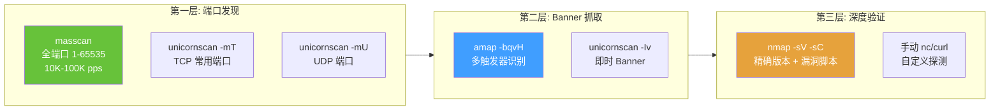

## 目录

- [[#一、服务识别的核心价值|一、服务识别的核心价值]]
- [[#二、amap — 应用映射与 Banner 抓取|二、amap — 应用映射与 Banner 抓取]]
 - [[#2.1 安装与基本使用|2.1 安装与基本使用]]
 - [[#2.2 批量扫描|2.2 批量扫描]]
 - [[#2.3 高级触发模式|2.3 高级触发模式]]
 - [[#2.4 指纹数据库与加速|2.4 指纹数据库与加速]]
- [[#三、unicornscan — TCP/UDP 高速探测|三、unicornscan — TCP/UDP 高速探测]]
 - [[#3.1 安装与 TCP 扫描|3.1 安装与 TCP 扫描]]
 - [[#3.2 UDP 扫描|3.2 UDP 扫描]]
 - [[#3.3 Banner 抓取与高级参数|3.3 Banner 抓取与高级参数]]
- [[#四、分层服务识别策略|四、分层服务识别策略]]
- [[#五、识别非标准服务的技巧|五、识别非标准服务的技巧]]
- [[#六、实践演练 — 完整服务识别|六、实践演练 — 完整服务识别]]
- [[#七、高级 Banner 抓取与欺骗检测|七、高级 Banner 抓取与欺骗检测]]



## 一、服务识别的核心价值

端口扫描告诉你"哪个端口是开放的"，但无法告诉你"上面运行着什么服务"。在渗透测试中，服务识别是决定攻击路径的关键步骤。

> 相关模块: [[01-高速大规模扫描技术|高速扫描]] | [[../archstrike-base教学/03-网络扫描与枚举技术|网络扫描基础]]

传统思维: 端口号 = 服务类型（22=SSH, 80=HTTP, 443=HTTPS）
实际场景: 管理员可能将 SSH 运行在 64221 端口，将 HTTP 运行在 8080 端口，将 RDP 运行在 33890 端口。——端口号不可信！

amap 的设计哲学: "不要假设端口决定服务。发送各种触发数据包（HTTP 请求、SSL 握手、SSH 握手等），分析响应来确定真正的服务。"

unicornscan 的定位: "更快的 nmap 替代品，专注于 UDP 扫描和高速 TCP Banner 抓取。在扫描大量 UDP 端口时比 nmap 快 100 倍以上。"

## 二、amap — 应用映射与 Banner 抓取

amap (Application MAPper) 是专业的服务识别工具。与 `nmap -sV` 不同，amap 采用更激进的服务指纹识别方式，发送更多类型的触发数据包。

### 2.1 安装与基本使用

```bash
sudo pacman -S amap
amap --version

# 对单个目标端口做服务识别
amap -bqv 192.168.1.100 80
```

| 参数 | 说明 |
|---|---|
| `-b` | 抓取 Banner（banner） |
| `-q` | 静默模式，不输出连接过程 |
| `-v` | 详细输出（与 `-b` 组合显示完整 banner） |

输出示例:
```
amap v5.4 started at 2024-06-15 09:00:00 - APPLICATION MAPPER

Protocol on 192.168.1.100:80/tcp matches http
Protocol on 192.168.1.100:80/tcp matches http-apache-2
Unrecognized response:
HTTP/1.1 200 OK
Date: Sat, 15 Jun 2024 09:00:00 GMT
Server: Apache/2.4.41 (Ubuntu)
```

识别结果解读:
- "matches http" → 服务识别为 HTTP
- "matches http-apache-2" → 精确识别为 Apache 2.x
- "Unrecognized response" → 捕获到的完整原始 banner 数据

### 2.2 批量扫描

```bash
# 扫描单个目标多个端口
amap -bqv 192.168.1.100 22 80 443 8080 3306 3389

# 从文件批量扫描
amap -bqv -i targets.txt 22 80 443 8080

# 扫描端口范围
amap -bqv 192.168.1.100 1-1000
amap -bqv 192.168.1.100 8000-9000
```

targets.txt 格式（每行一个 IP）:
```
192.168.1.1
192.168.1.2
192.168.1.100
```

### 2.3 高级触发模式

amap 通过发送多种触发数据包来识别服务。可以指定触发方式:

| 参数 | 触发方式 | 适用场景 |
|---|---|---|
| `-M` | 空连接（默认） | SMB, FTP, SSH 等自动发送 banner 的服务 |
| `-H` | HTTP GET 请求 | HTTP, HTTPS, Tomcat, Jetty |
| `-S` | SSL/TLS ClientHello | HTTPS, SMTPS, IMAPS, POP3S, RDP(SSL) |
| `-U` | UDP 探测包 | SNMP, DNS, NTP |
| `-N` | 发送空行 (\r\n) | 需要换行触发的协议 |

```bash
# 各种触发模式示例
amap -M 192.168.1.100 445 # SMB
amap -H 192.168.1.100 8080 # HTTP 服务
amap -S 192.168.1.100 443 # SSL 服务
amap -U 192.168.1.100 161 # SNMP
amap -N 192.168.1.100 21 # FTP

# 未知服务全面探测（组合多种触发器）
amap -bqvHM 192.168.1.100 9999
```

未知端口逐步探测流程:
1. 先用 `amap -bqvM` 空连接尝试
2. 如果没有识别，尝试 `amap -bqvH` HTTP 请求
3. 如果仍无结果，尝试 `amap -bqvS` SSL 握手
4. 如果还是无结果，使用自定义触发:
```bash
echo "SSH-2.0-OpenSSH_8.2" | nc 192.168.1.100 9999
echo "HELO test" | nc 192.168.1.100 9999
```

### 2.4 指纹数据库与加速

```bash
# 指纹数据库位置
/usr/share/amap/appdefs.trig

# 查看指纹库
head -50 /usr/share/amap/appdefs.trig

# 设置并发连接数和超时
amap -bqvH -c 10 -i targets.txt 80 443 8080
amap -bqvH -t 3 192.168.1.100 80 # 连接超时 3 秒

# 组合高速扫描
amap -bqv -c 20 -t 2 -i targets.txt 22 80 443 8080 8443 3389
```

| 参数 | 说明 |
|---|---|
| `-c 10` | 同时 10 个并发连接 |
| `-t 3` | 连接超时 3 秒（默认 5 秒） |

实战案例 — 识别内网 Web 服务器（非标准端口）:

```bash
# 先 masscan 发现开放端口
sudo masscan -p1-65535 192.168.1.100 --rate=10000 -oJ masscan_full.json

# 提取所有开放端口
jq -r '.[].ports[].port' masscan_full.json > open_ports.txt

# 用 amap 逐一识别
while read port; do
 echo "=== Checking port $port ==="
 amap -bqvH 192.168.1.100 "$port"
done < open_ports.txt
```

数据库服务识别:

```bash
amap -bqvM 192.168.1.100 3306 # MySQL
amap -bqvM 192.168.1.100 1433 # MSSQL
amap -bqvM 192.168.1.100 5432 # PostgreSQL
amap -bqvM 192.168.1.100 6379 # Redis
amap -bqvM 192.168.1.100 27017 # MongoDB
amap -bqvM 192.168.1.100 1521 # Oracle TNS
```

## 三、unicornscan — TCP/UDP 高速探测

unicornscan 是高速异步网络扫描器，特别适合 UDP 端口扫描和 Banner 抓取。

### 3.1 安装与 TCP 扫描

```bash
sudo pacman -S unicornscan
unicornscan --help

# TCP 全端口扫描
sudo unicornscan -mT 192.168.1.100:a

# 扫描指定端口范围
sudo unicornscan -mT 192.168.1.100:1-1024
sudo unicornscan -mT 192.168.1.100:80,443,8080

# 扫描一个网段
sudo unicornscan -mT 192.168.1.0/24:22,80,443
```

输出示例:
```
TCP open ssh[ 22] from 192.168.1.1 ttl 64
TCP open http[ 80] from 192.168.1.1 ttl 64
TCP open https[ 443] from 192.168.1.1 ttl 64
TCP open microsoft-ds[ 445] from 192.168.1.100 ttl 128
```

### 3.2 UDP 扫描

unicornscan 的 UDP 扫描比 nmap 快 100 倍以上，是最佳的 UDP 扫描方案。

```bash
# 全端口 UDP 扫描
sudo unicornscan -mU 192.168.1.100:a

# 扫描常用 UDP 端口
sudo unicornscan -mU 192.168.1.0/24:53,67,68,69,123,135,137,138,139,161,162,445,500,514,520,631,1434,1900,4500,5353
```

为什么 UDP 扫描通常很慢:
- UDP 是无连接协议，没有像 TCP SYN-ACK 那样的可靠反馈
- 大多数封闭 UDP 端口会返回 ICMP Port Unreachable
- 但很多防火墙会过滤 ICMP，导致 nmap 必须等待超时
- unicornscan 使用异步技术，并行发送大量 UDP 包，减少因等待超时造成的时间浪费

### 3.3 Banner 抓取与高级参数

```bash
# TCP Banner 抓取
sudo unicornscan -mT -Iv 192.168.1.100:a
# -I: 立即抓取 Banner, -v: 详细输出

# UDP Banner 抓取
sudo unicornscan -mU -Iv 192.168.1.100:53,161,123
```

输出示例（含 Banner）:
```
TCP open ssh[ 22] from 192.168.1.1 ttl 64
 banner: SSH-2.0-OpenSSH_8.2p1 Ubuntu-4ubuntu0.1
TCP open http[ 80] from 192.168.1.1 ttl 64
 banner: HTTP/1.1 200 OK\r\nServer: nginx/1.18.0 (Ubuntu)
```

| 参数 | 说明 |
|---|---|
| `-r 1000` | 每秒发包速率 |
| `-s 53` | 源端口设定（伪装为 DNS） |
| `-S 192.168.1.200` | 源 IP 设定 |
| `-T 1000` | 响应超时 1000ms |
| `-i eth0` | 指定网卡 |
| `-ttl 128` | 自定义 TTL |
| `-o output.txt` | 输出到文件 |
| `-n` | 不进行 DNS 解析（更快） |

## 四、分层服务识别策略

在真实红队行动中，最优策略是分层进行:

**第一层：快速端口发现**
```bash
# TCP 端口发现（masscan）
sudo masscan -p1-65535 192.168.1.0/24 --rate=50000 -oJ phase1_tcp.json

# UDP 端口发现（unicornscan）
sudo unicornscan -mU -r 10000 192.168.1.0/24:1-1000,1024-65535 -o phase1_udp.txt
```

**第二层：Banner 抓取与服务初筛**
```bash
# 批量 Banner 抓取（amap）
cat open_ports.txt | while read ip port; do
 amap -bqvH "$ip" "$port"
done > phase2_banners.txt

# 或使用 unicornscan
sudo unicornscan -mT -Iv -r 1000 192.168.1.0/24:22,80,443,8080,8443,3306,3389 -o phase2_banners.txt
```

**第三层：深度服务版本与漏洞探测**
```bash
nmap -sV -sC --script vuln -p 22,80,443,8080,3306,3389 192.168.1.100 -oA phase3_deep
```

## 五、识别非标准服务的技巧

| 技巧 | 方法 | 示例 |
|---|---|---|
| 对比已知端口 | 发送协议特征数据 | `echo "SSH-2.0-OpenSSH_8.2" \| nc 192.168.1.100 2222` |
| 触发应用层协议 | 发送应用层命令 | `echo "USER anonymous" \| nc 192.168.1.100 2121` (FTP) |
| TLS/SSL 检测 | openssl 探测 | `openssl s_client -connect 192.168.1.100:8443 -quiet` |
| 时间戳行为分析 | 观察响应延迟 | MySQL 主动发送握手包；PostgreSQL 等待客户端 |
| 协议格式分析 | hexdump 分析 | `amap -bqvM 192.168.1.100 9999 2>/dev/null \| xxd \| head` |

## 六、实践演练 — 完整服务识别

```bash
#!/bin/bash
# full_service_scan.sh — 完整的服务识别工作流

TARGET="192.168.1.100"
OUTDIR="scan_${TARGET}_$(date +%Y%m%d_%H%M%S)"
mkdir -p "$OUTDIR"

echo ">>> Phase 1: 全端口 TCP 发现 (masscan)"
sudo masscan -p1-65535 "$TARGET" --rate=10000 -oJ "$OUTDIR/p1_tcp_ports.json"
TCP_PORTS=$(jq -r '.[].ports[].port' "$OUTDIR/p1_tcp_ports.json" | sort -n | paste -sd, -)
echo "发现的 TCP 端口: $TCP_PORTS"

echo ">>> Phase 2: 常用 UDP 端口发现 (unicornscan)"
sudo unicornscan -mU -r 2000 "$TARGET":53,123,161,500,1900,4500,5353 -o "$OUTDIR/p2_udp_ports"

echo ">>> Phase 3: Banner 抓取 (amap)"
IFS=',' read -ra PORT_ARRAY <<< "$TCP_PORTS"
for port in "${PORT_ARRAY[@]}"; do
 echo " - 探测端口 $port ..."
 amap -bqvHM "$TARGET" "$port" >> "$OUTDIR/p3_banners" 2>&1
done

echo ">>> Phase 4: 服务版本精确探测 (nmap)"
nmap -sV -sC --script "default,safe" -p "$TCP_PORTS" "$TARGET" -oA "$OUTDIR/p4_nmap"

echo ">>> 扫描完成！详细结果保存在: $OUTDIR/"
```

## 七、高级 Banner 抓取与欺骗检测

### 7.1 手动 Banner 抓取

有些服务不响应标准 amap/nmap 触发，需要手动操作:

```bash
# SSH Banner
echo "" | nc target 22

# HTTP Headers
curl -I http://target:80/
curl -k -I https://target:443/

# FTP Banner
echo "USER anonymous" | nc target 21

# SMTP Banner
echo "EHLO test" | nc target 25

# Redis
echo "INFO" | nc target 6379

# VNC
nc target 5900 | head -1 # 输出: RFB 003.008
```

### 7.2 Banner 欺骗检测

有些管理员会修改 banner 来欺骗攻击者。检测方法:

| 方法 | 说明 |
|---|---|
| OS 指纹对比 | `nmap -O target` — 如果 banner 显示 nginx/Ubuntu 但 OS 检测为 Windows，可能伪造 |
| TCP/IP 栈指纹 | `nmap --script smb-os-discovery target` — NTLM negotiation 泄露真实 Windows 版本 |
| 行为分析 | 如果 banner 说 Apache 但支持的功能明显不是 Apache，可能是伪装 |
| 多端口交叉验证 | 同一主机上的不同服务 banner 中的 OS 信息应一致 |

### 7.3 批量 Banner 对比

```bash
# 收集所有 SSH banner
for host in $(cat alive_hosts.txt); do
 echo "=== $host ==="
 echo "" | nc -w 3 "$host" 22 2>/dev/null
done > all_ssh_banners.txt

# 分析版本分布
grep "SSH-" all_ssh_banners.txt | sort | uniq -c | sort -rn
```

这个分析可以:
- 识别标准的软件部署模式
- 发现版本过旧的服务（潜在漏洞）
- 发现异常版本（可能是蜜罐或伪装）

amap 是专业的非标准端口服务识别工具，不假设端口号对应服务。unicornscan 是 UDP 扫描的最佳选择，比 nmap 快 100 倍以上。分层扫描策略: masscan 发现端口 → amap/unicornscan 抓 banner → nmap 深度验证。对于未知服务，组合多种触发器（空连接、HTTP、SSL）进行穷举识别。Banner 可以伪装，交叉验证（OS 指纹、协议行为）是必要的。

[[../总目录与快速查询|← 返回总目录]]
