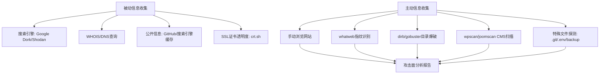
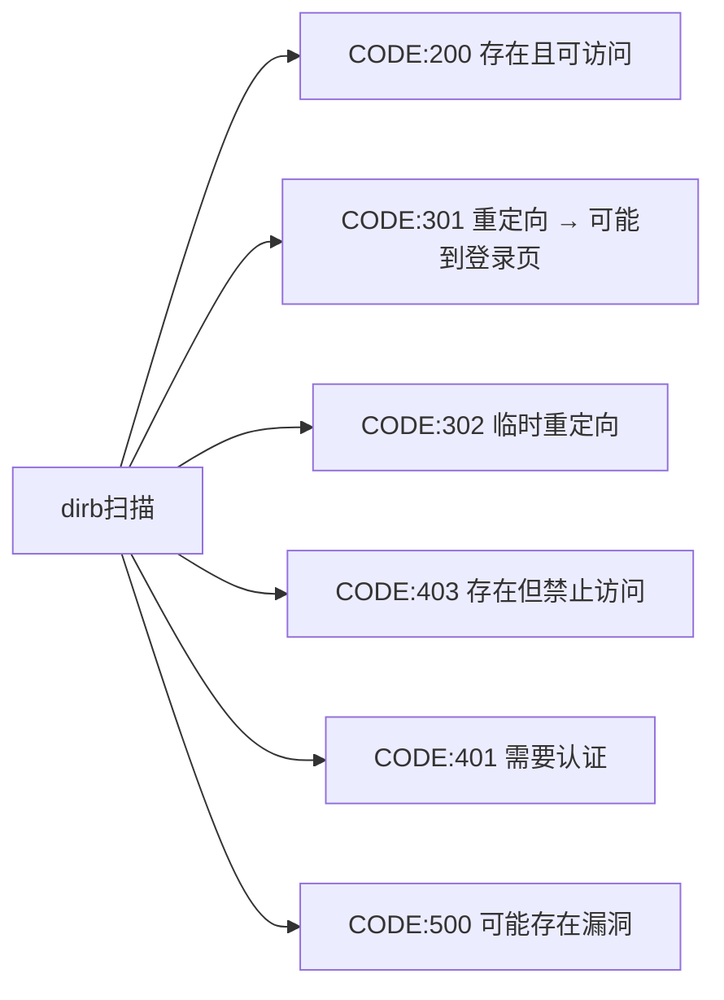
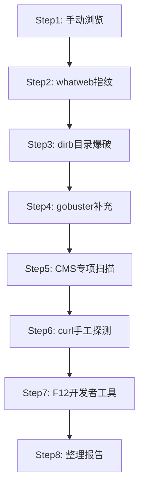

# 02-Web信息收集与侦察

## 目录
- [[#一、信息收集方法论|一、信息收集方法论]]
- [[#二、whatweb指纹识别|二、whatweb指纹识别]]
  - [[#2.1 工具介绍|2.1 工具介绍]]
  - [[#2.2 侵略性级别|2.2 侵略性级别]]
  - [[#2.3 实战命令详解|2.3 实战命令详解]]
- [[#三、wpscan深度扫描|三、wpscan深度扫描]]
  - [[#3.1 枚举用户|3.1 枚举用户]]
  - [[#3.2 枚举插件与主题|3.2 枚举插件与主题]]
  - [[#3.3 暴力破解与高级用法|3.3 暴力破解与高级用法]]
- [[#四、joomscan扫描|四、joomscan扫描]]
- [[#五、dirb目录爆破|五、dirb目录爆破]]
  - [[#5.1 基本命令与选项|5.1 基本命令与选项]]
  - [[#5.2 输出解读与字典技巧|5.2 输出解读与字典技巧]]
- [[#六、gobuster高速目录爆破|六、gobuster高速目录爆破]]
- [[#七、cms-explorer|七、cms-explorer]]
- [[#八、综合信息收集流程实战|八、综合信息收集流程实战]]
- [[#九、字典管理与自定义|九、字典管理与自定义]]
- [[#十、注意事项与最佳实践|十、注意事项与最佳实践]]

---

## 一、信息收集方法论

信息收集（Reconnaissance）是渗透测试第一个也是最重要的阶段。**一次成功的渗透往往80%的时间在信息收集，20%的时间在利用。** 参见 [[../网安基础知识/02-Web技术基础|Web技术基础]] 了解Web应用架构基础，以及 [[../前端基础/前端基础总目录|前端基础]] 了解前端技术栈识别。



**信息收集维度：**
1. 域名信息：子域名、IP地址、CDN/WAF
2. 技术指纹：Web服务器、CMS、框架、语言
3. 目录结构：隐藏目录、备份文件、配置文件
4. 公开信息：GitHub泄露、搜索引擎缓存、历史记录
5. 凭证泄露：公开的账号密码、API密钥
6. 人员信息：邮箱、社交账号（用于社会工程学）

> **安全提醒：** 仅在授权范围内进行信息收集；注意请求频率避免造成DoS；目录爆破可能触发WAF封禁；使用VPN/代理隐藏真实IP；记录所有收集到的信息便于后续分析。

---

## 二、whatweb指纹识别

### 2.1 工具介绍

whatweb是Web技术栈识别工具，拥有超过1800个插件用于指纹识别，能识别：
- **CMS：** WordPress, Joomla, Drupal, etc.
- **Web服务器：** Apache, Nginx, IIS, etc.
- **编程语言：** PHP, ASP.NET, Python, Ruby, etc.
- **JavaScript库：** jQuery, React, Angular, etc.
- **CDN/缓存：** Cloudflare, Varnish, etc.

### 2.2 侵略性级别

数字越大越深入：

```bash
# -a 1 Passive: 被动模式，仅分析默认响应
whatweb -a 1 http://example.com

# -a 2 Polite: 礼貌模式，发送一个额外请求
whatweb -a 2 http://example.com

# -a 3 Aggressive: 侵略性模式，推荐用于大多数渗透测试
whatweb -a 3 http://example.com

# -a 4 Heavy: 重模式，发出大量请求，可能触发WAF/IDS告警
whatweb -a 4 http://example.com
```

### 2.3 实战命令详解

```bash
# 基本扫描
whatweb http://testphp.vulnweb.com

# 详细输出模式
whatweb -v http://testphp.vulnweb.com

# 扫描多个目标
whatweb http://target1.com http://target2.com http://target3.com

# 从文件读取目标列表
whatweb -i targets.txt

# 指定输出格式
whatweb --log-json=result.json http://testphp.vulnweb.com
whatweb --log-xml=result.xml http://testphp.vulnweb.com
whatweb --log-brief=brief.txt http://testphp.vulnweb.com
whatweb --log-verbose=verbose.txt http://testphp.vulnweb.com

# 自定义User-Agent / 代理 / Cookie
whatweb --user-agent="Mozilla/5.0" http://example.com
whatweb --proxy http://127.0.0.1:8080 http://example.com
whatweb --cookie="PHPSESSID=abc123" http://example.com

# 限制URL重定向
whatweb --max-redirects=3 http://example.com

# 列出/搜索插件
whatweb --list-plugins
whatweb --list-plugins | grep -i wordpress
whatweb --list-plugins | grep -i joomla
```

**whatweb输出解读：**
- `HTTPServer[nginx/1.19.0]` → Web服务器类型和版本
- `X-Powered-By[PHP/7.4.3]` → 后端语言和版本
- `MetaGenerator[WordPress 5.8]` → CMS类型和版本
- `Cookies[PHPSESSID]` → 使用的会话机制
- `Script[jquery]` → 使用的JS库

---

## 三、wpscan深度扫描

WordPress占据全球约43%的网站，是渗透测试中最常见的CMS。wpscan是ArchStrike自带的WordPress专用安全扫描器（持续更新中，建议使用最新版）。

### 3.1 枚举用户

```bash
wpscan --url http://example.com --enumerate u
```

枚举用户的价值：用户列表可用于暴力破解；JSON API端点 `/wp-json/wp/v2/users` 也可能泄露用户；作者归档 `/?author=1` 重定向到用户页面。

### 3.2 枚举插件与主题

```bash
# 枚举插件
wpscan --url http://example.com --enumerate p

# 枚举主题
wpscan --url http://example.com --enumerate t

# 枚举漏洞（需API Token）
wpscan --url http://example.com --enumerate vp
```

已知漏洞的插件将被标记，可直接在Exploit-DB或WPScan Vulnerability Database查找利用代码。主题也可能包含漏洞，特别是自定义开发的低质量主题。

### 3.3 暴力破解与高级用法

```bash
# 暴力破解
wpscan --url http://example.com \
       --usernames admin \
       --passwords /usr/share/wordlists/rockyou.txt

# 完整扫描组合命令
wpscan --url http://example.com \
       --enumerate u,p,t,vp \
       --api-token YOUR_WPSCAN_API_TOKEN \
       --output wpscan_result.txt

# 随机User-Agent + Stealthy模式
wpscan --url http://example.com --random-user-agent --stealthy

# 使用代理 / 忽略SSL / 指定路径
wpscan --url http://example.com --proxy http://127.0.0.1:8080
wpscan --url https://example.com --disable-tls-checks
wpscan --url http://example.com --wp-content-dir custom-wp-content

# 枚举数据库备份 / Timthumb / 配置备份
wpscan --url http://example.com --enumerate dbe
wpscan --url http://example.com --enumerate tt
wpscan --url http://example.com --enumerate cb
```

> API Token获取: https://wpscan.com/ 免费注册，Token提供实时的漏洞数据库查询。

---

## 四、joomscan扫描

Joomla是仅次于WordPress的第二大CMS。joomscan是Perl编写的专用扫描器（仍可用，建议搭配 Joomla! Vulnerability Scanner）。

```bash
# 基本扫描
joomscan --url http://example.com

# 详细输出 / 报告 / 枚举组件
joomscan --url http://example.com -v
joomscan --url http://example.com --report report.html
joomscan --url http://example.com --enumerate-components

# 代理 / UA
joomscan --url http://example.com --proxy http://127.0.0.1:8080
joomscan --url http://example.com --user-agent "Mozilla/5.0"
```

**joomscan能发现什么：** Joomla核心版本及已知CVE漏洞；安装的组件/模块/插件及其漏洞；目录列表泄露；配置文件备份（.bak, .old, .txt）；管理后台路径；数据库备份文件；敏感信息泄露（README, CHANGELOG）；注册功能是否开启；默认凭据测试。

---

## 五、dirb目录爆破

### 5.1 基本命令与选项

Web目录扫描是通过向目标发送大量路径请求，根据HTTP响应状态码判断目录或文件是否存在。

```bash
# 基本扫描（使用默认字典）
dirb http://testphp.vulnweb.com

# 指定字典
dirb http://testphp.vulnweb.com /usr/share/dirb/wordlists/common.txt

# 常见字典路径
# /usr/share/dirb/wordlists/common.txt       ← 通用字典（推荐）
# /usr/share/dirb/wordlists/big.txt          ← 大型字典
# /usr/share/dirb/wordlists/vulns/           ← 漏洞目录字典
# /usr/share/wordlists/dirb/common.txt       ← ArchStrike路径

# 指定文件扩展名
dirb http://example.com /usr/share/dirb/wordlists/common.txt \
     -X .php,.bak,.old,.txt,.zip

# 自定义HTTP头 / 代理 / Cookie
dirb http://example.com -H "Cookie: PHPSESSID=abc123"
dirb http://example.com -p http://127.0.0.1:8080
dirb http://example.com -c "PHPSESSID=abc123; security=low"

# 忽略状态码 / 递归 / 多线程 / User-Agent
dirb http://example.com -N 404,403
dirb http://example.com -r
dirb http://example.com -t 30
dirb http://example.com -a "Mozilla/5.0 (Custom Scanner)"
```

### 5.2 输出解读与字典技巧



**常见发现：** `/admin/`管理后台、`/backup/`备份目录、`/.git/`Git仓库泄露、`/phpinfo.php`PHP信息页、`robots.txt`爬虫协议、`/sitemap.xml`站点地图、`/wp-config.php.bak`WordPress配置备份、`/.env`Laravel环境配置。

**自定义字典技巧：**
- 根据CMS特征：WordPress → wp-admin, wp-content, wp-includes
- 根据框架特征：Laravel → .env, storage, vendor
- 常见备份后缀：.bak, .old, .orig, .save, .swp, ~
- 常见API路径：/api/v1/users, /graphql

---

## 六、gobuster高速目录爆破

gobuster是用Go语言编写的高性能目录扫描器，速度远快于dirb。

```bash
# 目录爆破模式
gobuster dir -u http://testphp.vulnweb.com \
             -w /usr/share/wordlists/dirb/common.txt

# DNS子域名爆破
gobuster dns -d example.com -w /usr/share/wordlists/subdomains.txt

# 指定扩展名
gobuster dir -u http://example.com \
             -w /usr/share/wordlists/dirb/common.txt \
             -x php,txt,bak,old,zip

# 指定/排除状态码
gobuster dir -u http://example.com \
             -w /usr/share/wordlists/dirb/common.txt \
             -s "200,204,301,302,307,401,403"
gobuster dir -u http://example.com \
             -w /usr/share/wordlists/dirb/common.txt \
             -b "404,400"

# 多线程 / 代理 / Cookie / UA / 跟随重定向 / 延迟
gobuster dir -u http://example.com \
             -w /usr/share/wordlists/dirb/common.txt \
             -t 50 -p http://127.0.0.1:8080 \
             -c "PHPSESSID=abc123" \
             -a "Mozilla/5.0 (Custom)" \
             --follow-redirect --delay 500ms

# 跳过SSL验证 / 自定义头 / 输出文件
gobuster dir -k -u https://example.com \
             -w /usr/share/wordlists/dirb/common.txt
gobuster dir -u http://example.com \
             -w /usr/share/wordlists/dirb/common.txt \
             -H "X-Forwarded-For: 127.0.0.1" \
             -o gobuster_result.txt
```

---

## 七、cms-explorer

快速识别CMS类型和版本的专用工具。

```bash
# 基本扫描
cms-explorer http://example.com
```

支持的CMS：WordPress, Drupal, Joomla, Magento, PrestaShop, vBulletin, phpBB, MediaWiki等数十种。

结合流程：`whatweb` → 初步识别 → `cms-explorer` → 精确确认。

---

## 八、综合信息收集流程实战

**目标：testphp.vulnweb.com 完整侦察**



**Step 1: 手动浏览**
- 访问 `http://testphp.vulnweb.com`，浏览所有可见页面
- 观察：URL结构、表单、参数传递方式、技术特征
- 检查：页面源代码（Ctrl+U）、robots.txt、sitemap.xml

**Step 2: whatweb**
```bash
whatweb -a 3 -v http://testphp.vulnweb.com
```

**Step 3: dirb**
```bash
dirb http://testphp.vulnweb.com /usr/share/dirb/wordlists/common.txt
```

**Step 4: gobuster补充**
```bash
gobuster dir -u http://testphp.vulnweb.com \
         -w /usr/share/wordlists/dirb/big.txt \
         -x php,txt,bak,old,zip,sql -t 50
```

**Step 5: 如果目标是WordPress**
```bash
wpscan --url http://target.com --enumerate u,p,vp
```

**Step 6: curl手工路径探测**
```bash
curl -I http://testphp.vulnweb.com/.git/config
curl -I http://testphp.vulnweb.com/.env
curl -I http://testphp.vulnweb.com/config.php.bak
curl -I http://testphp.vulnweb.com/phpinfo.php
curl -I http://testphp.vulnweb.com/adminer.php
curl -I http://testphp.vulnweb.com/phpMyAdmin/
```

**Step 7: F12开发者工具** — Network标签观察加载的资源，Storage标签查看Cookie设置。

**Step 8: 整理报告** — 记录IP、Web服务器、后端语言、技术栈、功能点、发现的目录、攻击面分析。

---

## 九、字典管理与自定义

### 默认字典位置（ArchStrike）

```
/usr/share/dirb/wordlists/
  common.txt          ← 通用目录字典
  big.txt             ← 大型字典
  small.txt           ← 小型快速字典
  vulns/              ← 漏洞相关字典
/usr/share/wordlists/
  dirb/ dirbuster/ wfuzz/
  rockyou.txt         ← 密码字典
```

### 创建自定义字典

```bash
# 创建针对特定CMS的字典
cat > /home/a/my_wordpress_dict.txt << 'EOF'
wp-admin
wp-content
wp-includes
wp-login.php
wp-config.php
xmlrpc.php
wp-json
wp-cron.php
readme.html
license.txt
EOF

# 创建备份文件后缀字典
cat > /home/a/my_backup_dict.txt << 'EOF'
config.php.bak
config.php.old
config.php.orig
config.php.save
config.php.swp
config.php~
.env.bak
web.config.bak
.htaccess.bak
EOF
```

---

## 十、注意事项与最佳实践

**信息收集检查清单：**
- [ ] 手动浏览网站（正常用户视角）
- [ ] 查看页面源代码
- [ ] 查看 robots.txt / sitemap.xml
- [ ] whatweb 指纹识别
- [ ] CMS专用扫描（wpscan/joomscan if applicable）
- [ ] dirb 目录爆破
- [ ] gobuster 目录爆破
- [ ] 特殊文件探测（.git, .env, backups）
- [ ] Firefox开发者工具分析
- [ ] WHOIS/DNS信息收集
- [ ] 搜索结果分析（site:target.com）
- [ ] 技术栈版本漏洞数据库查询
- [ ] 整理信息收集报告

**常见问题：**
- **Q: dirb返回大量403错误？** A: 403表示目录存在但无法访问，需要认证。关注这些目录。
- **Q: gobuster被WAF封禁？** A: 降低线程数（`-t 5`），添加延迟（`--delay 1000ms`），更换User-Agent。
- **Q: whatweb未能识别CMS？** A: 使用 `-a 4` 提高侵略性，或尝试专门工具如cmsmap。
- **Q: 如何选择字典？** A: 先用common.txt快速扫描，再根据目标特征选择定向字典。

[[../总目录与快速查询|← 返回总目录]] | 上一模块：[[01-Web基础与HTTP协议|01-Web基础与HTTP协议]] | 下一模块：[[03-Web漏洞扫描与检测|03-Web漏洞扫描与检测]]
