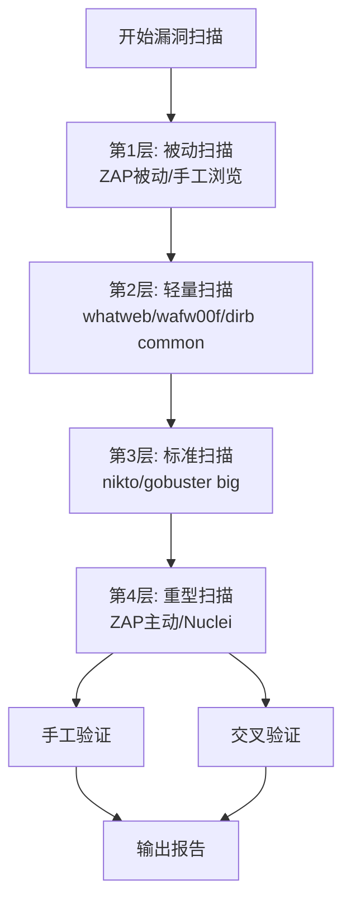
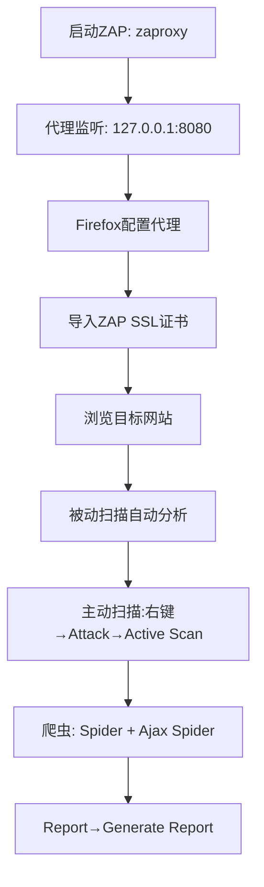

# 03-Web漏洞扫描与检测

## 目录
- [[#一、漏洞扫描方法论|一、漏洞扫描方法论]]
- [[#二、nikto服务器扫描器|二、nikto服务器扫描器]]
 - [[#2.1 基本命令|2.1 基本命令]]
 - [[#2.2 命令选项详解|2.2 命令选项详解]]
 - [[#2.3 输出格式与高级用法|2.3 输出格式与高级用法]]
- [[#三、wafw00f检测|三、wafw00f检测]]
- [[#四、OWASP ZAP综合代理扫描器|四、OWASP ZAP综合代理扫描器]]
 - [[#4.1 被动扫描|4.1 被动扫描]]
 - [[#4.2 主动扫描|4.2 主动扫描]]
 - [[#4.3 命令行模式|4.3 命令行模式]]
- [[#五、Nuclei模板扫描器|五、Nuclei模板扫描器]]
- [[#六、多扫描器对比实战|六、多扫描器对比实战]]
- [[#七、扫描器最佳实践|七、扫描器最佳实践]]

---

## 一、漏洞扫描方法论

漏洞扫描在渗透测试中的位置：

```
信息收集 → 漏洞扫描 → 漏洞利用 → 后渗透 → 报告
(模块02) (本模块) (模块4-7) (模块08)
```

参见 [[../网安基础知识/02-Web技术基础|Web技术基础]] 了解Web应用架构和漏洞类型基础。



**漏洞扫描原理：** 发送精心构造的请求 → 分析响应特征 → 匹配漏洞特征库 → 报告潜在漏洞。

**自动扫描 vs 手动验证：**
- 自动扫描：覆盖面广、速度快，但有误报
- 手动验证：精确度高，但效率低、覆盖不全
- 最佳实践：自动扫描先行发现候选漏洞，手动验证确认和利用

> **核心警告：** 扫描器会产生大量请求，极易触发WAF/IDS告警；某些扫描测试可能破坏数据；仅在授权环境中使用；不要同时运行多个重型扫描器对准同一目标；注意扫描时间窗口。

---

## 二、nikto服务器扫描器

nikto是开源Web服务器扫描器，能检测：超过6700个危险文件/CGI、超过1250个过时服务器版本、超过270个特定版本问题、服务器配置问题、不安全文件和程序。

### 2.1 基本命令

```bash
# 基本扫描
nikto -h http://testphp.vulnweb.com

# 指定端口
nikto -h http://example.com -p 8080

# SSL扫描
nikto -h https://example.com -ssl

# 带端口SSL
nikto -h https://example.com -p 8443

# 指定主机头（虚拟主机）
nikto -h 192.168.1.100 -vhost example.com
```

**输出示例解读：**
- `Server: nginx/1.19.0` — 服务器类型和版本
- `The anti-clickjacking X-Frame-Options header is not present.` — 安全头缺失
- `/admin/: This might be interesting...` — 发现敏感路径
- `/icons/: Directory indexing found.` — 目录索引开启
- `/phpinfo.php: PHP info page disclosure.` — PHP信息泄露

### 2.2 命令选项详解

```bash
# 设置超时 / 最大执行时间 / 请求间隔
nikto -h http://example.com -timeout 10
nikto -h http://example.com -maxtime 600
nikto -h http://example.com -Pause 2

# Tuning选项（多线程扫描分类）
nikto -h http://example.com -Tuning 123456789
# 1 = 文件上传注入 2 = 异常文件/CGI
# 3 = XSS 4 = 目录遍历
# 5 = 过时/默认文件 6 = 信息泄露
# 7 = 服务器配置问题 8 = 远程文件检索
# 9 = 拒绝服务（谨慎！） 0 = 全部

# 代理和认证
nikto -h http://example.com -useproxy http://127.0.0.1:8080
nikto -h http://example.com -id admin:password
nikto -h http://example.com -C "PHPSESSID=abc123; security=low"
```

### 2.3 输出格式与高级用法

```bash
# HTML / CSV / Text / XML 报告
nikto -h http://example.com -o report.html -Format html
nikto -h http://example.com -o report.csv -Format csv
nikto -h http://example.com -o report.txt -Format txt
nikto -h http://example.com -o report.xml -Format xml

# 组合示例
nikto -h http://testphp.vulnweb.com \
 -o nikto_testphp.html \
 -Format html \
 -Tuning 12345678 \
 -timeout 10 -no404

# 批量扫描 / 排除主机 / 更新数据库
nikto -h targets.txt -exclude 192.168.1.10
nikto -h http://example.com -dbcheck
```

---

## 三、wafw00f检测

WAF（Web应用防火墙）会拦截大部分自动化攻击。测试前必须先确定WAF存在与否及类型。

```bash
# 检测WAF
wafw00f http://example.com

# 详细输出 / 全部检测方法 / 批量
wafw00f -v http://example.com
wafw00f -a http://example.com
wafw00f -i targets.txt

# 代理 / UA / Cookie / JSON输出
wafw00f -p http://127.0.0.1:8080 http://example.com
wafw00f -H "User-Agent: Custom/1.0" http://example.com
wafw00f -c "PHPSESSID=abc123" http://example.com
wafw00f -o waf_result.json -f json http://example.com
```

wafw00f可识别超过150种WAF：Cloudflare, AWS WAF, Azure WAF, ModSecurity, Imperva, F5 BIG-IP, FortiWeb, Sucuri, Wordfence, Barracuda等。

**手工WAF检测技巧：**
1. 发送恶意payload：`?q=<script>alert(1)</script>` → 返回403/406
2. 检查响应头：X-CDN, X-WAF, Server头
3. 查看Set-Cookie：某些WAF会修改Cookie
4. 尝试SQL注入：`?id=1'` → 如果被拦截则确认WAF

---

## 四、OWASP ZAP综合代理扫描器

OWASP ZAP是世界使用最广泛的免费Web安全工具之一，结合了拦截代理、主动扫描器、被动扫描器、爬虫、Fuzzer。ArchStrike通过 `zaproxy` 命令启动。



### 4.1 被动扫描

ZAP被动扫描在浏览过程中自动进行，不发送额外请求：
- 检测缺失的安全头
- 发现信息泄露（Server头、注释中的敏感信息）
- 检测不安全的Cookie设置
- 识别已知漏洞的框架版本

操作：确保 "Passive Scan" 为绿色 → Firefox浏览目标 → ZAP Alerts标签查看结果 → 关注中/高危告警。

### 4.2 主动扫描

主动扫描会发送攻击性请求探测漏洞，更强大但更容易被检测。

操作：Sites面板右键目标URL → Attack → Active Scan → 选择Policy（Default Policy推荐） → Start Scan → 实时查看Alerts。

**Ajax Spider vs 传统Spider：**
- 传统Spider：处理静态HTML页面
- Ajax Spider：处理JavaScript渲染的动态页面（需要安装Firefox/Chrome）

### 4.3 命令行模式

```bash
# 快速扫描（无GUI）
zaproxy -cmd -quickurl http://example.com -quickprogress -quickout report.html

# 守护进程模式
zaproxy -daemon -port 8080

# 通过API进行扫描
curl 'http://localhost:8080/JSON/ascan/action/scan/?url=http://example.com'
```

---

## 五、Nuclei模板扫描器

Nuclei是基于YAML模板的高速漏洞扫描器，ArchStrike社区广泛使用，替代已停止维护的arachni和skipfish。

```bash
# 基本扫描
nuclei -u http://example.com

# 使用特定模板
nuclei -u http://example.com -t cves/ -t exposures/

# 批量扫描
nuclei -l targets.txt -o results.txt

# 指定模板目录
nuclei -u http://example.com -t /usr/share/nuclei-templates/
```

Nuclei优势：模板丰富（CVE、misconfig、exposures、default-logins）、速度快、可自定义YAML模板、社区活跃。**ArchStrike更新说明：arachni（已停止维护，请使用ZAP/Nuclei替代），skipfish（已停止维护，请使用ffuf/gobuster替代）。**

---

## 六、多扫描器对比实战

**实战：使用多种扫描器扫描testphp.vulnweb.com并对比结果**

```bash
# Step 1: 创建结果目录
mkdir /home/a/scan_results

# Step 2: nikto扫描
nikto -h http://testphp.vulnweb.com \
 -o /home/a/scan_results/nikto_report.html \
 -Format html -Tuning 12345678

# Step 3: wafw00f检测
wafw00f -v http://testphp.vulnweb.com \
 -o /home/a/scan_results/wafw00f_result.json -f json

# Step 4: ZAP扫描
# 4a: 启动ZAP: zaproxy
# 4b: Firefox代理到 127.0.0.1:8080
# 4c: 访问 http://testphp.vulnweb.com 浏览所有页面
# 4d: ZAP中右键目标 → Attack → Active Scan
# 4e: 扫描完成后 → Report → Generate HTML Report

# Step 5: Nuclei补充扫描
nuclei -u http://testphp.vulnweb.com -o /home/a/scan_results/nuclei_result.txt

# Step 6: dirb补充扫描
dirb http://testphp.vulnweb.com /usr/share/dirb/wordlists/common.txt \
 -X .php,.bak,.old,.txt,.zip,.sql \
 -o /home/a/scan_results/dirb_report.txt
```

**分析对比要点：**
1. 哪些漏洞被多个工具同时发现？（高置信度）
2. 哪些漏洞只被单一工具发现？（可能是误报）
3. nikto发现的服务器配置问题有哪些？
4. ZAP发现的输入验证漏洞有哪些？
5. 目录扫描发现的敏感路径有哪些？

对所有高危发现进行手工验证：使用curl或Firefox手动确认。

---

## 七、扫描器最佳实践

**扫描策略金字塔：**
1. **第1层：被动扫描**（ZAP被动、手工浏览）— 无风险，不产生额外流量
2. **第2层：轻量扫描**（whatweb, wafw00f, dirb common）— 低风险，请求量小
3. **第3层：标准扫描**（nikto, gobuster big）— 中等风险，可能触发告警
4. **第4层：重型扫描**（ZAP主动, Nuclei全模板）— 高风险，大量攻击性请求

**推荐扫描顺序：** nikto（快速配置检测）→ ZAP被动（浏览中收集）→ gobuster（路径发现）→ ZAP主动/Nuclei（深度扫描）

**常见问题：**
- **Q: 扫描器报告了大量误报如何处理？** A: 逐一手工验证高危/中危漏洞，使用多种工具交叉验证，分析上下文。
- **Q: 扫描速度太慢？** A: 增加并发数、选择最小字典、仅扫描关键路径、排除静态资源。
- **Q: 扫描器被WAF封禁IP？** A: 降低请求频率、使用代理轮换、分时段扫描、先识别WAF再定制扫描策略。

[[../总目录与快速查询|← 返回总目录]] | 上一模块：[[02-Web信息收集与侦察|02-Web信息收集与侦察]] | 下一模块：[[04-SQL注入攻击|04-SQL注入攻击]]
