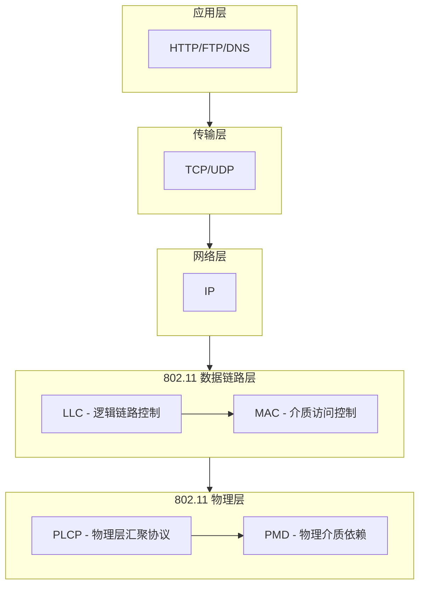
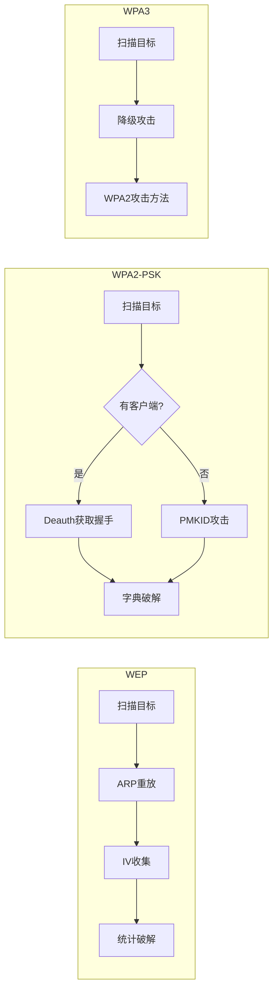
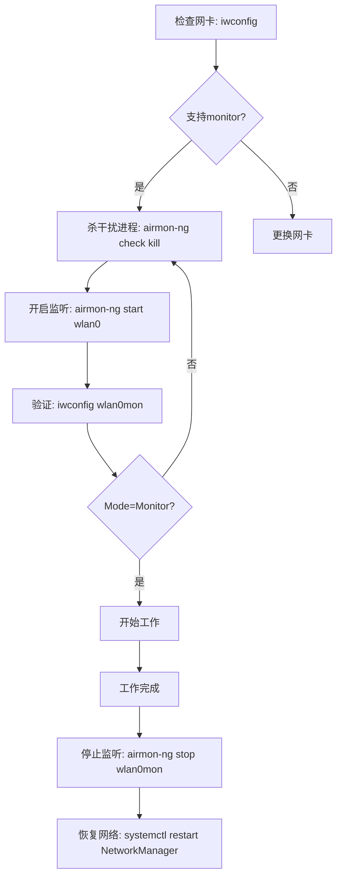

# 模块01：无线网络基础

> **学习目标**：理解802.11协议原理、掌握无线网卡配置、熟悉基础扫描操作
> **所需工具**：airmon-ng, iwconfig, iw, kismet

## 目录

- [[#一、802.11协议体系|802.11协议体系]]
- [[#二、无线安全协议演进|无线安全协议演进]]
- [[#三、802.11帧类型分析|802.11帧类型分析]]
- [[#四、WiFi信道与频谱|WiFi信道与频谱]]
- [[#五、无线网卡选择|无线网卡选择]]
- [[#六、监听模式原理|监听模式原理]]
- [[#七、网卡配置操作|网卡配置操作]]
- [[#八、Kismet简介|Kismet简介]]
- [[#九、实践操作|实践操作]]
- [[#十、法律声明|法律声明]]

---

## 一、802.11协议体系

### 1.1 什么是802.11？

IEEE 802.11是一组无线局域网(WLAN)标准，定义了无线通信的物理层(PHY)和MAC层协议。目前常见的协议版本包括：

| 协议 | 发布年份 | 频段 | 最大速率 | 调制方式 |
|------|----------|------|----------|----------|
| 802.11b | 1999 | 2.4 GHz | 11 Mbps | DSSS |
| 802.11a | 1999 | 5 GHz | 54 Mbps | OFDM |
| 802.11g | 2003 | 2.4 GHz | 54 Mbps | OFDM |
| 802.11n | 2009 | 2.4/5 GHz | 600 Mbps | MIMO-OFDM |
| 802.11ac | 2013 | 5 GHz | 6.9 Gbps | MU-MIMO |
| 802.11ax (WiFi 6/6E) | 2019 | 2.4/5/6GHz | 9.6 Gbps | OFDMA |

### 1.2 无线通信基本概念

- **调制 (Modulation)**：将数字信号转换为模拟无线电波
- **频段 (Band)**：2.4 GHz和5 GHz是最常用的WiFi频段
- **信道 (Channel)**：每个频段内细分的频率范围
- **带宽 (Bandwidth)**：20 MHz, 40 MHz, 80 MHz, 160 MHz
- **MIMO**：多天线同时收发，提升速率
- **信噪比 (SNR)**：信号质量的关键指标，越大越好

### 1.3 802.11协议栈架构



---

## 二、无线安全协议演进

### 2.1 WEP (Wired Equivalent Privacy)

- 1999年引入，已被完全淘汰
- 使用RC4对称加密算法
- 密钥长度：64位(40位实际密钥)或128位(104位实际密钥)
- **致命缺陷**：初始化向量(IV)只有24位，约1670万个可能值
- IV会重复使用 → 可以推导出密钥
- 攻击方式：ARP重放 + 统计攻击(PTW攻击)
- 破解时间：通常5-15分钟即可

### 2.2 WPA (WiFi Protected Access)

- 2003年发布，作为WEP的临时替代
- 仍使用RC4加密，但引入了TKIP(临时密钥完整性协议)
- TKIP为每个数据包生成不同的加密密钥
- 引入MIC(消息完整性校验码)防止篡改
- **致命缺陷**：TKIP仍可被攻击(Beck-Tews攻击、Ohigashi-Morii攻击)

### 2.3 WPA2 (WiFi Protected Access II)

- 2004年发布，当前最广泛使用的WiFi安全协议
- 引入AES-CCMP加密(基于AES对称加密)
- 强制要求4次握手(4-Way Handshake)
- 支持两种模式：
  - WPA2-Personal (PSK)：预共享密钥，家庭/小型办公室
  - WPA2-Enterprise (802.1X)：使用RADIUS服务器认证
- 已知攻击：字典攻击/暴力破解、PMKID攻击(2018)、KRACK攻击(2017)、Evil Twin攻击

### 2.4 WPA3 (WiFi Protected Access III)

- 2018年发布，新一代WiFi安全标准
- 引入SAE(对等实体同时认证)替代PSK
- SAE使用Dragonfly密钥交换，抗离线字典攻击
- 强制使用PMF(受保护的管理帧)
- 前向保密：即使PSK泄露，历史流量也无法解密
- 攻击面缩小但仍存在：Dragonblood漏洞(2019)、过渡模式降级攻击

### 2.5 安全协议攻击路径对比



---

## 三、802.11帧类型分析

802.11定义了三种帧类型：

### 3.1 管理帧 (Management Frames) - 类型编号：00

用于建立和维护无线连接：

| 帧子类型 | 编号 | 用途 |
|----------|------|------|
| Beacon信标帧 | 1000 | AP周期性广播，宣告网络存在 |
| Probe Request探测请求 | 0100 | 客户端主动搜索网络 |
| Probe Response探测响应 | 0101 | AP响应探测请求 |
| Authentication认证帧 | 1011 | 认证过程 |
| Deauthentication解除认证 | 1100 | 强制断开客户端(攻击常用) |
| Association Request关联 | 0000 | 客户端请求连接AP |
| Association Response | 0001 | AP响应关联请求 |
| Disassociation解除关联 | 1010 | 断开关联 |

> **关键点**：管理帧在WPA2之前无加密保护，可被伪造！

### 3.2 控制帧 (Control Frames) - 类型编号：01

用于控制数据传输和信道访问：
- RTS/CTS (Request to Send / Clear to Send)：信道预约
- ACK (Acknowledgment)：确认收到数据
- Block ACK Request/Response：块确认

### 3.3 数据帧 (Data Frames) - 类型编号：10

承载实际数据：
- Data：普通数据帧
- QoS Data：服务质量数据帧(WMM)
- Null Data：空数据帧(用来通知省电状态)

---

## 四、WiFi信道与频谱

### 4.1 2.4 GHz频段信道 (2412 MHz - 2484 MHz)

| 信道 | 频率 | 信道 | 频率 |
|------|------|------|------|
| 1 | 2412 MHz | 7 | 2442 MHz |
| 2 | 2417 MHz | 8 | 2447 MHz |
| 3 | 2422 MHz | 9 | 2452 MHz |
| 4 | 2427 MHz | 10 | 2457 MHz |
| 5 | 2432 MHz | 11 | 2462 MHz |
| 6 | 2437 MHz | 12-14 | 部分区域禁用 |

> **重要**：相邻信道重叠，互不干扰的信道组：1, 6, 11

### 4.2 5 GHz频段信道 (UNII频段)

- UNII-1: 36, 40, 44, 48 (5170-5250 MHz) 室内
- UNII-2: 52-64, 100-144 (5250-5725 MHz) DFS
- UNII-3: 149-165 (5725-5850 MHz) 室外

### 4.3 信道选择策略

- 使用信道1、6、11在2.4GHz可避免互扰
- 5GHz信道更多，干扰更少
- DFS信道需要使用DFS技术避开雷达

---

## 五、无线网卡选择

### 5.1 核心要求

无线安全测试对网卡有特殊要求，普通网卡无法完成大部分攻击：

| 特性 | 说明 |
|------|------|
| 监听模式 | 捕获空中所有802.11帧 |
| 数据包注入 | 主动发送自定义802.11帧 |
| 高功率发射 | 更好的信号覆盖和攻击效果 |
| 外接天线接口 | RP-SMA接口，可接定向天线 |
| 芯片驱动支持 | Linux内核驱动必须支持monitor/injection |

### 5.2 推荐芯片组

**优先推荐**：
- Atheros AR9271 — 最稳定，注入可靠
- Ralink RT3070 — 支持好，价格适中
- Ralink RT5370 — 常见USB网卡芯片
- Realtek RTL8812AU — 支持5GHz和802.11ac
- Realtek RTL8814AU — 高端芯片，5GHz强

**可用但不完美**：
- Realtek RTL8187 — 老旧芯片，仅2.4GHz
- MediaTek MT7612U — 需额外驱动

**不推荐**：
- Intel系列 — 监听模式支持有限
- Broadcom系列 — 驱动闭源，功能受限
- Qualcomm Atheros QCA6174 — 注入问题

### 5.3 推荐网卡型号

- Alfa AWUS036ACH (RTL8812AU, 双频AC1200)
- Alfa AWUS036NHA (Atheros AR9271, 2.4GHz)
- Alfa AWUS036NH (Ralink RT3070, 2.4GHz)
- TP-Link TL-WN722N v1 (Atheros AR9271, v2/v3不可用)
- Panda PAU09 (Ralink RT5572, 双频)

---

## 六、监听模式原理

### 6.1 工作模式对比

| 模式 | 管理(Managed) | 监听(Monitor) |
|------|--------------|---------------|
| 用途 | 普通客户端连接 | 安全测试/嗅探 |
| 连接AP | 可以 | 不可以 |
| 捕获帧 | 仅发给自己的 | 信道内所有帧 |
| 发送帧 | 正常 | 可注入任意帧 |
| 网卡MAC | 使用自身MAC | 可伪造MAC |
| 加密 | 参与加密 | 不参与加密 |

### 6.2 混杂模式 (Promiscuous Mode)

- 有线网卡概念，无线中含义不同
- 在无线中作用有限(802.11帧有MAC过滤器)
- 真正需要的是"监听模式"(Monitor Mode)

### 6.3 监听模式原理

- 网卡固件级切换，跳过MAC过滤
- 捕获所在信道上所有802.11帧
- 可以看到Probe Request, Beacon等管理帧
- 可以在不关联的情况下监听网络流量

---

## 七、网卡配置操作

### 7.1 检查无线网卡

列出所有无线接口：
```bash
sudo iwconfig
```

查看网卡详细能力：
```bash
iw list | grep -A 10 "Supported interface modes"
```

查看物理接口信息：
```bash
sudo iw dev
```

检查网卡驱动和芯片型号：
```bash
sudo airmon-ng
```

### 7.2 启用和配置监听模式

**方式一：使用airmon-ng (推荐)**
```bash
sudo airmon-ng check kill
sudo airmon-ng start wlan0
```

**方式二：使用iw命令**
```bash
sudo ip link set wlan0 down
sudo iw wlan0 set monitor control
sudo ip link set wlan0 up
```

**方式三：切换网卡信道**
```bash
sudo iw dev wlan0mon set channel 6
```

### 7.3 停止监听模式(恢复网卡)

```bash
sudo airmon-ng stop wlan0mon
sudo systemctl restart NetworkManager
```

### 7.4 监听模式切换流程



---

## 八、Kismet简介

### 8.1 核心功能

- 功能强大的无线网络探测器、入侵检测系统
- 被动扫描(不发送任何数据包)
- Web界面操作
- 支持GPS定位、数据导出
- 可检测隐藏SSID的AP

### 8.2 安装和启动

```bash
sudo pacman -S kismet
sudo kismet
# 访问 http://localhost:2501
```

### 8.3 基本操作

- 主仪表板：查看活跃设备数量、SSID列表
- 设备列表：所有检测到的WiFi设备和客户端
- 每个设备详情：MAC地址、制造商、信号强度、加密方式
- 数据导出：支持pcap、csv、kml等多种格式

---

## 九、实践操作

### 9.1 基础扫描练习

**Step 1**：检查无线网卡
```bash
sudo iwconfig
```
预期结果：看到wlan0(或类似)接口，Mode=Managed

**Step 2**：检查网卡是否支持监听模式
```bash
iw list | grep -A 10 "Supported interface modes"
```
预期结果：列表中包含"* monitor"

**Step 3**：杀死干扰进程
```bash
sudo airmon-ng check kill
```
注意：这将断开你的网络连接！

**Step 4**：启动监听模式
```bash
sudo airmon-ng start wlan0
```
预期结果：接口名变为wlan0mon

**Step 5**：验证监听模式
```bash
sudo iwconfig wlan0mon
```
预期结果：Mode=Monitor

**Step 6**：开始扫描周围WiFi
```bash
sudo airodump-ng wlan0mon
```

字段说明：
- **BSSID** — AP的MAC地址
- **PWR** — 信号强度(dBm)，越接近0越强
- **Beacons** — 收到的信标帧数量
- **#Data** — 数据帧数量
- **CH** — 信道
- **ENC** — 加密方式(WEP, WPA, WPA2, OPN)
- **CIPHER** — 加密算法(CCMP, TKIP)
- **ESSID** — 网络名称

下半部分显示连接的客户端：
- **STATION** — 客户端MAC地址
- **BSSID** — 关联的AP MAC
- **Probe** — 客户端探测的网络名

### 9.2 Kismet操作

**Step 1**：启动kismet
```bash
sudo kismet
```

**Step 2**：打开Web界面 — Firefox访问 `http://localhost:2501`

**Step 3**：观察界面
- 左上角：设备统计(AP数量、客户端数量)
- 中间：设备列表，按信号强度排序
- 右侧：选中设备的详细信息

**Step 4**：导出数据 — Kismet菜单 → Data Export → 选择格式(pcap) → Export

### 9.3 Wireshark帧分析

```bash
sudo airodump-ng wlan0mon -w practice01
# Ctrl+C 1分钟后停止
wireshark practice01-01.cap
```

Wireshark过滤器：
- `wlan.fc.type_subtype == 8` — 查看Beacon帧
- `wlan.fc.type_subtype == 4` — 查看Probe Request
- 展开802.11头部 → 查看各个字段

---

## 十、法律声明

> **法律警告**
> - 仅限在获得明确授权的网络环境中操作
> - 未经授权扫描他人WiFi网络属于违法行为
> - 本教程仅供安全教育和授权测试使用
> - 在中国大陆，WiFi破解和未授权访问受《网络安全法》约束

**技术注意事项**：
- 监听模式会断开当前WiFi连接
- `airmon-ng check kill`会终止网络管理进程
- 操作完成后务必使用 `airmon-ng stop` 恢复网卡
- 虚拟机中使用USB网卡需先在虚拟机设置中连接USB设备

**实验环境建议**：
- 使用自己的路由器搭建测试环境
- 准备至少一个支持监听模式的USB无线网卡
- 推荐在Arch Linux下操作(驱动支持最好, ArchStrike预装所有工具)

---

## 课后练习

1. 用自己的语言解释802.11管理帧、控制帧、数据帧的区别
2. 对比WEP、WPA、WPA2、WPA3的安全机制差异
3. 在Wireshark中识别至少5种不同的802.11帧类型
4. 列出你扫描到的5个AP，记录BSSID、信道、加密方式、信号强度
5. 使用iw list确认你的网卡支持哪些功能模式
6. 解释为什么2.4GHz信道1、6、11之间不会互相干扰

---

> **相关模块**：[[02-无线侦察与扫描|无线侦察]] | [[03-WEP破解|WEP破解]] | [[04-WPA-WPA2破解|WPA2破解]]

[[../总目录与快速查询|← 返回总目录]]
