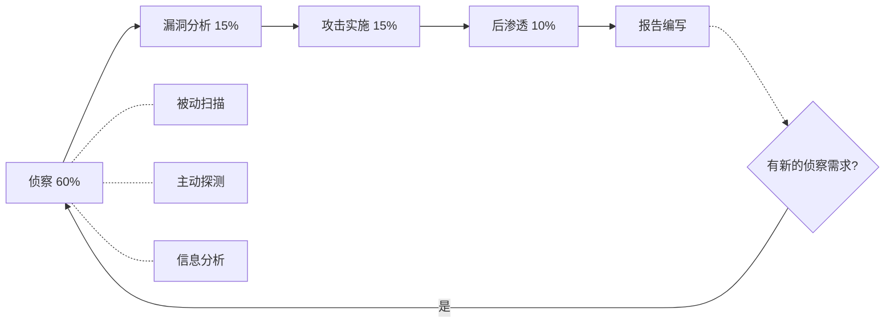
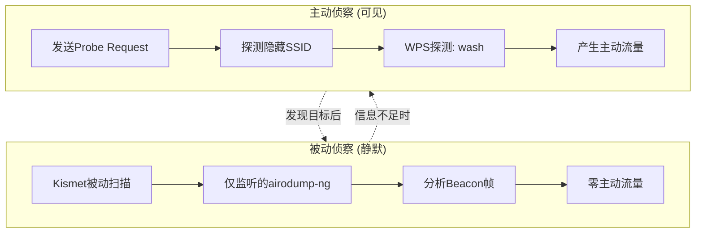
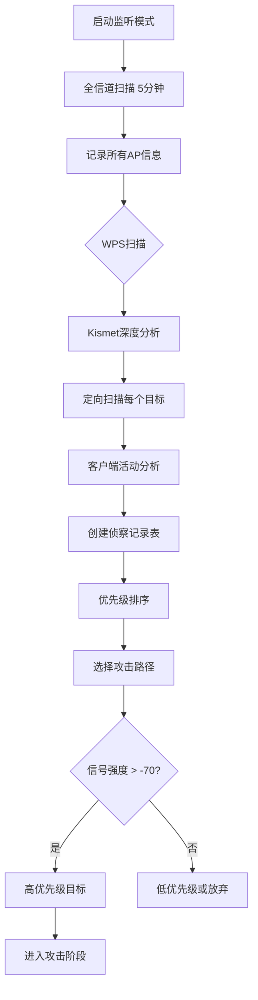
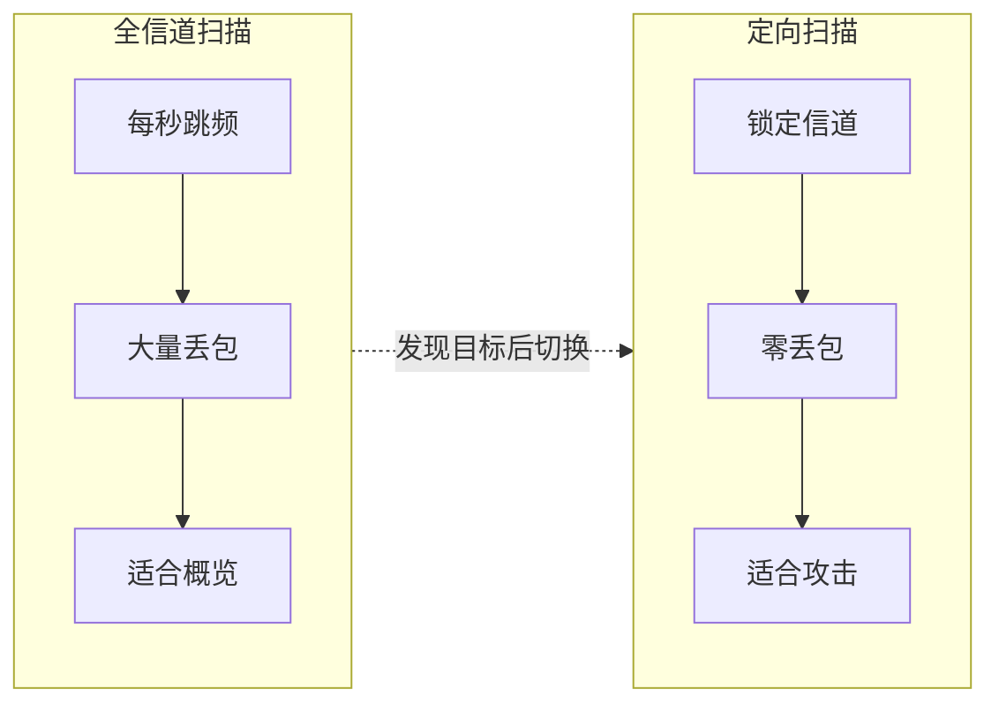

# 模块02：无线侦察与扫描

> **学习目标**：全面侦察无线环境，使用kismet和aircrack-ng进行深入信息收集
> **所需工具**：kismet, airmon-ng, airodump-ng, wash

## 目录

- [[#一、侦察方法论|侦察方法论]]
- [[#二、Kismet深度使用|Kismet深度使用]]
- [[#三、Aircrack-ng侦察套件|Aircrack-ng侦察套件]]
- [[#四、侦察流程与记录|侦察流程与记录]]
- [[#五、实践操作|实践操作]]
- [[#六、数据分析技巧|数据分析技巧]]

---

## 一、侦察方法论

### 1.1 侦察在渗透测试中的地位

无线渗透测试的完整流程中，侦察占据60%的时间：



为什么侦察如此重要？
- 确定目标网络的加密方式和配置
- 评估信号覆盖范围
- 识别活跃客户端数量和时间规律
- 发现隐藏SSID的网络
- 找出WPS状态
- 为后续攻击策略选择提供依据

### 1.2 信息收集清单

每次侦察应记录以下信息：

| 项目 | 说明 |
|------|------|
| BSSID | AP的MAC地址 |
| ESSID | 网络名称(SSID) |
| 信道 | 无线信道编号 |
| 加密类型 | WEP/WPA/WPA2/WPA3/OPN |
| 加密算法 | CCMP/TKIP/WEP |
| 信号强度 | dBm值 |
| 客户端数量 | 当前关联的设备数 |
| WPS状态 | 是否开启WPS及芯片厂商 |
| 认证方式 | PSK/MGT(企业)/SAE |
| 制造商 | OUI查询结果 |
| 备注 | 活跃时间、客户端行为等 |

### 1.3 被动侦察 vs 主动侦察



---

## 二、Kismet深度使用

### 2.1 Kismet核心功能

Kismet是一款功能极其丰富的无线网络探测器：

- 完全被动扫描(不发送任何探询包，完全静默)
- 跨平台(Linux, macOS, Windows WSL)
- 可检测多种无线协议(WiFi, Bluetooth, Zigbee, SDR)
- 支持分布式部署(多传感器)
- GPS集成(可用于War Driving)
- 丰富的插件系统
- REST API接口
- 数据日志和导出

### 2.2 启动Kismet

基本启动(自动检测无线接口)：
```bash
sudo kismet
```

指定接口启动：
```bash
sudo kismet -c wlan0
```

多接口同时监听(多频段)：
```bash
sudo kismet -c wlan0 -c wlan1
```

启动时自动记录日志：
```bash
sudo kismet -c wlan0 --log-prefix /path/to/logs/
```

### 2.3 Kismet Web界面详解

访问地址：`http://localhost:2501`

界面区域划分：

① **顶部菜单栏**
- Dashboard(仪表板) — 概览页面
- Devices(设备) — 所有检测到的设备列表
- Alerts(警报) — 安全告警信息
- Data Sources(数据源) — 无线接口状态
- Settings(设置) — Kismet配置

② **仪表板区域**
- 活跃设备计数(New, Total, Active)
- 设备类型饼图(WiFi AP, WiFi Client, Bluetooth...)
- 信号强度分布图
- 实时设备发现事件流

③ **设备列表页**

| 列名 | 说明 |
|------|------|
| Type | 设备类型(Wi-Fi AP/Client/BT等) |
| Signal | 当前信号强度 |
| First Seen | 首次发现时间 |
| Last Seen | 最近活跃时间 |
| Name | 设备名称/SSID |
| MAC | 设备MAC地址 |

### 2.4 Kismet高级功能

**GPS集成(War Driving)**：
```bash
sudo kismet -c wlan0 --use-gpsd
```

**远程访问Web界面**：
```bash
sudo kismet -c wlan0 --no-httpd-bind-addr
# 然后通过 SSH 隧道: ssh -L 2501:localhost:2501 user@remote
```

**REST API查询**：
```bash
curl http://localhost:2501/devices/views/all_devices.json
```

---

## 三、Aircrack-ng侦察套件

### 3.1 airmon-ng — 网卡监听模式管理

基本命令一览：
```bash
sudo airmon-ng              # 列出无线接口
sudo airmon-ng check         # 检查干扰进程
sudo airmon-ng check kill    # 杀死干扰进程
sudo airmon-ng start wlan0   # 启动监听模式
sudo airmon-ng stop wlan0mon # 停止监听模式
```

### 3.2 airodump-ng — 核心扫描工具

#### 3.2.1 全信道扫描(快速概览)

```bash
sudo airodump-ng wlan0mon
```

执行效果：
- 网卡在2.4GHz或5GHz之间跳跃
- 每秒切换一次信道
- 显示所有捕获到的AP和客户端
- 适合初步侦察，了解环境全貌

**局限性**：数据包捕获不完整(频繁跳频导致丢失大量数据包)、信号读数不稳定、不能用于捕获握手包。

#### 3.2.2 定向扫描(锁定信道，推荐用于攻击)

命令格式：
```bash
sudo airodump-ng -c <CH> --bssid <BSSID> -w <prefix> wlan0mon
```

参数详解：

| 参数 | 说明 |
|------|------|
| -c \<N\> | 锁定信道(1-14为2.4GHz, 36-165为5GHz) |
| --bssid | 仅监听特定AP(过滤MAC) |
| -w \<前缀\> | 保存捕获数据到文件(前缀-01.cap等) |
| --essid | 过滤特定SSID |
| --output-format | 输出格式(pcap, ivs, csv, gps, kismet, netxml) |
| -a | 仅显示特定加密类型的AP(WEP/WPA/WPA2) |
| --encrypt | 按加密类型过滤 |

示例——定向监听信道6上特定AP并保存数据：
```bash
sudo airodump-ng -c 6 --bssid AA:BB:CC:DD:EE:FF -w target_cap wlan0mon
```

#### 3.2.3 显示信息解读

**上方表格 — AP信息**：

| 字段 | 说明 |
|------|------|
| PWR | 信号强度，单位dBm，-30最强，-90最弱 |
| RXQ | 接收质量百分比(100=完美) |
| Beacons | 捕获的信标帧总数 |
| #Data | 捕获的数据帧总数 |
| #/s | 每秒数据帧速率 |
| CH | 信道 |
| ENC | 加密协议：OPN(开放), WEP, WPA, WPA2, WPA3 |
| CIPHER | 加密算法：CCMP, TKIP, WEP, CCMP+TKIP |
| AUTH | 认证方式：MGT(企业), PSK(预共享密钥), SAE(WPA3) |

**下方表格 — 关联客户端**：

| 字段 | 说明 |
|------|------|
| STATION | 客户端MAC地址 |
| (Not Associated) | 客户端未关联任何AP(但正在发送Probe Request) |
| Probe列 | 客户端正在搜索的网络名 |

#### 3.2.4 airodump-ng高级过滤

仅显示WPA加密的AP：
```bash
sudo airodump-ng wlan0mon --encrypt WPA
```

仅显示特定厂商MAC的AP：
```bash
sudo airodump-ng wlan0mon | grep -E "XX:XX:XX"
```

输出为CSV格式以便后续分析：
```bash
sudo airodump-ng wlan0mon --output-format csv -w scan_output
```

### 3.3 besside-ng — 多目标自动扫描

besside-ng自动扫描并收集WPA握手，适合批量操作：
```bash
sudo besside-ng -c 6 -b AA:BB:CC:DD:EE:FF wlan0mon
```

### 3.4 wash — WPS扫描工具

WPS(WiFi Protected Setup)是重要的攻击向量：

基本扫描：
```bash
sudo wash -i wlan0mon
```

带详细输出(Pixie Dust检测)：
```bash
sudo wash -i wlan0mon -a
```

输出关键字段：
- **WPS** — Yes=支持WPS, No=不支持, Lck=已锁定
- **Lck** — WPS是否锁定(多次失败后锁定)
- **Vendor** — 芯片厂商(不同厂商WPS实现安全性不同)

指定具体信道扫描：
```bash
sudo wash -i wlan0mon -c 6 -a
```

> 注意：新版wash已整合到reaver-wps-fork-t6x包中，支持Pixie Dust漏洞检测。

---

## 四、侦察流程与记录

### 4.1 标准侦察流程(SOP)



### 4.2 创建侦察记录表

| ID | BSSID | ESSID | CH | ENC | PWR | WPS | Client | 优先级 |
|----|-------|-------|----|-----|-----|-----|--------|--------|
| 1 | AA:BB:CC:DD:EE:FF | Target_WiFi | 6 | WPA2 | -45 | Yes | 3 | 高 |
| 2 | 11:22:33:44:55:66 | Office_5G | 149 | WPA2 | -60 | No | 2 | 中 |
| 3 | 77:88:99:AA:BB:CC | Guest_Net | 1 | OPN | -75 | N/A | 0 | 低 |

**优先级评估标准**：
- 高优先级：信号强 + WPA2-PSK + 有客户端 + WPS开启
- 中优先级：信号中等 + WPA2-PSK + 无客户端但有PMKID可能
- 低优先级：信号弱或仅开放网络

---

## 五、实践操作

### 5.1 全信道扫描

```bash
sudo airmon-ng check kill
sudo airmon-ng start wlan0
sudo iwconfig wlan0mon | grep Mode  # 验证Mode:Monitor
sudo airodump-ng wlan0mon
```

运行5分钟，观察并记录：
- 有几个AP？
- 分别使用什么加密方式？
- 哪个AP信号最强？
- 有没有WEP加密的？
- 哪些AP有客户端连接？

### 5.2 定向深度扫描

选择信号最强且加密为WPA2的目标AP：

```bash
sudo airodump-ng -c 6 --bssid AA:BB:CC:DD:EE:FF -w deep_scan wlan0mon
```

保持15分钟观察，记录：
- 是否有新客户端关联
- 客户端活跃时间段
- 客户端MAC制造商信息
- #Data列的增速
- #/s 每秒包数

### 5.3 Kismet操作练习

```bash
sudo airmon-ng stop wlan0mon  # 恢复Managed模式
sudo kismet -c wlan0
# 访问 http://localhost:2501
```

操作练习：
a) 在主仪表板观察设备发现过程
b) 进入Devices页面，按信号强度排序
c) 使用搜索过滤 "wifi.ap" 仅查看AP
d) 使用搜索过滤 "wifi.client" 仅查看客户端
e) 点击一个AP，查看Wi-Fi Info详情
f) 查看该AP的Clients标签，观察关联设备
g) 导出数据：菜单 → Export → PCAP

### 5.4 WPS扫描

```bash
sudo airmon-ng start wlan0
sudo wash -i wlan0mon -a
```

### 5.5 Wifite自动侦察

```bash
sudo wifite                    # 全面扫描
sudo wifite --wpa              # 仅WPA目标
sudo wifite --wps              # 仅WPS目标
sudo wifite --wep              # 仅WEP目标
```

---

## 六、数据分析技巧

### 6.1 信号强度分析

- -30 dBm ~ -50 dBm：极佳，近距离
- -50 dBm ~ -70 dBm：良好，中等距离
- -70 dBm ~ -80 dBm：一般，适合攻击
- -80 dBm ~ -90 dBm：较差，攻击成功率低
- < -90 dBm：很难建立可靠连接

### 6.2 MAC地址分析(OUI)

| OUI前缀 | 典型制造商 |
|---------|------------|
| 00:14:xx | Cisco |
| 00:1A:xx | D-Link |
| 00:1F:xx | TP-Link |
| B8:27:xx | Raspberry Pi |
| C0:xx:xx | 较新设备 |

### 6.3 Beacon帧分析要点

- Beacon Interval ~100ms是正常的
- 太短或太长可能是恶意AP
- 查看RSN IE中的认证套件和加密套件
- 查看WPS IE确认是否支持WPS

### 6.4 数据包捕获效率对比



---

## 课后练习

1. 用Kismet扫描30分钟，导出数据，分析你环境中的WiFi密度
2. 对比airodump-ng全信道和定向扫描的数据包捕获量差异
3. 使用Wireshark分析Beacon帧中包含的所有信息元素(IE)
4. 编写一个简单的shell脚本，自动执行侦察流程
5. 研究至少3种不同制造商AP的WPS实现差异
6. 记录你的侦察数据表，标注每个目标的攻击优先级和理由

---

> **相关模块**：[[01-无线网络基础|无线基础]] | [[03-WEP破解|WEP破解]] | [[04-WPA-WPA2破解|WPA2破解]] | [[05-WPS攻击|WPS攻击]]

[[../总目录与快速查询|← 返回总目录]]
